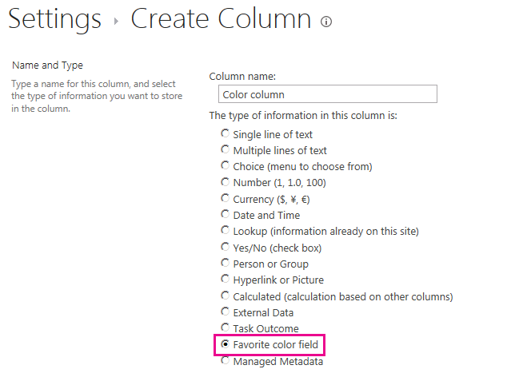

# <a name="customize-a-field-type-using-client-side-rendering"></a><span data-ttu-id="1f3bc-102">Настройка типа поля, с использованием обработки на стороне клиента</span><span class="sxs-lookup"><span data-stu-id="1f3bc-102">Customize a field type using client-side rendering</span></span>

<span data-ttu-id="1f3bc-103">Узнайте, как настроить тип поля с помощью технологии клиентской обработки в SharePoint.</span><span class="sxs-lookup"><span data-stu-id="1f3bc-103">Learn how to customize a field type by using the client-side rendering technology in SharePoint.</span></span>
<span data-ttu-id="1f3bc-104">Клиентская обработка механизм, которые можно использовать для создания собственных вывода для набора элементов управления, которые размещены на странице SharePoint.</span><span class="sxs-lookup"><span data-stu-id="1f3bc-104">Client-side rendering provides a mechanism that you can use to produce your own output for a set of controls that are hosted in a SharePoint page.</span></span> <span data-ttu-id="1f3bc-105">Этот механизм позволяет использовать хорошо известных технологий, таких как HTML и JavaScript, определение логики визуализации настраиваемых типов полей.</span><span class="sxs-lookup"><span data-stu-id="1f3bc-105">This mechanism enables you to use well-known technologies, such as HTML and JavaScript, to define the rendering logic of custom field types.</span></span> <span data-ttu-id="1f3bc-106">В обработки на стороне клиента можно указать ресурсов JavaScript и их размещать в доступных вариантов хранилищ данных решения фермы, такие как папке _layouts.</span><span class="sxs-lookup"><span data-stu-id="1f3bc-106">In client-side rendering you can specify your own JavaScript resources and host them in the data storage options available to your farm solution, such as the _layouts folder.</span></span>

## <a name="prerequisites-for-using-the-examples-in-this-article"></a><span data-ttu-id="1f3bc-107">Предварительные требования для использования примеров в этой статье</span><span class="sxs-lookup"><span data-stu-id="1f3bc-107">Prerequisites for using the examples in this article</span></span>
<span data-ttu-id="1f3bc-108"><a name="SP15CustomizeafieldtypeusingCSR_Prereq"> </a></span><span class="sxs-lookup"><span data-stu-id="1f3bc-108"><a name="SP15CustomizeafieldtypeusingCSR_Prereq"> </a></span></span>

<span data-ttu-id="1f3bc-109">Для выполнения действий, описанных в этом примере, вам необходимо следующее:</span><span class="sxs-lookup"><span data-stu-id="1f3bc-109">To follow the steps in this example, you need the following:</span></span>
  
    
    

- <span data-ttu-id="1f3bc-110">Microsoft Visual Studio 2012</span><span class="sxs-lookup"><span data-stu-id="1f3bc-110">Microsoft Visual Studio 2012</span></span>
    
  
- <span data-ttu-id="1f3bc-111">Инструменты разработчика Office для Visual Studio 2012</span><span class="sxs-lookup"><span data-stu-id="1f3bc-111">Office Developer Tools for Visual Studio 2012</span></span>
    
  
- <span data-ttu-id="1f3bc-112">Среда разработки SharePoint</span><span class="sxs-lookup"><span data-stu-id="1f3bc-112">A SharePoint development environment</span></span>
    
  
<span data-ttu-id="1f3bc-113">Сведения о настройке среды разработки SharePoint видеть [настроить среду разработки, общие для SharePoint](set-up-a-general-development-environment-for-sharepoint.md).</span><span class="sxs-lookup"><span data-stu-id="1f3bc-113">For information about setting up your SharePoint development environment, see  [Set up a general development environment for SharePoint](set-up-a-general-development-environment-for-sharepoint.md).</span></span>
  
    
    

### <a name="core-concepts-to-help-you-understand-client-side-rendering-for-field-types"></a><span data-ttu-id="1f3bc-114">Основные понятия, которые помогут вам понять обработки на стороне клиента для типов полей</span><span class="sxs-lookup"><span data-stu-id="1f3bc-114">Core concepts to help you understand client-side rendering for field types</span></span>

<span data-ttu-id="1f3bc-115">В следующей таблице приведены полезные статьи, которые помогут изучить основные понятия и этапы, входящие в сценарий дополнительного действия.</span><span class="sxs-lookup"><span data-stu-id="1f3bc-115">The following table lists useful articles that can help you understand the concepts and steps that are involved in a custom action scenario.</span></span>
  
    
    

<span data-ttu-id="1f3bc-116">**В таблице 1. Основные понятия, которые для обработки на стороне клиента для типов полей**</span><span class="sxs-lookup"><span data-stu-id="1f3bc-116">**Table 1. Core concepts for client-side rendering for field types**</span></span>


|<span data-ttu-id="1f3bc-117">**Заголовок статьи**</span><span class="sxs-lookup"><span data-stu-id="1f3bc-117">**Article title**</span></span>|<span data-ttu-id="1f3bc-118">**Описание**</span><span class="sxs-lookup"><span data-stu-id="1f3bc-118">**Description**</span></span>|
|:-----|:-----|
| [<span data-ttu-id="1f3bc-119">Создавайте решения фермы в SharePoint</span><span class="sxs-lookup"><span data-stu-id="1f3bc-119">Build farm solutions in SharePoint</span></span>](build-farm-solutions-in-sharepoint.md) <br/> |<span data-ttu-id="1f3bc-120">Сведения о разработке, упаковки и развертывания административные расширения для SharePoint с использованием решений фермы.</span><span class="sxs-lookup"><span data-stu-id="1f3bc-120">Learn about developing, packaging, and deploying administrative extensions to SharePoint using farm solutions.</span></span>  <br/> |
| [<span data-ttu-id="1f3bc-121">Настраиваемые типы полей</span><span class="sxs-lookup"><span data-stu-id="1f3bc-121">Custom Field Types</span></span>](http://msdn.microsoft.com/en-us/library/ms446361.aspx) <br/> |<span data-ttu-id="1f3bc-122">Сведения о создании настраиваемых типов полей.</span><span class="sxs-lookup"><span data-stu-id="1f3bc-122">Learn about creating custom field types.</span></span> <span data-ttu-id="1f3bc-123">Как бизнес-информация хранится в SharePoint, может быть значениями времени, когда данные не соответствует типов полей, доступных в SharePoint FoundationOr, могут только что необходимо настроить эти типы полей.</span><span class="sxs-lookup"><span data-stu-id="1f3bc-123">As you store your business information in SharePoint, there may be times when your data does not conform to the field types that are available in SharePoint FoundationOr, you might just want to customize those field types.</span></span> <span data-ttu-id="1f3bc-124">Настраиваемые поля могут быть проверки пользовательских данных и визуализации настраиваемых полей.</span><span class="sxs-lookup"><span data-stu-id="1f3bc-124">Custom fields can include custom data validation and custom field rendering.</span></span>  <br/> |
   

## <a name="code-example-customize-the-rendering-process-for-a-custom-field-type-in-a-view-form"></a><span data-ttu-id="1f3bc-125">Пример кода: настраивать процесс визуализации для настраиваемого типа поля в форме просмотра</span><span class="sxs-lookup"><span data-stu-id="1f3bc-125">Code example: Customize the rendering process for a custom field type in a view form</span></span>
<span data-ttu-id="1f3bc-126"><a name="SP15CustomizeafieldtypeusingCSR_Codeexample"> </a></span><span class="sxs-lookup"><span data-stu-id="1f3bc-126"><a name="SP15CustomizeafieldtypeusingCSR_Codeexample"> </a></span></span>

<span data-ttu-id="1f3bc-127">Выполните следующие действия, чтобы настроить процесс визуализации для настраиваемого типа поля.</span><span class="sxs-lookup"><span data-stu-id="1f3bc-127">Follow these steps to customize the rendering process for a custom field type:</span></span>
  
    
    

1. <span data-ttu-id="1f3bc-128">Создание проекта решение фермы.</span><span class="sxs-lookup"><span data-stu-id="1f3bc-128">Create the farm solution project.</span></span>
    
  
2. <span data-ttu-id="1f3bc-129">Добавление класса для настраиваемого типа поля.</span><span class="sxs-lookup"><span data-stu-id="1f3bc-129">Add a class for the custom field type.</span></span>
    
  
3. <span data-ttu-id="1f3bc-130">Добавление XML-определения типа настраиваемого поля.</span><span class="sxs-lookup"><span data-stu-id="1f3bc-130">Add an XML definition for the custom field type.</span></span>
    
  
4. <span data-ttu-id="1f3bc-131">Добавьте файл JavaScript для визуализации логики типа настраиваемого поля.</span><span class="sxs-lookup"><span data-stu-id="1f3bc-131">Add a JavaScript file for the rendering logic of the custom field type.</span></span>
    
  
<span data-ttu-id="1f3bc-132">На рисунке 1 показано представление формы с типом визуализации настраиваемого поля.</span><span class="sxs-lookup"><span data-stu-id="1f3bc-132">Figure 1 shows a view form with a custom-rendered field type.</span></span>
  
    
    

<span data-ttu-id="1f3bc-133">**На рисунке 1. Поле в форме представления, отображаемое на настраиваемых на стороне клиента**</span><span class="sxs-lookup"><span data-stu-id="1f3bc-133">**Figure 1. Custom client-side rendered field in a view form**</span></span>

  
    
    

  
    
    
  
  
    
    

### <a name="to-create-the-farm-solution-project"></a><span data-ttu-id="1f3bc-135">Создание проекта решение фермы</span><span class="sxs-lookup"><span data-stu-id="1f3bc-135">To create the farm solution project</span></span>


1. <span data-ttu-id="1f3bc-136">Откройте Visual Studio 2012 как администратор (щелкните правой кнопкой мыши значок Visual Studio 2012 в меню **Пуск** и выберите **Запуск от имени администратора** ).</span><span class="sxs-lookup"><span data-stu-id="1f3bc-136">Open Visual Studio 2012 as administrator (right-click the Visual Studio 2012 icon in the **Start** menu, and then choose **Run as administrator** ).</span></span>
    
  
2. <span data-ttu-id="1f3bc-137">Создайте новый проект с помощью шаблона **Проекта SharePoint**</span><span class="sxs-lookup"><span data-stu-id="1f3bc-137">Create a new project using the **SharePoint Project** template</span></span>
    
    <span data-ttu-id="1f3bc-138">На рисунке 2 показано расположение шаблона **Проекта SharePoint** в Visual Studio 2012, в области **Шаблоны**, **Visual C#**, **Office SharePoint**, **Решений SharePoint**.</span><span class="sxs-lookup"><span data-stu-id="1f3bc-138">Figure 2 shows the location of the **SharePoint Project** template in Visual Studio 2012, under **Templates**, **Visual C#**, **Office SharePoint**, **SharePoint Solutions**.</span></span>
    

   <span data-ttu-id="1f3bc-139">**На рисунке 2. Шаблон проекта Visual Studio SharePoint**</span><span class="sxs-lookup"><span data-stu-id="1f3bc-139">**Figure 2. SharePoint project Visual Studio template**</span></span>

  

  
  

  

  
3. <span data-ttu-id="1f3bc-141">Предоставьте URL-адрес веб-сайта SharePoint, который планируется использовать для отладки.</span><span class="sxs-lookup"><span data-stu-id="1f3bc-141">Provide the URL of the SharePoint website that you want to use for debugging.</span></span>
    
  
4. <span data-ttu-id="1f3bc-142">Выберите параметр **Развернуть как решение фермы**.</span><span class="sxs-lookup"><span data-stu-id="1f3bc-142">Select the **Deploy as a farm solution** option.</span></span>
    
  

### <a name="to-add-a-class-for-the-custom-field-type"></a><span data-ttu-id="1f3bc-143">Добавление класса для настраиваемого типа поля</span><span class="sxs-lookup"><span data-stu-id="1f3bc-143">To add a class for the custom field type</span></span>


1. <span data-ttu-id="1f3bc-p103">Щелкните правой кнопкой мыши проект решение фермы и добавьте новый класс. Имя файла класса FavoriteColorFieldType.cs.</span><span class="sxs-lookup"><span data-stu-id="1f3bc-p103">Right-click the farm solution project and add a new class. Name the class file FavoriteColorFieldType.cs.</span></span>
    
  
2. <span data-ttu-id="1f3bc-p104">Скопируйте следующий код и вставьте его в файле FavoriteColorFieldType.cs. Код выполняет следующие задачи:</span><span class="sxs-lookup"><span data-stu-id="1f3bc-p104">Copy the following code and paste it in the FavoriteColorFieldType.cs file. The code performs the following tasks:</span></span>
    
  - <span data-ttu-id="1f3bc-148">Объявляет **FavoriteColorField** класса, наследуемого от **SPFieldText**.</span><span class="sxs-lookup"><span data-stu-id="1f3bc-148">Declares a **FavoriteColorField** class that inherits from **SPFieldText**.</span></span>
    
  
  - <span data-ttu-id="1f3bc-149">Предоставляет два конструктора для класса **FavoriteColorField**.</span><span class="sxs-lookup"><span data-stu-id="1f3bc-149">Provides two constructors for the **FavoriteColorField** class.</span></span>
    
  
  - <span data-ttu-id="1f3bc-150">Переопределяет свойство **JSLink**.</span><span class="sxs-lookup"><span data-stu-id="1f3bc-150">Overrides the **JSLink** property.</span></span>
    
    > <span data-ttu-id="1f3bc-151">**Примечание:** Перечислены JSLink, свойство не поддерживается в опросе или событий.</span><span class="sxs-lookup"><span data-stu-id="1f3bc-151">**Note:** The JSLink property is not supported on Survey or Events lists.</span></span> <span data-ttu-id="1f3bc-152">Календарь SharePoint — это список событий.</span><span class="sxs-lookup"><span data-stu-id="1f3bc-152">A SharePoint calendar is an Events list.</span></span> 

```cs
using System;
using System.Collections.Generic;
using System.Linq;
using System.Text;
using System.Threading.Tasks;

// Additional references for this sample.
using Microsoft.SharePoint;
using Microsoft.SharePoint.WebControls;

namespace Microsoft.SDK.SharePoint.Samples.WebControls
{
    /// <summary>
    /// The FavoriteColorField custom field type 
    /// inherits from SPFieldText.
    /// Users can input the color in the field 
    /// just like in any other text field.
    /// But the field will provide additional 
    /// rendering logic when displaying 
    /// the field in a view form.
    /// </summary>
    public class FavoriteColorField : SPFieldText
    {
        // The solution deploys the JavaScript 
        // file to the CSRAssets folder 
        // in the WFE's layouts folder.
        private const string JSLinkUrl = 
            "~site/_layouts/15/CSRAssets/CSRFieldType.js";

        // You have to provide constructors for SPFieldText.
        public FavoriteColorField(
            SPFieldCollection fields, 
            string name) :
            base(fields, name)
        {

        }
        public FavoriteColorField(
            SPFieldCollection fields, 
            string typename, 
            string name) :
            base(fields, typename, name)
        {

        }

        /// <summary>
        /// Override the JSLink property to return the 
        /// value of our custom JavaScript file.
        /// </summary>
        public override string JSLink
        {
            get
            {
                return JSLinkUrl;
            }
            set
            {
                base.JSLink = value;
            }
        }
    }
}            
```


### <a name="to-add-an-xml-definition-for-the-custom-field-type"></a><span data-ttu-id="1f3bc-153">Добавление XML-определения типа настраиваемого поля</span><span class="sxs-lookup"><span data-stu-id="1f3bc-153">To add an XML definition for the custom field type</span></span>


1. <span data-ttu-id="1f3bc-p106">Щелкните правой кнопкой мыши проект решение фермы и Добавление сопоставленной папки SharePoint. В диалоговом окне выберите папку **{SharePointRoot} \\Template\\XML**.</span><span class="sxs-lookup"><span data-stu-id="1f3bc-p106">Right-click the farm solution project, and add a SharePoint mapped folder. In the dialog box, select the **{SharePointRoot}\\Template\\XML** folder.</span></span>
    
  
2. <span data-ttu-id="1f3bc-p107">Щелкните правой кнопкой мыши папку XML, созданные на предыдущем этапе и добавьте новый XML-файл. Имя XML-код файла fldtypes_FavoriteColorFieldType.xml.</span><span class="sxs-lookup"><span data-stu-id="1f3bc-p107">Right-click the XML folder created in the last step, and add a new XML file. Name the XML file fldtypes_FavoriteColorFieldType.xml.</span></span>
    
  
3. <span data-ttu-id="1f3bc-p108">Скопируйте следующую разметку и вставьте его в XML-файле. Разметка выполняет следующие задачи:</span><span class="sxs-lookup"><span data-stu-id="1f3bc-p108">Copy the following markup, and paste it in the XML file. The markup performs the following tasks:</span></span>
    
  - <span data-ttu-id="1f3bc-160">Содержит имя типа для типа поля.</span><span class="sxs-lookup"><span data-stu-id="1f3bc-160">Provides type name for the field type.</span></span>
    
  
  - <span data-ttu-id="1f3bc-p109">Задает полное имя класса для типа поля. Это класс, созданный в предыдущей процедуре.</span><span class="sxs-lookup"><span data-stu-id="1f3bc-p109">Specifies the full class name for the field type. This is the class you created in the previous procedure.</span></span>
    
  
  - <span data-ttu-id="1f3bc-163">Содержит дополнительные атрибуты для типа поля.</span><span class="sxs-lookup"><span data-stu-id="1f3bc-163">Provides additional attributes for the field type.</span></span>
    
  
```XML
    <?xml version="1.0" encoding="utf-8" ?>
    <FieldTypes>
      <FieldType>
        <Field Name="TypeName">FavoriteColorField</Field>
        <Field Name="TypeDisplayName">Favorite color field</Field>
        <Field Name="TypeShortDescription">Favorite color field</Field>
        <Field Name="FieldTypeClass">Microsoft.SDK.SharePoint.Samples.WebControls.FavoriteColorField, $SharePoint.Project.AssemblyFullName$</Field>
        <Field Name="ParentType">Text</Field>
        <Field Name="Sortable">TRUE</Field>
        <Field Name="Filterable">TRUE</Field>
        <Field Name="UserCreatable">TRUE</Field>
        <Field Name="ShowOnListCreate">TRUE</Field>
        <Field Name="ShowOnSurveyCreate">TRUE</Field>
        <Field Name="ShowOnDocumentLibrary">TRUE</Field>
        <Field Name="ShowOnColumnTemplateCreate">TRUE</Field>
      </FieldType>
    </FieldTypes>
```

### <a name="to-add-a-javascript-file-for-the-rendering-logic-of-the-custom-field-type"></a><span data-ttu-id="1f3bc-164">Чтобы добавить файл JavaScript для визуализации логики типа настраиваемого поля</span><span class="sxs-lookup"><span data-stu-id="1f3bc-164">To add a JavaScript file for the rendering logic of the custom field type</span></span>


1. <span data-ttu-id="1f3bc-p110">Щелкните правой кнопкой мыши проект решение фермы и Добавление сопоставленной папки SharePoint макетов. Добавьте новую папку CSRAssets недавно папке Layouts.</span><span class="sxs-lookup"><span data-stu-id="1f3bc-p110">Right-click the farm solution project, and add the SharePoint Layouts mapped folder. Add a new CSRAssets folder to the recently added Layouts folder.</span></span>
    
  
2. <span data-ttu-id="1f3bc-p111">Щелкните правой кнопкой мыши папку CSRAssets, созданную на предыдущем этапе и добавьте новый файл JavaScript. Имя файла JavaScriptCSRFieldType.js.</span><span class="sxs-lookup"><span data-stu-id="1f3bc-p111">Right-click the CSRAssets folder that you created in the last step, and add a new JavaScript file. Name the JavaScript file CSRFieldType.js.</span></span>
    
  
3. <span data-ttu-id="1f3bc-p112">Скопируйте следующий код и вставьте его в файле JavaScript. Код выполняет следующие задачи:</span><span class="sxs-lookup"><span data-stu-id="1f3bc-p112">Copy the following code and paste it in the JavaScript file. The code performs the following tasks:</span></span>
    
  - <span data-ttu-id="1f3bc-171">Создает шаблона в поле, если оно отображается в представлении формы.</span><span class="sxs-lookup"><span data-stu-id="1f3bc-171">Creates a template for the field when it is displayed in a view form.</span></span>
    
  
  - <span data-ttu-id="1f3bc-172">Регистрирует шаблон.</span><span class="sxs-lookup"><span data-stu-id="1f3bc-172">Registers the template.</span></span>
    
  
  - <span data-ttu-id="1f3bc-173">Предоставляет логику отображения для типа поля при использовании отображается в форме представления.</span><span class="sxs-lookup"><span data-stu-id="1f3bc-173">Provides the rendering logic for the field type when used displayed in a view form.</span></span>
    
  

```javascript
(function () {
    var favoriteColorContext = {};

    // You can provide templates for:
    // View, DisplayForm, EditForm and NewForm
    favoriteColorContext.Templates = {};
    favoriteColorContext.Templates.Fields = {
        "FavoriteColorField": {
            "View": favoriteColorViewTemplate
        }
    };

    SPClientTemplates.TemplateManager.RegisterTemplateOverrides(
        favoriteColorContext
        );
})();

// The favoriteColorViewTemplate provides the rendering logic
// the custom field type when it is displayed in the view form.
function favoriteColorViewTemplate(ctx) {
    var color = ctx.CurrentItem[ctx.CurrentFieldSchema.Name];
    return "<span style='background-color : " + color +
        "' >&amp;nbsp;&amp;nbsp;&amp;nbsp;&amp;nbsp;</span>&amp;nbsp;" + color;
}
```

### <a name="to-build-and-run-the-solution"></a><span data-ttu-id="1f3bc-174">Построение и запуск решения</span><span class="sxs-lookup"><span data-stu-id="1f3bc-174">To build and run the solution</span></span>


1. <span data-ttu-id="1f3bc-175">Нажмите клавишу F5.</span><span class="sxs-lookup"><span data-stu-id="1f3bc-175">Press the F5 key.</span></span>
    
    > <span data-ttu-id="1f3bc-176">**Примечание:** Когда вы нажимаете клавишу F5, Visual Studio выполняет построение решения, развертывает решение и открывает веб-сайт SharePoint, где развернуто решение.</span><span class="sxs-lookup"><span data-stu-id="1f3bc-176">**Note:** When you press F5, Visual Studio builds the solution, deploys the solution, and opens the SharePoint website where the solution is deployed.</span></span> 
2. <span data-ttu-id="1f3bc-177">Создать настраиваемый список и добавления нового столбца поле Цвет избранного.</span><span class="sxs-lookup"><span data-stu-id="1f3bc-177">Create a custom list and add a new Favorite color field column.</span></span>
    
  
3. <span data-ttu-id="1f3bc-178">Добавьте один из элементов в список и указывать значение для столбца избранные цвета.</span><span class="sxs-lookup"><span data-stu-id="1f3bc-178">Add one item to the list, and provide a value for the favorite color column.</span></span>
    
  
4. <span data-ttu-id="1f3bc-179">На рисунке 3 показана страница столбца Создание нового типа настраиваемого поля.</span><span class="sxs-lookup"><span data-stu-id="1f3bc-179">Figure 3 shows the create column page with the new custom field type.</span></span>
    
   <span data-ttu-id="1f3bc-180">**На рисунке 3. Создание нового столбца типа настраиваемого поля**</span><span class="sxs-lookup"><span data-stu-id="1f3bc-180">**Figure 3. Creating a new custom field type column**</span></span>

  

  
  

  

  


|<span data-ttu-id="1f3bc-182">**Проблема**</span><span class="sxs-lookup"><span data-stu-id="1f3bc-182">**Problem**</span></span>|<span data-ttu-id="1f3bc-183">**Решение**</span><span class="sxs-lookup"><span data-stu-id="1f3bc-183">**Solution**</span></span>|
|:-----|:-----|
|<span data-ttu-id="1f3bc-p113">Тип поля **FavoriteColorField** установлен неправильно. Перейдите на страницу параметров списка и удалите это поле.</span><span class="sxs-lookup"><span data-stu-id="1f3bc-p113">Field type **FavoriteColorField** is not installed properly. Go to the list settings page to delete this field. </span></span><br/> |<span data-ttu-id="1f3bc-186">Выполните следующую команду из командной строки с повышенными привилегиями: **iisreset /noforce**.</span><span class="sxs-lookup"><span data-stu-id="1f3bc-186">Execute the following command from an elevated command prompt: **iisreset /noforce**.</span></span> <br/> <span data-ttu-id="1f3bc-187">**Осторожность:** При развертывании решения в рабочую среду, дождитесь подходящее время сброс веб-сервера, с помощью **iisreset/noforce**.</span><span class="sxs-lookup"><span data-stu-id="1f3bc-187">**Caution:** If you are deploying the solution to a production environment, wait for an appropriate time to reset the web server using **iisreset /noforce**.</span></span>          |
   

## <a name="next-steps"></a><span data-ttu-id="1f3bc-188">Дальнейшие действия</span><span class="sxs-lookup"><span data-stu-id="1f3bc-188">Next steps</span></span>
<span data-ttu-id="1f3bc-189"><a name="SP15CustomizeafieldtypeusingCSR_Nextsteps"> </a></span><span class="sxs-lookup"><span data-stu-id="1f3bc-189"><a name="SP15CustomizeafieldtypeusingCSR_Nextsteps"> </a></span></span>

<span data-ttu-id="1f3bc-p114">В этой статье было показано, как настроить процесс визуализации для настраиваемого типа поля. В качестве следующего шага можно получить дополнительные сведения о настраиваемых типов полей. Для получения дополнительных сведений см.:</span><span class="sxs-lookup"><span data-stu-id="1f3bc-p114">This article demonstrated how to customize the rendering process for a custom field type. As a next step, you can learn more details about custom field types. To learn more, see the following:</span></span>
  
    
    

-  [<span data-ttu-id="1f3bc-193">Как: создать настраиваемый тип поля</span><span class="sxs-lookup"><span data-stu-id="1f3bc-193">How to: Create a Custom Field Type</span></span>](http://msdn.microsoft.com/en-us/library/bb862248.aspx)
    
  
-  [<span data-ttu-id="1f3bc-194">Пошаговое руководство: Создание настраиваемого типа поля</span><span class="sxs-lookup"><span data-stu-id="1f3bc-194">Walkthrough: Creating a Custom Field Type</span></span>](http://msdn.microsoft.com/en-us/library/bb861799.aspx)
    
  
-  [<span data-ttu-id="1f3bc-195">Настройка представления списка в надстройках для SharePoint с использованием способа отображения на стороне клиента</span><span class="sxs-lookup"><span data-stu-id="1f3bc-195">Customize a list view in SharePoint Add-ins using client-side rendering</span></span>](http://msdn.microsoft.com/library/8d5cabb2-70d0-46a0-bfe0-9e21f8d67d86%28Office.15%29.aspx)
    
  

## <a name="additional-resources"></a><span data-ttu-id="1f3bc-196">Дополнительные ресурсы</span><span class="sxs-lookup"><span data-stu-id="1f3bc-196">Additional resources</span></span>
<span data-ttu-id="1f3bc-197"><a name="SP15CustomizeafieldtypeusingCSR_AddResources"> </a></span><span class="sxs-lookup"><span data-stu-id="1f3bc-197"><a name="SP15CustomizeafieldtypeusingCSR_AddResources"> </a></span></span>


-  [<span data-ttu-id="1f3bc-198">Настройка общей среды разработки для SharePoint</span><span class="sxs-lookup"><span data-stu-id="1f3bc-198">Set up a general development environment for SharePoint</span></span>](set-up-a-general-development-environment-for-sharepoint.md)
    
  
-  [<span data-ttu-id="1f3bc-199">Создание сайтов для SharePoint</span><span class="sxs-lookup"><span data-stu-id="1f3bc-199">Build sites for SharePoint</span></span>](build-sites-for-sharepoint.md)
    
  
-  [<span data-ttu-id="1f3bc-200">Новые возможности для разработчиков в SharePoint</span><span class="sxs-lookup"><span data-stu-id="1f3bc-200">What's new for developers in SharePoint</span></span>](what-s-new-for-developers-in-sharepoint.md)
    
  
-  [<span data-ttu-id="1f3bc-201">Добавление возможностей SharePoint</span><span class="sxs-lookup"><span data-stu-id="1f3bc-201">Add SharePoint capabilities</span></span>](add-sharepoint-capabilities.md)
    
  
-  [<span data-ttu-id="1f3bc-202">Создавайте решения фермы в SharePoint</span><span class="sxs-lookup"><span data-stu-id="1f3bc-202">Build farm solutions in SharePoint</span></span>](build-farm-solutions-in-sharepoint.md)
    
  
