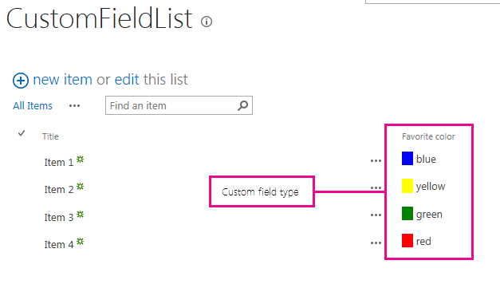

# <a name="how-to-customize-a-field-type-using-client-side-rendering"></a>Как: Настройка типа поля, с использованием обработки на стороне клиента
Узнайте, как настроить тип поля с помощью технологии клиентской обработки в SharePoint.
Клиентская обработка механизм, которые можно использовать для создания собственных вывода для набора элементов управления, которые размещены на странице SharePoint. Этот механизм позволяет использовать хорошо известных технологий, таких как HTML и JavaScript, определение логики визуализации настраиваемых типов полей. В обработки на стороне клиента можно указать ресурсов JavaScript и их размещать в доступных вариантов хранилищ данных решения фермы, такие как папке _layouts.
  
    
    


## <a name="prerequisites-for-using-the-examples-in-this-article"></a>Предварительные требования для использования примеров в этой статье
<a name="SP15CustomizeafieldtypeusingCSR_Prereq"> </a>

Для выполнения действий, описанных в этом примере, вам необходимо следующее:
  
    
    

- Microsoft Visual Studio 2012
    
  
- Инструменты разработчика Office для Visual Studio 2012
    
  
- Среда разработки SharePoint
    
  
Сведения о настройке среды разработки SharePoint видеть [настроить среду разработки, общие для SharePoint](set-up-a-general-development-environment-for-sharepoint.md).
  
    
    

### <a name="core-concepts-to-help-you-understand-client-side-rendering-for-field-types"></a>Основные понятия, которые помогут вам понять обработки на стороне клиента для типов полей

В следующей таблице приведены полезные статьи, которые помогут изучить основные понятия и этапы, входящие в сценарий дополнительного действия.
  
    
    

**В таблице 1. Основные понятия, которые для обработки на стороне клиента для типов полей**


|**Заголовок статьи**|**Описание**|
|:-----|:-----|
| [Создавайте решения фермы в SharePoint](build-farm-solutions-in-sharepoint.md) <br/> |Сведения о разработке, упаковки и развертывания административные расширения для SharePoint с использованием решений фермы.  <br/> |
| [Настраиваемые типы полей](http://msdn.microsoft.com/en-us/library/ms446361.aspx) <br/> |Сведения о создании настраиваемых типов полей. Как бизнес-информация хранится в SharePoint, может быть значениями времени, когда данные не соответствует типов полей, доступных в SharePoint FoundationOr, могут только что необходимо настроить эти типы полей. Настраиваемые поля могут быть проверки пользовательских данных и визуализации настраиваемых полей.  <br/> |
   

## <a name="code-example-customize-the-rendering-process-for-a-custom-field-type-in-a-view-form"></a>Пример кода: настраивать процесс визуализации для настраиваемого типа поля в форме просмотра
<a name="SP15CustomizeafieldtypeusingCSR_Codeexample"> </a>

Выполните следующие действия, чтобы настроить процесс визуализации для настраиваемого типа поля.
  
    
    

1. Создание проекта решение фермы.
    
  
2. Добавление класса для настраиваемого типа поля.
    
  
3. Добавление XML-определения типа настраиваемого поля.
    
  
4. Добавьте файл JavaScript для визуализации логики типа настраиваемого поля.
    
  
На рисунке 1 показано представление формы с типом визуализации настраиваемого поля.
  
    
    

**На рисунке 1. Поле в форме представления, отображаемое на настраиваемых на стороне клиента**

  
    
    

  
    
    
  
  
    
    

### <a name="to-create-the-farm-solution-project"></a>Создание проекта решение фермы


1. Откройте Visual Studio 2012 как администратор (щелкните правой кнопкой мыши значок Visual Studio 2012 в меню **Пуск** и выберите **Запуск от имени администратора** ).
    
  
2. Создайте новый проект с помощью шаблона **Проекта SharePoint**
    
    На рисунке 2 показано расположение шаблона **Проекта SharePoint** в Visual Studio 2012, в области **Шаблоны**, **Visual C#**, **Office SharePoint**, **Решений SharePoint**.
    

   **На рисунке 2. Шаблон проекта Visual Studio SharePoint**

  

  
  

  

  
3. Предоставьте URL-адрес веб-сайта SharePoint, который планируется использовать для отладки.
    
  
4. Выберите параметр **Развернуть как решение фермы**.
    
  

### <a name="to-add-a-class-for-the-custom-field-type"></a>Добавление класса для настраиваемого типа поля


1. Щелкните правой кнопкой мыши проект решение фермы и добавьте новый класс. Имя файла класса FavoriteColorFieldType.cs.
    
  
2. Скопируйте следующий код и вставьте его в файле FavoriteColorFieldType.cs. Код выполняет следующие задачи:
    
  - Объявляет **FavoriteColorField** класса, наследуемого от **SPFieldText**.
    
  
  - Предоставляет два конструктора для класса **FavoriteColorField**.
    
  
  - Переопределяет свойство **JSLink**.
    
    > **Примечание:** Перечислены JSLink, свойство не поддерживается в опросе или событий. Календарь SharePoint — это список событий. 

```cs
using System;
using System.Collections.Generic;
using System.Linq;
using System.Text;
using System.Threading.Tasks;

// Additional references for this sample.
using Microsoft.SharePoint;
using Microsoft.SharePoint.WebControls;

namespace Microsoft.SDK.SharePoint.Samples.WebControls
{
    /// <summary>
    /// The FavoriteColorField custom field type 
    /// inherits from SPFieldText.
    /// Users can input the color in the field 
    /// just like in any other text field.
    /// But the field will provide additional 
    /// rendering logic when displaying 
    /// the field in a view form.
    /// </summary>
    public class FavoriteColorField : SPFieldText
    {
        // The solution deploys the JavaScript 
        // file to the CSRAssets folder 
        // in the WFE's layouts folder.
        private const string JSLinkUrl = 
            "~site/_layouts/15/CSRAssets/CSRFieldType.js";

        // You have to provide constructors for SPFieldText.
        public FavoriteColorField(
            SPFieldCollection fields, 
            string name) :
            base(fields, name)
        {

        }
        public FavoriteColorField(
            SPFieldCollection fields, 
            string typename, 
            string name) :
            base(fields, typename, name)
        {

        }

        /// <summary>
        /// Override the JSLink property to return the 
        /// value of our custom JavaScript file.
        /// </summary>
        public override string JSLink
        {
            get
            {
                return JSLinkUrl;
            }
            set
            {
                base.JSLink = value;
            }
        }
    }
}            
```


### <a name="to-add-an-xml-definition-for-the-custom-field-type"></a>Добавление XML-определения типа настраиваемого поля


1. Щелкните правой кнопкой мыши проект решение фермы и Добавление сопоставленной папки SharePoint. В диалоговом окне выберите папку **{SharePointRoot} \\Template\\XML**.
    
  
2. Щелкните правой кнопкой мыши папку XML, созданные на предыдущем этапе и добавьте новый XML-файл. Имя XML-код файла fldtypes_FavoriteColorFieldType.xml.
    
  
3. Скопируйте следующую разметку и вставьте его в XML-файле. Разметка выполняет следующие задачи:
    
  - Содержит имя типа для типа поля.
    
  
  - Задает полное имя класса для типа поля. Это класс, созданный в предыдущей процедуре.
    
  
  - Содержит дополнительные атрибуты для типа поля.
    
  
```XML
    <?xml version="1.0" encoding="utf-8" ?>
    <FieldTypes>
      <FieldType>
        <Field Name="TypeName">FavoriteColorField</Field>
        <Field Name="TypeDisplayName">Favorite color field</Field>
        <Field Name="TypeShortDescription">Favorite color field</Field>
        <Field Name="FieldTypeClass">Microsoft.SDK.SharePoint.Samples.WebControls.FavoriteColorField, $SharePoint.Project.AssemblyFullName$</Field>
        <Field Name="ParentType">Text</Field>
        <Field Name="Sortable">TRUE</Field>
        <Field Name="Filterable">TRUE</Field>
        <Field Name="UserCreatable">TRUE</Field>
        <Field Name="ShowOnListCreate">TRUE</Field>
        <Field Name="ShowOnSurveyCreate">TRUE</Field>
        <Field Name="ShowOnDocumentLibrary">TRUE</Field>
        <Field Name="ShowOnColumnTemplateCreate">TRUE</Field>
      </FieldType>
    </FieldTypes>
```

### <a name="to-add-a-javascript-file-for-the-rendering-logic-of-the-custom-field-type"></a>Чтобы добавить файл JavaScript для визуализации логики типа настраиваемого поля


1. Щелкните правой кнопкой мыши проект решение фермы и Добавление сопоставленной папки SharePoint макетов. Добавьте новую папку CSRAssets недавно папке Layouts.
    
  
2. Щелкните правой кнопкой мыши папку CSRAssets, созданную на предыдущем этапе и добавьте новый файл JavaScript. Имя файла JavaScriptCSRFieldType.js.
    
  
3. Скопируйте следующий код и вставьте его в файле JavaScript. Код выполняет следующие задачи:
    
  - Создает шаблона в поле, если оно отображается в представлении формы.
    
  
  - Регистрирует шаблон.
    
  
  - Предоставляет логику отображения для типа поля при использовании отображается в форме представления.
    
  

```javascript
(function () {
    var favoriteColorContext = {};

    // You can provide templates for:
    // View, DisplayForm, EditForm and NewForm
    favoriteColorContext.Templates = {};
    favoriteColorContext.Templates.Fields = {
        "FavoriteColorField": {
            "View": favoriteColorViewTemplate
        }
    };

    SPClientTemplates.TemplateManager.RegisterTemplateOverrides(
        favoriteColorContext
        );
})();

// The favoriteColorViewTemplate provides the rendering logic
// the custom field type when it is displayed in the view form.
function favoriteColorViewTemplate(ctx) {
    var color = ctx.CurrentItem[ctx.CurrentFieldSchema.Name];
    return "<span style='background-color : " + color +
        "' >&amp;nbsp;&amp;nbsp;&amp;nbsp;&amp;nbsp;</span>&amp;nbsp;" + color;
}
```

### <a name="to-build-and-run-the-solution"></a>Построение и запуск решения


1. Нажмите клавишу F5.
    
    > **Примечание:** Когда вы нажимаете клавишу F5, Visual Studio выполняет построение решения, развертывает решение и открывает веб-сайт SharePoint, где развернуто решение. 
2. Создать настраиваемый список и добавления нового столбца поле Цвет избранного.
    
  
3. Добавьте один из элементов в список и указывать значение для столбца избранные цвета.
    
  
4. На рисунке 3 показана страница столбца Создание нового типа настраиваемого поля.
    
   **На рисунке 3. Создание нового столбца типа настраиваемого поля**

  

  
  

  

  


|**Проблема**|**Решение**|
|:-----|:-----|
|Тип поля **FavoriteColorField** установлен неправильно. Перейдите на страницу параметров списка и удалите это поле.<br/> |Выполните следующую команду из командной строки с повышенными привилегиями: **iisreset /noforce**. <br/> **Осторожность:** При развертывании решения в рабочую среду, дождитесь подходящее время сброс веб-сервера, с помощью **iisreset/noforce**.          |
   

## <a name="next-steps"></a>Дальнейшие действия
<a name="SP15CustomizeafieldtypeusingCSR_Nextsteps"> </a>

В этой статье было показано, как настроить процесс визуализации для настраиваемого типа поля. В качестве следующего шага можно получить дополнительные сведения о настраиваемых типов полей. Для получения дополнительных сведений см.:
  
    
    

-  [Как: создать настраиваемый тип поля](http://msdn.microsoft.com/en-us/library/bb862248.aspx)
    
  
-  [Пошаговое руководство: Создание настраиваемого типа поля](http://msdn.microsoft.com/en-us/library/bb861799.aspx)
    
  
-  [Настройка представления списка в надстройках для SharePoint с использованием способа отображения на стороне клиента](http://msdn.microsoft.com/library/8d5cabb2-70d0-46a0-bfe0-9e21f8d67d86%28Office.15%29.aspx)
    
  

## <a name="additional-resources"></a>Дополнительные ресурсы
<a name="SP15CustomizeafieldtypeusingCSR_AddResources"> </a>


-  [Настройка общей среды разработки для SharePoint](set-up-a-general-development-environment-for-sharepoint.md)
    
  
-  [Создание сайтов для SharePoint](build-sites-for-sharepoint.md)
    
  
-  [Новые возможности для разработчиков в SharePoint](what-s-new-for-developers-in-sharepoint.md)
    
  
-  [Добавление возможностей SharePoint](add-sharepoint-capabilities.md)
    
  
-  [Создавайте решения фермы в SharePoint](build-farm-solutions-in-sharepoint.md)
    
  
