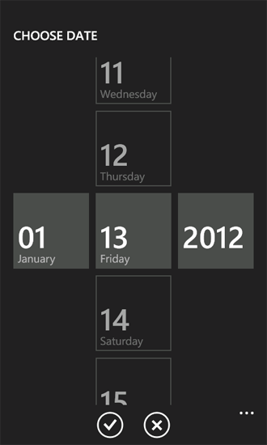

# <a name="customize-the-user-interface-of-a-sharepoint-list-app-for-windows-phone"></a>Настройка пользовательского интерфейса приложения списка SharePoint для Windows Phone
Настройте пользовательский интерфейс Windows Phone, созданный с помощью шаблона приложения списка SharePoint для Windows. Приложения списка SharePoint из шаблона приложения списка SharePoint для Windows Phone основаны на платформе Silverlight для Windows Phone. Все возможности, предоставляемые платформы Silverlight на ОС Windows Phone, доступны для разработчиков по настройке пользовательского интерфейса (UI) приложения списка SharePoint, предназначенной для Windows Phone.
  
    
    


> **Важные:** При разработке приложения для Windows Phone 8, должны использовать Visual Studio Express 2012 г., а не в Visual Studio 2010 Express. За исключением среды разработки все сведения в этой статье применимы к созданию приложений для Windows Phone 8 и Windows Phone 7. > Для получения дополнительных сведений см [как: Настройка среды разработки мобильных приложений для SharePoint](how-to-set-up-an-environment-for-developing-mobile-apps-for-sharepoint.md). 
  
    
    


## <a name="create-a-sharepoint-list-app-for-user-interface-customizations"></a>Создание приложения списка SharePoint для настройки интерфейса пользователя
<a name="BKMK_CreatingSPListApp"> </a>

Для выполнения следующих процедур предполагается на сервер SharePoint Server содержит список заказов продукта из шаблона настраиваемый список, аналогичную образца списка заказов на продукт, как используется в [для: реализация бизнес-логики и данных проверок в приложении Windows Phone для SharePoint](how-to-implement-business-logic-and-data-validation-in-a-windows-phone-app-for-s.md). Для примера приложения Windows Phone, используемых в этом разделе в списке заказов продукта — это приложение на основе был изменен дополнительные поля. Измененный список заказов на продукт, используемый для целей примеров, описанных в этом разделе будет создан со столбцами и типы полей, показано в таблице 1.
  
    
    

**В таблице 1. Измененный список заказов на продукт**


|**Столбец**|**Тип**|**Обязательный**|
|:-----|:-----|:-----|
|Продукт (например, заголовок)  <br/> |Однострочный текст (Текст)  <br/> |Да  <br/> |
|Описание  <br/> |Однострочный текст (Текст)  <br/> |Нет  <br/> |
|Категория продуктов  <br/> |Варианты  <br/> |Нет  <br/> |
|Количество  <br/> |Число  <br/> |Да  <br/> |
|Дата заказа  <br/> |Дата и время (DateTime)  <br/> |Нет  <br/> |
|Дата выполнения  <br/> |Дата и время (DateTime)  <br/> |Нет  <br/> |
|Срочный  <br/> |Логическое  <br/> |Нет  <br/> |
|Номер контакта  <br/> |Однострочный текст (Текст)  <br/> |Нет  <br/> |
   
Выполните процедуры, описанные в [как: Создание приложения списка SharePoint для Windows Phone](how-to-create-a-windows-phone-sharepoint-list-app.md) для использования шаблона приложения списка SharePoint для Windows Phone для создания приложения списка SharePoint в качестве отправной точки для следующих настроек пользовательского интерфейса. Укажите в качестве целевого списка SharePoint для приложения, список, содержащий схемы, аналогичную что представлен в таблице 1.
  
    
    

## <a name="replace-textbox-controls-with-datepicker-controls"></a>Замена элемента управления TextBox с элементами управления DatePicker
<a name="BKMK_ReplacingControls"> </a>

На основе проекта, созданной с помощью шаблона, полей в списке обозначены как поля **даты и времени** (как, например поле **Дата заказа в списке заказов продукта примера)**, тем самым соглашаетесь соблюдать по умолчанию для элементов управления **TextBox** в форме редактирования (EditForm.xaml) и новая форма (NewForm.xaml) в приложении. Для упрощения ввода значения дат для таких полей, заменив их связанных **TextBox** элементы управления с элементами управления **DatePicker** с [Silverlight для Windows Phone Toolkit](http://silverlight.codeplex.com/releases/view/75888)— первый улучшения, внесенные в пользовательском интерфейсе. Вы можете установить Silverlight для Windows Phone Toolkit из  [Веб-сайте CodePlex](http://www.codeplex.com/), узел размещения для проектов программного обеспечения с открытым исходным кодом.
  
    
    

### <a name="to-replace-textbox-controls-with-datepicker-controls"></a>Замена элемента управления TextBox с элементами управления DatePicker


1. В Microsoft Visual Studio 2010 Если проект еще не открыт, откройте проект, созданный в предыдущем разделе, на основе шаблона приложения списка SharePoint для Windows Phone и с помощью списка SharePoint как список заказов на продукт, представленный в таблице 1.
    
  
2. В Visual Studio в меню **проект** выберите команду **Добавить ссылку**. Откроется диалоговое окно **Добавить ссылку**.
    
  
3. На вкладке **Обзор** перейдите к Microsoft.Phone.Controls.Toolkit.dll сборки, установленные Toolkit Silverlight для Windows Phone.
    
    > **Примечание:** Microsoft.Phone.Controls.Toolkit.dll сборки можно найти в %PROGRAMFILES%(x86)\\пакеты SDK для Microsoft\\Windows Phone\\v7.1\\набор средств\\< *MonthYear*  >\\корзины в стандартном Установка набора средств, где < *MonthYear* > может быть что-то вроде «Oct11», в зависимости от версии набора средств установлены. (Или можно найти сборки, установленные набор средств на компьютере, нажмите кнопку **Пуск** , **Все**программы, развертывание **Microsoft Silverlight для средств Windows Phone** элемента в меню программы выберите пункт и ** Двоичные файлы**.) 
4. В **Обозревателе решений** выберите файл EditForm.xaml в разделе узел **представления**.
    
  
5. КлавишиSHIFT + F7(или дважды щелкните файл) для открытия файла в конструкторе.
    
  
6. В XAML панели конструктора добавьте объявление пространства имен для различения элементов управления в сборке набор средств для тега  `<phone:PhoneApplicationPage>` .
    
```
  
<phone:PhoneApplicationPage
    x:Class="ContosoSPListApp.EditForm"
    xmlns="http://schemas.microsoft.com/winfx/2006/xaml/presentation"
    xmlns:x="http://schemas.microsoft.com/winfx/2006/xaml"
    xmlns:phone="clr-namespace:Microsoft.Phone.Controls;assembly=Microsoft.Phone"
    xmlns:toolkit="clr-namespace:Microsoft.Phone.Controls;assembly=Microsoft.Phone.Controls.Toolkit"
    xmlns:shell="clr-namespace:Microsoft.Phone.Shell;assembly=Microsoft.Phone"
    xmlns:d="http://schemas.microsoft.com/expression/blend/2008"
    xmlns:mc="http://schemas.openxmlformats.org/markup-compatibility/2006"
    mc:Ignorable="d" d:DesignWidth="480" d:DesignHeight="696"
    FontFamily="{StaticResource PhoneFontFamilyNormal}"
    FontSize="{StaticResource PhoneFontSizeNormal}"
    Foreground="{StaticResource PhoneForegroundBrush}"
    SupportedOrientations="Portrait" Orientation="Portrait"
    shell:SystemTray.IsVisible="True" x:Name = "EditPage">
```


    The only change to the default markup generated by the template is the addition of the "xmlns:toolkit" namespace designation. Also note that the value of the **Class** attribute here is based on the name of your project. "ContosoSPListApp" is the name of this sample project. The value of this attribute in your project will differ from the value here depending on the name of your project.
    
  
7. В файле EditForm.xaml найдите элемент управления **StackPanel** в разметка, которая содержит элементы управления, связанные с полем **Дата заказа** (обозначены как "Order_x0020_Date" в XML-схему для поля). По умолчанию шаблон создает элемент управления **TextBox** и два элемента управления **TextBlock** для поля **даты и времени**. Разметка для элемента управления **StackPanel** и элементов управления, которые он содержит должен иметь следующую разметку:
    
```
  
<StackPanel Orientation="Vertical" Margin="0,5,0,5">
    <TextBlock TextWrapping="Wrap" HorizontalAlignment="Left" 
             Style="{StaticResource PhoneTextNormalStyle}">Order Date</TextBlock>
    <TextBox Height="Auto" Style="{StaticResource TextValidationTemplate}" 
                FontSize="{StaticResource PhoneFontSizeNormal}" Width="470" 
                HorizontalAlignment="Left" Name="txtOrder_x0020_Date" 
                Text="{Binding [Order_x0020_Date], Mode=TwoWay, ValidatesOnNotifyDataErrors=True,
                NotifyOnValidationError=True}" TextWrapping="Wrap" />
    <TextBlock FontSize="16" TextWrapping="Wrap" HorizontalAlignment="Left" Style="{StaticResource PhoneTextSubtleStyle}" Text="{Binding DateTimeFormat}" />
</StackPanel>
```

8. Замените этот элемент управления **StackPanel** и элементов управления, которые он содержит следующую разметку.
    
```
  
<StackPanel Orientation="Vertical" Margin="0,5,0,5">
    <toolkit:DatePicker Header="Order Date" Value="{Binding [Order_x0020_Date], Mode=TwoWay}">
              </toolkit:DatePicker>
</StackPanel>
```

9. Затем найдите (а также в EditForm.xaml) элемента управления, **StackPanel** разметка, которая содержит элементы управления, связанные с полем Дата выполнения (обозначены как "Fulfillment_x0020_Date" в схеме для поля). Разметка для **StackPanel** и элементов управления, которые он содержит должен иметь следующую разметку:
    
```
  
<StackPanel Orientation="Vertical" Margin="0,5,0,5">
    <TextBlock TextWrapping="Wrap" HorizontalAlignment="Left" Style="{StaticResource PhoneTextNormalStyle}">Fulfillment Date</TextBlock>
    <TextBox Height="Auto" Style="{StaticResource TextValidationTemplate}" 
           FontSize="{StaticResource PhoneFontSizeNormal}" Width="470" HorizontalAlignment="Left"
           Name="txtFulfillment_x0020_Date" Text="{Binding [Fulfillment_x0020_Date], 
           Mode=TwoWay, ValidatesOnNotifyDataErrors=True, NotifyOnValidationError=True}" 
           TextWrapping="Wrap" />
    <TextBlock FontSize="16" TextWrapping="Wrap" HorizontalAlignment="Left" 
          Style="{StaticResource PhoneTextSubtleStyle}" Text="{Binding DateTimeFormat}" />
</StackPanel>
```

10. Замените этот элемент управления **StackPanel** и элементов управления, которые он содержит следующую разметку.
    
```
  
<StackPanel Orientation="Vertical" Margin="0,5,0,5">
    <toolkit:DatePicker Header="Fulfillment Date" Value="{Binding [Fulfillment_x0020_Date], Mode=TwoWay}"></toolkit:DatePicker>
</StackPanel>
```

11. И, наконец можно добавить изображения значка интерфейс пользователя из набора Silverlight для Windows Phone в проект. В **Обозревателе решений** выберите узел, представляющий проект (с именем, например, "ContosoSPListApp").
    
  
12. В меню **проект** в Visual Studio нажмите кнопку **Создать папку**. Новую папку добавляется в узле проекта. Назовите папку «Toolkit.Content».
    
  
13. В **Обозревателе решений** выберите папку, созданную на предыдущем шаге.
    
  
14. В меню **проект** выберите пункт **Добавить существующий элемент**. Откроется окно **Браузера файла**.
    
  
15. Перейдите к папке, где ApplicationBar.Cancel.png и ApplicationBar.Check.png, поддерживающей значки, установленных с Toolkit Silverlight для Windows Phone.
    
    > **Примечание:** Изображения находятся в %PROGRAMFILES%(x86)\\пакеты SDK для Microsoft\\Windows Phone\\v7.1\\набор средств\\ < *MonthYear*>\\Bin\\значков в стандартную установку пакета средств, где < *MonthYear* >, возможно, что-то вроде «Oct11», в зависимости от версии набора средств установлены.  
16. Установите оба изображения и нажмите кнопку **Добавить**. Файлы изображений добавляются в проект в узле папка **Toolkit.Content**.
    
    > **Важные:** Для компонентов Silverlight для Windows Phone набора инструментов должны иметь возможность использовать изображения значка, они должны быть размещены в расположении в вашей планируемый как указано на предыдущем шаге. 
17. В **Обозревателе решений** выберите оба файла изображения в папке **Toolkit.Content**.
    
  
18. **Окно "Свойства"** установите для свойства **Действие при построении** изображений "Содержимого" и присвойте свойству **Копировать в выходной каталог** для "Копировать, если новее".
    
    > **Примечание:** Если **Окно "Свойства"** не отображается, нажмите сочетание клавиш CTRL + W и P для отображения окна в Visual Studio.
      > При запуске проекта (нажатием клавиши F5) для развертывания на эмулятора Windows Phone, можно перейти к форме **изменения** элемента (, щелкнув элемент в главной страницы представления списка и нажмите кнопку **Изменить** на **Панель приложения** приложение). Поля **даты и времени** в формате, теперь связанный с элементом управления **DatePicker** , как показано на рисунке 1.
  
    
    

**На рисунке 1. Изменение формы с элементом управления DatePicker**

  
    
    

  
    
    

  
    
    
Элемент управления **DatePicker** (с выделением для поля **Дата заказа** на рис. 1) имеет вид, как элемент управления **TextBox** с помощью связанных **TextBlock** как метка, за исключением того, что если щелкните элемент управления **DatePicker** (или коснитесь ее на устройстве Windows Phone), элемент управления отображает отдельная страница с элементами управления для выбора даты с использованием жестов, как показано на рисунке 2.
  
    
    

**На рисунке 2. Страница выбора даты**

  
    
    

  
    
    

  
    
    
Щелчок передачи кнопки **Готово** выбранной даты в **DatePicker** элемент управления в форме **редактирования**. После нажатия кнопки **Сохранить** в данной форме значения поля **даты и времени**, связанные с элементами управления **DatePicker** обновляются в списке SharePoint на сервере, так как свойства **Value** элементов управления были привязаны к соответствующим полям в файл EditForm.xaml в предыдущей процедуре. Если вы хотите заменить **TextBox** элементы управления с элементами управления **DatePicker** в виде новой, будет повторите шаги 4 - 10 процедуры для файла NewForm.xaml в проекте.
  
    
    

## <a name="add-controls-to-support-custom-fill-in-options-for-choice-fields"></a>Добавление элементов управления для поддержки настраиваемых замещение вариантов для выбора.
<a name="BKMK_AddingControlsForChoiceFields"> </a>

Поля, обозначенные с типом поля выбора в списке SharePoint можно настроить на сервере SharePoint, чтобы пользователи могли определить настраиваемые (или «замещение») выбора значения для поля, в дополнение к все объявленные выбора значения, которые можно назначить для поля выбора при определении на сервере. В проектах, созданных на основе шаблона приложения списка SharePoint для Windows Phone по умолчанию для поддержки интерфейса пользователя для ввода «замещение» параметры не отображаются поля Choice. В процедурах этого раздела добавляемого элементы управления пользовательского интерфейса и кода ваше приложение для поддержки ввода значений настраиваемого выбора в поле категории продуктов.
  
    
    
В следующих процедурах выполним следующие задачи:
  
    
    

- Добавьте в класс ( **ContosoConverter**) с логикой преобразования данных процесса сохраняется в поле выбора категории продукта.
    
  
- Добавьте свойство члена ( **OtherCategoryValue**) класс **EditItemViewModel**, который предоставляет доступ к string, представляющее значение "замещение" для поля выбора. Этот член свойство будет служить источником в объявлении привязки для элемента управления добавлены **TextBox** в форме редактирования.
    
  
- Добавьте элемент управления **RadioButton** и управления **TextBox** форме редактирования для пользователи должны иметь возможность указывать значение "замещение" выбора в поле категории продуктов.
    
  
- Измените файл фонового кода EditForm.xaml.cs, связанного с формой редактирования для регистрации изменить поля значение конвертера **задать** функцию для полей Choice и реализация обработчиков событий для элементов управления в форме редактирования.
    
  

> **Примечание:** Дополнительные сведения о конвертерах значение поля можно [как: поддержка и convert SharePoint поля типов приложений Windows Phone](how-to-support-and-convert-sharepoint-field-types-for-windows-phone-apps.md). 
  
    
    


  
    
    

### <a name="to-add-a-class-to-support-data-conversion-for-choice-fields"></a>Добавление класса для поддержки преобразования данных для выбора.


1. В **Обозревателе решений** выберите узел, представляющий проект (с именем, например,ContosoSPListApp).
    
  
2. В Visual Studio (или Visual Studio Express для Windows Phone) в меню **проект** выберите пункт **Добавление класса**. Откроется диалоговое окно **Добавление нового элемента** с помощью C# **класс** шаблона уже выбраны.
    
  
3. Укажите имя для файла класса (как, например, ContosoConverter.cs) и нажмите кнопку **Добавить**. Файл класса будет добавлен в проект и открыт для редактирования.
    
  
4. Замените содержимое файла следующим кодом.
    
```cs
  
using System;
using System.Net;
using System.Windows;
using System.Collections.ObjectModel;
using Microsoft.SharePoint.Phone.Application;
using Microsoft.SharePoint.Client;

namespace SPListAppUICustomization
{
    public class ContosoConverter
    {
        // Edit Field Value Converter SET function for Choice fields.
        public static void SetConvertedChoiceEditFieldValue(string fieldName, object fieldValue, 
                                        ListItem item, ConversionContext context, string customCategory)
        {
            ObservableCollection<ChoiceFieldViewModel> choices = fieldValue as
                                                   ObservableCollection<ChoiceFieldViewModel>;
               bool isCustomValue = true;

            string specifiedChoice = string.Empty;

            if (choices != null)
            {
                foreach (ChoiceFieldViewModel choiceItem in choices)
                {
                    if ((choiceItem.IsChecked == true) || (choiceItem.Name.Equals(customCategory, 
                                                             StringComparison.CurrentCultureIgnoreCase)))
                    {
                        specifiedChoice = choiceItem.Name;
                        isCustomValue = false;
                        break;
                    }
                }

                if (isCustomValue == true)
                {
                    specifiedChoice = customCategory;
                }
            }
            else
            {
                specifiedChoice = customCategory;
            }

            item[fieldName] = specifiedChoice;
        }
    }
}
```

5. Сохраните файл.
    
  
Функция **SetConvertedChoiceEditFieldValue** используется для реализации изменить поля значение конвертера **задать** делегат функции, зарегистрированные для выбора полей в приложении. Функция итерацию по коллекции объектов **ChoiceFieldViewModel**, переданное как аргумент **fieldValue**. объекты **ChoiceFieldViewModel** используются для представления отдельных значений для полей выбора проектов на основе шаблона приложения списка SharePoint для Windows Phone. Каждый объект имеет свойство **Name**, представляющее данного выбора и логическое свойство ( **IsChecked**), указывающее, является ли данный вариант значение (эти значения для поля, которое было определено) значение, указанное в поле. Функция **SetConvertedChoiceEditFieldValue** определяет, установлен ли объект **ChoiceFieldViewModel** в коллекции или совпадает ли свойство **Name** объекта указанного пользовательское значение для поля Категория продуктов. Если это так, свойство **Name** этого объекта **ChoiceFieldViewModel** используется для установки значения поля. В противном случае — значение указанного настраиваемого (из аргумента **customCategory** ) имеет значение как значение поля.
  
    
    
Далее вы добавите участником свойство **EditItemViewModel** класс, который предоставляет доступ к значению "замещение" для поля выбора (или пустая строка, если указанное значение поля выбора — это один из доступных вариантов, определенные для поля на сервере).
  
    
    

### <a name="to-add-a-property-member-to-the-edititemviewmodel-class"></a>Добавление элемента свойства в класс EditItemViewModel


1. В **Обозревателе решений** в узле папка **ViewModels** выберите файл EditItemViewModel.cs.
    
  
2. КлавишиF7(или дважды щелкните файл) откройте файл для редактирования.
    
  
3. После директив **using** по умолчанию в файле добавьте следующую директиву.
    
```cs
  
using System.Collections.ObjectModel;
```

4. Добавьте следующие реализации члена свойства (с именем **OtherCategoryValue**) в файл в блоке кода (обозначенного открывающих и закрывающих скобок), который реализует класс **EditItemViewModel**.
    
```cs
  public string OtherCategoryValue
{
    get
    {
        string specifiedCategory = string.Empty;

        // See if specified Choice field value is one of the available values
        // from the List ViewModel. If it is, return an empty string.
        ObservableCollection<ChoiceFieldViewModel> choicesCollection = this["Product_x0020_Category"] as
                                               ObservableCollection<ChoiceFieldViewModel>;
        if (choicesCollection != null &amp;&amp; choicesCollection.Any(choice => choice.IsChecked))
        {
            return specifiedCategory;
        }

        // If Choice field value is not one of the values from the List ViewModel,
        // get the value from the underlying list item and return value as string.
        specifiedCategory = SharePointListItem.FieldValuesAsText["Product_x0020_Category"];
        return specifiedCategory;
    }
}
```

5. Сохраните файл.
    
  
Затем будет добавление элементов управления на форме редактирования и настроить эти элементы управления для поддержки ввода пользовательские значения для поля Категория продуктов.
  
    
    

### <a name="to-add-and-configure-ui-controls-for-entering-custom-choice-field-values"></a>Чтобы добавить и настроить элементы управления пользовательского интерфейса для ввода значений настраиваемого поля выбора


1. В **Обозревателе решений** выберите файл EditForm.xaml в узле папка **представлений**.
    
  
2. КлавишиSHIFT + F7(или дважды щелкните файл) для открытия файла в конструкторе.
    
  
3. Найдите элемент управления **StackPanel**, который содержит элементы управления (элемент управления **TextBlock** и элемент управления **ListBox** ) для отрисовки поля **Категория продуктов** из списка SharePoint заказы продукта. Добавление и настройка элемента управления **RadioButton** и другим элементом управления **TextBox** в контейнер **StackPanel**, как показано в следующем коде.
    
```
  
<StackPanel Orientation="Vertical" Margin="0,5,0,5">
    <TextBlock TextWrapping="Wrap" HorizontalAlignment="Left" Style="{StaticResource PhoneTextNormalStyle}">
                                                                    Product Category</TextBlock>
    <ListBox MaxHeight="400" Width="Auto" x:Name="lstBoxProduct_x0020_Category" 
                                             ItemsSource="{Binding [Product_x0020_Category]}">
        <ListBox.ItemTemplate>
            <DataTemplate>
                <RadioButton FontSize="{StaticResource PhoneFontSizeNormal}" HorizontalAlignment="Left" 
                               GroupName="Product_x0020_Category" Content="{Binding Name}" 
                                  IsChecked="{Binding IsChecked, Mode=TwoWay}" />
            </DataTemplate>
        </ListBox.ItemTemplate>
    </ListBox>
    <!-- The following two controls added to support UI Customization for Choice field. -->
    <RadioButton x:Name="rbOtherCategory" FontSize="{StaticResource PhoneFontSizeNormal}" HorizontalAlignment="Left" GroupName="Product_x0020_Category" Content="Other:" IsChecked ="True" /><TextBox x:Name="txtOtherCategory" Text="{Binding OtherCategoryValue}" FontSize="{StaticResource PhoneFontSizeNormal}" Width="470" HorizontalAlignment="Left" TextWrapping="Wrap" Visibility="Visible" />
</StackPanel>
```

4. С помощью файла EditForm.xaml, выбранного в **Обозревателе решений** нажмите клавишуF7Чтобы открыть файл его выделенным кодом EditForm.xaml.cs, для редактирования.
    
  
5. Измените конструктор в файл, чтобы добавить обработчик **EditForm_Loaded**, для события **Loaded**. Измененные конструктор должна соответствовать конструктор в следующем коде.
    
```cs
  
public EditForm()
{
    InitializeComponent();

    viewModel = App.MainViewModel.SelectedItemEditViewModelInstance;
    if (!viewModel.IsInitialized)
    {
        viewModel.InitializationCompleted += new
                       EventHandler<InitializationCompletedEventArgs>(OnViewModelInitialization);
        viewModel.Initialize();
    }
    else
    {
        this.DataContext = viewModel;
    }

    // Adding handler for Loaded event.
    this.Loaded += new RoutedEventHandler(EditForm_Loaded);
}
```

6. Добавьте следующие реализации обработчика событий **EditForm_Loaded** файл с именем в блоке кода (обозначенного открывающих и закрывающих скобок), который реализует разделяемый класс **EditForm**.
    
```cs
  
private void EditForm_Loaded(object sender, RoutedEventArgs e)
{
    // Register EditFieldValueConverter SET function on Choice fields.
    Converter.RegisterEditFieldValueConverter(FieldType.Choice, 
                            (string fieldName, object fieldValue, ListItem item, 
                                               ConversionContext context) =>
    {
        string otherCategoryValue = string.Empty;
        if (this.rbOtherCategory.IsChecked == true)
        {                    
            otherCategoryValue = this.txtOtherCategory.Text.Trim();
            if (string.IsNullOrWhiteSpace(OtherCategoryValue))
            {
                otherCategoryValue = "(Unspecified)";
            }
        }

        ContosoConverter.SetConvertedChoiceEditFieldValue(fieldName, 
                                         fieldValue, item, context, otherCategoryValue);
    });

    // Adding RadioButton event handlers here because the
    // txtOtherCategory TextBox will be loaded and available at this point.
    this.rbOtherCategory.Checked += new RoutedEventHandler(rbOtherCategory_Checked);
    this.rbOtherCategory.Unchecked += new RoutedEventHandler(rbOtherCategory_Unchecked);
}
```


    In this code, the lambda statement used in the call to the **RegisterEditFieldValueConverter** method of the **Converter** class determines whether the **rbOtherCategory** **RadioButton** control (added in Step 3) is checked. If so, the value in the **Text** property of **txtOtherCategory** **TextBox** control is passed to the **SetConvertedChoiceEditFieldValue** function. If **rbOtherCategory** is not checked, an empty string is passed. If **rbOtherCategory** is checked, but nothing is actually specified by the user in the **txtOtherCategory** text box, a value of "(Unspecified)" is passed.
    
  
7. Наконец добавьте обработчики для событий **Checked** и **Unchecked** для **rbOtherCategory** **RadioButton** для отображения или скрытия **TextBox** управления, используемый для предоставления настраиваемых значений Категория продуктов. Включают следующие реализации для этих обработчиков в файле EditForm.xaml.cs еще раз в блоке кода, который реализует разделяемый класс **EditForm**.
    
```cs
  
private void rbOtherCategory_Checked(object sender, RoutedEventArgs e)
{
    this.txtOtherCategory.Visibility = System.Windows.Visibility.Visible;
    this.txtOtherCategory.Focus();
}

private void rbOtherCategory_Unchecked(object sender, RoutedEventArgs e)
{
    this.txtOtherCategory.Visibility = System.Windows.Visibility.Collapsed;
}
```

8. Сохраните файл.
    
  
Если вы выполните построение проекта и его развертывание на эмулятора телефона Windows (нажав сочетание клавишF5), можно увидеть, что в форме редактирования **RadioButton** добавления элемента управления для каждого choice значение, определенное в определении поля Категория продуктов на основе по умолчанию логики обработки пользовательского интерфейса для полей Choice. Кроме того, другой элемент управления **RadioButton** (помечены как "другие:" в пользовательском Интерфейсе) включены пользователи должны иметь возможность указать значения для настраиваемого выбора. Если установлен элемент управления дополнительные **RadioButton**, элемент управления **TextBox** отображается для ввода значение.
  
    
    
Для элементов в списке заказов на продукт, который уже связаны с пользовательское значение Категория продукта и нажмите Редактировать в приложении редактирования, форма отображается с **RadioButton** дополнительные элементы управления установлен и **TextBox** отображение пользовательское значение уже видимой.
  
    
    

## <a name="additional-resources"></a>Дополнительные ресурсы
<a name="BKMK_AddingControlsForChoiceFields"> </a>


-  [Построение приложений Windows Phone, обращающихся к SharePoint](build-windows-phone-apps-that-access-sharepoint.md)
    
  
-  [Как: Настройка среды разработки мобильных приложений для SharePoint](how-to-set-up-an-environment-for-developing-mobile-apps-for-sharepoint.md)
    
  
-  [Windows Phone SDK 8.0](http://www.microsoft.com/en-us/download/details.aspx?id=35471)
    
  
-  [Пакет SDK Microsoft SharePoint для Windows Phone 8](http://www.microsoft.com/en-us/download/details.aspx?id=36818)
    
  
-  [Пакет SDK для Windows Phone 7.1](http://www.microsoft.com/en-us/download/details.aspx?id=27570)
    
  
-  [Пакет SDK Microsoft SharePoint для Windows Phone 7.1](http://www.microsoft.com/en-us/download/details.aspx?id=30476)
    
  

