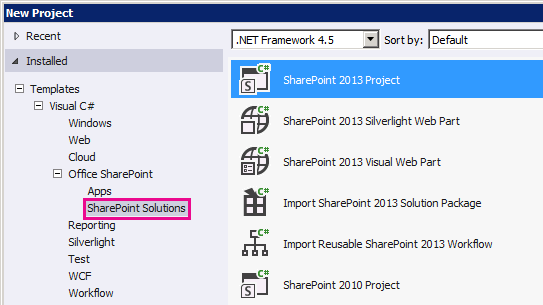

# <a name="extend-the-geolocation-field-type-by-using-client-side-rendering"></a><span data-ttu-id="898f2-102">Расширение типа поля географического расположения с использованием обработки на стороне клиента</span><span class="sxs-lookup"><span data-stu-id="898f2-102">Extend the Geolocation field type by using client-side rendering</span></span>

<span data-ttu-id="898f2-103">Узнайте, как программно персонализировать тип поля о географическом положении в SharePoint с помощью клиентской обработки.</span><span class="sxs-lookup"><span data-stu-id="898f2-103">Learn how to customize the SharePoint Geolocation field type programmatically using client-side rendering.</span></span>

<span data-ttu-id="898f2-104">SharePoint представлен новый тип поля с именем географического расположения, которая позволяет добавлять комментарии к списки SharePoint, содержащие сведения о расположении.</span><span class="sxs-lookup"><span data-stu-id="898f2-104">SharePoint introduces a new field type named Geolocation that enables you to annotate SharePoint lists with location information.</span></span> <span data-ttu-id="898f2-105">В столбцах типа географического расположения можно ввести сведения о расположении в виде пары Широта и долгота координат в десятичное градусов или получить координаты текущее расположение пользователя в браузере, если он реализует интерфейс API географического расположения W3C.</span><span class="sxs-lookup"><span data-stu-id="898f2-105">In columns of type Geolocation, you can enter location information as a pair of latitude and longitude coordinates in decimal degrees, or retrieve the coordinates of the user's current location from the browser if it implements the W3C Geolocation API.</span></span> <span data-ttu-id="898f2-106">Дополнительные сведения о поля географического расположения можно [интегрирование расположение и карты функциональные возможности в SharePoint](integrating-location-and-map-functionality-in-sharepoint.md).</span><span class="sxs-lookup"><span data-stu-id="898f2-106">For more information about the Geolocation field, see  [Integrating location and map functionality in SharePoint](integrating-location-and-map-functionality-in-sharepoint.md).</span></span> <span data-ttu-id="898f2-107">Тип поля географического расположения недоступен в тип контента по умолчанию из любого списка или библиотеки документов в SharePoint.</span><span class="sxs-lookup"><span data-stu-id="898f2-107">The Geolocation field type is not available in the default content type of any list or document library in SharePoint.</span></span> <span data-ttu-id="898f2-108">Тип поля географического расположения включен в SharePoint, но не отображается на странице Создание столбца для списка; Тип поля географического расположения необходимо добавить программными средствами.</span><span class="sxs-lookup"><span data-stu-id="898f2-108">The Geolocation field type is included in SharePoint but isn't visible on the create column page for the list; you must add the Geolocation field type programmatically.</span></span> <span data-ttu-id="898f2-109">Дополнительные сведения можно [как: Добавление столбца географического расположения списка программными средствами в SharePoint](how-to-add-a-geolocation-column-to-a-list-programmatically-in-sharepoint.md).</span><span class="sxs-lookup"><span data-stu-id="898f2-109">For more information, see  [How to: Add a Geolocation column to a list programmatically in SharePoint](how-to-add-a-geolocation-column-to-a-list-programmatically-in-sharepoint.md).</span></span> 
  
    
    

<span data-ttu-id="898f2-110">После добавления типа поля географического расположения SharePoint, его можно использовать для отображения карты с помощью Bing Maps.</span><span class="sxs-lookup"><span data-stu-id="898f2-110">After you add the Geolocation field type to SharePoint, you can use it to render maps by using Bing Maps.</span></span> <span data-ttu-id="898f2-111">Встроенные поля географического расположения можно отображать только с помощью службы Bing Maps.</span><span class="sxs-lookup"><span data-stu-id="898f2-111">The built-in Geolocation field can render only with Bing Maps.</span></span> <span data-ttu-id="898f2-112">Тем не менее можно создать настраиваемое поле, используя поля географического расположения в качестве родительского типа поля.</span><span class="sxs-lookup"><span data-stu-id="898f2-112">However, you can create a custom field by using the Geolocation field as a parent field type.</span></span> <span data-ttu-id="898f2-113">Отображение настраиваемых могут быть предоставлены через свойство **JSLink** в структуре обработки на стороне клиента.</span><span class="sxs-lookup"><span data-stu-id="898f2-113">Custom rendering can be provided through the **JSLink** property in the client-side rendering framework.</span></span> <span data-ttu-id="898f2-114">Платформа обработки на стороне клиента представлен в SharePoint.</span><span class="sxs-lookup"><span data-stu-id="898f2-114">The client-side rendering framework is introduced in SharePoint.</span></span> <span data-ttu-id="898f2-115">Дополнительные сведения можно [как: Настройка типа поля, с использованием обработки на стороне клиента](how-to-customize-a-field-type-using-client-side-rendering.md).</span><span class="sxs-lookup"><span data-stu-id="898f2-115">For more information, see [How to: Customize a field type using client-side rendering](how-to-customize-a-field-type-using-client-side-rendering.md).</span></span> 
> <span data-ttu-id="898f2-116">**Примечание:** Перечислены JSLink, свойство не поддерживается в опросе или событий.</span><span class="sxs-lookup"><span data-stu-id="898f2-116">**Note:** The JSLink property is not supported on Survey or Events lists.</span></span> <span data-ttu-id="898f2-117">Календарь SharePoint — это список событий.</span><span class="sxs-lookup"><span data-stu-id="898f2-117">A SharePoint calendar is an Events list.</span></span> 
  
    
    

<span data-ttu-id="898f2-118">Процедуры в этом разделе Создание настраиваемого поля, производные от типа поля географического расположения с использованием обработки на стороне клиента.</span><span class="sxs-lookup"><span data-stu-id="898f2-118">In the procedure of this section, you create a custom field derived from Geolocation field type using client-side rendering..</span></span> 
## <a name="prerequisites-for-creating-a-custom-geolocation-field"></a><span data-ttu-id="898f2-119">Необходимые условия для создания настраиваемого поля географического расположения</span><span class="sxs-lookup"><span data-stu-id="898f2-119">Prerequisites for creating a custom Geolocation field</span></span>
<span data-ttu-id="898f2-120"><a name="CreatingCustomGeolocation_prereq"> </a></span><span class="sxs-lookup"><span data-stu-id="898f2-120"></span></span>

<span data-ttu-id="898f2-121">Необходимо иметь следующее:</span><span class="sxs-lookup"><span data-stu-id="898f2-121">You must have the following:</span></span>
  
    
    

- <span data-ttu-id="898f2-122">Сервере под управлением SharePoint</span><span class="sxs-lookup"><span data-stu-id="898f2-122">A server running SharePoint</span></span>
    
  
- <span data-ttu-id="898f2-123">Microsoft Visual Studio 2012</span><span class="sxs-lookup"><span data-stu-id="898f2-123">Microsoft Visual Studio 2012</span></span>
    
  
- <span data-ttu-id="898f2-124">Инструменты разработчика Office для Visual Studio 2012</span><span class="sxs-lookup"><span data-stu-id="898f2-124">Office Developer Tools for Visual Studio 2012</span></span>
    
  
- <span data-ttu-id="898f2-125">Доступ к списку SharePoint, имеющего достаточные права для добавления столбца</span><span class="sxs-lookup"><span data-stu-id="898f2-125">Access to a SharePoint list, with sufficient privileges to add a column</span></span>
    
  

### <a name="core-concepts-to-know-for-customizing-the-geolocation-field"></a><span data-ttu-id="898f2-126">Основные понятия, которые необходимо знать при настройке поля географического расположения</span><span class="sxs-lookup"><span data-stu-id="898f2-126">Core concepts to know for customizing the Geolocation field</span></span>


  
    
    

<span data-ttu-id="898f2-127">**В таблице 1. Основные понятия, которые для расширения географического расположения тип поля**</span><span class="sxs-lookup"><span data-stu-id="898f2-127">**Table 1. Core concepts for extending the Geolocation field type**</span></span>


|<span data-ttu-id="898f2-128">**Заголовок статьи**</span><span class="sxs-lookup"><span data-stu-id="898f2-128">**Article title**</span></span>|<span data-ttu-id="898f2-129">**Описание**</span><span class="sxs-lookup"><span data-stu-id="898f2-129">**Description**</span></span>|
|:-----|:-----|
| [<span data-ttu-id="898f2-130">Интеграция расположение и карты функциональные возможности в SharePoint</span><span class="sxs-lookup"><span data-stu-id="898f2-130">Integrating location and map functionality in SharePoint</span></span>](integrating-location-and-map-functionality-in-sharepoint.md) <br/> |<span data-ttu-id="898f2-131">Узнайте, как интегрировать сведения о местоположении и карт в списки SharePoint и веб-расположение и мобильных приложений с помощью нового поля географического расположения и путем создания собственных типов полей на основе географического расположения.</span><span class="sxs-lookup"><span data-stu-id="898f2-131">Learn how to integrate location information and maps in SharePoint lists and location-based web and mobile apps by using the new Geolocation field, and by creating your own Geolocation-based field types.</span></span>  <br/> |
| [<span data-ttu-id="898f2-132">Как: Настройка типа поля, с использованием обработки на стороне клиента</span><span class="sxs-lookup"><span data-stu-id="898f2-132">How to: Customize a field type using client-side rendering</span></span>](how-to-customize-a-field-type-using-client-side-rendering.md) <br/> |<span data-ttu-id="898f2-133">Дополнительные сведения о новых клиентская обработка, введенные в SharePoint.</span><span class="sxs-lookup"><span data-stu-id="898f2-133">Learn more about the new client-side rendering introduced in SharePoint.</span></span>  <br/> |
| [<span data-ttu-id="898f2-134">Как программно добавить столбец "Географическое расположение" в список SharePoint</span><span class="sxs-lookup"><span data-stu-id="898f2-134">How to: Add a Geolocation column to a list programmatically in SharePoint</span></span>](how-to-add-a-geolocation-column-to-a-list-programmatically-in-sharepoint.md) <br/> |<span data-ttu-id="898f2-135">Узнайте, как для добавления столбца географического расположения списка программными средствами в SharePoint.</span><span class="sxs-lookup"><span data-stu-id="898f2-135">Learn how to add a Geolocation column to a list programmatically in SharePoint.</span></span>  <br/> |
   

## <a name="step-1-set-up-the-visual-studio-project"></a><span data-ttu-id="898f2-136">Этап 1: Настройка проекта Visual Studio</span><span class="sxs-lookup"><span data-stu-id="898f2-136">Step 1: Set up the Visual Studio project</span></span>
<span data-ttu-id="898f2-137"><a name="CreatingCustomGeolocationStep_1"> </a></span><span class="sxs-lookup"><span data-stu-id="898f2-137"></span></span>


### <a name="to-set-up-the-custom-field-project"></a><span data-ttu-id="898f2-138">Настройка проекта настраиваемого поля</span><span class="sxs-lookup"><span data-stu-id="898f2-138">To set up the custom field project</span></span>


1. <span data-ttu-id="898f2-139">Запустите Visual Studio 2012 на том же компьютере, где установлен SharePoint.</span><span class="sxs-lookup"><span data-stu-id="898f2-139">Start Visual Studio 2012 on the same computer where SharePoint is installed.</span></span>
    
  
2. <span data-ttu-id="898f2-140">В диалоговом окне **Новый проект** в разделе **Установленные шаблоны**выберите **Visual C#**, **Office SharePoint**для **Решений SharePoint**.</span><span class="sxs-lookup"><span data-stu-id="898f2-140">In the **New Project** dialog box, under **Installed templates**, choose **Visual C#**, **Office SharePoint**, **SharePoint Solutions**.</span></span> <span data-ttu-id="898f2-141">Выберите тип проекта **SharePoint** .</span><span class="sxs-lookup"><span data-stu-id="898f2-141">Choose the **SharePoint** project type.</span></span> <span data-ttu-id="898f2-142">На рисунке 1 показано расположение шаблона **Проекта SharePoint** в Visual Studio 2012.</span><span class="sxs-lookup"><span data-stu-id="898f2-142">Figure 1 shows the location of the **SharePoint Project** template in Visual Studio 2012.</span></span> <span data-ttu-id="898f2-143">Сделать **решения фермы**, изолированное решение.</span><span class="sxs-lookup"><span data-stu-id="898f2-143">Make it a **farm solution**, not a sandboxed solution.</span></span>
    
   <span data-ttu-id="898f2-144">**На рисунке 1. Шаблон проекта SharePoint в Visual Studio**</span><span class="sxs-lookup"><span data-stu-id="898f2-144">**Figure 1. SharePoint project template in Visual Studio**</span></span>

  

  
  

  

  
3. <span data-ttu-id="898f2-p105">Укажите имя для проекта. В этом примере мы используем **CustomGeolocationField**. Нажмите кнопку « **ОК** ».</span><span class="sxs-lookup"><span data-stu-id="898f2-p105">Specify a name for the project. We are using **CustomGeolocationField** in this example. Then choose the **OK** button.</span></span>
    
  
4. <span data-ttu-id="898f2-149">В окне **Мастер настройки SharePoint** введите URL-адрес для сайта SharePoint, где вы хотите развернуть новый тип настраиваемого поля.</span><span class="sxs-lookup"><span data-stu-id="898f2-149">In the **SharePoint Customization Wizard**, enter the URL for the SharePoint site where you want to deploy your new custom field type.</span></span>
    
  
5. <span data-ttu-id="898f2-150">В **Обозревателе решений** откройте контекстное меню для имени проекта (в нашем примере это **CustomGeolocationField** ) и выберите команду **Добавить** **Новый элемент**.</span><span class="sxs-lookup"><span data-stu-id="898f2-150">In **Solution Explorer**, open the shortcut menu for the project name (in our example, it is **CustomGeolocationField**), and choose **Add**, **New Item**.</span></span>
    
  
6. <span data-ttu-id="898f2-151">В диалоговом окне **Добавление нового элемента** в разделе шаблоны **кода** выберите пункт **класс** и укажите имя для класса ( **CustomGeolocationField.cs** в этом примере).</span><span class="sxs-lookup"><span data-stu-id="898f2-151">In the **Add New Item** dialog box, under the **Code** templates, choose **Class**, and specify the name for the class ( **CustomGeolocationField.cs** in this example).</span></span>
    
  
7. <span data-ttu-id="898f2-152">В **Обозревателе решений** откройте контекстное меню для имени проекта и выберите команду **Добавить**, **сопоставленная папка SharePoint**.</span><span class="sxs-lookup"><span data-stu-id="898f2-152">In **Solution Explorer**, open the shortcut menu for the project name, and choose **Add**, **SharePoint mapped folder**.</span></span>
    
  
8. <span data-ttu-id="898f2-153">В диалоговом окне **Добавление сопоставленной папки SharePoint** с помощью дерева для сопоставления в папку **TEMPLATE\\LAYOUTS** и нажмите кнопку « **ОК** ».</span><span class="sxs-lookup"><span data-stu-id="898f2-153">In the **Add SharePoint Mapped Folder** dialog box, use the tree control to map the folder to **TEMPLATE\\LAYOUTS**, and choose the **OK** button.</span></span>
    
  
9. <span data-ttu-id="898f2-154">В **Обозревателе решений** откройте контекстное меню для новой папки **МАКЕТОВ** (не имя проекта) и выберите команду **Добавить** **Новый элемент**.</span><span class="sxs-lookup"><span data-stu-id="898f2-154">In **Solution Explorer**, open the shortcut menu for the new **LAYOUTS** folder (not the project name), and choose **Add**, **New Item**.</span></span>
    
  
10. <span data-ttu-id="898f2-155">В диалоговом окне **Добавление нового элемента** выберите **Visual C#**, **Web** и выберите **Файл Javascript** в области **Шаблоны**.</span><span class="sxs-lookup"><span data-stu-id="898f2-155">In the **Add New Item** dialog box, choose **Visual C#**, **Web**, and then choose **Javascript File** under **Templates**.</span></span>
    
  
11. <span data-ttu-id="898f2-156">В поле **имя** укажите имя для файла (CustomGeolocationField в нашем примере) и нажмите кнопку **Добавить**.</span><span class="sxs-lookup"><span data-stu-id="898f2-156">In the **Name** box, specify the name for the file (CustomGeolocationField in our example), and choose **Add**.</span></span>
    
  
12. <span data-ttu-id="898f2-p106">Повторите шаг 8 для создания другого сопоставленной папки SharePoint и сопоставьте его **TEMPLATE\\XML**. Нажмите кнопку « **ОК** ».</span><span class="sxs-lookup"><span data-stu-id="898f2-p106">Repeat step 8 to create another SharePoint mapped folder, and map it to **TEMPLATE\\XML**. Then choose the **OK** button.</span></span>
    
  
13. <span data-ttu-id="898f2-159">В **Обозревателе решений** откройте контекстное меню для новую папку **XML** (не имя проекта) и выберите команду **Добавить** **Новый элемент**.</span><span class="sxs-lookup"><span data-stu-id="898f2-159">In **Solution Explorer**, open the shortcut menu for the new **XML** folder (not the project name), and choose **Add**, **New Item**.</span></span>
    
  
14. <span data-ttu-id="898f2-160">В диалоговом окне **Добавление нового элемента** выберите **Visual C#**, **данных** и выберите **XML-файл** в разделе **Шаблоны**.</span><span class="sxs-lookup"><span data-stu-id="898f2-160">In the **Add New Item** dialog box, choose **Visual C#**, **Data**, and then choose **XML File** under **Templates**.</span></span>
    
  
15. <span data-ttu-id="898f2-161">В поле **имя** укажите имя для файла (в этом примере используетсяfldtypes_CustomGeolocationControl.xml) и нажмите кнопку **Добавить**.</span><span class="sxs-lookup"><span data-stu-id="898f2-161">In the **Name** box, specify the name for the file (this example usesfldtypes_CustomGeolocationControl.xml), and choose the **Add** button.</span></span>
    
  

## <a name="step-2-create-a-custom-field-class"></a><span data-ttu-id="898f2-162">Шаг 2: Создание класса настраиваемого поля</span><span class="sxs-lookup"><span data-stu-id="898f2-162">Step 2: Create a custom field class</span></span>
<span data-ttu-id="898f2-163"><a name="CreatingCustomGeolocationStep_2"> </a></span><span class="sxs-lookup"><span data-stu-id="898f2-163"></span></span>

 <span data-ttu-id="898f2-p107">Класс поля — это класс, экземпляры которого может представлять конкретные поля, которые основаны на настраиваемый тип поля. Этот класс должен наследовать от **SPField** или одного из классов в Windows SharePoint Services, производные от него. Чтобы обеспечить возможность расширения и настройки типа поля географического расположения, этот класс должен наследовать **SPFieldGeolocation**. Дополнительные сведения о создании типов полей можно  [Пошаговое руководство: Создание настраиваемого типа поля](http://msdn.microsoft.com/library/089a1b8a-cafc-4050-b445-16650602fe4f%28Office.15%29.aspx).</span><span class="sxs-lookup"><span data-stu-id="898f2-p107">A field class is a class whose instances can represent particular fields that are based on your custom field type. This class must inherit from **SPField** or one of the classes in SharePoint Foundation that derive from it. To enable you to extend or customize the Geolocation field type, this class must inherit from **SPFieldGeolocation**. For more information about creating field types, see  [Walkthrough: Creating a Custom Field Type](http://msdn.microsoft.com/library/089a1b8a-cafc-4050-b445-16650602fe4f%28Office.15%29.aspx).</span></span> 
  
    
    

> <span data-ttu-id="898f2-168">**Примечание:** В этом примере класс и решения с именем **CustomGeolocationField**; можно указать имя класса и проекта, как создать проект Visual Studio.</span><span class="sxs-lookup"><span data-stu-id="898f2-168">**Note:** In this example, the class and solution are named **CustomGeolocationField**; you can specify the name of the class and project that you want as you create your Visual Studio project.</span></span> 
  
    
    


### <a name="to-create-a-custom-field-class"></a><span data-ttu-id="898f2-169">Для создания настраиваемого класса полей</span><span class="sxs-lookup"><span data-stu-id="898f2-169">To create a custom field class</span></span>


1. <span data-ttu-id="898f2-170">Откройте файл CustomGeolocationField.cs и добавьте директиву **using** следующим образом.</span><span class="sxs-lookup"><span data-stu-id="898f2-170">Open the CustomGeolocationField.cs file, and add a **using** directive as follows.</span></span>
    
```cs
  
using System;
using Microsoft.SharePoint;
using Microsoft.SharePoint.WebControls;
```

2. <span data-ttu-id="898f2-171">Убедитесь, что пространство имен **CustomGeolocationField**.</span><span class="sxs-lookup"><span data-stu-id="898f2-171">Ensure that the namespace is **CustomGeolocationField**.</span></span> 
    
  
3. <span data-ttu-id="898f2-p108">Убедитесь, что класс с именем **CustomGeolocationField**и измените его объявление, чтобы указать, что оно наследуется от **SPFieldGeolocation**. Добавьте следующие обязательные конструкторы для класса.</span><span class="sxs-lookup"><span data-stu-id="898f2-p108">Be sure that the class is named **CustomGeolocationField**, and change its declaration to specify that it inherits from **SPFieldGeolocation**. Add the following required constructors for the class.</span></span>
    
```cs
  
public class CustomGeolocationField : SPFieldGeolocation
    {
        /// <summary>
        /// Create an instance of CustomGeolocationField object.
        /// </summary>
        /// <param name="fields">Field collection</param>
        /// <param name="fieldName">Name of the field</param>
        /// 
        public CustomGeolocationField(SPFieldCollection fields, string fieldName)
            : base(fields, fieldName)
        {
        }

        /// <summary>
        /// Create an instance of CustomGeolocationField object.
        /// </summary>
        /// <param name="fields">Field collection</param>
        /// <param name="typeName">type name of the field</param>
        /// <param name="displayName">display name of the field</param>

        public CustomGeolocationField(SPFieldCollection fields, string typeName, string displayName)
            : base(fields, typeName, displayName)
        {
        }
```

4. <span data-ttu-id="898f2-174">Добавьте следующее переопределение метода **JSLink** класса.</span><span class="sxs-lookup"><span data-stu-id="898f2-174">Add the following override of the **JSLink** method to the class.</span></span> <span data-ttu-id="898f2-175">CustomGeolocationControl.js — это файл JavaScript, который создается на следующем шаге.</span><span class="sxs-lookup"><span data-stu-id="898f2-175">CustomGeolocationControl.js is a JavaScript file that you create in the following step.</span></span> <span data-ttu-id="898f2-176">Предоставляя собственный файл JavaScript, при переопределении отображения по умолчанию для службы Bing Maps.</span><span class="sxs-lookup"><span data-stu-id="898f2-176">By providing your own JavaScript file, you are overriding the default rendering of Bing Maps.</span></span> <span data-ttu-id="898f2-177">Если этот метод не переопределяется, отображения по умолчанию будет из службы Bing Maps.</span><span class="sxs-lookup"><span data-stu-id="898f2-177">If you do not override this method, the default rendering will be from Bing Maps.</span></span> <span data-ttu-id="898f2-178">Свойство **JSLink** представлена в SharePoint.</span><span class="sxs-lookup"><span data-stu-id="898f2-178">The **JSLink** property is introduced in SharePoint.</span></span> <span data-ttu-id="898f2-179">Дополнительные сведения о свойстве **JSLink** можно [как: Настройка типа поля, с использованием обработки на стороне клиента](how-to-customize-a-field-type-using-client-side-rendering.md).</span><span class="sxs-lookup"><span data-stu-id="898f2-179">For more information about the **JSLink** property, see [How to: Customize a field type using client-side rendering](how-to-customize-a-field-type-using-client-side-rendering.md).</span></span>
    
```cs
  
/// <summary>
        /// Override JSLink property.
        /// </summary>

public override string JSLink
        {
            get
            {
                return "CustomGeolocationControl.js";
            }
            set
            {
                base.JSLink = value;
            }
        }
```

5. <span data-ttu-id="898f2-p110">Метод **GetFieldValue** Преобразует указанное значение в значение типа поля. Дополнительные сведения о методе **GetFieldValue** [GetFieldValue(String)](https://msdn.microsoft.com/library/Microsoft.SharePoint.SPField.GetFieldValue.aspx) см. Добавьте следующее переопределение метода **GetFieldValue** класса **CustomGeolocationField**.</span><span class="sxs-lookup"><span data-stu-id="898f2-p110">The **GetFieldValue** method converts the specified value into a field type value. For more information about the **GetFieldValue** method, see [GetFieldValue(String)](https://msdn.microsoft.com/library/Microsoft.SharePoint.SPField.GetFieldValue.aspx) . Add the following override of the **GetFieldValue** method to the **CustomGeolocationField** class.</span></span>
    
```cs
  
/// <summary>
        /// get the field values
        /// </summary>
        /// <param name="value"></param>
        /// <returns></returns>
        
        public override object GetFieldValue(string value)
        {
            return base.GetFieldValue(value);
        }
```

6. <span data-ttu-id="898f2-183">Добавьте следующее переопределение метода  [GetValidatedString](https://msdn.microsoft.com/library/Microsoft.SharePoint.SPField.GetValidatedString.aspx) класса **CustomGeolocationField**:</span><span class="sxs-lookup"><span data-stu-id="898f2-183">Add the following override of the  [GetValidatedString](https://msdn.microsoft.com/library/Microsoft.SharePoint.SPField.GetValidatedString.aspx) method to the **CustomGeolocationField** class:</span></span>
    
```cs
  
/// <summary>
        /// get validated string
        /// </summary>
        /// <param name="value"></param>
        /// <returns></returns>
        
       public override string GetValidatedString(object value)
        {
            return base.GetValidatedString(value);
        }
```


## <a name="step-3-create-rendering-for-the-new-custom-field"></a><span data-ttu-id="898f2-184">Шаг 3: Создание визуализации для нового настраиваемого поля</span><span class="sxs-lookup"><span data-stu-id="898f2-184">Step 3: Create rendering for the new custom field</span></span>
<span data-ttu-id="898f2-185"><a name="CreatingCustomGeolocationStep_3"> </a></span><span class="sxs-lookup"><span data-stu-id="898f2-185"></span></span>

<span data-ttu-id="898f2-p111">Далее необходимо создать файл JavaScript, который указывает метод **JSLink** класса поля. Этот файл следует определить визуализации настраиваемого типа поля с помощью новой платформы обработки на стороне клиента. Для получения дополнительных сведений см [Как: Настройка типа поля, с использованием обработки на стороне клиента](how-to-customize-a-field-type-using-client-side-rendering.md).</span><span class="sxs-lookup"><span data-stu-id="898f2-p111">Next, you should create the JavaScript file that the **JSLink** method of the field class points to. This file should define the rendering of the custom field type using the new client-side rendering framework. For more information, see [How to: Customize a field type using client-side rendering](how-to-customize-a-field-type-using-client-side-rendering.md).</span></span>
  
    
    
<span data-ttu-id="898f2-189">В следующем примере показано логика регистрации для регистрации с инфраструктурой визуализации со стороны клиента, введенные в SharePoint.</span><span class="sxs-lookup"><span data-stu-id="898f2-189">The following example shows the registration logic for registering with the client side rendering framework introduced in SharePoint.</span></span>
  
    
    


```

function _registerCustomGeolocationFieldTemplate() {
          
            var geolocationFieldContext = {};
            geolocationFieldContext.Templates = {};
            geolocationFieldContext.Templates.Fields = {

                'CustomGeolocationField': {
                    'View': CustomGeolocationFieldTemplate.RenderGeolocationField,
                    'DisplayForm': CustomGeolocationFieldTemplate.SPFieldGeolocation_Display,
                    'EditForm': CustomGeolocationFieldTemplate.SPFieldGeolocation_Edit,
                    'NewForm': CustomGeolocationFieldTemplate.SPFieldGeolocation_Edit
                }
            };
            SPClientTemplates.TemplateManager.RegisterTemplateOverrides(geolocationFieldContext);
        }
```

<span data-ttu-id="898f2-p112">В процессе регистрации существует четыре переменные и их соответствующих методов. Платформа обработки на стороне клиента вызывает эти методы для отрисовки **CustomGeolocationControl**.</span><span class="sxs-lookup"><span data-stu-id="898f2-p112">In the registration process there are four variables and their respective methods. The client-side rendering framework calls these methods for rendering **CustomGeolocationControl**.</span></span>
  
    
    
<span data-ttu-id="898f2-192">В следующем примере кода создается новый визуализации для нового настраиваемого поля для нового настраиваемого поля, который является производным от географического расположения.</span><span class="sxs-lookup"><span data-stu-id="898f2-192">The following code example creates new rendering for a new custom field for new custom field that is derived from Geolocation.</span></span>
  
    
    

### <a name="to-create-the-javascript-file"></a><span data-ttu-id="898f2-193">Чтобы создать файл JavaScript</span><span class="sxs-lookup"><span data-stu-id="898f2-193">To create the JavaScript file</span></span>


1. <span data-ttu-id="898f2-p113">Создайте текстовый файл и укажите имя, например x, присвойте ему расширение с расширением js и сохраните его в папку TEMPLATE\\LAYOUTS, размещенный в SharePoint. В этом примере используется имя **CustomGeolocationControl.js**.</span><span class="sxs-lookup"><span data-stu-id="898f2-p113">Create a text file and specify a name, such as x, give it a .js extension, and save it to the SharePoint-mapped TEMPLATE\\LAYOUTS folder. This example uses the name **CustomGeolocationControl.js**.</span></span>
    
  
2. <span data-ttu-id="898f2-196">Скопируйте следующий код в JS-файла.</span><span class="sxs-lookup"><span data-stu-id="898f2-196">Copy the following code into the .js file.</span></span>
    
```
  
(function () {
        if (typeof CustomGeolocationFieldTemplate == "object") {
            return;
        }
        window.CustomGeolocationFieldTemplate = (function () {
            return {
                SPFieldGeolocation_Display: function (rCtx) {
                    if (rCtx == null || rCtx.CurrentFieldValue == null || rCtx.CurrentFieldValue == '')
                        return '';
                    var listItem = rCtx['CurrentItem'];
                    var fldvalue = CustomGeolocationFieldTemplate.ParseGeolocationValue(listItem[rCtx.CurrentFieldSchema.Name]);
                    var _myData = SPClientTemplates.Utility.GetFormContextForCurrentField(rCtx);

                    if (_myData == null || _myData.fieldSchema == null)
                        return '';
                    var _latitude = 0;
                    var _longitude = 0;

                    if (fldvalue != null) {
                        _latitude = fldvalue.latitude;
                        _longitude = fldvalue.longitude;
                    }
                  
                    var result = '<div>';
                    result += '<span>Latitude:</span><span>' + _latitude + '</span><span>Longitude:</span><span>' + _longitude + '</span>';
                    result += '</div>';
                    return result;
                },                
                ParseGeolocationValue: function (fieldValue) {

                    if (fieldValue == null || fieldValue == '')
                        return null;

                    var point = new Object();
                    point.longitude = null;
                    point.latitude = null;
                    point.altitude = null;
                    point.measure = null;

                    var matches = fieldValue.match(/POINT\\s*\\((\\d+(\\.\\d+)?)\\s+(\\d+(\\.\\d+)?)\\s+(\\d+(\\.\\d+)?)\\s+(\\d+(\\.\\d+)?)\\)/i);
                    if (matches != null) {

                        point.longitude = parseFloat(matches[1]);
                        point.latitude = parseFloat(matches[3]);
                        point.altitude = parseFloat(matches[5]);
                        point.measure = parseFloat(matches[7]);
                    }
                    else
                    {
                        matches = fieldValue.match(/POINT\\s*\\((\\d+(\\.\\d+)?)\\s+(\\d+(\\.\\d+)?)\\)/i);
                        if (matches != null) {

                            point.longitude = parseFloat(matches[1]);
                            point.latitude = parseFloat(matches[3]);
                        }
                    }
                    return point;
                },
                SPFieldGeolocation_Edit: function (rCtx) {
                    if (rCtx == null)
                        return '';
                    var _myData = SPClientTemplates.Utility.GetFormContextForCurrentField(rCtx);

                    if (_myData == null || _myData.fieldSchema == null)
                        return '';
                    var _latitude = null;
                    var _longitude = null;
                    var _inputId_Latitude = _myData.fieldName + '_' + _myData.fieldSchema.Id + '_$geolocationField_Latitude';
                    var _inputId_Longitude = _myData.fieldName + '_' + _myData.fieldSchema.Id + '_$geolocationField_Longitude';
                    var _inputId_Div = _myData.fieldName + '_' + _myData.fieldSchema.Id + '_$geolocationField_Div';
                    var _latitudeBox = null;
                    var _longitudeBox = null;

                    var _value = _myData.fieldValue != null ? _myData.fieldValue : '';
                    var listItem = rCtx['CurrentItem'];
                    var fldvalue = CustomGeolocationFieldTemplate.ParseGeolocationValue(listItem[rCtx.CurrentFieldSchema.Name]);

                    if (fldvalue != null) {
                        _latitude = fldvalue.latitude;
                        _longitude = fldvalue.longitude;
                    }

                    var validators = new SPClientForms.ClientValidation.ValidatorSet();

                    if (_myData.fieldSchema.Required)
                        validators.RegisterValidator(new SPClientForms.ClientValidation.RequiredValidator());

                    _myData.registerClientValidator(_myData.fieldName, validators);

                    // Post DOM initialization callback.
                    _myData.registerInitCallback(_myData.fieldName, function () {

                        // Initialize the input control references.
                        _latitudeBox = document.getElementById(_inputId_Latitude);
                        _longitudeBox = document.getElementById(_inputId_Longitude);

                        // Set the initial values.
                        if ((_latitudeBox != null &amp;&amp; _longitudeBox != null) &amp;&amp;
                            (_latitude != null &amp;&amp; _longitude != null)) {
                            _latitudeBox.value = _latitude;
                            _longitudeBox.value = _longitude;
                        }
                    });
                    // On focus call back.
                    _myData.registerFocusCallback(_myData.fieldName, function () {
                        if (_latitudeBox != null)
                            _latitudeBox.focus();
                    });
                    // Validation failure handler.
                    _myData.registerValidationErrorCallback(_myData.fieldName, function (errorResult) {
                        SPFormControl_AppendValidationErrorMessage(_inputId_Div, "invalid Geolocation Field");
                    });

                    // Register a callback just before submit.
                    _myData.registerGetValueCallback(_myData.fieldName, function () {
                        if (_latitudeBox == null &amp;&amp; _longitudeBox == null)
                            return '';
                        else {
                            _latitude = _latitudeBox.value;
                            _longitude = _longitudeBox.value;

                            if (_latitude != null &amp;&amp; _longitude != null)
                                return "Point(" + _longitude + " " + _latitude + ")";
                        }
                    });
                    _myData.updateControlValue(_myData.fieldName, _value);

                    var result = '<div width="100%" id=' + STSHtmlEncode(_inputId_Div) + '>';
                    result += '<div><span>Latitude:</span><input id=' + STSHtmlEncode(_inputId_Latitude) + ' type="text" name="Latitude" /></div>';
                    result += '<div><span>Longitude:</span><input id=' + STSHtmlEncode(_inputId_Longitude) + ' type="text" name="Longitude" /></div>';
                    result += '</div>';
                    return result;

                },
                RenderGeolocationField: function (inCtx, field, listItem, listSchema) {
                    var fldvalue = CustomGeolocationFieldTemplate.ParseGeolocationValue(listItem[field.Name]);
                    var result = '';

                    if (fldvalue != null) {
                        var result = '<div>';
                        result += '<span>Latitude:</span><span>' + fldvalue.latitude + '</span><span>Longitude:</span><span>' + fldvalue.longitude + '</span>';
                        result += '</div>';                            
                    }
                    return result;                    
                }                                       
            };
        })();
        function _registerCustomGeolocationFieldTemplate() {
          
            var geolocationFieldContext = {};
            geolocationFieldContext.Templates = {};
            geolocationFieldContext.Templates.Fields = {

                'CustomGeolocationField': {
                    'View': CustomGeolocationFieldTemplate.RenderGeolocationField,
                    'DisplayForm': CustomGeolocationFieldTemplate.SPFieldGeolocation_Display,
                    'EditForm': CustomGeolocationFieldTemplate.SPFieldGeolocation_Edit,
                    'NewForm': CustomGeolocationFieldTemplate.SPFieldGeolocation_Edit
                }
            };
            SPClientTemplates.TemplateManager.RegisterTemplateOverrides(geolocationFieldContext);
        }
        ExecuteOrDelayUntilScriptLoaded(_registerCustomGeolocationFieldTemplate, 'clienttemplates.js');
    })();
```


## <a name="step-4-create-a-field-type-definition"></a><span data-ttu-id="898f2-197">Шаг 4: Создание определения типа поля</span><span class="sxs-lookup"><span data-stu-id="898f2-197">Step 4: Create a field type definition</span></span>
<span data-ttu-id="898f2-198"><a name="CreatingCustomGeolocationStep_4"> </a></span><span class="sxs-lookup"><span data-stu-id="898f2-198"></span></span>

<span data-ttu-id="898f2-p114">Определение типа поля — XML-файл с именем вроде  _fldtypes*.xml_, который будет развернут в %ProgramFiles%\\Common Files\\Microsoft Shared\\web server extensions\\15\\TEMPLATE\\XML. Файл определения поля содержит сведения, что необходимо правильно отображать поля в представлениях списков и отображения, редактирования и создания форм SharePoint Foundation. Важнее определение содержит сведения о сборке, содержащей тип скомпилированной поля. Дополнительные сведения о определения типов полей можно [как: Создание определения типа настраиваемого поля](http://msdn.microsoft.com/library/b3315997-671f-4c29-9518-48cc4592f205%28Office.15%29.aspx).</span><span class="sxs-lookup"><span data-stu-id="898f2-p114">A field type definition is an XML file with a name like  _fldtypes*.xml_ that is deployed to %ProgramFiles%\\Common Files\\Microsoft Shared\\web server extensions\\15\\TEMPLATE\\XML. A field definition file contains the information that SharePoint Foundation needs to correctly render the field in list views, and on the Display, Edit, and New forms. Most importantly, the definition contains information about the assembly that contains the compiled field type. For more information about field type definitions, see [How to: Create a Custom Field Type Definition](http://msdn.microsoft.com/library/b3315997-671f-4c29-9518-48cc4592f205%28Office.15%29.aspx).</span></span>
  
    
    

### <a name="to-create-the-field-type-definition"></a><span data-ttu-id="898f2-203">Для создания определения типа поля</span><span class="sxs-lookup"><span data-stu-id="898f2-203">To create the field type definition</span></span>


1. <span data-ttu-id="898f2-p115">В Visual Studio выполните построение проекта. Этот проект еще не закончен, но его необходимо построить именно сейчас, чтобы сгенерировать код GUID и маркер открытого ключа для этой сборки.</span><span class="sxs-lookup"><span data-stu-id="898f2-p115">In Visual Studio, build the project. The project is not finished, but you need to build at this time to generate a GUID and a Public Key Token for the assembly.</span></span> 
    
  
2. <span data-ttu-id="898f2-206">Откройте файл fldtypes_CustomGeolocationControl.xml и замените его содержимое следующей разметкой.</span><span class="sxs-lookup"><span data-stu-id="898f2-206">Open the fldtypes_CustomGeolocationControl.xml file, and replace its contents with the following markup.</span></span>
    
```XML
  
?xml version="1.0" encoding="utf-8" ?>

<FieldTypes>
  <FieldType>
    <Field Name="TypeName">CustomGeolocationField</Field>
    <Field Name="ParentType">Geolocation</Field>
    <Field Name="TypeDisplayName">Custom Geolocation field</Field>
    <Field Name="TypeShortDescription"> Custom Geolocation field </Field>
    <Field Name="UserCreatable">TRUE</Field>
    <Field Name="ShowOnListCreate">TRUE</Field>
    <Field Name="ShowOnSurveyCreate">TRUE</Field>
    <Field Name="ShowOnDocumentLibraryCreate">TRUE</Field>
    <Field Name="ShowOnColumnTemplateCreate">TRUE</Field>
    <Field Name="FieldTypeClass">CustomGeolocationField.CustomGeolocationField,$SharePoint.Project.AssemblyFullName$</Field>
    <Field Name="SQLType">nvarchar</Field>
  </FieldType>
</FieldTypes>

```


    This file defines the custom field type for SharePoint. For details about the purpose and meaning of its elements, see  [Custom Field Type Definition](http://msdn.microsoft.com/library/b3315997-671f-4c29-9518-48cc4592f205%28Office.15%29.aspx),  [FldTypes.xml](http://msdn.microsoft.com/library/8f8db866-03f8-4001-aae3-4c4102a7aed6%28Office.15%29.aspx),  [FieldTypes Element (Field Types)](http://msdn.microsoft.com/library/ebac779f-c7c5-401b-8503-e514cd96f5a7%28Office.15%29.aspx),  [FieldType Element (Field Types)](http://msdn.microsoft.com/library/9ab89988-3462-422f-9808-40618da7316b%28Office.15%29.aspx), and  [Field Element (Field Types)](http://msdn.microsoft.com/library/c168e8bc-8aba-4b72-a9c4-a0ad7a4aff9a%28Office.15%29.aspx). Note that the **<Field Name="FieldTypeClass">** element must be entirely on one line.
    
  
3. <span data-ttu-id="898f2-p116">Значение элемента **<Field Name="FieldTypeClass">** — полное имя класс настраиваемого поля, а затем запятую, а затем маркер Visual Studio ( `$SharePoint.Project.AssemblyFullName$`). При компиляции проекта копию этого файла создается в котором маркер заменяется четырех полное имя сборки. При выборе **Развернуть решение** в меню **Построение**Visual Studio в Visual Studio 2012 развертывается эту копию.</span><span class="sxs-lookup"><span data-stu-id="898f2-p116">The value of the **<Field Name="FieldTypeClass">** element is the fully qualified name of your custom field class followed by a comma and then a Visual Studio token ( `$SharePoint.Project.AssemblyFullName$`). When you compile the project, a copy of this file is created in which the token is replaced by the full four-part name of the assembly. That copy is deployed when you choose **Deploy Solution** on the Visual Studio **Build** menu in Visual Studio 2012.</span></span>
    
  

## <a name="step-5-build-and-test-the-custom-field-type"></a><span data-ttu-id="898f2-210">Шаг 5: Создание и тестирование настраиваемого типа поля</span><span class="sxs-lookup"><span data-stu-id="898f2-210">Step 5: Build and test the custom field type</span></span>
<span data-ttu-id="898f2-211"><a name="CreatingCustomGeolocationStep_5"> </a></span><span class="sxs-lookup"><span data-stu-id="898f2-211"></span></span>

<span data-ttu-id="898f2-212">После развертывания настраиваемого поля в SharePoint server новый настраиваемый столбец можно добавить любой список SharePoint на сервере, где развернуто решение.</span><span class="sxs-lookup"><span data-stu-id="898f2-212">After you deploy a custom field to the SharePoint server, a new custom column is available for you to add to any SharePoint list on the server where the solution is deployed.</span></span>
  
    
    

1. <span data-ttu-id="898f2-213">Нажмите клавишу F5.</span><span class="sxs-lookup"><span data-stu-id="898f2-213">Choose the F5 key.</span></span>
    
    > <span data-ttu-id="898f2-214">**Примечание:** При нажатии F5, Visual Studio создает решение, развертывает решение и открывает веб-сайт SharePoint, где развернуто решение.</span><span class="sxs-lookup"><span data-stu-id="898f2-214">**Note:** When you choose F5, Visual Studio builds the solution, deploys the solution, and opens the SharePoint website where the solution is deployed.</span></span> 
2. <span data-ttu-id="898f2-215">Создать настраиваемый список и добавления нового столбца географического расположения настраиваемого поля.</span><span class="sxs-lookup"><span data-stu-id="898f2-215">Create a custom list and add a new Custom Geolocation field column.</span></span>
    
  
3. <span data-ttu-id="898f2-216">Добавьте один из элементов в список и предоставляют Широта и долгота значения для столбца географического расположения Custom.</span><span class="sxs-lookup"><span data-stu-id="898f2-216">Add one item to the list, and provide Longitude and Latitude values for the Custom Geolocation column.</span></span>
    
  
4. <span data-ttu-id="898f2-217">На рисунке 2 показана страница столбца Создание нового типа настраиваемого поля.</span><span class="sxs-lookup"><span data-stu-id="898f2-217">Figure 2 shows the create column page with the new custom field type.</span></span>
    
   <span data-ttu-id="898f2-218">**На рисунке 2. Создание нового столбца типа настраиваемого поля**</span><span class="sxs-lookup"><span data-stu-id="898f2-218">**Figure 2. Creating a new custom field type column**</span></span>

  

  
  

  

  

## <a name="additional-resources"></a><span data-ttu-id="898f2-220">Дополнительные ресурсы</span><span class="sxs-lookup"><span data-stu-id="898f2-220">Additional resources</span></span>
<span data-ttu-id="898f2-221"><a name="SP15Createcustomgeo_addlresources"> </a></span><span class="sxs-lookup"><span data-stu-id="898f2-221"></span></span>


-  [<span data-ttu-id="898f2-222">Интеграция расположение и карты функциональные возможности в SharePoint</span><span class="sxs-lookup"><span data-stu-id="898f2-222">Integrating location and map functionality in SharePoint</span></span>](integrating-location-and-map-functionality-in-sharepoint.md)
    
  
-  [<span data-ttu-id="898f2-223">Как программно добавить столбец "Географическое расположение" в список SharePoint</span><span class="sxs-lookup"><span data-stu-id="898f2-223">How to: Add a Geolocation column to a list programmatically in SharePoint</span></span>](how-to-add-a-geolocation-column-to-a-list-programmatically-in-sharepoint.md)
    
  
-  [<span data-ttu-id="898f2-224">Как: Настройка типа поля, с использованием обработки на стороне клиента</span><span class="sxs-lookup"><span data-stu-id="898f2-224">How to: Customize a field type using client-side rendering</span></span>](how-to-customize-a-field-type-using-client-side-rendering.md)
    
  
-  [<span data-ttu-id="898f2-225">SharePoint: создание поля "Географическое положение", которое показывает карты с помощью службы Nokia Maps</span><span class="sxs-lookup"><span data-stu-id="898f2-225">SharePoint: Create a Geolocation field that renders maps using Nokia Maps</span></span>](http://code.msdn.microsoft.com/SharePoint-Create-a-d9a91551)
    
  
-  [<span data-ttu-id="898f2-226">Как: Создание настраиваемого типа поля</span><span class="sxs-lookup"><span data-stu-id="898f2-226">How to: Create a Custom Field Type</span></span>](http://msdn.microsoft.com/library/aacdc6d1-86c8-4a6b-953d-22ecac209d0f%28Office.15%29.aspx)
    
  
-  [<span data-ttu-id="898f2-227">Развертывание файлов, использование сопоставленных папок</span><span class="sxs-lookup"><span data-stu-id="898f2-227">Deploying files using Mapped Folders</span></span>](http://blogs.msdn.com/b/vssharepointtoolsblog/archive/2010/03/12/deploying-files-using-mapped-folders.aspx)
    
  

