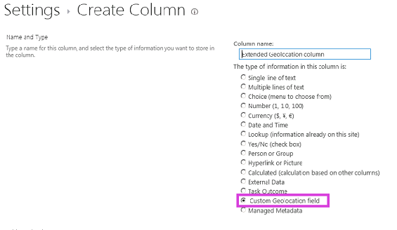

# <a name="extend-the-geolocation-field-type-by-using-client-side-rendering"></a>Расширение типа поля географического расположения с использованием обработки на стороне клиента

Узнайте, как программно персонализировать тип поля о географическом положении в SharePoint с помощью клиентской обработки.

SharePoint представлен новый тип поля с именем географического расположения, которая позволяет добавлять комментарии к списки SharePoint, содержащие сведения о расположении. В столбцах типа географического расположения можно ввести сведения о расположении в виде пары Широта и долгота координат в десятичное градусов или получить координаты текущее расположение пользователя в браузере, если он реализует интерфейс API географического расположения W3C. Дополнительные сведения о поля географического расположения можно [интегрирование расположение и карты функциональные возможности в SharePoint](integrating-location-and-map-functionality-in-sharepoint.md). Тип поля географического расположения недоступен в тип контента по умолчанию из любого списка или библиотеки документов в SharePoint. Тип поля географического расположения включен в SharePoint, но не отображается на странице Создание столбца для списка; Тип поля географического расположения необходимо добавить программными средствами. Дополнительные сведения можно [как: Добавление столбца географического расположения списка программными средствами в SharePoint](how-to-add-a-geolocation-column-to-a-list-programmatically-in-sharepoint.md). 
  
    
    

После добавления типа поля географического расположения SharePoint, его можно использовать для отображения карты с помощью Bing Maps. Встроенные поля географического расположения можно отображать только с помощью службы Bing Maps. Тем не менее можно создать настраиваемое поле, используя поля географического расположения в качестве родительского типа поля. Отображение настраиваемых могут быть предоставлены через свойство **JSLink** в структуре обработки на стороне клиента. Платформа обработки на стороне клиента представлен в SharePoint. Дополнительные сведения можно [как: Настройка типа поля, с использованием обработки на стороне клиента](how-to-customize-a-field-type-using-client-side-rendering.md). 
> **Примечание:** Перечислены JSLink, свойство не поддерживается в опросе или событий. Календарь SharePoint — это список событий. 
  
    
    

Процедуры в этом разделе Создание настраиваемого поля, производные от типа поля географического расположения с использованием обработки на стороне клиента. 
## <a name="prerequisites-for-creating-a-custom-geolocation-field"></a>Необходимые условия для создания настраиваемого поля географического расположения
<a name="CreatingCustomGeolocation_prereq"> </a>

Необходимо иметь следующее:
  
    
    

- Сервере под управлением SharePoint
    
  
- Microsoft Visual Studio 2012
    
  
- Инструменты разработчика Office для Visual Studio 2012
    
  
- Доступ к списку SharePoint, имеющего достаточные права для добавления столбца
    
  

### <a name="core-concepts-to-know-for-customizing-the-geolocation-field"></a>Основные понятия, которые необходимо знать при настройке поля географического расположения


  
    
    

**В таблице 1. Основные понятия, которые для расширения географического расположения тип поля**


|**Заголовок статьи**|**Описание**|
|:-----|:-----|
| [Интеграция расположение и карты функциональные возможности в SharePoint](integrating-location-and-map-functionality-in-sharepoint.md) <br/> |Узнайте, как интегрировать сведения о местоположении и карт в списки SharePoint и веб-расположение и мобильных приложений с помощью нового поля географического расположения и путем создания собственных типов полей на основе географического расположения.  <br/> |
| [Как: Настройка типа поля, с использованием обработки на стороне клиента](how-to-customize-a-field-type-using-client-side-rendering.md) <br/> |Дополнительные сведения о новых клиентская обработка, введенные в SharePoint.  <br/> |
| [Как программно добавить столбец "Географическое расположение" в список SharePoint](how-to-add-a-geolocation-column-to-a-list-programmatically-in-sharepoint.md) <br/> |Узнайте, как для добавления столбца географического расположения списка программными средствами в SharePoint.  <br/> |
   

## <a name="step-1-set-up-the-visual-studio-project"></a>Этап 1: Настройка проекта Visual Studio
<a name="CreatingCustomGeolocationStep_1"> </a>


### <a name="to-set-up-the-custom-field-project"></a>Настройка проекта настраиваемого поля


1. Запустите Visual Studio 2012 на том же компьютере, где установлен SharePoint.
    
  
2. В диалоговом окне **Новый проект** в разделе **Установленные шаблоны**выберите **Visual C#**, **Office SharePoint**для **Решений SharePoint**. Выберите тип проекта **SharePoint** . На рисунке 1 показано расположение шаблона **Проекта SharePoint** в Visual Studio 2012. Сделать **решения фермы**, изолированное решение.
    
   **На рисунке 1. Шаблон проекта SharePoint в Visual Studio**

  

  
  

  

  
3. Укажите имя для проекта. В этом примере мы используем **CustomGeolocationField**. Нажмите кнопку « **ОК** ».
    
  
4. В окне **Мастер настройки SharePoint** введите URL-адрес для сайта SharePoint, где вы хотите развернуть новый тип настраиваемого поля.
    
  
5. В **Обозревателе решений** откройте контекстное меню для имени проекта (в нашем примере это **CustomGeolocationField** ) и выберите команду **Добавить** **Новый элемент**.
    
  
6. В диалоговом окне **Добавление нового элемента** в разделе шаблоны **кода** выберите пункт **класс** и укажите имя для класса ( **CustomGeolocationField.cs** в этом примере).
    
  
7. В **Обозревателе решений** откройте контекстное меню для имени проекта и выберите команду **Добавить**, **сопоставленная папка SharePoint**.
    
  
8. В диалоговом окне **Добавление сопоставленной папки SharePoint** с помощью дерева для сопоставления в папку **TEMPLATE\\LAYOUTS** и нажмите кнопку « **ОК** ».
    
  
9. В **Обозревателе решений** откройте контекстное меню для новой папки **МАКЕТОВ** (не имя проекта) и выберите команду **Добавить** **Новый элемент**.
    
  
10. В диалоговом окне **Добавление нового элемента** выберите **Visual C#**, **Web** и выберите **Файл Javascript** в области **Шаблоны**.
    
  
11. В поле **имя** укажите имя для файла (CustomGeolocationField в нашем примере) и нажмите кнопку **Добавить**.
    
  
12. Повторите шаг 8 для создания другого сопоставленной папки SharePoint и сопоставьте его **TEMPLATE\\XML**. Нажмите кнопку « **ОК** ».
    
  
13. В **Обозревателе решений** откройте контекстное меню для новую папку **XML** (не имя проекта) и выберите команду **Добавить** **Новый элемент**.
    
  
14. В диалоговом окне **Добавление нового элемента** выберите **Visual C#**, **данных** и выберите **XML-файл** в разделе **Шаблоны**.
    
  
15. В поле **имя** укажите имя для файла (в этом примере используетсяfldtypes_CustomGeolocationControl.xml) и нажмите кнопку **Добавить**.
    
  

## <a name="step-2-create-a-custom-field-class"></a>Шаг 2: Создание класса настраиваемого поля
<a name="CreatingCustomGeolocationStep_2"> </a>

 Класс поля — это класс, экземпляры которого может представлять конкретные поля, которые основаны на настраиваемый тип поля. Этот класс должен наследовать от **SPField** или одного из классов в Windows SharePoint Services, производные от него. Чтобы обеспечить возможность расширения и настройки типа поля географического расположения, этот класс должен наследовать **SPFieldGeolocation**. Дополнительные сведения о создании типов полей можно  [Пошаговое руководство: Создание настраиваемого типа поля](http://msdn.microsoft.com/library/089a1b8a-cafc-4050-b445-16650602fe4f%28Office.15%29.aspx). 
  
    
    

> **Примечание:** В этом примере класс и решения с именем **CustomGeolocationField**; можно указать имя класса и проекта, как создать проект Visual Studio. 
  
    
    


### <a name="to-create-a-custom-field-class"></a>Для создания настраиваемого класса полей


1. Откройте файл CustomGeolocationField.cs и добавьте директиву **using** следующим образом.
    
```cs
  
using System;
using Microsoft.SharePoint;
using Microsoft.SharePoint.WebControls;
```

2. Убедитесь, что пространство имен **CustomGeolocationField**. 
    
  
3. Убедитесь, что класс с именем **CustomGeolocationField**и измените его объявление, чтобы указать, что оно наследуется от **SPFieldGeolocation**. Добавьте следующие обязательные конструкторы для класса.
    
```cs
  
public class CustomGeolocationField : SPFieldGeolocation
    {
        /// <summary>
        /// Create an instance of CustomGeolocationField object.
        /// </summary>
        /// <param name="fields">Field collection</param>
        /// <param name="fieldName">Name of the field</param>
        /// 
        public CustomGeolocationField(SPFieldCollection fields, string fieldName)
            : base(fields, fieldName)
        {
        }

        /// <summary>
        /// Create an instance of CustomGeolocationField object.
        /// </summary>
        /// <param name="fields">Field collection</param>
        /// <param name="typeName">type name of the field</param>
        /// <param name="displayName">display name of the field</param>

        public CustomGeolocationField(SPFieldCollection fields, string typeName, string displayName)
            : base(fields, typeName, displayName)
        {
        }
```

4. Добавьте следующее переопределение метода **JSLink** класса. CustomGeolocationControl.js — это файл JavaScript, который создается на следующем шаге. Предоставляя собственный файл JavaScript, при переопределении отображения по умолчанию для службы Bing Maps. Если этот метод не переопределяется, отображения по умолчанию будет из службы Bing Maps. Свойство **JSLink** представлена в SharePoint. Дополнительные сведения о свойстве **JSLink** можно [как: Настройка типа поля, с использованием обработки на стороне клиента](how-to-customize-a-field-type-using-client-side-rendering.md).
    
```cs
  
/// <summary>
        /// Override JSLink property.
        /// </summary>

public override string JSLink
        {
            get
            {
                return "CustomGeolocationControl.js";
            }
            set
            {
                base.JSLink = value;
            }
        }
```

5. Метод **GetFieldValue** Преобразует указанное значение в значение типа поля. Дополнительные сведения о методе **GetFieldValue** [GetFieldValue(String)](https://msdn.microsoft.com/library/Microsoft.SharePoint.SPField.GetFieldValue.aspx) см. Добавьте следующее переопределение метода **GetFieldValue** класса **CustomGeolocationField**.
    
```cs
  
/// <summary>
        /// get the field values
        /// </summary>
        /// <param name="value"></param>
        /// <returns></returns>
        
        public override object GetFieldValue(string value)
        {
            return base.GetFieldValue(value);
        }
```

6. Добавьте следующее переопределение метода  [GetValidatedString](https://msdn.microsoft.com/library/Microsoft.SharePoint.SPField.GetValidatedString.aspx) класса **CustomGeolocationField**:
    
```cs
  
/// <summary>
        /// get validated string
        /// </summary>
        /// <param name="value"></param>
        /// <returns></returns>
        
       public override string GetValidatedString(object value)
        {
            return base.GetValidatedString(value);
        }
```


## <a name="step-3-create-rendering-for-the-new-custom-field"></a>Шаг 3: Создание визуализации для нового настраиваемого поля
<a name="CreatingCustomGeolocationStep_3"> </a>

Далее необходимо создать файл JavaScript, который указывает метод **JSLink** класса поля. Этот файл следует определить визуализации настраиваемого типа поля с помощью новой платформы обработки на стороне клиента. Для получения дополнительных сведений см [Как: Настройка типа поля, с использованием обработки на стороне клиента](how-to-customize-a-field-type-using-client-side-rendering.md).
  
    
    
В следующем примере показано логика регистрации для регистрации с инфраструктурой визуализации со стороны клиента, введенные в SharePoint.
  
    
    


```

function _registerCustomGeolocationFieldTemplate() {
          
            var geolocationFieldContext = {};
            geolocationFieldContext.Templates = {};
            geolocationFieldContext.Templates.Fields = {

                'CustomGeolocationField': {
                    'View': CustomGeolocationFieldTemplate.RenderGeolocationField,
                    'DisplayForm': CustomGeolocationFieldTemplate.SPFieldGeolocation_Display,
                    'EditForm': CustomGeolocationFieldTemplate.SPFieldGeolocation_Edit,
                    'NewForm': CustomGeolocationFieldTemplate.SPFieldGeolocation_Edit
                }
            };
            SPClientTemplates.TemplateManager.RegisterTemplateOverrides(geolocationFieldContext);
        }
```

В процессе регистрации существует четыре переменные и их соответствующих методов. Платформа обработки на стороне клиента вызывает эти методы для отрисовки **CustomGeolocationControl**.
  
    
    
В следующем примере кода создается новый визуализации для нового настраиваемого поля для нового настраиваемого поля, который является производным от географического расположения.
  
    
    

### <a name="to-create-the-javascript-file"></a>Чтобы создать файл JavaScript


1. Создайте текстовый файл и укажите имя, например x, присвойте ему расширение с расширением js и сохраните его в папку TEMPLATE\\LAYOUTS, размещенный в SharePoint. В этом примере используется имя **CustomGeolocationControl.js**.
    
  
2. Скопируйте следующий код в JS-файла.
    
```
  
(function () {
        if (typeof CustomGeolocationFieldTemplate == "object") {
            return;
        }
        window.CustomGeolocationFieldTemplate = (function () {
            return {
                SPFieldGeolocation_Display: function (rCtx) {
                    if (rCtx == null || rCtx.CurrentFieldValue == null || rCtx.CurrentFieldValue == '')
                        return '';
                    var listItem = rCtx['CurrentItem'];
                    var fldvalue = CustomGeolocationFieldTemplate.ParseGeolocationValue(listItem[rCtx.CurrentFieldSchema.Name]);
                    var _myData = SPClientTemplates.Utility.GetFormContextForCurrentField(rCtx);

                    if (_myData == null || _myData.fieldSchema == null)
                        return '';
                    var _latitude = 0;
                    var _longitude = 0;

                    if (fldvalue != null) {
                        _latitude = fldvalue.latitude;
                        _longitude = fldvalue.longitude;
                    }
                  
                    var result = '<div>';
                    result += '<span>Latitude:</span><span>' + _latitude + '</span><span>Longitude:</span><span>' + _longitude + '</span>';
                    result += '</div>';
                    return result;
                },                
                ParseGeolocationValue: function (fieldValue) {

                    if (fieldValue == null || fieldValue == '')
                        return null;

                    var point = new Object();
                    point.longitude = null;
                    point.latitude = null;
                    point.altitude = null;
                    point.measure = null;

                    var matches = fieldValue.match(/POINT\\s*\\((\\d+(\\.\\d+)?)\\s+(\\d+(\\.\\d+)?)\\s+(\\d+(\\.\\d+)?)\\s+(\\d+(\\.\\d+)?)\\)/i);
                    if (matches != null) {

                        point.longitude = parseFloat(matches[1]);
                        point.latitude = parseFloat(matches[3]);
                        point.altitude = parseFloat(matches[5]);
                        point.measure = parseFloat(matches[7]);
                    }
                    else
                    {
                        matches = fieldValue.match(/POINT\\s*\\((\\d+(\\.\\d+)?)\\s+(\\d+(\\.\\d+)?)\\)/i);
                        if (matches != null) {

                            point.longitude = parseFloat(matches[1]);
                            point.latitude = parseFloat(matches[3]);
                        }
                    }
                    return point;
                },
                SPFieldGeolocation_Edit: function (rCtx) {
                    if (rCtx == null)
                        return '';
                    var _myData = SPClientTemplates.Utility.GetFormContextForCurrentField(rCtx);

                    if (_myData == null || _myData.fieldSchema == null)
                        return '';
                    var _latitude = null;
                    var _longitude = null;
                    var _inputId_Latitude = _myData.fieldName + '_' + _myData.fieldSchema.Id + '_$geolocationField_Latitude';
                    var _inputId_Longitude = _myData.fieldName + '_' + _myData.fieldSchema.Id + '_$geolocationField_Longitude';
                    var _inputId_Div = _myData.fieldName + '_' + _myData.fieldSchema.Id + '_$geolocationField_Div';
                    var _latitudeBox = null;
                    var _longitudeBox = null;

                    var _value = _myData.fieldValue != null ? _myData.fieldValue : '';
                    var listItem = rCtx['CurrentItem'];
                    var fldvalue = CustomGeolocationFieldTemplate.ParseGeolocationValue(listItem[rCtx.CurrentFieldSchema.Name]);

                    if (fldvalue != null) {
                        _latitude = fldvalue.latitude;
                        _longitude = fldvalue.longitude;
                    }

                    var validators = new SPClientForms.ClientValidation.ValidatorSet();

                    if (_myData.fieldSchema.Required)
                        validators.RegisterValidator(new SPClientForms.ClientValidation.RequiredValidator());

                    _myData.registerClientValidator(_myData.fieldName, validators);

                    // Post DOM initialization callback.
                    _myData.registerInitCallback(_myData.fieldName, function () {

                        // Initialize the input control references.
                        _latitudeBox = document.getElementById(_inputId_Latitude);
                        _longitudeBox = document.getElementById(_inputId_Longitude);

                        // Set the initial values.
                        if ((_latitudeBox != null &amp;&amp; _longitudeBox != null) &amp;&amp;
                            (_latitude != null &amp;&amp; _longitude != null)) {
                            _latitudeBox.value = _latitude;
                            _longitudeBox.value = _longitude;
                        }
                    });
                    // On focus call back.
                    _myData.registerFocusCallback(_myData.fieldName, function () {
                        if (_latitudeBox != null)
                            _latitudeBox.focus();
                    });
                    // Validation failure handler.
                    _myData.registerValidationErrorCallback(_myData.fieldName, function (errorResult) {
                        SPFormControl_AppendValidationErrorMessage(_inputId_Div, "invalid Geolocation Field");
                    });

                    // Register a callback just before submit.
                    _myData.registerGetValueCallback(_myData.fieldName, function () {
                        if (_latitudeBox == null &amp;&amp; _longitudeBox == null)
                            return '';
                        else {
                            _latitude = _latitudeBox.value;
                            _longitude = _longitudeBox.value;

                            if (_latitude != null &amp;&amp; _longitude != null)
                                return "Point(" + _longitude + " " + _latitude + ")";
                        }
                    });
                    _myData.updateControlValue(_myData.fieldName, _value);

                    var result = '<div width="100%" id=' + STSHtmlEncode(_inputId_Div) + '>';
                    result += '<div><span>Latitude:</span><input id=' + STSHtmlEncode(_inputId_Latitude) + ' type="text" name="Latitude" /></div>';
                    result += '<div><span>Longitude:</span><input id=' + STSHtmlEncode(_inputId_Longitude) + ' type="text" name="Longitude" /></div>';
                    result += '</div>';
                    return result;

                },
                RenderGeolocationField: function (inCtx, field, listItem, listSchema) {
                    var fldvalue = CustomGeolocationFieldTemplate.ParseGeolocationValue(listItem[field.Name]);
                    var result = '';

                    if (fldvalue != null) {
                        var result = '<div>';
                        result += '<span>Latitude:</span><span>' + fldvalue.latitude + '</span><span>Longitude:</span><span>' + fldvalue.longitude + '</span>';
                        result += '</div>';                            
                    }
                    return result;                    
                }                                       
            };
        })();
        function _registerCustomGeolocationFieldTemplate() {
          
            var geolocationFieldContext = {};
            geolocationFieldContext.Templates = {};
            geolocationFieldContext.Templates.Fields = {

                'CustomGeolocationField': {
                    'View': CustomGeolocationFieldTemplate.RenderGeolocationField,
                    'DisplayForm': CustomGeolocationFieldTemplate.SPFieldGeolocation_Display,
                    'EditForm': CustomGeolocationFieldTemplate.SPFieldGeolocation_Edit,
                    'NewForm': CustomGeolocationFieldTemplate.SPFieldGeolocation_Edit
                }
            };
            SPClientTemplates.TemplateManager.RegisterTemplateOverrides(geolocationFieldContext);
        }
        ExecuteOrDelayUntilScriptLoaded(_registerCustomGeolocationFieldTemplate, 'clienttemplates.js');
    })();
```


## <a name="step-4-create-a-field-type-definition"></a>Шаг 4: Создание определения типа поля
<a name="CreatingCustomGeolocationStep_4"> </a>

Определение типа поля — XML-файл с именем вроде  _fldtypes*.xml_, который будет развернут в %ProgramFiles%\\Common Files\\Microsoft Shared\\web server extensions\\15\\TEMPLATE\\XML. Файл определения поля содержит сведения, что необходимо правильно отображать поля в представлениях списков и отображения, редактирования и создания форм SharePoint Foundation. Важнее определение содержит сведения о сборке, содержащей тип скомпилированной поля. Дополнительные сведения о определения типов полей можно [как: Создание определения типа настраиваемого поля](http://msdn.microsoft.com/library/b3315997-671f-4c29-9518-48cc4592f205%28Office.15%29.aspx).
  
    
    

### <a name="to-create-the-field-type-definition"></a>Для создания определения типа поля


1. В Visual Studio выполните построение проекта. Этот проект еще не закончен, но его необходимо построить именно сейчас, чтобы сгенерировать код GUID и маркер открытого ключа для этой сборки. 
    
  
2. Откройте файл fldtypes_CustomGeolocationControl.xml и замените его содержимое следующей разметкой.
    
```XML
  
?xml version="1.0" encoding="utf-8" ?>

<FieldTypes>
  <FieldType>
    <Field Name="TypeName">CustomGeolocationField</Field>
    <Field Name="ParentType">Geolocation</Field>
    <Field Name="TypeDisplayName">Custom Geolocation field</Field>
    <Field Name="TypeShortDescription"> Custom Geolocation field </Field>
    <Field Name="UserCreatable">TRUE</Field>
    <Field Name="ShowOnListCreate">TRUE</Field>
    <Field Name="ShowOnSurveyCreate">TRUE</Field>
    <Field Name="ShowOnDocumentLibraryCreate">TRUE</Field>
    <Field Name="ShowOnColumnTemplateCreate">TRUE</Field>
    <Field Name="FieldTypeClass">CustomGeolocationField.CustomGeolocationField,$SharePoint.Project.AssemblyFullName$</Field>
    <Field Name="SQLType">nvarchar</Field>
  </FieldType>
</FieldTypes>

```


    This file defines the custom field type for SharePoint. For details about the purpose and meaning of its elements, see  [Custom Field Type Definition](http://msdn.microsoft.com/library/b3315997-671f-4c29-9518-48cc4592f205%28Office.15%29.aspx),  [FldTypes.xml](http://msdn.microsoft.com/library/8f8db866-03f8-4001-aae3-4c4102a7aed6%28Office.15%29.aspx),  [FieldTypes Element (Field Types)](http://msdn.microsoft.com/library/ebac779f-c7c5-401b-8503-e514cd96f5a7%28Office.15%29.aspx),  [FieldType Element (Field Types)](http://msdn.microsoft.com/library/9ab89988-3462-422f-9808-40618da7316b%28Office.15%29.aspx), and  [Field Element (Field Types)](http://msdn.microsoft.com/library/c168e8bc-8aba-4b72-a9c4-a0ad7a4aff9a%28Office.15%29.aspx). Note that the **<Field Name="FieldTypeClass">** element must be entirely on one line.
    
  
3. Значение элемента **<Field Name="FieldTypeClass">** — полное имя класс настраиваемого поля, а затем запятую, а затем маркер Visual Studio ( `$SharePoint.Project.AssemblyFullName$`). При компиляции проекта копию этого файла создается в котором маркер заменяется четырех полное имя сборки. При выборе **Развернуть решение** в меню **Построение**Visual Studio в Visual Studio 2012 развертывается эту копию.
    
  

## <a name="step-5-build-and-test-the-custom-field-type"></a>Шаг 5: Создание и тестирование настраиваемого типа поля
<a name="CreatingCustomGeolocationStep_5"> </a>

После развертывания настраиваемого поля в SharePoint server новый настраиваемый столбец можно добавить любой список SharePoint на сервере, где развернуто решение.
  
    
    

1. Нажмите клавишу F5.
    
    > **Примечание:** При нажатии F5, Visual Studio создает решение, развертывает решение и открывает веб-сайт SharePoint, где развернуто решение. 
2. Создать настраиваемый список и добавления нового столбца географического расположения настраиваемого поля.
    
  
3. Добавьте один из элементов в список и предоставляют Широта и долгота значения для столбца географического расположения Custom.
    
  
4. На рисунке 2 показана страница столбца Создание нового типа настраиваемого поля.
    
   **На рисунке 2. Создание нового столбца типа настраиваемого поля**

  

  
  

  

  

## <a name="additional-resources"></a>Дополнительные ресурсы
<a name="SP15Createcustomgeo_addlresources"> </a>


-  [Интеграция расположение и карты функциональные возможности в SharePoint](integrating-location-and-map-functionality-in-sharepoint.md)
    
  
-  [Как программно добавить столбец "Географическое расположение" в список SharePoint](how-to-add-a-geolocation-column-to-a-list-programmatically-in-sharepoint.md)
    
  
-  [Как: Настройка типа поля, с использованием обработки на стороне клиента](how-to-customize-a-field-type-using-client-side-rendering.md)
    
  
-  [SharePoint: создание поля "Географическое положение", которое показывает карты с помощью службы Nokia Maps](http://code.msdn.microsoft.com/SharePoint-Create-a-d9a91551)
    
  
-  [Как: Создание настраиваемого типа поля](http://msdn.microsoft.com/library/aacdc6d1-86c8-4a6b-953d-22ecac209d0f%28Office.15%29.aspx)
    
  
-  [Развертывание файлов, использование сопоставленных папок](http://blogs.msdn.com/b/vssharepointtoolsblog/archive/2010/03/12/deploying-files-using-mapped-folders.aspx)
    
  

