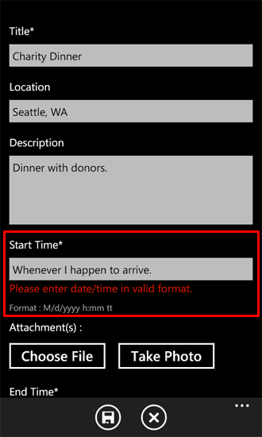
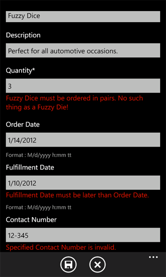

# <a name="how-to-implement-business-logic-and-data-validation-in-a-windows-phone-app-for-sharepoint"></a>Как: реализация бизнес-логики и данных проверок в приложении Windows Phone для SharePoint
Реализуйте проверку данных в приложении Windows Phone, созданном с помощью шаблона приложения списка SharePoint для Windows Phone. В приложении Windows Phone, предназначенного для рабочей среды, скорее всего, потребуется проверить данные, введенные пользователями для, например, для применения бизнес-логики, предназначенных для вашей конкретной ситуации для обеспечения соответствующий формат значений, введенных или просто для перехвата ошибок перед сохранением значения в список SharePoint. Проекты на основе шаблона приложения списка SharePoint для Windows Phone содержат логику проверки данных по умолчанию, но таких проектов также предоставляют механизм для разработчиков для реализации проверки пользовательских данных.
  
    
    


> **Важные:** При разработке приложения для Windows Phone 8, должны использовать Visual Studio Express 2012 г., а не в Visual Studio 2010 Express. За исключением среды разработки все сведения в этой статье применимы к созданию приложений для Windows Phone 8 и Windows Phone 7. > Для получения дополнительных сведений см [как: Настройка среды разработки мобильных приложений для SharePoint](how-to-set-up-an-environment-for-developing-mobile-apps-for-sharepoint.md). 
  
    
    


## <a name="default-data-validation-rules"></a>Правила проверки данных по умолчанию
<a name="BKMK_DefaultValidation"> </a>

По умолчанию с помощью простого форматирования или выполнить проверку данных связаны некоторые типы данных для полей в списках SharePoint. Если вводится недопустимый URL-адрес для поля, по полю гиперссылки и рисунки, введите в списке SharePoint и пытается сохранить изменения, появится сообщение о том, что введенный адрес является недопустимым. Если ввести имя клиента в качестве значения для поля даты и времени тип поля, появится сообщение с указанием введите дату в допустимый диапазон для поля.
  
    
    

> **Примечание:** Проверка ввода даты — по отношению к SharePoint формат даты. При необходимости в формате языкового телефона, Настройка поля и добавьте проверки соответствующим образом. 
  
    
    

Некоторые из этих основных правил проверки также применяется по умолчанию в приложении Windows Phone, созданных на основе шаблона приложения списка SharePoint для Windows Phone. При вводе отличное от значения даты в поля, привязанного к полю SharePoint тип даты и времени в форме редактирования приложении Windows Phone на основе списка SharePoint, появится сообщение об ошибке проверки при изменении фокуса из элемента управления **TextBox**, связанного с полем. (См.)
  
    
    

**На рисунке 1. Очередь ошибок проверки в приложении Windows Phone**

  
    
    

  
    
    

  
    
    
Текстовое поле «Время начала» в форме редактирования привязан к полю даты и времени в списке SharePoint, на котором основано в этом примере приложения. Очередь ошибок проверки (текстом красного цвета) показано на рисунке 1 отображается, если недопустимую дату, введенных в текстовое поле (и текстовое поле впоследствии теряет фокус) так, как свойство **ValidatesOnNotifyDataErrors** **Binding** объекта, связанного с помощью свойства **Text** элемента управления **TextBox** **True** в объявлении XAML, который определяет **TextBox** в файле EditForm.xaml.
  
    
    


```XML

<StackPanel Orientation="Vertical" Margin="0,5,0,5">
   <TextBlock TextWrapping="Wrap" HorizontalAlignment="Left" 
                    Style="{StaticResource PhoneTextNormalStyle}">Start Time*
   </TextBlock>
   <TextBox Height="Auto" Style="{StaticResource TextValidationTemplate}"
    FontSize="{StaticResource PhoneFontSizeNormal}" Width="470" 
        HorizontalAlignment="Left" Name="txtEventDate"
    Text="{Binding [EventDate], Mode=TwoWay, ValidatesOnNotifyDataErrors=True,
                       NotifyOnValidationError=True}"
    TextWrapping="Wrap" />
   <TextBlock FontSize="16" TextWrapping="Wrap" HorizontalAlignment="Left"
    Style="{StaticResource PhoneTextSubtleStyle}" Text="{Binding DateTimeFormat}" />
</StackPanel>
```

( **ValidatesOnNotifyDataErrors** задано значение **False**, есть ли у пользователя нет сигнал о том, что введенных данных является недопустимым, пока не выбран кнопку **Сохранить**. В этот момент на экране пользователя отображается сообщение об ошибке относительно ошибок проверки, так как проверка формата даты введенных значений по-прежнему выполняемые с базовый класс, от которого наследуется класс **EditItemViewModel**.)
  
    
    
Однако некоторые поля могут не предоставлять все уведомления о недопустимых данных в приложении Windows Phone. И шаблоны проектов хорошо продуманного Visual Studio обязательно обобщенный для использования в качестве отправной точки для разных приложениях. Шаблона приложения списка SharePoint для Windows Phone не может включать правила проверки, предназначенных для конкретных контекстах и еще сохранять свое значение как общий шаблон. В зависимости от ваших потребностей и условиях, в которых будут использоваться определенного приложения Windows Phone скорее всего потребуется реализовать правил проверки данных.
  
    
    

## <a name="implement-custom-data-validation-rules"></a>Реализации правил проверки данных
<a name="BKMK_CustomValidation"> </a>

Можно проверить данные, введенные пользователями вашего приложения Windows Phone с несколькими способами. Проект, созданный с использованием шаблона приложения списка SharePoint для Windows Phone включает классы, которые используются в качестве посредников между формы (то есть, представления) данных в приложении Windows Phone (например, файл EditForm.xaml) и самих данных в списке SharePoint, на котором приложения на основе. Эти классы можно оценить как реализации компоненте ViewModel  [шаблон разработки Model-View-ViewModel](http://blogs.msdn.com/b/johngossman/archive/2005/10/08/478683.aspx) (на рисунке 2). (Дополнительные сведения о как шаблона приложения списка SharePoint для Windows Phone соответствует шаблон разработки программного обеспечения MVVM см. [Архитектура шаблона приложения списка SharePoint для Windows Phone](architecture-of-the-windows-phone-sharepoint-list-application-template.md)).
  
    
    

> **Примечание:** Шаблоны списков SharePoint не включать обнаруживаются по умолчанию (например, процент завершения в списке задач SharePoint post флажок для групп обсуждений списка и проверки типа decimal полей SP), но можно реализовать такой проверки. 
  
    
    


**На рисунке 2. Файлы шаблонов в компоненте ViewModel**

  
    
    

  
    
    

  
    
    
В приложениях, разработанных на основании шаблоне MVVM, проверка данных часто используется на уровне данных (то есть в компоненте модели). В проектах, созданных на основе шаблона приложения списка SharePoint для Windows Phone, было расширяемый механизм для проверки данных «передать» слой и реализации в компоненте ViewModel, чтобы упростить для разработчиков для управления проверки данных. Проекты на основе шаблона таким образом, наиболее подходящего месте пользовательского кода, который проверяет входные данные пользователя или управляет данными, в противном случае — в эти классы ViewModel. Выполнить проверку данных, класс **EditItemViewModel** и класс **NewItemViewModel** (классы, связанные с формами, скорее всего, охватывающие изменение и обновление данных списков) оба предоставить open реализацию метода проверки (с именем **Validate**), который переопределяет метод базового проверки в классе, от которого наследуются этих двух классов.
  
    
    


```cs

public override void Validate(string fieldName, object value)
   {
      base.Validate(fieldName, value);
   }
```

Этот метод — это удобный для разработчика для добавления настраиваемую логику проверки, отдельные целевые значения поля. Общий подход заключается в том, чтобы проверить значение аргумента **fieldName**, переданной в метод **Validate** для идентификации поля, который необходимо связать с нестандартной проверки кода. К примеру, можно используется оператор **switch** в реализации данного метода чтобы предоставить логику проверки, относящиеся к различным полям в форме редактирования (EditForm.xaml) приложение Windows.
  
    
    
В следующем примере кода предполагается, что установка SharePoint Server содержит список заказов на продукт, созданный на основе шаблона настраиваемого списка. Список был создан с помощью типов столбцов и полей показано в таблице 1.
  
    
    

**В таблице 1. Список заказов на продукт**


|**Столбец**|**Тип**|**Required**|
|:-----|:-----|:-----|
|Продукт (например, заголовок)  <br/> |Однострочный текст (Текст)  <br/> |Да  <br/> |
|Описание  <br/> |Однострочный текст (Текст)  <br/> |Нет  <br/> |
|Количество  <br/> |Число  <br/> |Да  <br/> |
|Дата заказа  <br/> |Дата и время (DateTime)  <br/> |Нет  <br/> |
|Дата выполнения  <br/> |Дата и время (DateTime)  <br/> |Нет  <br/> |
|Номер контакта  <br/> |Однострочный текст (Текст)  <br/> |Нет  <br/> |
   
Опять же в целях в этом примере предполагается, что следующие правила простой проверки находятся для применения, бизнес-логики в вымышленной компании Contoso, Ltd., для данного продукта упорядочивание системы на основании:
  
    
    

- Даты выполнения заказов orders должно быть позже даты, на котором размещена порядке.
    
  
- Если пользователь хочет размещение заказа на продукт, с именем Нечеткое кости, кости должны быть упорядочены в пары. В соответствии с правилами символы в компании Contoso, Ltd. нет просто нет такого понятия, как Нечеткое умереть.
    
  
- В списке заказов продукта тип поля для телефонных номеров является «Однострочный текст» (текст), который может быть любой текст (до 255 знаков по умолчанию). В данном примере форматирования правило проверки принудительно, которому требуется введенных данных должен находиться в одном из распространенных форматов номеров телефона. Например, «(555) 555-55 55».
    
  

### <a name="to-implement-custom-validation-rules"></a>Для реализации настраиваемых правил проверки


1. Предположим, что вы создали списка SharePoint на основе шаблона настраиваемый список, который включает в себя столбцов и типов, указанных в таблице 1, создание приложения Windows Phone с использованием шаблона приложения списка SharePoint для Windows Phone в Visual Studio, выполнив действия в [как: Создание приложения списка SharePoint для Windows Phone](how-to-create-a-windows-phone-sharepoint-list-app.md).
    
  
2. В **Обозревателе решений** в папке ViewModels для проекта дважды щелкните файл EditItemViewModel.cs (или выберите файл и нажмите кнопкуF7) для открытия файла для редактирования.
    
  
3. Добавьте следующие директивы **using** списка директив в верхней части файла.
    
```cs
  
using System.Globalization;
using System.Text.RegularExpressions;
```

4. Замените реализация по умолчанию с помощью метода **Validate** в файл следующий код.
    
```cs
  
public override void Validate(string fieldName, object value)
{
    string fieldValue = value.ToString();
    if (!string.IsNullOrEmpty(fieldValue)) //Allowing for blank fields.
    {
        bool isProperValue = false;

        switch (fieldName)
        {
            case "Quantity":
                // Enforce ordering Fuzzy Dice in pairs only.
                int quantityOrdered;
                isProperValue = Int32.TryParse(fieldValue, out quantityOrdered);
                if (isProperValue)
                {
                    if ((quantityOrdered % 2) != 0) // Odd number of product items ordered.
                    {
                        if ((string)this["Title"] == "Fuzzy Dice")
                        {
                            AddError("Item[Quantity]", "Fuzzy Dice must be ordered in pairs. 
                                                                   No such thing as a Fuzzy Die!");
                        }
                        else
                        {
                            // Restriction on ordering in pairs doesn't apply to other products.
                            RemoveAllErrors("Item[Quantity]");
                        }
                    }
                    else
                    {
                        RemoveAllErrors("Item[Quantity]");
                    }
                }
                break;
            case "Fulfillment_x0020_Date":
                // Determine whether fulfillment date is later than order date.
                DateTime fulfillmentDate;
                isProperValue = DateTime.TryParse(fieldValue, CultureInfo.CurrentCulture, 
                              DateTimeStyles.AssumeLocal, out fulfillmentDate);
                if (isProperValue)
                {
                    DateTime orderDate;
                    isProperValue = DateTime.TryParse((string)this["Order_x0020_Date"], 
                               CultureInfo.CurrentCulture, DateTimeStyles.AssumeLocal, out orderDate);

                    if (fulfillmentDate.CompareTo(orderDate) > 0)
                    {
                        RemoveAllErrors("Item[Fulfillment_x0020_Date]");
                    }
                    else
                    {
                        AddError("Item[Fulfillment_x0020_Date]", 
                                "Fulfillment Date must be later than Order Date.");
                    }
                }
                break;
            case "Contact_x0020_Number":
                // Check that contact number is in an appropriate format.
                Regex rx = new Regex(@"^\\(?([0-9]{3})\\)?[-. ]?([0-9]{3})[-. ]?([0-9]{4})$");
                if (rx.IsMatch(fieldValue))
                {
                    RemoveAllErrors("Item[Contact_x0020_Number]");
                }
                else
                {
                    //Specified Contact Number is not a valid phone number.
                    AddError("Item[Contact_x0020_Number]", "Specified Contact Number is invalid.");
                }
                break;
            default:
                // Not adding custom validation for other fields.
                break;
        }
    }

    //And then proceed with default validation from base class.
    base.Validate(fieldName, value);
}
```


    Keep in mind that the field names specified in this code sample are based on properties of the sample Product Orders list specified in Table 1. (Notice that in the XML schema for list fields in SharePoint Server, spaces in the names of fields are replaced with the string "_x0020_" for the **Name** attribute of the **Field** element that defines a given field. The template uses the **Name** attribute for a **Field** element as it is defined in the XML schema on the server, not the **DisplayName** attribute.) You can identify the field names of those fields for which you want to implement validation logic by looking at the **Binding** declarations of the **Text** properties for the **TextBox** objects defined in EditForm.xaml or by examining the **ViewFields** string of the **CamlQueryBuilder** class in the ListProvider.cs file.
    
  
5. Сохраните файл.
    
  
Настраиваемая проверка кода в этом примере выполняется только в том случае, если аргумент **value**, переданной в метод **Validate** не может быть null или пустую строку. Как показано в таблице 1, поля Дата выполнения и номер контакта не требуются для хранения данных (как список определяется в целях в этом примере SharePoint Server ), поэтому его нужно разрешить эти поля как пустые. Простой проверку, чтобы определить, является ли аргумент **value** значение null, недостаточно, так как значение, переданное может быть строка нулевой длины (к которым не соответствуют нулевое значение), а для данного примера необходимо объявить недействительным пустых строк для полей, которые могут быть пустым. Логику проверки для поля Кол-во и Дата выполнения включает в себя дополнительные проверки значений, подставляемых в, чтобы убедиться в их соответствующего типа. Начальная проверка здесь (перед оператором **switch** ) подтверждено только, переданное значение, не равно null (вместо проверки на соответствие узкие условие являются строку нулевой длины), эти проверки будет по-прежнему не выполняется, если это значение было строку нулевой длины, но логики для проверки данных для **Номер контакта** поля *будет*  по-прежнему выполняется, если значение, переданное были строку нулевой длины. И в этом примере, чтобы предоставить в поле номер контакта должно быть пустым (строкой нулевой длины), особенно при запуске изменении элемента списка, открыв форма редактирования.
  
    
    
Если построение проекта и его развертывание на эмулятора Windows Phone для ее выполнения можно проверить свою логику проверки, введя данные, которые нарушают бизнес-правил в поля в список в форме редактирования app. (увидеть на рисунке 3.)
  
    
    

**На рисунке 3. Настраиваемые очереди проверки ошибок**

  
    
    

  
    
    

  
    
    
Код, приведенный в этом примере содержащийся в файле EditItemViewModel.cs только, применяет эти правила проверки данных, введенных пользователями только в форме редактирования. Если вы хотите добавить правила проверки обоих при пользователям  *добавлять*  новые элементы также при их изменить их, необходимо включить ту же логику проверки в метод **Validate** в NewItemViewModel.cs файл (или желательно, чтобы создать отдельный файл класса с функция, которая включает в себя этот логику проверки и звонок, то же самое функции из методов **Validate** в файле EditItemViewModel.cs и файл NewItemViewModel.cs).
  
    
    
Логику проверки в этом примере применяет данного бизнес-правил, указывающий пользователя, что введенных данных не в формате, допускаемых правила, но не перехвачены и изменена этот код введенных данных. Для перехвата и, например, формат телефонных номеров в едином виде перед сохранением данных в список SharePoint, вы можете реализовать преобразование пользовательских данных для введенных номеров телефонов. Объяснение преобразование пользовательских данных для полей элемента списка, в разделе [как: поддержка и convert SharePoint поля типов приложений Windows Phone](how-to-support-and-convert-sharepoint-field-types-for-windows-phone-apps.md).
  
    
    

## <a name="additional-resources"></a>Дополнительные ресурсы
<a name="SP15Implementbuslogic_addlresources"> </a>


-  [Построение приложений Windows Phone, обращающихся к SharePoint](build-windows-phone-apps-that-access-sharepoint.md)
    
  
-  [Привязка данных Silverlight](http://msdn.microsoft.com/en-us/library/cc278072.aspx)
    
  
-  [Как: Настройка среды разработки мобильных приложений для SharePoint](how-to-set-up-an-environment-for-developing-mobile-apps-for-sharepoint.md)
    
  
-  [Windows Phone SDK 8.0](http://www.microsoft.com/en-us/download/details.aspx?id=35471)
    
  
-  [Пакет SDK Microsoft SharePoint для Windows Phone 8](http://www.microsoft.com/en-us/download/details.aspx?id=36818)
    
  
-  [Пакет SDK для Windows Phone 7.1](http://www.microsoft.com/en-us/download/details.aspx?id=27570)
    
  
-  [Пакет SDK Microsoft SharePoint для Windows Phone 7.1](http://www.microsoft.com/en-us/download/details.aspx?id=30476)
    
  

