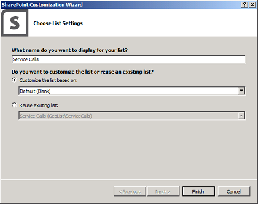
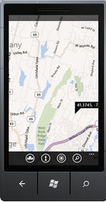

# <a name="integrate-maps-with-windows-phone-apps-and-sharepoint-lists"></a><span data-ttu-id="07998-102">Интеграция карт, приложений Windows Phone и списков SharePoint</span><span class="sxs-lookup"><span data-stu-id="07998-102">Integrate maps with Windows Phone apps and SharePoint lists</span></span>
<span data-ttu-id="07998-103">Узнайте, как интегрировать в списки SharePoint сведения о местонахождении и карты, а также веб-приложения и мобильные Надстройки SharePoint на основе местонахождения с использованием нового поля географического положения и путем создания собственных типов полей на основе географического положения.</span><span class="sxs-lookup"><span data-stu-id="07998-103">Learn how to integrate location information and maps in SharePoint lists and location-based web and mobile SharePoint Add-ins, by using the new Geolocation field, and by creating your own geolocation-based field types.</span></span>
<span data-ttu-id="07998-104">SharePoint представлен новый тип поля с именем географического расположения, которая позволяет добавлять комментарии к списки SharePoint, содержащие сведения о расположении.</span><span class="sxs-lookup"><span data-stu-id="07998-104">SharePoint introduces a new field type named Geolocation that enables you to annotate SharePoint lists with location information.</span></span> <span data-ttu-id="07998-105">В столбцах типа географического расположения можно ввести сведения о расположении в виде пары Широта и долгота координат в десятичное градусов или получить координаты текущее расположение пользователя в браузере, если браузер реализует интерфейс API географического расположения W3C.</span><span class="sxs-lookup"><span data-stu-id="07998-105">In columns of type Geolocation, you can enter location information as a pair of latitude and longitude coordinates in decimal degrees or retrieve the coordinates of the user's current location from the browser, if the browser implements the W3C Geolocation API.</span></span> <span data-ttu-id="07998-106">В списке SharePoint расположение на карте корневых объектов на базе службы Bing Maps.</span><span class="sxs-lookup"><span data-stu-id="07998-106">In the list, SharePoint displays the location on a map powered by Bing Maps.</span></span> <span data-ttu-id="07998-107">Друг с другом поля географического расположения и представления карты позволяют предоставить Пространственные контекста какие-либо сведения по интеграции данных из SharePoint в сопоставления качества и позволяют пользователям вступать в новых способов в web и мобильных приложений и решений.</span><span class="sxs-lookup"><span data-stu-id="07998-107">Together, the Geolocation field and the Map View enable you to give a spatial context to any information by integrating data from SharePoint into a mapping experience, and let your users engage in new ways in your web and mobile apps and solutions.</span></span> <span data-ttu-id="07998-108">Мы будем для создания простого Windows 7, сопоставляет мобильного приложения, который использует функцию тип поля географического расположения SharePoint для использования возможностей сопоставления может отображать для мобильных устройств надстройки SharePoint элементов списка.</span><span class="sxs-lookup"><span data-stu-id="07998-108">We'll help you create a simple Windows 7 mobile app which uses the SharePoint Geolocation field type feature to use mapping capabilities so you can display maps on mobile SharePoint Add-in list items.</span></span>
  
    
    


> <span data-ttu-id="07998-109">**Важные:** При разработке приложения для Windows Phone 8, должны использовать Visual Studio Express 2012 г., а не в Visual Studio 2010 Express.</span><span class="sxs-lookup"><span data-stu-id="07998-109">**Important:** If you are developing an app for Windows Phone 8, you must use Visual Studio Express 2012 instead of Visual Studio 2010 Express.</span></span> <span data-ttu-id="07998-110">За исключением среды разработки все сведения в этой статье применимы к созданию приложений для Windows Phone 8 и Windows Phone 7.</span><span class="sxs-lookup"><span data-stu-id="07998-110">Except for the development environment, all information in this article applies to creating apps for both Windows Phone 8 and Windows Phone 7.</span></span> <span data-ttu-id="07998-111">> Для получения дополнительных сведений см [как: Настройка среды разработки мобильных приложений для SharePoint](how-to-set-up-an-environment-for-developing-mobile-apps-for-sharepoint.md).</span><span class="sxs-lookup"><span data-stu-id="07998-111">> For more information, see  [How to: Set up an environment for developing mobile apps for SharePoint](how-to-set-up-an-environment-for-developing-mobile-apps-for-sharepoint.md).</span></span> 
  
    
    


## <a name="prerequisites-for-creating-a-map-based-windows-phone-app"></a><span data-ttu-id="07998-112">Необходимые условия для создания приложения на основе карты Windows phone</span><span class="sxs-lookup"><span data-stu-id="07998-112">Prerequisites for creating a map-based Windows phone app</span></span>
<span data-ttu-id="07998-113"><a name="SP15Integratemaps_prereeq"> </a></span><span class="sxs-lookup"><span data-stu-id="07998-113"></span></span>

<span data-ttu-id="07998-114">Убедитесь в том, что у вас есть следующие компоненты:</span><span class="sxs-lookup"><span data-stu-id="07998-114">Ensure that you have the following installed:</span></span>
  
    
    

- <span data-ttu-id="07998-115">SharePoint</span><span class="sxs-lookup"><span data-stu-id="07998-115">SharePoint</span></span>
    
  
- <span data-ttu-id="07998-116">Visual Studio 2012</span><span class="sxs-lookup"><span data-stu-id="07998-116">Visual Studio 2012</span></span>
    
  
- <span data-ttu-id="07998-117">Visual Studio Express 2010 с помощью новых шаблонами телефонов SharePoint из  [SDK Microsoft SharePoint для Windows Phone 7.1](http://www.microsoft.com/en-us/download/details.aspx?id=30476)</span><span class="sxs-lookup"><span data-stu-id="07998-117">Visual Studio Express 2010 with new the SharePoint phone templates from  [Microsoft SharePoint SDK for Windows Phone 7.1](http://www.microsoft.com/en-us/download/details.aspx?id=30476)</span></span>
    
  
- <span data-ttu-id="07998-118">Доступ к списку SharePoint, имеющего достаточные права для добавления столбца</span><span class="sxs-lookup"><span data-stu-id="07998-118">Access to a SharePoint list, with sufficient privileges to add a column</span></span>
    
  
- <span data-ttu-id="07998-119">Ключ Bing Maps, развернут сервер; просмотреть [как: задать ключ карт Bing на уровне веб-серверы и фермы в SharePoint](how-to-set-the-bing-maps-key-at-the-web-and-farm-level-in-sharepoint.md)</span><span class="sxs-lookup"><span data-stu-id="07998-119">The Bing Maps key deployed to your server; see  [How to: Set the Bing Maps key at the web and farm level in SharePoint](how-to-set-the-bing-maps-key-at-the-web-and-farm-level-in-sharepoint.md)</span></span>
    
  

## <a name="step-1-create-a-sharepoint-field-by-using-the-geolocation-feature"></a><span data-ttu-id="07998-120">Шаг 1: Создание поля SharePoint с помощью компонента географического расположения</span><span class="sxs-lookup"><span data-stu-id="07998-120">Step 1: Create a SharePoint field by using the Geolocation feature</span></span>
<span data-ttu-id="07998-121"><a name="HowToCreateMapBasedPhoneApp_Step1"> </a></span><span class="sxs-lookup"><span data-stu-id="07998-121"></span></span>

<span data-ttu-id="07998-p103">В столбце географического расположения недоступен в списки SharePoint по умолчанию. Потребуется написать код для добавления столбца к списку SharePoint. Мы покажем, как добавить поля географического расположения в список программным путем с помощью клиентской объектной модели SharePoint. После добавления поля в списке поля географического расположения как компонент можно добавить в список.</span><span class="sxs-lookup"><span data-stu-id="07998-p103">The Geolocation column is not available by default in SharePoint lists. You have to write code to add the column to a SharePoint list. We'll show you how to add the Geolocation field to a list programmatically by using the SharePoint client object model. After you add the field to the list, you can add Geolocation field as a feature to the list.</span></span>
  
    
    

### <a name="to-create-the-visual-studio-project"></a><span data-ttu-id="07998-126">Создание проекта Visual Studio</span><span class="sxs-lookup"><span data-stu-id="07998-126">To create the Visual Studio project</span></span>


1. <span data-ttu-id="07998-127">Выполните вход с правами администратора на сервере SharePoint.</span><span class="sxs-lookup"><span data-stu-id="07998-127">Log on as an administrator to the server running SharePoint.</span></span>
    
  
2. <span data-ttu-id="07998-p104">Запустите **Visual Studio** и выберите **файл**, **Создать проект**. Откроется диалоговое окно **Новый проект**.</span><span class="sxs-lookup"><span data-stu-id="07998-p104">Start **Visual Studio** and choose **File**, **New Project**. The **New Project** dialog box opens.</span></span>
    
  
3. <span data-ttu-id="07998-130">В диалоговом окне **Создать проект** выберите **Visual C#**, выберите пункт **SharePoint**и затем выберите тип проекта **SharePoint** .</span><span class="sxs-lookup"><span data-stu-id="07998-130">In the **New Project** dialog box, choose **Visual C#**, choose **SharePoint**, and then choose the **SharePoint** Project type.</span></span>
    
  
4. <span data-ttu-id="07998-p105">Назовите проект. В этом примере мы используем **GeoList**. Нажмите кнопку « **ОК** ».</span><span class="sxs-lookup"><span data-stu-id="07998-p105">Name the project. In this example, we use **GeoList**. Choose the **OK** button.</span></span>
    
  
5. <span data-ttu-id="07998-134">В окне **Мастер настройки SharePoint** введите URL-адрес семейства веб-сайтов, которое использует тот же список SharePoint, который требуется получить доступ к для разработки приложений для телефонов.</span><span class="sxs-lookup"><span data-stu-id="07998-134">In the **SharePoint Customization Wizard**, enter the URL for the site collection that uses the same SharePoint list that you want to access for phone development.</span></span>
    
  
6. <span data-ttu-id="07998-135">В **Обозревателе решений** откройте контекстное меню для проекта **GeoList** и затем выберите команду **Добавить** **Новый элемент**.</span><span class="sxs-lookup"><span data-stu-id="07998-135">In **Solution Explorer**, open the shortcut menu for the **GeoList** project, and then choose **Add**, **New Item**.</span></span>
    
  
7. <span data-ttu-id="07998-p106">В диалоговом окне **Добавление нового элемента** выберите **список**. Имя списка. В этом примере мы используем **ServiceCalls**.</span><span class="sxs-lookup"><span data-stu-id="07998-p106">In the **Add New Item** dialog box, choose **List**. Name the list. In this example, we use **ServiceCalls**.</span></span>
    
  
8. <span data-ttu-id="07998-p107">В диалоговом окне **Выбор параметров списка** добавьте отображаемое имя. В этом примере используется **Служба звонки**. **Выберите для настройки на основе списка** выберите **по умолчанию (пусто)**, как показано на рисунке 1.</span><span class="sxs-lookup"><span data-stu-id="07998-p107">In the **Choose List Settings** dialog box, add a display name. In this example, we use **Service Calls**. For **Choose to customize the list based on**, choose **Default (Blank)**, as shown in Figure 1.</span></span>
    
    <span data-ttu-id="07998-142">Нажмите **Готово**.</span><span class="sxs-lookup"><span data-stu-id="07998-142">Then, choose **Finish**.</span></span>
    

   <span data-ttu-id="07998-143">**На рисунке 1. Добавление списка SharePoint с помощью мастера создания списка SharePoint**</span><span class="sxs-lookup"><span data-stu-id="07998-143">**Figure 1. Adding the SharePoint list by using the SharePoint List wizard**</span></span>

  

  
  

  

  

### <a name="to-add-a-feature-to-the-sharepoint-list"></a><span data-ttu-id="07998-145">Добавление компонента в список SharePoint</span><span class="sxs-lookup"><span data-stu-id="07998-145">To add a Feature to the SharePoint list</span></span>


1. <span data-ttu-id="07998-146">В **Обозревателе решений** выберите и разверните узел **компоненты**.</span><span class="sxs-lookup"><span data-stu-id="07998-146">In **Solution Explorer**, and then expand the **Features** node.</span></span>
    
  
2. <span data-ttu-id="07998-147">Откройте контекстное меню для узла **Feature1** и нажмите кнопку **Добавить**, **Добавить приемник событий**.</span><span class="sxs-lookup"><span data-stu-id="07998-147">Open the shortcut menu for the **Feature1** node, and then choose **Add**, **Add Event Receiver**.</span></span>
    
  
3. <span data-ttu-id="07998-148">Раскомментируйте метод **FeatureActivated** и метод **FeatureDeactivating** и затем добавьте следующий код.</span><span class="sxs-lookup"><span data-stu-id="07998-148">Uncomment the **FeatureActivated** method and **FeatureDeactivating** method, and then add the following code.</span></span>
    
```cs
  
public override void FeatureActivated(SPFeatureReceiverProperties properties)
{
    SPWeb site = properties.Feature.Parent as SPWeb;
    SPList list = site.Lists.TryGetList("Service Calls");
    if (list != null)
    {
        list.Fields.AddFieldAsXml(
            "<Field Type='Geolocation' DisplayName='Location'/>", 
            true, 
            SPAddFieldOptions.Default);
        list.Update();
    }
}
public override void FeatureDeactivating(
                     SPFeatureReceiverProperties properties)
{
    SPWeb site = properties.Feature.Parent as SPWeb;
    SPList list = site.Lists.TryGetList("Service Calls");
    if (list != null)
    {
        list.Delete();
    }
}
```

4. <span data-ttu-id="07998-149">Построение решения, нажав клавишу F6.</span><span class="sxs-lookup"><span data-stu-id="07998-149">Build the solution by choosing the F6 key.</span></span>
    
  

## <a name="step-2-deploy-the-list-and-enter-data-into-the-location-based-sharepoint-list"></a><span data-ttu-id="07998-150">Шаг 2: Развертывание списка и ввести данные в список SharePoint на основе расположения</span><span class="sxs-lookup"><span data-stu-id="07998-150">Step 2: Deploy the list and enter data into the location-based SharePoint list</span></span>
<span data-ttu-id="07998-151"><a name="HowToCreateMapBasedPhoneApp_Step2"> </a></span><span class="sxs-lookup"><span data-stu-id="07998-151"></span></span>

<span data-ttu-id="07998-152">На этом этапе развертывания только что созданный список из Visual Studio и использование нового поля расположения в SharePoint.</span><span class="sxs-lookup"><span data-stu-id="07998-152">In this step, you deploy the newly created list from Visual Studio and use the new Location field in SharePoint.</span></span> 
  
    
    

### <a name="to-deploy-the-sharepoint-list"></a><span data-ttu-id="07998-153">Развертывание списка SharePoint</span><span class="sxs-lookup"><span data-stu-id="07998-153">To deploy the SharePoint list</span></span>


- <span data-ttu-id="07998-154">В **Обозревателе решений** откройте контекстное меню для проекта **GeoList** и нажмите кнопку **Развернуть**.</span><span class="sxs-lookup"><span data-stu-id="07998-154">In **Solution Explorer**, open the shortcut menu for the **GeoList** project, and then choose **Deploy**.</span></span>
    
  

### <a name="to-enter-data-in-the-new-sharepoint-list-with-the-geolocation-field"></a><span data-ttu-id="07998-155">Для ввода данных в списке SharePoint с использованием поля географического расположения</span><span class="sxs-lookup"><span data-stu-id="07998-155">To enter data in the new SharePoint list with the Geolocation field</span></span>


1. <span data-ttu-id="07998-156">После списка успешно развертывает, откройте сайт, который используется для разработки приложений для телефонов.</span><span class="sxs-lookup"><span data-stu-id="07998-156">After the list successfully deploys, open the site you are using for phone development.</span></span>
    
  
2. <span data-ttu-id="07998-157">Выберите **Дополнительные** и выберите в списке **Вызовов служб**.</span><span class="sxs-lookup"><span data-stu-id="07998-157">Choose **More**, and then choose the **Service Calls** list.</span></span>
    
  
3. <span data-ttu-id="07998-158">Нажмите кнопку **Добавить новый элемент**.</span><span class="sxs-lookup"><span data-stu-id="07998-158">Choose **Add New Item**.</span></span>
    
  
4. <span data-ttu-id="07998-p108">Укажите название в поле **Название**. В данном примере используйте **Новый элемент географического расположения**.</span><span class="sxs-lookup"><span data-stu-id="07998-p108">Provide a title for the **Title** field. For this example, use **New Geolocation Item**.</span></span>
    
  
5. <span data-ttu-id="07998-161">Нажмите кнопку **Использовать текущее расположение** в поле **расположение** или выберите **Укажите расположение** и затем введите значения для **широта** и **долгота**.</span><span class="sxs-lookup"><span data-stu-id="07998-161">Choose **Use Current Location** in the **Location** field, or you can choose **Specify Location**, and then enter values for **Longitude** and **Latitude**.</span></span>
    
  
6. <span data-ttu-id="07998-162">Нажмите кнопку **Сохранить**.</span><span class="sxs-lookup"><span data-stu-id="07998-162">Choose **Save**.</span></span>
    
  

## <a name="step-3-build-a-phone-app-for-the-location-based-list"></a><span data-ttu-id="07998-163">Шаг 3: Создание приложения с телефона для списка на основе расположения</span><span class="sxs-lookup"><span data-stu-id="07998-163">Step 3: Build a phone app for the location-based List</span></span>
<span data-ttu-id="07998-164"><a name="HowToCreateMapBasedPhoneApp_Step3"> </a></span><span class="sxs-lookup"><span data-stu-id="07998-164"></span></span>

<span data-ttu-id="07998-165">На этом этапе вы создадите Phone, которое использует список SharePoint, созданного ранее в шаге 1 и 2.</span><span class="sxs-lookup"><span data-stu-id="07998-165">In this step, you create a phone app that uses the SharePoint list you created previously in step 1 and step 2.</span></span> 
  
    
    

1. <span data-ttu-id="07998-166">Войдите в среду разработки приложений для телефонов на стороне клиента.</span><span class="sxs-lookup"><span data-stu-id="07998-166">Log on to the Phone Development environment on the client side.</span></span>
    
  
2. <span data-ttu-id="07998-167">Запустите Visual Studio 2010 Express с новыми шаблонами SharePoint.</span><span class="sxs-lookup"><span data-stu-id="07998-167">Start Visual Studio 2010 Express with the new SharePoint templates.</span></span>
    
  
3. <span data-ttu-id="07998-168">В строке меню последовательно щелкните **Файл**, **Создать проект**.</span><span class="sxs-lookup"><span data-stu-id="07998-168">On the menu bar, choose **File**, **New Project**.</span></span>
    
    <span data-ttu-id="07998-169">Откроется диалоговое окно **Новый проект**.</span><span class="sxs-lookup"><span data-stu-id="07998-169">The **New Project** dialog box opens.</span></span>
    
  
4. <span data-ttu-id="07998-170">В диалоговом окне **Создать проект** выберите **Visual C#**, **Silverlight для Windows Phone**, **Приложения списка SharePoint для Windows Phone**.</span><span class="sxs-lookup"><span data-stu-id="07998-170">In the **New Project** dialog box, choose **Visual C#**, **Silverlight for Windows Phone**, **Windows Phone SharePoint List Application**.</span></span>
    
  
5. <span data-ttu-id="07998-p109">Назовите проект. В этом примере мы используем GeoApp. Нажмите кнопку « **ОК** ».</span><span class="sxs-lookup"><span data-stu-id="07998-p109">Name the project. In this example, we use GeoApp. Choose the **OK** button.</span></span>
    
  
6. <span data-ttu-id="07998-174">В окне **Мастера приложений для телефона SharePoint** введите URL-адрес сайта SharePoint, где развернута в список в **Шаг 2. Развертывание списка и ввести данные в список SharePoint на основе расположения** и нажмите кнопку **Найти список**.</span><span class="sxs-lookup"><span data-stu-id="07998-174">In the **SharePoint Phone Application Wizard**, enter the URL of the SharePoint site where you have deployed the list in **Step 2. Deploy the list and enter data into the location-based SharePoint list**, and then choose **Find Lists**.</span></span>
    
  
7. <span data-ttu-id="07998-175">Выберите в списке **Вызовов службы** и нажмите кнопку **Далее**.</span><span class="sxs-lookup"><span data-stu-id="07998-175">Choose the **Service Calls** list, and then choose **Next**.</span></span>
    
  
8. <span data-ttu-id="07998-176">На странице " **Выбор представлений** " выберите **Все элементы** и нажмите кнопку **Далее**.</span><span class="sxs-lookup"><span data-stu-id="07998-176">On the **Choose Views** page, choose **All Items**, and then choose **Next**.</span></span>
    
  
9. <span data-ttu-id="07998-177">На странице **Выбор операций** выберите **отображения** и нажмите кнопку **Далее**.</span><span class="sxs-lookup"><span data-stu-id="07998-177">On the **Choose Operations** page, choose **Display**, and then choose **Next**.</span></span>
    
  
10. <span data-ttu-id="07998-178">На странице " **Выбор поля** " выберите поле, которое требуется просмотреть на ваше приложение телефона и нажмите кнопку **Далее**.</span><span class="sxs-lookup"><span data-stu-id="07998-178">On the **Choose Fields** page, choose the field you want to see on your phone app, and then choose **Next**.</span></span>
    
  
11. <span data-ttu-id="07998-179">На странице " **Поля заказа** " изменить порядок полей, а затем нажмите кнопку **Готово**.</span><span class="sxs-lookup"><span data-stu-id="07998-179">On the **Order Fields** page, reorder the fields as you need, and then choose **Finish**.</span></span>
    
  

## <a name="step-4-test-and-validate-your-app"></a><span data-ttu-id="07998-180">Шаг 4: Тестирование и проверка приложения</span><span class="sxs-lookup"><span data-stu-id="07998-180">Step 4: Test and validate your app</span></span>
<span data-ttu-id="07998-181"><a name="HowToCreateMapBasedPhoneApp_Step4"> </a></span><span class="sxs-lookup"><span data-stu-id="07998-181"></span></span>

<span data-ttu-id="07998-182">На этом этапе можно запустить приложение и проверить его.</span><span class="sxs-lookup"><span data-stu-id="07998-182">In this step, you can run your app and validate it.</span></span>
  
    
    

1. <span data-ttu-id="07998-183">В Visual Studio выберите **Отладка**, **Начать отладку**.</span><span class="sxs-lookup"><span data-stu-id="07998-183">In Visual Studio, choose **Debug**, **Start Debugging**.</span></span>
    
  
2. <span data-ttu-id="07998-184">При получении запроса выполните вход, используя учетные данные, имеющие права администратора на сервере SharePoint.</span><span class="sxs-lookup"><span data-stu-id="07998-184">When prompted, log on, using credentials that have admin rights on the server running SharePoint.</span></span>
    
  
3. <span data-ttu-id="07998-185">В данном примере выберите первой записи **Брайан Cox**.</span><span class="sxs-lookup"><span data-stu-id="07998-185">For this example, choose the first entry, **Brian Cox**.</span></span>
    
  
4. <span data-ttu-id="07998-186">Выберите в поле **расположение** ссылку **Сопоставление**.</span><span class="sxs-lookup"><span data-stu-id="07998-186">Choose the **Map It** link found in the **Location** field.</span></span>
    
  
5. <span data-ttu-id="07998-187">На экране политики конфиденциальности **Разрешить карт для доступа и использования своего местоположения** выберите **Разрешить**, как показано на рисунке 2.</span><span class="sxs-lookup"><span data-stu-id="07998-187">On the **Allow maps to access and use your location** privacy policy screen, choose **Allow**, as shown in Figure 2.</span></span>
    
   <span data-ttu-id="07998-188">**На рисунке 2. Запрос мобильного приложения для предоставления доступа к текущее расположение**</span><span class="sxs-lookup"><span data-stu-id="07998-188">**Figure 2. Mobile app request to have access to your current location**</span></span>

  

  
  

    <span data-ttu-id="07998-190">Откроется представление карты, как показано на рисунке 3.</span><span class="sxs-lookup"><span data-stu-id="07998-190">The map view is displayed, as shown in Figure 3.</span></span>
    

   <span data-ttu-id="07998-191">**На рисунке 3. путь для отображения мобильного приложения в карты Bing**</span><span class="sxs-lookup"><span data-stu-id="07998-191">**Figure 3.Mobile App display location in Bing map**</span></span>

  

  
  

> [!NOTE]
> <span data-ttu-id="07998-p110">[!Примечание] Взаимодействие с пользователем поля географического расположения может отличаться на мобильных устройствах, чем в браузерах. Параметр **Использовать определенное расположение** в браузере, недоступен для мобильных устройств. Для мобильных устройств, доступен только один параметр: **Использование личных расположения**.</span><span class="sxs-lookup"><span data-stu-id="07998-p110">The user's experience of the Geolocation field can be different on mobile devices than in browsers. The **Use Specific Location** option, available in the browser, is not available for mobile devices. For mobile devices, only one option is available: **Use my location**.</span></span> 
  
    
    


## <a name="see-also"></a><span data-ttu-id="07998-196">См. также</span><span class="sxs-lookup"><span data-stu-id="07998-196">See also</span></span>
<span data-ttu-id="07998-197"><a name="SP15Integmaps_addlresources"> </a></span><span class="sxs-lookup"><span data-stu-id="07998-197"></span></span>


-  [<span data-ttu-id="07998-198">Построение приложений Windows Phone, обращающихся к SharePoint</span><span class="sxs-lookup"><span data-stu-id="07998-198">Build Windows Phone apps that access SharePoint</span></span>](build-windows-phone-apps-that-access-sharepoint.md)
    
  
-  [<span data-ttu-id="07998-199">Интеграция расположение и карты функциональные возможности в SharePoint</span><span class="sxs-lookup"><span data-stu-id="07998-199">Integrating location and map functionality in SharePoint</span></span>](integrating-location-and-map-functionality-in-sharepoint.md)
    
  
-  [<span data-ttu-id="07998-200">Как: расширение типа поля географического расположения, с использованием обработки на стороне клиента</span><span class="sxs-lookup"><span data-stu-id="07998-200">How to: Extend the Geolocation field type using client-side rendering</span></span>](how-to-extend-the-geolocation-field-type-using-client-side-rendering.md)
    
  
-  [<span data-ttu-id="07998-201">Как программно добавить столбец "Географическое расположение" в список SharePoint</span><span class="sxs-lookup"><span data-stu-id="07998-201">How to: Add a Geolocation column to a list programmatically in SharePoint</span></span>](how-to-add-a-geolocation-column-to-a-list-programmatically-in-sharepoint.md)
    
  
-  [<span data-ttu-id="07998-202">Как: Настройка среды разработки мобильных приложений для SharePoint</span><span class="sxs-lookup"><span data-stu-id="07998-202">How to: Set up an environment for developing mobile apps for SharePoint</span></span>](how-to-set-up-an-environment-for-developing-mobile-apps-for-sharepoint.md)
    
  
-  [<span data-ttu-id="07998-203">Пакет SDK для Windows Phone 7.1</span><span class="sxs-lookup"><span data-stu-id="07998-203">Windows Phone SDK 7.1</span></span>](http://www.microsoft.com/en-us/download/details.aspx?id=27570)
    
  
-  [<span data-ttu-id="07998-204">Пакет SDK Microsoft SharePoint для Windows Phone 7.1</span><span class="sxs-lookup"><span data-stu-id="07998-204">Microsoft SharePoint SDK for Windows Phone 7.1</span></span>](http://www.microsoft.com/en-us/download/details.aspx?id=30476)
    
  

