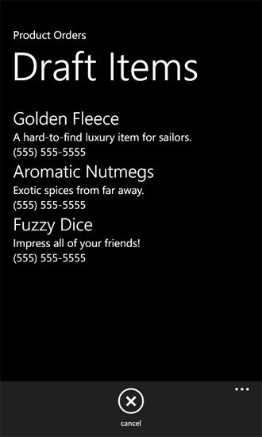

# <a name="how-to-store-and-retrieve-sharepoint-list-items-on-a-windows-phone"></a><span data-ttu-id="ced15-102">Как: хранения и извлечения SharePoint списка элементов на ОС Windows Phone</span><span class="sxs-lookup"><span data-stu-id="ced15-102">How to: Store and retrieve SharePoint list items on a Windows Phone</span></span>
<span data-ttu-id="ced15-p101">Узнайте о жизненном цикле приложения Windows Phone и локальном хранении сетевых данных. Одно из наиболее важные замечания при разработке приложения для Windows Phone — управление сведения о состоянии, как для приложения в целом, так и для отдельных элементов страниц или данных в приложении. При разработке приложения для Windows Phone, необходимо учитывать, что пользователи приложений могут потерять возможность подключения к сетевым ресурсам (например, списки SharePoint). Инфраструктура разработки для приложений Windows Phone предоставляет механизмы для обработки сведения о состоянии на различных этапах жизненного цикла приложения.</span><span class="sxs-lookup"><span data-stu-id="ced15-p101">Learn about the Windows Phone application life cycle and storing network data locally. One of the most important considerations in the development of Windows Phone apps is the management of state information, both for the overall application and for individual pages or data items within the application. If you're developing Windows Phone apps, you must take into account that users of your apps might lose connectivity to network resources (such as SharePoint lists). The development infrastructure for Windows Phone apps provides mechanisms for handling state information at various stages in the life cycle of an app.</span></span>
  
    
    


> <span data-ttu-id="ced15-107">**Важные:** При разработке приложения для Windows Phone 8, должны использовать Visual Studio Express 2012 г., а не в Visual Studio 2010 Express.</span><span class="sxs-lookup"><span data-stu-id="ced15-107">**Important:** If you are developing an app for Windows Phone 8, you must use Visual Studio Express 2012 instead of Visual Studio 2010 Express.</span></span> <span data-ttu-id="ced15-108">За исключением среды разработки все сведения в этой статье применимы к созданию приложений для Windows Phone 8 и Windows Phone 7.</span><span class="sxs-lookup"><span data-stu-id="ced15-108">Except for the development environment, all information in this article applies to creating apps for both Windows Phone 8 and Windows Phone 7.</span></span> <span data-ttu-id="ced15-109">> Для получения дополнительных сведений см [как: Настройка среды разработки мобильных приложений для SharePoint](how-to-set-up-an-environment-for-developing-mobile-apps-for-sharepoint.md).</span><span class="sxs-lookup"><span data-stu-id="ced15-109">> For more information, see  [How to: Set up an environment for developing mobile apps for SharePoint](how-to-set-up-an-environment-for-developing-mobile-apps-for-sharepoint.md).</span></span> 
  
    
    


## <a name="store-sharepoint-list-data-locally-on-a-windows-phone"></a><span data-ttu-id="ced15-110">Сохранение данных списков SharePoint локально на Windows Phone</span><span class="sxs-lookup"><span data-stu-id="ced15-110">Store SharePoint list data locally on a Windows Phone</span></span>
<span data-ttu-id="ced15-111"><a name="BKMK_StoringDataLocally"> </a></span><span class="sxs-lookup"><span data-stu-id="ced15-111"><a name="BKMK_StoringDataLocally"> </a></span></span>

<span data-ttu-id="ced15-p103">На ОС Windows Phone только одно приложение работает за раз, и отключается при переходе другого приложения на телефоне (, нажав кнопку **Пуск** на телефоне, например), в настоящее время работает приложение, или в терминах разработка для ОС Windows Phone,захороненные. Если пользователь перейдет в режим неактивные приложения (, нажав кнопку **Назад** ), приложение может быть включена повторно, но если предоставить логику для обработки сведений о состоянии приложения на протяжении всего жизненного цикла приложения, сведений о состоянии не сохраняются по умолчанию в переход от активации отключении и обратно. (Дополнительные сведения о жизненном цикле приложения для приложения для Windows Phone см. [Обзор выполнения модели для Windows Phone](http://msdn.microsoft.com/ru-ru/library/ff817008%28v=VS.92%29.aspx).)</span><span class="sxs-lookup"><span data-stu-id="ced15-p103">On a Windows Phone, only one app runs at a time, and when a user switches to another app on the phone (by pressing the **Start** button on the phone, for example), the app currently running is deactivated, or, in the terms of Windows Phone development,tombstoned. If the user switches back to the deactivated app (by pressing the **Back** button), the app can be reactivated, but unless you provide logic to handle application state information over the course of the app life cycle, that state information is not preserved by default in the transition from activation to deactivation and back again. (For more information about the application life cycle for Windows Phone apps, see [Execution Model Overview for Windows Phone](http://msdn.microsoft.com/ru-ru/library/ff817008%28v=VS.92%29.aspx).)</span></span>
  
    
    
<span data-ttu-id="ced15-p104">Для приложений Windows Phone класс **PhoneApplicationService** предоставляет доступ к событиям стандартных жизненного цикла, которые можно использовать для управления состоянием приложения. В проектах, созданных на основе шаблона приложения списка SharePoint для Windows Phone (как и в проектах, созданных из всех шаблонов **Silverlight для Windows Phone** ), эти стандартных событий жизненного цикла приложения Windows Phone указанной в файле App.xaml и его связи с обработчиков событий в файл фонового кода, App.xaml.cs. Объявления в файл App.xaml для ваших приложений список SharePoint должен выглядеть следующую разметку.</span><span class="sxs-lookup"><span data-stu-id="ced15-p104">For Windows Phone apps, the **PhoneApplicationService** class exposes standard life-cycle events that can be used to manage application state. In projects created from the Windows Phone SharePoint List Application template (as with projects created from all **Silverlight for Windows Phone** templates), these standard Windows Phone application life-cycle events are declared in the App.xaml file and associated with event handlers in the code-behind file, App.xaml.cs. The declarations in the App.xaml file for your SharePoint list apps should look like the following markup.</span></span>
  
    
    


```

<Application.ApplicationLifetimeObjects>
    <!--Required object that handles lifetime events for the application-->
    <shell:PhoneApplicationService 
        Launching="Application_Launching" Closing="Application_Closing"Activated="Application_Activated" Deactivated="Application_Deactivated"/>
</Application.ApplicationLifetimeObjects>
```

<span data-ttu-id="ced15-p105">Обработчики событий **Application_Activated** и **Application_Deactivated**, указанной в файле App.xaml реализованы в файл фонового кода App.xaml.cs с логикой по умолчанию, в которой кэшируется сведения о состоянии приложения для использования в приложение телефон до тех пор, пока приложение не будет завершен. Реализация обработчиков для этих событий использует свойство **State** (который предоставляет доступ к объекту **Dictionary** ) класса **PhoneApplicationService** для хранения данных. Временные данные, хранящиеся в этом свойстве **State**. То есть он сохраняется, когда приложение неактивные или захороненные, но не в том случае, когда приложение будет завершен. Важно помнить, как обрабатывать события жизненным циклом приложений в проектах, что при отключении приложения Windows при переключении другого приложения, который отключен приложения — это может быть завершение операционной системой Windows Phone, в зависимости от обстоятельствах. Все данные на телефоне, который не будет сохранен в постоянное хранилище теряются, даже если эти данные была сохранена для хранения временных данных, используя свойство **State** **PhoneApplicationService**.</span><span class="sxs-lookup"><span data-stu-id="ced15-p105">The **Application_Activated** and **Application_Deactivated** event handlers declared in the App.xaml file are implemented in the App.xaml.cs code-behind file with default logic that caches application state information for use in the phone app as long as the app is not terminated. The implementation of the handlers for these events uses the **State** property (which provides access to a **Dictionary** object) of the **PhoneApplicationService** class to store data. Data stored in this **State** property is transient. That is, it is preserved when the app is deactivated or tombstoned, but not when the app is terminated. It is important to keep in mind as you handle application life-cycle events in your projects that if a Windows app is deactivated when a user switches to another app, that deactivated app is subject to termination by the Windows Phone operating system, depending on circumstances. Any data on the phone that isn't saved to persistent storage is lost, even if that data was saved to transient storage by using the **State** property of the **PhoneApplicationService**.</span></span>
  
    
    
<span data-ttu-id="ced15-p106">В приложении Windows Phone, который получает данные из списка SharePoint данные, используемые на телефоне из сеанса в сеанс можно конечно извлечь с сервера под управлением SharePoint Server, если сервер доступен. Однако непрерывного возможность подключения к SharePoint Server могут быть недоступны для устройства Windows Phone, за вариантов в объеме службы, расположение и других факторов. Для предоставления пользователям ваше приложение с доступом к данным в случае потеряно подключение к серверу с SharePoint Server или просто для сохранения данных в постоянное хранилище между сеансами приложения вне зависимости от доступности сервера, можно воспользоваться преимуществами события **Closing** и **Launching** класса **PhoneApplicationService**.</span><span class="sxs-lookup"><span data-stu-id="ced15-p106">In a Windows Phone app that gets data from a SharePoint list, the data used on the phone from session to session can of course be retrieved from the server running SharePoint Server, if the server is available. But continuous connectivity to a SharePoint Server may not be available for a Windows Phone device, owing to variations in service coverage by location and other factors. To provide users of your app with access to data in the event of lost connectivity with the server running SharePoint Server, or simply to save data to persistent storage between sessions of the app regardless of server availability, you can take advantage of the **Closing** and **Launching** events of the **PhoneApplicationService** class.</span></span>
  
    
    
<span data-ttu-id="ced15-p107">Объявления в файл App.xaml и определенных в файле App.xaml.cs **Application_Launching** и **Application_Closing** обработчики для этих событий, но не реализованы. Обработка хранения и извлечения сведения о состоянии приложения в контексте завершение приложения, можно обеспечить реализацию для обработчика событий **Application_Closing** для хранения данных в изолированном, предназначенный для приложения, чтобы данные сохраняются между сеансами приложения, а также можно обеспечить реализацию для обработчика событий **Application_Launching** для извлечения данных из изолированного хранилища при запуске нового сеанса приложения (при запуске приложения) , даже в том случае, если подключение к серверу под управлением SharePoint Server, который является оригинального источника данных не поддерживается.</span><span class="sxs-lookup"><span data-stu-id="ced15-p107">The **Application_Launching** and **Application_Closing** handlers for these events are declared in App.xaml and defined in the App.xaml.cs file, but they are not implemented. To handle storing and retrieving application state information in the context of app termination, you can provide an implementation for the **Application_Closing** event handler to store data in the isolated storage designated for the app so that the data persists between sessions of the app, and you can provide an implementation for the **Application_Launching** event handler to retrieve data from isolated storage when a new session of the app is started (when the app is launched), even if connectivity to the server running SharePoint Server that is the original source of the data is not available.</span></span>
  
    
    

> <span data-ttu-id="ced15-129">**Совет:** Данные должны быть зашифрованы, затем сохранить локальное устройство.</span><span class="sxs-lookup"><span data-stu-id="ced15-129">**Tip:** Data should be encrypted before you save it to a local device.</span></span> <span data-ttu-id="ced15-130">Дополнительные сведения о том, как для шифрования данных можно [как: шифровать данные в приложении Windows Phone](http://msdn.microsoft.com/ru-ru/library/hh487164%28v=vs.92%29.aspx)</span><span class="sxs-lookup"><span data-stu-id="ced15-130">For more information about how to encrypt the data, see  [How to: Encrypt Data in a Windows Phone Application](http://msdn.microsoft.com/ru-ru/library/hh487164%28v=vs.92%29.aspx)</span></span>
  
    
    


### <a name="to-implement-event-handlers-for-storing-and-retrieving-application-state"></a><span data-ttu-id="ced15-131">Реализация обработчиков событий для хранения и извлечения состояния приложения</span><span class="sxs-lookup"><span data-stu-id="ced15-131">To implement event handlers for storing and retrieving application state</span></span>


1. <span data-ttu-id="ced15-132">Создание приложения Windows Phone с использованием шаблона приложения списка SharePoint для Windows Phone в Visual Studio, выполнив действия, описанные в [как: Создание приложения списка SharePoint для Windows Phone](how-to-create-a-windows-phone-sharepoint-list-app.md).</span><span class="sxs-lookup"><span data-stu-id="ced15-132">Create a Windows Phone app by using the Windows Phone SharePoint List Application template in Visual Studio by following the steps in  [How to: Create a Windows Phone SharePoint list app](how-to-create-a-windows-phone-sharepoint-list-app.md).</span></span>
    
  
2. <span data-ttu-id="ced15-133">В **Обозревателе решений** выберите файл App.xaml.</span><span class="sxs-lookup"><span data-stu-id="ced15-133">In **Solution Explorer**, choose the App.xaml file.</span></span>
    
  
3. <span data-ttu-id="ced15-134">КлавишиF7Чтобы открыть файл фонового кода App.xaml.cs, для редактирования.</span><span class="sxs-lookup"><span data-stu-id="ced15-134">Press F7 to open the code-behind file, App.xaml.cs, for editing.</span></span>
    
  
4. <span data-ttu-id="ced15-135">Найдите (пустая) реализации обработчика событий **Application_Launching** и замените обработчик событий следующим кодом.</span><span class="sxs-lookup"><span data-stu-id="ced15-135">Locate the (empty) implementation of the **Application_Launching** event handler and replace the event handler with the following code.</span></span>
    
```cs
  
private void Application_Launching(object sender, LaunchingEventArgs e)
{
    if (IsolatedStorageSettings.ApplicationSettings.Contains(DataProvider.ListTitle))
    {
        App.MainViewModel = (ListViewModel)IsolatedStorageSettings.ApplicationSettings
                                              [DataProvider.ListTitle];                
        App.MainViewModel.Initialize();
    }
}
```

5. <span data-ttu-id="ced15-136">Найдите (пустая) реализации обработчика событий **Application_Closing** и замените этот обработчик событий следующим кодом.</span><span class="sxs-lookup"><span data-stu-id="ced15-136">Locate the (empty) implementation of the **Application_Closing** event handler and replace that event handler with the following code.</span></span>
    
```cs
  
private void Application_Closing(object sender, ClosingEventArgs e)
{
    if (IsolatedStorageSettings.ApplicationSettings.Contains(DataProvider.ListTitle))
    {
        IsolatedStorageSettings.ApplicationSettings[DataProvider.ListTitle] = App.MainViewModel;
    }
    else
    {
        IsolatedStorageSettings.ApplicationSettings.Add(DataProvider.ListTitle, App.MainViewModel);
    }
    IsolatedStorageSettings.ApplicationSettings.Save();
}
```

6. <span data-ttu-id="ced15-137">Сохраните файл.</span><span class="sxs-lookup"><span data-stu-id="ced15-137">Save the file.</span></span>
    
  
<span data-ttu-id="ced15-p109">С помощью этих реализаций на месте запустите приложение для инициализации основной ViewModel в приложении с помощью данных с сервера под управлением SharePoint Server. Выйдите из приложения по телефону (, нажав кнопку **резервного** для перехода после первой страницы для приложения) для запуска события **Application_Closing**. При выполнении приложения без подключения к серверу ViewModel, сохраненный на объект **Dictionary** **IsolatedStorageSettings**(в событии **Application_Closing** ) извлекается и инициализирована. Элементы списка SharePoint, сохраненных в изолированном в предыдущем сеансе приложения отображаются в виде списка (List.xaml) приложения.</span><span class="sxs-lookup"><span data-stu-id="ced15-p109">With these implementations in place, run your app to initialize the main ViewModel in the app with data from the server running SharePoint Server. Exit the app on the phone (by pressing the **Back** button to navigate past the first page of the app) to trigger the **Application_Closing** event. If you then run your app without connectivity to the server, the ViewModel that was saved to the **IsolatedStorageSettings** **Dictionary** object (in the **Application_Closing** event) is retrieved and initialized. The SharePoint list items that were saved to isolated storage in a previous session of the app are displayed in the List form (List.xaml) of the app.</span></span>
  
    
    

## <a name="implement-a-mechanism-for-editing-list-items-offline"></a><span data-ttu-id="ced15-142">Механизм для изменения элементов списка в автономный режим</span><span class="sxs-lookup"><span data-stu-id="ced15-142">Implement a mechanism for editing list items offline</span></span>
<span data-ttu-id="ced15-143"><a name="BKMK_ImplementingOfflineEditing"> </a></span><span class="sxs-lookup"><span data-stu-id="ced15-143"><a name="BKMK_ImplementingOfflineEditing"> </a></span></span>

<span data-ttu-id="ced15-p110">Если вы выполните процедуру, описанную в предыдущем разделе, для реализации обработчики для событий **Closing** и **Launching** в свое приложение, данных списка SharePoint, полученный с сервера при connectivity была доступна может отображаться в вашем приложении даже в том случае, если подключение к серверу теряются в последующих сеансов приложения, так как элементы списка извлекаются из локального хранилища сохраняемого на телефоне. На основе реализации в предыдущем разделе, тем не менее, элементов списка, доступных в этом случае для отображения во время автономный режим не изменяется и сохранен на сервере, если не восстановлены подключения к. В следующей процедуре вы добавите механизм ваше приложение для обеспечения хранения измененные версии элементов списка локально при отсутствии подключения. Если подключение к серверу доступен еще раз, можно извлечь эти элементы измененный список и сохранить изменения на сервере.</span><span class="sxs-lookup"><span data-stu-id="ced15-p110">If you follow the procedure in the previous section to implement handlers for the **Closing** and **Launching** events in your app, SharePoint list data that was retrieved from the server when connectivity was available can be displayed in your app even if connectivity to the server is lost in a subsequent session of the app, because the list items are retrieved from local persistent storage on the phone. Based on the implementation in the previous section, however, the list items made available in this way for display while offline can't be edited and saved back to the server unless connectivity is restored. In the following procedure, you'll add a mechanism to your app to provide for storing edited versions of list items locally when connectivity is unavailable. When connectivity to the server is available again, you can retrieve these edited list items and save your changes back to the server.</span></span>
  
    
    
<span data-ttu-id="ced15-148">Для процедур, описанных в этом разделе предполагается, что вы работает в контексте проекта приложения Windows Phone создан на основе шаблона приложения списка SharePoint для Windows Phone и, что приложение основано на список заказов на продукт, созданный на основе шаблона настраиваемого списка на сервере и содержит столбцов и типов полей, показано в таблице 1.</span><span class="sxs-lookup"><span data-stu-id="ced15-148">For the procedures in this section, we assume you're working in the context of a Windows Phone app project created from the Windows Phone SharePoint List Application template and that your app is based on a Product Orders list created from the Custom List template on the server and contains the columns and field types shown in Table 1.</span></span>
  
    
    

<span data-ttu-id="ced15-149">**В таблице 1. Пример списка заказов на продукт**</span><span class="sxs-lookup"><span data-stu-id="ced15-149">**Table 1. Sample Product Orders list**</span></span>


|<span data-ttu-id="ced15-150">**Столбец**</span><span class="sxs-lookup"><span data-stu-id="ced15-150">**Column**</span></span>|<span data-ttu-id="ced15-151">**Тип**</span><span class="sxs-lookup"><span data-stu-id="ced15-151">**Type**</span></span>|<span data-ttu-id="ced15-152">**Required**</span><span class="sxs-lookup"><span data-stu-id="ced15-152">**Required**</span></span>|
|:-----|:-----|:-----|
|<span data-ttu-id="ced15-153">Продукт (например, заголовок)</span><span class="sxs-lookup"><span data-stu-id="ced15-153">Product (for example, Title)</span></span>  <br/> |<span data-ttu-id="ced15-154">Однострочный текст (Текст)</span><span class="sxs-lookup"><span data-stu-id="ced15-154">Single line of text (Text)</span></span>  <br/> |<span data-ttu-id="ced15-155">Да</span><span class="sxs-lookup"><span data-stu-id="ced15-155">Yes</span></span>  <br/> |
|<span data-ttu-id="ced15-156">Описание</span><span class="sxs-lookup"><span data-stu-id="ced15-156">Description</span></span>  <br/> |<span data-ttu-id="ced15-157">Однострочный текст (Текст)</span><span class="sxs-lookup"><span data-stu-id="ced15-157">Single line of text (Text)</span></span>  <br/> |<span data-ttu-id="ced15-158">Нет</span><span class="sxs-lookup"><span data-stu-id="ced15-158">No</span></span>  <br/> |
|<span data-ttu-id="ced15-159">Количество</span><span class="sxs-lookup"><span data-stu-id="ced15-159">Quantity</span></span>  <br/> |<span data-ttu-id="ced15-160">Число</span><span class="sxs-lookup"><span data-stu-id="ced15-160">Number</span></span>  <br/> |<span data-ttu-id="ced15-161">Да</span><span class="sxs-lookup"><span data-stu-id="ced15-161">Yes</span></span>  <br/> |
|<span data-ttu-id="ced15-162">Дата заказа</span><span class="sxs-lookup"><span data-stu-id="ced15-162">Order Date</span></span>  <br/> |<span data-ttu-id="ced15-163">Дата и время (DateTime)</span><span class="sxs-lookup"><span data-stu-id="ced15-163">Date and Time (DateTime)</span></span>  <br/> |<span data-ttu-id="ced15-164">Нет</span><span class="sxs-lookup"><span data-stu-id="ced15-164">No</span></span>  <br/> |
|<span data-ttu-id="ced15-165">Дата выполнения</span><span class="sxs-lookup"><span data-stu-id="ced15-165">Fulfillment Date</span></span>  <br/> |<span data-ttu-id="ced15-166">Дата и время (DateTime)</span><span class="sxs-lookup"><span data-stu-id="ced15-166">Date and Time (DateTime)</span></span>  <br/> |<span data-ttu-id="ced15-167">Нет</span><span class="sxs-lookup"><span data-stu-id="ced15-167">No</span></span>  <br/> |
|<span data-ttu-id="ced15-168">Номер контакта</span><span class="sxs-lookup"><span data-stu-id="ced15-168">Contact Number</span></span>  <br/> |<span data-ttu-id="ced15-169">Однострочный текст (Текст)</span><span class="sxs-lookup"><span data-stu-id="ced15-169">Single line of text (Text)</span></span>  <br/> |<span data-ttu-id="ced15-170">Нет</span><span class="sxs-lookup"><span data-stu-id="ced15-170">No</span></span>  <br/> |
   

### <a name="to-implement-a-class-to-support-editing-items-while-offline"></a><span data-ttu-id="ced15-171">Реализация класса для поддержки редактирования элементов при автономной</span><span class="sxs-lookup"><span data-stu-id="ced15-171">To implement a class to support editing items while offline</span></span>


1. <span data-ttu-id="ced15-172">Начиная с Visual Studio проекта, который был создан на основе списка заказов на продукт, представленный в таблице 1, в **Обозревателе решений** выберите узел, который представляет проект (например,SPListAppLocalStorage).</span><span class="sxs-lookup"><span data-stu-id="ced15-172">Starting with a Visual Studio project that was created based on the Product Orders list represented by Table 1, in **Solution Explorer**, choose the node that represents the project (for example, SPListAppLocalStorage).</span></span>
    
  
2. <span data-ttu-id="ced15-173">В меню **проект** выберите пункт **Добавить класс**.</span><span class="sxs-lookup"><span data-stu-id="ced15-173">On the **Project** menu, choose **Add Class**.</span></span> 
    
    <span data-ttu-id="ced15-174">Откроется диалоговое окно **Добавление нового элемента** с помощью выбранного шаблона C# **класс**.</span><span class="sxs-lookup"><span data-stu-id="ced15-174">The **Add New Item** dialog box appears with the C# **Class** template selected.</span></span>
    
  
3. <span data-ttu-id="ced15-175">Имя файла класса DraftItemStore.csи нажмите кнопку **Добавить**.</span><span class="sxs-lookup"><span data-stu-id="ced15-175">Name the class file DraftItemStore.cs, and then choose **Add**.</span></span>
    
    <span data-ttu-id="ced15-176">Файл класса будет добавлен в проект и открыт для редактирования.</span><span class="sxs-lookup"><span data-stu-id="ced15-176">The class file is added to the project and opened for editing.</span></span>
    
  
4. <span data-ttu-id="ced15-177">Замените содержимое файла класса следующим кодом.</span><span class="sxs-lookup"><span data-stu-id="ced15-177">Replace the contents of the class file with the following code.</span></span>
    
```cs
  
using System;
using System.Net;
using System.Windows;
using System.Collections.Generic;
using System.IO.IsolatedStorage;

namespace SPListAppLocalStorage // Based on project name by default.
{
    public class DraftItemStore
    {
        const string DraftsKey = "Drafts";

        public static void AddDraftItem(string id, EditItemViewModel model)
        {
            Dictionary<string, EditItemViewModel> draftCollection = GetDraftItemCollection();
            draftCollection[id] = model;
            SaveDrafts(draftCollection);
        }

        public static void RemoveDraftItem(string id)
        {
            Dictionary<string, EditItemViewModel> draftCollection = GetDraftItemCollection();
            draftCollection.Remove(id);
            SaveDrafts(draftCollection);
        }

        public static void SaveDrafts(Dictionary<string, EditItemViewModel> draft)
        {
            if (IsolatedStorageSettings.ApplicationSettings.Contains(DraftsKey))
            {
                IsolatedStorageSettings.ApplicationSettings[DraftsKey] = draft;
            }
            else
            {
                IsolatedStorageSettings.ApplicationSettings.Add(DraftsKey, draft);
            }
        }

        public static List<EditItemViewModel> Drafts
        {
            get
            {
                Dictionary<string, EditItemViewModel> draftCollection = GetDraftItemCollection();

                List<EditItemViewModel> modelCollection = new List<EditItemViewModel>();
                foreach (KeyValuePair<string, EditItemViewModel> entry in draftCollection)
                {
                    modelCollection.Add(entry.Value);
                }

                return modelCollection;
            }
        }

        public static Dictionary<string, EditItemViewModel> GetDraftItemCollection()
        {
            Dictionary<string, EditItemViewModel> draftCollection = null;
            if (IsolatedStorageSettings.ApplicationSettings.Contains(DraftsKey))
                draftCollection = (Dictionary<string,
                EditItemViewModel>)IsolatedStorageSettings.ApplicationSettings[DraftsKey];

            if (draftCollection == null)
                draftCollection = new Dictionary<string, EditItemViewModel>();

            return draftCollection;
        }

        public static EditItemViewModel GetDraftItemById(string id)
        {
            Dictionary<string, EditItemViewModel> draftCollection = GetDraftItemCollection();
            return !draftCollection.ContainsKey(id) ? null : draftCollection[id];
        }
    }
}
```


    The namespace specified in this code is based on the name of the project (SPListAppLocalStorage in this case). You might want to specify a different namespace, based on the name of your project.
    
  
5. <span data-ttu-id="ced15-178">Сохраните файл.</span><span class="sxs-lookup"><span data-stu-id="ced15-178">Save the file.</span></span>
    
  
<span data-ttu-id="ced15-p111">Определенный экземпляр класса **EditItemViewModel** представляет элемент списка SharePoint, изменяется на телефоне. Могут быть полезны элемента списка, который был изменен, как «черновик элемента» до изменения к элементу будут сохранены на сервере. В примере кода в этом классе метод **AddDraftItem** добавляет определенный экземпляр класса **EditItemViewModel** (то есть, черновиков элемента) как значение объект **Dictionary** **EditItemViewModel** в **Dictionary** связь с ключом, на основе идентификатора для заданного элемента списка. (Идентификатор назначаемый SharePoint Server для каждого элемента списка. В проекте на основе шаблона приложения списка SharePoint для Windows Phone этот идентификатор хранится в свойство **ID** класса данного **ViewModel**, например **EditItemViewModel** или **DisplayItemViewModel**, который представляет элемент списка.) Метод **RemoveDraftItem** удаляет **EditItemViewModel** из объекта **Dictionary** на основе указанного идентификатора. Как использовать метод **GetDraftItemCollection** для получения **Dictionary** object, содержащий объекты **EditItemViewModel** из изолированного хранилища из этих методов и оба метода используйте метод **SaveDrafts** сохранить объект измененные **Dictionary** (с помощью элемента черновика в нее добавлены или удалены из нее) в изолированном. Метод **GetDraftItemCollection** сначала определяет ли объект **Dictionary** "Черновики" сохранения изолированного хранилища. Если это так, метод возвращает этот объект **Dictionary**; в противном случае метод инициализирует и возвращает экземпляр объекта **Dictionary**. Свойство **Drafts** класса предоставляет доступ к **Dictionary** элементов черновиков, возвращая список (то есть, объект на основе **List<T>** универсальный) элементов черновиков как **EditItemViewModel** объекты. Метод **GetDraftItemById** возвращает элемент указанного черновиков из объекта **Dictionary** на основе значения указанным идентификатором.</span><span class="sxs-lookup"><span data-stu-id="ced15-p111">A specific instance of the **EditItemViewModel** class represents a SharePoint list item that is being edited on the phone. You can consider a list item that was edited as a "draft item" before changes to the item are saved to the server. In the code in this class, the **AddDraftItem** method adds a specific instance of the **EditItemViewModel** class (that is, a draft item) as a value to a **Dictionary** object, associating the **EditItemViewModel** in the **Dictionary** with a key based on the identifier for the given list item. (An identifier is assigned by SharePoint Server to each item in a list. In a project based on the Windows Phone SharePoint List Application template, that identifier is stored in the **ID** property of the given **ViewModel** class, such as **EditItemViewModel** or **DisplayItemViewModel**, which represents the list item.) The **RemoveDraftItem** method removes an **EditItemViewModel** from the **Dictionary** object based on a specified identifier. Both of these methods use the **GetDraftItemCollection** method to retrieve the **Dictionary** object containing the **EditItemViewModel** objects from isolated storage and both methods use the **SaveDrafts** method to save the modified **Dictionary** object (with a draft item either added to it or removed from it) back to isolated storage. The **GetDraftItemCollection** method first determines whether a "Drafts" **Dictionary** object has been saved to isolated storage. If so, the method returns that **Dictionary** object; otherwise, the method initializes and returns a new **Dictionary** object. The **Drafts** property of the class provides access to the **Dictionary** of draft items by returning a list (that is, an object based on the **List<T>** generic) of draft items as **EditItemViewModel** objects. The **GetDraftItemById** method returns a given draft item from the **Dictionary** object based on a specified identifier value.</span></span>
  
    
    
<span data-ttu-id="ced15-p112">Теперь можно добавить элементы в пользовательский интерфейс приложения с телефона и настраивать их на класс **DraftItemStore** используется для изменения элементов списка в автономный режим. В следующих процедурах выполним следующие задачи:</span><span class="sxs-lookup"><span data-stu-id="ced15-p112">Now you can add elements to the user interface of the phone app and configure them to use the **DraftItemStore** class for editing list items offline. In the following procedures, you will:</span></span>
  
    
    

- <span data-ttu-id="ced15-191">Добавление и настройка страниц Windows Phone для отображения всех элементов списка, сохраненные как черновики для изолированного хранилища на телефоне.</span><span class="sxs-lookup"><span data-stu-id="ced15-191">Add and configure a Windows Phone page to display all list items that were saved as draft items to isolated storage on the phone.</span></span>
    
  
- <span data-ttu-id="ced15-192">Добавление и настройка другой страницы, привязанных к **EditItemViewModel**, для редактирования элемента отдельных черновиков, аналогом формы изменения (EditForm.xaml) для элементов списка.</span><span class="sxs-lookup"><span data-stu-id="ced15-192">Add and configure another page, bound to an **EditItemViewModel**, for editing an individual draft item, analogous to the Edit form (EditForm.xaml) for list items.</span></span>
    
  
- <span data-ttu-id="ced15-193">Добавьте метод **SaveAsDraft**класса **EditItemViewModel**, который выполняет метод **AddDraftItem** класса **DraftItemStore**, реализованные в предыдущей процедуре.</span><span class="sxs-lookup"><span data-stu-id="ced15-193">Add a method, **SaveAsDraft**, to the **EditItemViewModel** class that executes the **AddDraftItem** method of the **DraftItemStore** class implemented in the previous procedure.</span></span>
    
  
- <span data-ttu-id="ced15-194">Добавление кнопки **ApplicationBar** в файл EditForm.xaml, чтобы вызвать метод **SaveAsDraft**.</span><span class="sxs-lookup"><span data-stu-id="ced15-194">Add an **ApplicationBar** button to the EditForm.xaml file to call the **SaveAsDraft** method.</span></span>
    
  
- <span data-ttu-id="ced15-195">Добавление кнопки **ApplicationBar** в файл List.xaml, чтобы перейти на страницу, которая отображает все элементы списка, сохраняемые как черновики.</span><span class="sxs-lookup"><span data-stu-id="ced15-195">Add an **ApplicationBar** button to the List.xaml file to navigate to the page that displays all list items saved as drafts.</span></span>
    
  

### <a name="to-add-a-page-for-displaying-all-draft-items-saved-on-the-phone"></a><span data-ttu-id="ced15-196">Добавление страницы для отображения всех элементов черновиков, сохраненные на телефоне</span><span class="sxs-lookup"><span data-stu-id="ced15-196">To add a page for displaying all draft items saved on the phone</span></span>


1. <span data-ttu-id="ced15-197">В **Обозревателе решений** выберите папку **представлений**.</span><span class="sxs-lookup"><span data-stu-id="ced15-197">In **Solution Explorer**, choose the **Views** folder.</span></span>
    
  
2. <span data-ttu-id="ced15-198">В меню **ПРОЕКТ** выберите пункт **Добавить новый элемент**.</span><span class="sxs-lookup"><span data-stu-id="ced15-198">On the **Project** menu, choose **Add New Item**.</span></span> 
    
    <span data-ttu-id="ced15-199">Откроется диалоговое окно **Добавление нового элемента**.</span><span class="sxs-lookup"><span data-stu-id="ced15-199">The **Add New Item** dialog box opens.</span></span>
    
  
3. <span data-ttu-id="ced15-200">В диалоговом окне **Добавление нового элемента** разверните узел **Visual C#** и выберите узел **Silverlight для Windows Phone**.</span><span class="sxs-lookup"><span data-stu-id="ced15-200">In the **Add New Item** dialog box, under the **Visual C#** node, choose the **Silverlight for Windows Phone** node.</span></span>
    
  
4. <span data-ttu-id="ced15-201">В области **Шаблоны** выберите шаблон **Страницы Книжная Windows Phone**.</span><span class="sxs-lookup"><span data-stu-id="ced15-201">In the **Templates** pane, choose the **Windows Phone Portrait Page** template.</span></span>
    
  
5. <span data-ttu-id="ced15-202">Имя файла Drafts.xamlи нажмите кнопку **Добавить**.</span><span class="sxs-lookup"><span data-stu-id="ced15-202">Name the file Drafts.xaml, and then choose **Add**.</span></span> 
    
    <span data-ttu-id="ced15-203">Файл добавлен в проект в разделе узел **представления** и открыт для редактирования.</span><span class="sxs-lookup"><span data-stu-id="ced15-203">The file is added to the project under the **Views** node and opened for editing.</span></span>
    
  
6. <span data-ttu-id="ced15-204">На левой панели XAML в конструкторе замените содержимое файла на следующий код.</span><span class="sxs-lookup"><span data-stu-id="ced15-204">In the XAML pane of the designer, replace the contents of the file with the following XAML.</span></span>
    
```
  
<phone:PhoneApplicationPage
    x:Class="SPListAppLocalStorage.Views.Drafts"
    xmlns="http://schemas.microsoft.com/winfx/2006/xaml/presentation"
    xmlns:x="http://schemas.microsoft.com/winfx/2006/xaml"
    xmlns:phone="clr-namespace:Microsoft.Phone.Controls;assembly=Microsoft.Phone"
    xmlns:shell="clr-namespace:Microsoft.Phone.Shell;assembly=Microsoft.Phone"
    xmlns:d="http://schemas.microsoft.com/expression/blend/2008"
    xmlns:mc="http://schemas.openxmlformats.org/markup-compatibility/2006"
    FontFamily="{StaticResource PhoneFontFamilyNormal}"
    FontSize="{StaticResource PhoneFontSizeNormal}"
    Foreground="{StaticResource PhoneForegroundBrush}"
    SupportedOrientations="Portrait" Orientation="Portrait"
    mc:Ignorable="d" d:DesignHeight="696" d:DesignWidth="480"
    shell:SystemTray.IsVisible="True">

    <!--LayoutRoot is the root grid where all page content is placed-->
    <Grid x:Name="LayoutRoot" Background="Transparent">
        <Grid.RowDefinitions>
            <RowDefinition Height="Auto"/>
            <RowDefinition Height="*"/>
        </Grid.RowDefinitions>

        <!--TitlePanel contains the name of the application and page title-->
        <StackPanel x:Name="TitlePanel" Grid.Row="0" Margin="12,17,0,28">
            <TextBlock x:Name="ApplicationTitle" Text="Product Orders" 
                                    Style="{StaticResource PhoneTextNormalStyle}"/>
            <TextBlock x:Name="PageTitle" Text="Draft Items" Margin="9,-7,0,0" 
                                      Style="{StaticResource PhoneTextTitle1Style}"/>
        </StackPanel>

        <!--ContentPanel - place additional content here-->
        <Grid x:Name="ContentPanel" Grid.Row="1" Margin="12,0,12,0">
            <ListBox x:Name="lstBoxDraftItems" ItemsSource="{Binding}"
                                  SelectionChanged="lstBoxDraftItems_SelectionChanged">
                <ListBox.ItemTemplate>
                    <DataTemplate>
                        <StackPanel>
                            <TextBlock Text="{Binding [Title]}" Style="
                                           {StaticResource PhoneTextTitle2Style}"></TextBlock>
                            <TextBlock Text="{Binding [Description]}" Style="
                                            {StaticResource PhoneTextNormalStyle}"></TextBlock>
                            <TextBlock Text="{Binding [Contact_x0020_Number]}" Style="
                                           {StaticResource PhoneTextNormalStyle}"></TextBlock>
                        </StackPanel>
                    </DataTemplate>
                </ListBox.ItemTemplate>
            </ListBox>
        </Grid>
    </Grid>
 
    <phone:PhoneApplicationPage.ApplicationBar>
        <shell:ApplicationBar IsVisible="True" IsMenuEnabled="True">
            <shell:ApplicationBarIconButton x:Name="btnCancel" 
             IconUri="/Images/appbar.cancel.rest.png" Text="Cancel" Click="OnCancelButtonClick" />
        </shell:ApplicationBar>
    </phone:PhoneApplicationPage.ApplicationBar>

</phone:PhoneApplicationPage>
```


    The value of the namespace designation  `<x:Class>` in this code ("SPListAppLocalStorage.Views.Drafts") will vary depending on the name of your project.
    
  
7. <span data-ttu-id="ced15-205">С помощью файла Drafts.xaml, выбранного в **Обозревателе решений** нажмите клавишуF7Чтобы открыть файл выделенным кодом Drafts.xaml.cs, для редактирования.</span><span class="sxs-lookup"><span data-stu-id="ced15-205">With the Drafts.xaml file selected in **Solution Explorer**, press F7 to open the associated code-behind file, Drafts.xaml.cs, for editing.</span></span>
    
  
8. <span data-ttu-id="ced15-206">Замените содержимое файла следующим кодом.</span><span class="sxs-lookup"><span data-stu-id="ced15-206">Replace the contents of the file with the following code.</span></span>
    
```cs
  
using System;
using System.Collections.Generic;
using System.Linq;
using System.Net;
using System.Windows;
using System.Windows.Controls;
using System.Windows.Documents;
using System.Windows.Input;
using System.Windows.Media;
using System.Windows.Media.Animation;
using System.Windows.Shapes;
using Microsoft.Phone.Controls;

namespace SPListAppLocalStorage.Views
{
    public partial class Drafts : PhoneApplicationPage
    {
        public Drafts()
        {
            InitializeComponent();
            this.Loaded += new RoutedEventHandler(Drafts_Loaded);
        }

        private void lstBoxDraftItems_SelectionChanged(object sender, SelectionChangedEventArgs e)
        {
            ListBox lstBox = sender as ListBox;
            if (lstBox.SelectedIndex == -1)
                return;

            EditItemViewModel selectedDraftItem = lstBox.SelectedItem as EditItemViewModel;
            NavigationService.Navigate(new Uri(string.Format("/Views/DraftItemEditForm.xaml?ID={0}",
                                                   selectedDraftItem.ID), UriKind.Relative));

            lstBox.SelectedIndex = -1;
        }

        void Drafts_Loaded(object sender, RoutedEventArgs e)
        {
            this.DataContext = DraftItemStore.Drafts;
        }

        private void OnCancelButtonClick(object sender, EventArgs e)
        {
            // Navigate back to initial List View form.
            NavigationService.Navigate(new Uri("/Views/List.xaml", UriKind.Relative));
        }
    }
}
```

9. <span data-ttu-id="ced15-207">Сохраните файлы.</span><span class="sxs-lookup"><span data-stu-id="ced15-207">Save the files.</span></span>
    
  

### <a name="to-add-a-page-for-editing-individual-draft-items"></a><span data-ttu-id="ced15-208">Добавление страницы для редактирования отдельных черновики</span><span class="sxs-lookup"><span data-stu-id="ced15-208">To add a page for editing individual draft items</span></span>


1. <span data-ttu-id="ced15-209">В **Обозревателе решений** выберите папку **представлений**.</span><span class="sxs-lookup"><span data-stu-id="ced15-209">In **Solution Explorer**, choose the **Views** folder.</span></span>
    
  
2. <span data-ttu-id="ced15-210">В меню **ПРОЕКТ** выберите пункт **Добавить новый элемент**.</span><span class="sxs-lookup"><span data-stu-id="ced15-210">On the **Project** menu, choose **Add New Item**.</span></span> 
    
    <span data-ttu-id="ced15-211">Откроется диалоговое окно **Добавление нового элемента**.</span><span class="sxs-lookup"><span data-stu-id="ced15-211">The **Add New Item** dialog box opens.</span></span>
    
  
3. <span data-ttu-id="ced15-212">В диалоговом окне **Добавление нового элемента** разверните узел **Visual C#** и выберите узел **Silverlight для Windows Phone**.</span><span class="sxs-lookup"><span data-stu-id="ced15-212">In the **Add New Item** dialog box, under the **Visual C#** node, choose the **Silverlight for Windows Phone** node.</span></span>
    
  
4. <span data-ttu-id="ced15-213">В области **Шаблоны** выберите шаблон **Страницы Книжная Windows Phone**.</span><span class="sxs-lookup"><span data-stu-id="ced15-213">In the **Templates** pane, choose the **Windows Phone Portrait Page** template.</span></span>
    
  
5. <span data-ttu-id="ced15-214">Имя файла DraftItemEditForm.xamlи нажмите кнопку **Добавить**.</span><span class="sxs-lookup"><span data-stu-id="ced15-214">Name the file DraftItemEditForm.xaml, and then choose **Add**.</span></span> 
    
    <span data-ttu-id="ced15-215">Файл добавлен в проект в разделе узел **представления** и открыт для редактирования.</span><span class="sxs-lookup"><span data-stu-id="ced15-215">The file is added to the project under the **Views** node and opened for editing.</span></span>
    
  
6. <span data-ttu-id="ced15-216">На левой панели XAML в конструкторе замените содержимое файла на следующий код.</span><span class="sxs-lookup"><span data-stu-id="ced15-216">In the XAML pane of the designer, replace the contents of the file with the following XAML.</span></span>
    
```
  
<phone:PhoneApplicationPage
    x:Class="SPListAppLocalStorage.DraftItemEditForm"
    xmlns="http://schemas.microsoft.com/winfx/2006/xaml/presentation"
    xmlns:x="http://schemas.microsoft.com/winfx/2006/xaml"
    xmlns:phone="clr-namespace:Microsoft.Phone.Controls;assembly=Microsoft.Phone"
    xmlns:shell="clr-namespace:Microsoft.Phone.Shell;assembly=Microsoft.Phone"
    xmlns:d="http://schemas.microsoft.com/expression/blend/2008"
    xmlns:mc="http://schemas.openxmlformats.org/markup-compatibility/2006"
    mc:Ignorable="d" d:DesignWidth="480" d:DesignHeight="696"
    FontFamily="{StaticResource PhoneFontFamilyNormal}"
    FontSize="{StaticResource PhoneFontSizeNormal}"
    Foreground="{StaticResource PhoneForegroundBrush}"
    SupportedOrientations="Portrait" Orientation="Portrait"
    shell:SystemTray.IsVisible="True" x:Name="DraftItemEditPage">

    <!--LayoutRoot is the root grid where all page content is placed-->
    <Grid x:Name="LayoutRoot" Background="Transparent"
        xmlns:x="http://schemas.microsoft.com/winfx/2006/xaml" 
             xmlns:controls="clr-namespace:Microsoft.Phone.Controls;assembly=
                Microsoft.Phone.Controls">
        <StackPanel>
            <ProgressBar Background="Red" x:Name="progressBar" Opacity="1" 
                                    HorizontalAlignment="Center" VerticalAlignment="Top" 
                                    Height="15" Width="470" IsIndeterminate="{Binding IsBusy}" 
                                    Visibility="{Binding ShowIfBusy}" />
            <ScrollViewer HorizontalScrollBarVisibility="Auto" Height="700">
                <Grid x:Name="ContentPanel" Width="470">
                    <StackPanel Margin="0,5,0,5">
                        <StackPanel Orientation="Vertical" Margin="0,5,0,5">
                            <TextBlock TextWrapping="Wrap" HorizontalAlignment="Left" 
                                Style="{StaticResource PhoneTextNormalStyle}">Product*</TextBlock>
                            <TextBox Style="{StaticResource TextValidationTemplate}" 
                         FontSize="{StaticResource   PhoneFontSizeNormal}" Width="470" 
                         HorizontalAlignment="Left" Name="txtTitle" Text="{Binding [Title], 
                                   Mode=TwoWay,ValidatesOnNotifyDataErrors=True,NotifyOnValidationError=True}" 
                                                                         TextWrapping="Wrap" />
                        </StackPanel>
                        <StackPanel Orientation="Vertical" Margin="0,5,0,5">
                            <TextBlock TextWrapping="Wrap" HorizontalAlignment="Left" 
                               Style="{StaticResource PhoneTextNormalStyle}">Description</TextBlock>
                            <TextBox Style="{StaticResource TextValidationTemplate}" 
                               FontSize="{StaticResource PhoneFontSizeNormal}" Width="470" 
                                HorizontalAlignment="Left" Name="txtDescription" 
                                                           Text="{Binding [Description],
                                                           Mode=TwoWay, ValidatesOnNotifyDataErrors=True, 
                                                           NotifyOnValidationError=True}" 
                                       TextWrapping="Wrap" />
                        </StackPanel>
                        <StackPanel Orientation="Vertical" Margin="0,5,0,5">
                            <TextBlock TextWrapping="Wrap" HorizontalAlignment="Left" 
                               Style="{StaticResource PhoneTextNormalStyle}">
                                                           Product Category</TextBlock>
                            <ListBox MaxHeight="400" Width="Auto" x:Name="lstBoxProduct_x0020_Category"
                                              ItemsSource="{Binding [Product_x0020_Category]}">
                                <ListBox.ItemTemplate>
                                    <DataTemplate>
                                        <RadioButton FontSize="{StaticResource PhoneFontSizeNormal}" 
                                          HorizontalAlignment="Left" GroupName="Product_x0020_Category" 
                                                                 Content="{Binding Name}" 
                               IsChecked="{Binding IsChecked, Mode=TwoWay}" />
                                    </DataTemplate>
                                </ListBox.ItemTemplate>
                            </ListBox>
                        </StackPanel>
                        <StackPanel Orientation="Vertical" Margin="0,5,0,5">
                            <TextBlock TextWrapping="Wrap" HorizontalAlignment="Left" 
                                       Style="{StaticResource PhoneTextNormalStyle}">Quantity*</TextBlock>
                            <TextBox Style="{StaticResource TextValidationTemplate}" 
                                   FontSize="{StaticResource PhoneFontSizeNormal}" Width="470" 
                                      HorizontalAlignment="Left" Name="txtQuantity" Text="{Binding [Quantity], 
                                        Mode=TwoWay, ValidatesOnNotifyDataErrors=True, 
                                           NotifyOnValidationError=True}"
                                             TextWrapping="Wrap" />
                        </StackPanel>
                        <StackPanel Orientation="Vertical" Margin="0,5,0,5">
                            <TextBlock TextWrapping="Wrap" HorizontalAlignment="Left" 
                                Style="{StaticResource PhoneTextNormalStyle}">Order Date</TextBlock>
                            <TextBox Height="Auto" Style="{StaticResource TextValidationTemplate}"
                                               FontSize="{StaticResource PhoneFontSizeNormal}" Width="470"  
                                                         HorizontalAlignment="Left" Name="txtOrder_x0020_Date" 
                         Text="{Binding [Order_x0020_Date], Mode=TwoWay, ValidatesOnNotifyDataErrors=True, 
                                           NotifyOnValidationError=True}" TextWrapping="Wrap" />
                            <TextBlock FontSize="16" TextWrapping="Wrap" HorizontalAlignment="Left" 
                                                 Style="{StaticResource PhoneTextSubtleStyle}" 
                                                             Text="{Binding DateTimeFormat}" />
                        </StackPanel>
                        <StackPanel Orientation="Vertical" Margin="0,5,0,5">
                            <TextBlock TextWrapping="Wrap" HorizontalAlignment="Left" 
                         Style="{StaticResource PhoneTextNormalStyle}">Fulfillment Date</TextBlock>
                            <TextBox Height="Auto" Style="{StaticResource TextValidationTemplate}"
                                          FontSize="{StaticResource PhoneFontSizeNormal}" Width="470" 
                                          HorizontalAlignment="Left" Name="txtFulfillment_x0020_Date" 
                        Text="{Binding [Fulfillment_x0020_Date], Mode=TwoWay, 
                     ValidatesOnNotifyDataErrors=True, NotifyOnValidationError=True}" 
                         TextWrapping="Wrap" />
                            <TextBlock FontSize="16" TextWrapping="Wrap" HorizontalAlignment="Left"
                                                    Style="{StaticResource PhoneTextSubtleStyle}" Text="{Binding
                                                           DateTimeFormat}" />
                        </StackPanel>
                        <StackPanel Orientation="Horizontal">
                            <TextBlock TextWrapping="Wrap" Width="150" HorizontalAlignment="Left"
                                                  Style="{StaticResource PhoneTextNormalStyle}">Rush 
                                                                   :</TextBlock>
                            <CheckBox Name="txtRush" FontSize="{StaticResource PhoneFontSizeNormal}" 
                                          HorizontalAlignment="Left" IsChecked="{Binding [Rush], Mode=TwoWay, 
                               ValidatesOnNotifyDataErrors=True, NotifyOnValidationError=True}" />
                        </StackPanel>
                        <StackPanel Orientation="Vertical" Margin="0,5,0,5">
                            <TextBlock TextWrapping="Wrap" HorizontalAlignment="Left" 
                        Style="{StaticResource PhoneTextNormalStyle}">Contact Number</TextBlock>
                            <TextBox Style="{StaticResource TextValidationTemplate}" 
                                   FontSize="{StaticResource PhoneFontSizeNormal}" Width="470"
                                              HorizontalAlignment="Left" Name="txtContact_x0020_Number"
                                                         Text="{Binding [Contact_x0020_Number], 
                                                         Mode=TwoWay, ValidatesOnNotifyDataErrors=True, 
                                                         NotifyOnValidationError=True}" 
                                                                           TextWrapping="Wrap" />
                        </StackPanel>
                    </StackPanel>
                </Grid>
            </ScrollViewer>
        </StackPanel>
    </Grid>

    <phone:PhoneApplicationPage.ApplicationBar>
        <shell:ApplicationBar IsVisible="True" IsMenuEnabled="True">
            <shell:ApplicationBarIconButton x:Name="btnSubmit" 
                                IconUri="/Images/appbar.save.rest.png" 
                                Text="Submit" Click="OnSubmitButtonClick"/>
            <shell:ApplicationBarIconButton x:Name="btnBack" 
                                IconUri="/Images/appbar.back.rest.png" 
                                 Text="Back to List" Click="OnBackButtonClick"/>
        </shell:ApplicationBar>
    </phone:PhoneApplicationPage.ApplicationBar>

</phone:PhoneApplicationPage>
```


    The XAML for defining this page is similar to that of the EditForm.xaml file. You can copy the EditForm.xaml file to use as a basis for DraftItemEditForm.xaml, making the modifications to the file as indicated in this markup.
    
  
7. <span data-ttu-id="ced15-217">С помощью файла DraftItemEditForm.xaml, выбранного в **Обозревателе решений** нажмите клавишуF7Чтобы открыть файл выделенным кодом DraftItemEditForm.xaml.cs, для редактирования.</span><span class="sxs-lookup"><span data-stu-id="ced15-217">With the DraftItemEditForm.xaml file chosen in **Solution Explorer**, press F7 to open the associated code-behind file, DraftItemEditForm.xaml.cs, for editing.</span></span>
    
  
8. <span data-ttu-id="ced15-218">Замените содержимое файла следующим кодом.</span><span class="sxs-lookup"><span data-stu-id="ced15-218">Replace the contents of the file with the following code.</span></span>
    
```cs
  
using System;
using System.Collections.Generic;
using System.Linq;
using System.Net;
using System.Windows;
using System.Windows.Controls;
using System.Windows.Documents;
using System.Windows.Input;
using System.Windows.Media;
using System.Windows.Media.Animation;
using System.Windows.Shapes;
using Microsoft.Phone.Controls;
using Microsoft.SharePoint.Client;
using Microsoft.Phone.Tasks;
using System.Device.Location;
using Microsoft.Phone.Shell;
using Microsoft.SharePoint.Phone.Application;

namespace SPListAppLocalStorage
{
    public partial class DraftItemEditForm : PhoneApplicationPage
    {
        EditItemViewModel viewModel;

        /// <summary>
        /// Constructor for Draft Item Edit Form.
        /// </summary>
        public DraftItemEditForm()
        {
            InitializeComponent();
        }

        protected override void OnNavigatedTo(System.Windows.Navigation.NavigationEventArgs e)
        {
 // Include initialization of ViewModel here rather than in constructor to be able to use QueryString value.
            if (viewModel == null)
            {
                viewModel = DraftItemStore.GetDraftItemById(NavigationContext.QueryString["ID"].ToString());
            }

            viewModel.Initialize();
            this.DataContext = viewModel;

            base.OnNavigatedTo(e);
            viewModel.ItemUpdated += new EventHandler<ItemUpdatedEventArgs>(OnItemUpdated);
        }

        protected override void OnNavigatedFrom(System.Windows.Navigation.NavigationEventArgs e)
        {
            base.OnNavigatedFrom(e);
            viewModel.ItemUpdated -= new EventHandler<ItemUpdatedEventArgs>(OnItemUpdated);
        }

        private void OnViewModelInitialization(object sender, InitializationCompletedEventArgs e)
        {
            this.Dispatcher.BeginInvoke(() =>
            {
                // If initialization has failed show error message and return.
                if (e.Error != null)
                {
                    MessageBox.Show(e.Error.Message, e.Error.GetType().Name, MessageBoxButton.OK);
                    return;
                }

                // Set Page's DataContext to current ViewModel instance.
                this.DataContext = (sender as EditItemViewModel);
            });
        }

        private void OnCancelButtonClick(object sender, EventArgs e)
        {
            NavigationService.Navigate(new Uri("/Views/List.xaml", UriKind.Relative));
        }

        private void OnSubmitButtonClick(object sender, EventArgs e)
        {
            viewModel.UpdateItem();
        }

        private void OnItemUpdated(object sender, ItemUpdatedEventArgs e)
        {
            this.Dispatcher.BeginInvoke(() =>
            {
                if (e.Error != null)
                {
                    MessageBox.Show(e.Error.Message, e.Error.GetType().Name, MessageBoxButton.OK);
                    return;
                }

                // Remove Draft Item from local storage if update to server succeeds.
                DraftItemStore.RemoveDraftItem(viewModel.ID.ToString());
                this.NavigationService.Navigate(new Uri("/Views/List.xaml", UriKind.Relative));
            });
        }

        private void OnBackButtonClick(object sender, EventArgs e)
        {
            NavigationService.Navigate(new Uri("/Views/List.xaml", UriKind.Relative));
        }
    }
}
```


    As you can see, the namespace used in this file is based on the name of the project (SPListAppLocalStorage).
    
  
9. <span data-ttu-id="ced15-p113">Изображение appbar.back.rest.png добавьте в проект для кнопки **ApplicationBar** (btnBack), указанной в файле DraftItemEditForm.xaml. В **Обозревателе решений** выберите узел папки **изображений** в проекте.</span><span class="sxs-lookup"><span data-stu-id="ced15-p113">Add the appbar.back.rest.png image to your project for the **ApplicationBar** button (btnBack) declared in the DraftItemEditForm.xaml file. In **Solution Explorer**, choose the **Images** folder node in the project.</span></span>
    
  
10. <span data-ttu-id="ced15-221">В меню **Проект** выберите пункт **Добавить существующий элемент**.</span><span class="sxs-lookup"><span data-stu-id="ced15-221">On the **Project** menu, choose **Add Existing Item**.</span></span> 
    
  
11. <span data-ttu-id="ced15-222">В браузере, который открывает перейдите к папке, в котором были установлены стандартные изображения значка Windows Phone по Windows Phone SDK 7.1.</span><span class="sxs-lookup"><span data-stu-id="ced15-222">In the browser that opens, navigate to the folder in which the standard Windows Phone icon images were installed by the Windows Phone SDK 7.1.</span></span>
    
    > <span data-ttu-id="ced15-223">**Примечание:** Изображения с быстрое переднего плана и темный фон находятся в `%PROGRAMFILES%(x86)\\Microsoft SDKs\\Windows Phone\\v7.1\\Icons\\dark` при установке пакета SDK.</span><span class="sxs-lookup"><span data-stu-id="ced15-223">**Note:** The images with a light foreground and a dark background are in  `%PROGRAMFILES%(x86)\\Microsoft SDKs\\Windows Phone\\v7.1\\Icons\\dark` in a standard installation of the SDK.</span></span>
12. <span data-ttu-id="ced15-p114">Выберите файл изображения, с именем appbar.back.rest.png и нажмите кнопку **Добавить**. Изображение добавляется в проект в узле **изображений**.</span><span class="sxs-lookup"><span data-stu-id="ced15-p114">Choose the image file named appbar.back.rest.png, and choose **Add**. The image is added to the project under the **Images** node.</span></span>
    
  
13. <span data-ttu-id="ced15-226">В **Обозревателе решений** выберите файл изображения вы только что добавили, в **Окно "Свойства"** для файла, для свойства **Действие при построении** для файла изображения для **контента** и присвойте свойству **Копировать в выходной каталог** **Копировать, если новее**.</span><span class="sxs-lookup"><span data-stu-id="ced15-226">In **Solution Explorer**, choose the image file you just added, and in the **Properties Window** for the file, set the **Build Action** property for the image file to **Content**, and set the **Copy to Output Directory** property to **Copy if newer**.</span></span>
    
  
14. <span data-ttu-id="ced15-227">Сохраните файлы.</span><span class="sxs-lookup"><span data-stu-id="ced15-227">Save the files.</span></span>
    
  

### <a name="to-add-an-applicationbar-button-to-the-edit-form-for-saving-an-item-as-a-draft"></a><span data-ttu-id="ced15-228">Чтобы добавить кнопку ApplicationBar форма редактирования для сохранения элемента в виде черновика</span><span class="sxs-lookup"><span data-stu-id="ced15-228">To add an ApplicationBar button to the Edit Form for saving an item as a draft</span></span>


1. <span data-ttu-id="ced15-p115">В **Обозревателе решений** выберите файл EditItemViewModel.cs в узле **ViewModels** в проекте. Нажмите клавишуF7Чтобы открыть файл для редактирования.</span><span class="sxs-lookup"><span data-stu-id="ced15-p115">In **Solution Explorer**, choose the EditItemViewModel.cs file under the **ViewModels** node in the project. Press F7 to open the file for editing.</span></span>
    
  
2. <span data-ttu-id="ced15-231">В блоке кода (обозначенного открывающих и закрывающих скобок), который реализует класс **EditItemViewModel** добавьте следующий метод открытого файла.</span><span class="sxs-lookup"><span data-stu-id="ced15-231">Within the code block (demarcated by opening and closing braces) that implements the **EditItemViewModel** class, add the following public method to the file.</span></span>
    
```cs
  
public void SaveAsDraft()
{
    DraftItemStore.AddDraftItem(this.ID.ToString(), this);
}
```

3. <span data-ttu-id="ced15-232">В **Обозревателе решений** выберите в разделе узел **представления** в проекте, дважды щелкните файл EditForm.xaml.</span><span class="sxs-lookup"><span data-stu-id="ced15-232">In **Solution Explorer**, under the **Views** node in the project, double-click the EditForm.xaml file.</span></span>
    
    <span data-ttu-id="ced15-233">Файл открыт для редактирования в конструкторе.</span><span class="sxs-lookup"><span data-stu-id="ced15-233">The file is opened for editing in the designer.</span></span>
    
  
4. <span data-ttu-id="ced15-234">В XAML панели конструктора добавьте другой кнопки тега  `<shell:ApplicationBar>` (в дополнение к существующей **Submit** **Отменить** кнопки и), как показано в следующем коде XAML.</span><span class="sxs-lookup"><span data-stu-id="ced15-234">In the XAML pane of the designer, add another button to the  `<shell:ApplicationBar>` tag (in addition to the existing **Submit** and **Cancel** buttons), as shown in the following XAML.</span></span>
    
```
  
<phone:PhoneApplicationPage.ApplicationBar>
    <shell:ApplicationBar IsVisible="True" IsMenuEnabled="True">
        <shell:ApplicationBarIconButton x:Name="btnSubmit" 
              IconUri="/Images/appbar.save.rest.png" 
              Text="Submit" Click="OnBtnSubmitClick"/>
        <shell:ApplicationBarIconButton x:Name="btnSaveDraft"            IconUri="/Images/appbar.save.rest.png" Text="Save Draft"            Click="OnSaveDraftButtonClick"/>
        <shell:ApplicationBarIconButton x:Name="btnCancel" 
                      IconUri="/Images/appbar.cancel.rest.png" 
                      Text="Cancel" Click="OnCancelButtonClick"/>
    </shell:ApplicationBar>
</phone:PhoneApplicationPage.ApplicationBar>
```

5. <span data-ttu-id="ced15-235">С помощью файла EditForm.xaml, выбранного в **Обозревателе решений** нажмите клавишуF7Чтобы открыть файл выделенным кодом EditForm.xaml.cs, для редактирования.</span><span class="sxs-lookup"><span data-stu-id="ced15-235">With the EditForm.xaml file chosen in **Solution Explorer**, press F7 to open the associated code-behind file, EditForm.xaml.cs, for editing.</span></span>
    
  
6. <span data-ttu-id="ced15-236">В блоке кода (обозначенного открывающих и закрывающих скобок), который реализует разделяемый класс **EditForm** добавьте следующий обработчик событий в файл.</span><span class="sxs-lookup"><span data-stu-id="ced15-236">Within the code block (demarcated by opening and closing braces) that implements the **EditForm** partial class, add the following event handler to the file.</span></span>
    
```cs
  
private void OnSaveDraftButtonClick(object sender, EventArgs e)
{
    viewModel.SaveAsDraft();
}
```

7. <span data-ttu-id="ced15-237">Сохраните файлы.</span><span class="sxs-lookup"><span data-stu-id="ced15-237">Save the files.</span></span>
    
  

### <a name="to-add-an-applicationbar-button-to-the-list-view-form-to-display-all-draft-items"></a><span data-ttu-id="ced15-238">Чтобы добавить кнопку ApplicationBar формы представления списка для отображения всех элементов черновиков</span><span class="sxs-lookup"><span data-stu-id="ced15-238">To add an ApplicationBar button to the List View Form to display all draft items</span></span>


1. <span data-ttu-id="ced15-239">В **Обозревателе решений** выберите узел **представления**, дважды щелкните файл List.xaml.</span><span class="sxs-lookup"><span data-stu-id="ced15-239">In **Solution Explorer**, under the **Views** node, double-click the List.xaml file.</span></span>
    
    <span data-ttu-id="ced15-240">Файл открыт для редактирования в конструкторе.</span><span class="sxs-lookup"><span data-stu-id="ced15-240">The file is opened for editing in the designer.</span></span>
    
  
2. <span data-ttu-id="ced15-241">В XAML панели конструктора добавьте другой кнопки тега **<shell:ApplicationBar>** (в дополнение к существующей **Создать** "и" **Обновить** кнопок), как показано в следующей разметке XAML.</span><span class="sxs-lookup"><span data-stu-id="ced15-241">In the XAML pane of the designer, add another button to the **<shell:ApplicationBar>** tag (in addition to the existing **New** and **Refresh** buttons), as shown in the following XAML markup.</span></span>
    
```
  
<phone:PhoneApplicationPage.ApplicationBar>
    <shell:ApplicationBar IsVisible="True" IsMenuEnabled="True">
        <shell:ApplicationBarIconButton x:Name="btnNew" 
        IconUri="/Images/appbar.new.rest.png" Text="New" 
                    Click="OnNewButtonClick"/>
        <shell:ApplicationBarIconButton x:Name="btnRefresh" 
                   IconUri="/Images/appbar.refresh.rest.png" 
        Text="Refresh" IsEnabled="True" Click="OnRefreshButtonClick"/>
        <shell:ApplicationBarIconButton x:Name="btnDrafts"            IconUri="/Images/appbar.folder.rest.png"            Text="View Drafts" IsEnabled="True"            Click="OnDraftsButtonClick"/>
    </shell:ApplicationBar>
</phone:PhoneApplicationPage.ApplicationBar>
```

3. <span data-ttu-id="ced15-p116">Изображение значка добавьте в проект для кнопки **«Черновики»**. В **Обозревателе решений** выберите узел папки **изображений** в проекте.</span><span class="sxs-lookup"><span data-stu-id="ced15-p116">Add an icon image to your project for the **Drafts** button. In **Solution Explorer**, choose the **Images** folder node in the project.</span></span>
    
  
4. <span data-ttu-id="ced15-244">В меню **Проект** выберите пункт **Добавить существующий элемент**.</span><span class="sxs-lookup"><span data-stu-id="ced15-244">On the **Project** menu, choose **Add Existing Item**.</span></span> 
    
  
5. <span data-ttu-id="ced15-245">В браузере, который открывает перейдите к папке, в котором были установлены стандартные изображения значка Windows Phone по Windows Phone SDK 7.1.</span><span class="sxs-lookup"><span data-stu-id="ced15-245">In the browser that opens, navigate to the folder in which the standard Windows Phone icon images were installed by the Windows Phone SDK 7.1.</span></span>
    
    > <span data-ttu-id="ced15-246">**Примечание:** Изображения с быстрое переднего плана и темный фон находятся в `%PROGRAMFILES%(x86)\\Microsoft SDKs\\Windows Phone\\v7.1\\Icons\\dark` при установке пакета SDK.</span><span class="sxs-lookup"><span data-stu-id="ced15-246">**Note:** The images with a light foreground and a dark background are in  `%PROGRAMFILES%(x86)\\Microsoft SDKs\\Windows Phone\\v7.1\\Icons\\dark` in a standard installation of the SDK.</span></span>
6. <span data-ttu-id="ced15-247">Выберите файл изображения, с именем appbar.folder.rest.png и нажмите кнопку **Добавить**.</span><span class="sxs-lookup"><span data-stu-id="ced15-247">Choose the image file named appbar.folder.rest.png, and then choose **Add**.</span></span> 
    
    <span data-ttu-id="ced15-248">Добавить изображение добавляется в проект в узле **изображений**.</span><span class="sxs-lookup"><span data-stu-id="ced15-248">The image is added is added to the project under the **Images** node.</span></span>
    
  
7. <span data-ttu-id="ced15-249">В **Обозревателе решений** выберите файл изображения только что добавлен в **Окно "Свойства"** задайте свойство **Действие при построении** для файла изображения для **контента** и присвойте свойству **Копировать в выходной каталог** **Копировать, если новее**.</span><span class="sxs-lookup"><span data-stu-id="ced15-249">In **Solution Explorer**, choose the image file you just added and in the **Properties Window**, set the **Build Action** property for the image file to **Content** and set the **Copy to Output Directory** property to **Copy if newer**.</span></span>
    
  
8. <span data-ttu-id="ced15-p117">В **Обозревателе решений** выберите файл List.xaml в разделе узел **представления** и нажмите клавишуF7. Файл выделенным кодом List.xaml.cs, открывается для редактирования.</span><span class="sxs-lookup"><span data-stu-id="ced15-p117">In **Solution Explorer**, choose the List.xaml file under the **Views** node and press F7. The associated code-behind file, List.xaml.cs, is opened for editing.</span></span>
    
  
9. <span data-ttu-id="ced15-252">Добавьте следующий обработчик событий в файл в блоке кода (обозначенного открывающих и закрывающих скобок), который реализует разделяемый класс **ListForm**.</span><span class="sxs-lookup"><span data-stu-id="ced15-252">Add the following event handler to the file, within the code block (demarcated by opening and closing braces) that implements the **ListForm** partial class.</span></span>
    
```cs
  
private void OnDraftsButtonClick(object sender, EventArgs e)
{
    NavigationService.Navigate(new Uri("/Views/Drafts.xaml", UriKind.Relative));
}
```

10. <span data-ttu-id="ced15-253">Сохраните все файлы в решение и нажмите клавишуF6Для компиляции решения</span><span class="sxs-lookup"><span data-stu-id="ced15-253">Save all the files in the solution and press F6 to compile the solution.</span></span>
    
  
<span data-ttu-id="ced15-254">Если запуск проекта и его развертывание на эмулятора телефона Windows, вы увидите кнопку **Просмотреть черновики** на **ApplicationBar** формы списка (рис. 1), которая вызывает все элементы списка, хранящейся как черновики.</span><span class="sxs-lookup"><span data-stu-id="ced15-254">If you start the project and deploy it to a Windows Phone Emulator, you see a **View Drafts** button on the **ApplicationBar** of the List form (Figure 1), which brings up all list items stored as drafts.</span></span>
  
    
    

<span data-ttu-id="ced15-255">**На рисунке 1. Измененная форма списка с кнопкой "Просмотр черновиков"**</span><span class="sxs-lookup"><span data-stu-id="ced15-255">**Figure 1. Modified List Form with View Drafts button**</span></span>

  
    
    

  
    
    

  
    
    
<span data-ttu-id="ced15-p118">В первую очередь так как нет черновиков, страницы, чтобы отобразить черновики будет пустым. Выбор элемента из формы списка (для отображения Отображаемая форма (DisplayForm.xaml) для элемента) и затем нажмите кнопку **Изменить**, чтобы открыть формы изменения. Если следует потеряно соединение с SharePoint Server, можно затем нажмите кнопку **Сохранить черновик** на форма редактирования (на рисунке 2), чтобы сохранить все изменения, внесенные в элемент списка в изолированном хранилище.</span><span class="sxs-lookup"><span data-stu-id="ced15-p118">At first, because no drafts are saved, the page to display drafts will be empty. Choose an item from the List form (to show the Display form (DisplayForm.xaml) for an item), and then choose the **Edit** button to display the Edit form. If you should lose connectivity with the SharePoint Server, you can then choose the **Save Draft** button on the Edit Form (Figure 2) to save any changes you've made to the list item to isolated storage.</span></span>
  
    
    

<span data-ttu-id="ced15-260">**На рисунке 2. Измененная форма редактирования с кнопкой "Сохранить черновик"**</span><span class="sxs-lookup"><span data-stu-id="ced15-260">**Figure 2. Modified Edit Form with Save Draft button**</span></span>

  
    
    

  
    
    

  
    
    
<span data-ttu-id="ced15-262">Сервер снова станет доступным, можно **Просмотреть черновики** кнопку на форму списка для отображения страницы "Черновики" (на рисунке 3).</span><span class="sxs-lookup"><span data-stu-id="ced15-262">When the server becomes available again, you can choose the **View Drafts** button on the List form to display the Drafts page (Figure 3).</span></span>
  
    
    

<span data-ttu-id="ced15-263">**На рисунке 3. Отображение элементов, сохраненные как черновики для изолированного хранения черновиков страницы**</span><span class="sxs-lookup"><span data-stu-id="ced15-263">**Figure 3. Drafts page displaying items saved as drafts to isolated storage**</span></span>

  
    
    

  
    
    

  
    
    
<span data-ttu-id="ced15-p119">При выборе элемента на странице "Черновики" Форма редактирования элемента черновика (DraftItemEditForm.xaml) — отображаемой (на рисунке 4) и вы можно внести любые дополнительные изменения и нажмите кнопку **Отправить**, чтобы сохранить элемент на сервере. На этом этапе элемент будет удален из изолированного хранилища, так как больше не обрабатываются как черновик элемента после сохранения с его изменения на сервере.</span><span class="sxs-lookup"><span data-stu-id="ced15-p119">If you choose an item on the Drafts page, the Draft Item Edit form (DraftItemEditForm.xaml) is displayed (Figure 4) and you can make any additional changes, and then click the **Submit** button to save the edited item to the server. At that point, the item is removed from isolated storage because it's no longer treated as a draft item after it's saved with its changes to the server.</span></span>
  
    
    

<span data-ttu-id="ced15-267">**На рисунке 4. Форма редактирования черновика**</span><span class="sxs-lookup"><span data-stu-id="ced15-267">**Figure 4. Draft Item Edit Form**</span></span>

  
    
    

  
    
    

  
    
    
<span data-ttu-id="ced15-p120">Обратите внимание на то сходства между форма редактирования элемента черновика (на рисунке 4) и стандартной формы редактирования (на рисунке 2) в этом приложении. Возможности редактирования для элементов, как черновики следует то же, что возможности редактирования для элементов в контексте формы редактирования.</span><span class="sxs-lookup"><span data-stu-id="ced15-p120">Notice the similarity between the Draft Item Edit form (Figure 4) and the standard Edit form (Figure 2) in this app. The editing experience for items as draft items should be about the same as the editing experience for items in the context of the Edit form.</span></span>
  
    
    

## <a name="additional-resources"></a><span data-ttu-id="ced15-271">Дополнительные ресурсы</span><span class="sxs-lookup"><span data-stu-id="ced15-271">Additional resources</span></span>
<span data-ttu-id="ced15-272"><a name="SP15StoreSPlist_addlresources"> </a></span><span class="sxs-lookup"><span data-stu-id="ced15-272"></span></span>


-  [<span data-ttu-id="ced15-273">Построение приложений Windows Phone, обращающихся к SharePoint</span><span class="sxs-lookup"><span data-stu-id="ced15-273">Build Windows Phone apps that access SharePoint</span></span>](build-windows-phone-apps-that-access-sharepoint.md)
    
  
-  [<span data-ttu-id="ced15-274">Хранение локальных данных для Windows Phone</span><span class="sxs-lookup"><span data-stu-id="ced15-274">Local Data Storage for Windows Phone</span></span>](http://msdn.microsoft.com/library/fdf7e973-5de5-4cfa-bf63-1e65c90744cc%28Office.15%29.aspx)
    
  
-  [<span data-ttu-id="ced15-275">Как: сохранения и восстановления состояния приложения для Windows Phone</span><span class="sxs-lookup"><span data-stu-id="ced15-275">How to: Preserve and Restore Application State for Windows Phone</span></span>](http://msdn.microsoft.com/library/342e97c1-ff92-4cb2-81fa-e46f87c3cfc2%28Office.15%29.aspx)
    
  
-  [<span data-ttu-id="ced15-276">Windows Phone SDK 8.0</span><span class="sxs-lookup"><span data-stu-id="ced15-276">Windows Phone SDK 8.0</span></span>](http://www.microsoft.com/en-us/download/details.aspx?id=35471)
    
  
-  [<span data-ttu-id="ced15-277">Пакет SDK Microsoft SharePoint для Windows Phone 8</span><span class="sxs-lookup"><span data-stu-id="ced15-277">Microsoft SharePoint SDK for Windows Phone 8</span></span>](http://www.microsoft.com/en-us/download/details.aspx?id=36818)
    
  
-  [<span data-ttu-id="ced15-278">Как: Настройка среды разработки мобильных приложений для SharePoint</span><span class="sxs-lookup"><span data-stu-id="ced15-278">How to: Set up an environment for developing mobile apps for SharePoint</span></span>](how-to-set-up-an-environment-for-developing-mobile-apps-for-sharepoint.md)
    
  
-  [<span data-ttu-id="ced15-279">Пакет SDK для Windows Phone 7.1</span><span class="sxs-lookup"><span data-stu-id="ced15-279">Windows Phone SDK 7.1</span></span>](http://www.microsoft.com/en-us/download/details.aspx?id=27570)
    
  
-  [<span data-ttu-id="ced15-280">Пакет SDK Microsoft SharePoint для Windows Phone 7.1</span><span class="sxs-lookup"><span data-stu-id="ced15-280">Microsoft SharePoint SDK for Windows Phone 7.1</span></span>](http://www.microsoft.com/en-us/download/details.aspx?id=30476)
    
  

