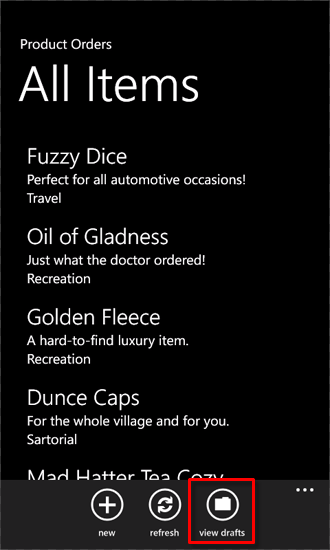
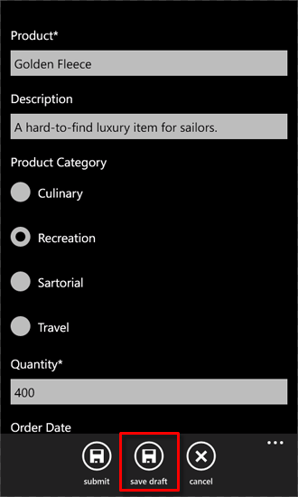
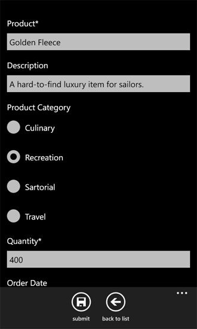

# <a name="how-to-store-and-retrieve-sharepoint-list-items-on-a-windows-phone"></a>Как: хранения и извлечения SharePoint списка элементов на ОС Windows Phone
Узнайте о жизненном цикле приложения Windows Phone и локальном хранении сетевых данных. Одно из наиболее важные замечания при разработке приложения для Windows Phone — управление сведения о состоянии, как для приложения в целом, так и для отдельных элементов страниц или данных в приложении. При разработке приложения для Windows Phone, необходимо учитывать, что пользователи приложений могут потерять возможность подключения к сетевым ресурсам (например, списки SharePoint). Инфраструктура разработки для приложений Windows Phone предоставляет механизмы для обработки сведения о состоянии на различных этапах жизненного цикла приложения.
  
    
    


> **Важные:** При разработке приложения для Windows Phone 8, должны использовать Visual Studio Express 2012 г., а не в Visual Studio 2010 Express. За исключением среды разработки все сведения в этой статье применимы к созданию приложений для Windows Phone 8 и Windows Phone 7. > Для получения дополнительных сведений см [как: Настройка среды разработки мобильных приложений для SharePoint](how-to-set-up-an-environment-for-developing-mobile-apps-for-sharepoint.md). 
  
    
    


## <a name="store-sharepoint-list-data-locally-on-a-windows-phone"></a>Сохранение данных списков SharePoint локально на Windows Phone
<a name="BKMK_StoringDataLocally"> </a>

На ОС Windows Phone только одно приложение работает за раз, и отключается при переходе другого приложения на телефоне (, нажав кнопку **Пуск** на телефоне, например), в настоящее время работает приложение, или в терминах разработка для ОС Windows Phone,захороненные. Если пользователь перейдет в режим неактивные приложения (, нажав кнопку **Назад** ), приложение может быть включена повторно, но если предоставить логику для обработки сведений о состоянии приложения на протяжении всего жизненного цикла приложения, сведений о состоянии не сохраняются по умолчанию в переход от активации отключении и обратно. (Дополнительные сведения о жизненном цикле приложения для приложения для Windows Phone см. [Обзор выполнения модели для Windows Phone](http://msdn.microsoft.com/en-us/library/ff817008%28v=VS.92%29.aspx).)
  
    
    
Для приложений Windows Phone класс **PhoneApplicationService** предоставляет доступ к событиям стандартных жизненного цикла, которые можно использовать для управления состоянием приложения. В проектах, созданных на основе шаблона приложения списка SharePoint для Windows Phone (как и в проектах, созданных из всех шаблонов **Silverlight для Windows Phone** ), эти стандартных событий жизненного цикла приложения Windows Phone указанной в файле App.xaml и его связи с обработчиков событий в файл фонового кода, App.xaml.cs. Объявления в файл App.xaml для ваших приложений список SharePoint должен выглядеть следующую разметку.
  
    
    


```

<Application.ApplicationLifetimeObjects>
    <!--Required object that handles lifetime events for the application-->
    <shell:PhoneApplicationService 
        Launching="Application_Launching" Closing="Application_Closing"Activated="Application_Activated" Deactivated="Application_Deactivated"/>
</Application.ApplicationLifetimeObjects>
```

Обработчики событий **Application_Activated** и **Application_Deactivated**, указанной в файле App.xaml реализованы в файл фонового кода App.xaml.cs с логикой по умолчанию, в которой кэшируется сведения о состоянии приложения для использования в приложение телефон до тех пор, пока приложение не будет завершен. Реализация обработчиков для этих событий использует свойство **State** (который предоставляет доступ к объекту **Dictionary** ) класса **PhoneApplicationService** для хранения данных. Временные данные, хранящиеся в этом свойстве **State**. То есть он сохраняется, когда приложение неактивные или захороненные, но не в том случае, когда приложение будет завершен. Важно помнить, как обрабатывать события жизненным циклом приложений в проектах, что при отключении приложения Windows при переключении другого приложения, который отключен приложения — это может быть завершение операционной системой Windows Phone, в зависимости от обстоятельствах. Все данные на телефоне, который не будет сохранен в постоянное хранилище теряются, даже если эти данные была сохранена для хранения временных данных, используя свойство **State** **PhoneApplicationService**.
  
    
    
В приложении Windows Phone, который получает данные из списка SharePoint данные, используемые на телефоне из сеанса в сеанс можно конечно извлечь с сервера под управлением SharePoint Server, если сервер доступен. Однако непрерывного возможность подключения к SharePoint Server могут быть недоступны для устройства Windows Phone, за вариантов в объеме службы, расположение и других факторов. Для предоставления пользователям ваше приложение с доступом к данным в случае потеряно подключение к серверу с SharePoint Server или просто для сохранения данных в постоянное хранилище между сеансами приложения вне зависимости от доступности сервера, можно воспользоваться преимуществами события **Closing** и **Launching** класса **PhoneApplicationService**.
  
    
    
Объявления в файл App.xaml и определенных в файле App.xaml.cs **Application_Launching** и **Application_Closing** обработчики для этих событий, но не реализованы. Обработка хранения и извлечения сведения о состоянии приложения в контексте завершение приложения, можно обеспечить реализацию для обработчика событий **Application_Closing** для хранения данных в изолированном, предназначенный для приложения, чтобы данные сохраняются между сеансами приложения, а также можно обеспечить реализацию для обработчика событий **Application_Launching** для извлечения данных из изолированного хранилища при запуске нового сеанса приложения (при запуске приложения) , даже в том случае, если подключение к серверу под управлением SharePoint Server, который является оригинального источника данных не поддерживается.
  
    
    

> **Совет:** Данные должны быть зашифрованы, затем сохранить локальное устройство. Дополнительные сведения о том, как для шифрования данных можно [как: шифровать данные в приложении Windows Phone](http://msdn.microsoft.com/en-us/library/hh487164%28v=vs.92%29.aspx)
  
    
    


### <a name="to-implement-event-handlers-for-storing-and-retrieving-application-state"></a>Реализация обработчиков событий для хранения и извлечения состояния приложения


1. Создание приложения Windows Phone с использованием шаблона приложения списка SharePoint для Windows Phone в Visual Studio, выполнив действия, описанные в [как: Создание приложения списка SharePoint для Windows Phone](how-to-create-a-windows-phone-sharepoint-list-app.md).
    
  
2. В **Обозревателе решений** выберите файл App.xaml.
    
  
3. КлавишиF7Чтобы открыть файл фонового кода App.xaml.cs, для редактирования.
    
  
4. Найдите (пустая) реализации обработчика событий **Application_Launching** и замените обработчик событий следующим кодом.
    
```cs
  
private void Application_Launching(object sender, LaunchingEventArgs e)
{
    if (IsolatedStorageSettings.ApplicationSettings.Contains(DataProvider.ListTitle))
    {
        App.MainViewModel = (ListViewModel)IsolatedStorageSettings.ApplicationSettings
                                              [DataProvider.ListTitle];                
        App.MainViewModel.Initialize();
    }
}
```

5. Найдите (пустая) реализации обработчика событий **Application_Closing** и замените этот обработчик событий следующим кодом.
    
```cs
  
private void Application_Closing(object sender, ClosingEventArgs e)
{
    if (IsolatedStorageSettings.ApplicationSettings.Contains(DataProvider.ListTitle))
    {
        IsolatedStorageSettings.ApplicationSettings[DataProvider.ListTitle] = App.MainViewModel;
    }
    else
    {
        IsolatedStorageSettings.ApplicationSettings.Add(DataProvider.ListTitle, App.MainViewModel);
    }
    IsolatedStorageSettings.ApplicationSettings.Save();
}
```

6. Сохраните файл.
    
  
С помощью этих реализаций на месте запустите приложение для инициализации основной ViewModel в приложении с помощью данных с сервера под управлением SharePoint Server. Выйдите из приложения по телефону (, нажав кнопку **резервного** для перехода после первой страницы для приложения) для запуска события **Application_Closing**. При выполнении приложения без подключения к серверу ViewModel, сохраненный на объект **Dictionary** **IsolatedStorageSettings**(в событии **Application_Closing** ) извлекается и инициализирована. Элементы списка SharePoint, сохраненных в изолированном в предыдущем сеансе приложения отображаются в виде списка (List.xaml) приложения.
  
    
    

## <a name="implement-a-mechanism-for-editing-list-items-offline"></a>Механизм для изменения элементов списка в автономный режим
<a name="BKMK_ImplementingOfflineEditing"> </a>

Если вы выполните процедуру, описанную в предыдущем разделе, для реализации обработчики для событий **Closing** и **Launching** в свое приложение, данных списка SharePoint, полученный с сервера при connectivity была доступна может отображаться в вашем приложении даже в том случае, если подключение к серверу теряются в последующих сеансов приложения, так как элементы списка извлекаются из локального хранилища сохраняемого на телефоне. На основе реализации в предыдущем разделе, тем не менее, элементов списка, доступных в этом случае для отображения во время автономный режим не изменяется и сохранен на сервере, если не восстановлены подключения к. В следующей процедуре вы добавите механизм ваше приложение для обеспечения хранения измененные версии элементов списка локально при отсутствии подключения. Если подключение к серверу доступен еще раз, можно извлечь эти элементы измененный список и сохранить изменения на сервере.
  
    
    
Для процедур, описанных в этом разделе предполагается, что вы работает в контексте проекта приложения Windows Phone создан на основе шаблона приложения списка SharePoint для Windows Phone и, что приложение основано на список заказов на продукт, созданный на основе шаблона настраиваемого списка на сервере и содержит столбцов и типов полей, показано в таблице 1.
  
    
    

**В таблице 1. Пример списка заказов на продукт**


|**Столбец**|**Тип**|**Required**|
|:-----|:-----|:-----|
|Продукт (например, заголовок)  <br/> |Однострочный текст (Текст)  <br/> |Да  <br/> |
|Описание  <br/> |Однострочный текст (Текст)  <br/> |Нет  <br/> |
|Количество  <br/> |Число  <br/> |Да  <br/> |
|Дата заказа  <br/> |Дата и время (DateTime)  <br/> |Нет  <br/> |
|Дата выполнения  <br/> |Дата и время (DateTime)  <br/> |Нет  <br/> |
|Номер контакта  <br/> |Однострочный текст (Текст)  <br/> |Нет  <br/> |
   

### <a name="to-implement-a-class-to-support-editing-items-while-offline"></a>Реализация класса для поддержки редактирования элементов при автономной


1. Начиная с Visual Studio проекта, который был создан на основе списка заказов на продукт, представленный в таблице 1, в **Обозревателе решений** выберите узел, который представляет проект (например,SPListAppLocalStorage).
    
  
2. В меню **проект** выберите пункт **Добавить класс**. 
    
    Откроется диалоговое окно **Добавление нового элемента** с помощью выбранного шаблона C# **класс**.
    
  
3. Имя файла класса DraftItemStore.csи нажмите кнопку **Добавить**.
    
    Файл класса будет добавлен в проект и открыт для редактирования.
    
  
4. Замените содержимое файла класса следующим кодом.
    
```cs
  
using System;
using System.Net;
using System.Windows;
using System.Collections.Generic;
using System.IO.IsolatedStorage;

namespace SPListAppLocalStorage // Based on project name by default.
{
    public class DraftItemStore
    {
        const string DraftsKey = "Drafts";

        public static void AddDraftItem(string id, EditItemViewModel model)
        {
            Dictionary<string, EditItemViewModel> draftCollection = GetDraftItemCollection();
            draftCollection[id] = model;
            SaveDrafts(draftCollection);
        }

        public static void RemoveDraftItem(string id)
        {
            Dictionary<string, EditItemViewModel> draftCollection = GetDraftItemCollection();
            draftCollection.Remove(id);
            SaveDrafts(draftCollection);
        }

        public static void SaveDrafts(Dictionary<string, EditItemViewModel> draft)
        {
            if (IsolatedStorageSettings.ApplicationSettings.Contains(DraftsKey))
            {
                IsolatedStorageSettings.ApplicationSettings[DraftsKey] = draft;
            }
            else
            {
                IsolatedStorageSettings.ApplicationSettings.Add(DraftsKey, draft);
            }
        }

        public static List<EditItemViewModel> Drafts
        {
            get
            {
                Dictionary<string, EditItemViewModel> draftCollection = GetDraftItemCollection();

                List<EditItemViewModel> modelCollection = new List<EditItemViewModel>();
                foreach (KeyValuePair<string, EditItemViewModel> entry in draftCollection)
                {
                    modelCollection.Add(entry.Value);
                }

                return modelCollection;
            }
        }

        public static Dictionary<string, EditItemViewModel> GetDraftItemCollection()
        {
            Dictionary<string, EditItemViewModel> draftCollection = null;
            if (IsolatedStorageSettings.ApplicationSettings.Contains(DraftsKey))
                draftCollection = (Dictionary<string,
                EditItemViewModel>)IsolatedStorageSettings.ApplicationSettings[DraftsKey];

            if (draftCollection == null)
                draftCollection = new Dictionary<string, EditItemViewModel>();

            return draftCollection;
        }

        public static EditItemViewModel GetDraftItemById(string id)
        {
            Dictionary<string, EditItemViewModel> draftCollection = GetDraftItemCollection();
            return !draftCollection.ContainsKey(id) ? null : draftCollection[id];
        }
    }
}
```


    The namespace specified in this code is based on the name of the project (SPListAppLocalStorage in this case). You might want to specify a different namespace, based on the name of your project.
    
  
5. Сохраните файл.
    
  
Определенный экземпляр класса **EditItemViewModel** представляет элемент списка SharePoint, изменяется на телефоне. Могут быть полезны элемента списка, который был изменен, как «черновик элемента» до изменения к элементу будут сохранены на сервере. В примере кода в этом классе метод **AddDraftItem** добавляет определенный экземпляр класса **EditItemViewModel** (то есть, черновиков элемента) как значение объект **Dictionary** **EditItemViewModel** в **Dictionary** связь с ключом, на основе идентификатора для заданного элемента списка. (Идентификатор назначаемый SharePoint Server для каждого элемента списка. В проекте на основе шаблона приложения списка SharePoint для Windows Phone этот идентификатор хранится в свойство **ID** класса данного **ViewModel**, например **EditItemViewModel** или **DisplayItemViewModel**, который представляет элемент списка.) Метод **RemoveDraftItem** удаляет **EditItemViewModel** из объекта **Dictionary** на основе указанного идентификатора. Как использовать метод **GetDraftItemCollection** для получения **Dictionary** object, содержащий объекты **EditItemViewModel** из изолированного хранилища из этих методов и оба метода используйте метод **SaveDrafts** сохранить объект измененные **Dictionary** (с помощью элемента черновика в нее добавлены или удалены из нее) в изолированном. Метод **GetDraftItemCollection** сначала определяет ли объект **Dictionary** "Черновики" сохранения изолированного хранилища. Если это так, метод возвращает этот объект **Dictionary**; в противном случае метод инициализирует и возвращает экземпляр объекта **Dictionary**. Свойство **Drafts** класса предоставляет доступ к **Dictionary** элементов черновиков, возвращая список (то есть, объект на основе **List<T>** универсальный) элементов черновиков как **EditItemViewModel** объекты. Метод **GetDraftItemById** возвращает элемент указанного черновиков из объекта **Dictionary** на основе значения указанным идентификатором.
  
    
    
Теперь можно добавить элементы в пользовательский интерфейс приложения с телефона и настраивать их на класс **DraftItemStore** используется для изменения элементов списка в автономный режим. В следующих процедурах выполним следующие задачи:
  
    
    

- Добавление и настройка страниц Windows Phone для отображения всех элементов списка, сохраненные как черновики для изолированного хранилища на телефоне.
    
  
- Добавление и настройка другой страницы, привязанных к **EditItemViewModel**, для редактирования элемента отдельных черновиков, аналогом формы изменения (EditForm.xaml) для элементов списка.
    
  
- Добавьте метод **SaveAsDraft**класса **EditItemViewModel**, который выполняет метод **AddDraftItem** класса **DraftItemStore**, реализованные в предыдущей процедуре.
    
  
- Добавление кнопки **ApplicationBar** в файл EditForm.xaml, чтобы вызвать метод **SaveAsDraft**.
    
  
- Добавление кнопки **ApplicationBar** в файл List.xaml, чтобы перейти на страницу, которая отображает все элементы списка, сохраняемые как черновики.
    
  

### <a name="to-add-a-page-for-displaying-all-draft-items-saved-on-the-phone"></a>Добавление страницы для отображения всех элементов черновиков, сохраненные на телефоне


1. В **Обозревателе решений** выберите папку **представлений**.
    
  
2. В меню **ПРОЕКТ** выберите пункт **Добавить новый элемент**. 
    
    Откроется диалоговое окно **Добавление нового элемента**.
    
  
3. В диалоговом окне **Добавление нового элемента** разверните узел **Visual C#** и выберите узел **Silverlight для Windows Phone**.
    
  
4. В области **Шаблоны** выберите шаблон **Страницы Книжная Windows Phone**.
    
  
5. Имя файла Drafts.xamlи нажмите кнопку **Добавить**. 
    
    Файл добавлен в проект в разделе узел **представления** и открыт для редактирования.
    
  
6. На левой панели XAML в конструкторе замените содержимое файла на следующий код.
    
```
  
<phone:PhoneApplicationPage
    x:Class="SPListAppLocalStorage.Views.Drafts"
    xmlns="http://schemas.microsoft.com/winfx/2006/xaml/presentation"
    xmlns:x="http://schemas.microsoft.com/winfx/2006/xaml"
    xmlns:phone="clr-namespace:Microsoft.Phone.Controls;assembly=Microsoft.Phone"
    xmlns:shell="clr-namespace:Microsoft.Phone.Shell;assembly=Microsoft.Phone"
    xmlns:d="http://schemas.microsoft.com/expression/blend/2008"
    xmlns:mc="http://schemas.openxmlformats.org/markup-compatibility/2006"
    FontFamily="{StaticResource PhoneFontFamilyNormal}"
    FontSize="{StaticResource PhoneFontSizeNormal}"
    Foreground="{StaticResource PhoneForegroundBrush}"
    SupportedOrientations="Portrait" Orientation="Portrait"
    mc:Ignorable="d" d:DesignHeight="696" d:DesignWidth="480"
    shell:SystemTray.IsVisible="True">

    <!--LayoutRoot is the root grid where all page content is placed-->
    <Grid x:Name="LayoutRoot" Background="Transparent">
        <Grid.RowDefinitions>
            <RowDefinition Height="Auto"/>
            <RowDefinition Height="*"/>
        </Grid.RowDefinitions>

        <!--TitlePanel contains the name of the application and page title-->
        <StackPanel x:Name="TitlePanel" Grid.Row="0" Margin="12,17,0,28">
            <TextBlock x:Name="ApplicationTitle" Text="Product Orders" 
                                    Style="{StaticResource PhoneTextNormalStyle}"/>
            <TextBlock x:Name="PageTitle" Text="Draft Items" Margin="9,-7,0,0" 
                                      Style="{StaticResource PhoneTextTitle1Style}"/>
        </StackPanel>

        <!--ContentPanel - place additional content here-->
        <Grid x:Name="ContentPanel" Grid.Row="1" Margin="12,0,12,0">
            <ListBox x:Name="lstBoxDraftItems" ItemsSource="{Binding}"
                                  SelectionChanged="lstBoxDraftItems_SelectionChanged">
                <ListBox.ItemTemplate>
                    <DataTemplate>
                        <StackPanel>
                            <TextBlock Text="{Binding [Title]}" Style="
                                           {StaticResource PhoneTextTitle2Style}"></TextBlock>
                            <TextBlock Text="{Binding [Description]}" Style="
                                            {StaticResource PhoneTextNormalStyle}"></TextBlock>
                            <TextBlock Text="{Binding [Contact_x0020_Number]}" Style="
                                           {StaticResource PhoneTextNormalStyle}"></TextBlock>
                        </StackPanel>
                    </DataTemplate>
                </ListBox.ItemTemplate>
            </ListBox>
        </Grid>
    </Grid>
 
    <phone:PhoneApplicationPage.ApplicationBar>
        <shell:ApplicationBar IsVisible="True" IsMenuEnabled="True">
            <shell:ApplicationBarIconButton x:Name="btnCancel" 
             IconUri="/Images/appbar.cancel.rest.png" Text="Cancel" Click="OnCancelButtonClick" />
        </shell:ApplicationBar>
    </phone:PhoneApplicationPage.ApplicationBar>

</phone:PhoneApplicationPage>
```


    The value of the namespace designation  `<x:Class>` in this code ("SPListAppLocalStorage.Views.Drafts") will vary depending on the name of your project.
    
  
7. С помощью файла Drafts.xaml, выбранного в **Обозревателе решений** нажмите клавишуF7Чтобы открыть файл выделенным кодом Drafts.xaml.cs, для редактирования.
    
  
8. Замените содержимое файла следующим кодом.
    
```cs
  
using System;
using System.Collections.Generic;
using System.Linq;
using System.Net;
using System.Windows;
using System.Windows.Controls;
using System.Windows.Documents;
using System.Windows.Input;
using System.Windows.Media;
using System.Windows.Media.Animation;
using System.Windows.Shapes;
using Microsoft.Phone.Controls;

namespace SPListAppLocalStorage.Views
{
    public partial class Drafts : PhoneApplicationPage
    {
        public Drafts()
        {
            InitializeComponent();
            this.Loaded += new RoutedEventHandler(Drafts_Loaded);
        }

        private void lstBoxDraftItems_SelectionChanged(object sender, SelectionChangedEventArgs e)
        {
            ListBox lstBox = sender as ListBox;
            if (lstBox.SelectedIndex == -1)
                return;

            EditItemViewModel selectedDraftItem = lstBox.SelectedItem as EditItemViewModel;
            NavigationService.Navigate(new Uri(string.Format("/Views/DraftItemEditForm.xaml?ID={0}",
                                                   selectedDraftItem.ID), UriKind.Relative));

            lstBox.SelectedIndex = -1;
        }

        void Drafts_Loaded(object sender, RoutedEventArgs e)
        {
            this.DataContext = DraftItemStore.Drafts;
        }

        private void OnCancelButtonClick(object sender, EventArgs e)
        {
            // Navigate back to initial List View form.
            NavigationService.Navigate(new Uri("/Views/List.xaml", UriKind.Relative));
        }
    }
}
```

9. Сохраните файлы.
    
  

### <a name="to-add-a-page-for-editing-individual-draft-items"></a>Добавление страницы для редактирования отдельных черновики


1. В **Обозревателе решений** выберите папку **представлений**.
    
  
2. В меню **ПРОЕКТ** выберите пункт **Добавить новый элемент**. 
    
    Откроется диалоговое окно **Добавление нового элемента**.
    
  
3. В диалоговом окне **Добавление нового элемента** разверните узел **Visual C#** и выберите узел **Silverlight для Windows Phone**.
    
  
4. В области **Шаблоны** выберите шаблон **Страницы Книжная Windows Phone**.
    
  
5. Имя файла DraftItemEditForm.xamlи нажмите кнопку **Добавить**. 
    
    Файл добавлен в проект в разделе узел **представления** и открыт для редактирования.
    
  
6. На левой панели XAML в конструкторе замените содержимое файла на следующий код.
    
```
  
<phone:PhoneApplicationPage
    x:Class="SPListAppLocalStorage.DraftItemEditForm"
    xmlns="http://schemas.microsoft.com/winfx/2006/xaml/presentation"
    xmlns:x="http://schemas.microsoft.com/winfx/2006/xaml"
    xmlns:phone="clr-namespace:Microsoft.Phone.Controls;assembly=Microsoft.Phone"
    xmlns:shell="clr-namespace:Microsoft.Phone.Shell;assembly=Microsoft.Phone"
    xmlns:d="http://schemas.microsoft.com/expression/blend/2008"
    xmlns:mc="http://schemas.openxmlformats.org/markup-compatibility/2006"
    mc:Ignorable="d" d:DesignWidth="480" d:DesignHeight="696"
    FontFamily="{StaticResource PhoneFontFamilyNormal}"
    FontSize="{StaticResource PhoneFontSizeNormal}"
    Foreground="{StaticResource PhoneForegroundBrush}"
    SupportedOrientations="Portrait" Orientation="Portrait"
    shell:SystemTray.IsVisible="True" x:Name="DraftItemEditPage">

    <!--LayoutRoot is the root grid where all page content is placed-->
    <Grid x:Name="LayoutRoot" Background="Transparent"
        xmlns:x="http://schemas.microsoft.com/winfx/2006/xaml" 
             xmlns:controls="clr-namespace:Microsoft.Phone.Controls;assembly=
                Microsoft.Phone.Controls">
        <StackPanel>
            <ProgressBar Background="Red" x:Name="progressBar" Opacity="1" 
                                    HorizontalAlignment="Center" VerticalAlignment="Top" 
                                    Height="15" Width="470" IsIndeterminate="{Binding IsBusy}" 
                                    Visibility="{Binding ShowIfBusy}" />
            <ScrollViewer HorizontalScrollBarVisibility="Auto" Height="700">
                <Grid x:Name="ContentPanel" Width="470">
                    <StackPanel Margin="0,5,0,5">
                        <StackPanel Orientation="Vertical" Margin="0,5,0,5">
                            <TextBlock TextWrapping="Wrap" HorizontalAlignment="Left" 
                                Style="{StaticResource PhoneTextNormalStyle}">Product*</TextBlock>
                            <TextBox Style="{StaticResource TextValidationTemplate}" 
                         FontSize="{StaticResource   PhoneFontSizeNormal}" Width="470" 
                         HorizontalAlignment="Left" Name="txtTitle" Text="{Binding [Title], 
                                   Mode=TwoWay,ValidatesOnNotifyDataErrors=True,NotifyOnValidationError=True}" 
                                                                         TextWrapping="Wrap" />
                        </StackPanel>
                        <StackPanel Orientation="Vertical" Margin="0,5,0,5">
                            <TextBlock TextWrapping="Wrap" HorizontalAlignment="Left" 
                               Style="{StaticResource PhoneTextNormalStyle}">Description</TextBlock>
                            <TextBox Style="{StaticResource TextValidationTemplate}" 
                               FontSize="{StaticResource PhoneFontSizeNormal}" Width="470" 
                                HorizontalAlignment="Left" Name="txtDescription" 
                                                           Text="{Binding [Description],
                                                           Mode=TwoWay, ValidatesOnNotifyDataErrors=True, 
                                                           NotifyOnValidationError=True}" 
                                       TextWrapping="Wrap" />
                        </StackPanel>
                        <StackPanel Orientation="Vertical" Margin="0,5,0,5">
                            <TextBlock TextWrapping="Wrap" HorizontalAlignment="Left" 
                               Style="{StaticResource PhoneTextNormalStyle}">
                                                           Product Category</TextBlock>
                            <ListBox MaxHeight="400" Width="Auto" x:Name="lstBoxProduct_x0020_Category"
                                              ItemsSource="{Binding [Product_x0020_Category]}">
                                <ListBox.ItemTemplate>
                                    <DataTemplate>
                                        <RadioButton FontSize="{StaticResource PhoneFontSizeNormal}" 
                                          HorizontalAlignment="Left" GroupName="Product_x0020_Category" 
                                                                 Content="{Binding Name}" 
                               IsChecked="{Binding IsChecked, Mode=TwoWay}" />
                                    </DataTemplate>
                                </ListBox.ItemTemplate>
                            </ListBox>
                        </StackPanel>
                        <StackPanel Orientation="Vertical" Margin="0,5,0,5">
                            <TextBlock TextWrapping="Wrap" HorizontalAlignment="Left" 
                                       Style="{StaticResource PhoneTextNormalStyle}">Quantity*</TextBlock>
                            <TextBox Style="{StaticResource TextValidationTemplate}" 
                                   FontSize="{StaticResource PhoneFontSizeNormal}" Width="470" 
                                      HorizontalAlignment="Left" Name="txtQuantity" Text="{Binding [Quantity], 
                                        Mode=TwoWay, ValidatesOnNotifyDataErrors=True, 
                                           NotifyOnValidationError=True}"
                                             TextWrapping="Wrap" />
                        </StackPanel>
                        <StackPanel Orientation="Vertical" Margin="0,5,0,5">
                            <TextBlock TextWrapping="Wrap" HorizontalAlignment="Left" 
                                Style="{StaticResource PhoneTextNormalStyle}">Order Date</TextBlock>
                            <TextBox Height="Auto" Style="{StaticResource TextValidationTemplate}"
                                               FontSize="{StaticResource PhoneFontSizeNormal}" Width="470"  
                                                         HorizontalAlignment="Left" Name="txtOrder_x0020_Date" 
                         Text="{Binding [Order_x0020_Date], Mode=TwoWay, ValidatesOnNotifyDataErrors=True, 
                                           NotifyOnValidationError=True}" TextWrapping="Wrap" />
                            <TextBlock FontSize="16" TextWrapping="Wrap" HorizontalAlignment="Left" 
                                                 Style="{StaticResource PhoneTextSubtleStyle}" 
                                                             Text="{Binding DateTimeFormat}" />
                        </StackPanel>
                        <StackPanel Orientation="Vertical" Margin="0,5,0,5">
                            <TextBlock TextWrapping="Wrap" HorizontalAlignment="Left" 
                         Style="{StaticResource PhoneTextNormalStyle}">Fulfillment Date</TextBlock>
                            <TextBox Height="Auto" Style="{StaticResource TextValidationTemplate}"
                                          FontSize="{StaticResource PhoneFontSizeNormal}" Width="470" 
                                          HorizontalAlignment="Left" Name="txtFulfillment_x0020_Date" 
                        Text="{Binding [Fulfillment_x0020_Date], Mode=TwoWay, 
                     ValidatesOnNotifyDataErrors=True, NotifyOnValidationError=True}" 
                         TextWrapping="Wrap" />
                            <TextBlock FontSize="16" TextWrapping="Wrap" HorizontalAlignment="Left"
                                                    Style="{StaticResource PhoneTextSubtleStyle}" Text="{Binding
                                                           DateTimeFormat}" />
                        </StackPanel>
                        <StackPanel Orientation="Horizontal">
                            <TextBlock TextWrapping="Wrap" Width="150" HorizontalAlignment="Left"
                                                  Style="{StaticResource PhoneTextNormalStyle}">Rush 
                                                                   :</TextBlock>
                            <CheckBox Name="txtRush" FontSize="{StaticResource PhoneFontSizeNormal}" 
                                          HorizontalAlignment="Left" IsChecked="{Binding [Rush], Mode=TwoWay, 
                               ValidatesOnNotifyDataErrors=True, NotifyOnValidationError=True}" />
                        </StackPanel>
                        <StackPanel Orientation="Vertical" Margin="0,5,0,5">
                            <TextBlock TextWrapping="Wrap" HorizontalAlignment="Left" 
                        Style="{StaticResource PhoneTextNormalStyle}">Contact Number</TextBlock>
                            <TextBox Style="{StaticResource TextValidationTemplate}" 
                                   FontSize="{StaticResource PhoneFontSizeNormal}" Width="470"
                                              HorizontalAlignment="Left" Name="txtContact_x0020_Number"
                                                         Text="{Binding [Contact_x0020_Number], 
                                                         Mode=TwoWay, ValidatesOnNotifyDataErrors=True, 
                                                         NotifyOnValidationError=True}" 
                                                                           TextWrapping="Wrap" />
                        </StackPanel>
                    </StackPanel>
                </Grid>
            </ScrollViewer>
        </StackPanel>
    </Grid>

    <phone:PhoneApplicationPage.ApplicationBar>
        <shell:ApplicationBar IsVisible="True" IsMenuEnabled="True">
            <shell:ApplicationBarIconButton x:Name="btnSubmit" 
                                IconUri="/Images/appbar.save.rest.png" 
                                Text="Submit" Click="OnSubmitButtonClick"/>
            <shell:ApplicationBarIconButton x:Name="btnBack" 
                                IconUri="/Images/appbar.back.rest.png" 
                                 Text="Back to List" Click="OnBackButtonClick"/>
        </shell:ApplicationBar>
    </phone:PhoneApplicationPage.ApplicationBar>

</phone:PhoneApplicationPage>
```


    The XAML for defining this page is similar to that of the EditForm.xaml file. You can copy the EditForm.xaml file to use as a basis for DraftItemEditForm.xaml, making the modifications to the file as indicated in this markup.
    
  
7. С помощью файла DraftItemEditForm.xaml, выбранного в **Обозревателе решений** нажмите клавишуF7Чтобы открыть файл выделенным кодом DraftItemEditForm.xaml.cs, для редактирования.
    
  
8. Замените содержимое файла следующим кодом.
    
```cs
  
using System;
using System.Collections.Generic;
using System.Linq;
using System.Net;
using System.Windows;
using System.Windows.Controls;
using System.Windows.Documents;
using System.Windows.Input;
using System.Windows.Media;
using System.Windows.Media.Animation;
using System.Windows.Shapes;
using Microsoft.Phone.Controls;
using Microsoft.SharePoint.Client;
using Microsoft.Phone.Tasks;
using System.Device.Location;
using Microsoft.Phone.Shell;
using Microsoft.SharePoint.Phone.Application;

namespace SPListAppLocalStorage
{
    public partial class DraftItemEditForm : PhoneApplicationPage
    {
        EditItemViewModel viewModel;

        /// <summary>
        /// Constructor for Draft Item Edit Form.
        /// </summary>
        public DraftItemEditForm()
        {
            InitializeComponent();
        }

        protected override void OnNavigatedTo(System.Windows.Navigation.NavigationEventArgs e)
        {
 // Include initialization of ViewModel here rather than in constructor to be able to use QueryString value.
            if (viewModel == null)
            {
                viewModel = DraftItemStore.GetDraftItemById(NavigationContext.QueryString["ID"].ToString());
            }

            viewModel.Initialize();
            this.DataContext = viewModel;

            base.OnNavigatedTo(e);
            viewModel.ItemUpdated += new EventHandler<ItemUpdatedEventArgs>(OnItemUpdated);
        }

        protected override void OnNavigatedFrom(System.Windows.Navigation.NavigationEventArgs e)
        {
            base.OnNavigatedFrom(e);
            viewModel.ItemUpdated -= new EventHandler<ItemUpdatedEventArgs>(OnItemUpdated);
        }

        private void OnViewModelInitialization(object sender, InitializationCompletedEventArgs e)
        {
            this.Dispatcher.BeginInvoke(() =>
            {
                // If initialization has failed show error message and return.
                if (e.Error != null)
                {
                    MessageBox.Show(e.Error.Message, e.Error.GetType().Name, MessageBoxButton.OK);
                    return;
                }

                // Set Page's DataContext to current ViewModel instance.
                this.DataContext = (sender as EditItemViewModel);
            });
        }

        private void OnCancelButtonClick(object sender, EventArgs e)
        {
            NavigationService.Navigate(new Uri("/Views/List.xaml", UriKind.Relative));
        }

        private void OnSubmitButtonClick(object sender, EventArgs e)
        {
            viewModel.UpdateItem();
        }

        private void OnItemUpdated(object sender, ItemUpdatedEventArgs e)
        {
            this.Dispatcher.BeginInvoke(() =>
            {
                if (e.Error != null)
                {
                    MessageBox.Show(e.Error.Message, e.Error.GetType().Name, MessageBoxButton.OK);
                    return;
                }

                // Remove Draft Item from local storage if update to server succeeds.
                DraftItemStore.RemoveDraftItem(viewModel.ID.ToString());
                this.NavigationService.Navigate(new Uri("/Views/List.xaml", UriKind.Relative));
            });
        }

        private void OnBackButtonClick(object sender, EventArgs e)
        {
            NavigationService.Navigate(new Uri("/Views/List.xaml", UriKind.Relative));
        }
    }
}
```


    As you can see, the namespace used in this file is based on the name of the project (SPListAppLocalStorage).
    
  
9. Изображение appbar.back.rest.png добавьте в проект для кнопки **ApplicationBar** (btnBack), указанной в файле DraftItemEditForm.xaml. В **Обозревателе решений** выберите узел папки **изображений** в проекте.
    
  
10. В меню **Проект** выберите пункт **Добавить существующий элемент**. 
    
  
11. В браузере, который открывает перейдите к папке, в котором были установлены стандартные изображения значка Windows Phone по Windows Phone SDK 7.1.
    
    > **Примечание:** Изображения с быстрое переднего плана и темный фон находятся в `%PROGRAMFILES%(x86)\\Microsoft SDKs\\Windows Phone\\v7.1\\Icons\\dark` при установке пакета SDK.
12. Выберите файл изображения, с именем appbar.back.rest.png и нажмите кнопку **Добавить**. Изображение добавляется в проект в узле **изображений**.
    
  
13. В **Обозревателе решений** выберите файл изображения вы только что добавили, в **Окно "Свойства"** для файла, для свойства **Действие при построении** для файла изображения для **контента** и присвойте свойству **Копировать в выходной каталог** **Копировать, если новее**.
    
  
14. Сохраните файлы.
    
  

### <a name="to-add-an-applicationbar-button-to-the-edit-form-for-saving-an-item-as-a-draft"></a>Чтобы добавить кнопку ApplicationBar форма редактирования для сохранения элемента в виде черновика


1. В **Обозревателе решений** выберите файл EditItemViewModel.cs в узле **ViewModels** в проекте. Нажмите клавишуF7Чтобы открыть файл для редактирования.
    
  
2. В блоке кода (обозначенного открывающих и закрывающих скобок), который реализует класс **EditItemViewModel** добавьте следующий метод открытого файла.
    
```cs
  
public void SaveAsDraft()
{
    DraftItemStore.AddDraftItem(this.ID.ToString(), this);
}
```

3. В **Обозревателе решений** выберите в разделе узел **представления** в проекте, дважды щелкните файл EditForm.xaml.
    
    Файл открыт для редактирования в конструкторе.
    
  
4. В XAML панели конструктора добавьте другой кнопки тега  `<shell:ApplicationBar>` (в дополнение к существующей **Submit** **Отменить** кнопки и), как показано в следующем коде XAML.
    
```
  
<phone:PhoneApplicationPage.ApplicationBar>
    <shell:ApplicationBar IsVisible="True" IsMenuEnabled="True">
        <shell:ApplicationBarIconButton x:Name="btnSubmit" 
              IconUri="/Images/appbar.save.rest.png" 
              Text="Submit" Click="OnBtnSubmitClick"/>
        <shell:ApplicationBarIconButton x:Name="btnSaveDraft"            IconUri="/Images/appbar.save.rest.png" Text="Save Draft"            Click="OnSaveDraftButtonClick"/>
        <shell:ApplicationBarIconButton x:Name="btnCancel" 
                      IconUri="/Images/appbar.cancel.rest.png" 
                      Text="Cancel" Click="OnCancelButtonClick"/>
    </shell:ApplicationBar>
</phone:PhoneApplicationPage.ApplicationBar>
```

5. С помощью файла EditForm.xaml, выбранного в **Обозревателе решений** нажмите клавишуF7Чтобы открыть файл выделенным кодом EditForm.xaml.cs, для редактирования.
    
  
6. В блоке кода (обозначенного открывающих и закрывающих скобок), который реализует разделяемый класс **EditForm** добавьте следующий обработчик событий в файл.
    
```cs
  
private void OnSaveDraftButtonClick(object sender, EventArgs e)
{
    viewModel.SaveAsDraft();
}
```

7. Сохраните файлы.
    
  

### <a name="to-add-an-applicationbar-button-to-the-list-view-form-to-display-all-draft-items"></a>Чтобы добавить кнопку ApplicationBar формы представления списка для отображения всех элементов черновиков


1. В **Обозревателе решений** выберите узел **представления**, дважды щелкните файл List.xaml.
    
    Файл открыт для редактирования в конструкторе.
    
  
2. В XAML панели конструктора добавьте другой кнопки тега **<shell:ApplicationBar>** (в дополнение к существующей **Создать** "и" **Обновить** кнопок), как показано в следующей разметке XAML.
    
```
  
<phone:PhoneApplicationPage.ApplicationBar>
    <shell:ApplicationBar IsVisible="True" IsMenuEnabled="True">
        <shell:ApplicationBarIconButton x:Name="btnNew" 
        IconUri="/Images/appbar.new.rest.png" Text="New" 
                    Click="OnNewButtonClick"/>
        <shell:ApplicationBarIconButton x:Name="btnRefresh" 
                   IconUri="/Images/appbar.refresh.rest.png" 
        Text="Refresh" IsEnabled="True" Click="OnRefreshButtonClick"/>
        <shell:ApplicationBarIconButton x:Name="btnDrafts"            IconUri="/Images/appbar.folder.rest.png"            Text="View Drafts" IsEnabled="True"            Click="OnDraftsButtonClick"/>
    </shell:ApplicationBar>
</phone:PhoneApplicationPage.ApplicationBar>
```

3. Изображение значка добавьте в проект для кнопки **«Черновики»**. В **Обозревателе решений** выберите узел папки **изображений** в проекте.
    
  
4. В меню **Проект** выберите пункт **Добавить существующий элемент**. 
    
  
5. В браузере, который открывает перейдите к папке, в котором были установлены стандартные изображения значка Windows Phone по Windows Phone SDK 7.1.
    
    > **Примечание:** Изображения с быстрое переднего плана и темный фон находятся в `%PROGRAMFILES%(x86)\\Microsoft SDKs\\Windows Phone\\v7.1\\Icons\\dark` при установке пакета SDK.
6. Выберите файл изображения, с именем appbar.folder.rest.png и нажмите кнопку **Добавить**. 
    
    Добавить изображение добавляется в проект в узле **изображений**.
    
  
7. В **Обозревателе решений** выберите файл изображения только что добавлен в **Окно "Свойства"** задайте свойство **Действие при построении** для файла изображения для **контента** и присвойте свойству **Копировать в выходной каталог** **Копировать, если новее**.
    
  
8. В **Обозревателе решений** выберите файл List.xaml в разделе узел **представления** и нажмите клавишуF7. Файл выделенным кодом List.xaml.cs, открывается для редактирования.
    
  
9. Добавьте следующий обработчик событий в файл в блоке кода (обозначенного открывающих и закрывающих скобок), который реализует разделяемый класс **ListForm**.
    
```cs
  
private void OnDraftsButtonClick(object sender, EventArgs e)
{
    NavigationService.Navigate(new Uri("/Views/Drafts.xaml", UriKind.Relative));
}
```

10. Сохраните все файлы в решение и нажмите клавишуF6Для компиляции решения
    
  
Если запуск проекта и его развертывание на эмулятора телефона Windows, вы увидите кнопку **Просмотреть черновики** на **ApplicationBar** формы списка (рис. 1), которая вызывает все элементы списка, хранящейся как черновики.
  
    
    

**На рисунке 1. Измененная форма списка с кнопкой "Просмотр черновиков"**

  
    
    

  
    
    

  
    
    
В первую очередь так как нет черновиков, страницы, чтобы отобразить черновики будет пустым. Выбор элемента из формы списка (для отображения Отображаемая форма (DisplayForm.xaml) для элемента) и затем нажмите кнопку **Изменить**, чтобы открыть формы изменения. Если следует потеряно соединение с SharePoint Server, можно затем нажмите кнопку **Сохранить черновик** на форма редактирования (на рисунке 2), чтобы сохранить все изменения, внесенные в элемент списка в изолированном хранилище.
  
    
    

**На рисунке 2. Измененная форма редактирования с кнопкой "Сохранить черновик"**

  
    
    

  
    
    

  
    
    
Сервер снова станет доступным, можно **Просмотреть черновики** кнопку на форму списка для отображения страницы "Черновики" (на рисунке 3).
  
    
    

**На рисунке 3. Отображение элементов, сохраненные как черновики для изолированного хранения черновиков страницы**

  
    
    

  
    
    

  
    
    
При выборе элемента на странице "Черновики" Форма редактирования элемента черновика (DraftItemEditForm.xaml) — отображаемой (на рисунке 4) и вы можно внести любые дополнительные изменения и нажмите кнопку **Отправить**, чтобы сохранить элемент на сервере. На этом этапе элемент будет удален из изолированного хранилища, так как больше не обрабатываются как черновик элемента после сохранения с его изменения на сервере.
  
    
    

**На рисунке 4. Форма редактирования черновика**

  
    
    

  
    
    

  
    
    
Обратите внимание на то сходства между форма редактирования элемента черновика (на рисунке 4) и стандартной формы редактирования (на рисунке 2) в этом приложении. Возможности редактирования для элементов, как черновики следует то же, что возможности редактирования для элементов в контексте формы редактирования.
  
    
    

## <a name="additional-resources"></a>Дополнительные ресурсы
<a name="SP15StoreSPlist_addlresources"> </a>


-  [Построение приложений Windows Phone, обращающихся к SharePoint](build-windows-phone-apps-that-access-sharepoint.md)
    
  
-  [Хранение локальных данных для Windows Phone](http://msdn.microsoft.com/library/fdf7e973-5de5-4cfa-bf63-1e65c90744cc%28Office.15%29.aspx)
    
  
-  [Как: сохранения и восстановления состояния приложения для Windows Phone](http://msdn.microsoft.com/library/342e97c1-ff92-4cb2-81fa-e46f87c3cfc2%28Office.15%29.aspx)
    
  
-  [Windows Phone SDK 8.0](http://www.microsoft.com/en-us/download/details.aspx?id=35471)
    
  
-  [Пакет SDK Microsoft SharePoint для Windows Phone 8](http://www.microsoft.com/en-us/download/details.aspx?id=36818)
    
  
-  [Как: Настройка среды разработки мобильных приложений для SharePoint](how-to-set-up-an-environment-for-developing-mobile-apps-for-sharepoint.md)
    
  
-  [Пакет SDK для Windows Phone 7.1](http://www.microsoft.com/en-us/download/details.aspx?id=27570)
    
  
-  [Пакет SDK Microsoft SharePoint для Windows Phone 7.1](http://www.microsoft.com/en-us/download/details.aspx?id=30476)
    
  

