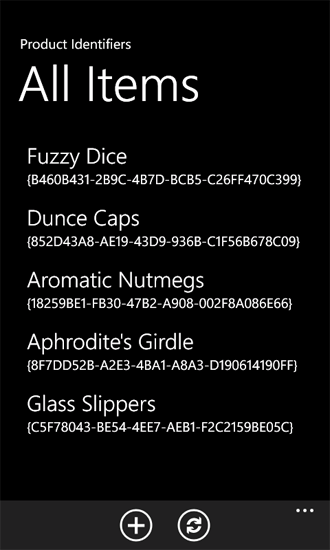

# <a name="support-and-convert-sharepoint-field-types-for-windows-phone-apps"></a><span data-ttu-id="0cd57-102">Поддержка и преобразование типов полей SharePoint для приложений Windows Phone</span><span class="sxs-lookup"><span data-stu-id="0cd57-102">Support and convert SharePoint field types for Windows Phone apps</span></span>

<span data-ttu-id="0cd57-p101">Реализуйте логику преобразования данных для поддержки типов полей SharePoint в приложениях Windows Phone. В проектах, созданных на основе шаблона приложения списка SharePoint для Windows Phone данные множество типов поля SharePoint обрабатываются и координированное логикой преобразования по умолчанию для подходит для отображения и управление ими в пользовательском интерфейсе Silverlight Windows Phone, но разработчики также могут реализовать собственные пользовательские данные процедур обработки.</span><span class="sxs-lookup"><span data-stu-id="0cd57-p101">Implement data-conversion logic to support SharePoint field types in Windows Phone apps. In projects based on the Windows Phone SharePoint List Application template, the data of many SharePoint field types is processed and coordinated by default conversion logic to be suitable for display and manipulation in the Silverlight user interface of a Windows Phone, but developers can also implement their own custom data handling routines.</span></span>
  
    
    


> <span data-ttu-id="0cd57-105">**Важные:** При разработке приложения для Windows Phone 8, должны использовать Visual Studio Express 2012 г., а не в Visual Studio 2010 Express.</span><span class="sxs-lookup"><span data-stu-id="0cd57-105">**Important:** If you are developing an app for Windows Phone 8, you must use Visual Studio Express 2012 instead of Visual Studio 2010 Express.</span></span> <span data-ttu-id="0cd57-106">За исключением среды разработки все сведения в этой статье применимы к созданию приложений для Windows Phone 8 и Windows Phone 7.</span><span class="sxs-lookup"><span data-stu-id="0cd57-106">Except for the development environment, all information in this article applies to creating apps for both Windows Phone 8 and Windows Phone 7.</span></span> <span data-ttu-id="0cd57-107">> Для получения дополнительных сведений см [как: Настройка среды разработки мобильных приложений для SharePoint](how-to-set-up-an-environment-for-developing-mobile-apps-for-sharepoint.md).</span><span class="sxs-lookup"><span data-stu-id="0cd57-107">> For more information, see  [How to: Set up an environment for developing mobile apps for SharePoint](how-to-set-up-an-environment-for-developing-mobile-apps-for-sharepoint.md).</span></span> 
  
    
    


## <a name="sharepoint-field-types-in-windows-phone-apps"></a><span data-ttu-id="0cd57-108">Типы полей SharePoint в приложениях Windows Phone</span><span class="sxs-lookup"><span data-stu-id="0cd57-108">SharePoint field types in Windows Phone apps</span></span>
<span data-ttu-id="0cd57-109"><a name="BKMK_SharePointFieldTypes"> </a></span><span class="sxs-lookup"><span data-stu-id="0cd57-109"></span></span>

<span data-ttu-id="0cd57-p103">Списки SharePoint обеспечить достаточный с поля данных (в виде столбцов), и данное поле предназначена для хранения данных определенного типа (то есть, данные структурированы определенным образом). Эти типы вызываются типов полей. (Такие типы называется также типы столбцов, так как при добавлении столбца к списку SharePoint добавляется столбец полей, связанного с типом данных.) Эти поля определены схемы XML. Схема для поля, называется «Дата заказа» с типом данных **DateTime** (представленные в виде поля даты и времени в пользовательском интерфейсе Microsoft SharePoint Server ) может выглядеть следующим образом.</span><span class="sxs-lookup"><span data-stu-id="0cd57-p103">SharePoint lists are constituted by fields of data (arranged in columns), and a given field is designated to contain data of a certain type (that is, data structured in a certain way). These types are called field types. (Such types may also be called column types, because when you add a column to a SharePoint list, you are adding a column of fields associated with a certain type of data.) These fields are defined by an XML schema. The schema for a field called "Order Date" with a **DateTime** data type (represented as a Date and Time field in the user interface of a Microsoft SharePoint Server) might look like the following.</span></span>
  
    
    

```XML

<Field Type="DateTime" DisplayName="Order Date" Required="FALSE"
 EnforceUniqueValues="FALSE" Indexed="FALSE" Format="DateOnly"
 FriendlyDisplayFormat="Disabled" Name="Order_x0020_Date">
  <Default>[today]</Default>
  <DefaultFormulaValue>2012-01-10T00:00:00Z</DefaultFormulaValue>
</Field>
```

<span data-ttu-id="0cd57-p104">Обратите внимание, в частности значение атрибута **Type** элемента **Field** в этой схеме, указанный здесь в качестве даты-времени". Список полей, созданной для хранения данных структурирован другими способами может определенных **Type** значение, например, "Вариант" или "Text" или "Boolean".</span><span class="sxs-lookup"><span data-stu-id="0cd57-p104">Notice in particular the value of the **Type** attribute of the **Field** element in this schema, specified here as "DateTime". List fields created to contain data structured in other ways might be designated with a **Type** value of, say, "Choice" or "Text" or "Boolean".</span></span>
  
    
    
<span data-ttu-id="0cd57-p105">Типов поля SharePoint не может быть связан непосредственно к элементам управления Silverlight в приложении Windows Phone. Данные как в списке SharePoint необходимо быть подготовлен или обработки определенным образом (или в Стандартные термины привязки данных Silverlight, преобразованы) для привязанных к элементам управления в приложении и этой подготовки и координация обрабатывается ViewModels в проектах, созданных на основе шаблона приложения списка SharePoint для Windows Phone. Проекты на основе этого шаблона предназначены для включения логику преобразования по умолчанию для поддержки привязки и отображение данных SharePoint в приложении Windows Phone для некоторых стандартных типов поля SharePoint (или для настраиваемых полей, основанного на один из следующих стандартных типов). В таблице 1 перечислены типы полей, поддерживающих логику преобразования по умолчанию.</span><span class="sxs-lookup"><span data-stu-id="0cd57-p105">SharePoint field types cannot be bound directly to Silverlight controls in a Windows Phone app. The data as it is in the SharePoint list must be prepared or processed in a certain way (or, in the standard terminology of Silverlight data binding, converted) in order to be bound to the controls in the app and this preparation and coordination is handled by the ViewModels in projects created from the Windows Phone SharePoint List Application template. Projects based on this template are designed to include default conversion logic to support the binding and display of SharePoint data in a Windows Phone app for a number of standard SharePoint field types (or for custom fields created based on one of these standard types). The field types supported with default conversion logic are listed in Table 1.</span></span>
  
    
    

<span data-ttu-id="0cd57-120">**В таблице 1. Типы полей с подготавливает преобразования по умолчанию**</span><span class="sxs-lookup"><span data-stu-id="0cd57-120">**Table 1. Field types with provisions for default conversion**</span></span>


|<span data-ttu-id="0cd57-121">**Тип поля SharePoint**</span><span class="sxs-lookup"><span data-stu-id="0cd57-121">**SharePoint field type**</span></span>|<span data-ttu-id="0cd57-122">**Тип данных Silverlight**</span><span class="sxs-lookup"><span data-stu-id="0cd57-122">**Silverlight data type**</span></span>|
|:-----|:-----|
|<span data-ttu-id="0cd57-123">Вложения</span><span class="sxs-lookup"><span data-stu-id="0cd57-123">Attachments</span></span>  <br/> |<span data-ttu-id="0cd57-124">Файл</span><span class="sxs-lookup"><span data-stu-id="0cd57-124">File</span></span>  <br/> |
|<span data-ttu-id="0cd57-125">Логический</span><span class="sxs-lookup"><span data-stu-id="0cd57-125">Boolean</span></span>  <br/> |<span data-ttu-id="0cd57-126">Логический</span><span class="sxs-lookup"><span data-stu-id="0cd57-126">Boolean</span></span>  <br/> |
|<span data-ttu-id="0cd57-127">Вычисляется (только для отображения)</span><span class="sxs-lookup"><span data-stu-id="0cd57-127">Calculated (for display only)</span></span>  <br/> |<span data-ttu-id="0cd57-128">String</span><span class="sxs-lookup"><span data-stu-id="0cd57-128">String</span></span>  <br/> |
|<span data-ttu-id="0cd57-129">Варианты</span><span class="sxs-lookup"><span data-stu-id="0cd57-129">Choice</span></span>  <br/> |<span data-ttu-id="0cd57-130">Строка</span><span class="sxs-lookup"><span data-stu-id="0cd57-130">String</span></span>  <br/> |
|<span data-ttu-id="0cd57-131">Денежный</span><span class="sxs-lookup"><span data-stu-id="0cd57-131">Currency</span></span>  <br/> |<span data-ttu-id="0cd57-132">Numeric</span><span class="sxs-lookup"><span data-stu-id="0cd57-132">Numeric</span></span>  <br/> |
|<span data-ttu-id="0cd57-133">DateTime</span><span class="sxs-lookup"><span data-stu-id="0cd57-133">DateTime</span></span>  <br/> |<span data-ttu-id="0cd57-134">Дата (представлено в соответствии с языковой стандарт по телефону)</span><span class="sxs-lookup"><span data-stu-id="0cd57-134">Date (represented according to locale on the phone)</span></span>  <br/> |
|<span data-ttu-id="0cd57-135">URL-адрес</span><span class="sxs-lookup"><span data-stu-id="0cd57-135">URL</span></span>  <br/> |<span data-ttu-id="0cd57-136">Ссылка</span><span class="sxs-lookup"><span data-stu-id="0cd57-136">Link</span></span>  <br/> |
|<span data-ttu-id="0cd57-137">Целое число</span><span class="sxs-lookup"><span data-stu-id="0cd57-137">Integer</span></span>  <br/> |<span data-ttu-id="0cd57-138">Numeric</span><span class="sxs-lookup"><span data-stu-id="0cd57-138">Numeric</span></span>  <br/> |
|<span data-ttu-id="0cd57-139">Расположение</span><span class="sxs-lookup"><span data-stu-id="0cd57-139">Location</span></span>  <br/> |<span data-ttu-id="0cd57-140">GeoCoordinate</span><span class="sxs-lookup"><span data-stu-id="0cd57-140">GeoCoordinate</span></span>  <br/> |
|<span data-ttu-id="0cd57-141">Подстановка</span><span class="sxs-lookup"><span data-stu-id="0cd57-141">Lookup</span></span>  <br/> |<span data-ttu-id="0cd57-142">Строка</span><span class="sxs-lookup"><span data-stu-id="0cd57-142">String</span></span>  <br/> |
|<span data-ttu-id="0cd57-143">MultiChoice</span><span class="sxs-lookup"><span data-stu-id="0cd57-143">MultiChoice</span></span>  <br/> |<span data-ttu-id="0cd57-144">Строка</span><span class="sxs-lookup"><span data-stu-id="0cd57-144">String</span></span>  <br/> |
|<span data-ttu-id="0cd57-145">Примечание</span><span class="sxs-lookup"><span data-stu-id="0cd57-145">Note</span></span>  <br/> |<span data-ttu-id="0cd57-146">Строка</span><span class="sxs-lookup"><span data-stu-id="0cd57-146">String</span></span>  <br/> |
|<span data-ttu-id="0cd57-147">Число</span><span class="sxs-lookup"><span data-stu-id="0cd57-147">Number</span></span>  <br/> |<span data-ttu-id="0cd57-148">Numeric</span><span class="sxs-lookup"><span data-stu-id="0cd57-148">Numeric</span></span>  <br/> |
|<span data-ttu-id="0cd57-149">OutcomeChoice</span><span class="sxs-lookup"><span data-stu-id="0cd57-149">OutcomeChoice</span></span>  <br/> |<span data-ttu-id="0cd57-150">Строка</span><span class="sxs-lookup"><span data-stu-id="0cd57-150">String</span></span>  <br/> |
|<span data-ttu-id="0cd57-151">Рисунок</span><span class="sxs-lookup"><span data-stu-id="0cd57-151">Picture</span></span>  <br/> |<span data-ttu-id="0cd57-152">Ссылка</span><span class="sxs-lookup"><span data-stu-id="0cd57-152">Link</span></span>  <br/> |
|<span data-ttu-id="0cd57-153">Text</span><span class="sxs-lookup"><span data-stu-id="0cd57-153">Text</span></span>  <br/> |<span data-ttu-id="0cd57-154">Строка</span><span class="sxs-lookup"><span data-stu-id="0cd57-154">String</span></span>  <br/> |
|<span data-ttu-id="0cd57-155">User</span><span class="sxs-lookup"><span data-stu-id="0cd57-155">User</span></span>  <br/> |<span data-ttu-id="0cd57-156">Строка</span><span class="sxs-lookup"><span data-stu-id="0cd57-156">String</span></span>  <br/> |
   
<span data-ttu-id="0cd57-p106">Других типов поля SharePoint, такие как поля **Guid**, можно использовать в приложениях Windows Phone, но разработчикам необходимо предоставить логику пользовательского преобразования для поддержки привязки и отображение значений для этих типов полей, для которых по умолчанию предоставляется логика преобразования. (См [Логика пользовательского преобразования для подготовки типы полей не поддерживается](#BKMK_ConversionForUnsupportedFields) в этой статье).</span><span class="sxs-lookup"><span data-stu-id="0cd57-p106">Other SharePoint field types, such as **Guid** fields, can be used in Windows Phone apps, but developers need to provide custom conversion logic to support binding and displaying values for those field types for which no default conversion logic has been provided. (See [Custom conversion logic to provision unsupported field types](#BKMK_ConversionForUnsupportedFields) in this article.)</span></span>
  
    
    
<span data-ttu-id="0cd57-p107">В качестве иллюстрации, как шаблон предоставляет преобразование по умолчанию и поддержка для определенных типов полей, предположим, SharePoint, список содержит столбец полей с именем "Категория продуктов" назначением с типом **Choice** и связанные с несколько параметров, таких как "Создать заново" и "Culinary". Схема для поля на сервере может напоминать следующую разметку.</span><span class="sxs-lookup"><span data-stu-id="0cd57-p107">For the purpose of illustrating how the template provides default conversion and support for certain field types, assume a SharePoint list includes a column of fields named "Product Category" designated with a type of **Choice** and associated with several options, such as "Recreation" and "Culinary". The schema for such a field on the server might resemble the following markup.</span></span>
  
    
    


```XML

<Field Type="Choice" DisplayName="Product Category" Required="FALSE"
 EnforceUniqueValues="FALSE" Indexed="FALSE" Format="Dropdown"
 FillInChoice="TRUE" 
 Name="Product_x0020_Category">
  <Default>Recreation</Default>
  <CHOICES>
    <CHOICE>Culinary</CHOICE>
    <CHOICE>Recreation</CHOICE>
    <CHOICE>Sartorial</CHOICE>
    <CHOICE>Travel</CHOICE>
    <CHOICE>Other</CHOICE>
  </CHOICES>
</Field>
```

<span data-ttu-id="0cd57-p108">В этом поле **Choice** имеет обработки для подходит для отображения в интерфейсе Windows Phone. В этом случае данные в поле представлены в виде строки (например, "создать заново") в коллекции строковых значений (в частности, по одному из значений свойства **FieldValuesAsText** объекта **ListItem** ). Логика преобразования для полей **Choice** извлекает такую строку для отображения в интерфейсе пользователя телефона. Строка может привязанных к и отображаемых в элементе управления **TextBlock** в форме. Если значение предоставляется для редактирования, логику преобразования по умолчанию для поля **Choice** извлекает доступные параметры для поля ("Кулинарных", "Создать заново", "Sartorial", и т.д.) из XML-схему, которая определяет поле и представляет эти доступные параметры семейства сайтов (в частности, как тип семейства сайтов на основе класса **ObservableCollection(T)** ) определенный параметр сами включают (например объектов "Кулинарных") и ли был выбран соответствующий параметр. Эти операции обрабатываются в ViewModel уровня приложения. На уровне представления (или презентации) (который в XAML-файле создается для формы изменения шаблона приложения списка SharePoint для Windows Phone) эти параметры отображаются по умолчанию как Silverlight **RadioButton** управления в элементе управления **ListBox**.</span><span class="sxs-lookup"><span data-stu-id="0cd57-p108">This **Choice** field has to be processed in order to be suitable for display in the Windows Phone interface. In this case, the data in the field is represented as a string (for example, "Recreation") within a collection of string values (specifically, as one of the values of the **FieldValuesAsText** property of a **ListItem** object). The conversion logic for **Choice** fields extracts this string to display it in the phone's user interface. The string might be bound to and displayed in a **TextBlock** control in a form. If the value is presented for editing, the default conversion logic for **Choice** fields extracts the available options for the field ("Culinary", "Recreation", "Sartorial", etc.) from the XML schema that defines the field and represents those available options a collection (specifically, as a kind of collection based on the **ObservableCollection(T)** class) of objects that themselves include the specific option (for example, "Culinary") and whether that option has been selected. These operations are all handled in the ViewModel layer of the app. In the View (or Presentation) layer (that is, in the XAML file generated for the Edit form by the Windows Phone SharePoint List Application template), these options are rendered by default as Silverlight **RadioButton** controls within a **ListBox** control.</span></span>
  
    
    

## <a name="custom-conversion-for-sharepoint-field-types"></a><span data-ttu-id="0cd57-168">Настраиваемое преобразование для типов поля SharePoint</span><span class="sxs-lookup"><span data-stu-id="0cd57-168">Custom conversion for SharePoint field types</span></span>
<span data-ttu-id="0cd57-169"><a name="BKMK_CustomConversion"> </a></span><span class="sxs-lookup"><span data-stu-id="0cd57-169"></span></span>

<span data-ttu-id="0cd57-170">В Visual Studio проектах, созданных на основе шаблона приложения списка SharePoint для Windows Phone механизм обработки координации и преобразования данных между SharePoint и пользовательский интерфейс Windows Phone Silverlight разработан для гибкости и расширяемости.</span><span class="sxs-lookup"><span data-stu-id="0cd57-170">In Visual Studio projects that are based on the Windows Phone SharePoint List Application template, the mechanism for handling the coordination and conversion of data between SharePoint and the Windows Phone Silverlight user interface has been designed to be flexible and extensible.</span></span>
  
    
    
<span data-ttu-id="0cd57-171">В зависимости от целями разработки для конкретного приложения необходимо предоставить логику преобразования для поддержки привязки и отображение типов поля SharePoint, которые не предоставляются вместе с логику преобразования по умолчанию или воспользуйтесь для отображения данных для поля, поддерживаемые в результате которого отличается от реализации по умолчанию.</span><span class="sxs-lookup"><span data-stu-id="0cd57-171">Depending on the design intentions for your particular application, you may want to provide conversion logic to support binding and displaying SharePoint field types that are not provided with conversion logic by default, or you may want to display data for a supported field in a way that differs from the default implementation.</span></span>
  
    
    
<span data-ttu-id="0cd57-p109">Проекты на основе шаблона приложения списка SharePoint для Windows Phone реализации класса статического **Converter**, который включает в себя процедуры для регистрации методов для обработки типов данных специально для данного операций преобразования данных. Проект включает в себя и регистрирует процедуры преобразования данных для определенных типов данных по умолчанию. Механизм регистрации использует делегатов для обеспечения расширяемости. Разработчиков (en) таким образом можно написать собственные функции, чтобы предоставить логику для преобразования данных, и эти пользовательские функции могут вызываться при вызове делегаты вместо функции по умолчанию. Чтобы упорядочить для пользовательских функций для вызова для операций преобразования данных, зарегистрируйте свои функции с классом **Converter**, с помощью методов регистрации класса. Регистрация методы выглядят специально для каждого ViewModel, чтобы учесть возможность того, что требуется реализовать и зарегистрировать различные функции для обработки данных по-разному в зависимости от того, например, будет ли данные будут представлены для редактирования или для просмотра только (без изменения).</span><span class="sxs-lookup"><span data-stu-id="0cd57-p109">Projects based on the Windows Phone SharePoint List Application template implement a static **Converter** class that includes routines for registering methods for handling data conversion operations specific to given data types. The project includes and registers data conversion routines for certain data types by default. The registration mechanism uses delegates to allow for extensibility. Developers can therefore write their own functions to provide the logic for data conversions and these custom functions can be called when the delegates are invoked instead of the default functions. In order to arrange for custom functions to be called for data conversion operations, register your functions with the **Converter** class using the registration methods of the class. The registration methods are specific to each ViewModel, to accommodate the possibility that you may want to implement and register different functions to process data differently depending on, for example, whether the data will presented for editing or for viewing only (without editing).</span></span>
  
    
    

> <span data-ttu-id="0cd57-178">**Совет:** Символ валюты, приведенные в форме отображения — от языкового стандарта SharePoint даже в том случае, если языковой стандарт Windows Phone нет в списке.</span><span class="sxs-lookup"><span data-stu-id="0cd57-178">**Tip:** The currency symbol shown in the display form is from SharePoint locale, even if the Windows Phone locale is different.</span></span> <span data-ttu-id="0cd57-179">Разработчики могут настраивать это поведение с помощью **конвертера** объектов.</span><span class="sxs-lookup"><span data-stu-id="0cd57-179">Developers can customize this behavior by using **Converter** objects.</span></span>
  
    
    

<span data-ttu-id="0cd57-p111">Чтобы зарегистрировать функции преобразования данных для отображения форм (DisplayForm.xaml), используйте метод **RegisterDisplayFieldValueConverter** класса **Converter**. Чтобы зарегистрировать функции для формы изменения (EditForm.xaml), используйте метод **RegisterEditFieldValueConverter** и новой формы (NewForm.xaml), используйте метод **RegisterNewFieldValueConverter**.</span><span class="sxs-lookup"><span data-stu-id="0cd57-p111">To register data conversion functions for the Display form (DisplayForm.xaml), use the **RegisterDisplayFieldValueConverter** method of the **Converter** class. To register functions for the Edit form (EditForm.xaml), use the **RegisterEditFieldValueConverter** method, and for the New form (NewForm.xaml), use the **RegisterNewFieldValueConverter** method.</span></span>
  
    
    
<span data-ttu-id="0cd57-182">Можно регистрировать функции преобразования, которые обрабатывают данные, поступающие из списка отображаться в пользовательском интерфейсе (то есть функции, определяющие способ **получить** данные) и функции, которые обрабатывают данные из пользовательского интерфейса, как его сохраненные в список на сервере можно регистрировать (функции, определяющие как **набор** данных).</span><span class="sxs-lookup"><span data-stu-id="0cd57-182">You can register conversion functions that process data as it comes from the list to be presented in the user interface (that is, functions that determine how to **get** data) and you can register functions that process data from the user interface as its saved to the list on the server (functions that determine how to **set** data).</span></span>
  
    
    
<span data-ttu-id="0cd57-183">**Получите** функции должно соответствовать подписи следующее объявление делегата в классе **Converter**.</span><span class="sxs-lookup"><span data-stu-id="0cd57-183">The **get** functions must match the signature of the following delegate declaration in the **Converter** class.</span></span>
  
    
    


```cs

public delegate object GetConvertedFieldValue(string fieldName,
  ListItem item, ConversionContext context);
```

<span data-ttu-id="0cd57-184">**Настройка** функции должно соответствовать подписи следующее объявление делегата.</span><span class="sxs-lookup"><span data-stu-id="0cd57-184">The **set** functions must match the signature of the following delegate declaration.</span></span>
  
    
    


```cs

public delegate void SetConvertedFieldValue(string fieldName,
  object fieldValue, ListItem item, ConversionContext context);
```

<span data-ttu-id="0cd57-p112">Метод **RegisterDisplayFieldValueConverter** принимает только, функция **get**, так как класс **DisplayItemViewModel**, замыслу, предназначенного для отображения, но не изменять данные. **RegisterEditFieldValueConverter**, а также методы **RegisterNewFieldValueConverter** перегрузки для принятия функции **получить** и **задать** функции.</span><span class="sxs-lookup"><span data-stu-id="0cd57-p112">The **RegisterDisplayFieldValueConverter** method accepts a **get** function only, because the **DisplayItemViewModel** class, as designed, is intended to display but not edit data. The **RegisterEditFieldValueConverter** and the **RegisterNewFieldValueConverter** methods are overloaded to accept a **get** function, a **set** function, or both.</span></span>
  
    
    
<span data-ttu-id="0cd57-187">В [как: реализация бизнес-логики и данных проверок в приложении Windows Phone для SharePoint](how-to-implement-business-logic-and-data-validation-in-a-windows-phone-app-for-s.md), процедуру проверки был разработан для проверки формата или номерам телефонов, пользователем приложения Windows Phone.</span><span class="sxs-lookup"><span data-stu-id="0cd57-187">In  [How to: Implement business logic and data validation in a Windows Phone app for SharePoint](how-to-implement-business-logic-and-data-validation-in-a-windows-phone-app-for-s.md), a validation routine was developed to verify the format or phone numbers provided by the user of a Windows Phone app.</span></span> <span data-ttu-id="0cd57-188">Чтобы продемонстрировать преобразование пользовательских данных, в следующем примере кода реализуется функции **получения** и **задания** для обработки данных номеров телефонов определенным образом и зарегистрировать эти функции для использования в формах редактирования и создания с **конвертера **класса.</span><span class="sxs-lookup"><span data-stu-id="0cd57-188">To demonstrate custom data conversion, in the following code sample, we'll implement **get** and **set** functions to handle phone number data in a particular way and register those functions to be used in the Edit and New forms with the **Converter** class.</span></span>
  
    
    
<span data-ttu-id="0cd57-p114">Предположим, для целей в следующем примере кода, было ли создано приложение Windows Phone SharePoint списка, на основе списка заказов на продукт создан на основе шаблона настраиваемого списка на сервере. Предполагается, что список содержит поле с именем «Номер контакта» и, что это поле используется в качестве поля **Text** в списке. В конфигурации по умолчанию в качестве типа **Text** на SharePoint Server поле списка пользователь может ввести любые текстовых символов (не более 255 знаков). Шаблон предоставляет логику преобразования по умолчанию для отображения и редактирования данных из **Text** полей в SharePoint, но поле **Text** (по умолчанию) имеет структуру для применяться или отображение определенных форматирования, например, может быть традиционно применена к телефонных номеров. В приложении Windows Phone можно номера телефонов для отображения для пользователей в едином виде и, при сохранении в список на сервере, отформатированные определенным образом, даже если базовый тип поля ( **Text**) не связан с определенным правила форматирования. Для применения определенного правила форматирования, можно реализовать собственную логику преобразования пользовательских данных вместо логики по умолчанию для типа поддерживаемые поля.</span><span class="sxs-lookup"><span data-stu-id="0cd57-p114">Assume for the purposes of the following code example that you have created a Windows Phone SharePoint list app based on a Product Orders list created using the Custom List template on the server. Assume that the list has a field named "Contact Number" and that this field is designated as a **Text** field in the list. In the default configuration of a list field designated as a **Text** type on a SharePoint Server, a user can enter any text characters (up to 255 characters). The template provides default conversion logic for displaying and editing data from **Text** fields in SharePoint, but a **Text** field (by default) is not structured to impose or display any specific formatting, such as might be conventionally applied to phone numbers. In your Windows Phone app, you may want phone numbers to be displayed to users in a consistent way and, when saved to the list on the server, formatted in a particular way, even though the underlying field type ( **Text**) is not associated with specific formatting rules. To apply your particular formatting rules, you can implement your own custom data conversion logic in place of the default logic for a supported field type.</span></span>
  
    
    

### <a name="to-implement-custom-data-conversion"></a><span data-ttu-id="0cd57-195">Чтобы реализовать преобразование пользовательских данных</span><span class="sxs-lookup"><span data-stu-id="0cd57-195">To implement custom data conversion</span></span>


1. <span data-ttu-id="0cd57-196">Если предположить, создания списка на сервере SharePoint Server, который включает в себя **текстовое** поле с именем «Номер контакта» (как образца списка заказов на продукт, используемые в [как: реализация бизнес-логики и данных проверок в приложении Windows Phone для SharePoint](how-to-implement-business-logic-and-data-validation-in-a-windows-phone-app-for-s.md)), Создание приложения Windows Phone на основе шаблона приложения списка SharePoint для Windows Phone в Visual Studio, выполнив действия, описанные в [как: Создание приложения списка SharePoint для Windows Phone](how-to-create-a-windows-phone-sharepoint-list-app.md).</span><span class="sxs-lookup"><span data-stu-id="0cd57-196">Assuming you have created a list on a SharePoint Server that includes a **Text** field named "Contact Number" (like the Product Orders sample list used in [How to: Implement business logic and data validation in a Windows Phone app for SharePoint](how-to-implement-business-logic-and-data-validation-in-a-windows-phone-app-for-s.md)), create a Windows Phone app using the Windows Phone SharePoint List Application template in Visual Studio by following the steps detailed in  [How to: Create a Windows Phone SharePoint list app](how-to-create-a-windows-phone-sharepoint-list-app.md).</span></span>
    
  
2. <span data-ttu-id="0cd57-197">В **Обозревателе решений** выберите узел, представляющий проект (с именем, например,ContosoSPListApp).</span><span class="sxs-lookup"><span data-stu-id="0cd57-197">In **Solution Explorer**, choose the node representing the project (named, for example, ContosoSPListApp).</span></span>
    
  
3. <span data-ttu-id="0cd57-p115">В меню **проект** в Visual Studio (или Visual Studio Express для Windows Phone) выберите пункт **Добавить класс**. Откроется диалоговое окно **Добавление нового элемента** с помощью C# **класс** шаблона уже.</span><span class="sxs-lookup"><span data-stu-id="0cd57-p115">On the **Project** menu in Visual Studio (or Visual Studio Express for Windows Phone), choose **Add Class**. The **Add New Item** dialog box opens with the C# **Class** template already chosen.</span></span>
    
  
4. <span data-ttu-id="0cd57-p116">Укажите имя для файла класса (например, ContosoConverter.cs) и нажмите кнопку **Добавить**. Файл класса будет добавлен в проект и открыт для редактирования.</span><span class="sxs-lookup"><span data-stu-id="0cd57-p116">Specify a name for the class file (such as ContosoConverter.cs) and choose **Add**. The class file is added to the project and opened for editing.</span></span>
    
  
5. <span data-ttu-id="0cd57-202">Замените содержимое файла следующим кодом.</span><span class="sxs-lookup"><span data-stu-id="0cd57-202">Replace the contents of the file with the following code.</span></span>
    
```cs
  
using System;
using Microsoft.SharePoint.Client;  // Added for ListItem.
using Microsoft.SharePoint.Phone.Application; // Added for ConversionContext.
using System.Text.RegularExpressions;

// Specify a namespace appropriate for your particular project.
namespace ContosoSPListApp
{
    public static class ContosoConverter
    {
        static Regex StandardNumberFormat = 
          new Regex(@"^\\(?([0-9]{3})\\)?[-. ]?([0-9]{3})[-. ]?([0-9]{4})$", RegexOptions.Compiled);

        public static object GetConvertedTextFieldValue(string fieldName, 
          ListItem item, ConversionContext context)
        {
            if (item == null) return null;

            if (fieldName == "Contact_x0020_Number")
            {
                string contactNumber = string.Empty;
                try
                {
                    contactNumber = item.FieldValuesAsText[fieldName];
                }
                catch (PropertyOrFieldNotInitializedException)
                {
                    object itemValue = item[fieldName];
                    if (itemValue != null)
                    {
                        contactNumber = itemValue.ToString();
                    }
                }

                // Regularize the formatting of phone number for display in UI.
                if (StandardNumberFormat.IsMatch(contactNumber))
                {
                    // Phone number is in an acceptable format, but formatting it
                    // in a specific way for visual consistency in the UI.
                    string properlyFormattedNumber = 
                      StandardNumberFormat.Replace(contactNumber, "($1) $2-$3");
                    return properlyFormattedNumber;
                }
                else
                {
                    // Return a representation of the data adorned in such a way 
                    // as to designate its invalidity.
                    if (!contactNumber.Contains("Invalid Number"))
                    {
                        return string.Format("Invalid Number: {0}", contactNumber);
                    }
                    else
                    {
                        // Assume data is already adorned with an invalidity designation.
                        return contactNumber;
                    }
                }
            }
            else
            {
                return item[fieldName];
            }
        }

        public static void SetConvertedTextFieldValue(string fieldName, 
                             object fieldValue, ListItem item, ConversionContext context)
        {
            if (fieldValue == null) return;

            if (fieldName == "Contact_x0020_Number")
            {
                // Conventional formats (e.g., 555-555-5555) are acceptable,
                // but formatting phone numbers consistently here for storage in list on Server.
                string contactNumber = (string)fieldValue;

                if (StandardNumberFormat.IsMatch(contactNumber))
                {
                    string properlyFormattedNumber = StandardNumberFormat.Replace
                                                               (contactNumber, "($1) $2-$3");
                    item[fieldName] = properlyFormattedNumber;
                }
                else
                {
                    if (!contactNumber.Contains("Invalid Number"))
                    {
                        item[fieldName] = string.Format("Invalid Number: {0}", contactNumber);
                    }
                    else
                    {
                        // Assume data is already adorned with an invalidity designation.
                        item[fieldName] = contactNumber;
                    }                    
                }
            }
            else
            {
                // Allow values for other Text fields to be passed on to list without modification.
                item[fieldName] = fieldValue;                
            }
        }
    }
}
```

6. <span data-ttu-id="0cd57-203">Сохраните файл.</span><span class="sxs-lookup"><span data-stu-id="0cd57-203">Save the file.</span></span>
    
  
<span data-ttu-id="0cd57-p117">Функцию **GetConvertedTextFieldValue** определяет, будет ли строка данные из поля предназначен для хранения номера телефона (с именем "Номер контакта" в данном примере) отформатированное в соответствии с стандартным соглашениям для телефонных номеров (в Северной Америке) и, если да, преобразует это число в определенный формат для отображения "(XXX) XXX-XXXX". Если данные не отформатировано как номер телефона standard, оно указывается обозначение. Эта функция не фактически изменение данных в списке. Функция **SetConvertedTextFieldValue**, с другой стороны, переходит в обратном направлении. Проверяет значение данных, предоставленных пользователю определить, соответствует ли введенные данные шаблон для стандартных телефонных номеров для поля. Если это так, предоставленное значение преобразуется в определенный формат будет сохранен в список на сервере. Если указанное значение не стандартного формата, обозначение указывается значение и затем — с префиксом значение сохранены на сервере.</span><span class="sxs-lookup"><span data-stu-id="0cd57-p117">The **GetConvertedTextFieldValue** function here determines whether string data from a field intended to contain a phone number (named "Contact Number" in this example) is formatted according to standard conventions for phone numbers (in North America) and, if so, converts the number into a specific format for display, "(XXX) XXX-XXXX". If the data is not formatted as a standard phone number, it is prefixed with a designator. This function doesn't actually change the data in the list. The **SetConvertedTextFieldValue** function, on the other hand, proceeds in the opposite direction. It checks the value of data supplied for a field by a user to determine whether the supplied data matches the pattern for standard phone numbers or not. If so, the supplied value is converted into a specific format to be saved to the list on the server. If the supplied value is not in a standard format, the value is prefixed with a designator and that prefixed value is then saved to the server.</span></span>
  
    
    
<span data-ttu-id="0cd57-p118">Теперь остается зарегистрировать эти функции преобразования данных с помощью класса **конвертера** для использования в формах редактирования и создания. Конвертеры можно зарегистрировать в нескольких местах. В следующей процедуре конвертеры, регистрируются в событии **OnNavigatedTo** формы списка (List.xaml). Форма списка создается и переход, прежде чем редактирования и создания форм создаются в приложении, поэтому конвертеры, зарегистрированные в это событие в виде списка вступят в силу для текстовых полей в формах.</span><span class="sxs-lookup"><span data-stu-id="0cd57-p118">It remains now to register these data-conversion functions with the **Converter** class for use on the Edit and New forms. You can register the converters in several places. In the following procedure, the converters are registered in the **OnNavigatedTo** event of the List form (List.xaml). The List form is created and navigated to before the Edit and New forms are instantiated in the app, so the converters registered in this event in the List form will take effect for text fields in all the forms.</span></span>
  
    
    

### <a name="to-register-the-data-conversion-functions"></a><span data-ttu-id="0cd57-215">Для регистрации функции преобразования данных</span><span class="sxs-lookup"><span data-stu-id="0cd57-215">To register the data-conversion functions</span></span>


1. <span data-ttu-id="0cd57-216">В **Окне Обозреватель решений** для одного проекта, в котором вы создали класс в предыдущей процедуре выберите файл List.xaml в разделе узел **представления**.</span><span class="sxs-lookup"><span data-stu-id="0cd57-216">In **Solution Explorer** for the same project in which you created the class in the previous procedure, choose the List.xaml file under the **Views** node.</span></span>
    
  
2. <span data-ttu-id="0cd57-217">КлавишиF7Чтобы открыть файл выделенным кодом List.xaml.cs, для редактирования.</span><span class="sxs-lookup"><span data-stu-id="0cd57-217">Press F7 to open the associated code-behind file, List.xaml.cs, for editing.</span></span>
    
  
3. <span data-ttu-id="0cd57-218">Добавьте следующее объявление переменной закрытого в верхнюю часть блока кода, который реализует разделяемый класс **ListForm** после открывающей скобки в блоке кода и перед конструктором `ListForm()` .</span><span class="sxs-lookup"><span data-stu-id="0cd57-218">Add the following private variable declaration to the top of the code block that implements the **ListForm** partial class, after the opening brace in the code block and before the `ListForm()` constructor.</span></span>
    
```cs
  
private bool _isConversionRegistered;
```

4. <span data-ttu-id="0cd57-219">Добавьте следующий метод **RegisterTextFieldValueConverters**в файл в блоке кода (обозначенного открывающих и закрывающих скобок), который реализует разделяемый класс **ListForm**.</span><span class="sxs-lookup"><span data-stu-id="0cd57-219">Add the following method, **RegisterTextFieldValueConverters**, to the file, within the code block (demarcated by opening and closing braces) that implements the **ListForm** partial class.</span></span>
    
```cs
  private void RegisterTextFieldValueConverters()
{
    Converter.RegisterEditFieldValueConverter(FieldType.Text, 
                      ContosoConverter.GetConvertedTextFieldValue, 
                        ContosoConverter.SetConvertedTextFieldValue);

    Converter.RegisterNewFieldValueConverter(FieldType.Text, 
                          ContosoConverter.GetConvertedTextFieldValue, 
                          ContosoConverter.SetConvertedTextFieldValue);
}
```


    This method simply calls the appropriate registration methods of the **Converter** class. It is assumed for this code that the custom class containing the **get** and **set** functions created in the preceding procedure is named "ContosoConverter". If you specified a different name for your class, change the code here accordingly.
    
  
5. <span data-ttu-id="0cd57-p119">Измените реализации обработчика событий **OnNavigatedTo** в файле, добавив проверять на значение флага **_isConversionRegistered** и вызове функции **RegisterTextFieldValueConverters**, добавленные в предыдущем шаге. Измененные обработчик должен иметь следующий вид.</span><span class="sxs-lookup"><span data-stu-id="0cd57-p119">Modify the implementation of the **OnNavigatedTo** event handler in the file by adding a check for the value of the **_isConversionRegistered** flag and a call to the **RegisterTextFieldValueConverters** function added in the previous step. The modified handler should be as follows.</span></span>
    
```cs
  
protected override void OnNavigatedTo(System.Windows.Navigation.NavigationEventArgs e)
{
    base.OnNavigatedTo(e);

    App.MainViewModel.ViewDataLoaded += 
      new EventHandler<ViewDataLoadedEventArgs>(OnViewDataLoaded);
    App.MainViewModel.InitializationCompleted += 
      new EventHandler<InitializationCompletedEventArgs>(OnViewModelInitialization);

    // The OnNavigatedTo event can fire more than once, but the converters only need
    // to be registered once, so checking the conversion flag first.
    if (_isConversionRegistered == false)
    {
        // Register converters.
        RegisterTextFieldValueConverters();
        _isConversionRegistered = true;
    }
}
```

6. <span data-ttu-id="0cd57-222">Сохраните файл.</span><span class="sxs-lookup"><span data-stu-id="0cd57-222">Save the file.</span></span>
    
  
<span data-ttu-id="0cd57-p120">Обратите внимание на то, что функции преобразования данных регистрируются все поля, связанного с типом данных **Text** в формах редактирования и создания. Именно по этой причине, включение функции **получения** и **задания** реализации для **ContosoConverter** класс, созданный в предыдущей процедуре проверки условий для обработки данных для отдельного поля (с именем, в этом случае "Contact_x0020_Number"), позволяя данных "проходить через" для других полей **Text**.</span><span class="sxs-lookup"><span data-stu-id="0cd57-p120">Note that the data conversion functions are registered for all fields associated with a **Text** data type in the Edit and New forms. It is for this reason that the **get** and **set** functions implemented for the **ContosoConverter** class created in the preceding procedure include conditional checks to process the data for a particular field only (named, in this case, "Contact_x0020_Number"), allowing the data to "pass through" for other **Text** fields.</span></span>
  
    
    

## <a name="custom-conversion-logic-to-provision-unsupported-field-types"></a><span data-ttu-id="0cd57-225">Логика пользовательского преобразования для подготовки типы полей не поддерживается</span><span class="sxs-lookup"><span data-stu-id="0cd57-225">Custom conversion logic to provision unsupported field types</span></span>
<span data-ttu-id="0cd57-226"><a name="BKMK_ConversionForUnsupportedFields"> </a></span><span class="sxs-lookup"><span data-stu-id="0cd57-226"></span></span>

<span data-ttu-id="0cd57-p121">Даже в том случае, если не предоставляет логику преобразования в вашем приложении для поля **Text**, такие поля можно по-прежнему отображения и редактирования. Предоставление собственную логику преобразования для полей, которые предоставляются вместе с логику преобразования по умолчанию уже дает большую степень контроль над форматом или структуры данных в этих полях Если логики по умолчанию не подходит для вашей целями разработки. Для полей и некоторые другие типы данных, как поля **Guid** логику преобразования не предоставляется по умолчанию, но если вы понимаете механизм (описано в предыдущем разделе), с помощью которого предоставляется логика преобразования для полей, это может быть довольно легко собственную логику преобразования для поддержки типов полей в свое приложение, которое не поддерживают логику по умолчанию для шаблона приложения списка SharePoint для Windows Phone.</span><span class="sxs-lookup"><span data-stu-id="0cd57-p121">Even if you don't provide conversion logic in your app for **Text** fields, such fields can still be displayed and edited. Providing your own conversion logic for fields that are already provided with default conversion logic gives you a greater degree of control over the format or the structure of the data in those fields if the default logic is not suited to your design intentions. For fields with certain other data types, like **Guid** fields, conversion logic is not provided by default, but if you understand the mechanism (described in the preceding section) by which conversion logic is provided for fields, it may be fairly simple to provide your own conversion logic to support field types in your app that are not supported with default logic by the Windows Phone SharePoint List Application template.</span></span>
  
    
    
<span data-ttu-id="0cd57-p122">Предположим, что вы создаете приложения Windows Phone, на основе списка SharePoint с именем идентификаторы продукта, которая содержит поле с типом данных **Guid**. В этом в следующем примере кода предполагается, что список имеет продукта (или заголовок) поле (типа **Text**) и поле идентификатора (из типа **Guid**).</span><span class="sxs-lookup"><span data-stu-id="0cd57-p122">Assume you are creating a Windows Phone app based on a SharePoint list named Product Identifiers, which includes a field with a **Guid** data type. For the purpose of the following code sample, assume the list has a Product (or Title) field (of type **Text**) and an Identifier field (of type **Guid**).</span></span>
  
> [!NOTE]
> <span data-ttu-id="0cd57-232">[!Примечание] Списки SharePoint с полями **Guid** должен быть создан программным образом или из шаблона списка, включающего **Guid** полей.</span><span class="sxs-lookup"><span data-stu-id="0cd57-232">SharePoint lists with **Guid** fields must be created programmatically or from a list template that includes **Guid** fields.</span></span>
  
    
    

<span data-ttu-id="0cd57-p123">В приложении Windows Phone создан на основе шаблона и на основе этого простого списка данные в поля **Guid** не отображается по умолчанию. (Вместо эти данные отображаются сообщения следующим образом: "Не конвертера для типа поля"Guid"не зарегистрирован.") В следующей процедуре будет включать логику преобразования для поддержки **Guid** поля для приложения Windows Phone. Добавьте класс, который содержит методы для регистрации конвертеров значение поля для отображения идентификаторов GUID и для создания новых значений GUID для добавлен список элементов.</span><span class="sxs-lookup"><span data-stu-id="0cd57-p123">In a Windows Phone app created using the template and based on this simple list, the data in **Guid** fields is not displayed by default. (In place of that data, a message like the following will be displayed: "No Converter for field type 'Guid' is registered.") In the following procedure, you will include conversion logic to support **Guid** fields for a Windows Phone app. You add a class that contains methods to register field value converters to display GUIDs and to generate new GUID values for added list items.</span></span>
  
    
    

### <a name="to-provide-conversion-logic-for-an-unsupported-field-type"></a><span data-ttu-id="0cd57-236">Чтобы предоставить логику преобразования для типа поля не поддерживается</span><span class="sxs-lookup"><span data-stu-id="0cd57-236">To provide conversion logic for an unsupported field type</span></span>


1. <span data-ttu-id="0cd57-237">В проект (с именем, например, SPListAppGuidConversion) из приложения списка SharePoint для Windows Phone и на основе списка идентификаторов продукта, упомянутого выше выберите узел, представляющий проект в **Обозревателе решений**.</span><span class="sxs-lookup"><span data-stu-id="0cd57-237">In a project (named, for instance, SPListAppGuidConversion) created from the Windows Phone SharePoint List Application and based on the Product Identifiers list mentioned above, choose the node representing the project in **Solution Explorer**.</span></span>
    
  
2. <span data-ttu-id="0cd57-p124">В меню **Проект** выберите **Добавить класс**. Отобразится диалоговое окно **Добавление нового элемента** с выбранным шаблоном **Класс** C#.</span><span class="sxs-lookup"><span data-stu-id="0cd57-p124">On the **Project** menu, choose **Add Class**. The **Add New Item** dialog box appears with the C# **Class** template already selected.</span></span>
    
  
3. <span data-ttu-id="0cd57-p125">Укажите GuidConversion.cs в качестве имени файла и нажмите кнопку **Добавить**. Добавлен в решение и открывается для редактирования файла класса</span><span class="sxs-lookup"><span data-stu-id="0cd57-p125">Specify GuidConversion.cs as the name of the file and choose **Add**. The class file is added to the solution and opened for editing</span></span>
    
  
4. <span data-ttu-id="0cd57-242">Замените содержимое файла следующим кодом.</span><span class="sxs-lookup"><span data-stu-id="0cd57-242">Replace the contents of the file with the following code.</span></span>
    
```cs
  
using System;
using Microsoft.SharePoint.Phone.Application;
using Microsoft.SharePoint.Client;

namespace SPListAppGuidConversion
{
    public class GuidConversion
    {
        /// <summary>
        /// Registers a GET converter to prepare GUID values for display.
        /// </summary>
        static public void RegisterDisplayFieldGuidConverter()
        {
            // Register GET converter to display GUID values.
            Converter.RegisterDisplayFieldValueConverter(FieldType.Guid,
            getConvertedFieldValue: (string fieldName, ListItem item, ConversionContext context) =>
            {
                string guidValue = string.Empty;

                try
                {
                    guidValue = item.FieldValuesAsText[fieldName];
                }
                catch (PropertyOrFieldNotInitializedException)
                {
                    object itemValue = item[fieldName];
                    if (itemValue != null)
                    {
                        guidValue = itemValue.ToString();
                    }
                }

                if (string.IsNullOrWhiteSpace(guidValue))
                {
                    return string.Format("{{{0}}}", Guid.Empty);
                }
                else
                {
                    Guid g = new Guid();

                    if (Guid.TryParse(guidValue, out g))
                    {
                        guidValue = string.Format("{{{0}}}", g.ToString().ToUpper());
                        return guidValue;
                    }
                    else
                    {
                        return "Invalid Identifier (GUID)";
                    }
                }
            });
        }

        /// <summary>
        /// Registers GET and SET converters for GUID value of new (i.e., added) list items.
        /// </summary>
        public static void RegisterNewFieldGuidConverter()
        {
            Converter.RegisterNewFieldValueConverter(FieldType.Guid,
                getConvertedFieldValue: (string fieldName, ListItem item, 
                                 ConversionContext context) => Guid.NewGuid().ToString(),
                setConvertedFieldValue: (string fieldName, object fieldValue, 
                                ListItem item, ConversionContext context) =>
                {
                    if (fieldValue == null)
                    {
                        item[fieldName] = Guid.Empty.ToString();
                    }
                    else
                    {
                        item[fieldName] = fieldValue;
                    }
                });
        }
    }
}
```


    In this custom class, the **RegisterDisplayFieldValueConverter** and the **RegisterNewFieldValueConverter** methods of the **Converter** class are called using anonymous functions (defined by a statement lambda) to implement the **get** and **set** routines for the delegates required by the registration methods. The optional argument labels here (for example, "getConvertedFieldValue:") are included in this code only to clarify which delegates are defined.)
    
    This approach, involving lambda expressions, is an alternative to passing named functions as parameters to the converter registration functions, which was demonstrated in an earlier procedure described in this topic (in the section  [To register the data conversion functions](#BKMK_RegisterFunctions)).
    
  
5. <span data-ttu-id="0cd57-243">Сохраните файл.</span><span class="sxs-lookup"><span data-stu-id="0cd57-243">Save the file.</span></span>
    
  
6. <span data-ttu-id="0cd57-244">В **Обозревателе решений** выберите файл App.xaml.</span><span class="sxs-lookup"><span data-stu-id="0cd57-244">In **Solution Explorer**, choose the App.xaml file.</span></span>
    
  
7. <span data-ttu-id="0cd57-245">КлавишиF7Чтобы открыть выделенным кодом файл App.xaml.cs, для редактирования.</span><span class="sxs-lookup"><span data-stu-id="0cd57-245">Press F7 to open the associated code-behind file, App.xaml.cs, for editing.</span></span>
    
  
8. <span data-ttu-id="0cd57-246">Найдите реализации обработчика событий **Application_Launching** (который пуст в новый проект, созданный на основе шаблона приложения списка SharePoint для Windows Phone) и замените его следующим кодом.</span><span class="sxs-lookup"><span data-stu-id="0cd57-246">Locate the implementation of the **Application_Launching** event handler (which is empty in a new project created from the Windows Phone SharePoint List Application template) and replace it with the following code.</span></span>
    
```cs
  
private void Application_Launching(object sender, LaunchingEventArgs e)
{
    // Register converters for GUID fields. Converters can be
    // registered just once for the app.
    GuidConversion.RegisterDisplayFieldGuidConverter();
    GuidConversion.RegisterNewFieldGuidConverter();
}
```

9. <span data-ttu-id="0cd57-p126">Для логики конвертера для работы для новых элементов списка (то есть, чтобы создать GUID значения при добавлении элементов в список), необходимо убедиться, что поле идентификатора **NewItemViewModel** привязан к новой формы. Для этого можно путем добавления элемента управления скрытые **TextBlock** NewForm.xaml с объявлением **Binding**, для его свойства **Text** идентификатор поля. Элемент управления **TextBlock** можно добавить в контейнер **StackPanel** элемент управления, который включает в себя элемент управления **TextBox** для поля Название, как показано в следующем разделе разметку в файле NewForm.xaml.</span><span class="sxs-lookup"><span data-stu-id="0cd57-p126">For the converter logic to work for new list items (that is, to generate GUID values when items are added to the list), you need to ensure that the Identifier field of the **NewItemViewModel** is bound to the New form. One way of doing this is by adding a hidden **TextBlock** control to NewForm.xaml with a **Binding** declaration for its **Text** property set to the Identifier field. You can add the **TextBlock** control to the **StackPanel** container control that includes the **TextBox** control for the Title field, as in the following section of the markup in the NewForm.xaml file.</span></span>
    
```
  
...
    <Grid x:Name="LayoutRoot" Background="Transparent" 
         xmlns:x="http://schemas.microsoft.com/winfx/2006/xaml" 
                 xmlns:controls="clr-namespace:Microsoft.Phone.Controls;
                                      assembly=Microsoft.Phone.Controls">
        <StackPanel>
            <ProgressBar Background="Red" x:Name="progressBar" 
                  Opacity="1" HorizontalAlignment="Center" VerticalAlignment="Top" 
                                    Height="15" Width="470" IsIndeterminate="{Binding IsBusy}"
                                       Visibility="{Binding ShowIfBusy}" />
            <ScrollViewer HorizontalScrollBarVisibility="Auto" Height="700">
                <Grid x:Name="ContentPanel" Width="470">
                    <StackPanel Margin="0,5,0,5">
                        <StackPanel Orientation="Vertical" Margin="0,5,0,5">
                            <TextBlock TextWrapping="Wrap" 
                           HorizontalAlignment="Left" Style="{StaticResource PhoneTextNormalStyle}">
                                        Title*</TextBlock>
                            <TextBox Style="{StaticResource TextValidationTemplate}" 
                              FontSize="{StaticResource PhoneFontSizeNormal}" Width="470" 
                                   HorizontalAlignment="Left" Name="txtTitle" Text="{Binding [Title], 
                                    Mode=TwoWay, ValidatesOnNotifyDataErrors=True, 
                                      NotifyOnValidationError=True}" TextWrapping="Wrap" />
                            <TextBlock Name="txtIdentifier" Text="{Binding [Identifier]}" Visibility="Collapsed"/>
                        </StackPanel>
                    </StackPanel>
                </Grid>
            </ScrollViewer>
        </StackPanel>
    </Grid>
...
```


    Save the file.
    
  
<span data-ttu-id="0cd57-p127">Если запустить проект и развертывание приложения в эмуляторе Windows Phone для ее выполнения данных в поле Идентификатор отображается в виде списка (List.xaml), если в соответствующее поле в список SharePoint содержит значение GUID. (См.)</span><span class="sxs-lookup"><span data-stu-id="0cd57-p127">If you start the project and deploy the app to the Windows Phone Emulator to run it, data in the Identifier field is displayed in the List form (List.xaml) if the corresponding field in the SharePoint list contains a GUID value. (See Figure 1.)</span></span>
  
    
    

<span data-ttu-id="0cd57-252">**На рисунке 1. Отображение полей Guid**</span><span class="sxs-lookup"><span data-stu-id="0cd57-252">**Figure 1. Displaying Guid fields**</span></span>

  
    
    

  
    
    

  
    
    
<span data-ttu-id="0cd57-p128">В проектах, созданных на основе шаблона приложения списка SharePoint для Windows Phone элементов управления Silverlight может не добавлены в формы и привязанных к типы полей, которые не поддерживают логику преобразования по умолчанию в шаблоне. Для поля идентификаторы список идентификаторов продукта, используемый в предыдущей процедуре можно добавить разметку в файл DisplayForm.xaml, чтобы определить дополнительные элементы управления для отображения значений GUID, например управления **TextBlock** и **TextBox** в элементе управления **StackPanel**, который является самой **Grid** элемента управления пользовательского интерфейса. Разметка для элемента управления добавлены **StackPanel** может выглядеть следующим образом.</span><span class="sxs-lookup"><span data-stu-id="0cd57-p128">In projects based on the Windows Phone SharePoint List Application template, Silverlight controls may not be added to forms and bound to field types that are not supported with default conversion logic in the template. For the Identifiers field of the Product Identifiers list used in the preceding procedure, you could add markup to the DisplayForm.xaml file to define additional controls to display GUID values, such as a **TextBlock** control and a **TextBox** control in a **StackPanel** control, which is itself contained within the **Grid** control of the user interface. The markup for the added **StackPanel** control could resemble the following.</span></span>
  
    
    


```

<StackPanel HorizontalAlignment="Left" Orientation="Horizontal"
                                             Margin="0,5,0,5">
    <TextBlock TextWrapping="Wrap" Width="150" HorizontalAlignment="Left" 
                      Style="{StaticResource PhoneTextNormalStyle}">Identifier:</TextBlock>
    <TextBlock Width="310" HorizontalAlignment="Left" Name="txtIdentifier" 
                 Text="{Binding [Identifier]}" TextWrapping="Wrap" Style="
                                           {StaticResource PhoneTextSubtleStyle}" />
</StackPanel>
```

<span data-ttu-id="0cd57-257">Теперь в поле Идентификатор отображается в форме отображения, так и в виде списка.</span><span class="sxs-lookup"><span data-stu-id="0cd57-257">Now the Identifier field is shown on the Display form as well as on the List form.</span></span>
  
    
    

## <a name="see-also"></a><span data-ttu-id="0cd57-258">См. также</span><span class="sxs-lookup"><span data-stu-id="0cd57-258">See also</span></span>
<span data-ttu-id="0cd57-259"><a name="SP15Supportwinphone_addlresources"> </a></span><span class="sxs-lookup"><span data-stu-id="0cd57-259"></span></span>


-  [<span data-ttu-id="0cd57-260">Построение приложений Windows Phone, обращающихся к SharePoint</span><span class="sxs-lookup"><span data-stu-id="0cd57-260">Build Windows Phone apps that access SharePoint</span></span>](build-windows-phone-apps-that-access-sharepoint.md)
    
  
-  [<span data-ttu-id="0cd57-261">Как: Настройка среды разработки мобильных приложений для SharePoint</span><span class="sxs-lookup"><span data-stu-id="0cd57-261">How to: Set up an environment for developing mobile apps for SharePoint</span></span>](how-to-set-up-an-environment-for-developing-mobile-apps-for-sharepoint.md)
    
  
-  [<span data-ttu-id="0cd57-262">Windows Phone SDK 8.0</span><span class="sxs-lookup"><span data-stu-id="0cd57-262">Windows Phone SDK 8.0</span></span>](http://www.microsoft.com/en-us/download/details.aspx?id=35471)
    
  
-  [<span data-ttu-id="0cd57-263">Пакет SDK Microsoft SharePoint для Windows Phone 8</span><span class="sxs-lookup"><span data-stu-id="0cd57-263">Microsoft SharePoint SDK for Windows Phone 8</span></span>](http://www.microsoft.com/en-us/download/details.aspx?id=36818)
    
  
-  [<span data-ttu-id="0cd57-264">Пакет SDK для Windows Phone 7.1</span><span class="sxs-lookup"><span data-stu-id="0cd57-264">Windows Phone SDK 7.1</span></span>](http://www.microsoft.com/en-us/download/details.aspx?id=27570)
    
  
-  [<span data-ttu-id="0cd57-265">Пакет SDK Microsoft SharePoint для Windows Phone 7.1</span><span class="sxs-lookup"><span data-stu-id="0cd57-265">Microsoft SharePoint SDK for Windows Phone 7.1</span></span>](http://www.microsoft.com/en-us/download/details.aspx?id=30476)
    
  

