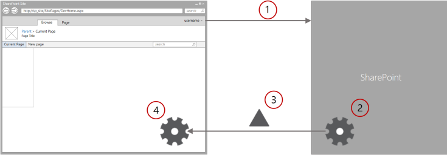

# <a name="minimal-download-strategy-overview"></a>Общие сведения о минимальной загрузки стратегия
Сведения о минимальной загрузки стратегии (MDS), это новая возможность в SharePoint, который сокращает время загрузки страницы при помощи только различия при переходе на новую страницу.
Стратегия минимальной загрузки (MDS) — это новая технология в SharePoint, которое позволяет сократить объем данных, браузер для загрузки при переходе с одной страницы на сайте SharePoint. Когда пользователи просматривают сайте с поддержкой MDS, клиент обрабатывает только различия (или разностного) между текущей страницы и запрошенную страницу. На рисунке 1 показано, что разделы, которые изменяют между страницами и, следовательно, требуют обновления. Дельты обычно включает в себя данные в области (1) контента, а также другие компоненты, такие как элементы управления навигацией (2).
  
    
    


**На рисунке 1. Страница, Обработанная MDS**

  
    
    

  
    
    

  
    
    
Можно определить сайтом с MDS включен, посмотрев URL-адрес. Сайте с поддержкой MDS имеет страницы (3) **_layouts/15/start.aspx** в URL-адрес, а затем знак решетки ( **#** ) и относительный URL-адрес запрошенного ресурса, как показано на рисунке 1. Например, вот MDS отформатированный URL-адрес страницы **newpage.aspx**: **https://sp_site/_layouts/15/start.aspx#/SitePages/newpage.aspx**эквивалентен по следующему URL-формате не MDS: **https://sp_site/SitePages /newpage.aspx**как разработчик, созданные компоненты SharePoint, которые требуются некоторые обновления, прежде чем можно эффективно работать в соответствии с MDS. 
## <a name="enable-mds"></a>Включение MDS
<a name="SP15MDSOverview_Enable"> </a>

С помощью страницы администрирования сайта или SharePoint клиентских объектных моделей, можно включить MDS на вашем сайте.
  
    
    
Чтобы включить MDS по активации компонента на страницах администрирования, выберите пункт **Параметры сайта** > **Управление возможностями сайта** и активация компонента **Стратегия минимальной загрузки**.
  
    
    
Так как он активируется путем изменения свойства  [EnableMinimalDownload](https://msdn.microsoft.com/library/Microsoft.SharePoint.Client.Web.EnableMinimalDownload.aspx) , можно также использовать клиентские API-интерфейсы. Приведенный ниже код показано, как включить MDS с помощью объектной модели JavaScript (JSOM).
  
    
    


```

var clientContext;

clientContext = new SP.ClientContext.get_current();
this.oWebsite = clientContext.get_web();

this.oWebsite.set_enableMinimalDownload(true);
this.oWebsite.update();

clientContext.load(this.oWebsite);

clientContext.executeQueryAsync(
    Function.createDelegate(this, successHandler),
    Function.createDelegate(this, errorHandler)
);

function successHandler() {
    alert("MDS is enabled in this site.");
}

function errorHandler() {
    alert("Request failed: " + arguments[1].get_message());
}
```


## <a name="benefits-of-using-mds"></a>Преимущества использования MDS
<a name="SP15MDSOverview_Benefits"> </a>

С помощью MDS предоставляет несколько преимуществ, включая:
  
    
    

- **Скорость:** Это основной целью MDS. При использовании MDS, браузер не нужно повторно обработать chrome пользовательского интерфейса (UI). MDS сокращаются полезных данных, по сравнению с полной загрузки страницы.
    
  
- **Плавного перехода:** Путем обновления только области, которые изменяют рисовании глаз пользователя к эти области, в отличие от загрузки полной страницы, где всей страницы "мигает." При обновлении всей страницы пользователь должен его обработки полностью определять новые. У пользователей есть легче навигации сайта, который обновляет только области, которые изменено на предыдущей странице.
    
  
- **Элементы управления навигацией браузер:** Другие системы на основе AJAX следует путать кнопки **предыдущей** и **Далее** в браузерах. Поскольку MDS обновляет URL-адрес в окне браузера, кнопки предыдущей и следующей работают так же, как они должны.
    
  
- **Обратной совместимости:** Модуль MDS предоставляет навигации MDS сразу же или определяет, когда нельзя. В случае, где невозможно MDS навигации возникает вместо полной загрузки страницы. Этот процесс называется **отработки отказа** и гарантирует, что все страницы обработку должным образом, независимо от того, является ли они содержат MDS-совместимых компонентов. MDS также работает хорошо в средствах поиска из-за атрибута **href** теги привязки использует регулярные, не являющиеся формате MDS URL-адреса. Вместо этого ядро MDS в клиенте захватывает событие **onclick** и использует для связи с сервером.
    
  

## <a name="mds-architecture"></a>Архитектура MDS
<a name="SP15MDSOverview_Architecture"> </a>

Основной механизм MDS являются очень просто. Основные компоненты MDS, два ядра, один на сервере, а другой в клиенте, которые работают вместе для расчета изменения и отображения страниц в браузере, при переходе пользователя со страницы на страницу на сайте. На рисунке 2 показано поток MDS, когда пользователь переходит к узлу поддержкой MDS.
  
    
    

**На рисунке 2. Поток MDS ВО время перехода пользователя сайта**

  
    
    

  
    
    

  
    
    

  
    
    

1. Браузер запрашивает изменения между текущей страницы и его на сайте SharePoint.
    
  
2. Ядро MDS на сервере вычисляет интервал между текущей и новые страницы.
    
  
3. Модуль MDS на сервере отправляет дельты к ядру MDS в клиенте.
    
  
4. Модуль MDS в клиенте заменяет измененных областей на текущей странице новое содержимое страницы.
    
  
Страница с результатами — именно так, как было бы при страницы загружено без MDS.
  
    
    
Модуль MDS в клиенте включает в себя диспетчер загрузки. Все запросы на странице направляются через диспетчер загрузки. Все элементы управления на странице необходимо подписаться на диспетчер загрузки, чтобы узнать, когда URL-адрес был изменен. Диспетчер загрузки выполняет один запрос для всех новых данных элемента управления. Должны иметь возможность работы в средствах поиска, модуль MDS не использует непосредственно атрибута **href** теги привязки для хранения MDS формат URL-адреса. Вместо этого функция **SPUpdatePage** обрабатывает событие **onclick** и использует его для связи с сервером. Функция **SPUpdatePage** объявляются в файле **_layouts/15/start.js**.
  
    
    
Модуль MDS на сервере отправляет данные обратно клиенту. Эта информация может содержать HTML-код с внедренным скрипты и стили, XML или Нотация объектов JavaScript (JSON).
  
    
    
URL-адрес играет важную роль в MDS. URL-адрес MDS выглядит следующим образом: **https://sp_site/_layouts/15/start.aspx#/SitePages/newpage.aspx**. **Start.aspx** содержит минимальной общего пользовательского интерфейса и инструкции по загрузке изменения страницы. MDS учитывает также часть адреса после знак решетки (#) как конечной страницы. Конечной страницы начинается с косой черты (/) следуют URL-адрес относительно SharePoint веб-сайта. Когда браузер получает URL-адрес, он видит, что не изменилось части слева от знака, поэтому он вызывает событие локальной навигации. Модуль MDS в клиенте захватывает событие локальной навигации и использует его для обновления MDS.
  
    
    
Как упоминалось ранее в этой статье, в некоторых случаях не можно определить, можно ли страницы обновления должным образом. В этих случаях модуль MDS вопросы **перехода на другой ресурс**, состоящий из дополнительных кругового пути для перенаправления браузера с полной версией новой страницы. Далее представлены наиболее распространенные причины, почему переход на другой ресурс:
  
    
    

- На новой странице есть другой главной страницы.
    
  
- Текущей главной страницы, была изменена.
    
  
- Модуль MDS обнаруживает несовместимым HTML, например:
    
  - Страниц с помощью ASP.NET 2.0
    
  
  - CSS или сценарии не зарегистрировано в модуль MDS
    
  
  - Недопустимый HTML
    
  
- Существует несовместимым элементов управления на странице, например:
    
  - Элемент управления не белом MDS модуля.
    
  
  - Элемент управления сборка не помечена как соответствующая требованиям.
    
  
  - Класс элемента управления не имеет атрибут MDS.
    
  
Средство MDS пытается восстановиться обработки отказа после перехода на новую страницу еще одного пользователя.
  
    
    

## <a name="developer-controls"></a>Элементы управления для разработчиков
<a name="SP15MDSOverview_DevControls"> </a>

Благодаря механизм переключения элементов управления эффективной работы ли MDS включен на веб-сайты пользователей. Тем не менее рекомендуется обновить SharePoint элементы управления и компоненты, пользоваться всеми преимуществами MDS. Пользователи получают улучшения работы при MDS спецификации страниц и элементов управления. Хорошо подходят для получения оптимизирован для MDS следующие компоненты:
  
    
    

- Эталонные страницы.
    
  
- Страницы ASP.NET
    
  
- Элементы управления и веб-частей
    
  

## <a name="additional-resources"></a>Дополнительные ресурсы
<a name="bk_addresources"> </a>


-  [EnableMinimalDownload](https://msdn.microsoft.com/library/Microsoft.SharePoint.Client.Web.EnableMinimalDownload.aspx)
    
  
-  [Изменение компонентов SharePoint для MDS](modify-sharepoint-components-for-mds.md)
    
  
-  [Создание сайтов для SharePoint](build-sites-for-sharepoint.md)
    
  

