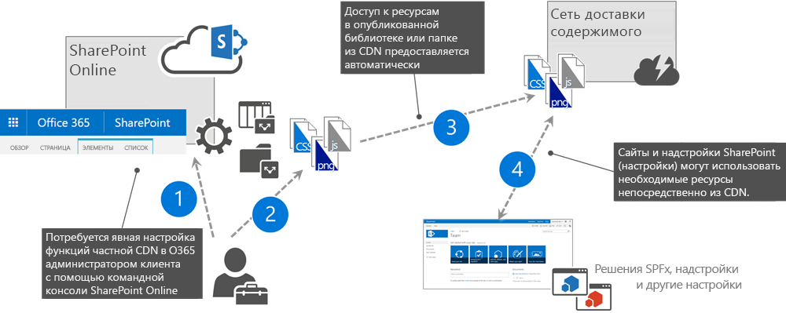
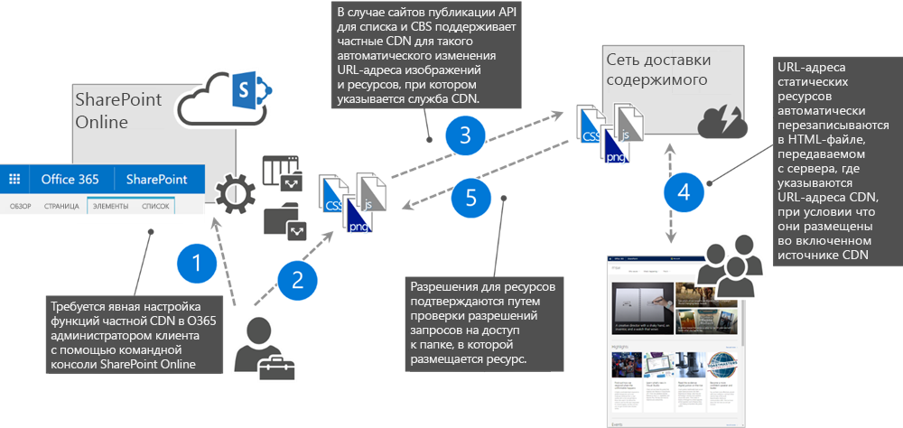

# <a name="use-the-office-365-content-delivery-network-cdn"></a><span data-ttu-id="f2ece-102">Использование сети доставки содержимого (CDN) Office 365</span><span class="sxs-lookup"><span data-stu-id="f2ece-102">Use the Office 365 content delivery network (CDN)</span></span>

<span data-ttu-id="f2ece-103">_**Область применения:** Office 365_.</span><span class="sxs-lookup"><span data-stu-id="f2ece-103">_**Applies to:** Office 365_</span></span>

<span data-ttu-id="f2ece-104">Вы можете размещать статические ресурсы в сети доставки содержимого (CDN) Office 365, чтобы повысить производительность своих страниц SharePoint Online.</span><span class="sxs-lookup"><span data-stu-id="f2ece-104">You can host static assets in the Office 365 content delivery network (CDN) to provide better performance for your SharePoint Online pages.</span></span> <span data-ttu-id="f2ece-105">Статические ресурсы — это файлы, которые редко меняются, например изображения, видео и звуковые файлы, таблицы стилей, шрифты и файлы JavaScript.</span><span class="sxs-lookup"><span data-stu-id="f2ece-105">Static assets are files that don't change very often, like images, video and audio, style sheets, fonts, and JavaScript files.</span></span> <span data-ttu-id="f2ece-106">Сеть CDN работает как географически распределенный прокси-сервер кэширования. Она кэширует статические архивы ближе к браузерам, которые их запрашивают.</span><span class="sxs-lookup"><span data-stu-id="f2ece-106">The CDN works as a geographically distributed caching proxy, by caching static assets closer to the browsers requesting them.</span></span>

## <a name="office-365-cdn-basics"></a><span data-ttu-id="f2ece-107">Основные сведения о сети CDN Office 365</span><span class="sxs-lookup"><span data-stu-id="f2ece-107">Office 365 CDN basics</span></span>

<span data-ttu-id="f2ece-108">Сеть CDN Office 365 входит в состав подписки на SharePoint Online.</span><span class="sxs-lookup"><span data-stu-id="f2ece-108">The Office 365 CDN is included as part of your SharePoint Online subscription.</span></span> <span data-ttu-id="f2ece-109">За нее не нужно доплачивать.</span><span class="sxs-lookup"><span data-stu-id="f2ece-109">You don't have to pay extra for it.</span></span> <span data-ttu-id="f2ece-110">Office 365 поддерживает как открытый, так и закрытый доступ. Кроме того, вы можете размещать статические ресурсы во множестве расположений, или источников.</span><span class="sxs-lookup"><span data-stu-id="f2ece-110">Office 365 provides support for both private and public access and allows you to host static assets in multiple locations, or origins.</span></span> <span data-ttu-id="f2ece-111">Сеть CDN Office 365 — это не то же самое, что Azure CDN.</span><span class="sxs-lookup"><span data-stu-id="f2ece-111">The Office 365 CDN is not the same as the Azure CDN.</span></span> <span data-ttu-id="f2ece-112">Дополнительные сведения о том, зачем использовать сеть CDN, и об общих понятиях, связанных с такими сетями, см. в статье [Сети доставки содержимого](https://support.office.com/ru-RU/article/Content-delivery-networks-0140f704-6614-49bb-aa6c-89b75dcd7f1f).</span><span class="sxs-lookup"><span data-stu-id="f2ece-112">If you need more information about why to use a CDN or about general CDN concepts, see [Content delivery networks](https://support.office.com/ru-RU/article/Content-delivery-networks-0140f704-6614-49bb-aa6c-89b75dcd7f1f).</span></span>

## <a name="office-365-cdn-types"></a><span data-ttu-id="f2ece-113">Типы сетей CDN Office 365</span><span class="sxs-lookup"><span data-stu-id="f2ece-113">Office 365 CDN types</span></span>

<span data-ttu-id="f2ece-114">В Office 365 доступно два типа сетей CDN: частные и общедоступные.</span><span class="sxs-lookup"><span data-stu-id="f2ece-114">Office 365 offers you two types of CDNs: Public and Private.</span></span> <span data-ttu-id="f2ece-115">Оба варианта повышают производительность, но у каждого есть свои уникальные атрибуты и преимущества.</span><span class="sxs-lookup"><span data-stu-id="f2ece-115">Both options provide performance improvements, but each has unique attributes and advantages.</span></span>

### <a name="office-365-public-cdn"></a><span data-ttu-id="f2ece-116">Общедоступная сеть CDN Office 365</span><span class="sxs-lookup"><span data-stu-id="f2ece-116">Office 365 Public CDN</span></span>



1. <span data-ttu-id="f2ece-118">Администратор включает общедоступную сеть CDN Office 365 для клиента.</span><span class="sxs-lookup"><span data-stu-id="f2ece-118">Administrator enables Office 365 Public CDN for the tenant.</span></span>
1. <span data-ttu-id="f2ece-119">Статические ресурсы, предоставляемые из сети CDN, отправляются в библиотеки SharePoint, включенные в качестве общедоступных источников CDN.</span><span class="sxs-lookup"><span data-stu-id="f2ece-119">Static assets to be shared from CDN are uploaded to SharePoint libraries, which are enabled as Public CDN origins.</span></span>
1. <span data-ttu-id="f2ece-120">Ресурсы из настроенных библиотек и папок передаются в службу CDN.</span><span class="sxs-lookup"><span data-stu-id="f2ece-120">Assets from the configured libraries and folders are propagated to the CDN service.</span></span>
1. <span data-ttu-id="f2ece-121">URL-адреса, указывающие на расположение сети CDN, доступны для использования на сайтах SharePoint и в модификациях, работающих на страницах SharePoint.</span><span class="sxs-lookup"><span data-stu-id="f2ece-121">URLs pointing to CDN location are available to be used in the SharePoint sites and in customizations running on SharePoint pages.</span></span>

> [!NOTE]
> <span data-ttu-id="f2ece-122">Никогда не следует помещать конфиденциальные ресурсы организации в библиотеку документов, настроенную в качестве общедоступного источника CDN.</span><span class="sxs-lookup"><span data-stu-id="f2ece-122">You should never place resources that are considered sensitive to your organization in a Document library configured as a Public CDN origin.</span></span>

#### <a name="office-365-public-cdn-attributes-and-advantages"></a><span data-ttu-id="f2ece-123">Атрибуты и преимущества общедоступной сети CDN Office 365</span><span class="sxs-lookup"><span data-stu-id="f2ece-123">Office 365 Public CDN attributes and advantages</span></span>

- <span data-ttu-id="f2ece-124">Ресурсы, предоставляемые из общедоступного источника, доступны всем анонимно.</span><span class="sxs-lookup"><span data-stu-id="f2ece-124">Assets exposed in a public origin are accessible by everyone anonymously.</span></span>
- <span data-ttu-id="f2ece-125">Если удалить ресурс из общедоступного источника, он может оставаться доступным в кэше до 30 дней. Однако ссылки на ресурс в сети CDN станут недействительными в течение 15 минут.</span><span class="sxs-lookup"><span data-stu-id="f2ece-125">If you remove an asset from a public origin, the asset may continue to be available for up to 30 days from the cache; however, we will invalidate links to the asset in the CDN within 15 minutes.</span></span>
- <span data-ttu-id="f2ece-126">При размещении таблиц стилей (CSS-файлов) в общедоступном источнике можно использовать в коде относительные пути и URI.</span><span class="sxs-lookup"><span data-stu-id="f2ece-126">When you host style sheets (CSS files) in a public origin, you can use relative paths and URIs within the code.</span></span> <span data-ttu-id="f2ece-127">Это означает, что вы можете ссылаться на расположение фоновых изображений и других объектов относительно расположения ресурса, который вызывает его.</span><span class="sxs-lookup"><span data-stu-id="f2ece-127">This means that you can reference the location of background images and other objects relative to the location of the asset that's calling it.</span></span>
- <span data-ttu-id="f2ece-128">Вы можете жестко задать URL-адрес общедоступного источника, но это не рекомендуется.</span><span class="sxs-lookup"><span data-stu-id="f2ece-128">While you can hard code a public origin's URL, doing so is not recommended.</span></span> <span data-ttu-id="f2ece-129">Это связано с тем, что если сеть CDN станет недоступна, то URL-адрес не будет автоматически указывать на вашу организацию в SharePoint Online, что может привести к неработоспособности ссылок и другим ошибкам.</span><span class="sxs-lookup"><span data-stu-id="f2ece-129">The reason for this is that if access to the CDN becomes unavailable, the URL will not automatically resolve to your organization in SharePoint Online and might result in broken links and other errors.</span></span> <span data-ttu-id="f2ece-130">Следовательно, рекомендуем использовать URL-адреса SharePoint, чтобы среда SharePoint автоматически заменяла их на URL-адрес общедоступной сети CDN, если она включена.</span><span class="sxs-lookup"><span data-stu-id="f2ece-130">The recommendation is therefore to use SharePoint URLs and have SharePoint automatically rewrite the URL to the public CDN URL when it's enabled.</span></span>
- <span data-ttu-id="f2ece-131">По умолчанию для общедоступных источников включены типы файлов CSS, EOT, GIF, ICO, JPEG, JPG, JS, MAP, PNG, SVG, TTF и WOFF.</span><span class="sxs-lookup"><span data-stu-id="f2ece-131">The default file types that are included for public origins are .css, .eot, .gif, .ico, .jpeg, .jpg, .js, .map, .png, .svg, .ttf, and .woff.</span></span> <span data-ttu-id="f2ece-132">Вы можете указывать дополнительные типы файлов, меняя [конфигурацию сети CDN](https://docs.microsoft.com/en-us/powershell/module/sharepoint-online/set-spotenantcdnpolicy?view=sharepoint-ps).</span><span class="sxs-lookup"><span data-stu-id="f2ece-132">You can specify additional file types by changing the CDN's configuration.</span></span>
- <span data-ttu-id="f2ece-133">При желании вы можете настроить политику, которая исключает ресурсы, определенные в заданных вами классификациях сайтов.</span><span class="sxs-lookup"><span data-stu-id="f2ece-133">If you want, you can configure a policy to exclude assets that have been identified by site classifications that you specify.</span></span> <span data-ttu-id="f2ece-134">Например, вы можете исключать все ресурсы, отмеченные как "конфиденциальные" или "с ограниченным доступом", даже если они относятся к разрешенным типам файлов и находятся в общедоступном источнике.</span><span class="sxs-lookup"><span data-stu-id="f2ece-134">For example, you can choose to exclude all assets that are marked as "confidential" or "restricted" even if they are an allowed file type and are located in a public origin.</span></span>

### <a name="office-365-private-cdn"></a><span data-ttu-id="f2ece-135">Частная сеть CDN Office 365</span><span class="sxs-lookup"><span data-stu-id="f2ece-135">Office 365 Private CDN</span></span>



1. <span data-ttu-id="f2ece-137">Администратор включает частную сеть CDN Office 365 для клиента.</span><span class="sxs-lookup"><span data-stu-id="f2ece-137">Administrator enables Office 365 Private CDN for the tenant</span></span>
1. <span data-ttu-id="f2ece-138">Статические ресурсы, предоставляемые из сети CDN, отправляются в библиотеки SharePoint, включенные в качестве частных источников CDN.</span><span class="sxs-lookup"><span data-stu-id="f2ece-138">Static assets to be shared from CDN are uploaded to SharePoint libraries, which are enabled as Private CDN origins</span></span>
1. <span data-ttu-id="f2ece-139">Ресурсы из назначенных частных источников CDN передаются в службу CDN.</span><span class="sxs-lookup"><span data-stu-id="f2ece-139">Assets from the designated Private CDN Origins are distributed to the CDN service</span></span>
1. <span data-ttu-id="f2ece-140">Когда пользователи запрашивают страницы с использованием ресурсов, хранящихся в каком-либо из источников CDN, SharePoint автоматически меняет адрес, чтобы он указывал на сеть CDN, а ресурсы предоставлялись из нее.</span><span class="sxs-lookup"><span data-stu-id="f2ece-140">When users request pages using assets stored in any of the CDN origins, SharePoint automatically rewrites the assets' URL to the CDN URL, so that these assets are served from the CDN</span></span>
1. <span data-ttu-id="f2ece-141">Во время замены URL-адреса для ресурсов, предоставляемых из сети CDN, должна быть опубликована основная версия, а у пользователей должны быть разрешения на доступ к этим ресурсам.</span><span class="sxs-lookup"><span data-stu-id="f2ece-141">Assets being served from the CDN must have a major version published and users must have permissions to access these assets, when URL rewriting happens</span></span>

#### <a name="office-365-private-cdn-attributes-and-advantages"></a><span data-ttu-id="f2ece-142">Атрибуты и преимущества частной сети CDN Office 365</span><span class="sxs-lookup"><span data-stu-id="f2ece-142">Office 365 Private CDN attributes and advantages</span></span>

- <span data-ttu-id="f2ece-143">Ресурсы из частного источника доступны только тем пользователям, у которых есть соответствующие разрешения.</span><span class="sxs-lookup"><span data-stu-id="f2ece-143">Users can only access the assets from a private origin if they are authorized to do so.</span></span> <span data-ttu-id="f2ece-144">Анонимный доступ к таким ресурсам запрещен.</span><span class="sxs-lookup"><span data-stu-id="f2ece-144">Anonymous access to these assets is prevented.</span></span>
- <span data-ttu-id="f2ece-145">Если удалить ресурс из частного источника, он может оставаться доступным в кэше до одного часа. Однако ссылки на ресурс в сети CDN станут недействительными в течение 15 минут.</span><span class="sxs-lookup"><span data-stu-id="f2ece-145">If you remove an asset from the private origin, the asset may continue to be available for up to an hour from the cache; however, we will invalidate links to the asset in the CDN within 15 minutes.</span></span>
- <span data-ttu-id="f2ece-146">По умолчанию для частных источников включены типы файлов GIF, ICO, JPEG, JPG, JS и PNG.</span><span class="sxs-lookup"><span data-stu-id="f2ece-146">The default file types that are included for private origins are .gif, .ico, .jpeg, .jpg, .js, and .png.</span></span> <span data-ttu-id="f2ece-147">Вы можете указывать дополнительные типы файлов, меняя [конфигурацию сети CDN](https://docs.microsoft.com/en-us/powershell/module/sharepoint-online/set-spotenantcdnpolicy?view=sharepoint-ps).</span><span class="sxs-lookup"><span data-stu-id="f2ece-147">You can specify additional file types by changing the CDN's configuration.</span></span>
- <span data-ttu-id="f2ece-148">Как в случае общедоступных источников, вы можете настроить политику, исключающую ресурсы, которые определены в заданных вами классификациях сайтов, даже если вы используете подстановочные знаки, чтобы включить все ресурсы в папке или библиотеке сайта.</span><span class="sxs-lookup"><span data-stu-id="f2ece-148">Just like public origins, you can configure a policy to exclude assets that have been identified by site classifications that you specify even if you use wildcards to include all assets within a folder or Site Library.</span></span>

### <a name="publishing-feature-auto-rewriting-to-cdn-urls"></a><span data-ttu-id="f2ece-149">Автоматическая замена URL-адресов на URL-адреса CDN, которую выполняет функция публикации</span><span class="sxs-lookup"><span data-stu-id="f2ece-149">Publishing Feature Auto-Rewriting to CDN URLs</span></span>

<span data-ttu-id="f2ece-150">Чтобы помочь организациям пользоваться возможностями сетей CDN Office 365, не обновляя имеющиеся порталы, мы обновили функцию публикации в SharePoint, чтобы автоматически заменять URL-адреса ресурсов, хранящихся в источниках CDN, на их эквиваленты в сети CDN, чтобы ресурсы предоставлялись из службы CDN, а не из SharePoint.</span><span class="sxs-lookup"><span data-stu-id="f2ece-150">To help organizations take advantage of the Office 365 CDN capabilities without having to update their existing portals, the SharePoint Publishing feature has been updated to automatically rewrite URLs of assets stored in CDN origins to their CDN equivalents so that assets are served from the CDN service instead of SharePoint.</span></span>

<span data-ttu-id="f2ece-151">Ниже представлен обзор ссылок, которые автоматически заменяет функция публикации в SharePoint.</span><span class="sxs-lookup"><span data-stu-id="f2ece-151">Following is an overview of which links are automatically rewritten by the SharePoint Publishing feature:</span></span>

- <span data-ttu-id="f2ece-152">URL-адреса IMG-, LINK- и CSS-файлов в HTML-откликах классической страницы публикации.</span><span class="sxs-lookup"><span data-stu-id="f2ece-152">IMG/LINK/CSS URLs in classic publishing page HTML response</span></span>
  - <span data-ttu-id="f2ece-153">Это относится и к изображениям, добавленным авторами в HTML-содержимом страницы.</span><span class="sxs-lookup"><span data-stu-id="f2ece-153">This includes images added by authors in the HTML content of a page</span></span>
  - <span data-ttu-id="f2ece-154">Расширяя страницы, вы можете временно отключать автоматическую замену URL-адресов на странице. Для этого сделайте следующее:</span><span class="sxs-lookup"><span data-stu-id="f2ece-154">When extending pages, you can temporarily disable auto-rewriting URLs on a page by:</span></span>
    - <span data-ttu-id="f2ece-155">извлеките страницу;</span><span class="sxs-lookup"><span data-stu-id="f2ece-155">checking out the page</span></span>
    - <span data-ttu-id="f2ece-156">укажите параметр `?NoAutoReWrites=true` строки запроса.</span><span class="sxs-lookup"><span data-stu-id="f2ece-156">providing the query string parameter `?NoAutoReWrites=true`</span></span>
- <span data-ttu-id="f2ece-157">Ресурсы веб-части "Контент по поиску".</span><span class="sxs-lookup"><span data-stu-id="f2ece-157">Content By Search WebPart assets</span></span>
  - <span data-ttu-id="f2ece-158">Файлы JavaScript шаблонов отображения.</span><span class="sxs-lookup"><span data-stu-id="f2ece-158">Display Templates JavaScript files</span></span>
  - <span data-ttu-id="f2ece-159">Изображения в результатах запросов. Автоматически заменяются URL-адреса в следующих стандартных управляемых свойствах: _PictureUrl_, _PictureThumbnailUrl_, _PublishingImage_.</span><span class="sxs-lookup"><span data-stu-id="f2ece-159">Images in Query Results - URLs in the following standard Managed Properties are automatically replaced: _PictureUrl_, _PictureThumbnailUrl_, _PublishingImage_</span></span>
- <span data-ttu-id="f2ece-160">URL-адреса изображений в веб-части "Слайд-шоу библиотеки рисунков".</span><span class="sxs-lookup"><span data-stu-id="f2ece-160">Picture Library SlideShow web part image URLs</span></span>
- <span data-ttu-id="f2ece-161">Поля изображений в результатах работы REST API SPList (RenderListDataAsStream).</span><span class="sxs-lookup"><span data-stu-id="f2ece-161">Image fields in SPList REST API (RenderListDataAsStream) results</span></span>
  - <span data-ttu-id="f2ece-162">Используйте новое свойство ImageFieldsToTryRewriteToCdnUrls, чтобы создать разделенный запятыми список полей.</span><span class="sxs-lookup"><span data-stu-id="f2ece-162">Use the new property ImageFieldsToTryRewriteToCdnUrls to provide a comma separated list of Fields.</span></span>
  - <span data-ttu-id="f2ece-163">Поддерживаются поля Hyperlink (Picture или Link) и PublishingImage.</span><span class="sxs-lookup"><span data-stu-id="f2ece-163">Supports Hyperlink Fields (Picture or Link) and PublishingImage Fields.</span></span>
- <span data-ttu-id="f2ece-164">Редакции изображений в SharePoint.</span><span class="sxs-lookup"><span data-stu-id="f2ece-164">SharePoint Image renditions</span></span>

## <a name="set-up-and-configure-the-office-365-cdn"></a><span data-ttu-id="f2ece-165">Установка и настройка сети CDN Office 365</span><span class="sxs-lookup"><span data-stu-id="f2ece-165">Set up and configure the Office 365 CDN</span></span>

<span data-ttu-id="f2ece-166">Вы можете установить и настроить сеть CDN Office 365 в своем клиенте с помощью командной консоли SharePoint Online или интерфейса командной строки Office 365.</span><span class="sxs-lookup"><span data-stu-id="f2ece-166">You can set up and configure the Office 365 CDN in your tenant using the SharePoint Online Management Shell or the Office 365 CLI.</span></span>

### <a name="set-up-and-configure-the-office-365-cdn-using-the-sharepoint-online-management-shell"></a><span data-ttu-id="f2ece-167">Установка и настройка сети CDN Office 365 с помощью командной консоли SharePoint Online</span><span class="sxs-lookup"><span data-stu-id="f2ece-167">Set up and configure the Office 365 CDN using the SharePoint Online Management Shell</span></span>

> [!NOTE]
> <span data-ttu-id="f2ece-168">Чтобы управлять каталогами приложений в клиенте, установите [командную консоль SharePoint Online](https://www.microsoft.com/en-us/download/details.aspx?id=35588).</span><span class="sxs-lookup"><span data-stu-id="f2ece-168">Before you can manage site collection app catalogs in your tenant, ensure that you have installed [SharePoint Online Management Shell](https://www.microsoft.com/en-us/download/details.aspx?id=35588).</span></span> <span data-ttu-id="f2ece-169">Затем подключитесь к клиенту SharePoint Online с помощью командлета `Connect-SPOService`.</span><span class="sxs-lookup"><span data-stu-id="f2ece-169">Next, connect to your SharePoint Online tenant using the `Connect-SPOService` cmdlet.</span></span>

#### <a name="enable-office-365-cdn"></a><span data-ttu-id="f2ece-170">Включение сети CDN Office 365</span><span class="sxs-lookup"><span data-stu-id="f2ece-170">Enable Office 365 CDN</span></span>

<span data-ttu-id="f2ece-171">Вы можете управлять состоянием сети CDN Office 365 в клиенте с помощью командлета [Set-SPOTenantCdnEnabled](https://docs.microsoft.com/en-us/powershell/module/sharepoint-online/set-spotenantcdnenabled?view=sharepoint-ps).</span><span class="sxs-lookup"><span data-stu-id="f2ece-171">You can manage the state of the Office 365 CDN in your tenant using the [Set-SPOTenantCdnEnabled](https://docs.microsoft.com/en-us/powershell/module/sharepoint-online/set-spotenantcdnenabled?view=sharepoint-ps) cmdlet.</span></span>

<span data-ttu-id="f2ece-172">Чтобы включить в клиенте общедоступную сеть CDN Office 365, выполните следующую команду:</span><span class="sxs-lookup"><span data-stu-id="f2ece-172">To enable the Office 365 Public CDN in your tenant execute:</span></span>

```powershell
Set-SPOTenantCdnEnabled -CdnType Public -Enable $true
```

<span data-ttu-id="f2ece-173">Чтобы включить частную сеть CDN Office 365, выполните следующую команду:</span><span class="sxs-lookup"><span data-stu-id="f2ece-173">To enable the Office 365 Private CDN, execute:</span></span>

```powershell
Set-SPOTenantCdnEnabled -CdnType Private -Enable $true
```

<span data-ttu-id="f2ece-174">Кроме того, если вы хотите использовать сети CDN обоих типов, их можно включить с помощью следующей команды:</span><span class="sxs-lookup"><span data-stu-id="f2ece-174">Alternatively, if you want to use both CDN types, you can enable them using:</span></span>

```powershell
Set-SPOTenantCdnEnabled -CdnType Both -Enable $true
```

<span data-ttu-id="f2ece-175">Если вы не хотите использовать стандартные источники CDN, добавьте параметр `-NoDefaultOrigins`:</span><span class="sxs-lookup"><span data-stu-id="f2ece-175">If you don't want to use the standard CDN origins, add the `-NoDefaultOrigins` parameter:</span></span>

```powershell
Set-SPOTenantCdnEnabled -CdnType Both -Enable $true -NoDefaultOrigins
```

#### <a name="view-the-current-status-of-the-office-365-cdn"></a><span data-ttu-id="f2ece-176">Просмотр текущего состояния сети CDN Office 365</span><span class="sxs-lookup"><span data-stu-id="f2ece-176">View the current status of the Office 365 CDN</span></span>

<span data-ttu-id="f2ece-177">Чтобы проверить, включена ли сеть CDN Office 365 определенного типа, используйте командлет [Get-SPOTenantCdnEnabled](https://docs.microsoft.com/en-us/powershell/module/sharepoint-online/get-spotenantcdnenabled?view=sharepoint-ps).</span><span class="sxs-lookup"><span data-stu-id="f2ece-177">To check, if the particular type of Office 365 CDN is enabled or disabled, use the [Get-SPOTenantCdnEnabled](https://docs.microsoft.com/en-us/powershell/module/sharepoint-online/get-spotenantcdnenabled?view=sharepoint-ps) cmdlet.</span></span>

<span data-ttu-id="f2ece-178">Чтобы проверить, включена ли общедоступная сеть CDN Office 365, выполните следующую команду:</span><span class="sxs-lookup"><span data-stu-id="f2ece-178">To check if the Office 365 Public CDN is enabled, execute:</span></span>

```powershell
Get-SPOTenantCdnEnabled -CdnType Public
```

#### <a name="view-office-365-cdn-origins"></a><span data-ttu-id="f2ece-179">Просмотр источников CDN Office 365</span><span class="sxs-lookup"><span data-stu-id="f2ece-179">View Office 365 CDN origins</span></span>

<span data-ttu-id="f2ece-180">Чтобы просмотреть список настроенных в данный момент общедоступных источников CDN Office 365, выполните следующую команду:</span><span class="sxs-lookup"><span data-stu-id="f2ece-180">To view the currently configured Office 365 Public CDN origins execute:</span></span>

```powershell
Get-SPOTenantCdnOrigins -CdnType Public
```

#### <a name="add-office-365-cdn-origin"></a><span data-ttu-id="f2ece-181">Добавление источника сети CDN Office 365</span><span class="sxs-lookup"><span data-stu-id="f2ece-181">Add Office 365 CDN origin</span></span>

> [!NOTE]
> <span data-ttu-id="f2ece-182">Никогда не следует помещать конфиденциальные ресурсы организации в библиотеку документов SharePoint, настроенную в качестве общедоступного источника CDN.</span><span class="sxs-lookup"><span data-stu-id="f2ece-182">You should never place resources that are considered sensitive to your organization in a SharePoint Document library configured as a Public CDN origin</span></span>

<span data-ttu-id="f2ece-183">Чтобы определить источник CDN, используйте командлет [Add-SPOTenantCdnOrigin](https://docs.microsoft.com/en-us/powershell/module/sharepoint-online/add-spotenantcdnorigin?view=sharepoint-ps).</span><span class="sxs-lookup"><span data-stu-id="f2ece-183">Use the [Add-SPOTenantCdnOrigin](https://docs.microsoft.com/en-us/powershell/module/sharepoint-online/add-spotenantcdnorigin?view=sharepoint-ps) cmdlet to define a CDN origin.</span></span> <span data-ttu-id="f2ece-184">Вы можете определить несколько источников.</span><span class="sxs-lookup"><span data-stu-id="f2ece-184">You can define multiple origins.</span></span> <span data-ttu-id="f2ece-185">Источник — это URL-адрес, указывающий на библиотеку или папку в SharePoint, содержащую ресурсы, которые требуется размещать в сети CDN.</span><span class="sxs-lookup"><span data-stu-id="f2ece-185">The origin is a URL that points to a SharePoint library or folder that contains the assets that you want to be hosted by the CDN.</span></span>

```powershell
Add-SPOTenantCdnOrigin -CdnType <Public | Private> -OriginUrl <path>
```

<span data-ttu-id="f2ece-186">`path` — это путь к папке, содержащей ресурсы.</span><span class="sxs-lookup"><span data-stu-id="f2ece-186">Where `path` is the path to the folder that contains the assets.</span></span> <span data-ttu-id="f2ece-187">Помимо относительных путей, можно использовать подстановочные знаки.</span><span class="sxs-lookup"><span data-stu-id="f2ece-187">You can use wildcards in addition to relative paths.</span></span>

<span data-ttu-id="f2ece-188">Чтобы включить все ресурсы в коллекции эталонных страниц на всех сайтах в качестве общедоступного источника CDN, выполните следующую команду:</span><span class="sxs-lookup"><span data-stu-id="f2ece-188">To include all assets in the Master Page Gallery of all sites as a public CDN origin, execute:</span></span>

```powershell
Add-SPOTenantCdnOrigin -CdnType Public -OriginUrl */masterpage
```

<span data-ttu-id="f2ece-189">Чтобы настроить частный источник для определенного семейства веб-сайтов, выполните следующую команду:</span><span class="sxs-lookup"><span data-stu-id="f2ece-189">To configure a private origin for a specific site collection, execute:</span></span>

```powershell
Add-SPOTenantCdnOrigin -CdnType Private -OriginUrl sites/site1/siteassets
```

> [!NOTE]
> <span data-ttu-id="f2ece-190">После добавления источника CDN может понадобиться до 15 минут, чтобы получить файлы через службу CDN.</span><span class="sxs-lookup"><span data-stu-id="f2ece-190">After adding a CDN origin, it might take up to 15 minutes for you to be able to retrieve files via the CDN service.</span></span> <span data-ttu-id="f2ece-191">Вы можете проверить, включен ли тот или иной источник, с помощью командлета [Get-SPOTenantCdnOrigins](https://docs.microsoft.com/en-us/powershell/module/sharepoint-online/get-spotenantcdnorigins?view=sharepoint-ps).</span><span class="sxs-lookup"><span data-stu-id="f2ece-191">You can verify, if the particular origin has already been enabled using the [Get-SPOTenantCdnOrigins](https://docs.microsoft.com/en-us/powershell/module/sharepoint-online/get-spotenantcdnorigins?view=sharepoint-ps) cmdlet.</span></span>

#### <a name="remove-office-365-cdn-origin"></a><span data-ttu-id="f2ece-192">Удаление источника CDN Office 365</span><span class="sxs-lookup"><span data-stu-id="f2ece-192">Remove Office 365 CDN origin</span></span>

<span data-ttu-id="f2ece-193">Чтобы удалить источник CDN для указанного типа CDN, используйте командлет [Remove-SPOTenantCdnOrigin](https://docs.microsoft.com/en-us/powershell/module/sharepoint-online/remove-spotenantcdnorigin?view=sharepoint-ps).</span><span class="sxs-lookup"><span data-stu-id="f2ece-193">Use the [Remove-SPOTenantCdnOrigin](https://docs.microsoft.com/en-us/powershell/module/sharepoint-online/remove-spotenantcdnorigin?view=sharepoint-ps) cmdlet to remove a CDN origin for the specified CDN type.</span></span>

<span data-ttu-id="f2ece-194">Чтобы удалить источник из конфигурации частной сети CDN, выполните следующую команду:</span><span class="sxs-lookup"><span data-stu-id="f2ece-194">To remove an origin from the Public CDN configuration, execute:</span></span>

```powershell
Remove-SPOTenantCdnOrigin -CdnType Public -OriginUrl */masterpage
```

> [!NOTE]
> <span data-ttu-id="f2ece-195">Удаление источника CDN не влияет на файлы, хранящиеся в какой-либо библиотеке документов, соответствующей этому источнику.</span><span class="sxs-lookup"><span data-stu-id="f2ece-195">Removing a CDN origin doesn't affect the files stored in any Document library matching that origin.</span></span> <span data-ttu-id="f2ece-196">Если на эти ресурсы ссылались по их URL-адресу в SharePoint, то среда SharePoint автоматически вернется к исходному URL-адресу, указывающему на библиотеку документов.</span><span class="sxs-lookup"><span data-stu-id="f2ece-196">If these assets have been referenced using their SharePoint URL, SharePoint will automatically switch back to the original URL pointing to the Document library.</span></span> <span data-ttu-id="f2ece-197">Но если на ресурсы ссылались по URL-адресу общедоступной сети CDN, то эти ссылки станут неработоспособными, и их потребуется изменить вручную.</span><span class="sxs-lookup"><span data-stu-id="f2ece-197">If however, assets have been referenced using the Public CDN URL, then these links will be now broken and will need to be manually changed.</span></span>

#### <a name="modify-office-365-cdn-origin"></a><span data-ttu-id="f2ece-198">Изменение источника CDN Office 365</span><span class="sxs-lookup"><span data-stu-id="f2ece-198">Modify Office 365 CDN origin</span></span>

<span data-ttu-id="f2ece-199">Изменить имеющийся источник CDN невозможно.</span><span class="sxs-lookup"><span data-stu-id="f2ece-199">It's not possible to modify an existing CDN origin.</span></span> <span data-ttu-id="f2ece-200">Вместо этого следует удалить определенный ранее источник CDN с помощью командлета `Remove-SPOTenantCdnOrigin` и добавить новый с помощью командлета `Add-SPOTenantCdnOrigin`.</span><span class="sxs-lookup"><span data-stu-id="f2ece-200">Instead, you should remove the previously defined CDN origin using the `Remove-SPOTenantCdnOrigin` cmdlet and add a new one using the `Add-SPOTenantCdnOrigin` cmdlet.</span></span>

#### <a name="change-the-types-of-files-to-include-in-office-365-cdn"></a><span data-ttu-id="f2ece-201">Изменение типов файлов, включаемых в сеть CDN Office 365</span><span class="sxs-lookup"><span data-stu-id="f2ece-201">Change the types of files to include in Office 365 CDN</span></span>

<span data-ttu-id="f2ece-202">По умолчанию для общедоступной сети CDN включены следующие типы файлов: _CSS, EOT, GIF, ICO, JPEG, JPG, JS, MAP, PNG, SVG, TTF и WOFF_.</span><span class="sxs-lookup"><span data-stu-id="f2ece-202">By default, the following file types are included in the Public CDN: _.css, .eot, .gif, .ico, .jpeg, .jpg, .js, .map, .png, .svg, .ttf, and .woff_.</span></span> <span data-ttu-id="f2ece-203">Если требуется включить в сеть CDN дополнительные типы файлов, вы можете изменить конфигурацию CDN с помощью командлета [Set-SPOTenantCdnPolicy](https://docs.microsoft.com/en-us/powershell/module/sharepoint-online/set-spotenantcdnpolicy?view=sharepoint-ps).</span><span class="sxs-lookup"><span data-stu-id="f2ece-203">If you need to include additional file types in the CDN, you can change the CDN configuration using the [Set-SPOTenantCdnPolicy](https://docs.microsoft.com/en-us/powershell/module/sharepoint-online/set-spotenantcdnpolicy?view=sharepoint-ps) cmdlet.</span></span>

> [!NOTE]
> <span data-ttu-id="f2ece-204">При изменении списка типов файлов перезаписывается текущий список.</span><span class="sxs-lookup"><span data-stu-id="f2ece-204">When changing the list of file types, you overwrite the currently defined list.</span></span> <span data-ttu-id="f2ece-205">Если требуется включить дополнительные типы файлов, сперва используйте командлет [Get-SPOTenantCdnPolicies](https://docs.microsoft.com/en-us/powershell/module/sharepoint-online/get-spotenantcdnpolicies?view=sharepoint-ps), чтобы узнать, какие типы файлов настроены в текущий момент.</span><span class="sxs-lookup"><span data-stu-id="f2ece-205">If you want to include additional file types, use the [Get-SPOTenantCdnPolicies](https://docs.microsoft.com/en-us/powershell/module/sharepoint-online/get-spotenantcdnpolicies?view=sharepoint-ps) cmdlet, to find out which file types are currently configured.</span></span>

<span data-ttu-id="f2ece-206">Чтобы добавить тип файла _JSON_ в стандартный список типов файлов, включенных в сеть CDN, выполните следующую команду:</span><span class="sxs-lookup"><span data-stu-id="f2ece-206">To add the _JSON_ file type to the default list of file types included in the Public CDN, execute:</span></span>

```powershell
Set-SPOTenantCdnPolicy -CdnType Public -PolicyType IncludeFileExtensions -PolicyValue "CSS,EOT,GIF,ICO,JPEG,JPG,JS,MAP,PNG,SVG,TTF,WOFF,JSON"
```

#### <a name="change-the-list-of-site-classifications-you-want-to-exclude-from-the-office-365-cdn"></a><span data-ttu-id="f2ece-207">Изменение списка классификаций сайтов, которые требуется исключить из сети CDN Office 365</span><span class="sxs-lookup"><span data-stu-id="f2ece-207">Change the list of site classifications you want to exclude from the Office 365 CDN</span></span>

<span data-ttu-id="f2ece-208">Чтобы исключить классификации сайтов, которые не должны быть доступны в сети CDN, используйте командлет [Set-SPOTenantCdnPolicy](https://docs.microsoft.com/en-us/powershell/module/sharepoint-online/set-spotenantcdnpolicy?view=sharepoint-ps).</span><span class="sxs-lookup"><span data-stu-id="f2ece-208">Use the [Set-SPOTenantCdnPolicy](https://docs.microsoft.com/en-us/powershell/module/sharepoint-online/set-spotenantcdnpolicy?view=sharepoint-ps) cmdlet to exclude site classifications that you do not want to make available over the CDN.</span></span> <span data-ttu-id="f2ece-209">По умолчанию не исключаются никакие классификации сайтов.</span><span class="sxs-lookup"><span data-stu-id="f2ece-209">By default, no site classifications are excluded.</span></span>

> [!NOTE]
> <span data-ttu-id="f2ece-210">При изменении списка исключаемых классификаций сайтов перезаписывается текущий список.</span><span class="sxs-lookup"><span data-stu-id="f2ece-210">When changing the list of excluded site classifications, you overwrite the currently defined list.</span></span> <span data-ttu-id="f2ece-211">Если требуется включить дополнительные классификации сайтов, сперва используйте командлет [Get-SPOTenantCdnPolicies](https://docs.microsoft.com/en-us/powershell/module/sharepoint-online/get-spotenantcdnpolicies?view=sharepoint-ps), чтобы узнать, какие классификации сайтов настроены в текущий момент.</span><span class="sxs-lookup"><span data-stu-id="f2ece-211">If you want to exclude additional classifications, use the [Get-SPOTenantCdnPolicies](https://docs.microsoft.com/en-us/powershell/module/sharepoint-online/get-spotenantcdnpolicies?view=sharepoint-ps) cmdlet, to find out which classifications are currently configured.</span></span>

<span data-ttu-id="f2ece-212">Чтобы исключить сайты, классифицируемые как _HBI_, из частной сети CDN, выполните следующую команду:</span><span class="sxs-lookup"><span data-stu-id="f2ece-212">To exclude sites classified as _HBI_ from the Public CDN, execute</span></span>

```powershell
Set-SPOTenantCdnPolicy -CdnType Public -PolicyType ExcludeRestrictedSiteClassifications -PolicyValue "HBI"
```

#### <a name="disable-office-365-cdn"></a><span data-ttu-id="f2ece-213">Отключение сети CDN Office 365</span><span class="sxs-lookup"><span data-stu-id="f2ece-213">Disable Office 365 CDN</span></span>

<span data-ttu-id="f2ece-214">Чтобы отключить сеть CDN Office 365, используйте командлет `Set-SPOTenantCdnEnabled`. Пример:</span><span class="sxs-lookup"><span data-stu-id="f2ece-214">To disable the Office 365 CDN use the `Set-SPOTenantCdnEnabled` cmdlet, for example:</span></span>

```powershell
Set-SPOTenantCdnEnabled -CdnType Public -Enable $false
```

### <a name="set-up-and-configure-the-office-365-cdn-using-the-office-365-cli"></a><span data-ttu-id="f2ece-215">Установка и настройка сети CDN Office 365 с помощью интерфейса командной строки Office 365:</span><span class="sxs-lookup"><span data-stu-id="f2ece-215">Set up and configure the Office 365 CDN using the Office 365 CLI</span></span>

> [!NOTE]
> <span data-ttu-id="f2ece-216">Чтобы управлять каталогами приложений в клиенте, установите [интерфейс командной строки Office 365](https://aka.ms/o365cli).</span><span class="sxs-lookup"><span data-stu-id="f2ece-216">Before you can manage site collection app catalogs in your tenant, ensure that you have installed [Office 365 CLI](https://aka.ms/o365cli).</span></span> <span data-ttu-id="f2ece-217">Затем подключитесь к клиенту SharePoint Online с помощью команды [spo connect](https://sharepoint.github.io/office365-cli/cmd/spo/connect/).</span><span class="sxs-lookup"><span data-stu-id="f2ece-217">Next, connect to your SharePoint Online tenant using the [spo connect](https://sharepoint.github.io/office365-cli/cmd/spo/connect/) command.</span></span>

#### <a name="enable-office-365-cdn"></a><span data-ttu-id="f2ece-218">Включение сети CDN Office 365</span><span class="sxs-lookup"><span data-stu-id="f2ece-218">Enable Office 365 CDN</span></span>

<span data-ttu-id="f2ece-219">Вы можете управлять состоянием сети CDN Office 365 в клиенте с помощью команды [spo cdn set](https://sharepoint.github.io/office365-cli/cmd/spo/cdn/cdn-set/).</span><span class="sxs-lookup"><span data-stu-id="f2ece-219">You can manage the state of the Office 365 CDN in your tenant using the [spo cdn set](https://sharepoint.github.io/office365-cli/cmd/spo/cdn/cdn-set/) command.</span></span>

<span data-ttu-id="f2ece-220">Чтобы включить в клиенте общедоступную сеть CDN Office 365, выполните следующую команду:</span><span class="sxs-lookup"><span data-stu-id="f2ece-220">To enable the Office 365 Public CDN in your tenant execute:</span></span>

```sh
spo cdn set --type Public --enabled true
```

<span data-ttu-id="f2ece-221">Чтобы включить частную сеть CDN Office 365, выполните следующую команду:</span><span class="sxs-lookup"><span data-stu-id="f2ece-221">To enable the Office 365 Private CDN, execute:</span></span>

```sh
spo cdn set --type Private --enabled true
```

#### <a name="view-the-current-status-of-the-office-365-cdn"></a><span data-ttu-id="f2ece-222">Просмотр текущего состояния сети CDN Office 365</span><span class="sxs-lookup"><span data-stu-id="f2ece-222">View the current status of the Office 365 CDN</span></span>

<span data-ttu-id="f2ece-223">Чтобы проверить, включена ли сеть CDN Office 365 определенного типа, используйте команду [spo cdn get](https://sharepoint.github.io/office365-cli/cmd/spo/cdn/cdn-get/).</span><span class="sxs-lookup"><span data-stu-id="f2ece-223">To check, if the particular type of Office 365 CDN is enabled or disabled, use the [spo cdn get](https://sharepoint.github.io/office365-cli/cmd/spo/cdn/cdn-get/) command.</span></span>

<span data-ttu-id="f2ece-224">Чтобы проверить, включена ли общедоступная сеть CDN Office 365, выполните следующую команду:</span><span class="sxs-lookup"><span data-stu-id="f2ece-224">To check if the Office 365 Public CDN is enabled, execute:</span></span>

```sh
spo cdn get --type Public
```

#### <a name="view-office-365-cdn-origins"></a><span data-ttu-id="f2ece-225">Просмотр источников CDN Office 365</span><span class="sxs-lookup"><span data-stu-id="f2ece-225">View Office 365 CDN origins</span></span>

<span data-ttu-id="f2ece-226">Чтобы просмотреть список настроенных в данный момент общедоступных источников CDN Office 365, выполните следующую команду:</span><span class="sxs-lookup"><span data-stu-id="f2ece-226">To view the currently configured Office 365 Public CDN origins execute:</span></span>

```sh
spo cdn origin list --type Public
```

#### <a name="add-office-365-cdn-origin"></a><span data-ttu-id="f2ece-227">Добавление источника сети CDN Office 365</span><span class="sxs-lookup"><span data-stu-id="f2ece-227">Add Office 365 CDN origin</span></span>

> [!NOTE]
> <span data-ttu-id="f2ece-228">Никогда не следует помещать конфиденциальные ресурсы организации в библиотеку документов SharePoint, настроенную в качестве общедоступного источника CDN.</span><span class="sxs-lookup"><span data-stu-id="f2ece-228">You should never place resources that are considered sensitive to your organization in a SharePoint Document library configured as a Public CDN origin</span></span>

<span data-ttu-id="f2ece-229">Чтобы определить источник CDN, используйте команду [spo cdn origin add](https://sharepoint.github.io/office365-cli/cmd/spo/cdn/cdn-origin-add/).</span><span class="sxs-lookup"><span data-stu-id="f2ece-229">Use the [spo cdn origin add](https://sharepoint.github.io/office365-cli/cmd/spo/cdn/cdn-origin-add/) command to define a CDN origin.</span></span> <span data-ttu-id="f2ece-230">Вы можете определить несколько источников.</span><span class="sxs-lookup"><span data-stu-id="f2ece-230">You can define multiple origins.</span></span> <span data-ttu-id="f2ece-231">Источник — это URL-адрес, указывающий на библиотеку или папку в SharePoint, содержащую ресурсы, которые требуется размещать в сети CDN.</span><span class="sxs-lookup"><span data-stu-id="f2ece-231">The origin is a URL that points to a SharePoint library or folder that contains the assets that you want to be hosted by the CDN.</span></span>

```sh
spo cdn origin add --type [Public | Private] --origin <path>
```

<span data-ttu-id="f2ece-232">`path` — это путь к папке, содержащей ресурсы.</span><span class="sxs-lookup"><span data-stu-id="f2ece-232">Where `path` is the path to the folder that contains the assets.</span></span> <span data-ttu-id="f2ece-233">Помимо относительных путей, можно использовать подстановочные знаки.</span><span class="sxs-lookup"><span data-stu-id="f2ece-233">You can use wildcards in addition to relative paths.</span></span>

<span data-ttu-id="f2ece-234">Чтобы включить все ресурсы в коллекции эталонных страниц на всех сайтах в качестве общедоступного источника CDN, выполните следующую команду:</span><span class="sxs-lookup"><span data-stu-id="f2ece-234">To include all assets in the Master Page Gallery of all sites as a public CDN origin, execute:</span></span>

```sh
spo cdn origin add --type Public --origin */masterpage
```

<span data-ttu-id="f2ece-235">Чтобы настроить частный источник для определенного семейства веб-сайтов, выполните следующую команду:</span><span class="sxs-lookup"><span data-stu-id="f2ece-235">To configure a private origin for a specific site collection, execute:</span></span>

```sh
spo cdn origin add --type Private --origin sites/site1/siteassets
```

> [!NOTE]
> <span data-ttu-id="f2ece-236">После добавления источника CDN может понадобиться до 15 минут, чтобы получить файлы через службу CDN.</span><span class="sxs-lookup"><span data-stu-id="f2ece-236">After adding a CDN origin, it might take up to 15 minutes for you to be able to retrieve files via the CDN service.</span></span> <span data-ttu-id="f2ece-237">Вы можете проверить, включен ли тот или иной источник, с помощью команды [spo cdn origin list](https://sharepoint.github.io/office365-cli/cmd/spo/cdn/cdn-origin-list/).</span><span class="sxs-lookup"><span data-stu-id="f2ece-237">You can verify, if the particular origin has already been enabled using the [spo cdn origin list](https://sharepoint.github.io/office365-cli/cmd/spo/cdn/cdn-origin-list/) command.</span></span>

#### <a name="remove-office-365-cdn-origin"></a><span data-ttu-id="f2ece-238">Удаление источника CDN Office 365</span><span class="sxs-lookup"><span data-stu-id="f2ece-238">Remove Office 365 CDN origin</span></span>

<span data-ttu-id="f2ece-239">Чтобы удалить источник CDN для указанного типа CDN, используйте команду [spo cdn origin remove](https://sharepoint.github.io/office365-cli/cmd/spo/cdn/cdn-origin-remove/).</span><span class="sxs-lookup"><span data-stu-id="f2ece-239">Use the [spo cdn origin remove](https://sharepoint.github.io/office365-cli/cmd/spo/cdn/cdn-origin-remove/) command to remove a CDN origin for the specified CDN type.</span></span>

<span data-ttu-id="f2ece-240">Чтобы удалить источник из конфигурации частной сети CDN, выполните следующую команду:</span><span class="sxs-lookup"><span data-stu-id="f2ece-240">To remove an origin from the Public CDN configuration, execute:</span></span>

```sh
spo cdn origin remove --type Public --origin */masterpage
```

> [!NOTE]
> <span data-ttu-id="f2ece-241">Удаление источника CDN не влияет на файлы, хранящиеся в какой-либо библиотеке документов, соответствующей этому источнику.</span><span class="sxs-lookup"><span data-stu-id="f2ece-241">Removing a CDN origin doesn't affect the files stored in any Document library matching that origin.</span></span> <span data-ttu-id="f2ece-242">Если на эти ресурсы ссылались по их URL-адресу в SharePoint, то среда SharePoint автоматически вернется к исходному URL-адресу, указывающему на библиотеку документов.</span><span class="sxs-lookup"><span data-stu-id="f2ece-242">If these assets have been referenced using their SharePoint URL, SharePoint will automatically switch back to the original URL pointing to the Document library.</span></span> <span data-ttu-id="f2ece-243">Но если на ресурсы ссылались по URL-адресу общедоступной сети CDN, то эти ссылки станут неработоспособными, и их потребуется изменить вручную.</span><span class="sxs-lookup"><span data-stu-id="f2ece-243">If however, assets have been referenced using the Public CDN URL, then these links will be now broken and will need to be manually changed.</span></span>

#### <a name="modify-office-365-cdn-origin"></a><span data-ttu-id="f2ece-244">Изменение источника CDN Office 365</span><span class="sxs-lookup"><span data-stu-id="f2ece-244">Modify Office 365 CDN origin</span></span>

<span data-ttu-id="f2ece-245">Изменить имеющийся источник CDN невозможно.</span><span class="sxs-lookup"><span data-stu-id="f2ece-245">It's not possible to modify an existing CDN origin.</span></span> <span data-ttu-id="f2ece-246">Вместо этого следует удалить определенный ранее источник CDN с помощью команды `spo cdn origin remove` и добавить новый с помощью команды `spo cdn origin add`.</span><span class="sxs-lookup"><span data-stu-id="f2ece-246">Instead, you should remove the previously defined CDN origin using the `spo cdn origin remove` command and add a new one using the `spo cdn origin add` command.</span></span>

#### <a name="change-the-types-of-files-to-include-in-office-365-cdn"></a><span data-ttu-id="f2ece-247">Изменение типов файлов, включаемых в сеть CDN Office 365</span><span class="sxs-lookup"><span data-stu-id="f2ece-247">Change the types of files to include in Office 365 CDN</span></span>

<span data-ttu-id="f2ece-248">По умолчанию для сети CDN включены следующие типы файлов: _CSS, EOT, GIF, ICO, JPEG, JPG, JS, MAP, PNG, SVG, TTF и WOFF_.</span><span class="sxs-lookup"><span data-stu-id="f2ece-248">By default, the following file types are included in the CDN: _.css, .eot, .gif, .ico, .jpeg, .jpg, .js, .map, .png, .svg, .ttf, and .woff_.</span></span> <span data-ttu-id="f2ece-249">Если требуется включить в сеть CDN дополнительные типы файлов, вы можете изменить конфигурацию CDN с помощью команды [spo cdn policy set](https://sharepoint.github.io/office365-cli/cmd/spo/cdn/cdn-policy-set/).</span><span class="sxs-lookup"><span data-stu-id="f2ece-249">If you need to include additional file types in the CDN, you can change the CDN configuration using the [spo cdn policy set](https://sharepoint.github.io/office365-cli/cmd/spo/cdn/cdn-policy-set/) command.</span></span>

> [!NOTE]
> <span data-ttu-id="f2ece-250">При изменении списка типов файлов перезаписывается текущий список.</span><span class="sxs-lookup"><span data-stu-id="f2ece-250">When changing the list of file types, you overwrite the currently defined list.</span></span> <span data-ttu-id="f2ece-251">Если требуется включить дополнительные типы файлов, сперва используйте команду [spo cdn policy list](https://sharepoint.github.io/office365-cli/cmd/spo/cdn/cdn-origin-list/), чтобы узнать, какие типы файлов настроены в текущий момент.</span><span class="sxs-lookup"><span data-stu-id="f2ece-251">If you want to include additional file types, use the [spo cdn policy list](https://sharepoint.github.io/office365-cli/cmd/spo/cdn/cdn-origin-list/) command, to find out which file types are currently configured.</span></span>

<span data-ttu-id="f2ece-252">Чтобы добавить тип файла _JSON_ в стандартный список типов файлов, включенных в сеть CDN, выполните следующую команду:</span><span class="sxs-lookup"><span data-stu-id="f2ece-252">To add the _JSON_ file type to the default list of file types included in the Public CDN, execute:</span></span>

```sh
spo cdn policy set --type Public --policy IncludeFileExtensions --value "CSS,EOT,GIF,ICO,JPEG,JPG,JS,MAP,PNG,SVG,TTF,WOFF,JSON"
```

#### <a name="change-the-list-of-site-classifications-you-want-to-exclude-from-the-office-365-cdn"></a><span data-ttu-id="f2ece-253">Изменение списка классификаций сайтов, которые требуется исключить из сети CDN Office 365</span><span class="sxs-lookup"><span data-stu-id="f2ece-253">Change the list of site classifications you want to exclude from the Office 365 CDN</span></span>

<span data-ttu-id="f2ece-254">Чтобы исключить классификации сайтов, которые не должны быть доступны в сети CDN, используйте команду [spo cdn policy set](https://sharepoint.github.io/office365-cli/cmd/spo/cdn/cdn-policy-set/).</span><span class="sxs-lookup"><span data-stu-id="f2ece-254">Use the [spo cdn policy set](https://sharepoint.github.io/office365-cli/cmd/spo/cdn/cdn-policy-set/) command to exclude site classifications that you do not want to make available over the CDN.</span></span> <span data-ttu-id="f2ece-255">По умолчанию не исключаются никакие классификации сайтов.</span><span class="sxs-lookup"><span data-stu-id="f2ece-255">By default, no site classifications are excluded.</span></span>

> [!NOTE]
> <span data-ttu-id="f2ece-256">При изменении списка исключаемых классификаций сайтов перезаписывается текущий список.</span><span class="sxs-lookup"><span data-stu-id="f2ece-256">When changing the list of excluded site classifications, you overwrite the currently defined list.</span></span> <span data-ttu-id="f2ece-257">Если требуется исключить дополнительные классификации сайтов, сперва используйте команду [spo cdn policy list](https://sharepoint.github.io/office365-cli/cmd/spo/cdn/cdn-policy-list/), чтобы узнать, какие классификации настроены в текущий момент.</span><span class="sxs-lookup"><span data-stu-id="f2ece-257">If you want to exclude additional classifications, use the [spo cdn policy list](https://sharepoint.github.io/office365-cli/cmd/spo/cdn/cdn-policy-list/) command, to find out which classifications are currently configured.</span></span>

<span data-ttu-id="f2ece-258">Чтобы исключить сайты, классифицируемые как _HBI_, из частной сети CDN, выполните следующую команду:</span><span class="sxs-lookup"><span data-stu-id="f2ece-258">To exclude sites classified as _HBI_ from the Public CDN, execute</span></span>

```sh
spo cdn policy set --type Public --policy ExcludeRestrictedSiteClassifications --value "HBI"
```

#### <a name="disable-office-365-cdn"></a><span data-ttu-id="f2ece-259">Отключение сети CDN Office 365</span><span class="sxs-lookup"><span data-stu-id="f2ece-259">Disable Office 365 CDN</span></span>

<span data-ttu-id="f2ece-260">Чтобы отключить сеть CDN Office 365, используйте команду `spo cdn set`. Пример:</span><span class="sxs-lookup"><span data-stu-id="f2ece-260">To disable the Office 365 CDN use the `spo cdn set` command, for example:</span></span>

```sh
spo cdn set --type Public --enabled false
```

## <a name="see-also"></a><span data-ttu-id="f2ece-261">См. также</span><span class="sxs-lookup"><span data-stu-id="f2ece-261">See also</span></span>

- [<span data-ttu-id="f2ece-262">Использование сети доставки содержимого Office 365 с SharePoint Online</span><span class="sxs-lookup"><span data-stu-id="f2ece-262">Use the Office 365 content delivery network with SharePoint Online</span></span>](https://support.office.com/ru-RU/article/use-the-office-365-content-delivery-network-with-sharepoint-online-bebb285f-1d54-4f79-90a5-94985afc6af8)
- [<span data-ttu-id="f2ece-263">Видеоролик, посвященный началу работы с сетью CDN Office 365</span><span class="sxs-lookup"><span data-stu-id="f2ece-263">Video on getting started with Office 365 CDN</span></span>](https://youtu.be/2kI2LnQ-3wQ?list=PLR9nK3mnD-OWSbg0o9a7mx_E7s2u7h_o2)
