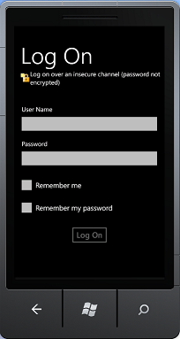

# <a name="overview-of-the-sharepoint-mobile-client-authentication-object-model"></a>Обзор объектной модели SharePoint мобильного клиента проверки подлинности
Обзор разработки с помощью проверки подлинности интерфейсы API клиентской объектной модели SharePoint для Silverlight.
## <a name="authentication-and-client-context-on-a-windows-phone"></a>Проверка подлинности и клиентского контекста на ОС Windows Phone
<a name="SP15Mobileclientauth_auth"> </a>

Процесс проверки подлинности пользователя SharePoint на Windows Phone 7.5 немного отличается от тот же самый процесс на клиентском компьютере. Клиентский код на Windows Phone 7.5 сначала создает объект класса **средства проверки подлинности** или **ODataAuthenticator** класс, который были добавлены в объектную модель SharePointclient для Microsoft Silverlight для Windows Phone. Затем этот объект используется как учетные данные пользователя.
  
    
    

> **Примечание:** Дополнительные сведения об API-интерфейсы, описанные в этом разделе можно [Общие сведения о мобильных объектной модели SharePoint](overview-of-the-sharepoint-mobile-object-model.md). Дополнительные сведения о клиентской объектной модели SharePoint для Silverlight см [Управляемой клиентской объектной модели](http://msdn.microsoft.com/en-us/library/ee537247.aspx) и [с помощью объектной модели Silverlight](http://msdn.microsoft.com/en-us/library/ee538971.aspx). 
  
    
    


## <a name="authenticating-the-user-in-the-sharepoint-client-object-model-for-silverlight"></a>Проверка подлинности пользователя в клиентской объектной модели SharePoint для Silverlight
<a name="SP15Mobileclientauth_user"> </a>

Ниже приведены действия, необходимые для получения объекта контекста прошедшим проверку подлинности.
  
    
    

1. Получите объект  [ClientContext](http://msdn.microsoft.com/en-us/library/microsoft.sharepoint.client.clientcontext.aspx) .
    
  
2. Создайте новый объект **Authenticator** и инициализация его свойств.
    
    > **Примечание:** Можно использовать один объект **проверки подлинности** с помощью только один объект **ClientContext** . Объект **проверки подлинности** не могут совместно использоваться несколько объектов **ClientContext** с разных URL-адресов.
3. Класс **Authenticator** реализует интерфейс [ICredentials](http://msdn.microsoft.com/en-us/library/system.net.icredentials.aspx) , поэтому назначить объект свойство [учетные данные](http://msdn.microsoft.com/en-us/library/microsoft.sharepoint.client.clientruntimecontext.credentials.aspx) объекта **ClientContext**.
    
  
Затем можно добавить остальную часть вашего кода объектной модели клиента и вызвать **ExecuteQueryAsync**.
  
    
    
В следующем коде показан следующие действия.
  
    
    


```cs

ClientContext context = new ClientContext(ListUrl);

// Create an instance of Authenticator object.
Authenticator at = new Authenticator();

// Replace <username> and <password> with valid values. 
at.UserName = "<username>";
at.Password = "<password>";
at.AuthenticationMode = ClientAuthenticationMode.FormsAuthentication;

at.CookieCachingEnabled = true;

// Assign the instance of Authenticator object to the ClientContext.Credential property.
// ClientContext is the object that is central to the client object model for making calls to the server running SharePoint 
// for fetching and updating data.
context.Credentials = at;

ListItemCollection items = context.Web.Lists.GetByTitle(ListName).GetItems(CamlQuery.CreateAllItemsQuery());

// Load the query and execute the request to fetch data.
context.Load(items);
context.ExecuteQueryAsync(
    (object obj, ClientRequestSucceededEventArgs args) =>
    {
// Success logic
    },

    (object obj, ClientRequestFailedEventArgs args) =>
    {
// Failure logic
    });


```

При необходимости можно указать сервер Unified Access Gateway (UAG) с помощью свойства **Authenticator.UagServerUrl**.
  
    
    
Если URL-адрес SharePoint поддержка проверки подлинности basic или на основе форм, вызовы **ExecuteQueryAsync** запрашивать у пользователя для входа в систему сведения, как показано на рисунке 1. В противном случае вызов завершится с ошибкой. Включение проверки подлинности basic или на основе форм авторизации на сайте SharePoint избежать ошибки проверки подлинности.
  
    
    

**На рисунке 1. Проверка подлинности клиента SharePoint**

  
    
    

  
    
    

  
    
    
Пользователь вводит имя пользователя и пароль и выбирает **Вход в систему**, как показано на рисунке 1. Пользователь имеет возможность выбора **Запомнить мои** установить для имени пользователя и могут выбрать **Сохранить пароль** пароли, как показано на рисунке 1. Когда пользователь имя и пароль запоминается, у пользователя нет введите учетные данные при следующем запуске приложения. **ExecuteQueryAsync** использует вошедшего в систему на учетные данные для выполнения веб-запросов на сервере под управлением SharePoint для извлечения данных.
  
    
    

## <a name="authenticating-the-user-in-the-sharepoint-odata-object-model"></a>Проверка подлинности пользователя в объектной модели SharePoint OData
<a name="SP15Mobileclientauth_OData"> </a>

Ниже приведены действия, необходимые для получения контекста объекта OData, прошедшего проверку подлинности.
  
    
    

1. Создайте новый объект **ODataAuthenticator** и инициализация его свойств.
    
  
2. Зарегистрируйте обработчик для события **AuthenticationCompleted**.
    
  
3. Вызовите метод **ODataAuthenticator.Authenticate**, который будет вызвано событие **AuthenticationCompleted**.
    
  
4. Получите объект контекста OData в обработчике **OnAuthenticationCompleted**.
    
  
Затем можно добавить вызовов rest вашей OData в обработчике **OnAuthenticationCompleted**.
  
    
    
В следующем коде показан следующие действия.
  
    
    


```cs

ODataAuthenticator oat = new ODataAuthenticator();

// Replace <username> and <password> with valid values. 
oat.UserName = "<username>";
oat.Password = "<password>";

oat.AuthenticationMode = ClientAuthenticationMode.FormsAuthentication;


oat.AuthenticationCompleted += 
           new EventHandler<SendingRequestEventArgs>(OnAuthenticationCompleted);

// The Authenticate method will raise the AuthenticationCompleted event.
oat.Authenticate("My_service_URL");  

```

Также должен реализовывать два обработчика событий, код, как описано в следующем разделе.
  
    
    

### <a name="implementing-the-onauthenticationcompleted-and-onsendingrequest-handlers-and-getting-the-clientcontext-object"></a>Реализация обработчиков OnAuthenticationCompleted и OnSendingRequest и получение объекта ClientContext

Реализация обработчика **OnAuthenticationCompleted** необходимо проверить наличие ошибок при проверке подлинности. Если они существуют, его следует обрабатывать их соответствующим образом, например с сообщением об ошибке пользователю и выйти из режима.
  
    
    
Если нет ошибок, обработчик должен создать экземпляр объекта **DataServiceContext** и затем зарегистрировать обработчик для события **SendingRequest**. С этого момента вашей OData, вызов кода запрограммирован объекта **DataServiceContext** так же, как работает на компьютере.
  
    
    
Ниже приведен пример реализации обработчика **OnAuthenticationCompleted**.
  
    
    


```cs

void OnAuthenticationCompleted(object sender, AuthenticationCompletedEventArgs e)
{
    if (e.Error != null)
    {
        MessageBox.Show(error);
        return;
    }
    ODataAuthenticator oat = sender as ODataAuthenticator;

    // Construct an OData context object.
    contextObj = new DataServiceContext(oat.ResolvedUrl);

    // Register the SendingRequest event handler.
    contextObj.SendingRequest += 
        new EventHandler<SendingRequestEventArgs>(OnSendingRequest);  
    
    // Your data retrieval logic goes here. 
    // For example, if there is a GetData method: 
    // contextObj.GetData();   
}


```

Все, что **OnSendingRequest** обработчика необходимо лишь имеет значение контейнер файл cookie для объекта **Request** контейнер файл cookie для объекта **ODataAuthenticator**. Ниже приведен пример.
  
    
    


```cs

void OnSendingRequest(object sender, SendingRequestEventArgs e)
{ 
    ODataAuthenticator oat = sender as ODataAuthenticator;
    ((HttpWebRequest)e.Request).CookieContainer = oat.CookieContainer;
}

```


## <a name="advanced-usage"></a>Расширенное использование
<a name="SP15Mobileclientauth_advance"> </a>


1. Можно создать объект **Authenticator** с жестко пользовательская настройка имени и пароля. Пользователь приложения не предлагается ввести имя пользователя и пароль, а жестко учетные данные будут использоваться для проверки подлинности пользователя.
    
     `public Authenticator(string userName, string password)`
    
     `public Authenticator(string userName, string password, string domain)`
    
    Же конструктор может использоваться для создания страницы входа в систему. Можно написать на страницу входа в систему путем передачи учетных данных из файлов с выделенным кодом.
    


```cs
  
Authenticator at = new Authenticator();
at.AuthenticationMode = ClientAuthenticationMode.MicrosoftOnline;                          

```

2. Тип проверки подлинности можно задать соответствующим образом. По умолчанию используется обычная проверка подлинности.
    
  

### <a name="authenticating-against-sharepoint-online"></a>Проверка подлинности в SharePoint Online

Для проверки подлинности URL-адрес SharePoint Online, присвойте свойству **AuthenticationMode** объекта **Authenticator** в режим **MicrosoftOnline**. Остальные действия, описанные в процедуре такие же, как для URL-адреса локального SharePoint.
  
    
    

> **Примечание:** Имя пользователя и пароль не может быть жестко для SharePoint Online.The, пользователю предлагается ввести учетные данные для входа. 
  
    
    


#### <a name="federation-authentication"></a>Проверка подлинности федерации

 Свойство **FederationAuthURI** используется для передачи **ADFS** предпочтений схемы проверки подлинности, где, **ADFS** настроен для использования нескольких обработчиков проверки подлинности. **FederationAuthURI** указывает тип проверки подлинности, необходимые для запросов проверки подлинности, используется проверка подлинности SharePoint Online с федерацией. Этот параметр может переопределять значение приоритета, заданные в порядке, в котором настроены обработчики проверки подлинности. Чтобы узнать больше о обработчик проверки подлинности, обратитесь к разделу [Обзор проверки подлинности обработчик](http://msdn.microsoft.com/en-us/library/ee895365.aspx).
  
    
    

```cs

 Authenticator auth = new Authenticator("domain\\\\name", "xyz"); 
 auth.FederationPassiveAuthUri = "urn:oasis:names:tc:SAML:2.0:ac:classes:Password"; 
//Replace <SiteUrl> with valid value 
ClientContext ctx = new ClientContext("SiteUrl"); 
               ctx.Credentials = auth; 
               ctx.ExecuteQueryAsync( 
 (object sender, ClientRequestSucceededEventArgs args) => 
   { 
    /* successful callback code */ 
   }, 
 (object sender, ClientRequestFailedEventArgs args) => 
   { 
   /* failure callback code */ 
  });

```

 **ADFS** — это необязательное свойство, который будет действовать только при использовании с помощью Microsoft SharePoint Online. С помощью **ADFS** проверка подлинности с помощью других схемы проверки подлинности не оказывает никакого влияния. С помощью Microsoft SharePoint online, если не указано **ADFS** затем схемы по умолчанию будет использоваться, то есть настройки сервера.
  
    
    

## <a name="cookie-caching"></a>Кэширование файлов cookie
<a name="SP15Mobileclientauth_cookie"> </a>

Класс **проверки подлинности** также включает в себя элементы, которые можно использовать для включения и управления кэширование файлов cookie или учетные данные. Сведения о этих членов класса **проверки подлинности** и способам их использования содержатся [Общие сведения о мобильных объектной модели SharePoint](overview-of-the-sharepoint-mobile-object-model.md).
  
    
    

## <a name="additional-resources"></a>Дополнительные ресурсы
<a name="SP15Mobileclientauth_addlresources"> </a>


-  [Построение приложений Windows Phone, обращающихся к SharePoint](build-windows-phone-apps-that-access-sharepoint.md)
    
  
-  [Обзор мобильных устройств объектной модели SharePoint](overview-of-the-sharepoint-mobile-object-model.md)
    
  

