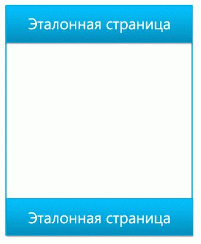
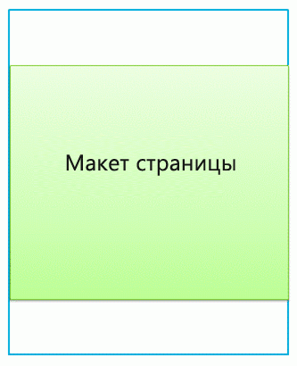
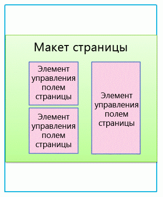
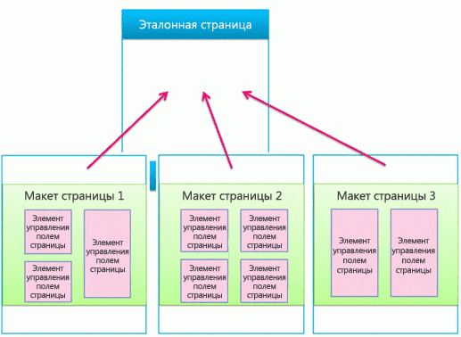
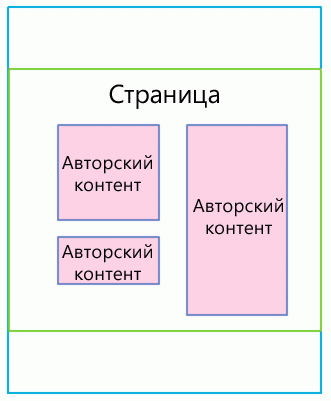
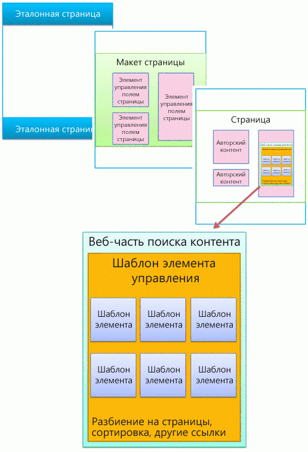
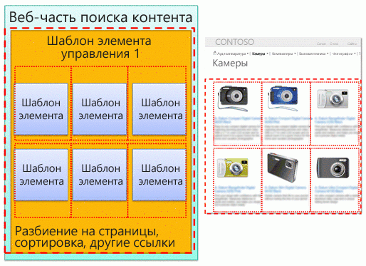
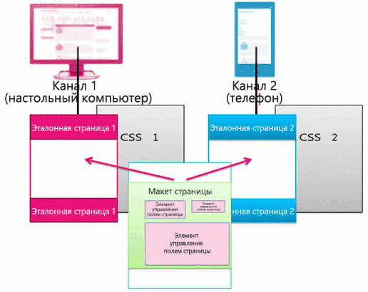
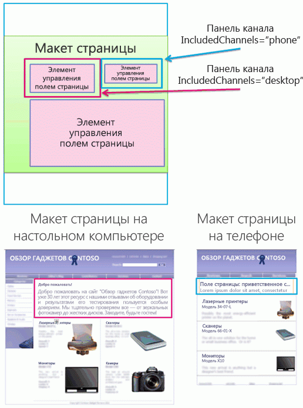
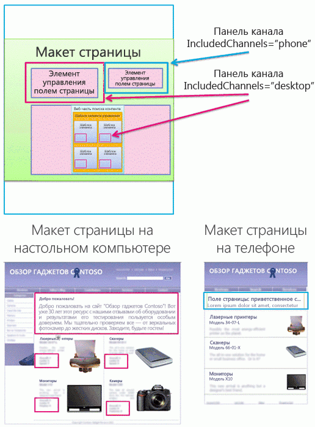

# Обзор модели страниц в SharePoint
Информация о пересмотренной модели страницы (включая эталонные страницы и макеты страниц), модернизированной для SharePoint.
## Общие сведения о модели страницы

Прежде чем приступить к разработке или созданию фирменной символики сайта SharePoint, необходимо иметь базовое представление о частях сайта SharePoint и компоновке страниц SharePoint. В этой статье представлены наглядные схемы этих фрагментов, чтобы учитывать их при планировании оформления веб-сайта. Данная статья применима главным образом к веб-сайтам публикации в SharePoint.
  
    
    

## Эталонные страницы, макеты страниц и страницы

SharePoint использует макеты, чтобы определить и отрисовать страницы, которые отображаются на веб-сайте. Структура страницы SharePoint включает три основных элемента:
  
    
    

- Эталонная страница определяет общие элементы фрейма (хром) для всех страниц на вашем сайте.
    
  
- Макеты страниц определяют макет для определенного класса страниц.
    
  
- Страницы создаются на основе макета страницы авторами, добавляющими содержимое в поля страницы.
    
  

**Рис. 1. Эталонная страница, макет страницы и страница**

  
    
    

  
    
    

  
    
    

### Главные страницы

Эталонная страница определяет хром (общие элементы фрейма) вашего сайта. Эти элементы могут включать верхний и нижний колонтитулы, верхнюю панель навигации, "хлебные крошки", поле поиска, эмблему сайта и другие элементы фирменной символики. При перемещении посетителей по сайту эталонная страница остается неизменной.
  
    
    

**Рисунок 2. Эталонная страница**

  
    
    

  
    
    

  
    
    
Кроме того, эталонная страница определяет области, называемые заполнителями контента, которые наполняются контентом из соответствующих областей на макетах страниц. Чаще всего основная часть эталонной страницы содержит единственный заполнитель (который называется **PlaceHolderMain** и создается автоматически), и весь контент из макета страницы появляется внутри него (заполнитель контента **PlaceHolderMain** выделен красным цветом на рис. 3).
  
    
    

**Рисунок 3. Эталонная страница с выделенным макетом страницы**

  
    
    

  
    
    

  
    
    
При просмотре эталонной страницы в Дизайнере вы увидите представленное ниже сообщение. Этот тег **
** находится внутри заполнителя основного содержимого. Проще говоря, эталонная страница определяет хром страницы, а макет страницы определяет текст, содержащийся в заполнителе основного содержимого.
  
    
    

**Рисунок 4. Сообщение при предварительном просмотре эталонной страницы**

  
    
    

  
    
    

  
    
    

  
    
    

  
    
    

### Макеты страниц

Макет страницы  это шаблон для определенного типа страницы на вашем сайте, например страницы статьи или страницы сведений о продукте. Как следует из названия, можно представить макет страницы как определение макета или структуры для основной части страницы.
  
    
    

**Рисунок 5. Макет страницы**

  
    
    

  
    
    

  
    
    
Макеты страниц определяют области или области содержимого, которые сопоставляются заполнителям контента на эталонной странице (выделены красным цветом на рис. 6). И снова наиболее распространенный сценарий  это когда макет страницы определяет единственную область содержимого, которая сопоставлена единственному заполнителю контента, автоматически созданному на эталонной странице.
  
    
    

**Рисунок 6. Область содержимого и заполнитель контента**

  
    
    

  
    
    

  
    
    

  
    
    

  
    
    

### Элементы управления полями страницы

Основное назначение макета страницы  упорядочить поля страницы. При создании макета страницы вы вставляете, определяете положение и стиль элементов, называемых элементы управления полями страницы. В конечном итоге, когда автор создаст страницы на основе данного макета страницы, в этих элементах управления будет содержаться контент. В дополнение к полям страницы макеты страниц могут содержать зоны веб-частей, в которые авторы контента могут добавлять веб-части. (Эталонные страницы не могут содержать зоны веб-частей.)
  
    
    
С помощью элемента управления полями страницы вы можете определить стили контента. Авторы могут добавлять контент на страницу, однако отображение контента целиком определяет проектировщик с помощью таблицы CSS, которая применяется к этим элементам управления.
  
    
    

**Рисунок 7. Макет страницы с элементами управления полями страницы**

  
    
    

  
    
    

  
    
    
Каждый макет страницы связан с типом контента в библиотеке страниц сайта. Тип контента  это схема столбцов и типов данных. Для любого макета страницы поля страницы, доступные для данного макета, напрямую соответствуют столбцам, определенным для типа контента этого макета страницы.
  
    
    

### Отношение эталонных страниц и макетов страниц

Эталонная страница и макет страницы вместе создают страницу содержимого.
  
    
    

**Рисунок 8. Эталонная страница с макетом страницы**

  
    
    

  
    
    

  
    
    
Эталонная страница определяет хром для всех страниц на сайте, поскольку в большинстве случаев многие макеты страниц (и поэтому многие страницы создаются из этих макетов страницы) связаны с одной эталонной страницей.
  
    
    

**Рисунок 9. Одна эталонная страницы связана с тремя макетами страниц**

  
    
    

  
    
    

  
    
    
Однако ваш сайт, скорее всего, использует несколько эталонных страниц. Например, кроме эталонной страницы по умолчанию, у вас могут быть одна или несколько эталонных страниц, которые предназначены для определенных устройств, например смартфонов или планшетов. В этом случае один макет страницы используется несколькими эталонными страницами (более подробную информацию можно узнать в разделе о каналах устройств).
  
    
    
Вы можете использовать одну эталонную страницу на каждый канал по каждому сайту SharePoint.
  
    
    

### Страницы

Авторы могут создавать страницы, добавлять содержимое на поля страниц и добавлять веб-части в любую зону веб-частей или редакторы форматированного текста. Структура страниц выполнена таким образом, что авторы страниц не смогут внести изменения за пределы полей страницы.
  
    
    

**Рисунок 10. Страница с авторским содержимым**

  
    
    

  
    
    

  
    
    
Отображаемая страница  это то, что посетители видят на сайте. Когда браузер запрашивает страницу, эталонная страница объединяется с макетом, чтобы создать страницу содержимого, и содержимое для данной страницы объединяется с полями из данной страницы в библиотеке страниц.
  
    
    

**Рисунок 11. Отображаемая страница в браузере**

  
    
    

  
    
    

  
    
    

**Рисунок 12. Эталонная страница, макет страницы и страница**

  
    
    

  
    
    

  
    
    

  
    
    

  
    
    

## Веб-части на основе поиска и шаблоны для отображения

В предыдущем разделе была рассмотрена модель страниц SharePoint с точки зрения эталонных страниц, макетов страниц (с полями страниц) и страниц. Эти элементы наиболее распространены на сайте публикации, на котором авторы регулярно создают и публикуют новый контент. Когда дело доходит до отображения этого контента на вашем сайте, в игру вступают еще пара элементов. Хотите вы подключиться к внешнему каталогу или просто отобразить определенный набор результатов поиска, для выполнения этих действий вам понадобятся веб-части на основе поиска.
  
    
    
В сценарии со страницами на основе поиска страница SharePoint содержит три основных элемента:
  
    
    

- Главные страницы
    
  
- Макеты страниц:
    
  - обычные макеты страниц, которые создаются вами для определенных типов контента, как это описано в данной статье выше;
    
  
  - макеты страниц со сведениями о категории или элементе, которые создаются с помощью публикации каталога на нескольких сайтах.
    
  
- Страницы
    
  
- Веб-части на основе поиска, например веб-часть поиска контента.
    
  
- Шаблоны для отображения, чтобы контролировать появление управляемых свойств в результатах поиска веб-части поиска контента и управлять стилем и поведением данных результатов поиска:
    
  - шаблоны отображения элементов управления, которые управляют макетом результатов поиска и любыми элементами, общими для всех результатов, например разбиение по страницам, сортировка и другие ссылки;
    
  
  - шаблоны отображения элемента, которые управляют отображением и повторением каждого результата поиска.
    
  

**Рисунок 13. Эталонная страница, макет страницы и страница с веб-частью**

  
    
    

  
    
    

  
    
    

### Веб-части на основе поиска

С помощью веб-частей на основе поиска вы можете динамически представлять хранимую в индексе поиска информацию. Представление данных в веб-части поиска контента управляется с помощью шаблонов для отображения, которые находятся в коллекции эталонных страниц вместе с эталонными страницами и макетами страниц.
  
    
    
В SharePoint есть несколько готовых шаблонов отображения, например списки и слайд-шоу для веб-частей поиска контента. Шаблоны отображения можно выбрать во время настройки веб-части поиска контента в браузере.
  
    
    

**Рис. 14. Область инструментов веб-части поиска контента**

  
    
    

  
    
    

  
    
    
Веб-части поиска контента используют два типа шаблонов для отображения  шаблон отображения элемента управления и шаблон отображения элемента. В рамках разработки или создания фирменной символики своего сайта вы можете создать пользовательский шаблон для отображения, который использует определенные вами макеты, стили и поведение.
  
    
    

**Рисунок 15. Две схемы веб-частей поиска контента**

  
    
    

  
    
    

  
    
    

  
    
    

  
    
    

### Шаблон отображения элемента управления

Шаблон элемента управления определяет всю структуру и макет представления результатов поиска, например список с разбиением по страницам или слайд-шоу. Каждая веб-часть поиска контента использует один шаблон элемента управления.
  
    
    
Кроме того, этот шаблон включает функциональные возможности, общие для всех результатов поиска, включая разбиение по страницам, сортировку, параметры просмотра и разделители.
  
    
    

**Рисунок 16. Шаблон элемента управления, выделенный в веб-части и на веб-странице**

  
    
    

  
    
    

  
    
    

  
    
    

  
    
    

### Шаблон отображения элемента

Шаблон элемента определяет способ отображения каждого результата в наборе; этот шаблон повторяется для каждого результата. Шаблон элемента может отображать изображение, изображение с текстом, видео и другой контент.
  
    
    
Кроме того, он определяет, какие управляемые свойства и значения отображаются за счет веб-части поиска контента. В данном примере шаблон элемента отображает три управляемых свойства: небольшое изображение, название продукта в виде гиперссылки и краткое текстовое описание.
  
    
    

**Рисунок 17. Шаблоны элементов, выделенные в веб-части и на веб-странице**

  
    
    

  
    
    

  
    
    

  
    
    

  
    
    

## Каналы устройств и панели канала устройств

В SharePoint вы можете использовать каналы устройств, чтобы отображать один веб-сайт несколькими способами с использованием различных макетов, предназначенных для различных устройств. Вы создаете один сайт и авторский контент только один раз. Затем этот сайт и контент можно сопоставить, чтобы использовать различные эталонные страницы и таблицы стилей, предназначенные определенным устройствам или группам устройств.
  
    
    
При разработке сайта для более одного устройства учтите следующие элементы:
  
    
    

- Каналы устройств:
    
  - Используя различные эталонные страницы и таблицы CSS для каждого канала, одинаковое содержимое страницы для определенных устройств (например, Windows Phone) или групп устройств (все смартфоны) можно представить различными способами.
    
  
- Макеты страниц:
    
  - Если контент не меняется, вы можете использовать для всех каналов устройств одинаковые макеты страниц несмотря на то, что они могут иметь разные стили, основанные на CSS другой эталонной страницы, для каждого канала.
    
  
  - Если вы хотите включить контент только для определенных устройств, используйте панели канала устройств.
    
  
- Страницы
    
  

### Каналы устройств

Когда вы создаете канал устройства, вы указываете подстроки агента пользователя для целевых устройств канала. Это позволяет хорошо управлять устройством (или браузером), которое было захвачено через канал. Затем вы назначаете этому каналу эталонную страницу; каждая эталонная страница в свою очередь ссылается на собственную таблицу стилей, в которой макет и стили оптимизированы для данного типа устройства.
  
    
    

**Рисунок 18. Два канала устройства с отдельными эталонными страницами**

  
    
    

  
    
    

  
    
    
Вы можете многое реализовать, используя только CSS. Это возможно для эталонных страниц для двух различных каналов (например, компьютер и телефон), которые идентичны за исключением ссылки на разные таблицы стилей. Файлы CSS просто используют различные стили для одних и тех же элементов страницы.
  
    
    

### Отношение эталонных страниц и макетов страниц

В отличие от эталонных страниц вы не указываете различным каналам устройств различные макеты страниц. Все макеты работают со всеми созданными вами каналами. Соответственно, один макет страницы применяется ко многим каналам устройств и эталонным страницам.
  
    
    
Это основное преимущество каналов устройств  изменяется структура (эталонной страницы или файла CSS), а контент остается тем же (макеты страниц и страницы). Однако вы можете изменять отображаемый по различным каналам контент из макета страницы с помощью панелей канала устройств (см. следующий раздел).
  
    
    

**Рисунок 19. Один макет страницы, работающий с двумя макетами страниц**

  
    
    

  
    
    

  
    
    

  
    
    

  
    
    

### Панели каналов устройств

Панель канала устройства  это элемент управления, который можно добавить на эталонную страницу, макет страницы или шаблон для отображения, чтобы управлять отображаемым на каждом канале контентом. Панель каналов, по сути, является контейнером, который определяет один или несколько каналов; если один или более этих каналов активны при отображении страницы, то отображается также и контент панели каналов. Панель каналов может включать любой тип контента, включая ссылку на CSS- или JS-файл, и это простой способ включить определенный контент для определенных каналов.
  
    
    
Пожалуй, наиболее распространенным сценарием использования панелей каналов является выборочное включение частей макета страницы для определенных каналов. Например, у вас есть макет страницы с отдельными текстовыми полями для длинного и короткого приветствий. Поместив поля страницы внутри панелей каналов, вы можете отображать только короткое приветствие для телефонов и только длинное  для компьютеров. Контент панели каналов устройств не отображается для каналов, в которые он не включен, и контент внутри этой панели каналов устройств не отображается вообще, что запрещает передачу данных по кабельной сети.
  
    
    

**Рисунок 20. Макет страницы с панелями каналов**

  
    
    

  
    
    

  
    
    
Кроме того, вы можете использовать панели каналов на эталонных страницах. Например, если у вас есть эталонная страница, которую можно приспособить для двух различных устройств (или двух различных браузеров) с минимальными изменениями, вы можете использовать панели каналов, чтобы хранить контент на эталонной странице, которая уникальна для каждого из этих устройств.
  
    
    
Или вы можете использовать панель каналов внутри шаблона отображения элемента для веб-части поиска контента, чтобы отображать дополнительные управляемые свойства для этого элемента только из каталога для компьютеров, но не для телефонов.
  
    
    

**Рисунок 21. Макет страницы и шаблоны элементов с панелями каналов**

  
    
    

  
    
    

  
    
    

  
    
    

  
    
    

## См. также

-  [Обзор Дизайнера в SharePoint](overview-of-design-manager-in-sharepoint.md)
    
  
-  [Создание сайтов для SharePoint](build-sites-for-sharepoint.md)
    
  
-  [Шаблоны отображения Дизайнера SharePoint](sharepoint-design-manager-display-templates.md)
    
  
-  [Каналы устройств в компоненте "Дизайнер" SharePoint](sharepoint-design-manager-device-channels.md)
    
  

