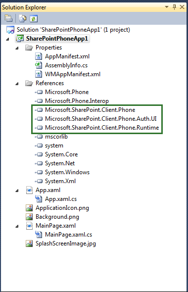

# <a name="overview-of-windows-phone-sharepoint-application-templates-in-visual-studio"></a>Обзор шаблонов приложений SharePoint для Windows Phone в Visual Studio
Узнайте о шаблонах Visual Studio, установленных с помощью пакета SDK SharePoint для Windows Phone для разработки мобильного приложения.
## <a name="templates-installed-by-the-windows-phone-sharepoint-software-development-kit"></a>Шаблоны, установленные с средств разработки программного обеспечения для Windows Phone SharePoint
<a name="BKMK_TemplatesInstalled"> </a>

После того как настроить среду разработки и установить Windows Phone SharePoint Software Development Kit (SDK) две дополнительные шаблоны Silverlight для Windows Phone, доступны для проектов:
  
    
    

- Шаблон приложения пустой SharePoint для Windows Phone
    
  
- Шаблон приложения списка SharePoint для Windows Phone
    
  
На данный момент эти шаблоны предназначены для использования только в проектах C#. Они недоступны для Visual Basic проектов. Тем не менее, для использования в Visual Studio 2012 и Visual Studio Express 2012 для Windows Phone 8 и Visual Studio 2010 и Visual Studio 2010, экспресс-выпуск для Windows Phone 7 доступны шаблоны.
  
> [!NOTE]
> [!Примечание] Шаблоны Windows Phone SharePoint не отображаются в меню **Создать проект** Expression Blend. Тем не менее можно изменить проект в Expression Blend, выбрав команду **Открыть в выражении Blend** контекстное меню в Visual Studio.
  
    
    

При создании проекта, основанного на один из этих шаблонов, пользователь не получает выбрать целевой платформы Windows Phone. Как для проектов, созданных в Visual Studio Express 2012 с помощью конечных Windows Phone 8 эти шаблоны приложений с SharePoint; И ОС Windows Phone 7.1 версии по умолчанию, предназначенных для проектов, созданных в Visual Studio 2010 Express с помощью этих шаблонов, атрибут **AppPlatformVersion** элемента **развертывания** в файле WMAppManifest.xml имеет значение 7.1.
  
    
    


```XML

<Deployment xmlns="http://schemas.microsoft.com/windowsphone/2009/deployment" AppPlatformVersion="7.1">
```

> [!NOTE]
> [!Примечание] Дополнительные сведения о параметрах в файле WMAppManifest.xml  [Приложения манифест файла для Windows Phone](http://msdn.microsoft.com/en-us/library/ff769509.aspx)см. 
  
    
    


## <a name="starting-a-project-based-on-the-windows-phone-empty-sharepoint-application-template"></a>Запуск проекта на основе шаблона пустой SharePoint приложения Windows Phone
<a name="BKMK_EmptySPAppTemplate"> </a>

При создании проекта Visual Studio на основе шаблона пустой SharePoint приложения Windows Phone, начала проекта похож на проект, созданный с помощью базового шаблона приложения для Windows Phone (устанавливается по Windows Phone SDK 7.1), с добавлением ссылок на библиотеки DLL, установленных с Windows Phone пакет SDK для SharePoint (Microsoft.SharePoint.Client.Phone.dll, Microsoft.SharePoint.Client.Phone.Auth.UI и Microsoft.SharePoint.Client.Phone.Runtime.dll, как показано на рисунке 1) и некоторые другие при изменении конфигурации.
  
> [!NOTE]
> [!Примечание] Шаблоны доступны для Windows Phone 8 в Visual Studio Express 2012. 
  
    
    


**На рисунке 1. Файлы в Windows Phone пустой проект приложения SharePoint**

  
    
    

  
    
    

  
    
    
В проекте на основе шаблона пустой SharePoint приложения Windows Phone это стандартные файлы приложения Silverlight Windows Phone. Файл MainPage.xaml содержит объявления XAML, которые составляют пользовательского интерфейса (UI) приложения. Файл фонового кода, файл MainPage.xaml.cs, связан с файла MainPage.xaml с помощью механизма разделяемых классов, как и другие файлы кода в проекте. (  [Фонового кода и разделяемых классов](http://msdn.microsoft.com/en-us/library/cc221357.aspx)см). Файл MainPage.xaml.cs содержит процедурный код, реализующий логику для поддержки операций и события в пользовательском Интерфейсе. Файл App.xaml представляет общий приложение Windows. Файл выделенным кодом App.xaml.cs, включает в себя процедурного кода для обработки событий жизненного цикла для приложения.
  
    
    

## <a name="starting-a-project-based-on-the-windows-phone-sharepoint-list-application-template"></a>Запуск проекта на основе шаблона приложения списка SharePoint для Windows Phone
<a name="BKMK_SPListAppTemplate"> </a>

Шаблон приложения списка SharePoint для Windows Phone значительно эффективнее, чем шаблон приложение Windows Phone пустой SharePoint. Этот шаблон разработан для создания приложения для Windows Phone для обработки вероятный сценарий в разработки мобильных приложений для SharePoint: доступа и управления данными в список SharePoint из Windows Phone. При создании проекта Visual Studio, основанных на этом шаблоне, мастер помогает выполнить необходимые шаги по настройке и создает файлы решения для работы приложения Windows Phone, можно работать с данными списков SharePoint. Можно создать и развернуть приложение из созданные файлы с минимальными или без изменений.
  
> [!NOTE]
> [!Примечание] Шаблоны доступны для Windows Phone 8 в Visual Studio Express 2012. 
  
    
    


### <a name="understanding-the-solution-files-in-a-windows-phone-sharepoint-list-application-project"></a>Общие сведения о файлах решения в проект приложения списка SharePoint для Windows Phone

Файлы, созданные для Visual Studio проекта с помощью шаблона приложения списка SharePoint для Windows Phone показаны на рисунке 2. (Ссылки на другие сборки — не показано на рисунке 2 — например, System.Runtime.Serialization.dll и Microsoft.Phone.Controls.dll относятся только к эти ссылки, включенные в шаблоне приложения Windows Phone пустой SharePoint. Эти дополнительные сборки поддерживает управление данным списков SharePoint и визуальные элементы управления для представления данных).
  
    
    

**На рисунке 2. Файлы в проект приложения списка SharePoint для Windows Phone**

  
    
    

  
    
    

  
    
    
Файлы проекта для описаны в таблице 1.
  
    
    

**В таблице 1. Файлы проекта приложения списка SharePoint для Windows Phone**


|**Файл**|**Описание**|
|:-----|:-----|
|App.XAML  <br/> |Представляет приложение Windows Phone в целом. Включает в себя объявления элементов, связанные с приложением (вместо на отдельные страницы в приложении), такие как события жизненным циклом приложения как **Application_Deactivated** и **Application_Closing**. <br/> |
|App.XAML.cs  <br/> |Файл фонового кода, связанного с App.xaml (с помощью механизма разделяемого класса, как в случае для других файлов кода в проекте). Включает в себя процедурного кода для обработки операций в событий жизненного цикла, такие как **Application_Deactivated** и **Application_Closing**. Написание кода в этот файл для управления автономной (локальный) хранилище данных. <br/> |
|ListDataProvider.cs  <br/> |Содержит код для доступа к данным на SharePoint Server и предоставляет доступ к являются различных представлений списка приложения на основе синтаксиса запроса.  <br/> |
|List.XAML  <br/> |Определяет элементы пользовательского интерфейса для представления формы по умолчанию в приложении телефона; аналогом всех элементов (или все задачи, все контакты или аналогичное) представления в SharePoint. Файл List.xaml содержит элемент управления **Pivot**, который представляет основной контейнер для визуальных элементов в приложении, включая элементы управления **PivotItem**, отображать представления списка, выбранного разработчиком, должны быть включены в приложении Windows Phone. <br/> |
|List.XAML.cs  <br/> |Файл фонового кода, связанного с List.xaml. Включает в себя код, реализующий методы и обработчики для кнопок на форме, таких как **Создать** "и" **Обновить**. <br/> |
|DisplayForm.xaml  <br/> |Определяет элементы пользовательского интерфейса для формы **Отображения элемента** (или страницы) в приложении; аналогом **Элемента представления** формы в SharePoint. В приложении Windows Phone с помощью элемента управления **StackPanel**, содержащийся в элементе управления **Pivot** Silverlight в вертикальном «стек» отображаются поля. <br/> |
|Displayform.XAML.cs из  <br/> |Файл фонового кода, связанного с DisplayForm.xaml. Включает в себя код, реализующий методы и обработчики для кнопок на форме, например, **Изменение** и **Удаление**. <br/> |
|EditForm.xaml  <br/> |Определяет элементы пользовательского интерфейса для форма **Изменения элемента** в приложении телефона; Аналогично форма **Изменения элемента** в SharePoint. Как и в форме **Отображения элемента** в элементе управления **StackPanel** отображаются поля. <br/> |
|EditForm.xaml.cs  <br/> |Файл фонового кода, связанного с EditForm.xaml. Включает в себя код, реализующий методы и обработчики для кнопок на форме, таких как **Отправка** и **Отмена**. <br/> |
|NewForm.xaml  <br/> |Определяет элементы пользовательского интерфейса для формы **Нового элемента** в приложении телефона; аналог в форму **Новый элемент** в SharePoint. В элементе управления **StackPanel** отображаются поля. <br/> |
|NewForm.xaml.cs  <br/> |Файл фонового кода, связанного с NewForm.xaml. Включает в себя код, реализующий методы и обработчики для кнопок на форме, таких как **Отправка** и **Отмена**. <br/> |
|DisplayItemViewModel.cs  <br/> |Выступает в качестве источника данных для файла DisplayForm.xaml.  <br/> |
|EditItemViewModel.cs  <br/> |Выступает в качестве источника данных для файла EditForm.xaml. Написание кода в этот файл, чтобы проверить данные, введенные пользователями при изменении элемента списка.  <br/> |
|ListViewModel.cs  <br/> |Выступает в качестве источника данных для файла List.xaml.  <br/> |
|NewItemViewModel.cs  <br/> |Выступает в качестве источника данных для файла NewForm.xaml. Написание кода в этот файл, чтобы проверить данные, введенные пользователями, при добавлении нового элемента списка.  <br/> |
   
Подробные сведения об этапах, используемых при создании приложения Windows Phone с использованием шаблона приложения списка SharePoint для Windows Phone, в разделе [как: Создание приложения списка SharePoint для Windows Phone](how-to-create-a-windows-phone-sharepoint-list-app.md).
  
    
    

## <a name="see-also"></a>См. также
<a name="SP15winphoneover_addlresources"> </a>


-  [Построение приложений Windows Phone, обращающихся к SharePoint](build-windows-phone-apps-that-access-sharepoint.md)
    
  
-  [Как: Настройка среды разработки мобильных приложений для SharePoint](how-to-set-up-an-environment-for-developing-mobile-apps-for-sharepoint.md)
    
  
-  [Windows Phone SDK 8.0](http://www.microsoft.com/en-us/download/details.aspx?id=35471)
    
  
-  [Пакет SDK Microsoft SharePoint для Windows Phone 8](http://www.microsoft.com/en-us/download/details.aspx?id=36818)
    
  
-  [Пакет SDK для Windows Phone 7.1](http://www.microsoft.com/en-us/download/details.aspx?id=27570)
    
  
-  [Пакет SDK Microsoft SharePoint для Windows Phone 7.1](http://www.microsoft.com/en-us/download/details.aspx?id=30476)
    
  
-  [Windows Phone разработки](http://msdn.microsoft.com/en-us/library/ff402535%28v=vs.92%29.aspx)
    
  

