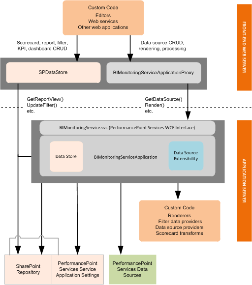

# PerformancePoint Services в SharePointPerformancePoint Services in SharePoint
Ознакомьтесь с поддерживаемым сценариям разработки и архитектура расширения для служб PerformancePoint Services в SharePoint.Learn about supported development scenarios and the extensibility architecture for PerformancePoint Services in SharePoint.
PerformancePoint Services — это приложение службы SharePoint.PerformancePoint Services is a SharePoint service application. Она позволяет пользователям создавать бизнес-аналитики (BI) панелей мониторинга, которые обеспечивают представление о производительности организации.It enables users to create business intelligence (BI) dashboards that provide insight into an organization's performance. Можно создать настраиваемых отчетов, фильтров, табличных источников данных и преобразований систем показателей для расширения встроенных функций служб PerformancePoint Services.You can create custom reports, filters, tabular data sources, and scorecard transforms to extend the native functionality of PerformancePoint Services. Например можно создать визуализации настраиваемого отчета, который оптимизирован для медицинского обслуживания отрасли и его интеграции в для повторного использования вертикальное решение.For example, you can create a custom report visualization that is optimized for the medical industry and then integrate it into a reusable vertical solution.
  
    
    

## Пользовательские отчеты служб PerformancePoint Services, фильтров и табличных источников данных в SharePointCustom PerformancePoint Services reports, filters, and tabular data sources in SharePoint

Собственная Службы PerformancePoint Services  [ReportView](https://msdn.microsoft.com/library/Microsoft.PerformancePoint.Scorecards.ReportView.aspx) , [Filter](https://msdn.microsoft.com/library/Microsoft.PerformancePoint.Scorecards.Filter.aspx) и табличные [DataSource](https://msdn.microsoft.com/library/Microsoft.PerformancePoint.Scorecards.DataSource.aspx) объекты можно расширять путем определения пользовательского значения для их свойства. Настраиваемый отчет, фильтров и расширений табличных источников данных обычно включают три компонента: обработчик или поставщик, приложение редактирования и метаданные расширения.You can extend native PerformancePoint Services  [ReportView](https://msdn.microsoft.com/library/Microsoft.PerformancePoint.Scorecards.ReportView.aspx) , [Filter](https://msdn.microsoft.com/library/Microsoft.PerformancePoint.Scorecards.Filter.aspx) , and tabular [DataSource](https://msdn.microsoft.com/library/Microsoft.PerformancePoint.Scorecards.DataSource.aspx) objects by defining custom values for their properties. Custom report, filter, and tabular data source extensions typically include three components: a renderer or provider, an editor application, and extension metadata.
  
    
    

### Средств отображения и поставщиков для расширения Службы PerformancePoint ServicesRenderers and providers for PerformancePoint Services extensions

Тип объекта, который вы расширяете определяет, используется ли обработчик или поставщик. Использование средств отображения отчетов и фильтров расширения и фильтрации и расширения источника данных используйте поставщиков.The type of object that you are extending determines whether it uses a renderer or a provider. Report and filter extensions use renderers, and filter and data source extensions use providers.
  
    
    

- Для визуализации отчета расширению отчета требуется обработчик.Report extensions require a renderer for the report visualization. 
    
  
- Фильтр расширению отчета требуется обработчик для элемента управления выбора. Средство визуализации может быть собственный модуль подготовки отчетов или собственный Службы PerformancePoint Services визуализации. При использовании визуализации Службы PerformancePoint Services его просто зарегистрировать в расширении. Если вы используете собственный модуль подготовки отчетов, необходимо включить его в расширении.Filter extensions require a renderer for the selection control. The renderer can be a custom renderer or a native PerformancePoint Services renderer. If you are using a PerformancePoint Services renderer, you simply register it in your extension. If you are using a custom renderer, you must also include it in your extension.
    
  
- Фильтр расширению отчета требуется поставщик данных для подключения к базовому источнику данных.Filter extensions require a data provider to connect to the underlying data source.
    
  
- Расширениям источников данных для подключения к базовому источнику данных требуется поставщик.Data source extensions require a provider to connect to the underlying data source.
    
  
Для получения дополнительных сведений о создании средств отображения и поставщиков в следующих разделах:For more information, see the following topics about creating renderers and providers:
  
    
    

-  [Как: создание средств отображения отчетов для PerformancePoint Services в SharePointHow to: Create report renderers for PerformancePoint Services in SharePoint](how-to-create-report-renderers-for-performancepoint-services-in-sharepoint.md)
    
  
-  [Как: создать фильтр поставщиков данных для служб PerformancePoint Services в SharePointHow to: Create filter data providers for PerformancePoint Services in SharePoint](how-to-create-filter-data-providers-for-performancepoint-services-in-sharepoint.md)
    
  
-  [Как: Создание поставщиков табличных источников данных для служб PerformancePoint Services в SharePointHow to: Create tabular data source providers for PerformancePoint Services in SharePoint](how-to-create-tabular-data-source-providers-for-performancepoint-services-in-sha.md)
    
  

### Редактор приложений для расширения служб PerformancePoint Services в SharePointEditor applications for PerformancePoint Services extensions in SharePoint

Настраиваемые редакторы позволяют пользователям определение свойств для настраиваемого объекта, взаимодействия с объектами в репозитории и инициализация конечных точек для настраиваемых отчетов и фильтры. Редактора должны предоставлять свойства, чтобы разрешить пользователям просматривать и изменять. Редакторы можно открыть из объектов в Конструктор панели мониторинга PerformancePoint или из элементов в список контента PerformancePoint или библиотеки подключений к данным PerformancePoint. Чтобы интегрировать в Конструктор панели мониторинга взаимодействия при разработке, должен иметь возможность открыть из универсальный код ресурса (URI), редактора и URI должна быть зарегистрирована для настраиваемого объекта в файле web.config Службы PerformancePoint Services.Custom editors enable users to define properties for a custom object, interact with objects in the repository, and initialize endpoints for custom reports and filters. Your editor should expose the properties that you want to enable users to view and modify. Editors can be opened from objects in PerformancePoint Dashboard Designer or from items in the PerformancePoint Content List or PerformancePoint Data Connections Library. To integrate into the Dashboard Designer authoring experience, your editor must be able to open from a uniform resource identifier (URI), and the URI must be registered for the custom object in the PerformancePoint Services web.config file.
  
    
    
Дополнительные сведения о создании редакторы в следующих разделах:For more information about creating editors, see the following topics:
  
    
    

-  [Как: создать отчет редакторы для служб PerformancePoint Services в SharePointHow to: Create report editors for PerformancePoint Services in SharePoint](how-to-create-report-editors-for-performancepoint-services-in-sharepoint.md)
    
  
-  [Как: создать фильтр редакторы для служб PerformancePoint Services в SharePointHow to: Create filter editors for PerformancePoint Services in SharePoint](how-to-create-filter-editors-for-performancepoint-services-in-sharepoint.md)
    
  
-  [Как: создание табличных данных редакторы исходного для служб PerformancePoint Services в SharePointHow to: Create tabular data source editors for PerformancePoint Services in SharePoint](how-to-create-tabular-data-source-editors-for-performancepoint-services-in-share.md)
    
  
> [!NOTE]
> [!Примечание] Конструктор панели мониторинга PerformancePoint позволяет создавать и удалять пользовательские объекты, поэтому редактора необходимо предоставить логику для создания или удаления объектов.PerformancePoint Dashboard Designer can create and delete custom objects, so your editor does not need to provide logic for creating or deleting objects. 
  
    
    

### Метаданные конфигурации для расширения служб PerformancePoint Services в SharePointConfiguration metadata for PerformancePoint Services extensions in SharePoint

Необходимо указать метаданных для расширения в файле web.config Службы PerformancePoint Services во время установки. Метаданные включает в себя **type**, **subType**, **RendererClass**, **EditorURI**и **Resources** атрибуты.You must specify metadata for your extension in the PerformancePoint Services web.config file during the installation process. The metadata includes **type**, **subType**, **RendererClass**, **EditorURI**, and **Resources** attributes.
  
    
    
Для создания настраиваемого объекта, Конструктор панели мониторинга возвращает объект метаданных из файла web.config Службы PerformancePoint Services и затем создает объект в качестве типа контента в хранилище Конструктор панели мониторинга. После создания настраиваемого объекта, Конструктор панели мониторинга отображается ссылка в редактор.To create a custom object, Dashboard Designer retrieves the object's metadata from the PerformancePoint Services web.config file and then creates the object as a content type in the Dashboard Designer repository. After creating the custom object, Dashboard Designer displays a link to the editor.
  
    
    
Дополнительные сведения о метаданные расширения можно  [Регистрация расширений служб PerformancePoint вручную](http://msdn.microsoft.com/library/3aa6d340-4b05-46b3-9648-2b6e18e04e09%28Office.15%29.aspx).For more information about extension metadata, see  [How to: Manually Register PerformancePoint Services Extensions](http://msdn.microsoft.com/library/3aa6d340-4b05-46b3-9648-2b6e18e04e09%28Office.15%29.aspx).
  
    
    

## Настраиваемых преобразований для систем показателей PerformancePoint Services в SharePointCustom transforms for PerformancePoint Services scorecards in SharePoint

Преобразований изменение внешнего вида, содержимого или функциональные возможности систем показателей перед запроса источника данных, после запроса источника данных или перед отображением системы показателей в веб-части. Например, Службы PerformancePoint Services используются преобразования нужно выполнить несколько операций перед отображением представления системы показателей, таких как развертывание именованные наборы, вычислений накопительные пакеты обновления и сетей статистические выражения. Эти изменения применяются во время выполнения и не изменяйте в определении объекта системы показателей.Transforms change the appearance, contents, or functionality of scorecards before querying the data source, after querying the data source, or before rendering the scorecard in the Web Part. For example, PerformancePoint Services uses transforms to perform several operations before rendering a scorecard view, such as expanding named sets, computing rollups, and computing aggregations. These changes are applied at run time and they do not modify the definition of the scorecard object.
  
    
    
Дополнительные сведения о преобразований системы показателей можно [как: создать преобразования системы показателей для служб PerformancePoint Services в SharePoint](how-to-create-scorecard-transforms-for-performancepoint-services-in-sharepoint-2.md).For more information about scorecard transforms, see  [How to: Create scorecard transforms for PerformancePoint Services in SharePoint](how-to-create-scorecard-transforms-for-performancepoint-services-in-sharepoint-2.md).
  
> [!NOTE]
> [!Примечание] Если преобразование изменяет значения данных в системе показателей, изменения распространяются напрямую в отчеты стратегической карты, использующие эту систему в качестве источника данных. Кроме того, изменения в системе показателей могут повлиять на отчеты о ключевых показателях эффективности.If a transform modifies the data values in a scorecard, the changes propagate directly to Strategy Map reports that use the scorecard as a data source. In addition, changes to scorecards may affect KPI Details reports. 
  
    
    

## Архитектура расширения для служб PerformancePoint Services в SharePointExtensibility architecture for PerformancePoint Services in SharePoint

Поддерживаемые расширения выполняются в рамках экземпляра приложения Службы PerformancePoint Services на интерфейсном веб-сервере или на сервере приложений, как показано на следующей схеме.Supported extensions run within a PerformancePoint Services application instance, either on the front-end web server or on the application server, as shown in the following diagram.
  
    
    

**Рисунок 1. Архитектура расширяемости PerformancePoint Services****Figure 1. PerformancePoint Services extensibility architecture**

  
    
    

  
    
    

  
    
    

### Расширения служб PerformancePoint Services, которые запускаются на интерфейсном веб-сервере SharePointPerformancePoint Services extensions that run on the SharePoint front-end web server

Настраиваемые редакторы (и другие поддерживаемые настраиваемые приложения), выполните на интерфейсном веб-сервере в рамках экземпляра приложения Службы PerformancePoint Services. Редакторы обычно развертываются как ASPX-страницы и устанавливаются в путь  `%ProgramFiles%\\Common Files\\Microsoft Shared\\web server extensions\\15\\TEMPLATE\\LAYOUTS`. Редакторы вызова  [BIMonitoringServiceApplicationProxy](https://msdn.microsoft.com/library/Microsoft.PerformancePoint.Scorecards.BIMonitoringServiceApplicationProxy.aspx) объектов или объектов [SPDataStore](https://msdn.microsoft.com/library/Microsoft.PerformancePoint.Scorecards.Store.SPDataStore.aspx) для автора или процесс содержимое, следующим образом:Custom editors (and other supported custom applications) run on the front-end web server within a PerformancePoint Services application instance. Editors are typically deployed as .aspx pages and are installed in the path  `%ProgramFiles%\\Common Files\\Microsoft Shared\\web server extensions\\15\\TEMPLATE\\LAYOUTS`. Editors call the  [BIMonitoringServiceApplicationProxy](https://msdn.microsoft.com/library/Microsoft.PerformancePoint.Scorecards.BIMonitoringServiceApplicationProxy.aspx) object or [SPDataStore](https://msdn.microsoft.com/library/Microsoft.PerformancePoint.Scorecards.Store.SPDataStore.aspx) object to author or process content, as follows:
  
    
    

- Объекты отчетов и фильтров следует использовать  [SPDataStore](https://msdn.microsoft.com/library/Microsoft.PerformancePoint.Scorecards.Store.SPDataStore.aspx) для всех задач репозитория.Report and filter objects should use  [SPDataStore](https://msdn.microsoft.com/library/Microsoft.PerformancePoint.Scorecards.Store.SPDataStore.aspx) for all repository tasks.
    
  
- Объекты источника данных следует использовать для выполнения задач, **Create** и **Update**, чтобы эти задачи выполняются в контексте приложения-службы Службы PerformancePoint Services [BIMonitoringServiceApplicationProxy](https://msdn.microsoft.com/library/Microsoft.PerformancePoint.Scorecards.BIMonitoringServiceApplicationProxy.aspx) . **Read** (get) и **Delete** задачи выполняются с помощью [BIMonitoringServiceApplicationProxy](https://msdn.microsoft.com/library/Microsoft.PerformancePoint.Scorecards.BIMonitoringServiceApplicationProxy.aspx) или [SPDataStore](https://msdn.microsoft.com/library/Microsoft.PerformancePoint.Scorecards.Store.SPDataStore.aspx) . (Однако пользовательских данных источника приложения, которые запускаются на сервере приложений могут вызывать [SPDataStore](https://msdn.microsoft.com/library/Microsoft.PerformancePoint.Scorecards.Store.SPDataStore.aspx) непосредственно.)Data source objects should use  [BIMonitoringServiceApplicationProxy](https://msdn.microsoft.com/library/Microsoft.PerformancePoint.Scorecards.BIMonitoringServiceApplicationProxy.aspx) to perform **Create** and **Update** tasks so that these tasks are performed within the context of the PerformancePoint Services service application. **Read** (get) and **Delete** tasks can be performed by using [BIMonitoringServiceApplicationProxy](https://msdn.microsoft.com/library/Microsoft.PerformancePoint.Scorecards.BIMonitoringServiceApplicationProxy.aspx) or [SPDataStore](https://msdn.microsoft.com/library/Microsoft.PerformancePoint.Scorecards.Store.SPDataStore.aspx) . (However, custom data source applications that run on the application server can call [SPDataStore](https://msdn.microsoft.com/library/Microsoft.PerformancePoint.Scorecards.Store.SPDataStore.aspx) directly.)
    
  

### Расширения служб PerformancePoint Services, которые запускаются на сервере приложений SharePointPerformancePoint Services extensions that run on the SharePoint application server

Настраиваемых средств отображения, поставщиков и преобразования системы показателей, выполните на сервере приложений. Сервер приложений содержит среднего уровня бизнес-логики для экземпляра Службы PerformancePoint Services.Custom renderers, providers, and scorecard transforms run on the application server. The application server hosts the middle-tier business logic for the PerformancePoint Services instance.
  
    
    

## См. такжеSee also

-  [Базовые концепции разработки PerformancePoint ServicesFundamentals of PerformancePoint Services Development](http://msdn.microsoft.com/library/5d2c183b-95f8-4930-b6d0-f3ffe1ee166e%28Office.15%29.aspx)
    
  
-  [Примеры кода для PerformancePoint Services в SharePoint Server 2010Code Samples for PerformancePoint Services in SharePoint Server 2010](http://msdn.microsoft.com/library/97f0cbd4-03ef-44f8-9869-699df9d9c97f%28Office.15%29.aspx)
    
  
-  [Устранение неполадок вопросы и ответы по разработке PerformancePoint ServicesTroubleshooting and FAQs for PerformancePoint Services Development](http://msdn.microsoft.com/library/a90156e2-0522-46a1-9fc9-b6c8d2fffad7%28Office.15%29.aspx)
    
  

