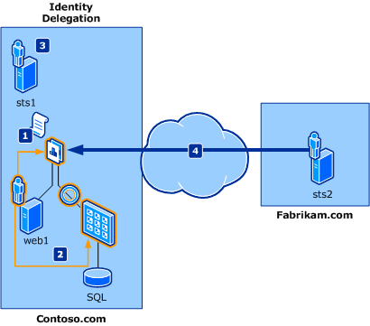

# Пример сценария делегирования, федерации и проверки подлинности в SharePoint
В этой статье приведены примеры сценариев для делегирования удостоверений и федерации удостоверений.
## Примеры сценариев

Следующие вымышленной компании и их сказано бизнес-потребности в используются примеры сценариев, описанные в этой статье:
  
    
    

- **Гибридные Contoso** — это международных автомобилей модуль питания компания занимается первоначальной электрический и на основе ячейки топлива гибридных обработчики для car производители внутри и за ее пределами США. В стратегических усилий в соответствии с частями, упорядочения требования клиентов ИТ-подразделения в домене Contoso получает задачу разработки и развертывания безопасных Интернет частей упорядочения приложения с помощью имени узла Contoso.com. Это приложение также необходимо задать несколько уровней доступа для различных внутренних пользователей (сотрудники) и внешних пользователей (сотрудников производитель автомобиль). Для сведения к минимуму затраты на обслуживание части, порядок приложения, ИТ также необходимо избежать необходимости для приложения, использование и обслуживание хранилища дополнительных учетных записей для внутренних и внешних пользователей для доступа к приложению.
    
  
- **Fabrikam моторов** является шведский производителя fuel-efficient compact автомобилей и небольшой автомобилей, по всему миру известно его точки низкой цены на гибридном автомобили. Несмотря на то, что продажи постоянно год за годом ускорением для Fabrikam, было заметно повысить на гибридный модуль сбоев в рамках их первого года в автомобилей, проданных клиентам. Fabrikam моторов на обслуживание стандартной для высокого уровня службы его необходимо реализовать более эффективный способ для части модуля гибридной для заказанных через гибридные Contoso.
    
  
Ниже перечислены связанные понятия.
  
    
    

- **Федерации удостоверений**. Описание установки федерации между гибридного Contoso и моторов Fabrikam, чтобы Fabrikam пользователей интерфейс единого входа при доступе к ресурсам гибридного Contoso.
    
  
- **Делегирование удостоверений**. Объясняет возможность доступа к ресурсам из Contoso гибридного веб-службы, который требует маркер ActAs; то есть служба требует идентификатор интерпретации абонентом (обычно удостоверение службы) и исходного пользователя, инициировавшего запрос (обычно идентификатор интерактивного пользователя).
    
  

## Делегирование удостоверений

В этом сценарии описывается приложение, которое требуется доступ к ресурсам сервера, которые требуют цепочки делегирования удостоверений для выполнения проверки контроля доступа. Цепочка делегирования простой удостоверения обычно состоит из сведения о исходного вызова и идентификатором непосредственно вызывающего метода. 
  
    
    
С помощью модели делегирования Kerberos на платформе Windows сегодня ресурсы серверной имеют доступ только к identity непосредственно вызывающего метода и не, начальной вызывающего абонента. В этой модели обычно называемую модель доверенной подсистемы. Windows Identity Foundation (WIF) сохраняет идентификатор исходного вызова и интерпретации вызывающего абонента в цепочке делегирования с помощью свойства  [Delegate()](https://msdn.microsoft.com/en-us/library/cc310252.aspx) .
  
    
    
На рисунке 1 показано сценарий делегирования типичного удостоверений, в котором сотрудников компании Fabrikam получает доступ к ресурсам, предоставляемые в приложении Contoso.com. **На рисунке 1. Вызов проверки подлинности федерации**

  
    
    

  
    
    

  
    
    
Сотрудников, участвующих в этом сценарии являются:
- Фрэнк: Fabrikam сотрудник, которому требуется доступ к ресурсам компании Contoso.
    
  
- Daniel: Contoso приложения разработчика, который реализует необходимые изменения в приложении.
    
  
- Режим ADAM: Contoso ИТ-администратор.
    
  
Компоненты, используемые в этом сценарии являются:
- Web1: веб-приложения со ссылками на серверной ресурсы, которые требуют делегированного удостоверения исходного вызова. Это приложение создается с ASP.NET.
    
  
- Веб-служба, которая обращается к компьютера под управлением Microsoft SQL Server, где требуется делегированного удостоверения начальной звонящего и непосредственно вызывающего метода. Эта служба построенных с помощью Windows Communication Foundation (WCF).
    
  
- sts1: служба маркеров безопасности (STS), который выполняет роль поставщика федерации и выдает утверждения, которые ожидаются приложением (web1). Она установила доверие с Fabrikam.com, а также с приложением.
    
  
- sts2: службы маркеров безопасности, который выполняет роль поставщика удостоверений для Fabrikam.com и, которая предоставляет конечную точку, для проверки подлинности используются сотрудников компании Fabrikam. Он устанавливает отношение доверия с Contoso.com, чтобы между сотрудниками компании Fabrikam могут получить доступ к ресурсам на Contoso.com.
    
  
Обратите внимание на то, что термин «Маркер ActAs» относится к маркер, выданный STS и, которая содержит удостоверение пользователя. Свойство  [Delegate()](https://msdn.microsoft.com/en-us/library/cc310252.aspx) содержит удостоверений службы маркеров безопасности.Как показано на рисунке 1 приведен поток в этом сценарии:
  
    
    

1. Contoso приложение настроено для получения маркера ActAs, содержащая идентификатор сотрудника компании Fabrikam и интерпретации вызывающей стороны в свойстве  [Delegate()](https://msdn.microsoft.com/en-us/library/cc310252.aspx) . Daniel реализует эти изменения к приложению.
    
  
2. Contoso приложение настроено для передачи маркера ActAs серверной службы. Daniel реализует эти изменения к приложению.
    
  
3. Веб-служба Contoso настроена для проверки маркера ActAs путем вызова sts1. Режим ADAM позволяет sts1 обработать запросы на передачу.
    
  
4. Пользователь Fabrikam Фрэнк осуществляет доступ к приложению Contoso и он получает доступ к ресурсам сервера.
    
  

## Федеративная проверка подлинности

Федеративная проверка подлинности позволяет Служба маркеров безопасности (STS) в одном домене доверия для предоставления сведения о проверке подлинности STS в другой домен доверия при отношение доверия между двумя доменами. В качестве примера показано на рисунке 2.
  
    
    

**На рисунке 2. Сценарий федерации на основе утверждений**

  
    
    

  
    
    

  
    
    

  
    
    

1. Клиент в доверенном домене Fabrikam отправляет запрос к приложению проверяющей стороны в домене Contoso доверия.
    
  
2. Для STS в домене Contoso доверия проверяющей стороны перенаправляет клиента. В этом службы маркеров безопасности не имеет сведений клиента.
    
  
3. Службы маркеров безопасности Contoso перенаправляет клиента на STS в домене Fabrikam доверия, с которым доверия домен Contoso имеет отношение доверия.
    
  
4. Fabrikam STS проверяет удостоверение клиента, а маркер безопасности для службы маркеров безопасности Contoso.
    
  
5. Службы маркеров безопасности Contoso использует маркер Fabrikam создание собственной маркер, который отправляет на проверяющей стороной.
    
  
6. Проверяющей стороной извлекает передавать утверждения клиента из маркер безопасности и используется для принятия решения проверки подлинности.
    
  
Этот сценарий описывает интерфейс входа для сотрудников партнеров, когда она пытается получить доступ к ресурсам домена другого партнера. Она должна вход только один раз. Существует три основных участников в сценарии интеграции: имя поставщика удостоверений, поставщик федерации и проверяющей стороной. WIF предлагает API-интерфейсы для построения всем три игры.На рисунке 3 показаны федерации типичного сценария, где требуется доступ к ресурсам Contoso.com без необходимости войдите сотрудников компании Fabrikam; то есть сотрудников компании Fabrikam хочет использовать единый вход. **На рисунке 3. Сценарий делегирования удостоверений на основе утверждений**

  
    
    

  
    
    

  
    
    
Сотрудников, участвующих в этом сценарии являются:
- Фрэнк: Fabrikam сотрудник, которому требуется доступ к ресурсам компании Contoso.
    
  
- Daniel: Contoso приложения разработчика, который реализует необходимые изменения в приложении.
    
  
- Режим ADAM: Contoso ИТ-администратор.
    
  
Компоненты, используемые в этом сценарии являются:
- Web1: A частей заказа веб-приложения, созданных с помощью ASP.NET и управляет доступом к соответствующие элементы.
    
  
- sts1: службы маркеров безопасности, который выполняет роль поставщика федерации в Contoso.com и выдает утверждения, которые ожидаются приложением (web1). Оно установлено отношение доверия с Fabrikam.com и разрешен доступ к между сотрудниками компании Fabrikam.
    
  
- sts2: службы маркеров безопасности, который выполняет роль поставщика удостоверений в Fabrikam.com и предоставляет конечную точку, к которой выполняется проверка подлинности сотрудников компании Fabrikam. Он устанавливает отношение доверия с Contoso.com, чтобы между сотрудниками компании Fabrikam могут получить доступ к ресурсам Contoso.com.
    
  
Как показано на рисунке 3 — поток в этом сценарии:
  
    
    

1. Администратор Contoso Adam настраивает отношения доверия между приложениями (проверяющая сторона) и sts1.
    
  
2. Администратор Contoso Adam настраивает отношение доверия с sts2 в качестве поставщика удостоверений.
    
  
3. Администратор компании Fabrikam Фрэнк настраивается отношение доверия с sts1 как поставщик федерации и затем обращается к приложения.
    
  

## См. также

-  [Удостоверение, основанное на утверждениях и концепций в SharePoint](claims-based-identity-and-concepts-in-sharepoint.md)
    
  
-  [Определения терминов идентификации на основе утверждений](claims-based-identity-term-definitions.md)
    
  

