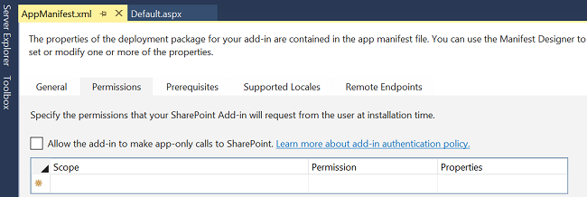

# <a name="search-add-ins-in-sharepoint"></a><span data-ttu-id="7e8fd-102">Надстройки поиска в SharePoint</span><span class="sxs-lookup"><span data-stu-id="7e8fd-102">Search add-ins in SharePoint</span></span>
<span data-ttu-id="7e8fd-p101">Сведения о поиска Надстройки SharePoint и как можно создавать свои собственные надстройки поиска. Надстройки, которые можно создать можно добавить к каталогу SharePoint надстройки, чтобы их можно использовать в локальном развертывании и Office 365. Надстройки поиска возможен только с данными, хранящимися в индексе поиска, а не исходного документа. Надстройки SharePoint — изолированная части функции, расширяющие возможности SharePoint веб-сайта. Эти надстройки путем интеграции с рекомендациями по SharePoint и веб-решения специфические потребности бизнеса и конечных пользователей. Надстройка может содержать различные элементы SharePoint, такие как списки, удаленных приемников событий, типов контента, рабочие процессы, настраиваемые действия рабочего процесса, столбцы сайта, модули, настраиваемые действия элемента меню, клиентского веб-частей и конфигурации поиска. Для получения дополнительных сведений см  [Надстройки SharePoint](http://msdn.microsoft.com/library/cd1eda9e-8e54-4223-93a9-a6ea0d18df70%28Office.15%29.aspx).</span><span class="sxs-lookup"><span data-stu-id="7e8fd-p101">Learn about search SharePoint Add-ins and how you can create your own search add-ins. The add-ins you create can be added to the SharePoint add-ins catalog so that they can be used in both on-premises deployment and Office 365. Search add-ins only work with data that is stored in the search index and not with the original source documents. SharePoint Add-ins are self-contained pieces of functionality that extend the capabilities of a SharePoint website. These add-ins solve specific business and end-user needs by integrating the best of the web and SharePoint. An add-in can contain various SharePoint elements like Lists, Remote Event Receivers, Content Types, Workflows, Workflow Custom Activities, Site Columns, Modules, Menu Item Custom Actions, Client Web Parts, and Search Configurations. For more information, see  [SharePoint Add-ins](http://msdn.microsoft.com/library/cd1eda9e-8e54-4223-93a9-a6ea0d18df70%28Office.15%29.aspx).</span></span>
  
    
    

<span data-ttu-id="7e8fd-109">Надстройка поиска — SharePoint надстройку в том, что использование функциональной возможности поиска.</span><span class="sxs-lookup"><span data-stu-id="7e8fd-109">A search add-in is an SharePoint Add-in that uses search functionality.</span></span> <span data-ttu-id="7e8fd-110">В надстройке поиска можно использовать интерфейс API поиска SharePoint для поиска контента.</span><span class="sxs-lookup"><span data-stu-id="7e8fd-110">In a search add-in, you can use the SharePoint Search API to locate content.</span></span> <span data-ttu-id="7e8fd-111">В зависимости от типа разрешения в [манифесте надстройки](http://msdn.microsoft.com/library/7cd5850f-cbf3-48d2-bcb7-59b8f4ed0e63%28Office.15%29.aspx)можно выполнить поиск внутри или за пределами содержимое надстройки.</span><span class="sxs-lookup"><span data-stu-id="7e8fd-111">Depending on the type of permissions set up in your [add-in manifest](http://msdn.microsoft.com/library/7cd5850f-cbf3-48d2-bcb7-59b8f4ed0e63%28Office.15%29.aspx), you can search either inside or outside the contents of the add-in.</span></span> <span data-ttu-id="7e8fd-112">Кроме того можно также использовать надстройки поиска для распространения конфигурации поиска с одной установки SharePoint в другую.</span><span class="sxs-lookup"><span data-stu-id="7e8fd-112">In addition, you can also use a search add-in to distribute search configurations from one SharePoint installation to another.</span></span>
<span data-ttu-id="7e8fd-113">Разработка основных надстройки поиска зависит от Выбор метода развертывания.</span><span class="sxs-lookup"><span data-stu-id="7e8fd-113">The core design of a search add-in depends on the deployment method that you choose.</span></span> <span data-ttu-id="7e8fd-114">В следующем разделе приводятся доступные параметры и их преимущества.</span><span class="sxs-lookup"><span data-stu-id="7e8fd-114">The following section summarizes the available options and their benefits.</span></span> <span data-ttu-id="7e8fd-115">Дополнительные сведения можно [выбрать шаблоны для разработки и размещения надстройки SharePoint](http://msdn.microsoft.com/library/05ce5435-0a03-4ddc-976b-c33b08d03457%28Office.15%29.aspx)</span><span class="sxs-lookup"><span data-stu-id="7e8fd-115">For more information, see  [Choose patterns for developing and hosting your SharePoint Add-in](http://msdn.microsoft.com/library/05ce5435-0a03-4ddc-976b-c33b08d03457%28Office.15%29.aspx)</span></span>
  
    
    


## <a name="deploy-your-search-add-ins"></a><span data-ttu-id="7e8fd-116">Развертывание надстройки поиска</span><span class="sxs-lookup"><span data-stu-id="7e8fd-116">Deploy your search add-ins</span></span>
<span data-ttu-id="7e8fd-117"><a name="SP15_Deploy_search_apps"> </a></span><span class="sxs-lookup"><span data-stu-id="7e8fd-117"></span></span>

<span data-ttu-id="7e8fd-118">Развертывание надстройки поиска двумя способами:</span><span class="sxs-lookup"><span data-stu-id="7e8fd-118">There are two ways to deploy your search add-in:</span></span>
  
    
    

1. <span data-ttu-id="7e8fd-p103">SharePoint hosted - локальное развертывание. Надстройка поиска размещается внутри корпоративной сети на серверах компании. Компании Администраторы управляют надстройки. Этот сценарий предлагает гибкие возможности развертывания и поддержки, так как к оборудованию и программному обеспечению локально поддерживается администраторами.</span><span class="sxs-lookup"><span data-stu-id="7e8fd-p103">SharePoint hosted - On-premises deployment. The search add-in is hosted inside the corporate network on the company's servers. The company's administrators manage the add-in. This scenario offers flexibility in deployment and support because the hardware and software is maintained locally by the administrators.</span></span>
    
  
2. <span data-ttu-id="7e8fd-p104">У поставщика - любой веб-сервере размещения. Надстройка поиска размещается с любым поставщиком, за пределами клиента SharePoint server.</span><span class="sxs-lookup"><span data-stu-id="7e8fd-p104">Provider hosted - Any web server hosting. The search add-in is hosted by any provider, outside of the customer's SharePoint server.</span></span> 
    
  

## <a name="search-add-in-development-environment"></a><span data-ttu-id="7e8fd-125">Среда разработки надстройки поиска</span><span class="sxs-lookup"><span data-stu-id="7e8fd-125">Search add-in development environment</span></span>
<span data-ttu-id="7e8fd-126"><a name="SP15_Search_app_dev_environment"> </a></span><span class="sxs-lookup"><span data-stu-id="7e8fd-126"></span></span>

<span data-ttu-id="7e8fd-127">Создание надстройки поиска, используйте один из этих двух средах:</span><span class="sxs-lookup"><span data-stu-id="7e8fd-127">To create a search add-in, use one of these two environments:</span></span>
  
    
    

- <span data-ttu-id="7e8fd-128">Microsoft Visual Studio 2012 или Microsoft Visual Studio 2013 или Visual Studio 2015</span><span class="sxs-lookup"><span data-stu-id="7e8fd-128">Microsoft Visual Studio 2012 or Microsoft Visual Studio 2013 or Visual Studio 2015</span></span>
    
  
- <span data-ttu-id="7e8fd-129">Средства разработки Napa для Office 365</span><span class="sxs-lookup"><span data-stu-id="7e8fd-129">Napa Office 365 Development Tools</span></span>
    
  
<span data-ttu-id="7e8fd-130">С помощью Visual Studio 2013 и более поздних версий можно опубликовать надстройки поиска в локальной или в Office 365.</span><span class="sxs-lookup"><span data-stu-id="7e8fd-130">With Visual Studio 2013 and later, you can publish your search add-ins to both on-premises or in Office 365.</span></span> <span data-ttu-id="7e8fd-131">Дополнительные сведения о средах разработки и как их использовать для создания надстроек поиска содержатся в разделе [Задание среды Общая разработка для SharePoint](set-up-a-general-development-environment-for-sharepoint.md).</span><span class="sxs-lookup"><span data-stu-id="7e8fd-131">For more information about the development environments and how to use them to create search add-ins, see  [Set up a general development environment for SharePoint](set-up-a-general-development-environment-for-sharepoint.md).</span></span>
  
    
    

## <a name="apis-for-search-add-ins"></a><span data-ttu-id="7e8fd-132">API-интерфейсы для поиска надстройки</span><span class="sxs-lookup"><span data-stu-id="7e8fd-132">APIs for search add-ins</span></span>
<span data-ttu-id="7e8fd-133"><a name="SP15_APIs_search_apps"> </a></span><span class="sxs-lookup"><span data-stu-id="7e8fd-133"></span></span>

<span data-ttu-id="7e8fd-134">Можно использовать широкий диапазон интерфейсов API, связанных с поиском, SharePoint предлагает для надстроек поиска. В следующей таблице перечислены эти интерфейсы API и место их библиотек классов.</span><span class="sxs-lookup"><span data-stu-id="7e8fd-134">You can use the wide range of search-related APIs that SharePoint offers for search add-ins. The following table lists these APIs and the location of their class libraries.</span></span>
  
    
    

<span data-ttu-id="7e8fd-135">**API-интерфейсов SharePoint для надстроек поиска**</span><span class="sxs-lookup"><span data-stu-id="7e8fd-135">**SharePoint APIs for Search add-ins**</span></span>


|<span data-ttu-id="7e8fd-136">**Имя API**</span><span class="sxs-lookup"><span data-stu-id="7e8fd-136">**API name**</span></span>|<span data-ttu-id="7e8fd-137">**Библиотека классов**</span><span class="sxs-lookup"><span data-stu-id="7e8fd-137">**Class library**</span></span>|
|:-----|:-----|
|<span data-ttu-id="7e8fd-138">Клиентская объектная модель .NET (CSOM)</span><span class="sxs-lookup"><span data-stu-id="7e8fd-138">.NET client object model (CSOM)</span></span>  <br/> |<span data-ttu-id="7e8fd-139">Microsoft.SharePoint.Client.Search.dll</span><span class="sxs-lookup"><span data-stu-id="7e8fd-139">Microsoft.SharePoint.Client.Search.dll</span></span>  <br/> |
|<span data-ttu-id="7e8fd-140">Silverlight CSOM</span><span class="sxs-lookup"><span data-stu-id="7e8fd-140">Silverlight CSOM</span></span>  <br/> |<span data-ttu-id="7e8fd-141">Microsoft.SharePoint.Client.Search.Silverlight.dll</span><span class="sxs-lookup"><span data-stu-id="7e8fd-141">Microsoft.SharePoint.Client.Search.Silverlight.dll</span></span>  <br/> |
|<span data-ttu-id="7e8fd-142">Объектная модель ECMAScript (JavaScript, JScript) (JSOM)</span><span class="sxs-lookup"><span data-stu-id="7e8fd-142">ECMAScript (JavaScript, JScript) object model (JSOM)</span></span>  <br/> |<span data-ttu-id="7e8fd-143">SP.search.js</span><span class="sxs-lookup"><span data-stu-id="7e8fd-143">SP.search.js</span></span>  <br/> |
|<span data-ttu-id="7e8fd-144">Поиск API-ИНТЕРФЕЙС REST</span><span class="sxs-lookup"><span data-stu-id="7e8fd-144">Search REST API</span></span>  <br/> |<span data-ttu-id="7e8fd-145">http://Server/_api/Search/Query</span><span class="sxs-lookup"><span data-stu-id="7e8fd-145">http://server/_api/search/query</span></span>  <br/> |
   

### <a name="code-examples"></a><span data-ttu-id="7e8fd-146">примеры кода</span><span class="sxs-lookup"><span data-stu-id="7e8fd-146">Code examples</span></span>

<span data-ttu-id="7e8fd-p106">Вот несколько примеров кода, с помощью различных интерфейсов API. Каждый пример кода отправляет запрос простой Поиск, который содержит ключевое слово "SharePoint " Приложение-служба поиска (SSA).</span><span class="sxs-lookup"><span data-stu-id="7e8fd-p106">Here are some code examples using the different APIs. Each code example sends a simple Search query that contains the keyword "SharePoint" to the Search service application (SSA).</span></span>
  
    
    
 <span data-ttu-id="7e8fd-149">**Client-side Object Model (CSOM)**</span><span class="sxs-lookup"><span data-stu-id="7e8fd-149">**Client-side Object Model (CSOM)**</span></span>
  
    
    

  
    
    


```cs

using (ClientContext clientContext = new ClientContext("http://localhost"))
{
    KeywordQuery keywordQuery = new KeywordQuery(clientContext);
    keywordQuery.QueryText = "*";
    SearchExecutor searchExecutor = new SearchExecutor(clientContext);
    ClientResult<ResultTableCollection> results = 
        searchExecutor.ExecuteQuery(keywordQuery);
    clientContext.ExecuteQuery();
}
```

 <span data-ttu-id="7e8fd-150">**JavaScript Object Model (JSOM)**</span><span class="sxs-lookup"><span data-stu-id="7e8fd-150">**JavaScript Object Model (JSOM)**</span></span>
  
    
    

  
    
    


```

var keywordQuery = new
Microsoft.SharePoint.Client.Search.Query.KeywordQuery(context);
keywordQuery.set_queryText('SharePoint');
var searchExecutor = new Microsoft.SharePoint.Client.Search.Query.SearchExecutor(context);
results = searchExecutor.executeQuery(keywordQuery);
context.executeQueryAsync(onQuerySuccess, onQueryFail);
```

 <span data-ttu-id="7e8fd-151">**REST**</span><span class="sxs-lookup"><span data-stu-id="7e8fd-151">**REST**</span></span>
  
    
    

  
    
    
<span data-ttu-id="7e8fd-152">HTTP-запрос GET</span><span class="sxs-lookup"><span data-stu-id="7e8fd-152">HTTP GET request</span></span>
  
    
    


```HTML

http://mylocalhost/_api/search/query?querytext='SharePoint'
```

<span data-ttu-id="7e8fd-153">HTTP-запрос POST</span><span class="sxs-lookup"><span data-stu-id="7e8fd-153">HTTP POST request</span></span>
  
    
    


```HTML
{
'__metadata' : {'type' : 'Microsoft.Office.Server.Search.REST.SearchRequest'},
'Querytext' : 'SharePoint'
}
```


## <a name="search-add-in-permissions"></a><span data-ttu-id="7e8fd-154">Добавить разрешения поиска</span><span class="sxs-lookup"><span data-stu-id="7e8fd-154">Search add-in permissions</span></span>
<span data-ttu-id="7e8fd-155"><a name="SP15_Search_app_permissions"> </a></span><span class="sxs-lookup"><span data-stu-id="7e8fd-155"></span></span>

<span data-ttu-id="7e8fd-p107">Надстройки поиска отправлять запросы запроса Приложение-служба поиска (SSA) и надстроек, требуют различных типов разрешений для правильной работы. Можно настроить эти разрешения с помощью надстройки файл манифеста, который является частью надстройки каждого SharePoint. Добавить в файл манифеста можно изменять напрямую с помощью текстового редактора или изменять его с Visual Studio или Napa, как показано на следующих рисунках.</span><span class="sxs-lookup"><span data-stu-id="7e8fd-p107">Search add-ins send query requests to the Search service application (SSA), and the add-ins require different types of permissions to function correctly. You can configure these permissions via the add-in manifest file, which is a part of each SharePoint add-in. You can modify the add-in manifest file directly with a text editor, or you can modify it with Visual Studio or Napa, as shown in the following figures.</span></span> 
  
    
    

<span data-ttu-id="7e8fd-159">**На рисунке 1: Установка разрешений для поиска надстроек в Visual Studio 2015**</span><span class="sxs-lookup"><span data-stu-id="7e8fd-159">**Figure 1: Setting up permissions for search add-ins in Visual Studio 2015**</span></span>

  
    
    

  
    
    

  
    
    

  
    
    

  
    
    

<span data-ttu-id="7e8fd-161">**На рисунке 2: Настройка разрешений для надстроек поиска в средства разработки «Napa» Office 365**</span><span class="sxs-lookup"><span data-stu-id="7e8fd-161">**Figure 2: Setting up permissions for search add-ins in "Napa" Office 365 Development Tools**</span></span>

  
    
    

  
    
    

  
    
    
<span data-ttu-id="7e8fd-p108">Надстройка SharePoint имеет свой собственный идентификатор, связанный с субъекта безопасности именем субъекта надстройки. Как пользователи и группы субъект надстройки имеет определенные разрешения и права. Субъект надстройки имеет права полного доступа add в веб-приложения, его необходимо только запрашивать разрешения на SharePoint ресурсы в другие расположения за пределами web надстройки, такие как семейств веб-сайтов или веб-сайт. В отличие от других Надстройки SharePoint надстройки поиска требуются только разрешения уровня пользователя, известных как **QueryAsUserIgnoreAppPrincipal**. Это разрешение позволяет запросов поиска надстройки на основе разрешений пользователя. Это означает, что поиск, возвращаются результаты, основанные на списки контроля доступа пользователя.</span><span class="sxs-lookup"><span data-stu-id="7e8fd-p108">An SharePoint Add-in has its own identity and is associated with a security principal, called an add-in principal. Like users and groups, an add-in principal has certain permissions and rights. The add-in principal has full control rights to the add-in web, so it only needs to request permissions to SharePoint resources in the host web or other locations outside the add-in web, such as site collections. Unlike other SharePoint Add-ins, a search add-in requires only user-level permissions, known as **QueryAsUserIgnoreAppPrincipal**. This permission lets you query the search add-in based on the user's permissions. This means that search results will be returned based on the user's ACLs.</span></span> 
  
    
    

### <a name="request-permissions-in-the-add-in-manifest-file"></a><span data-ttu-id="7e8fd-169">Запрашивать разрешения в файле манифеста надстройки</span><span class="sxs-lookup"><span data-stu-id="7e8fd-169">Request permissions in the add-in manifest file</span></span>

<span data-ttu-id="7e8fd-p109">Добавить в файл манифеста в формате XML и непосредственного редактирования. Для получения разрешений, создаваемом запроса, как показано в следующем примере:</span><span class="sxs-lookup"><span data-stu-id="7e8fd-p109">The add-in manifest file is in XML format and can be edited directly. To get permissions, you write a request, as shown in the following example:</span></span>
  
    
    

```XML

<AppPermissionRequests>
  <AppPermissionRequest Scope="http://sharepoint/search" Right="QueryAsUserIgnoreAppPrincipal" />
</AppPermissionRequests>
```


## <a name="additional-resources"></a><span data-ttu-id="7e8fd-172">Дополнительные ресурсы</span><span class="sxs-lookup"><span data-stu-id="7e8fd-172">Additional resources</span></span>
<span data-ttu-id="7e8fd-173"><a name="SP15_Search_app_addresources"> </a></span><span class="sxs-lookup"><span data-stu-id="7e8fd-173"></span></span>


-  [<span data-ttu-id="7e8fd-174">Надстройки SharePoint</span><span class="sxs-lookup"><span data-stu-id="7e8fd-174">SharePoint Add-ins</span></span>](http://msdn.microsoft.com/library/cd1eda9e-8e54-4223-93a9-a6ea0d18df70%28Office.15%29.aspx)
    
  
-  [<span data-ttu-id="7e8fd-175">Выбор шаблонов для разработки и размещения надстройки SharePoint</span><span class="sxs-lookup"><span data-stu-id="7e8fd-175">Choose patterns for developing and hosting your SharePoint Add-in</span></span>](http://msdn.microsoft.com/library/05ce5435-0a03-4ddc-976b-c33b08d03457%28Office.15%29.aspx)
    
  
-  [<span data-ttu-id="7e8fd-176">Разрешения для надстроек в SharePoint</span><span class="sxs-lookup"><span data-stu-id="7e8fd-176">Add-in permissions in SharePoint</span></span>](http://msdn.microsoft.com/library/5f7a8440-3c09-4cf8-83ec-c236bfa2d6c4%28Office.15%29.aspx)
    
  
-  [<span data-ttu-id="7e8fd-177">Типы политик авторизации надстроек в SharePoint</span><span class="sxs-lookup"><span data-stu-id="7e8fd-177">Add-in authorization policy types in SharePoint</span></span>](http://msdn.microsoft.com/library/124879c7-a746-4c10-96a7-da76ad5327f0%28Office.15%29.aspx)
    
  
-  [<span data-ttu-id="7e8fd-178">Важные аспекты архитектуры и разработки надстройки SharePoint</span><span class="sxs-lookup"><span data-stu-id="7e8fd-178">Important aspects of the SharePoint Add-in architecture and development landscape</span></span>](http://msdn.microsoft.com/library/ae96572b-8f06-4fd3-854f-fc312f7f2d88%28Office.15%29.aspx)
    
  
-  [<span data-ttu-id="7e8fd-179">Изучите структуру манифеста надстройки и пакет надстройки для SharePoint</span><span class="sxs-lookup"><span data-stu-id="7e8fd-179">Explore the app manifest structure and the package of a SharePoint Add-in</span></span>](http://msdn.microsoft.com/library/7cd5850f-cbf3-48d2-bcb7-59b8f4ed0e63%28Office.15%29.aspx)
    
  
-  [<span data-ttu-id="7e8fd-180">Добавление возможностей поиска для надстройки для SharePoint</span><span class="sxs-lookup"><span data-stu-id="7e8fd-180">Add search capabilities to your add-ins for SharePoint</span></span>](http://blogs.msdn.com/b/officeapps/archive/2013/05/30/add-search-capabilities-to-your-apps-for-sharepoint.aspx)
    
  
-  [<span data-ttu-id="7e8fd-181">Экспорт и импорт параметров конфигурации поиска в SharePoint</span><span class="sxs-lookup"><span data-stu-id="7e8fd-181">Exporting and importing search configuration settings in SharePoint</span></span>](exporting-and-importing-search-configuration-settings-in-sharepoint.md)
    
  
-  [<span data-ttu-id="7e8fd-182">Импорт и экспорт параметров конфигурации настраиваемого поиска в SharePoint (TechNet)</span><span class="sxs-lookup"><span data-stu-id="7e8fd-182">Export and import customized search configuration settings in SharePoint (TechNet)</span></span>](http://technet.microsoft.com/ru-ru/library/jj871675.aspx)
    
  

