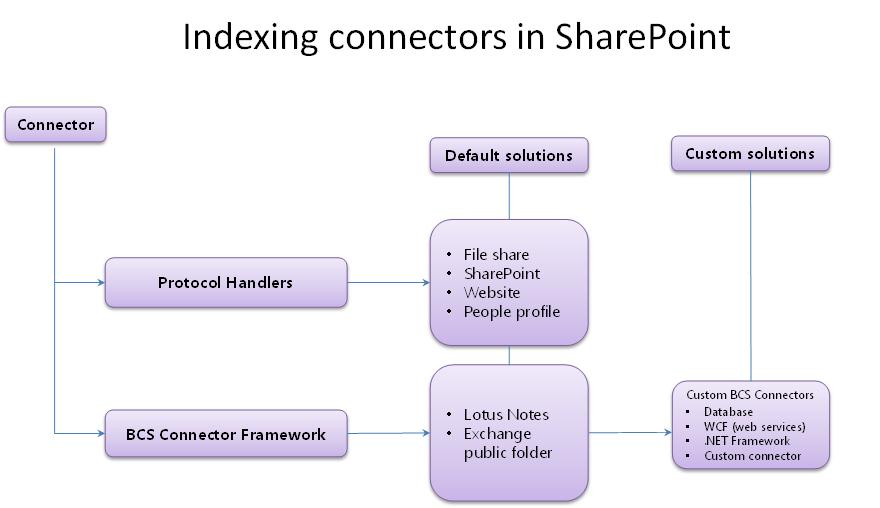
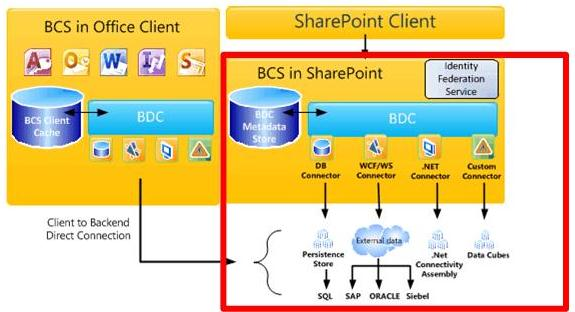

# Инфраструктура соединителей поиска в SharePoint
Сведения о SharePoint индексирования соединители, инфраструктурой соединителя и о способах создания настраиваемых BCS соединители индексации для поиска во внешних системах.
## Создание контента, доступного для поиска в SharePoint

Поиска в SharePoint предоставляет два подхода для обработки запросов для возвращения результатов поиска — федеративного поиска и обхода контента.
  
    
    
 **Федеративном поиске** В этом подходе результаты поиска возвращаются для контента, обход которого не выполнен с сервера поиска. Запрос перенаправляется к внешнему репозиторию контента, где он обрабатывается поисковой системы, репозитория. Поисковый механизм репозитория затем возвращает результаты на поисковый сервер. Сервер поиска форматирует и отображает результаты из внешнего хранилища для отображения на странице результатов поиска. Такой подход имеет следующие преимущества:
  
    
    

- Нет дополнительных мощностей требуется для индекса контента, поскольку не выполняется обход контента для поиска в SharePoint.
    
  
- Вы можете воспользоваться преимуществами существующих поисковый механизм репозитория. Например можно создать федерацию для поиска в Интернете для поиска в Интернете.
    
  
- Можно оптимизировать поисковую систему репозитория контента специально для хранящегося в нем набора контента, что позволит значительно повысить производительность этого набора.
    
  
- Можно получить доступ к репозиториям, которые защищены от обхода контента, но может осуществляться поисковых запросов.
    
  
 **Обход контента** В этот подход результаты возвращаются из индекса контента приложения службы поиска по запросу пользователя. Индекс контента содержит контент, для которого выполняется обход приложением-службой поиска и включает в себя текстовое содержимое и метаданные для каждого элемента контента. Такой подход позволяет:
  
    
    

- Сортировка результатов по релевантности.
    
  
- Управление частотой обновления индекса контента.
    
  
- Определение метаданных для обхода.
    
  
- Выполнение одной операции резервного копирования для контента, для которого выполнен обход.
    
  

## Обход контента с помощью индексации соединителей в SharePoint

Программа-обходчик использует соединители индексации для доступа к контенту для обхода. Соединитель indexing connector — компонент, который знает о подключении к источнику контента, что для обхода и как его обход. В более ранних версиях SharePoint эти были известны как обработчиков протоколов и компонентов, которые основаны на выполнение неуправляемого кода C++ пользовательских интерфейсов. 
  
    
    
Поиск в SharePoint включает connector framework, введенные в SharePoint Server 2010 и построен на Microsoft Business Connectivity Services (BCS), который предоставляет простой подход к разработке соединители индексации. С инфраструктурой соединителя программа-обходчик использует соединители индексации на основании BCS для обхода внешнего контента. SharePoint использует соединители индексации на основе обработчик протокола и соединители индексации BCS для обхода контента.
  
    
    
На рисунке 1 содержит общий обзор История соединителя индексации SharePoint.
  
    
    

  
    
    

  
    
    

  
    
    

  
    
    

## Обзор службы BCS для поиска в SharePoint

BCS является защиту средства и инфраструктуру, которая необходима для подключения к внешним системам с SharePoint. На рисунке 2 показано высокоуровневое представление архитектуры BCS с соответствующих областей поиска с выделением.
  
    
    

  
    
    

**На рисунке 2. Архитектура BCS, включая поиск**

  
    
    

  
    
    

  
    
    

  
    
    
BCS устанавливает подключение к внешним данным, на основе определения внешнего типа контента в хранилище метаданных. Хранилище метаданных содержит следующие сведения для внешнего типа контента:
  
    
    

- **Сведения о подключении** Описывается, как подключиться к внешней системе.
    
  
- **Сведения о сущности** Описывает структуру внешних данных.
    
  
- **Операции** Описываются методы, используемые для доступа к внешним данным. В случае баз данных и веб-служб, это, методы, поддерживаемые внешней системы: инструкции SQL для базы данных соединители и веб-методы для веб-служб. Для .NET и настраиваемые соединители индексации BCS это методов, реализованных в сборке соединителя, компонентом библиотеки DLL, создайте для соединителя индексации.
    
  
Эти сведения указана в файле модели BDC внешнего типа контента. Дополнительные сведения о модели BDC и их содержимое можно  [Инфраструктуры модели BDC](http://msdn.microsoft.com/library/2818ebdd-6cda-4d8f-82b2-7fde9fbf2633%28Office.15%29.aspx).
  
    
    
Для получения дополнительных сведений об архитектуре BCS и функциональные возможности видеть  [Business Connectivity Services Overview](http://msdn.microsoft.com/library/91dd7b01-ead2-4f87-804b-b59ef2245c87%28Office.15%29.aspx) и [Механизм из с помощью Business Connectivity Services](http://msdn.microsoft.com/library/ff3e312b-0fbc-48ed-a752-76c50d286533%28Office.15%29.aspx).
  
    
    

### С помощью инфраструктурой соединителя

Для обхода внешних данных, необходимо добавить один из типов источников контента, которые поддерживают подключение к внешним данным. В таблице 1 перечислены этих типов источников контента.
  
    
    

**В таблице 1. Типов источников контента, которые поддерживают индексирования соединители BCS**

|**Тип источника содержимого**|**Описание**|
|:-----|:-----|
|Бизнес-данные    |Использование этого источника контента для базы данных и веб-соединители индексации службы BCS.    |
|Настраиваемый репозиторий    |Использование этого источника контента для .NET и настраиваемые соединители индексации BCS.    |
   
Платформа соединителей позволяет создавать BCS индексирования соединителей для подключения к внешнего контента, который следует выполнить обход и включить в индекс контента. Соединитель индексации BCS используется программой-обходчиком для взаимодействия с внешнего источника данных. Во время обхода контента программа-обходчик вызывает соединителя индексации BCS для извлечения данных из внешней системы и передать его программы-обходчика. Соединитель индексации BCS также анализирует доступа поняты URL-адреса, поиска и идентификаторы, понятны BCS при их передаче между BCS и поиска во время обхода контента.
  
    
    
Соединители индексации BCS состоят из следующих:
  
    
    

  
    
    
> **Файл модели BDC** Файл, который содержит структуру данных и, который предоставляет данные для подключения к внешней системе.
    
  

  
    
    
> **Соединитель** Компонент, содержащий код, который подключается к внешней системе и анализ доступа идентификаторы URL-адреса и BCS.
    
  
Для BCS индексирования соединители на основе типов контента источника строки бизнес-данных поиска включает встроенные соединители, необходимо создать только файл модели BDC. 
  
    
    
Для соединителей индексации BCS на основе типов настраиваемый репозиторий источника контента необходимо разработать настраиваемый компонент в дополнение к файлу модели BDC для подключения к внешним данным.
  
    
    
На рисунке 3 показана высокоуровневая архитектура структуры соединителя поиска.
  
    
    

**На рисунке 3. Базовая архитектура соединителя поиска**

  
    
    

  
    
    

  
    
    

  
    
    

  
    
    

### Соединители индексации BCS

SharePoint поддерживает следующие типы BCS соединители индексирования:
  
    
    

- **Подключения к базе данных** SharePoint включает в себя предварительно определенные соединитель BCS, который поддерживает подключение к базам данных, чтобы вы могли создать соединителя индексации BCS базы данных без написания кода — только что создание файла модели BDC для соединителя.
    
  
- **Соединитель WCF (веб-служб)** SharePoint включает в себя предварительно определенные соединитель BCS, который поддерживает подключение к веб-служб, чтобы вы могли создать соединитель веб-службы BCS индексирования без написания кода — только что создание файла модели BDC для соединителя.
    
    > **Примечание:** Несмотря на то, что у вас нет писать код для создания соединителя для веб-служб, веб-службы необходимо включить методы, которые предоставляют те же функциональные возможности, который предоставляет соединитель .NET BCS для передачи внешних бизнес-данных BCS. Сведения о создании веб-службы можно [Создание сборки подключения .NET и веб-службы](http://msdn.microsoft.com/library/9a6c6712-868a-4a9c-9645-3aa448ad5092%28Office.15%29.aspx). Примеры кода в разделе [Образец Orders ASP.NET Web Service Sample](http://msdn.microsoft.com/library/10e46860-788f-4ed0-a4d8-1e17ada58e83%28Office.15%29.aspx) и [Пример Orders WCF Service Sample](http://msdn.microsoft.com/library/535277c8-9d5c-41eb-ab23-0ae141d726c5%28Office.15%29.aspx). 
- **Соединитель .NET BCS** SharePoint не включают предварительно заданных соединителя BCS для соединителей .NET, поэтому в дополнение к созданию BDC модели файла, необходимо также создать компонент .NET для соединителя индексации BCS. Необходимо реализовать необходимые стереотипные операции для поддержки обхода данных и реализации методов для синтаксического анализа доступа к данным и URL-адреса идентификаторы.
    
  
- **BCS настраиваемого соединителя** SharePoint не включает предопределенные соединитель BCS для настраиваемых соединителей .NET, в дополнение к Создание файла модели BDC, необходимо также создать компонент .NET для BCS, соединителе индексирования, как необходимо для соединителя .NET BCS. Необходимо реализовать необходимые стереотипные операции для поддержки обхода данных и реализации методов для синтаксического анализа доступа к данным и URL-адреса идентификаторы. Кроме того, необходимо реализовать интерфейс **ISystemUtility** .
    
  

## Построение соединители индексации BCS

При разработке соединителя индексации BCS — только что создаваемым файла модели BDC для базы данных и веб-службы индексирования соединители, или создание файла модели BDC и написания кода компонент соединителя BCS для .NET и настраиваемые соединители индексации, необходимо учитывать следующее:
  
    
    

- **Подключения к** Порядок подключения к репозиторию внешних данных, например, адрес сервера, IP-адрес или имя экземпляра базы данных. Также включает сведения о проверке подлинности, используемый для подключения к внешним данным репозитория.
    
  
- **Структура репозитория** Для чтения данных, соединитель должен знать, как организованы репозитория. — Это иерархическая, enumerical или имеет проходить ссылки?
    
  
- **Выполняет добавочный обход** Чтобы уменьшить нагрузку на хранилище внешних данных, присвойте соединителю возможность выполнять добавочные обходы контента в дополнение к полный обход. Для этого соединителя необходимо определить, какие данные были изменены с момента последнего обхода и иметь возможность выполнять обход содержимого только эти данные. Это можно сделать с помощью добавочного обхода контента на основе метки времени или обхода на основе журнала изменений. При реализации подход зависит от API-интерфейсы, предоставляемые репозитория и актуальности контента.
    
  
- **Обеспечение безопасности данных** В большинстве случаев не все данные доступны для всех пользователей. Важно, что это также работает с поиска, поэтому когда пользователь выполняет поиск с помощью пользовательского интерфейса поиска, пользователь может видеть только результаты он или она имеет доступ к. Это означает, что соединитель должен знать, как читать безопасности внешней системы и перенести эти сведения, связанные с безопасностью обратно во время обхода контента в индексе. Например можно реализовать во время обхода хранения Windows NT списки управления доступом (ACL).
    
  
В таблице 2 описываются стереотипные операции, которые применяются при создании соединителя индексации BCS для SharePoint.
  
    
    

**В таблице 2. BCS stereotyped операций, поддерживаемых службой поиска в SharePoint**

|**Operation**|**Описание**|
|:-----|:-----|
|Служба поиска    |Основные операции, необходимые при создании соединителя BCS. Эта операция извлекает список элементов внешнего источника контента. В разделе  [Реализация Finder](http://msdn.microsoft.com/library/a0cb7cfe-8758-4057-aa85-03071536745e%28Office.15%29.aspx).  |
|SpecificFinder    |Основные операции, необходимые при создании соединителя BCS. Эта операция получает отдельные элементы из внешнего источника контента. В разделе  [Реализация SpecificFinder](http://msdn.microsoft.com/library/9b6effa5-20ce-4ce7-a8dc-0fd601eb0f23%28Office.15%29.aspx).  |
|ChangedIdEnumerator    |Требуется реализовать добавочные обходы контента на основе журнала изменений. В разделе  [Реализация ChangedIdEnumerator](http://msdn.microsoft.com/library/19d3c942-f6d7-49e7-853f-4d9b61b10422%28Office.15%29.aspx).  |
|DeletedIdEnumerator    |Требуется реализовать добавочные обходы контента на основе журнала изменений. В разделе  [Реализация DeletedIdEnumerator](http://msdn.microsoft.com/library/aa1c521a-0c9b-4dc0-a32f-fb9e54c52bed%28Office.15%29.aspx).  |
|Binarysecuritydescriptoraccessor используется    |Требуется для реализации безопасности на уровне элементов. Возвращает дескриптор безопасности для элемента из внешнего источника контента. В разделе  [Реализация binarysecuritydescriptoraccessor используется](http://msdn.microsoft.com/library/6cf70490-dd3c-49cd-bb13-ed33e938435d%28Office.15%29.aspx).  |
|StreamAccessor    |Требуется, чтобы включить обход вложений из внешнего источника контента. Возвращает вложения как поток данных. В разделе  [Реализация StreamAccessor](http://msdn.microsoft.com/library/e3d8053b-90c0-4207-98e3-91e42db13cf1%28Office.15%29.aspx).  |
   

  
    
    

### Создание поддержку для разработки индексирования соединители BCS

Службы BCS предоставляют вспомогательных средств для соединителей BCS в SharePoint Designer и Visual Studio.
  
    
    

#### SharePoint Designer управляемых средствах для соединителей BCS

SharePoint Designer предоставляет ограниченный набор возможностей. его можно использовать для создания файлов модели для существующих типов соединителя BCS, таких как базы данных, веб-службы и соединители .NET BCS BDC. Вы также можно использовать для экспорта модели BDC файлы из одного приложения-службы BCS для другого приложения-службы BCS.
  
    
    

#### Visual Studio управляемых средствах для соединителей BCS

Visual Studio можно использовать для создания компонентов для соединителей .NET BCS и настраиваемые соединители BCS. Для соединителей .NET BCS Visual Studio предоставляет шаблон проекта модели подключения к бизнес-данным, который включает набор конструкторов и возможности управления кода для упрощения создания, отладки и развертывания компонента .NET и связанного файла модели BDC для соединителя .NET BCS. Нет соответствующего шаблона проекта для настраиваемых соединителей BCS.
  
    
    

## Улучшения Connector framework в SharePoint

В SharePoint connector framework поддерживает BCS соединителей получения сведения об утверждениях для контента, хранящегося в репозиториях, настраиваемый компонент внешних данных.
  
    
    
Connector framework также предоставляет улучшенные исключений записи и ведение журнала для помощи в устранении ошибки, обнаруженные во время обхода источников контента с помощью соединителей BCS.
  
    
    

## Дополнительные ресурсы

-  [Улучшение файла модели BDC для поиска в SharePoint](enhancing-the-bdc-model-file-for-search-in-sharepoint.md)
    
  
-  [SharePoint 2013: пример пользовательского соединителя индексирования служб BCS MyFileConnector](https://code.msdn.microsoft.com/sharepoint-2013-myfileconne-79d2ea26)
    
  
-  [Как: обход связанных внешних типов контента в SharePoint](how-to-crawl-associated-external-content-types-in-sharepoint.md)
    
  
-  [Как: обхода больших двоичных объектов (BLOB) в SharePoint](how-to-crawl-binary-large-objects-blobs-in-sharepoint.md)
    
  
-  [Как: обход связанных внешних типов контента в SharePoint](how-to-crawl-associated-external-content-types-in-sharepoint.md)
    
  
-  [Как: настройка безопасности на уровне элементов в SharePoint](how-to-configure-item-level-security-in-sharepoint.md)
    
  

