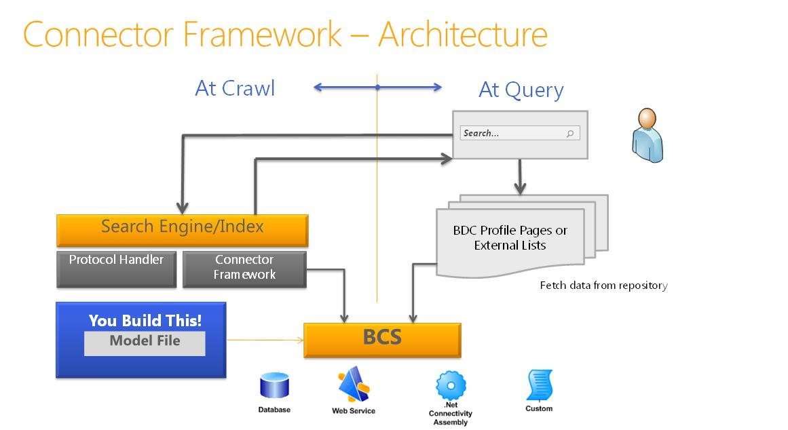

# Инфраструктура соединителей поиска в SharePointSearch connector framework in SharePoint
Сведения о SharePoint индексирования соединители, инфраструктурой соединителя и о способах создания настраиваемых BCS соединители индексации для поиска во внешних системах.Learn about the SharePoint indexing connectors, the connector framework, and how you can create custom BCS indexing connectors to search external systems.
## Создание контента, доступного для поиска в SharePointMaking content available for search in SharePoint

Поиска в SharePoint предоставляет два подхода для обработки запросов для возвращения результатов поиска — федеративного поиска и обхода контента.Search in SharePoint provides two approaches for processing queries to return search results—federated search and content crawling.
  
    
    
 **Федеративном поиске** В этом подходе результаты поиска возвращаются для контента, обход которого не выполнен с сервера поиска. Запрос перенаправляется к внешнему репозиторию контента, где он обрабатывается поисковой системы, репозитория. Поисковый механизм репозитория затем возвращает результаты на поисковый сервер. Сервер поиска форматирует и отображает результаты из внешнего хранилища для отображения на странице результатов поиска. Такой подход имеет следующие преимущества:**Federated search** In this approach, search results are returned for content that is not crawled by your search server. The query is forwarded to an external content repository where it is processed by that repository's search engine. The repository's search engine then returns the results to the search server. The search server formats and renders the results from the external repository to display on the search results page. This approach offers the following advantages:
  
    
    

- Нет дополнительных мощностей требуется для индекса контента, поскольку не выполняется обход контента для поиска в SharePoint.You require no additional capacity requirements for the content index, because content is not crawled by Search in SharePoint.
    
  
- Вы можете воспользоваться преимуществами существующих поисковый механизм репозитория. Например можно создать федерацию для поиска в Интернете для поиска в Интернете.You can take advantage of a repository's existing search engine. For example, you can federate to an Internet search engine to search the web.
    
  
- Можно оптимизировать поисковую систему репозитория контента специально для хранящегося в нем набора контента, что позволит значительно повысить производительность этого набора.You can optimize the content repository's search engine for the repository's specific set of content, which might provide better search performance on the content set.
    
  
- Можно получить доступ к репозиториям, которые защищены от обхода контента, но может осуществляться поисковых запросов.You can access repositories that are secured against crawls, but that can be accessed by search queries.
    
  
 **Обход контента** В этот подход результаты возвращаются из индекса контента приложения службы поиска по запросу пользователя. Индекс контента содержит контент, для которого выполняется обход приложением-службой поиска и включает в себя текстовое содержимое и метаданные для каждого элемента контента. Такой подход позволяет:**Content crawling** In this approach, results are returned from the Search service application's content index based on the user's query. The content index contains content that is crawled by the Search service application, and includes text content and metadata for each content item. This approach enables you to:
  
    
    

- Сортировка результатов по релевантности.Sort results by relevance.
    
  
- Управление частотой обновления индекса контента.Control how frequently the content index is updated.
    
  
- Определение метаданных для обхода.Specify what metadata is crawled.
    
  
- Выполнение одной операции резервного копирования для контента, для которого выполнен обход.Perform a single backup operation for crawled content.
    
  

## Обход контента с помощью индексации соединителей в SharePointCrawling content with indexing connectors in SharePoint

Программа-обходчик использует соединители индексации для доступа к контенту для обхода. Соединитель indexing connector — компонент, который знает о подключении к источнику контента, что для обхода и как его обход. В более ранних версиях SharePoint эти были известны как обработчиков протоколов и компонентов, которые основаны на выполнение неуправляемого кода C++ пользовательских интерфейсов.The crawler uses indexing connectors to access the content to crawl. The indexing connector is the component that knows how to connect to the content source, what to crawl, and how to crawl it. In earlier versions of SharePoint, these were known as protocol handlers, components that are based on custom interfaces running unmanaged C++ code. 
  
    
    
Поиск в SharePoint включает connector framework, введенные в SharePoint Server 2010 и построен на Microsoft Business Connectivity Services (BCS), который предоставляет простой подход к разработке соединители индексации.Search in SharePoint includes a connector framework, introduced in SharePoint Server 2010 and built on Microsoft Business Connectivity Services (BCS), which provides a simpler approach to developing indexing connectors. С инфраструктурой соединителя программа-обходчик использует соединители индексации на основании BCS для обхода внешнего контента.With the connector framework, the crawler uses indexing connectors based on BCS to crawl external content. SharePoint использует соединители индексации на основе обработчик протокола и соединители индексации BCS для обхода контента.SharePoint uses both protocol handler-based indexing connectors and BCS indexing connectors to crawl content.
  
    
    
На рисунке 1 содержит общий обзор История соединителя индексации SharePoint.Figure 1 provides a high-level overview of the SharePoint indexing connector story.
  
    
    

  
    
    

  
    
    

  
    
    

  
    
    

## Обзор службы BCS для поиска в SharePointBCS overview for Search in SharePoint

BCS является защиту средства и инфраструктуру, которая необходима для подключения к внешним системам с SharePoint. На рисунке 2 показано высокоуровневое представление архитектуры BCS с соответствующих областей поиска с выделением.BCS is the umbrella of tools and infrastructure that enables you to connect to external systems from SharePoint. Figure 2 shows a high-level view of the BCS architecture, with the relevant areas for Search highlighted.
  
    
    

  
    
    

**На рисунке 2. Архитектура BCS, включая поиск****Figure 2. BCS architecture including Search**

  
    
    

  
    
    

  
    
    

  
    
    
BCS устанавливает подключение к внешним данным, на основе определения внешнего типа контента в хранилище метаданных. Хранилище метаданных содержит следующие сведения для внешнего типа контента:BCS makes the connection to the external data based on the external content type definition in the metadata store. The metadata store contains the following information for an external content type:
  
    
    

- **Сведения о подключении** Описывается, как подключиться к внешней системе.**Connectivity information** Describes how to connect to the external system.
    
  
- **Сведения о сущности** Описывает структуру внешних данных.**Entity information** Describes the structure of the external data.
    
  
- **Операции** Описываются методы, используемые для доступа к внешним данным. В случае баз данных и веб-служб, это, методы, поддерживаемые внешней системы: инструкции SQL для базы данных соединители и веб-методы для веб-служб. Для .NET и настраиваемые соединители индексации BCS это методов, реализованных в сборке соединителя, компонентом библиотеки DLL, создайте для соединителя индексации.**Operations** Describes methods used to access the external data. In the case of databases and web services, these are methods supported by the external system: SQL statements for database connectors and web methods for web services. For .NET and custom BCS indexing connectors, these are methods that are implemented in the connector assembly, which is the component DLL you create for the indexing connector.
    
  
Эти сведения указана в файле модели BDC внешнего типа контента. Дополнительные сведения о модели BDC и их содержимое можно  [Инфраструктуры модели BDC](http://msdn.microsoft.com/library/2818ebdd-6cda-4d8f-82b2-7fde9fbf2633%28Office.15%29.aspx).This information is specified in the external content type's BDC model file. For more information about BDC models and what they contain, see  [BDC Model Infrastructure](http://msdn.microsoft.com/library/2818ebdd-6cda-4d8f-82b2-7fde9fbf2633%28Office.15%29.aspx).
  
    
    
Для получения дополнительных сведений об архитектуре BCS и функциональные возможности видеть  [Business Connectivity Services Overview](http://msdn.microsoft.com/library/91dd7b01-ead2-4f87-804b-b59ef2245c87%28Office.15%29.aspx) и [Механизм из с помощью Business Connectivity Services](http://msdn.microsoft.com/library/ff3e312b-0fbc-48ed-a752-76c50d286533%28Office.15%29.aspx).For details about BCS architecture and functionality, see  [Business Connectivity Services Overview](http://msdn.microsoft.com/library/91dd7b01-ead2-4f87-804b-b59ef2245c87%28Office.15%29.aspx) and [Mechanics of Using Business Connectivity Services](http://msdn.microsoft.com/library/ff3e312b-0fbc-48ed-a752-76c50d286533%28Office.15%29.aspx).
  
    
    

### С помощью инфраструктурой соединителяUsing the connector framework

Для обхода внешних данных, необходимо добавить один из типов источников контента, которые поддерживают подключение к внешним данным. В таблице 1 перечислены этих типов источников контента.To crawl external data, you have to add one of the content source types that support connecting to external data. Table 1 lists these content source types.
  
    
    

**В таблице 1. Типов источников контента, которые поддерживают индексирования соединители BCS****Table 1. Content source types that support BCS indexing connectors**

|**Тип источника содержимого****Content source type**|**Описание****Description**|
|:-----|:-----|
|Бизнес-данныеLine of Business Data    |Использование этого источника контента для базы данных и веб-соединители индексации службы BCS.Use this content source for database and web service BCS indexing connectors.    |
|Настраиваемый репозиторийCustom Repository    |Использование этого источника контента для .NET и настраиваемые соединители индексации BCS.Use this content source for .NET and custom BCS indexing connectors.    |
   
Платформа соединителей позволяет создавать BCS индексирования соединителей для подключения к внешнего контента, который следует выполнить обход и включить в индекс контента. Соединитель индексации BCS используется программой-обходчиком для взаимодействия с внешнего источника данных. Во время обхода контента программа-обходчик вызывает соединителя индексации BCS для извлечения данных из внешней системы и передать его программы-обходчика. Соединитель индексации BCS также анализирует доступа поняты URL-адреса, поиска и идентификаторы, понятны BCS при их передаче между BCS и поиска во время обхода контента.The connector framework enables you to create BCS indexing connectors to connect to external content that you want to crawl and include in the content index. The BCS indexing connector is used by the crawler to communicate with the external data source. At crawl time, the crawler calls the BCS indexing connector to fetch the data from the external system and pass it back to the crawler. The BCS indexing connector also parses the access URLs understood by Search and the identifiers understood by BCS as they are passed between BCS and Search during the crawl process.
  
    
    
Соединители индексации BCS состоят из следующих:BCS indexing connectors are composed of the following:
  
    
    

  
    
    
> **Файл модели BDC** Файл, который содержит структуру данных и, который предоставляет данные для подключения к внешней системе.**The BDC model file** The file that provides the structure of the data, and that provides connection information to the external system.
    
  

  
    
    
> **Соединитель** Компонент, содержащий код, который подключается к внешней системе и анализ доступа идентификаторы URL-адреса и BCS.**The connector** The component containing the code that connects to the external system and parses the access URLs and BCS identifiers.
    
  
Для BCS индексирования соединители на основе типов контента источника строки бизнес-данных поиска включает встроенные соединители, необходимо создать только файл модели BDC.For BCS indexing connectors based on the Line of Business Data content source types, Search includes built-in connectors, so you have to create only a BDC model file. 
  
    
    
Для соединителей индексации BCS на основе типов настраиваемый репозиторий источника контента необходимо разработать настраиваемый компонент в дополнение к файлу модели BDC для подключения к внешним данным.For BCS indexing connectors based on the Custom Repository content source types, you must develop a custom component in addition to a BDC model file to connect to the external data.
  
    
    
На рисунке 3 показана высокоуровневая архитектура структуры соединителя поиска.Figure 3 shows a high-level view of the search connector framework architecture.
  
    
    

**На рисунке 3. Базовая архитектура соединителя поиска****Figure 3. Search connector framework architecture**

  
    
    

  
    
    

  
    
    

  
    
    

  
    
    

### Соединители индексации BCSBCS indexing connectors

SharePoint поддерживает следующие типы BCS соединители индексирования:SharePoint supports the following types of BCS indexing connectors:
  
    
    

- **Подключения к базе данных** SharePoint включает в себя предварительно определенные соединитель BCS, который поддерживает подключение к базам данных, чтобы вы могли создать соединителя индексации BCS базы данных без написания кода — только что создание файла модели BDC для соединителя.**Database connector** SharePoint includes a predefined BCS connector that supports connecting to databases, so you can create a database BCS indexing connector without writing any code—just create the BDC model file for the connector.
    
  
- **Соединитель WCF (веб-служб)** SharePoint включает в себя предварительно определенные соединитель BCS, который поддерживает подключение к веб-служб, чтобы вы могли создать соединитель веб-службы BCS индексирования без написания кода — только что создание файла модели BDC для соединителя.**WCF (web services) connector** SharePoint includes a predefined BCS connector that supports connecting to web services, so you can create a web service BCS indexing connector without writing any code—just create the BDC model file for the connector.
    
    > **Примечание:** Несмотря на то, что у вас нет писать код для создания соединителя для веб-служб, веб-службы необходимо включить методы, которые предоставляют те же функциональные возможности, который предоставляет соединитель .NET BCS для передачи внешних бизнес-данных BCS.**Note:** Although you don't have to write code to create a connector for web services, the web service must include methods that provide the same functionality that the .NET BCS connector provides, to pass the external business data to BCS. Сведения о создании веб-службы можно [Создание сборки подключения .NET и веб-службы](http://msdn.microsoft.com/library/9a6c6712-868a-4a9c-9645-3aa448ad5092%28Office.15%29.aspx).For information about creating a web service, see  [Creating .NET Connectivity Assemblies and Web Services](http://msdn.microsoft.com/library/9a6c6712-868a-4a9c-9645-3aa448ad5092%28Office.15%29.aspx). Примеры кода в разделе [Образец Orders ASP.NET Web Service Sample](http://msdn.microsoft.com/library/10e46860-788f-4ed0-a4d8-1e17ada58e83%28Office.15%29.aspx) и [Пример Orders WCF Service Sample](http://msdn.microsoft.com/library/535277c8-9d5c-41eb-ab23-0ae141d726c5%28Office.15%29.aspx).For code examples, see  [Sample Orders ASP.NET Web Service Sample](http://msdn.microsoft.com/library/10e46860-788f-4ed0-a4d8-1e17ada58e83%28Office.15%29.aspx) and [Sample Orders WCF Service Sample](http://msdn.microsoft.com/library/535277c8-9d5c-41eb-ab23-0ae141d726c5%28Office.15%29.aspx). 
- **Соединитель .NET BCS** SharePoint не включают предварительно заданных соединителя BCS для соединителей .NET, поэтому в дополнение к созданию BDC модели файла, необходимо также создать компонент .NET для соединителя индексации BCS.**.NET BCS connector** SharePoint does not include a predefined BCS connector for .NET connectors, so in addition to creating a BDC model file, you must also create a .NET component for the BCS indexing connector. Необходимо реализовать необходимые стереотипные операции для поддержки обхода данных и реализации методов для синтаксического анализа доступа к данным и URL-адреса идентификаторы.You must implement the required stereotyped operations to support crawling the data, and implement methods for parsing the access URLs and BDC identifiers.
    
  
- **BCS настраиваемого соединителя** SharePoint не включает предопределенные соединитель BCS для настраиваемых соединителей .NET, в дополнение к Создание файла модели BDC, необходимо также создать компонент .NET для BCS, соединителе индексирования, как необходимо для соединителя .NET BCS.**Custom BCS connector** SharePoint does not include a predefined BCS connector for custom .NET connectors, so in addition to creating a BDC model file, you must also create a .NET component for the BCS indexing connector, just as you must for the .NET BCS connector. Необходимо реализовать необходимые стереотипные операции для поддержки обхода данных и реализации методов для синтаксического анализа доступа к данным и URL-адреса идентификаторы.You must implement the required stereotyped operations to support crawling the data, and implement methods for parsing the access URLs and BDC identifiers. Кроме того, необходимо реализовать интерфейс **ISystemUtility** .You must also implement the **ISystemUtility** interface.
    
  

## Построение соединители индексации BCSBuilding BCS indexing connectors

При разработке соединителя индексации BCS — только что создаваемым файла модели BDC для базы данных и веб-службы индексирования соединители, или создание файла модели BDC и написания кода компонент соединителя BCS для .NET и настраиваемые соединители индексации, необходимо учитывать следующее:When you develop a BCS indexing connector—whether you're just creating the BDC model file for database and web service indexing connectors, or creating the BDC model file and coding the BCS connector component for .NET and custom indexing connectors—you need to think about the following:
  
    
    

- **Подключения к** Порядок подключения к репозиторию внешних данных, например, адрес сервера, IP-адрес или имя экземпляра базы данных. Также включает сведения о проверке подлинности, используемый для подключения к внешним данным репозитория.**Connectivity** How to connect to the external data repository, for example, the server address, IP address, or database instance name. Also includes the authentication information used to connect to the external data repository.
    
  
- **Структура репозитория** Для чтения данных, соединитель должен знать, как организованы репозитория. — Это иерархическая, enumerical или имеет проходить ссылки?**Structure of repository** To read the data, the connector must know how the repository is organized. Is it hierarchical, enumerical, or does it have to traverse links?
    
  
- **Выполняет добавочный обход** Чтобы уменьшить нагрузку на хранилище внешних данных, присвойте соединителю возможность выполнять добавочные обходы контента в дополнение к полный обход. Для этого соединителя необходимо определить, какие данные были изменены с момента последнего обхода и иметь возможность выполнять обход содержимого только эти данные. Это можно сделать с помощью добавочного обхода контента на основе метки времени или обхода на основе журнала изменений. При реализации подход зависит от API-интерфейсы, предоставляемые репозитория и актуальности контента.**Incremental crawls** To reduce the performance load on the external data repository, give the connector the ability to do incremental crawls in addition to full crawls. For this, the connector must recognize what data has changed since the last crawl and be able to crawl only that data. This can be done by using a timestamp-based incremental crawl or a change log-based crawl. The approach you implement depends on the APIs provided by the repository and the freshness goals for the content.
    
  
- **Обеспечение безопасности данных** В большинстве случаев не все данные доступны для всех пользователей. Важно, что это также работает с поиска, поэтому когда пользователь выполняет поиск с помощью пользовательского интерфейса поиска, пользователь может видеть только результаты он или она имеет доступ к. Это означает, что соединитель должен знать, как читать безопасности внешней системы и перенести эти сведения, связанные с безопасностью обратно во время обхода контента в индексе. Например можно реализовать во время обхода хранения Windows NT списки управления доступом (ACL).**Securing data** In most scenarios, not all data is accessible to all users. It's important that this also works with search, so when a user searches by using the search UI, the user can see only the results he or she has access to. This means the connector must know how to read the security of the external system, and bring that security-related information back during the crawl into the index. For example, you could implement crawl-time storage of Windows NT access control lists (ACLs).
    
  
В таблице 2 описываются стереотипные операции, которые применяются при создании соединителя индексации BCS для SharePoint.Table 2 describes the stereotyped operations that apply when you create a BCS indexing connector for SharePoint.
  
    
    

**В таблице 2. BCS stereotyped операций, поддерживаемых службой поиска в SharePoint****Table 2. BCS stereotyped operations supported by Search in SharePoint**

|**Operation****Operation**|**Описание****Description**|
|:-----|:-----|
|Служба поискаFinder    |Основные операции, необходимые при создании соединителя BCS. Эта операция извлекает список элементов внешнего источника контента. В разделе  [Реализация Finder](http://msdn.microsoft.com/library/a0cb7cfe-8758-4057-aa85-03071536745e%28Office.15%29.aspx).Core operation required when creating a BCS connector. This operation retrieves the list of items of the external content source. See  [Implementing a Finder](http://msdn.microsoft.com/library/a0cb7cfe-8758-4057-aa85-03071536745e%28Office.15%29.aspx).    |
|SpecificFinderSpecificFinder    |Основные операции, необходимые при создании соединителя BCS. Эта операция получает отдельные элементы из внешнего источника контента. В разделе  [Реализация SpecificFinder](http://msdn.microsoft.com/library/9b6effa5-20ce-4ce7-a8dc-0fd601eb0f23%28Office.15%29.aspx).Core operation required when creating a BCS connector. This operation retrieves individual items from the external content source. See  [Implementing a SpecificFinder](http://msdn.microsoft.com/library/9b6effa5-20ce-4ce7-a8dc-0fd601eb0f23%28Office.15%29.aspx).    |
|ChangedIdEnumeratorChangedIdEnumerator    |Требуется реализовать добавочные обходы контента на основе журнала изменений. В разделе  [Реализация ChangedIdEnumerator](http://msdn.microsoft.com/library/19d3c942-f6d7-49e7-853f-4d9b61b10422%28Office.15%29.aspx).Required to implement changelog-based incremental crawls. See  [Implementing a ChangedIdEnumerator](http://msdn.microsoft.com/library/19d3c942-f6d7-49e7-853f-4d9b61b10422%28Office.15%29.aspx).    |
|DeletedIdEnumeratorDeletedIdEnumerator    |Требуется реализовать добавочные обходы контента на основе журнала изменений. В разделе  [Реализация DeletedIdEnumerator](http://msdn.microsoft.com/library/aa1c521a-0c9b-4dc0-a32f-fb9e54c52bed%28Office.15%29.aspx).Required to implement changelog-based incremental crawls. See  [Implementing a DeletedIdEnumerator](http://msdn.microsoft.com/library/aa1c521a-0c9b-4dc0-a32f-fb9e54c52bed%28Office.15%29.aspx).    |
|Binarysecuritydescriptoraccessor используетсяBinarySecurityDescriptorAccessor    |Требуется для реализации безопасности на уровне элементов. Возвращает дескриптор безопасности для элемента из внешнего источника контента. В разделе  [Реализация binarysecuritydescriptoraccessor используется](http://msdn.microsoft.com/library/6cf70490-dd3c-49cd-bb13-ed33e938435d%28Office.15%29.aspx).Required to implement item-level security. Returns the security descriptor for an item from the external content source. See  [Implementing a BinarySecurityDescriptorAccessor](http://msdn.microsoft.com/library/6cf70490-dd3c-49cd-bb13-ed33e938435d%28Office.15%29.aspx).    |
|StreamAccessorStreamAccessor    |Требуется, чтобы включить обход вложений из внешнего источника контента. Возвращает вложения как поток данных. В разделе  [Реализация StreamAccessor](http://msdn.microsoft.com/library/e3d8053b-90c0-4207-98e3-91e42db13cf1%28Office.15%29.aspx).Required to enable crawling of attachments from the external content source. Returns the attachment as a data stream. See  [Implementing a StreamAccessor](http://msdn.microsoft.com/library/e3d8053b-90c0-4207-98e3-91e42db13cf1%28Office.15%29.aspx).    |
   

  
    
    

### Создание поддержку для разработки индексирования соединители BCSTooling support for developing BCS indexing connectors

Службы BCS предоставляют вспомогательных средств для соединителей BCS в SharePoint Designer и Visual Studio.BCS provides tooling support for BCS connectors in SharePoint Designer and Visual Studio.
  
    
    

#### SharePoint Designer управляемых средствах для соединителей BCSSharePoint Designer tooling support for BCS connectors

SharePoint Designer предоставляет ограниченный набор возможностей. его можно использовать для создания файлов модели для существующих типов соединителя BCS, таких как базы данных, веб-службы и соединители .NET BCS BDC. Вы также можно использовать для экспорта модели BDC файлы из одного приложения-службы BCS для другого приложения-службы BCS.SharePoint Designer provides a limited set of capabilities; you can use it to create BDC model files for existing BCS connector types, such as database, web service, and .NET BCS connectors. You can also use it to export BDC model files from one BCS service application to another BCS service application.
  
    
    

#### Visual Studio управляемых средствах для соединителей BCSVisual Studio tooling support for BCS connectors

Visual Studio можно использовать для создания компонентов для соединителей .NET BCS и настраиваемые соединители BCS. Для соединителей .NET BCS Visual Studio предоставляет шаблон проекта модели подключения к бизнес-данным, который включает набор конструкторов и возможности управления кода для упрощения создания, отладки и развертывания компонента .NET и связанного файла модели BDC для соединителя .NET BCS. Нет соответствующего шаблона проекта для настраиваемых соединителей BCS.You can use Visual Studio to create the component for .NET BCS connectors and custom BCS connectors. For .NET BCS connectors, Visual Studio provides the Business Data Connectivity Model project template, which includes a set of visual designers and code management capabilities to enable you to more easily create, debug, and deploy the .NET component and the associated BDC model file for the .NET BCS connector. There is no corresponding project template for custom BCS connectors.
  
    
    

## Улучшения Connector framework в SharePointConnector framework enhancements in SharePoint

В SharePoint connector framework поддерживает BCS соединителей получения сведения об утверждениях для контента, хранящегося в репозиториях, настраиваемый компонент внешних данных.In SharePoint the connector framework supports BCS connectors retrieving claims information for content that is stored in custom external data repositories.
  
    
    
Connector framework также предоставляет улучшенные исключений записи и ведение журнала для помощи в устранении ошибки, обнаруженные во время обхода источников контента с помощью соединителей BCS.The connector framework also provides improved exception capturing and logging to help you troubleshoot errors encountered when crawling content sources by using BCS connectors.
  
    
    

## Дополнительные ресурсыAdditional resources

-  [Улучшение файла модели BDC для поиска в SharePointEnhancing the BDC model file for Search in SharePoint](enhancing-the-bdc-model-file-for-search-in-sharepoint.md)
    
  
-  [SharePoint 2013: пример пользовательского соединителя индексирования служб BCS MyFileConnectorSharePoint 2013: MyFileConnector custom BCS indexing connector sample](https://code.msdn.microsoft.com/sharepoint-2013-myfileconne-79d2ea26)
    
  
-  [Как: обход связанных внешних типов контента в SharePointHow to: Crawl associated external content types in SharePoint](how-to-crawl-associated-external-content-types-in-sharepoint.md)
    
  
-  [Как: обхода больших двоичных объектов (BLOB) в SharePointHow to: Crawl binary large objects (BLOBs) in SharePoint](how-to-crawl-binary-large-objects-blobs-in-sharepoint.md)
    
  
-  [Как: обход связанных внешних типов контента в SharePointHow to: Crawl associated external content types in SharePoint](how-to-crawl-associated-external-content-types-in-sharepoint.md)
    
  
-  [Как: настройка безопасности на уровне элементов в SharePointHow to: Configure item-level security in SharePoint](how-to-configure-item-level-security-in-sharepoint.md)
    
  

