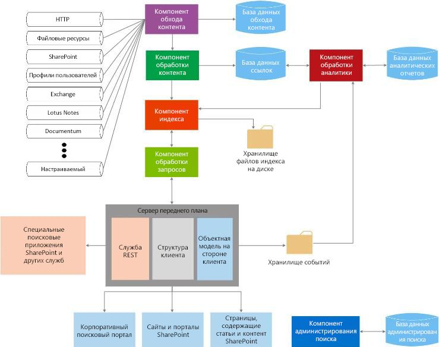

# Поиск в SharePoint
Информация о расширяемости стандартных блоков в Поиск в SharePoint и об их использовании в подходящих для вас вариантах использования. Поиск в SharePoint позволяет пользователям еще легче и быстрее находить необходимую информацию и облегчает настройку возможностей поиска для администраторов поиска. Кроме того, он предоставляет несколько наборов интерфейсов API для расширенной настройки и решений.
  
    
    

Перед тем как продолжить рекомендуем более детально ознакомиться с общими концепциями разработки SharePoint, которые представлены в следующих статьях:
-  [Настройка общей среды разработки для SharePoint](set-up-a-general-development-environment-for-sharepoint.md)
    
  
-  [Выбор правильного набора API в SharePoint](choose-the-right-api-set-in-sharepoint.md)
    
  
-  [Сравнение надстроек SharePoint с решениями SharePoint](sharepoint-add-ins-compared-with-sharepoint-solutions.md)
    
  
-  [Выбор между надстройки SharePoint и решений SharePoint](deciding-between-sharepoint-add-ins-and-sharepoint-solutions.md)
    
  

## Общие сведения об архитектуре поиска

Поиск в SharePoint включает широкий ряд усовершенствований и новых функций. В этой версии Поиск в SharePoint реорганизован в единую корпоративную поисковую платформу. Архитектура поиска включает следующие области:
  
    
    

-  [Обход и обработка контента](#bk_crawl);
    
  
-  [Индекс](#bk_index);
    
  
-  [Обработка запросов](#bk_query);
    
  
-  [Администрирование поиска](#bk_searchadmin);
    
  
-  [Аналитика](#bk_analytics).
    
  
Эти области состоят из компонентов и баз данных, которые слаженно работают, чтобы выполнить операцию поиска. На рис. 1 представлен общий вид различных областей архитектуры поиска и внутренние компоненты и базы данных, чья слаженная работа направлена на выполнение операции поиска. 
  
    
    

**Рис. 1. Взаимодействие компонентов поиска**

  
    
    

  
    
    

  
    
    
Более подробное представление доступно в [разделе "Поиск" на странице с техническими графиками](http://technet.microsoft.com/ru-RU/library/cc263199.aspx#search) и статье [Обзор поиска в SharePoint](http://technet.microsoft.com/ru-RU/library/jj219738.aspx).
  
    
    

### Обход и обработка контента

Архитектура обхода и обработки контента включает представленные ниже компоненты.
  
    
    
 **Компонент обхода контента**
  
    
    
 Выполняет обход контента, собирает свойства для обхода и метаданные из обойденных элементов и отправляет их в компонент обработки контента.
  
    
    
 **База данных обхода**
  
    
    
Содержит информацию об обойденных элементах, например, последнее время обхода контента, идентификатор последнего обхода и тип обновления во время последнего обхода.
  
    
    
 **Компонент обработки контента**
  
    
    
Обходит источники контента, чтобы собрать свойства для обхода и метаданные из обойденных компонентов, и отправляет эту информацию в компонент индексирования.
  
    
    

### Указатель

Компонент индексирования получает от компонента обработки контента обработанные элементы и записывает их в индекс поиска. Кроме того, этот компонент обрабатывает входящие запросы, получает информацию от поисковых индексов и отправляет набор результатов обратно компоненту обработки контента.
  
    
    

### Обработка запросов

Компонент обработки запросов анализирует и обрабатывает поисковые запросы и результаты. Затем обработанный запрос отправляется в компонент индексирования, который возвращает набор результатов поиска для данного запроса.
  
    
    

### Администрирование поиска

Администрирование поиска состоит из компонента администрирования поиска и соответствующей базы данных.
  
    
    
 **Компонент администрирования поиска**
  
    
    
Запускает системные процессы поиска, а также добавляет и инициализирует новые экземпляры компонентов поиска.
  
    
    
 **База данных администрирования поиска**
  
    
    
Сохраняет данные конфигурации поиска.
  
    
    

### Аналитика

Структура аналитики состоит из компонента обработки аналитики, базы данных отчетности аналитики и базу данных ссылок.
  
    
    
 **Компонент обработки аналитики**
  
    
    
Выполняет анализ поиска и использования.
  
    
    
 **База данных ссылок**
  
    
    
Хранит информацию, извлеченную компонентом обработки контента, и информацию по поисковым переходам.
  
    
    
 **База данных отчетности аналитики**
  
    
    
Хранит результаты использования аналитики.
  
    
    
 **Хранилище событий**
  
    
    
Хранит события использования, которые захвачены на внешнем интерфейсе.
  
    
    

## Точки расширения поиска

Архитектура Поиск в SharePoint предоставляет несколько точек расширения для поддержки сценариев настройки. В этом разделе описаны эти точки и показано, где можно найти дополнительную информацию о разработке для этих сценариев.
  
    
    

### Инфраструктура компонентов

Компонент обхода обходит контент, вызывая соединителей или обработчиков протоколов, которые взаимодействуют с источниками контента, чтобы получить данные. Поиск в SharePoint включает инфраструктуру компонентов, которую можно использовать для настройки и создания соединителей для обхода новых источников контента. Более подробную информацию об архитектуре инфраструктуры компонентов и способах ее расширения можно узнать в статье  [Инфраструктура соединителей поиска в SharePoint](search-connector-framework-in-sharepoint.md).
  
    
    

### Настройка обработки контента

В компоненте обработки контента вы можете использовать выноски веб-службы обогащения контента, чтобы изменить управляемые свойства обходимых элементов перед тем, как они будут добавлены в индекс поиска. Эта выноска веб-службы обращается к любой созданной вами внешней веб-службе обогащения содержимого. Более подробную информацию можно узнать в статье  [Нестандартная обработка контента с использованием выноски веб-службы "Обогащение контента"](custom-content-processing-with-the-content-enrichment-web-service-callout.md). С пошаговой реализацией веб-службы обогащения контента можно ознакомиться в статье  [Как: используйте вызов повышения качества контента веб-службы для SharePoint Server](how-to-use-the-content-enrichment-web-service-callout-for-sharepoint-server.md). Также полезна будет запись блога  [Настройка поиска SharePoint с помощью веб-службы обогащения содержимого](http://blogs.msdn.com/b/sharepointdev/archive/2012/11/13/customize-the-sharepoint-search-experience-with-a-content-enrichment-web-service.aspx).
  
    
    

### Интерфейсы API запроса

Поиск в SharePoint предусматривает несколько интерфейсов API запроса, которые предоставляют множество способов доступа к результатам поиска, чтобы вы могли вернуть различные типы пользовательских решений.
  
    
    
В таблице 1 показаны интерфейсы API, которые вы можете использовать для программирования Поиск в SharePoint, и их расположение.
  
    
    

**Таблица 1. Поисковые интерфейсы API**

|**Имя API**|**Библиотека или схема классов и путь**|
|:-----|:-----|
|Клиентская объектная модель .NET (CSOM)    |Microsoft.SharePoint.Client.Search.dll  %ProgramFiles%\\Common Files\\Microsoft Shared\\web server extensions\\15\\ISAPI    |
|Silverlight CSOM    |Microsoft.SharePoint.Client.Search.Silverlight.dll  %ProgramFiles%\\Common Files\\Microsoft Shared\\web server extensions\\15\\TEMPLATE\\LAYOUTS\\ClientBin    |
|JavaScript CSOM    |SP.search.js  %ProgramFiles%\\Common Files\\Microsoft Shared\\web server extensions\\15\\TEMPLATE\\LAYOUTS    |
|Конечные точки службы передачи репрезентативного состояния (REST)    |http://server/_api/search/query  http://server/_api/search/suggest    |
|Объектная модель сервера    |Microsoft.Office.Server.Search.dll  %ProgramFiles%\\Common Files\\Microsoft Shared\\web server extensions\\15\\ISAPI    |
   
Дополнительные сведения см. в статье [Использование API поисковых запросов в SharePoint](using-the-sharepoint-search-query-apis.md).
  
    
    

### Аналитика

Для определения и обработки контента, который пользователи считают наиболее полезным и релевантным, компонент обработки аналитики анализирует как сам контент, так и способ взаимодействия с ним пользователей. Данный анализ выполняется согласно заданиям таймера, которые отвечают за выполнение анализа задач жизненного цикла, таких как запуск, остановка, приостановка и возобновление анализа при необходимости. Этими заданиями таймера можно управлять через пространство имен [Microsoft.Office.Server.Search.Analytics](https://msdn.microsoft.com/library/Microsoft.Office.Server.Search.Analytics.aspx). Подробные сведения об аналитике в SharePoint см. в статье [Обзор обработки аналитических данных в SharePoint](http://technet.microsoft.com/ru-RU/library/jj219554.aspx).
  
    
    

### Специальные модели ранжирования

Результаты поиска можно упорядочить разными способами, например по значению ранга. Значения ранга вычисляются поисковой системой с использованием моделей ранжирования. По умолчанию SharePoint предоставляет четырнадцать моделей ранжирования. Но если вас не устраивает то, как упорядочены результаты поиска, вы можете использовать специальные модели ранжирования. Дополнительные сведения о процессе создания специальной модели ранжирования и ее настройке см. в статье [Настройка моделей ранжирования для улучшения релевантности в SharePoint](customizing-ranking-models-to-improve-relevance-in-sharepoint.md).
  
    
    

### Специальная фильтрация по ролям безопасности

При поиске в SharePoint выполняется фильтрация результатов поиска по ролям безопасности, которая основана на удостоверении пользователя, отправившего запрос, и времени запроса, при этом используются данные безопасности, полученные от компонента обхода контента. Однако в некоторых случаях вам может потребоваться реализовать специальную фильтрацию по ролям безопасности. Для выполнения этой задачи в SharePoint доступны два интерфейса: [ISecurityTrimmerPre](https://msdn.microsoft.com/library/Microsoft.Office.Server.Search.Query.ISecurityTrimmerPre.aspx) и [ISecurityTrimmerPost](https://msdn.microsoft.com/library/Microsoft.Office.Server.Search.Query.ISecurityTrimmerPost.aspx).
  
    
    
Интерфейс предварительной фильтрации (**ISecurityTrimmerPre**) выполняет оценку до обработки запроса, при этом прежде чем поисковый запрос будет сопоставлен с индексом поиска, в него добавляются данные безопасности. Интерфейс последующей фильтрации (**ISecurityTrimmerPost**) выполняет оценку после обработки запроса, при которой некоторые результаты поиска убираются, после чего пользователю возвращаются остальные. Дополнительные сведения об этих двух интерфейсах см. в статье [Специальная фильтрация по ролям безопасности, настраиваемая для поиска в SharePoint](custom-security-trimming-for-search-in-sharepoint-server.md). Пошаговые инструкции по реализации интерфейса триммера безопасности см. в статье [Применение специального триммера безопасности к результатам поиска SharePoint Server](how-to-use-a-custom-security-trimmer-for-sharepoint-server-search-results.md).
  
    
    

### Веб-часть "Поиск контента"

Веб-часть поиска контента  это веб-часть, которая может отображать динамический контент, который ранее был обойден и добавлен в индекс поиска. Каждый экземпляр веб-части связан с индексом поиска и отображает результаты для данного конкретного запроса. Когда пользователи просматривают страницу, которая содержит веб-часть поиска контента, автоматически выдается поисковый запрос, и от индекса поиска возвращаются результаты поиска. Вы можете использовать веб-часть поиска контента когда угодно, чтобы отобразить контент, который заполняется автоматически созданными поисковыми запросами. В некоторых случаях вам может потребоваться расширить веб-часть поиска контента, которую можно изменить через пространство имен  [Microsoft.Office.Server.Search.WebControls](https://msdn.microsoft.com/library/Microsoft.Office.Server.Search.WebControls.aspx) как [ContentBySearchWebPart](https://msdn.microsoft.com/library/Microsoft.Office.Server.Search.WebControls.ContentBySearchWebPart.aspx) . Информацию о том, как расширить [ContentBySearchWebPart](https://msdn.microsoft.com/library/Microsoft.Office.Server.Search.WebControls.ContentBySearchWebPart.aspx) , чтобы веб-часть распознала пользовательские свойства, можно узнать в статье [Сегментация пользователей в SharePoint](user-segmentation-in-sharepoint.md).
  
    
    

### Мобильные приложения, ориентированные на поиск, для которых используются интерфейсы REST, обеспечивающие навигацию и ведение журнала событий

В SharePoint доступны два новых интерфейса REST — интерфейсы навигации и ведения журнала событий. Вы можете использовать их для создания мобильных приложений, ориентированных на поиск, для мобильных устройств, например телефонов и планшетов, работающих под управлением операционной системы, отличной от Windows. Эта функция позволяет отображать на мобильном устройстве каталог продукции не через мобильный канал, а другим способом. Подробный пример создания такого приложения описан в статье [Создание мобильных приложений, ориентированных на поиск, для которых используются интерфейсы REST, обеспечивающие навигацию и ведение журнала событий](how-to-build-search-driven-mobile-apps-with-the-navigation-and-event-logging-res.md).
  
    
    

## В этой статье

-  [Новые возможности поиска в SharePoint для разработчиков (en)](what-s-new-in-sharepoint-search-for-developers.md)
    
  
-  [Поиск по новому контенту с поиска SharePoint](searching-new-content-with-sharepoint-search.md)
    
  
-  [Настройка службы поиска в SharePoint](configure-search-in-sharepoint.md)
    
  
-  [Построение запросов поиска в SharePoint](building-search-queries-in-sharepoint.md)
    
  
-  [Общие сведения об API службы поиска REST для SharePoint](sharepoint-search-rest-api-overview.md)
    
  
-  [Настройка результатов поиска в SharePoint](customizing-search-results-in-sharepoint.md)
    
  
-  [Сортировка результатов поиска в SharePoint](sorting-search-results-in-sharepoint.md)
    
  
-  [Настройка моделей ранжирования для улучшения релевантности в SharePoint](customizing-ranking-models-to-improve-relevance-in-sharepoint.md)
    
  
-  [Специальная фильтрация по ролям безопасности, настраиваемая для поиска в SharePoint](custom-security-trimming-for-search-in-sharepoint-server.md)
    
  
-  [Экспорт и импорт параметров конфигурации поиска в SharePoint](exporting-and-importing-search-configuration-settings-in-sharepoint.md)
    
  

## Дополнительные ресурсы

-  [Отличия SharePoint 2010 от SharePoint](http://technet.microsoft.com/ru-RU/library/ff607742.aspx)
    
  
-  [Технические графики, раздел "Поиск"](http://technet.microsoft.com/ru-RU/library/cc263199.aspx#search)
    
  
-  [Добавление возможностей SharePoint](add-sharepoint-capabilities.md)
    
  
