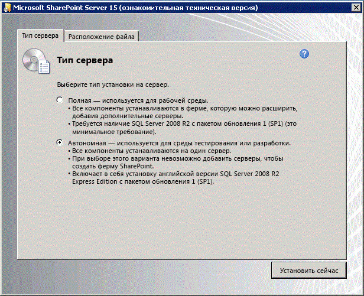

# <a name="set-up-a-general-development-environment-for-sharepoint"></a><span data-ttu-id="fbb5a-103">Настройка общей среды разработки для SharePoint</span><span class="sxs-lookup"><span data-stu-id="fbb5a-103">Set up a general development environment for SharePoint</span></span>
<span data-ttu-id="fbb5a-104">Сведения о настройке среды разработки SharePoint с помощью установки SharePoint и Visual Studio.</span><span class="sxs-lookup"><span data-stu-id="fbb5a-104">Learn the steps to set up a SharePoint development environment by installing SharePoint and Visual Studio.</span></span>
## <a name="how-to-determine-the-sharepoint-development-environment-you-need"></a><span data-ttu-id="fbb5a-105">Как определить подходящую среду разработки SharePoint</span><span class="sxs-lookup"><span data-stu-id="fbb5a-105">How to determine the SharePoint development environment you need</span></span>
<span data-ttu-id="fbb5a-106"><a name="SP15_bk_determinedevenv"> </a></span><span class="sxs-lookup"><span data-stu-id="fbb5a-106"><a name="SP15_bk_determinedevenv"> </a></span></span>

<span data-ttu-id="fbb5a-107">Сначала следует решить, что именно вы хотите разработать (дополнительные сведения о Надстройки SharePoint см. в статье  [Надстройки SharePoint](http://msdn.microsoft.com/library/cd1eda9e-8e54-4223-93a9-a6ea0d18df70%28Office.15%29.aspx)).</span><span class="sxs-lookup"><span data-stu-id="fbb5a-107">First, decide what you want to build (to learn more about SharePoint Add-ins, see  [SharePoint Add-ins](http://msdn.microsoft.com/library/cd1eda9e-8e54-4223-93a9-a6ea0d18df70%28Office.15%29.aspx)):</span></span>
  
    
    

- <span data-ttu-id="fbb5a-108">Если вы хотите разработать решения ферм, следуйте инструкциям в этой статье.</span><span class="sxs-lookup"><span data-stu-id="fbb5a-108">If you want to build farm solutions, we provide those steps in this article.</span></span> 
    
  
- <span data-ttu-id="fbb5a-109">Если вы хотите создать Надстройки SharePoint, см. статью  [Средства и среды для разработки надстроек для SharePoint](http://msdn.microsoft.com/library/6906eb86-8270-4098-8106-1e8d0d3c212e%28Office.15%29.aspx).</span><span class="sxs-lookup"><span data-stu-id="fbb5a-109">If you want to create SharePoint Add-ins, see  [Tools and environments for developing SharePoint Add-ins](http://msdn.microsoft.com/library/6906eb86-8270-4098-8106-1e8d0d3c212e%28Office.15%29.aspx).</span></span> 
    
  

## <a name="create-a-sharepoint-development-environment-on-a-microsoft-azure-virtual-machine"></a><span data-ttu-id="fbb5a-110">Создание среды разработки SharePoint в виртуальной машине Microsoft Azure</span><span class="sxs-lookup"><span data-stu-id="fbb5a-110">Create a SharePoint development environment on a Microsoft Azure virtual machine</span></span>
<span data-ttu-id="fbb5a-111"><a name="SP15_bk_devenvazure"> </a></span><span class="sxs-lookup"><span data-stu-id="fbb5a-111"><a name="SP15_bk_devenvazure"> </a></span></span>

<span data-ttu-id="fbb5a-112">Если у вас есть подписка на MSDN, вы можете быстро подготовить виртуальную машину в Azure.</span><span class="sxs-lookup"><span data-stu-id="fbb5a-112">If you have an MSDN subscription, you can quickly provision a virtual machine in Azure.</span></span>
  
    
    
<span data-ttu-id="fbb5a-113">Если вы еще не воспользовались преимуществами Microsoft Azure, которые дает подписка MSDN, вы можете узнать об этом больше в статье о  [преимуществах Microsoft Azure для подписчиков MSDN](http://azure.microsoft.com/ru-RU/pricing/member-offers/msdn-benefits/).</span><span class="sxs-lookup"><span data-stu-id="fbb5a-113">If you haven't activated the Microsoft Azure benefit that comes with your MSDN subscription, you can learn more about it at  [Microsoft Azure Benefit for MSDN Subscribers](http://azure.microsoft.com/ru-RU/pricing/member-offers/msdn-benefits/).</span></span>
  
> [!NOTE]
> <span data-ttu-id="fbb5a-114">В коллекции образов Microsoft Azure больше нет образов с предустановленными SharePoint и Visual Studio.</span><span class="sxs-lookup"><span data-stu-id="fbb5a-114">Note: The Microsoft Azure Image Gallery no longer provides images with SharePoint and Visual Studio preinstalled.</span></span> <span data-ttu-id="fbb5a-115">Но виртуальная машина Microsoft Azure — по-прежнему отличный выбор для разработки.</span><span class="sxs-lookup"><span data-stu-id="fbb5a-115">But a Microsoft Azure VM is still a good option for a development machine.</span></span> <span data-ttu-id="fbb5a-116">> Войдите на [портал управления Microsoft Azure](https://manage.windowsazure.com).</span><span class="sxs-lookup"><span data-stu-id="fbb5a-116">> Sign in to the  [Microsoft Azure management portal](https://manage.windowsazure.com).</span></span> <span data-ttu-id="fbb5a-117">> Создайте виртуальную машину, используя один из образов в коллекции для Windows Server 2008 R2 с пакетом обновления 1 версии x64, Windows Server 2012 (или более поздней версии).</span><span class="sxs-lookup"><span data-stu-id="fbb5a-117">> Create a VM using one of the images in the gallery for Windows Server 2008 R2 Service Pack 1 x64, Windows Server 2012 (or later).</span></span> <span data-ttu-id="fbb5a-118">Следуйте инструкциям по созданию виртуальной машины.</span><span class="sxs-lookup"><span data-stu-id="fbb5a-118">Follow the instructions provided by the virtual machine creation wizard.</span></span> <span data-ttu-id="fbb5a-119">Рекомендуем **очень крупный** размер виртуальной машины для разработки SharePoint.> После подготовки и запуска машины завершите настройку, следуя инструкциям в приведенном ниже разделе **Создание локальной среды разработки SharePoint**.</span><span class="sxs-lookup"><span data-stu-id="fbb5a-119">We recommend an **X-Large** VM size for SharePoint development.> After the machine is provisioned and running, complete the setup using the same procedures in the section below **Create a SharePoint development environment on premises**.</span></span> <span data-ttu-id="fbb5a-120">(Пропустите раздел об установке операционной системы.)> После настройки среды разработки вы можете получить доступ к системе управления версиями из Visual Studio на виртуальной машине, используя подключение Azure типа "точка-сеть".</span><span class="sxs-lookup"><span data-stu-id="fbb5a-120">(Skip the section about installing the operating system.)> Once you've set up your development environment, you can access your source control from Visual Studio on the virtual machine by using an Azure Point-to-Site connection.</span></span> <span data-ttu-id="fbb5a-121">Инструкции см. в статье [Настройка VPN-подключения "точка-сеть" к виртуальной сети Azure](https://azure.microsoft.com/ru-RU/documentation/articles/vpn-gateway-point-to-site-create/).</span><span class="sxs-lookup"><span data-stu-id="fbb5a-121">See  [Configure a point-to-site VPN connection to an Azure Virtual Network](https://azure.microsoft.com/ru-RU/documentation/articles/vpn-gateway-point-to-site-create/) for instructions on how to do this.</span></span>
  
    
    


## <a name="create-a-sharepoint-development-environment-on-premises"></a><span data-ttu-id="fbb5a-122">Создание локальной среды разработки SharePoint</span><span class="sxs-lookup"><span data-stu-id="fbb5a-122">Create a SharePoint development environment on premises</span></span>
<span data-ttu-id="fbb5a-123"><a name="SP15_bk_devenvazure"> </a></span><span class="sxs-lookup"><span data-stu-id="fbb5a-123"><a name="SP15_bk_devenvazure"> </a></span></span>


  
    
    

### <a name="install-the-operating-system-for-your-sharepoint-add-ins-development-environment"></a><span data-ttu-id="fbb5a-124">Установка операционной системы для среды разработки Надстройки SharePoint</span><span class="sxs-lookup"><span data-stu-id="fbb5a-124">Install the operating system for your SharePoint Add-ins development environment</span></span>
<span data-ttu-id="fbb5a-125"><a name="SP15_bk_InstallOS"> </a></span><span class="sxs-lookup"><span data-stu-id="fbb5a-125"><a name="SP15_bk_InstallOS"> </a></span></span>

<span data-ttu-id="fbb5a-p102">По сравнению с требованиями для рабочей среды, требования к среде разработки для установки SharePoint менее строгие, их выполнение менее затратно. Во всех средах разработки для установки и запуска SharePoint необходимо использовать компьютер с ЦП, поддерживающим архитектуру x64, и с ОЗУ не менее, чем на 16 ГБ. Мы рекомендуем ОЗУ на 24 ГБ. В зависимости от конкретных требований и бюджета можно выбрать один из этих вариантов:</span><span class="sxs-lookup"><span data-stu-id="fbb5a-p102">The requirements for a development environment for an installation of SharePoint are less stringent and costly than the requirements for a production environment. In any development environment, you should use a computer with an x64-capable CPU, and at least 16 GB of RAM to install and run SharePoint; 24 GB of RAM is preferable. Depending on your specific requirements and budget, you can choose one of the following options:</span></span>
  
    
    

- <span data-ttu-id="fbb5a-129">Установка SharePoint в Windows Server 2008 R2 с пакетом обновления 1 x64 или в Windows Server 2012 (или более поздней версии).</span><span class="sxs-lookup"><span data-stu-id="fbb5a-129">Install SharePoint on Windows Server 2008 R2 Service Pack 1 x64 or Windows Server 2012 (or later).</span></span>
    
  
- <span data-ttu-id="fbb5a-p103">Использование Microsoft Hyper-V и установка SharePoint на виртуальной машине под управлением гостевой ОС Windows Server 2008 R2 64-разрядной версии с пакетом обновления 1 или Windows Server 2012. Руководство по настройке виртуальной машины Microsoft Hyper-V для SharePoint см. в статье  [Использование рекомендованных конфигураций виртуальных машин SharePoint и среды Hyper-V](http://technet.microsoft.com/ru-RU/library/ff621103%28v=office.15%29.aspx).</span><span class="sxs-lookup"><span data-stu-id="fbb5a-p103">Use Microsoft Hyper-V and install SharePoint on a virtual machine running a Windows Server 2008 R2 Service Pack 1 x64 or Windows Server 2012 guest operating system. See  [Use best practice configurations for the SharePoint virtual machines and Hyper-V environment](http://technet.microsoft.com/ru-RU/library/ff621103%28v=office.15%29.aspx) for guidance on setting up a Microsoft Hyper-V virtual machine for SharePoint.</span></span>
    
  

### <a name="install-the-app-development-prerequisites-for-the-operating-system-and-sharepoint"></a><span data-ttu-id="fbb5a-132">Установка обязательных компонентов для разработки приложений для операционной системы и SharePoint</span><span class="sxs-lookup"><span data-stu-id="fbb5a-132">Install the app development prerequisites for the operating system and SharePoint</span></span>
<span data-ttu-id="fbb5a-133"><a name="SP15_bk_prereqsOS"> </a></span><span class="sxs-lookup"><span data-stu-id="fbb5a-133"><a name="SP15_bk_prereqsOS"> </a></span></span>

<span data-ttu-id="fbb5a-p104">Перед началом установки SharePoint требуется установка ряда обязательных компонентов в операционной системе. Поэтому SharePoint включает средство PrerequisiteInstaller.ex, которое устанавливает все эти обязательные компоненты. Запустите это средство перед запуском Setup.exe.</span><span class="sxs-lookup"><span data-stu-id="fbb5a-p104">SharePoint requires your operating system to have certain prerequisites installed before installation begins. For this reason, SharePoint includes a PrerequisiteInstaller.exe tool that installs all of the prerequisites for you. Run this tool before running the Setup.exe tool.</span></span>
  
    
    

1. <span data-ttu-id="fbb5a-137">Запустите средство PrerequisiteInstaller.exe.</span><span class="sxs-lookup"><span data-stu-id="fbb5a-137">Run the PrerequisiteInstaller.exe tool.</span></span>
    
  
2. <span data-ttu-id="fbb5a-138">Запустите программу Setup.exe, включенную в ваши файлы установки.</span><span class="sxs-lookup"><span data-stu-id="fbb5a-138">Run the Setup.exe tool included with your installation files.</span></span>
    
  
3. <span data-ttu-id="fbb5a-139">Примите условия лицензионного соглашения на использование программного обеспечения Майкрософт.</span><span class="sxs-lookup"><span data-stu-id="fbb5a-139">Accept the Microsoft Software License Terms.</span></span>
    
  
4. <span data-ttu-id="fbb5a-140">На странице **выбора варианта установки** выберите вариант **Автономная**.</span><span class="sxs-lookup"><span data-stu-id="fbb5a-140">On the **Choose the installation you want** page, choose **Stand-alone**.</span></span>
    
   <span data-ttu-id="fbb5a-141">**Рисунок 2. Выбор варианта установки**</span><span class="sxs-lookup"><span data-stu-id="fbb5a-141">**Figure 2. Installation type choice**</span></span>

  

  
  

  

  
5. <span data-ttu-id="fbb5a-p105">Если во время установки возникают какие-либо ошибки, просмотрите файл журнала. Чтобы найти его, откройте окно командной строки и введите следующие команды. Ссылка на файл журнала появляется также после завершения установки.</span><span class="sxs-lookup"><span data-stu-id="fbb5a-p105">If any errors occur in the installation, review the log file. To find the log file, open a Command Prompt window, and then type the following commands at the command prompt. A link to the log file also appears when the installation is complete.</span></span>
    
```
  
cd %temp
dir /od *.log
```

6. <span data-ttu-id="fbb5a-146">После завершения установки вам будет предложено запустить мастер настройки продуктов и технологий SharePoint.</span><span class="sxs-lookup"><span data-stu-id="fbb5a-146">After the installation is complete, you are prompted to start the SharePoint Products and Technologies Configuration Wizard.</span></span>
    
    > [!NOTE]
    > <span data-ttu-id="fbb5a-p106">Если установка выполняется на компьютере, который присоединен к домену, но не подключен к контроллеру домена, работа мастера настройки продуктов и технологий SharePoint может завершиться с ошибкой. Если возникла ошибка, подключитесь к контроллеру домена напрямую или с помощью VPN-подключения либо выполните вход с помощью локальной учетной записи с правами администратора на компьютере.</span><span class="sxs-lookup"><span data-stu-id="fbb5a-p106">The SharePoint Products and Technologies Configuration Wizard can fail if you are using a computer that is joined to a domain but that is not connected to a domain controller. If this failure occurs, connect to a domain controller either directly or through a Virtual Private Network (VPN) connection, or sign in with a local account that has administrative privileges on the computer.</span></span> 

7. <span data-ttu-id="fbb5a-149">После завершения работы мастера откроется страница **Выбор шаблона** нового сайта SharePoint.</span><span class="sxs-lookup"><span data-stu-id="fbb5a-149">After the configuration wizard is complete, you see the **Template Selection** page of the new SharePoint site.</span></span>
    
   <span data-ttu-id="fbb5a-150">**Рисунок 3. Выбор шаблона сайта на странице**</span><span class="sxs-lookup"><span data-stu-id="fbb5a-150">**Figure 3. Choose site template page**</span></span>

  

  
  

  

  

### <a name="install-visual-studio"></a><span data-ttu-id="fbb5a-152">Установка Visual Studio</span><span class="sxs-lookup"><span data-stu-id="fbb5a-152">Install Visual Studio</span></span>
<span data-ttu-id="fbb5a-153"><a name="SP15_bk_installVS"> </a></span><span class="sxs-lookup"><span data-stu-id="fbb5a-153"><a name="SP15_bk_installVS"> </a></span></span>

<span data-ttu-id="fbb5a-154">Установив Visual Studio, вы получите все шаблоны, инструменты и сборки для разработки SharePoint на локальном компьютере.</span><span class="sxs-lookup"><span data-stu-id="fbb5a-154">When you install Visual Studio, you get all of the templates, tools, and assemblies to develop SharePoint on your local development machine.</span></span>
  
    
    
<span data-ttu-id="fbb5a-155">Инструкции по установке Visual Studio см. в статье  [Установка Visual Studio](http://msdn.microsoft.com/ru-RU/library/e2h7fzkw.aspx).</span><span class="sxs-lookup"><span data-stu-id="fbb5a-155">See  [Installing Visual Studio](http://msdn.microsoft.com/ru-RU/library/e2h7fzkw.aspx) for instructions about installing Visual Studio.</span></span>
  
    
    

#### <a name="verbose-logging-in-visual-studio"></a><span data-ttu-id="fbb5a-156">Подробное ведение журнала в Visual Studio</span><span class="sxs-lookup"><span data-stu-id="fbb5a-156">Verbose logging in Visual Studio</span></span>

<span data-ttu-id="fbb5a-157">Выполните указанные ниже действия, чтобы включить подробное ведение журнала.</span><span class="sxs-lookup"><span data-stu-id="fbb5a-157">Follow these steps if you want to turn on verbose logging:</span></span>
  
    
    

1. <span data-ttu-id="fbb5a-158">Откройте реестр и перейдите к разделу **HKEY_CURRENT_USER\\Software\\Microsoft\\VisualStudio\\ _nn.n_\\SharePointTools**, где _nn.n_ это версия Visual Studio, например 12.0 или 14.0.</span><span class="sxs-lookup"><span data-stu-id="fbb5a-158">Open the registry, and navigate to **HKEY_CURRENT_USER\\Software\\Microsoft\\VisualStudio\\ _nn.n_\\SharePointTools**, where _nn.n_ is the version of Visual Studio, such as 12.0 or 14.0.</span></span>
    
  
2. <span data-ttu-id="fbb5a-159">Добавьте ключ DWORD под названием **EnableDiagnostics**.</span><span class="sxs-lookup"><span data-stu-id="fbb5a-159">Add a DWORD key named **EnableDiagnostics**.</span></span>
    
  
3. <span data-ttu-id="fbb5a-160">Присвойте ключу значение **1**.</span><span class="sxs-lookup"><span data-stu-id="fbb5a-160">Give the key the value **1**.</span></span>
    
  
<span data-ttu-id="fbb5a-161">Путь реестра в будущих версиях Visual Studio изменится.</span><span class="sxs-lookup"><span data-stu-id="fbb5a-161">The registry path will change in future versions of Visual Studio.</span></span>
  
    
    

## <a name="next-steps"></a><span data-ttu-id="fbb5a-162">Дальнейшие действия</span><span class="sxs-lookup"><span data-stu-id="fbb5a-162">Next steps</span></span>
<span data-ttu-id="fbb5a-163"><a name="SP15_bk_devenvazure"> </a></span><span class="sxs-lookup"><span data-stu-id="fbb5a-163"><a name="SP15_bk_devenvazure"> </a></span></span>

<span data-ttu-id="fbb5a-164">Если вы будете создавать рабочие процессы, перейдите к статье  [Установка и настройка диспетчера рабочих процессов SharePoint](set-up-and-configure-sharepoint-workflow-manager.md).</span><span class="sxs-lookup"><span data-stu-id="fbb5a-164">If you will be creating workflows, continue with  [Set up and configure SharePoint Workflow Manager](set-up-and-configure-sharepoint-workflow-manager.md).</span></span>
  
    
    

## <a name="see-also"></a><span data-ttu-id="fbb5a-165">См. также</span><span class="sxs-lookup"><span data-stu-id="fbb5a-165">See also</span></span>
<span data-ttu-id="fbb5a-166"><a name="SP15_bk_AddlResources"> </a></span><span class="sxs-lookup"><span data-stu-id="fbb5a-166"><a name="SP15_bk_AddlResources"> </a></span></span>


-  [<span data-ttu-id="fbb5a-167">Установка Visual Studio</span><span class="sxs-lookup"><span data-stu-id="fbb5a-167">Installing Visual Studio</span></span>](http://msdn.microsoft.com/ru-RU/library/e2h7fzkw%28v=vs.110%29.aspx)
    
  
-  [<span data-ttu-id="fbb5a-168">Средства и среды для разработки надстроек для SharePoint</span><span class="sxs-lookup"><span data-stu-id="fbb5a-168">Tools and environments for developing SharePoint Add-ins</span></span>](http://msdn.microsoft.com/library/6906eb86-8270-4098-8106-1e8d0d3c212e%28Office.15%29.aspx)
    
  

  
    
    

