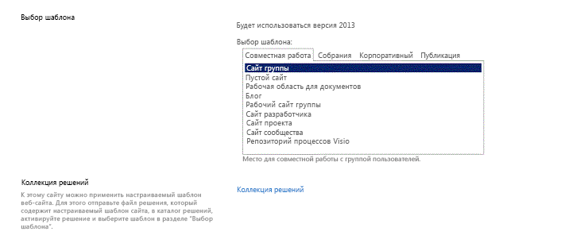

# <a name="set-up-a-general-development-environment-for-sharepoint"></a>Настройка общей среды разработки для SharePoint
Сведения о настройке среды разработки SharePoint с помощью установки SharePoint и Visual Studio.
## <a name="how-to-determine-the-sharepoint-development-environment-you-need"></a>Как определить подходящую среду разработки SharePoint
<a name="SP15_bk_determinedevenv"> </a>

Сначала следует решить, что именно вы хотите разработать (дополнительные сведения о Надстройки SharePoint см. в статье  [Надстройки SharePoint](http://msdn.microsoft.com/library/cd1eda9e-8e54-4223-93a9-a6ea0d18df70%28Office.15%29.aspx)).
  
    
    

- Если вы хотите разработать решения ферм, следуйте инструкциям в этой статье. 
    
  
- Если вы хотите создать Надстройки SharePoint, см. статью  [Средства и среды для разработки надстроек для SharePoint](http://msdn.microsoft.com/library/6906eb86-8270-4098-8106-1e8d0d3c212e%28Office.15%29.aspx). 
    
  

## <a name="create-a-sharepoint-development-environment-on-a-microsoft-azure-virtual-machine"></a>Создание среды разработки SharePoint в виртуальной машине Microsoft Azure
<a name="SP15_bk_devenvazure"> </a>

Если у вас есть подписка на MSDN, вы можете быстро подготовить виртуальную машину в Azure.
  
    
    
Если вы еще не воспользовались преимуществами Microsoft Azure, которые дает подписка MSDN, вы можете узнать об этом больше в статье о  [преимуществах Microsoft Azure для подписчиков MSDN](http://azure.microsoft.com/ru-RU/pricing/member-offers/msdn-benefits/).
  
> [!NOTE]
> В коллекции образов Microsoft Azure больше нет образов с предустановленными SharePoint и Visual Studio. Но виртуальная машина Microsoft Azure — по-прежнему отличный выбор для разработки. > Войдите на [портал управления Microsoft Azure](https://manage.windowsazure.com). > Создайте виртуальную машину, используя один из образов в коллекции для Windows Server 2008 R2 с пакетом обновления 1 версии x64, Windows Server 2012 (или более поздней версии). Следуйте инструкциям по созданию виртуальной машины. Рекомендуем **очень крупный** размер виртуальной машины для разработки SharePoint.> После подготовки и запуска машины завершите настройку, следуя инструкциям в приведенном ниже разделе **Создание локальной среды разработки SharePoint**. (Пропустите раздел об установке операционной системы.)> После настройки среды разработки вы можете получить доступ к системе управления версиями из Visual Studio на виртуальной машине, используя подключение Azure типа "точка-сеть". Инструкции см. в статье [Настройка VPN-подключения "точка-сеть" к виртуальной сети Azure](https://azure.microsoft.com/ru-RU/documentation/articles/vpn-gateway-point-to-site-create/).
  
    
    


## <a name="create-a-sharepoint-development-environment-on-premises"></a>Создание локальной среды разработки SharePoint
<a name="SP15_bk_devenvazure"> </a>


  
    
    

### <a name="install-the-operating-system-for-your-sharepoint-add-ins-development-environment"></a>Установка операционной системы для среды разработки Надстройки SharePoint
<a name="SP15_bk_InstallOS"> </a>

По сравнению с требованиями для рабочей среды, требования к среде разработки для установки SharePoint менее строгие, их выполнение менее затратно. Во всех средах разработки для установки и запуска SharePoint необходимо использовать компьютер с ЦП, поддерживающим архитектуру x64, и с ОЗУ не менее, чем на 16 ГБ. Мы рекомендуем ОЗУ на 24 ГБ. В зависимости от конкретных требований и бюджета можно выбрать один из этих вариантов:
  
    
    

- Установка SharePoint в Windows Server 2008 R2 с пакетом обновления 1 x64 или в Windows Server 2012 (или более поздней версии).
    
  
- Использование Microsoft Hyper-V и установка SharePoint на виртуальной машине под управлением гостевой ОС Windows Server 2008 R2 64-разрядной версии с пакетом обновления 1 или Windows Server 2012. Руководство по настройке виртуальной машины Microsoft Hyper-V для SharePoint см. в статье  [Использование рекомендованных конфигураций виртуальных машин SharePoint и среды Hyper-V](http://technet.microsoft.com/ru-RU/library/ff621103%28v=office.15%29.aspx).
    
  

### <a name="install-the-app-development-prerequisites-for-the-operating-system-and-sharepoint"></a>Установка обязательных компонентов для разработки приложений для операционной системы и SharePoint
<a name="SP15_bk_prereqsOS"> </a>

Перед началом установки SharePoint требуется установка ряда обязательных компонентов в операционной системе. Поэтому SharePoint включает средство PrerequisiteInstaller.ex, которое устанавливает все эти обязательные компоненты. Запустите это средство перед запуском Setup.exe.
  
    
    

1. Запустите средство PrerequisiteInstaller.exe.
    
  
2. Запустите программу Setup.exe, включенную в ваши файлы установки.
    
  
3. Примите условия лицензионного соглашения на использование программного обеспечения Майкрософт.
    
  
4. На странице **выбора варианта установки** выберите вариант **Автономная**.
    
   **Рисунок 2. Выбор варианта установки**

  

  
  

  

  
5. Если во время установки возникают какие-либо ошибки, просмотрите файл журнала. Чтобы найти его, откройте окно командной строки и введите следующие команды. Ссылка на файл журнала появляется также после завершения установки.
    
```
  
cd %temp
dir /od *.log
```

6. После завершения установки вам будет предложено запустить мастер настройки продуктов и технологий SharePoint.
    
    > [!NOTE]
    > Если установка выполняется на компьютере, который присоединен к домену, но не подключен к контроллеру домена, работа мастера настройки продуктов и технологий SharePoint может завершиться с ошибкой. Если возникла ошибка, подключитесь к контроллеру домена напрямую или с помощью VPN-подключения либо выполните вход с помощью локальной учетной записи с правами администратора на компьютере. 

7. После завершения работы мастера откроется страница **Выбор шаблона** нового сайта SharePoint.
    
   **Рисунок 3. Выбор шаблона сайта на странице**

  

  
  

  

  

### <a name="install-visual-studio"></a>Установка Visual Studio
<a name="SP15_bk_installVS"> </a>

Установив Visual Studio, вы получите все шаблоны, инструменты и сборки для разработки SharePoint на локальном компьютере.
  
    
    
Инструкции по установке Visual Studio см. в статье  [Установка Visual Studio](http://msdn.microsoft.com/ru-RU/library/e2h7fzkw.aspx).
  
    
    

#### <a name="verbose-logging-in-visual-studio"></a>Подробное ведение журнала в Visual Studio

Выполните указанные ниже действия, чтобы включить подробное ведение журнала.
  
    
    

1. Откройте реестр и перейдите к разделу **HKEY_CURRENT_USER\\Software\\Microsoft\\VisualStudio\\ _nn.n_\\SharePointTools**, где _nn.n_ это версия Visual Studio, например 12.0 или 14.0.
    
  
2. Добавьте ключ DWORD под названием **EnableDiagnostics**.
    
  
3. Присвойте ключу значение **1**.
    
  
Путь реестра в будущих версиях Visual Studio изменится.
  
    
    

## <a name="next-steps"></a>Дальнейшие действия
<a name="SP15_bk_devenvazure"> </a>

Если вы будете создавать рабочие процессы, перейдите к статье  [Установка и настройка диспетчера рабочих процессов SharePoint](set-up-and-configure-sharepoint-workflow-manager.md).
  
    
    

## <a name="see-also"></a>См. также
<a name="SP15_bk_AddlResources"> </a>


-  [Установка Visual Studio](http://msdn.microsoft.com/ru-RU/library/e2h7fzkw%28v=vs.110%29.aspx)
    
  
-  [Средства и среды для разработки надстроек для SharePoint](http://msdn.microsoft.com/library/6906eb86-8270-4098-8106-1e8d0d3c212e%28Office.15%29.aspx)
    
  

  
    
    

