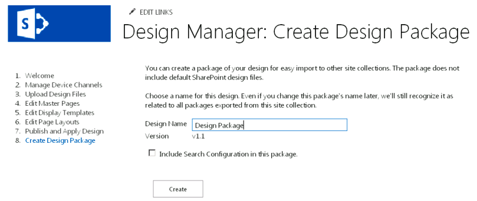

# Пакеты разработки дизайнер SharePoint
Узнайте, как создавать и экспортировать визуальный Дизайн семейства веб-сайтов SharePoint в виде пакета.
## Обзор конструктора пакетов

В SharePoint руководитель проекта может помочь разработчиков веб-приложений и дизайнеры построения и экспортировать визуальный Дизайн семейства веб-сайтов SharePoint в виде пакета. Этот пакет можно легко распространяется или другом обозначены групп для установки на их семейств веб-сайтов. Этот новый компонент уменьшает сложность переноса проектов и упрощает для клиентов реализовать аутсорсинг задач визуальный Дизайн своих сайтов. Например некоторые сценарии использования могут включать следующее:
  
    
    

- **Новые разработки** — компании с ограниченной web возможности средств разработки может контракта бюро поставщика для обновления их текущего сайта SharePoint с современными интерпретации. Деятельностью организации можно создавать сайт и легко упаковать содержимое для импорта обратно в ферме SharePoint компании.
    
  
- **Межсайтовой публикации** — предприятии ИТ отдела, с помощью публикации на нескольких сайтах в SharePoint может потребоваться совместно использовать визуальный Дизайн в нескольких семейств веб-сайтов. Они самостоятельно создавать сайт и хотите простой способ передачи Разработка через несколько веб-сайтов SharePoint. Функциональные возможности пакета проектирования через диспетчер устройств позволяет им для экспорта и импорта с ограниченной Административная поддержка и сложности.
    
  
В этой статье, помогут вам понять упаковки разработки в SharePoint, предоставляя Обзор создания пакетов и содержатся рекомендации рабочего процесса для пакета экспорта и импорта. В ней также рассматриваются необходимые разрешения для определенных операций и разработка архитектуры пакета.
  
    
    

## Создание пакета конструктора

Пользователь создает пакета конструктора, называется пакет решения SharePoint (WSP-файл) на сайте SharePoint, через дизайнер в **Настройках сайта**. Шаг для создания пакета образом другие действия дизайнер для фирменной настройки и публикации сайта SharePoint, включая передача файлов проекта, Создание главной страницы и изменение макетов страниц. После публикации сайта является сравнительно легко процесс создания WSP-файла для экспорта.
  
    
    
На рисунке 1 показано параметр в диспетчере оформления для создания пакета проектирования и присвоение ему имени.
  
    
    

**На рисунке 1. Экспорт пакета проектирования**

  
    
    

  
    
    

  
    
    
Кроме того можно импортировать пакета конструктора из другого семейства сайтов SharePoint через дизайнер на странице приветствия или выбрав команду **Импорт пакета проектирования** в **Настройках сайта**.
  
    
> [!NOTE]
> Дополнительные сведения о диспетчере оформления и процесс публикации можно [Обзор диспетчера оформления в SharePoint](overview-of-design-manager-in-sharepoint.md). 
  
    
    

Существует флажок для включения конфигурации поиска в пакете разработки. Выбрать этот параметр, если проектирование сайта и создание результатов поиска условного или управление результатов поиска. Эта конфигурация содержит активов как правила запросов, источники результатов, типы результатов и все модели схемы и ранжирования. Чтобы убедиться, что импорт конфигурации поиска не будет, здесь не должно быть повторяющихся имен для любых элементов конфигурации поиска. Например если имеется правило запроса в семейства веб-сайтов с именем **SampleQueryRule**и импортировать его в другом семейства сайтов с помощью существующего правила с именем **SampleQueryRule**, импорт конфигурации поиска не удается выполнить. Чтобы предотвратить это, можно переименовать или удалить правило запроса в источнике или в целевой системе. Источники результатов и схемы, также должны иметь уникальное имя. Если вы хотите включить конфигурацию поиска в пакет разработки, следующие функции на уровне сайта в разделе **Управление компонентами сайта** необходимо активировать, прежде чем экспортировать пакет разработки:
  
    
    

- Типы контента данные конфигурации поиска
    
  
- Столбцы сайта данные конфигурации поиска
    
  
- Компонент экземпляра список конфигураций поиска
    
  
- Функция шаблона конфигурации поиска
    
  
Если необходимо, чтобы данный проект нужно опубликовать в целевой системе импорта, следует публикация всех средств разработки или отключение основных управления версиями в библиотеках связанных с в источнике экспорта. Дизайнер экспорт только наиболее поздней версии каждого средства из источника. Например если установлена версия 1.1 главной страницы на исходном его копируются в конечную как черновик. Однако не копируются версии 1.0. Кроме того не экспортируются файлы, извлеченные проекты.
  
    
    

## Экспорт и Импорт пакета конструктора

Рабочий процесс упаковки начала до конца несколькими способами, можно подход с гораздо подход в зависимости от целей и доступные ресурсы. В группу можно реализовать аутсорсинг задач для поставщика агентство или выполнения работы внутри компании, если у вас есть внутренний услуг. В таблице 1 обеспечивает пример рабочего процесса и exchange между клиентом и бюро поставщика разработки, экспорт и Импорт пакета конструктора. Он также предоставляет разрешения, необходимые для операций, связанных с проектирования и операции упаковки.
  
    
    

**В таблице 1. Пример структуры пакета рабочего процесса**

|**Шаг**|**Действие**|**Описание**|
|:-----|:-----|:-----|
|1    |Поддержки поставщика контракты клиента для создания визуальной разработки.    | Конструктор поставщика создается сайт, в соответствии с требованиями организации.   **Примечание**: конструктор поставщика необходимо иметь уровень разрешений **конструкторы** использовать Дизайнер и создание и экспорт пакетов. В частности разрешение **разработки** , обеспечивающий просмотр, добавление, обновление, удаление, утверждение и настройка дизайна.          |
|2    |Конструктор поставщика экспортирует визуальный Дизайн в пакете разработки.    | Конструктор поставщика экспортирует пакет решения SharePoint (WSP-файл) после завершения других необходимых фирменной символики и публикации действия.    Пакет разработки доставляется клиента через безопасный канал.   |
|3    |Визуальный Дизайн импортирует клиента в его указанного семейства сайтов SharePoint.    | Клиент получает пакет разработки через безопасный канал.    Через начальная страница в диспетчере оформления или с помощью команды **Импорт пакета проектирования** в **Настройках сайта** клиента импортирует WSP-файл и предоставляет пакет разработки в указанном семействе сайтов.    **Примечание**: клиента необходимо иметь уровень разрешений **конструкторы** использовать Дизайнер и импорта пакетов разработки.          |
   

## Общее представление о содержимое пакета проектирования

Несколько файлов включаются в WSP-файл пакета проектирования при его создании через дизайнер. Процесс экспортирует файлы из различных списков и библиотек для формирования общий пакета. При импорте семейства веб-сайтов, эти файлы распространяются в другие расположения, в зависимости от типа файла. В таблице 2 приведены сведения о расположении и тип файлов, экспортируемых в процессе сборки.
  
    
    

**В таблице 2. Сводка по содержимое пакета проектирования и exportation расположения файлов**

|**Папка для экспорта**|**Экспортированные активов**|
|:-----|:-----|
|Библиотеки документов    | Коллекция главных страниц    Коллекция тем    Библиотека стилей    библиотека ресурсов сайта;   |
|Типы контента, полей    | Типы контента, наследующие от типа контента страницы   |
|Списки    | Макетов    Вариантов оформления    Каналы устройств   |
   
> [!NOTE]
> В SharePoint только настроенные файлы включены в пакеты проекта. Процесс упаковки не будет экспортировать большая часть файлы без дополнительной настройки системы по умолчанию. 
  
    
    

В SharePoint не удается удалить пакет импортированного проекта и никогда не следует отключить пакета конструктора через коллекции решений. В противном случае типы контента макета страницы, удалены и пользователи не смогут создавать дочерние узлы. Восстановиться это состояние означает, необходимо выполнить следующие действия которых веб-A = исходного семейства веб-сайтов B = семейство сайтов с пакетом неактивные разработки (некорректном состоянии) и веб-сайтов C = семейства пустой веб-сайтов, созданную вами:
  
    
    

1. Экспорт пакета проектирования из сайта А
    
  
2. Импорт пакета проектирования сайт C
    
  
3. Экспорт пакета проектирования с сайта B
    
  
4. Импорт пакета проектирования сайт C
    
  
5. Экспорт пакета проектирования с сайта
    
  
6. Импорт пакета проектирования сайт B
    
  
Какие-либо созданы при выгрузке пакет разработки также импортируются каналы устройств и их конфигурация. Однако необходимо повторно связать главных страниц для указанного устройств, каналы, так как эти сопоставления не будет настроен.
  
    
    
При импорте пакета конструктора альтернативный URL-адрес CSS не задан, даже в том случае, если один был настроен на источнике экспорта. CSS-классов должны храниться во внешнем файле в коллекции главных страниц, а не в самом файл главной страницы.
  
    
    

## См. также

-  [Разработка макета сайта в SharePoint](develop-the-site-design-in-sharepoint.md)
    
  
-  [Обзор Дизайнера в SharePoint](overview-of-design-manager-in-sharepoint.md)
    
  
-  [Новые возможности разработки сайтов в SharePoint](what-s-new-with-sharepoint-site-development.md)
    
  
