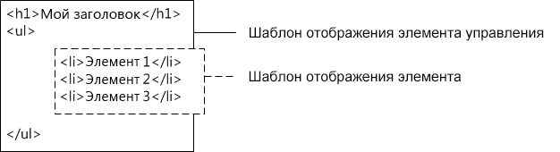

# <a name="sharepoint-design-manager-display-templates"></a>Шаблоны отображения для компонента "Дизайнер" SharePoint
В этой статье описываются шаблоны отображения, в том числе их связь с веб-частями поиска, принципы структурирования шаблонов, способы сопоставления свойств, использования переменных и jQuery, а также создание пользовательских шаблонов отображения в SharePoint.
## <a name="introduction-to-display-templates"></a>Общие сведения о шаблонах отображения
<a name="bk_introduction"> </a>

Шаблоны отображения в SharePoint — это шаблоны, используемые в веб-частях, использующих технологию поиска (в этой статье они называются веб-частями поиска), для отображения результатов запроса, полученных из индекса поиска. Шаблоны отображения указывают, какие управляемые свойства отображаются в результатах поиска и как они выглядят в веб-части. Каждый шаблон отображения состоит из двух файлов: версии в формате HTML, которую можно изменить в редакторе HTML, и JS-файла, используемого средой SharePoint.
  
> [!NOTE]
> Только веб-части поиска могут использовать шаблоны отображения. Веб-часть запрашивания контента не ориентирована на поиск, поэтому не использует шаблоны отображения. 
  
    
    

Вы можете просмотреть существующие шаблоны отображения в Дизайнере, но они не создаются в Дизайнере так, как главные страницы и макеты страниц. Для их создания выполните следующие действия.
  
    
    

- Откройте  [сопоставленный сетевой диск в коллекции главных страниц](how-to-map-a-network-drive-to-the-sharepoint-master-page-gallery.md).
    
  
- Откройте одну из четырех папок, вложенных в папку **Шаблоны отображения**.
    
    > [!NOTE]
    > Выбор папки зависит от типа нужного шаблона отображения. Например, если используется публикация на нескольких сайтах, скопируйте шаблон отображения из папки **Веб-части контента**. Дополнительные сведения см. в статье [Справочник по шаблонам отображения в SharePoint](http://technet.microsoft.com/ru-RU/library/jj944947.aspx). 

- Скопируйте HTML-файл для существующего шаблона отображения, который похож на то, что нужно вам. Неважно, куда вы скопируете файл, главное, чтобы целевая папка находилась в **коллекции главных страниц**.
    
  
- Откройте и измените свою копию в HTML-редакторе.
    
  
Применяя существующий шаблон отображения в качестве отправной точки для нового шаблона, можно воспользоваться полезными сведениями о настройке в комментариях в шаблоне отображения по умолчанию. При этом у вас будет основа для базовых задач, например сопоставления полей ввода. Это также гарантирует, что ваши шаблоны будут использовать правильную структуру главной страницы.
  
    
    
Что происходит, когда вы создаете шаблон отображения, скопировав HTML-файл существующего шаблона в папку **Шаблоны для отображения** в **коллекцию главных страниц**:
  
    
    

- В том расположении, куда был скопирован HTML-файл, создается JS-файл с таким же именем.
    
  
- Вся разметка, необходимая среде SharePoint, добавляется в JS-файл, чтобы шаблон отображения был показан правильно.
    
  
- HTML-файл и JS-файла связываются, чтобы последующие правки HTML-файла синхронизировались с JS-файлом после сохранения HTML-файла.
    
> [!NOTE]
> Синхронизация осуществляется только в одном направлении. Изменения HTML шаблона отображения будут синхронизированы со связанным JS-файлом. В отличие от главных страниц и макетов страниц при использовании шаблонов отображения невозможно работать только с JS-файлом, разорвав связь между файлами. Весь HTML- и JavaScript-код необходимо ввести в HTML-файл. 
  
    
    


## <a name="understanding-the-relationship-between-display-templates-and-search-web-parts"></a>Общие сведения об отношении между шаблонами отображения и веб-частями поиска
<a name="bk_DTandSWP"> </a>

Существует два основных типа шаблонов отображения:
  
    
    

- **Шаблоны элементов управления**, которые определяют общую структуру представления результатов. К ним относятся списки, списки с разбиением по страницам и слайд-шоу.
    
  
- **Шаблоны элементов** определяют, как отображается каждый результат из набора. К ним относятся изображения, текст, видео и другие элементы.
    
  
Дополнительные сведения об этих и других шаблонах отображения см. в статье [Справочник по шаблонам отображения в SharePoint](http://technet.microsoft.com/ru-RU/library/jj944947.aspx).
  
    
    
После добавления веб-части поиска на страницу (например, веб-части "Поиск контента") для настройки веб-части необходимо выбрать шаблон отображения элемента управления и шаблон отображения элемента, как показано на рис. 1.
  
    
    

**Рис. 1. Область инструментов веб-части поиска контента**

  
    
    

  
    
    

  
    
    
Шаблон отображения элемента управления предоставляет HTML для структурирования общего макета, используемого для отображения результатов поиска. Например, шаблон отображения элемента управления может предоставить HTML для заголовка, а также начала и конца списка. Шаблон отображения элемента управления показывается в веб-части только один раз.
  
    
    
Шаблон отображения элемента содержит HTML-код, который определяет способ отображения каждого элемента в результирующем наборе. Например, шаблон отображения элемента может предоставить HTML-код для элемента списка, содержащего рисунок и три строки текста, которые сопоставляются с различными управляемыми свойствами, связанными с элементом. Шаблон отображения элемента отображается один раз для каждого элемента в результирующем наборе. Если результирующий набор содержит 10 элементов, шаблон отображения элемента создает его HTML-раздел десять раз.
  
    
    
При совместном использовании подобным образом шаблон отображения элемента управления и шаблон отображения элемента создают согласованный HTML-­блок, отображаемый в веб-части, как показано на рис. 2.
  
    
    

**Рис. 2. Комбинированный вывод шаблона отображения элемента и шаблона отображения элемента управления в формате HTML**

  
    
    

  
    
    

  
    
    
Дополнительные сведения о шаблонах отображения см. в разделе "Веб-части на основе поиска и шаблоны отображения" в статье  [Обзор модели страниц в SharePoint](overview-of-the-sharepoint-page-model.md).
  
    
    

## <a name="understanding-the-display-template-structure"></a>Структура шаблона отображения
<a name="bk_DTstructure"> </a>

HTML-файл, который используется для шаблона отображения  это полностью сформированный HTML-документ, но он не представляет полную веб-страницу HTML. SharePoint преобразует части HTML-файл шаблона отображения в JavaScript. В этом разделе описаны четыре основных раздела шаблона отображения.
  
    
    

### <a name="title-tag"></a>Тег title

Текст в теге **\<title\>** в файле шаблона отображения используется в качестве отображаемого имени в разделе **Шаблоны отображения** области редактирования веб-части, если веб-часть поиска находится в режиме редактирования. Приведенный ниже пример предназначен для шаблона отображения с именем Item_Picture3Lines.html:
  
    

```HTML

<title>Picture on left, 3 lines on right</title>
```


### <a name="header-properties"></a>Свойства заголовков

Сразу после тега **\<title\>** находится набор настраиваемых элементов, ограниченных следующей разметкой:
  
    
    

```HTML
<!--[if gte mso 9]><xml>
<mso:CustomDocumentProperties>
…
</mso:CustomDocumentProperties>
</xml><![endif]-->

```

Эти элементы и их свойства предоставляют среде SharePoint важные сведения о шаблоне отображения. В таблице 1 описаны настраиваемые свойства, которые используются в шаблонах отображения.
  
> [!NOTE]
> Не все настраиваемые свойства используются в каждом шаблоне отображения. Кроме того, некоторые свойства можно, изменив свойства файла шаблона отображения в Дизайнере. 
  
    
    


**Таблица 1. Список записей CustomDocumentProperties**


|**Свойство**|**Описание**|
|:-----|:-----|
|**TemplateHidden** <br/> |Логическое значение, указывающее, следует ли скрыть шаблон отображения из списка доступных шаблонов в веб-части. Это значение можно изменить в свойствах файла шаблона отображения.  <br/> |
|**ManagedPropertyMapping** <br/> |Сопоставляет поля, предоставляемые элементами результатов поиска в свойствах, доступных для JavaScript. Используется только в шаблонах элементов.  <br/> |
|**MasterPageDescription** <br/> |Понятное описание шаблона отображения. Его пользователи увидят в среде редактирования SharePoint. Это значение можно изменить в свойствах файла шаблона отображения.  <br/> |
|**ContentTypeId** <br/> |Идентификатор типа контента, связанного с шаблоном отображения.  <br/> |
|**TargetControlType** <br/> |Указывает контекст, в котором используется шаблон отображения. Это значение можно изменить в свойствах файла шаблона отображения.  <br/> |
|**HtmlDesignAssociated** <br/> |Логическое значение, которое указывает, связан ли с HTML-файлом шаблона отображения JS-файл.  <br/> |
|**HtmlDesignConversionSucceeded** <br/> |Указывает, успешно ли выполнено преобразование. Это значение автоматически добавляется в файл SharePoint и используется только в настраиваемых шаблонах отображения.  <br/> |
|**HtmlDesignStatusAndPreview** <br/> |Содержит URL-адрес HTML-файла и текст для столбца **Состояние** ( **Преобразование выполнено успешно** или **Предупреждения и ошибки**). Это значение автоматически добавляется в файл SharePoint и используется только в настраиваемых шаблонах отображения.  <br/> |
   

### <a name="script-block"></a>Блок скрипта
<a name="bk_scriptblock"> </a>

В теге **\<body\>** есть следующий тег **\<script\>**:
  
    
    

```HTML

<script>
     $includeLanguageScript(this.url, "~sitecollection/_catalogs/masterpage/Display Templates/Language Files/{Locale}/CustomStrings.js");
</script>
```

По умолчанию эта строка включается во все шаблоны отображения. Вы можете добавить больше строк кода в теге **\<script\>**, чтобы ссылаться на CSS-файлы или другие файлы JavaScript за пределами HTML-файла основного шаблона отображения. В таблице 2 показаны примеры того, как включать другие ресурсы.
  
    
    

**Таблица 2. Примеры включения внешних ресурсов в тег \<script\>**


|**Что требуется включить:**|**Используйте следующий код:**|
|:-----|:-----|
|Файл JavaScript, часть текущего семейства веб-сайтов  <br/> | `$includeScript(this.url, "~sitecollection/_catalogs/masterpage/Display Templates/Content Web Parts/MyScripts.js");` <br/> |
|Внешний файл JavaScript  <br/> | `$includeScript(this.url, "http://www.contoso.com/ExternalScript.js");` <br/> |
|CSS-файл, часть текущего семейства веб-сайтов  <br/> | `$includeCSS(this.url, "~sitecollection/_catalogs/masterpage/Display Templates/Content Web Parts/MyCSS.css");` <br/> |
|CSS-файл в расположении, относящемся к текущему шаблону отображения  <br/> | `$includeCSS(this.url,"../../MyStyles/MyCSS.css");` <br/> |
   
> [!NOTE]
> Если для элементов в коллекции эталонных страниц требуется **утверждение контента**, все файлы ресурсов (включая CSS- и JS-файлы) должны быть опубликованы, прежде чем они станут доступными эталонным страницам и макетам страниц. Дополнительные сведения см. в статье [Обязательное утверждение элементов в библиотеке или списке сайта](http://office.microsoft.com/en-us/sharepoint-help/require-approval-of-items-in-a-site-list-or-library-HA102853936.aspx?CTT=1). 
  
    
    


### <a name="div-block"></a>Блок DIV
<a name="bk_scriptblock"> </a>

После тега **\<script\>** находится тег **\<div\>** с идентификатором. По умолчанию идентификатор этого тега **\<div\>** совпадает с именем HTML-файла. Любое содержимое HTML или код, которые должен предоставлять шаблон отображения, должны быть включены в этот тег **\<div\>**. Однако сам тег не включается в разметку, отображаемую на веб-странице во время выполнения.
  
> [!NOTE]
> Если вам нужно назначить стиль CSS или идентификатор блоку HTML, отображаемому на странице во время выполнения, можете добавить новый тег в первый тег **\<div\>**. Вы также можете назначить стиль CSS или идентификатор коду HTML вокруг переменной `_#= ctx.RenderGroups(ctx) =#_` в шаблоне элемента управления. Переменная `_#= ctx.RenderGroups(ctx) =#_` используется для отображения содержимого HTML вокруг результатов запроса, отображаемых шаблоном элемента.
  
    
    

В первом теге **\<div\>** вы увидите код внутри блоков комментариев, начинающихся с тега **\<!--#\_** и заканчивающихся тегом **\_#--\>**. Код JavaScript используется внутри этих блоков, а HTML — за их пределами. С помощью этих блоков также можно управлять содержимым HTML, используя условные операторы. Для этого добавьте блок комментариев с условным оператором и открывающей скобкой, за которой следует код HTML, а затем еще один блок комментариев с закрывающей скобкой. В приведенном ниже примере тег привязки отображается на странице, только если значение объекта **linkURL** не является пустым.
  
    
    


```HTML

<!--#_
if(!linkURL.isEmpty)
{
_#-->
     <a class="cbs-pictureImgLink" href="_#= linkURL =#_" title="_#= $htmlEncode(line1.defaultValueRenderer(line1)) =#_" id="_#= pictureLinkId =#_">
<!--#_
}
_#-->

```


## <a name="mapping-input-properties-and-getting-their-values"></a>Сопоставление входных свойств и получение их значений
<a name="bk_mapproperties"> </a>

Раздел заголовка в шаблоне отображения элемента содержит настраиваемое свойство документа с именем **ManagedPropertyMapping**. Это свойство принимает управляемые свойства, используемые для поиска, и сопоставляет их со значениями, которые может использовать шаблон отображения. Свойство — это разделенный запятыми список значений в следующем формате: ' _отображаемое имя свойства_'{ _имя свойства_}:' _управляемое свойство_'. Пример: `'Picture URL'{Picture URL}:'PublishingImage;PictureURL;PictureThumbnailURL'`.
  
    
    
Рассмотрим этот формат подробнее:
  
    
    

-  _Отображаемое имя свойства_ — это имя свойства, которое отображается в области редактирования веб-части при выборе шаблона отображения.
    
  
-  _Имя свойства_ — это идентификатор, который использует локализованные строковые ресурсов, чтобы найти имя управляемого свойства. Это также значение, отображаемое в разделе **Сопоставления свойств** меню "Параметры веб-части". Вы можете ввести другое значение в параметрах веб-части, чтобы изменить управляемое свойство, связанное с полем, которое отображается в веб-части.
    
  
-  _Управляемое свойство_ — это строка из одного или нескольких управляемых свойств, разделенных точкой с запятой. Во время выполнения этот список вычисляется слева направо, а первое значение, соответствующее имени управляемого свойства текущего элемента поиска, будет сопоставлено с этим сегментов. Это позволяет создать шаблон отображения, который может работать с несколькими типами элементов и использовать унифицированный способ визуализации при наличии совместимых свойств.
    
  
После сопоставления свойства его значение можно получить в скрипте, используя следующий код:  `var pictureURL = $getItemValue(ctx, "Picture URL");`
  
    
    
Второй параметр, который передается **$getItemValue()**, должен соответствовать отображаемому имени свойства в одинарных кавычках, которое используется в элементе **ManagedPropertyMapping**. В этом примере **Picture URL**  это имя свойства, которое передается **$getItemValue()**.
  
    
    
Этот код возвращает объект сведений о значении ( **valueInfoObj**). Он содержит необработанное представление входного значения, а также значение, к которому применена кодировка по умолчанию.
  
    
    
Переменные в разделах JavaScript можно использовать, как и обычно, для обработки переменных и создания HTML-строк, которые будут отображаться на странице во время выполнения. Но чтобы ссылаться на переменные, объявленные в скрипте непосредственно в HTML-коде, необходимо использовать следующий формат: _#=  _variableName_ =#_. Например, чтобы использовать переменную **pictureURL** как значение изображения, воспользуйтесь следующим HTML-кодом: ``
  
    
    

## <a name="using-jquery-with-display-templates"></a>Использование jQuery с шаблонами отображения
<a name="bk_jQuery"> </a>

jQuery можно использовать с шаблонами отображения, но при этом необходимо учитывать два важных фактора:
  
    
    

- для включения библиотеки jQuery в шаблон отображения следуйте инструкциям, описанным в разделе  [Блок скрипта](#bk_scriptblock) выше;
    
  
- при использовании селекторов идентификатора в jQuery воспользуйтесь следующим кодом для создания переменной для идентификатора:  `var containerQueryId = '#' + '_#= containerId =#_';`.
    
    Для ссылки на селектор в jQuery используйте следующий код:  `$('_#= containerQueryId =#_')`
    
  

## <a name="create-a-display-template"></a>Создание шаблона отображения
<a name="bk_createDT"> </a>

Перед созданием шаблона отображения с помощью следующей процедуры необходимо создать сопоставленный сетевой диск, который указывает на **коллекцию главных страниц**. Дополнительные сведения см. в разделе  [Как: сопоставление сетевого диска коллекции главных страниц SharePoint](how-to-map-a-network-drive-to-the-sharepoint-master-page-gallery.md).
  
    
    

### <a name="to-create-a-display-template"></a>Создание шаблона отображения


1. С помощью проводника Windows откройте сетевой диск, сопоставленный с **коллекцией главных страниц**.
    
  
2. Откройте папку **Шаблоны отображения**, а затем — папку **Веб-части контента**.
    
  
3. Скопируйте HTML-файл шаблона отображения, подобный тому, который требуется создать. Список стандартных шаблонов отображения и их описания см. в статье [Справочник по шаблонам отображения в SharePoint](http://technet.microsoft.com/ru-RU/library/jj944947.aspx).
    
    На этом этапе SharePoint копирует HTML-файл в JS-файл с таким же именем. Например, если имя скопированного HTML-файла — Item_Picture3Line_copy.html, то также создается соответствующий JS-файл с именем Item_Picture3Lines_copy.js. Если переименовать файл, соответствующий JS-файл также меняется.
    
  
4. Чтобы настроить шаблон отображения, измените HTML-файл, который находится на сервере. Для этого откройте и измените HTML-файл на сопоставленном диске с помощью HTML-редактора. Каждый раз при сохранении HTML-файл все изменения синхронизируются со связанным JS-файлом.
    
  
5. Перейдите на сайт публикации.
    
  
6. В правом верхнем углу страницы выберите пункт **Параметры**, а затем выберите **Дизайнер**.
    
  
7. В левой области навигации Дизайнера щелкните **Изменить шаблоны отображения**. Появится HTML-файл со столбцом **Состояние**, в котором отображается одно из двух состояний:
    
  - **Предупреждения и ошибки**;
    
  
  - **Преобразование выполнено успешно**.

    > [!NOTE]
    > В отличие от главных страниц и макетов страниц вы не можете использовать страницу предварительного просмотра для динамического изучения шаблона отображения на сервере. Для предварительного просмотра шаблона необходимо добавить веб-часть поиска контента на страницу и применить шаблон в области редактирования веб-части поиска контента. Если шаблон отображения содержит ошибки, в веб-части поиска контента появится сообщение об ошибке. Исправьте ошибки, чтобы шаблон отображался правильно. 

8. Чтобы исправить ошибки, отредактируйте HTML-файл, который находится на сервере, в HTML-редакторе, чтобы открыть и изменить HTML-файл на сопоставленном диске. Сохраните шаблон отображения и перезагрузите страницу, содержащую веб-часть поиска контента, которая использует шаблон отображения.
    
  

## <a name="see-also"></a>См. также
<a name="bk_addresources"> </a>

-  [Обзор Дизайнера в SharePoint](overview-of-design-manager-in-sharepoint.md)
-  [Разработка макета сайта в SharePoint](develop-the-site-design-in-sharepoint.md)
-  [Инструкции. Преобразование HTML-файла в эталонную страницу SharePoint](how-to-convert-an-html-file-into-a-master-page-in-sharepoint.md)
-  [Инструкции. Создание макета страницы в SharePoint](how-to-create-a-page-layout-in-sharepoint.md)
-  [Фирменная символика и конструкция возможности дизайнер SharePoint](sharepoint-design-manager-branding-and-design-capabilities.md)
    
  

