# Управление жизненным циклом приложений SharePoint
Применяет основные понятия управления Жизненным циклом приложения и рекомендации для разработки приложений с помощью технологий SharePoint.

**Автор:** Эрик Чарран, корпорация Майкрософт

**Участники:** (VESA juvonen), корпорация Майкрософт | Стив пешка, корпорация Майкрософт

> **Важные:** В этом разделе имеются ссылки на автоматическое размещение надстройки SharePoint. Программа предварительного просмотра для приложения с автоматическим размещением его завершения. Можно игнорировать все упоминания автоматически размещаемых надстройки SharePoint. 

## Обзор управления жизненным циклом приложения

Microsoft SharePoint предоставляет разработчикам ряд параметров для создания и развертывания приложений, основанных на основе технологий SharePoint, в локальной и размещенной или общедоступных облачных платформ. SharePoint предоставляет повышенной гибкостью в фигуре приложений может занять а также новые возможности с помощью технологий, основанный на стандартах с приложениями. Хотя эти возможности приложений и варианты развертывания для получения нового inSharePoint модели приложения предоставляют эффективные средства для разработчиков для создания новых и иммерсивном приложений разработчики должны иметь возможность infuse качества, тестирования и управления жизненным циклом Приложений сведения о выполнении в процесс разработки. Эта статья относится основные понятия управления жизненным циклом Приложений и рекомендации для разработки приложений с помощью технологий SharePoint.

### Новые возможности

SharePoint устанавливает новая концепция для реализации приложений. Из-за этот shift при разработке приложений с помощью SharePoint технологий, разработчики и архитекторы должна быть исчерпывающие сведения о новых шаблонов разработки приложений, рекомендации и модели развертывания для SharePoint. Важно Обратите внимание, что хотя модели приложения для разработки решений с использованием SharePoint была изменена, многие шаблоны, используемые для разработки решения, включая выбор технологий, способы реализации объектов на одной линии существующей web технологии разработки приложений.
  
    
    
Следующие ресурсы в структуре типов приложений, которые могут быть созданы с помощью технологий SharePoint и содержат сведения о выполнении для в локальной и облачных приложений. Изучить варианты размещения SharePoint Add-ins, видеть [Выбор шаблонов для разработки и размещения надстройки SharePoint](http://msdn.microsoft.com/library/05ce5435-0a03-4ddc-976b-c33b08d03457%28Office.15%29.aspx).
  
    
    
Кроме того Корпорация Майкрософт рекомендует клиентам для оценки технологии, используемые при разработке приложений с помощью SharePoint, как это делается расширенный набор вариантов для реализации решения. При создании приложений клиентам сосредоточиться на использование основанный на стандартах технологий, таких как HTML5 и JavaScript для представления и пользователь взаимодействия уровней, пока OData и OAuth можно использовать для доступа на основе службы резервного включая служб SharePoint. Пользователям следует тщательно, требуются ли кода полного доверия (то есть, скомпилированной сборки, развернутые в SharePoint). Несмотря на то, что продолжая применять эту концепцию разработки, а по-прежнему действительный и обязательный в некоторых случаях, накладывают значительной нагрузки на процесс управления жизненным циклом Приложений.
  
    
    
Дополнительные сведения о новых технологий гибкой разработки для приложений SharePoint видеть [Обзор для разработчиков SharePoint](sharepoint-development-overview.md).
  
    
    

### Преимущества и изменения

Так как в настоящее время технологии разработки приложений SharePoint поддерживается более гибкий набор языков и программной архитектуры, разработчики должны адаптировать существующий управления жизненным циклом Приложений рекомендации по методы массовой разработки для размещения для их присутствие в среде SharePoint. Основные понятия, такие как тестирование, создание при установке, развертывании и контроля качества, может быть развернута для включения развертывания для SharePoint как приложение SharePoint. Это может свидетельствовать о несмотря на то, что многие разработчики, которые привык к записи и развертывания на сервере фермы решений, расширения возможностей ядра SharePoint, распространенные управления жизненным циклом Приложений рекомендациям для новой модели гибкой разработки, упростить с помощью SharePoint приложения должны применяться к процесс реализации.
  
    
    
Как клиенты продолжить переход к реализации SharePoint с размещением в облаке, разработчикам понадобится понять, как расширить понятия управления жизненным циклом Приложений, которые необходимо включить разработки, тестирования и развертывания целевых средах, расположенные вне физических организация. Этот компонент включает оценку стратегической технологии для проведения разработки приложений, тестирования и развертывания.
  
    
    
Разработчики и архитекторы одинаково может стать хорошо versed в создав решений, которые состоят из нескольких компонентов приложения, которые охватывают или сочетание разных типов варианта размещения. Во время этого процесса адаптации процедуры управления жизненным циклом Приложений должны применяться одностороннем этих приложений. Например, разработчикам может потребоваться развернуть приложение, которая распределена среди локального развертывания служб (то есть, IIS, ASP.NET, MVC, WebAPI и WCF), Microsoft Azure, SharePoint и SQL Azure, а также возможность тестирования компоненты приложения, чтобы определить качество или ли были представлены все регрессии после предыдущего построения. Эти требования могут относиться значительные shift в том, как разработчики и рабочих групп рассматривать ежедневного процесс построения и развертывания, который хорошо известных процедуры для локальной или решения на стороне сервера.
  
    
    

### Аспекты рабочих групп разработки

Для организаций, имеющих несколько разработчиков приложений или архитектор коллективной разработки для SharePoint следует тщательно планировать для предоставления приложений высокого качества, а также поддерживает достаточно производительность разработчика. Поскольку метод для проведения разработки приложений увеличено гибкостью, группы должны быть открытым и уверенно не только для управления жизненным циклом Приложений и рекомендации и шаблоны, а также каждый разработчик будет создавать код и убедитесь, качество кода становится частью процесс построения приложений.
  
    
    
Для этого сначала необходимо выбрать надлежащую среду разработки. Традиционно разработка выполнялась раздельно на виртуальных машинах, подключенных к общему хранилищу кода, который предоставлял возможности сборки, развертывания и тестирования, например Visual Studio TFS 2012. TFS по-прежнему остается мощным инструментальным компонентом стратегии управления жизненным циклом приложения, имеющим центральное значение в процессе разработки, но рабочим группам следует рассмотреть возможности использования TFS в различных типах сред разработки.
  
    
    
В зависимости от целевой среды и типа решения (то есть, какие компоненты должны быть размещены локально, а какие — в облачной инфраструктуре или службах), сейчас разработчики могут выбирать различные комбинации новых сред разработки. Такие варианты будут состоять из новых предложений, таких как шаблон сайта разработчика SharePoint, клиент разработчика Office 365, а также традиционные варианты, такие как разработка на основе виртуальных машин с использованием Hyper-V в Windows 8 или Windows Server 2012.
  
    
    
В следующем разделе описаны вопросы среды разработки для разработчиков приложений и рабочих групп разработки.
  
    
    

## Аспекты среды разработки

Выбирать среду разработки следует на основе многих факторов. Выбор будет значительно зависеть от типа разрабатываемого приложения, а также целевой платформы для приложения. Традиционно при разработке приложений для SharePoint Server 2010 разработчики настраивали виртуальные машины и проводили разработку изолированно. Это было связано с тем, что разработка решений с полным доверием могла требовать перезапуска базовых зависимостей SharePoint, таких как IIS, что не позволило бы многим разработчикам использовать одну среду SharePoint. Так как технологии разработки изменились и перед разработчиками открылось больше возможностей для создания приложений, разработчики и рабочие группы должны понимать, какие варианты сред разработки им доступны. На рисунке 1 показана среда разработки и набор различных средств, а также указаны типы решений, которые можно развернуть в целевых средах.
  
    
    

**Рисунок 1. Компоненты и средства среды разработки**

    
 [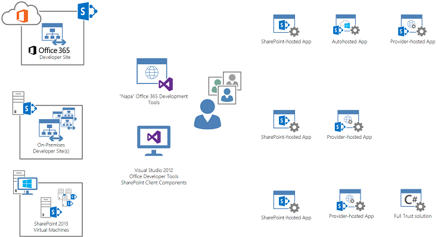
  
    
    

### Философия среды разработки

Из-за инвестиции в как приложения может быть создан и создана с использованием SharePoint разработчикам необходимо определить, есть ли необходимость проведения разработки с помощью серверного кода. Поскольку разработчики создают приложения, использующие модель размещаемых в облаке, снижает требования для проведения разработки, которая использует виртуализованных средах специально для SharePoint. Разработчики должны поиска для построения решений с помощью модели разработки удаленного, использующего существующей облачной инфраструктуры (открытых и закрытых). При сред разработки можно быстро и легко подготовить к работе с без необходимости создавать и настраивать виртуализации, разработчики могут инвестировать больше времени в сосредоточиться на производительность разработки и контроля качества, а не в инфраструктуре управления.
  
    
    
Решение о требуют виртуализованной экземпляра SharePoint и новый шаблон сайта разработки SharePoint будут зависеть от того, является ли приложение требует полного доверия код развертываются в SharePoint и работы с ней. При необходимости код не полного доверия, рекомендуется использовать шаблон сайта для разработчиков, которые можно найти в клиентов разработки Office 365 или в пределах организации реализации локального развертывания SharePoint. Шаблоны сайтов разработчика предназначены для разработчиков для развертывания приложений непосредственно в SharePoint в Visual Studio. Сайты для разработчиков Office 365 предварительно настроенного для изоляции приложений и OAuth, так, чтобы разработчики могут записи и тестирования приложений прямо сейчас.
  
    
    
В следующих разделах подробно описано, когда разработчики могут использовать различные варианты сред для создания приложений.
  
    
    

### Сайты разработки O365 (общедоступное облако)

На рисунке 2 показано, как разработчики могут использовать Office 365 в качестве среды разработки, и приведены типы средств для создания приложений SharePoint, которые могут размещаться в Office 365.
  
    
    

**Рисунок 2. Разработка приложений Office 365**

  
    
    
 [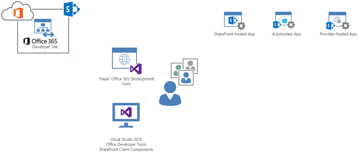
  
    
    
Разработчикам подписки на MSDN можно получить разработки клиента, который содержит сайт разработчика SharePoint. На сайте SharePointDeveloper предварительно настроенный для разработки приложений. Пользователи могут использовать не только Visual Studio 2012 разработки приложений, но с сайты для разработчиков Office 365 Napa можно использовать для построения приложений на сайте. Дополнительные сведения о начале работы с сайта разработчика Office 365 видеть [настроить среду разработки для SharePoint надстройки на Office 365](../sp-add-ins/set-up-a-development-environment-for-sharepoint-add-ins-on-office-365.md).
  
    
    
Разработчики могут приступить к созданию приложений, которые будут размещаться в Office 365 и локальных или на другие инфраструктуры в модели размещением у поставщика. Преимущества этой среде ИТ-инфраструктуры, а другие размещения рекомендации для среды разработки для SharePoint и виртуализации полностью приведены в Office 365, что позволяет разработчикам создавать приложения мгновенно. Простые внимание для этого типа среды разработки — приложений, требующих полного доверия кода развернутое toSharePoint не может быть размещено. Корпорация Майкрософт рекомендует создавать с помощью клиентской объектной модели SharePoint (CSOM) и клиентские технологии таких asJavaScript насколько это возможно. В случае, если кода полного доверия является обязательным (но не требуется, развертывание кода для запуска на SharePoint), корпорация Майкрософт рекомендует развертывание серверного кода в автоматическое размещение или размещение у поставщика в модели. Обратите внимание на то, что эти решения с кодом полного доверия, развернутые в инфраструктуру с размещением у поставщика также используется CSOM, но можно использовать языки, такие как C#. Также важно отметить, что эти приложения, развернутые в модели размещением у поставщика можно использовать другие технологии стеки и по-прежнему используется для взаимодействия с помощью SharePoint CSOM.
  
    
    
Рабочим группам разработки, создающим отдельные компоненты или приложения, содержащие большое решение, понадобится централизованная цель развертывания для интеграции тестовых компонентов. Так как каждый разработчик создает компоненты или приложения на собственном сайте разработчика Office 365, необходимо подготовить к работе централизованное семейство веб-сайтов на целевом клиенте или в локальной среде, чтобы иметь возможность развертывать в них компоненты приложений каждого разработчика. Этот подход создаст централизованное место для тестирования интеграции компонентов решения. В  [разделе данного документа, посвященном тестированию](#Testing), этот процесс рассматривается подробнее.
  
    
    

#### Средства разработки NapaOffice 365

Разработчики могут использовать средства разработки Napa для упрощения создания приложений на сайте разработчика Office 365. Средства Napa предназначены для разработчиков или опытных пользователей, профессионально разбирающихся в клиентских технологиях, и позволяют быстро разрабатывать и развертывать приложения в качестве прототипа, эксперимента или быстрого бизнес-решения. Эти средства позволяют разрабатывать функции приложений в SharePoint. Но в жизненном цикле приложения могут быть ситуации, когда приложение следует импортировать в Visual Studio. Они могу быть вызваны следующими причинами:
  
    
    

- несколько разработчиков участвуют в разработке или разрабатывают различные части решения;
    
  
- приложение достигло уровня зависимости от пользователей, при котором необходимо применять методы управления жизненным циклом;
    
  
- со временем функциональные требования к приложению изменяются, требуя дополнительных компонентов приложения (например, скомпилированных служб или источников данных);
    
  
- приложение требует интеграции с другими приложениями или компонентами решений;
    
  
- разработчикам необходимо использовать средства контроля качества, такие как автоматические сборки и тестирование.
    
  
Когда возникают эти или подобные ситуации, разработчикам необходимо экспортировать решение в среду управления версиями, например TFS, а затем учесть рекомендации и применить процедуры проектирования управления жизненным циклом приложения в последующей разработке приложения.
  
    
    

### Сайты разработки (удаленная разработка)

Организации или разработчики, которые решили не использовать сайты разработчика Office 365 как основное средство разработки приложений SharePoint, могут использовать локальные сайты разработчика для создания приложений SharePoint. В такой модели возможность сайтов разработчика Office 365 заменяется локальными сайтами разработчика, размещаемыми в ферме SharePoint. Клиенты могут создать частное облако разработки, развернув ферму SharePoint на экземплярах сайта разработчика в компании. Клиенты могут применять собственную автоматизацию управления, чтобы обеспечить создание шаблона сайта разработчика, или использовать возможности продукта SharePoint для подготовки к работе экземпляров сайта разработчика. Эта проиллюстрировано на рисунке 3.
  
    
    

**Рисунок 3. Локальная разработка приложения с шаблоном сайта разработчика**

  
    
    
 [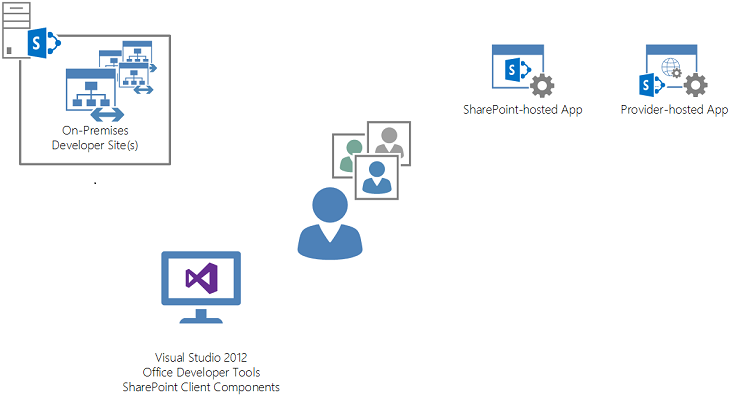
  
    
    
    
    
На рисунке 3 показаны средства разработки и типы приложений, доступные благодаря сайтам разработчика при использовании локальной фермы SharePoint в качестве узла. Обратите внимание, что средства разработки NapaOffice 365 нельзя использовать в этой среде, потому что такая возможность есть только на сайтах разработки Office 365.
  
    
    
Фермы SharePoint, на которых размещаются экземпляры Сайт разработчиков, должны отслеживаться и соответствовать целевым значениям для обслуживания, точки восстановления и времени, чтобы разработчики, использующие их для создания приложений, могли работать эффективно и без прерываний. Клиенты могут применять к этой среде концепции частного облака, например гибкость, масштабируемость и структура управления. Управление и операции должны применяться к ферме SharePoint, в которой также размещены сайты разработчика. Это поможет контролировать неотслеживаемую группу из многочисленных сайтов разработчика, которые устарели или не используются, и понимать, когда необходимо масштабировать среду.
  
    
    
Клиенты могут принятие решения об использовании инфраструктура как служба (IaaS) возможности как Microsoft Azure для ферм theSharePoint узлов, которые содержат и размещает сайты для разработчиков или собственные локальные виртуальные или физические среды. Обратите внимание на то, что с помощью этой модели не требует установки SharePoint на каждом компьютере разработчика. Разработка удаленных приложений потребуется только средства разработки Visual Studio и Office и SharePoint на рабочей станции разработчика.
  
    
    
Разработчики должны установить инфраструктуру с размещением у поставщика, чтобы развертывать приложения, размещаемые у поставщика. Хотя размещаемые у поставщика компоненты приложения SharePoint могут быть реализованы на широком спектре технологий, разработчики должны подготовить инфраструктуру для размещения тех компонентов приложения, которые работают за пределами SharePoint. Например, если команда разрабатывает приложение SharePoint, компоненты взаимодействия с пользователем и другие компоненты находятся в приложении ASP.NET, группе разработчиков следует использовать локальные версии IIS, SQL Server и др., чтобы применять традиционные шаблоны коллективной разработки управления жизненным циклом приложения для ASP.NET.
  
    
    

### Автономные среды ферм (разработка виртуализированных ферм)

Для этих решений, которые требуют развертывания полного доверия для запуска на ферму SharePoint полная реализация (часто виртуализованной) SharePoint, требуется указать код. Руководство по созданию в локальной среде разработки для SharePoint в разделе [Настройка локальной среды разработки для SharePoint надстройки](http://msdn.microsoft.com/library/b0878c12-27c9-4eea-ae3b-7e79e5a8838d%28Office.15%29.aspx).
  
    
    
На рисунке 4 показаны типы приложений, которые можно создавать, используя локальную виртуализированную среду.
  
    
    

**Рисунок 4. Локальное развертывание с виртуальной средой**

  
    
    
 [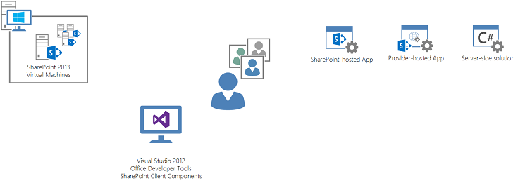
  
    
    
    
    
Разработчики могут удаленно развертывать SharePoint и размещаемые в облаке приложения в собственных фермах SharePoint, а также разрабатывать решения ферм с полным доверием. Эти фермы часто размещаются на сервере виртуализации, работающем на рабочей станции разработчика или в централизованном частном облаке виртуализации, к которому могут легко получать доступ разработчики. Среда фермы SharePoint обычно отделена от других ферм разработчиков и предоставляет уровень изоляции, необходимый при разработке кода полного доверия, который может требовать перезапуска критически важных служб (то есть IIS).
  
    
    
В автономной ферме можно выполнять удаленную разработку, а также разработку кода полного доверия, так как каждая ферма разработки является изолированной и выделенной для одного разработчика.
  
    
    
Организациям или разработчикам придется управлять фермами SharePoint, работающими на виртуальных компьютерах, и обновлять их. Для разработчиков, занимающихся одним приложением, необходимо поддерживать равенство в различных фермах разработки, работающих внутри виртуальных компьютеров. Такой подход гарантирует согласованность каждого компонента кода, разрабатываемого для приложения. Другим распространенным вопросом является стандартная конфигурация для ферм, включая доступ к домену и учетные данные, учетные данные приложения-службы, идентификаторы проверок или учетные записи и другие элементы конфигурации среды (например, сертификаты).
  
    
    
Подобно централизованной ферме для сайтов разработки эти виртуальные машины, на которых работают фермы разработчика SharePoint, могут размещаться на платформах IaaS, например Microsoft Azure, и предложениях локального частного облака.
  
    
    
Обратите внимание, что хотя виртуальные машины предлагают существенную изоляцию и независимость от других виртуальных машин разработчика, рабочим группам необходимо стремиться к поддержанию единообразия между конфигурациями виртуальных машин. Это включает общие настройки домена, учетных записей, безопасности и SharePoint, а также подключение к хранилищу системы управления версиями, например Visual Studio Team Foundation Server (TFS).
  
    
    

## Аспекты проектирования управления жизненным циклом приложения

При создании приложений SharePoint необходимо учесть несколько аспектов, чтобы внедрить управление и общие методы разработки для единообразия и качества. Применяя принципы управления жизненным циклом приложения к разработке приложения SharePoint, разработчики должны сосредоточить внимание на технических аспектах и вопросах, связанных с процессами.
  
    
    
Обычно при разработке приложений требуется поддержка платформы управления жизненным циклом приложения, например Visual Studio Team Foundation Server 2012, особенно для групп разработчиков, занимающихся одним набором проектов. Для приложений SharePoint, как и других технических решений, требуется управление хранилищем кода и версиями, службы сборки, службы тестирования и методы управления выпусками. В следующем разделе описаны соображения по поводу применения управления жизненным циклом приложения к различным моделям приложений для приложений SharePoint.
  
    
    

### Обзор

Соображения управления жизненным циклом приложения должны применяться к каждому типу приложений SharePoint без различий в концепции. Но необходимо настраивать методы и процедуры, касающиеся управления сборкой, тестированием и изменениями.
  
    
    
В некоторых приложениях SharePoint будут использоваться клиентские технологии. Большинству разработчиков, имеющих опыт разработки приложений SharePoint Server 2010, будет необходимо приспосабливаться к разработке и применению принципов управления жизненным циклом приложения к некомпилированному коду. Это включает применение таких концепций, как "сборка", к решению, в котором может не быть скомпилированного кода. В платформах управления жизненным циклом приложения, например Visual Studio 2012, есть встроенные средства проверки сборок, которые сначала компилируют код, а затем запускают тесты проверки сборки.
  
    
    
Процесс сборки и тестирования приложений SharePoint должен оставаться согласованным с традиционными процессами разработки приложений. Это включает создание плана сборки платформой управления жизненным циклом приложения, который скомпилирует решение и развернет его в целевую среду.
  
    
    

### Процессы сборки

Платформа управления жизненным циклом приложения упрощает процессы сборки приложений SharePoint. Visual Studio Team Foundation Server 2012 предлагает услуги сборки и тестирования, которые могут запускаться при возврате решений из Visual Studio 2012 (непрерывная интеграция) или с определенными запланированными интервалами.
  
    
    

#### Компоненты сборки SharePoint

Планируя процессы сборки для разработки приложений SharePoint, разработчикам необходимо учитывать взаимодействия между компонентами, как показано на рисунке 5.
  
    
    

**Рисунок 5. Компоненты сборки приложения, размещаемого в SharePoint**

  
    
    

  
    
    
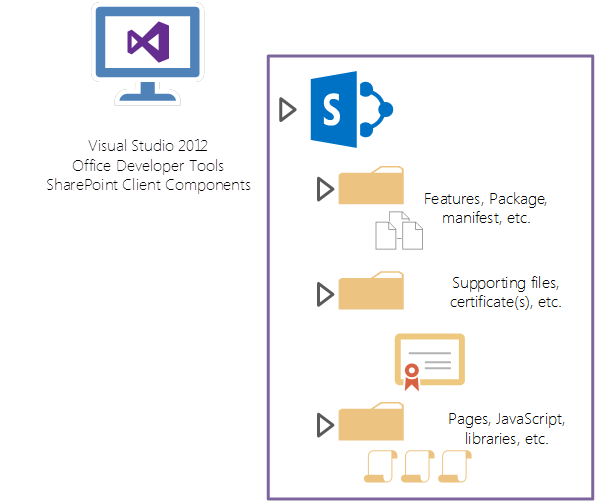
  
    
    
На рисунке 5 проиллюстрировано логическое представление приложения SharePoint. На этой иллюстрации показано Надстройки, размещаемые в SharePoint и выделены ключевые объекты приложения в составе проекта Visual Studio 2012Надстройки, размещаемые в SharePoint. Проект приложения SharePoint содержит функции, пакет и манифест, которые будут зарегистрированы в SharePoint. Проект также содержит страницы, библиотеки сценариев и другие элементы взаимодействия с пользователем, которые составляют приложение SharePoint. Кроме того, в проекте SharePoint есть поддерживающие файлы, которые включают сертификаты, необходимые для развертывания в целевую среду SharePoint.
  
    
    

**Рисунок 6. Компоненты сборки приложения с автоматическим размещением и размещением у поставщика**

  
    
    

  
    
    
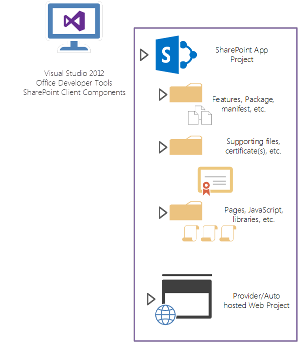
  
    
    
На рисунке 6 показано размещаемое в облаке приложение SharePoint (то есть, автоматически размещаемое или размещаемое у поставщика). Главная разница в структуре проекта заключается в том, что решение Visual Studio 2012 содержит проект приложения SharePoint, кроме одного или нескольких проектов, содержащих размещаемые в облаке компоненты приложений. Они могут включать веб-приложения, проекты базы данных SQL или приложения-услуги, которые будут развертываться в Azure или в локальную инфраструктуру, размещаемую у поставщика (например, ASP.NET), и другие компоненты решения. Инструкции по упаковке и развертыванию приложений с высоким уровнем доверия см. в статье  [Упаковка и публикация надстроек с высоким уровнем доверия для SharePoint](http://msdn.microsoft.com/library/3c28aed8-c037-407c-9154-39a74073e170%28Office.15%29.aspx).
  
    
    

**Рисунок 7. Управление жизненным циклом приложения с Visual Studio Team Foundation Server**

  
    
    

  
    
    
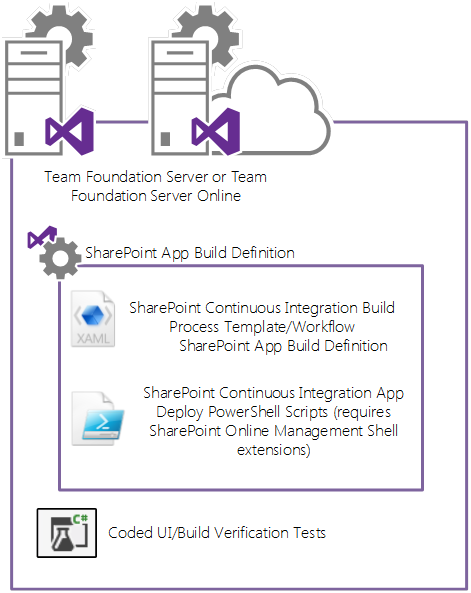
  
    
    
На рисунке 7 показан TFS в качестве платформы управления жизненным циклом приложения. Рабочие группы будут применять TFS для хранения кода и коллективной разработки, используя локальные или размещаемые в облаке службы TFS корпорации Майкрософт. TFS можно настроить для выполнения действий по сборке и развертыванию приложений SharePoint с помощью определений сборок. TFS также можно использовать для проведения тестов проверки сборки (BVT), которые можно автоматизировать путем выполнения выраженных с помощью кода тестов пользовательского интерфейса, которые входят в определение сборки.
  
    
    

**Рисунок 8. Цели сборки TFS**

  
    
    

  
    
    
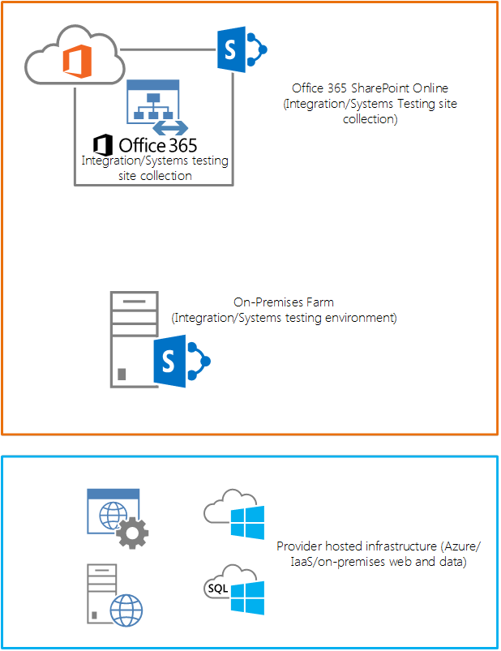
  
    
    
На рисунке 8 показаны целевые среды, в которых сценарии, выполняемые определением сборки TFS, будут развертывать компоненты приложения SharePoint. Для приложений, размещаемых в SharePoint, это включает развертывание в SharePoint Online или локальные каталоги приложений SharePoint.
  
    
    
Для приложений SharePoint, размещаемых в облаке, компоненты решения, требующие дополнительной инфраструктуры за пределами SharePoint, развертываются в целевые среды. Для приложений с автоматическим размещением это будет Microsoft Azure. Для приложений с размещением у поставщика такой инфраструктурой может быть Microsoft Azure или другие локальные или размещаемые в IaaS среды.
  
    
    

#### Создание сборки для приложений SharePoint

TFS предоставляет службы сборки, которые могут компилировать решения, возвращенные в систему управления версиями, и помещать результат в централизованное заданное место для автоматического развертывания в целевые среды. Основной метод настройки TFS для автоматического создания сборок, развертываний и тестирования приложений SharePoint состоит в создании определения сборки в Visual Studio. Определение сборки содержит информацию о том, какие проекты кода следует компилировать, и действиях после компиляции, таких как тестирование и фактическое развертывание в целевые среды. Подробнее о службе сборки Team Foundation см. в статье  [Настройка службы сборки Team Foundation](http://msdn.microsoft.com/en-us/library/vstudio/ee259687.aspx).
  
    
    
Для непрерывной интеграции определение сборки может запускаться, когда разработчики возвращают код. Кроме того, можно запланировать выполнение определения сборки с установленными интервалами.
  
    
    
ForSharePoint приложения разработчикам следует использовать проект определения построения [Непрерывной интеграции Office и SharePoint с помощью TFS 2012 г.](http://officesharepointci.codeplex.com/) для достижения запланированные построения и непрерывной интеграции. Этот проект содержит определений построений, сценарии Windows PowerShell и процесс инструкции по настройке Visual Studio Online или в локальной версии TFS, построение и развертывание приложений SharePoint в модели непрерывной интеграции. Разработчикам необходимо загрузить компоненты в этот проект и настроить их экземпляр TFS соответствующим образом. Подробные инструкции по настройке TFS с определением построения отмеченными для приложений SharePoint и настройке определения построения использовать сценарии Windows PowerShell для развертывания приложений SharePoint в целевую среду [Office / Непрерывной интеграции SharePoint с помощью TFS 2012 документации](http://officesharepointci.codeplex.com/documentation).
  
    
    

#### Настройка процедур сборки и развертывания

На рисунке 9 показан стандартный процесс для сборок и развертываний приложения SharePoint, когда определение сборки создано, настроено и развернуто в экземпляр TFS рабочей группы.
  
    
    

**Рисунок 9. Процесс сборки и развертывания с TFS**

  
    
    
 [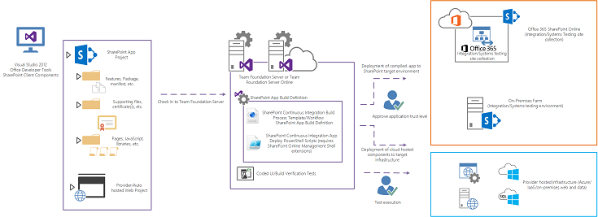
  
    
    
    
Разработчик возвращает решение Visual Studio 2012 приложения SharePoint. В зависимости от необходимой конфигурации (то есть, непрерывной интеграции или запланированной сборки) службы сборки TFS будут выполнять действия, указанные определением сборки приложения SharePoint. Это определение, настроенное разработчиками, содержит шаблон процесса сборки непрерывной интеграции, а также инструкции, которые применяются после сборки для выполнения сценариев Windows PowerShell для развертывания приложения. Обратите внимание, что для развертывания приложения в SharePoint Online понадобятся расширения командной консоли SharePoint Online. Подробнее о расширениях командной консоли SharePoint Online см. на странице  [Командная консоль SharePoint Online](http://www.microsoft.com/en-us/download/details.aspx?id=35588) в Центре загрузки.
  
    
    
Как только будет активирована сборка, TFS скомпилирует проекты, связанные с приложением SharePoint, и выполнит сценарии Windows PowerShell, чтобы развернуть решение в целевую среду SharePoint.
  
    
    

#### Доверие приложению SharePoint

После развертывания компонентов приложения в целевую среду важно обратить внимание, что прежде чем кто-либо получит доступ к приложению, включая автоматические тесты, которые могут быть частью сборки, администратор клиента (или семейства сайтов) должен указать доверие для приложения на странице информации о приложении в SharePoint. Это требование применяется к приложениям с автоматическим размещением и размещением в SharePoint. Этот выполняемый вручную процесс представляет собой изменение в процессе сборки, так как понадобится приостановить тесты, которые обычно выполняются после развертывания в целевую среду, пока не будет указано доверие для приложения.
  
    
    
Обратите внимание, что для размещаемых в облаке (автоматически или у поставщика) приложений разработчики могут развертывать компоненты, не относящиеся к SharePoint, в инфраструктуру с размещением в облаке отдельно от пакета приложений, развернутого в SharePoint.
  
    
    

**Рисунок 10. Развертывание компонентов, не относящихся к SharePoint**

  
    
    
 [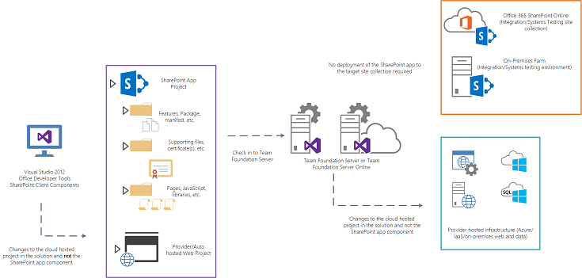
  
    
    
    
Как показано на рисунке 10, когда разработчики вносят изменения в решение, представляющее приложение SharePoint, могут возникать условия, в которых изменения проектов в рамках решения не распространяются на сам проект приложения SharePoint. При таких обстоятельствах нет необходимости повторно развертывать проект приложения SharePoint, так как он не изменился. Изменения, связанные с размещаемыми в облаке проектами, должны быть повторно развернуты.
  
    
    
Можно внести изменения в приложение, которое будет развернуто в инфраструктуру вне SharePoint, отдельно от компонентов приложения, которые развертываются в целевое семейство сайтов или клиент. Для разработчиков это означает, что можно создать процесс автоматической сборки, чтобы развертывать размещаемые в облаке компоненты часто (путем активации) и отдельно от проекта приложения SharePoint. Таким образом, не требуется выполнять вручную действия по утверждению разрешения для приложения на странице информации о приложении в SharePoint, что позволяет более выполнять непрерывные процессы развертывания и тестирования для определения сборки. Компонент приложения SharePoint решения необходимо развертывать только в ситуации, когда элементы этого проекта изменяются и требуют развертывания.
  
    
    

### Тестирование

Как описано в  [разделе о процессах сборки](#ALMBuildProcess), тестирование приложения — это метод определения того, успешно ли выполнена компиляция и развертывание приложения. Используя тестирование в качестве средства проверки сборки и развертывания приложения, рабочая группа получает представление о качестве, а также узнает о том, когда последние изменения в коде приложения привели к ошибкам в приложении SharePoint.
  
    
    
На рисунке 11 показаны типы подходов тестирования, которые лучше всего использовать с моделями приложений SharePoint.
  
    
    

**Рисунок 11. Подходы к тестированию**

  
    
    
 [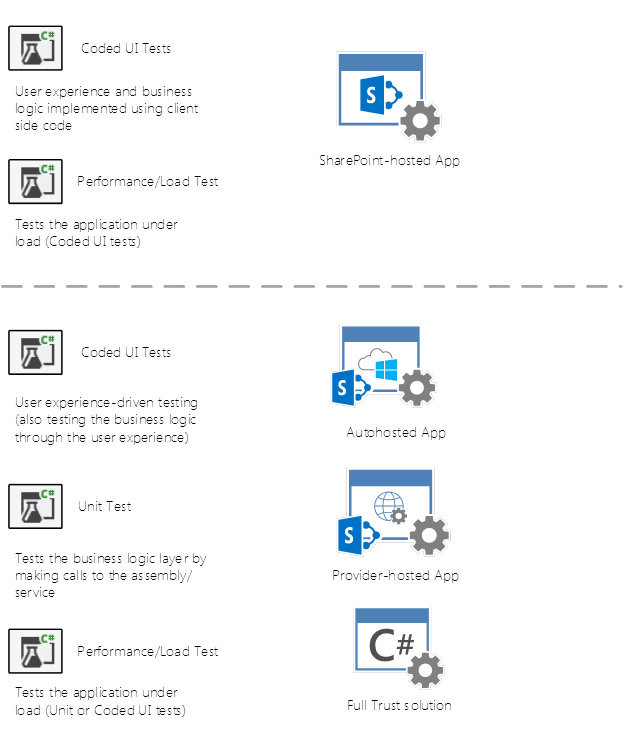
  
   
    
    
На рисунке 11 показано использование различных типов тестов для тестирования приложений SharePoint по типу. Закодированные тесты пользовательского интерфейса следует выполнять для приложений с размещением в SharePoint, где бизнес-логика и пользовательский интерфейс размещаются в одном слое. Тогда как бизнес-логика может быть абстрагирована в библиотеки JavaScript, основным средством тестирования является испытание логики в работе пользователями.
  
    
    
Размещаемые в облаке приложения (то есть, с автоматическим размещением и размещением у поставщика) могут использовать полностью закодированные тесты пользовательского интерфейса, при этом также используя модульные тесты для проверки компонентов служб решения. Благодаря этому разработчик может быть уверен в качестве реализации размещаемой инфраструктуры приложения с функциональной точки зрения.
  
    
    
В следующих сценариях рассматриваются вопросы закодированных тестов пользовательского интерфейса и других типов тестов в отношении приложений SharePoint.
  
    
    

#### Клиентский код и закодированные тесты пользовательского интерфейса

Для тестирования проверки сборки (BVT) и полного тестирования системы рекомендуется использовать закодированные тесты пользовательского интерфейса. В них используются записанные действия для тестирования не только бизнес-логики и среднего уровня приложения, но и взаимодействия с пользователем. Для приложений SharePoint, в которых используется код на стороне клиента, значительная часть точек входа и выполнения бизнес-логики может находиться на уровне взаимодействия с пользователем. Поэтому с помощью закодированных тестов пользовательского интерфейса можно проверять не только взаимодействие с пользователем, но и бизнес-логику приложения. Подробнее о закодированном тесте пользовательского интерфейса см. в статье  [Проверка кода с помощью модели автоматизации пользовательского интерфейса](http://msdn.microsoft.com/en-us/library/dd286726.aspx).
  
    
    
Закодированные тесты пользовательского интерфейса можно использовать в Надстройки, размещаемые в SharePoint, в которых может быть объединена значительная часть пользовательского интерфейса с бизнес-логикой. Эти тесты, как и другие, можно запускать из определения сборки в TFS, чтобы проверять с их помощью функциональные возможности приложения после развертывания (и приложение является доверенным для SharePoint).
  
    
    

#### Незакодированные тесты пользовательского интерфейса

В ситуациях, когда логика приложения находится вне уровня пользовательского интерфейса приложения, например в приложениях, размещенных в облаке, следует использовать комбинацию из закодированных и незакодированных тестов пользовательского интерфейса. Можно использовать тесты, например традиционные модульные тесты, для проверки качества сборки логики службы, реализованной в инфраструктуре, размещенной у поставщика. Благодаря этому разработчик получает полную уверенность в размещаемых у поставщика компонентах функции решения, которые также охватываются тестами.
  
    
    

#### Веб-тесты производительности и нагрузочные тесты

Веб-тесты производительности и нагрузочные тесты предоставляют разработчикам уверенность в том, что нагрузка пользователей на функции приложения меньше ожидаемое или прогнозируемой. Такое тестирование включает определение возможности приложения параллельно обрабатывать прогнозируемую базу пользователей, которая будет изменяться со временем. Как закодированные тесты пользовательского интерфейса, так и модульные тесты можно использовать как веб-тесты производительности и нагрузочные тесты. С помощью платформ управления жизненным циклом приложения, например TFS, эти тесты можно использовать для нагрузочного тестирования приложения.
  
    
    
Обратите внимание, что тестирование инфраструктуры не является главной целью этих тестов, когда они используются для проверки приложений SharePoint. Для инфраструктуры (с размещением в SharePoint или у поставщика) необходимо установить аналогичную базу нагрузки и производительности. Веб-тесты производительности и нагрузочные тесты для приложения определяют проблемы инфраструктуры, но их следует рассматривать в первую очередь как средства тестирования производительности приложения.
  
    
    
Подробнее о веб-тестах производительности и нагрузочных тестах см. в статье  [Проведение тестов производительности приложения перед его выпуском](http://msdn.microsoft.com/en-us/library/vstudio/dn250793.aspx).
  
    
    

#### Качество и тестовые среды

Во многих организациях есть несколько сред тестирования, которые могут быть физическими или виртуальными и отдельными друг от друга. Эти среды могут различаться в зависимости от процесса управления жизненным циклом приложения, законодательных требований и комбинации обоих этих факторов. Чтобы определять количество и типы тестовых сред, которые следует использовать рабочим группам, следующее руководство основывается на функциональных методиках, свойственных приложениям SharePoint, а также использует общие методики управления жизненным циклом приложения для разработки программного обеспечения.
  
    
    

#### Тестирование силами разработчиков

Тестирование силами разработчиков можно применять в средах, где разработчики создают свой компонент решения. Многие разработчики, работающие над различными аспектами или компонентами более крупного приложения, будут проводить собственные модульные тесты, закодированные тесты пользовательского интерфейса и развертывание кода приложения на своих сайтах разработки.
  
    
    

**Рисунок 12. Процесс тестирования силами разработчиков**

  
    
    
 [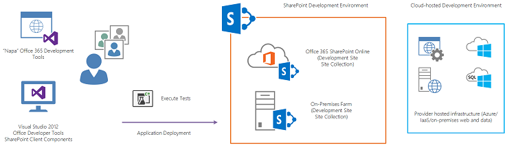
  
    
    
    
Разработчики будут выполнять проверки Visual Studio для компонентов решения, развернутых на собственном сайте Office 365 или локальном сайте разработчика. Тесты для приложений, размещаемых в облаке, также будут выполняться из Visual Studio на компонентах решения, находящихся в инфраструктуре, размещаемой у поставщика. Эти компоненты будут находиться в подписке Microsoft Azure разработчика.
  
    
    
Обратите внимание, что для этого подхода предполагается, что у разработчиков есть как индивидуальные сайты разработчика Office 365, так и подписки Microsoft Azure, предоставляемые через подписки MSDN. Даже если разработчики создают приложения для локального развертывания, эти службы разработчика можно использовать для разработки и тестирования.
  
    
    
Если у разработчиков нет этих служб или им необходимо выполнять всю разработку локально, они будут выполнять тесты для своих компонентов на семействе сайтов разработчика локальной фермы и в зависящей от разработчика инфраструктуре, размещаемой у поставщика. Инфраструктура, размещаемая у поставщика, может находиться на выделенных виртуальных машинах разработчика. Для разработки решений полного доверия разработчикам будет необходима собственная виртуальная ферма SharePoint и размещаемая у поставщика инфраструктура.
  
    
    

#### Интеграция и тестирование систем

Для тестирования приложения все компоненты разработки должны быть собраны и развернуты в централизованной среде. Эта среда интеграции предоставляет место, где разработчики могут развертывать созданные ими компоненты решения и наблюдать за их взаимодействием с другими компонентами решения, написанными другими разработчиками.
  
    
    

**Рисунок 13. Среда тестирования интеграции**

  
    
    
 [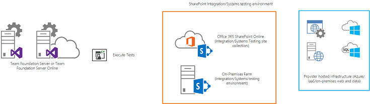
  
    
    
Для этого типа тестирования платформу управления жизненным циклом Приложений построит и развернет приложение SharePoint, а также все необходимые компоненты в целевых средах. Для приложений, размещенных в SharePoint это будет на сайте Office 365 или на локальном/IaaS семейства сайтов SharePoint, в частности указывается для интеграция и тестирование систем. Для приложений, размещаемых в облаке SharePoint TFS также развернуть компоненты для централизованного подписки Microsoft Azure, где будут настроены службы специально для тестирования интеграции/систем. TFS будет выполнять закодированные тесты пользовательского интерфейса или подразделения для приложения SharePoint, а также все компоненты, необходимые для решения на размещенной инфраструктуры.
  
    
    

#### Приемочное тестирование пользователями и тестирование контроля качества

Для приемочного тестирования пользователями у организаций часто есть отдельные среды, где эта функция выполняется отдельно от тестирования интеграции и систем. Разделение этих сред тестирования позволяет избежать влияния срока автоматического постоянного выпуска и тестирования на действия приемочного тестирования пользователями, когда пользователи могут выполнять тесты на определенной сборке приложения в течение длительного срока.
  
    
    

**Рисунок 14. Приемочное тестирование пользователями**

  
    
    
 [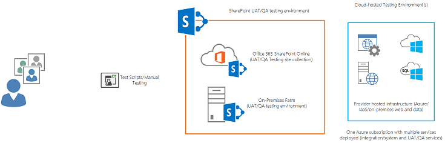
  
    
    
    
Как показано на рисунке 14, пользователи, которым поручено проводить приемочное или организационное тестирование, выполняют тестовые сценарии в стабильной среде, которая фокусируется на известной сборке приложения. Пока будет выполняться развертывание и тестирование кода в интегрированной среде, пользователи будут вручную проводить тесты для проверки того, соответствует ли приложение необходимым вариантам использования или тестовым случаям. Приложение и размещаемая у поставщика среда будет развернута (обычно выполняется диспетчером выпусков) в эту тестовую среду. Автоматическое развертывание также возможно. В таком виде развертывания используется выделенное определение сборки приемочного тестирования пользователями в сервере TFS, который зеркалирует сервер, выполняющий развертывание для тестирования интеграции и среды тестирования систем.
  
    
    
Для инфраструктуры, размещаемой в облаке, можно выполнять развертывание в подписку Microsoft Azure, используемую совместно с тестовой средой интеграции или систем, если службам присвоены имена и они настроены для параллельного развертывания в качестве отдельных служб или баз данных. Этот подход предлагает набор служб и баз данных в подписке тестирования Microsoft Azure для тестирования интеграции и систем, а также приемочного тестирования пользователями и тестирования контроля качества, как показано на рисунке 15.
  
    
    

**Рисунок 15. Тестирование интеграции и приемочное тестирование пользователями**

  
    
    
 [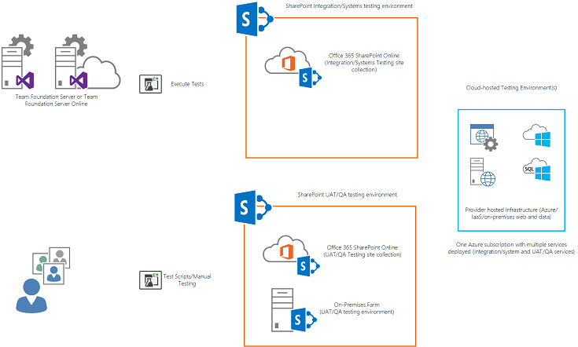
  
   
    
    

#### Методики распространения кода

Процесс распространения кода между средами разработки и тестирования, а также рабочей средой должен выполняться с использованием хорошо определенного процесса управления выпусками. На рисунке 16 показано, как разработчики развертывают компоненты своего решения в среды разработки для модульного тестирования.
  
    
    

**Рисунок 16. Процесс управления выпусками**

  
    
    
 [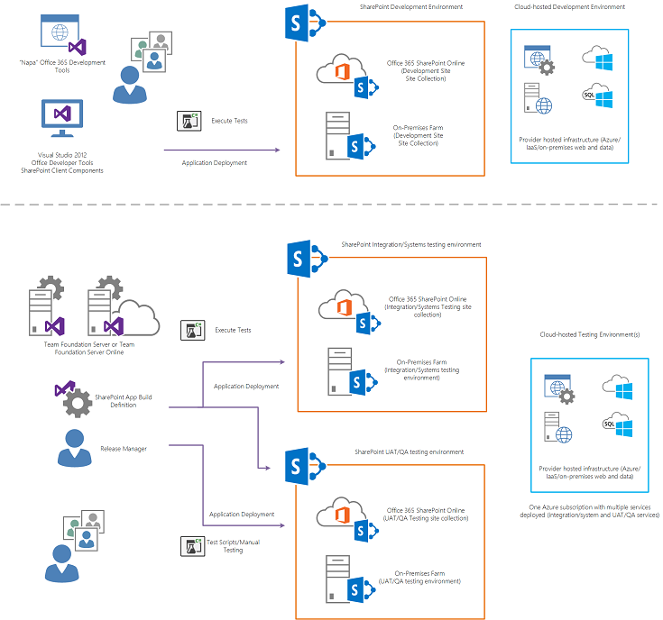
  
   
    
    
После возврата в TFS процедура автоматической сборки компилирует и развертывает решения в целевой среде тестирования интеграции и систем, где в рамках определения сборки в TFS выполняются соответствующие проверки. Этот подход включает развертывание компонентов решения, размещаемых у поставщика, в целевую среду (Microsoft Azure или локальные среды). Обратите внимание, что для инфраструктуры Microsoft Azure можно использовать ту же подписку Microsoft Azure, которая использовалась для тестирования интеграции и системы, приемочного тестирования пользователями и тестирования контроля качества, предполагая, что они развернуты в различных пространствах имен и отдельных базах данных SQL.
  
    
    
Диспетчер выпусков или отдельное определение сборки TFS, в большинстве случаев запускаемое вручную, может развертываться в среду агента пользователя или TQA. Этот подход помогает контролировать версию сборки, которую будут тестировать пользователи. Диспетчеры выпусков могут комплектовать сборки из общей папки TFS и самостоятельно выполнять процесс развертывания. Управление выпусками будет применяться в течение всего процесса, от распространения до выпуска, для развертывания приложения в рабочей среде и отслеживания его установки и проверки сборки путем тестов.
  
    
    

## Исправления и обновления приложений

Конкретные инструкции на как разработчики приложений могут обновление приложений корпорацией Майкрософт. Платформа SharePoint поддерживает уведомление о новой версии приложений для пользователей.
  
    
    
Соображения по поводу внедрения стратегии исправлений и обновлений приложения SharePoint см. в статье  [Обновление надстроек для SharePoint](http://msdn.microsoft.com/library/3edcb33c-fa9e-4e9e-82d6-5519fd981324%28Office.15%29.aspx).
  
    
    
Рекомендуемый шаблон изменений приложений согласуется с имеющимися шаблонами разработки кода и инженерной поддержки. Это включает упорядоченное ветвление и объединение устранений ошибок и разработки компонентов, а также добавочных развертываний в целевые каталоги приложений. Предыдущее руководство можно использовать для внесения изменений в приложения для SharePoint и их развертывания в целевые каталоги приложений или магазин.
  
    
    
В статье  [Процедура обновления надстроек для SharePoint](http://msdn.microsoft.com/library/3dba209d-cb98-4e5d-b4b2-fad31e667ca1%28Office.15%29.aspx) представлено дополнительное тактическое руководство по методикам обновления приложений SharePoint. Это включает ускорение тестирования развертывания путем сокращения цикла обновления, в ходе которого обновления приложения отражаются в ферме в тестовых средах. Кроме того, в этой статье приведено руководство по согласовывать состояние в различных моделях развертывания приложений.
  
    
    

## См. также

-  [Выбор шаблонов для разработки и размещения надстройки SharePoint](http://msdn.microsoft.com/library/05ce5435-0a03-4ddc-976b-c33b08d03457%28Office.15%29.aspx)
    
  
-  [Настройка службы сборки Team Foundation](http://msdn.microsoft.com/en-us/library/vstudio/ee259687.aspx)
    
  
-  [Использование сайта Office 365 SharePoint для авторизации размещенных у поставщика надстроек на локальном сайте SharePoint](http://msdn.microsoft.com/library/2f65ba3f-b246-4064-b4fb-ad18399d387a%28Office.15%29.aspx)
    
  
-  [Обзор разработки решений для SharePoint](sharepoint-development-overview.md)
    
  
-  [Что такое Open Data Protocol?](http://www.odata.org/)
    
  
-  [Платформа авторизации OAuth 2.0](http://oauth.net/)
    
  

  
    
    

