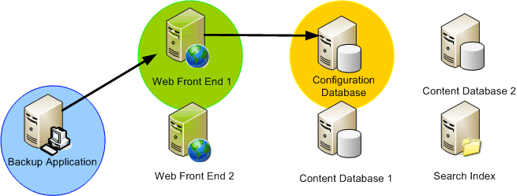
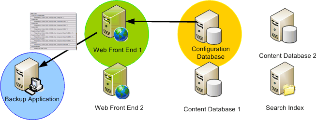
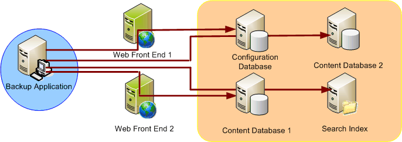

# Служба модуля записи VSS SharePoint
 **Сводка:** Сведения о характеристики и функции модуля записи службы теневого копирования томов (VSS) для Microsoft SharePoint.
Служба теневого копирования ТОМОВ, включенные в состав Windows Server — это инфраструктуры, которая предоставляет возможности встроенных теневой копии. Теневые копии, созданные с VSS дополнить администратор хранилища ленту архивирования решения для резервного копирования, предоставляя высоким качеством копий момент времени, которые можно создавать и легко восстановить и эффективно, тем самым помогая упростить ряд аспектов хранения и Управление данными. Microsoft SharePoint Foundation используется служба теневого копирования ТОМОВ для упрощения резервного копирования и восстановления. 
  
    
    

## Характеристики системы

Ниже приведены компоненты решения VSS SharePoint Foundation и характеристики:
  
    
    

- **Единый модуль записи ссылок VSS**. До настоящего времени отсутствовал эффективный способ описания данных приложений для приложений резервного копирования. Для работы с данными приложений на различных платформах Windows в приложениях резервного копирования использовалось множество интерфейсов API, для которых требовалось написание специального кода. Применение модуля записи VSS SharePoint Foundation (который в дальнейшем называется "модуль записи SPF-VSS") позволяет значительно повысить эффективность резервного копирования данных в SharePoint Foundation.
    
  
- **Полное резервное копирование и восстановление фермы в аварийных ситуациях**. При использовании модуля записи SPF-VSS приложение резервного копирования (запрашивающая сторона) обращается к интерфейсу API VSS и запрашивает резервное копирование или восстановление всей фермы SharePoint Foundation, в том числе параметров настройки и конфигурации фермы. (Хранилище конфигурации IIS, которое в основном представляет файл  `applicationhost.config`, не включается. Его необходимо архивировать и восстанавливать отдельно.)
    
  
- **Детализация на уровне базы данных**. При использовании модуля записи SPF-VSS запрашивающая сторона может выбрать для включения в операции резервного копирования и восстановления все базы данных, сегмент баз данных (множественный выбор) или отдельную базу (одиночный выбор). В модуле записи поддерживается выбор любых баз данных, за исключением баз данных конфигурации и баз данных контента центра администрирования. Резервное копирование и восстановление этих баз данных осуществляются только в составе всей фермы. (Хранилище конфигурации IIS не включается. Его необходимо архивировать и восстанавливать отдельно.)
    
  
- **Опись баз данных**. Перед выполнением резервного копирования модулем записи SPF-VSS создается плоский список баз данных, выбранных для резервного копирования в ферме. Этот список возвращается запрашивающей стороне и используется для выполнения резервного копирования в месте физического расположения базы данных.
    
  
- **Поддержка ферм**. Модуль записи обеспечивает ограниченную поддержку синхронизации резервного копирования и восстановления фермы SharePoint Foundation. Модуль записи предоставляет запрашивающей стороне список серверов, баз данных и файлов, связанных с фермой. Запрашивающая сторона устанавливает подключение к каждому из серверов и вызывает модуль записи SPF-VSS для создания на них резервных копий или запуска операций восстановления.
    
  
- **Непрерывное резервное копирование контента**. Если в процессе резервного копирования файла он изменяется в приложении, возможно повреждение файла. В службе VSS создается моментальный снимок файлов, включаемых в теневую копию, что позволяет не прерывать работу с исходными файлами.
    
  
- **Подключаемое резервное копирование и восстановление баз данных сторонних производителей**. Модуль записи SPF-VSS поддерживает подключаемое (расширяемое) резервное копирование решений сторонних производителей, построенных на базе SharePoint Foundation. Однако в процесс резервного копирования могут включаться только те базы данных, которые зарегистрированы в базе данных конфигурации. Другие дополнительные файлы и незарегистрированные базы данных не поддерживаются.
    
  
- **Резервное копирование и восстановление файлов индекса поиска**. Поскольку файлы индекса поиска хранятся в файловой системе, для их резервного копирования требуется отдельный модуль записи. Чтобы разрешить эту проблему, в SharePoint Foundation используется отдельный модуль записи, предназначенный для работы с файлами индекса поиска. Для упрощения резервного копирования в SharePoint Foundation объявляются зависимости между модулями записи, которые обеспечивают резервное копирование или восстановление файлов индекса поиска при резервном копировании зарегистрированных в ферме баз данных.
    
  
- **Полный откат**. Модуль записи SPF-VSS обрабатывает все компоненты в развертывании SharePoint Foundation, в том числе базы данных конфигурации и контента, а также базу данных и индекс поиска. Как отмечено ранее, модуль записи также имеет зависимость от модуля поиска, обрабатывающего все файлы индексов поиска для резервного копирования и восстановления. Во время восстановления модуль записи поддерживает полный откат развертывания SharePoint Foundation за счет восстановления предыдущей резервной копии фермы. (Хранилище конфигурации IIS не включается. Оно должно архивироваться и восстанавливаться отдельно.)
    
    > **Примечание:** Важные сведения о восстановлений в разделе «Восстановление» в [опросчики VSS и SharePoint](vss-requestors-and-sharepoint.md) .
- **Синхронизация баз данных после восстановления**. Чтобы обеспечить синхронизацию всех баз данных в ферме, по завершении восстановления каждая база автоматически отсоединяется от фермы и повторно подсоединяется к ней. Выполнение дополнительных процедур для синхронизации восстановленных баз данных не требуется.
    
  

> **Важные:** Если вы используете псевдонимы SQL в ферме серверов SharePoint Foundation для подключения к SQL Server, необходимо установить компоненты клиентского подключения SQL на серверах фермы перед использованием модуля записи SPF-VSS для резервного копирования и восстановления. Компоненты включают поставщик SQL WMI для управление конфигурацией, которое модуля записи SPF-VSS требуется определить псевдонимы SQL к правильному серверу SQL. Необязательно для установки средства управления, такие как SQL Management Studio. Необходимо использовать тот же источник установки (например, DVD с данными), которая используется для установки полной версии SQL Server. (Не используйте отдельные, автономного версии клиентских компонентов. Эта версия не включает поставщик SQL WMI.) Выберите для создания настраиваемой установки и выберите только клиентских компонентов для установки. 
  
    
    

## Функции модуля записи SPF-VSS

Модуль записи SPF-VSS предназначен для выполнения следующих функций.
  
    
    

1. Построение компонентов SharePoint Foundation.
    
  - Создание полного списка компонентов в ферме SharePoint Foundation.
    
  
  - Необязательная привязка к процессам резервного копирования или восстановления.
    
  

  
  

  

  
2. Резервное копирование фермы или базы данных.
    
  - Запрос резервного копирования фермы или базы данных SharePoint Foundation с помощью службы VSS.
    
  

  
  

  

  
3. Восстановление фермы или базы данных.
    
  - Запрос восстановления фермы или базы данных SharePoint Foundation с помощью службы VSS.
    
  
  - Реализация метода **postRestore()** для синхронизации таблиц сайта.
    
  

  
  

  

  

## Дальнейшие действия

Узнайте, как создавать и использовать запросов VSS для SharePoint:
  
    
    

-  [Опросчики VSS и SharePoint](vss-requestors-and-sharepoint.md)
    
  

## Дополнительные ресурсы

-  [Общие сведения о SharePoint и службы теневого копирования томов](overview-of-sharepoint-and-the-volume-shadow-copy-service.md)
    
  

