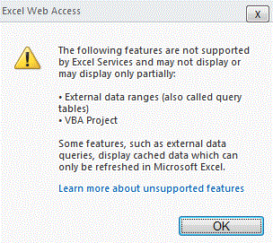

# Поддерживаемые и неподдерживаемые возможностиSupported and Unsupported Features

  
    
    

Microsoft Excel — многофункциональное приложение. С каждым выпуском разрыв между Excel и Службы Excel в функциональном наполнении постоянно сокращается, а число неподдерживаемых возможностей уменьшается. Однако Microsoft SharePoint Server 2010 не позволяет обеспечить поддержку всех возможностей Excel во второй версии Службы Excel. При выборе возможностей, которые требуется поддерживать, приоритет следует отдавать тем из них, которые необходимы в наиболее важных сценариях Службы Excel, добиваясь при этом, чтобы Службы Excel оставались службами серверного класса, отвечающими ожиданиям клиентов в отношении надежности, масштабируемости и безопасности.Microsoft Excel is feature-rich. With every release, the functionality gap between Excel and Excel Services gets narrower, and the number of unsupported features is reduced. But is not possible to support every Excel feature in the second version of Excel Services, in Microsoft SharePoint Server 2010. When deciding which feature to support, priorities are given to features that are needed in key Excel Services scenarios, and to ensuring that Excel Services is a server-grade service that meets customers' expectations for reliability, scalability, and security.
  
    
    

> **Примечание:** В этом разделе предполагается, что вы знакомы с что поддерживается и не поддерживаются в Microsoft Office SharePoint Server 2007.**Note:** This topic assumes that you are familiar with what is supported and unsupported in Microsoft Office SharePoint Server 2007. Дополнительные сведения о неподдерживаемых возможностях можно найти в Office SharePoint Server 2007 в [Неподдерживаемые функции в службах Excel](http://msdn.microsoft.com/en-us/library/ms496823.aspx).You can find more information about the unsupported features in Office SharePoint Server 2007 in  [Unsupported Features in Excel Services](http://msdn.microsoft.com/en-us/library/ms496823.aspx). 
  
    
    

## Поддержка новых возможностей ExcelSupport for New Excel Features

Большинство новых средств Microsoft Excel 2010 в том или ином объеме действуют и в Службы Excel. Некоторые из них просто отображаются, как и в Excel. Остальные не только отображаются, но и являются интерактивными.Most of the new features in Microsoft Excel 2010 work in some way in Excel Services. Some features display as they do in Excel. Others can be displayed and are also interactive.
  
    
    
 **Новые элементы, доступные для просмотра:****Following are new features that can be viewed:**
  
    
    

- СпарклайныSparklines
    
  
-  [Усовершенствованные наборы значков (Возможно, на английском языке)](http://blogs.msdn.com/excel/archive/2009/08/05/icon-set-improvements-in-excel-2010.aspx) и [гистограммы (Возможно, на английском языке)](http://blogs.msdn.com/excel/archive/2009/08/07/data-bar-improvements-in-excel-2010.aspx)[Icon set](http://blogs.msdn.com/excel/archive/2009/08/05/icon-set-improvements-in-excel-2010.aspx) and [data bar improvements](http://blogs.msdn.com/excel/archive/2009/08/07/data-bar-improvements-in-excel-2010.aspx)
    
  
-  [Именованные наборы сводных таблиц (Возможно, на английском языке)PivotTable named sets](http://blogs.msdn.com/excel/archive/2009/10/05/pivottable-named-sets-in-excel-2010.aspx)
    
  
-  [Усовершенствованные сводные таблицы (Возможно, на английском языке)PivotTable improvements](http://blogs.msdn.com/excel/archive/2009/10/15/a-few-more-pivottable-improvements-in-excel-2010.aspx)
    
  
 **Новые элементы, доступные как для просмотра, так и для интерактивного взаимодействия:****Following are new features that can be viewed and interacted with:**
  
    
    

- СрезыSlicers
    
  
- Файлы PowerPivotPowerPivot files
    
  
Поддерживаются также новые функции Excel. Например, внедренные изображения, уже давно реализованные в Excel, теперь поддерживаются и могут просматриваться в Службы Excel.The new functions in Excel are also supported. Embedded images, a long-time feature of Excel, are now supported and can be viewed in Excel Services. 
  
    
    

## Возможности, ранее препятствовавшие загрузке файлов ExcelFeatures that Previously Prevented Excel Files from Loading

В Office SharePoint Server 2007 книги Excel, содержащие неподдерживаемые элементы (макросы VBA, элементы управления форм и т. п.), не загружаются в Службы Excel.In Office SharePoint Server 2007, Excel workbooks that contain unsupported features like VBA macros, form controls, and so on are not loaded in Excel Services.
  
    
    
В SharePoint Server 2010 для преодоления этого ограничения Службы Excel игнорирует некоторые неподдерживаемые возможности. Другими словами, вместо того, чтобы блокировать загрузку всего файла, Службы Excel загружает файл, но скрывает элементы, не поддерживаемые в Службы Excel.In SharePoint Server 2010, to help users work with this limitation, Excel Services ignores certain unsupported features. In other words, rather than blocking the entire file from loading, Excel Services loads the file but you do not see the features that Excel Services does not support.
  
    
    
Элементы, наличие которых препятствует загрузке файлов в Службы Excel:Following are features that do not prevent Excel Services from loading a file:
  
    
    

- Примечания к ячейкам.Cell comments.
    
  
- Формулы со ссылками на внешние книги.Formula references to external books.
    
  
- Таблицы запросов (или диапазоны внешних данных).Query tables (also known as external data ranges).
    
  
- Microsoft Visual Basic для приложений (VBA).Microsoft Visual Basic for Applications (VBA).
    
  
- Любые технологии OfficeArt: фигуры, WordArt, SmartArt, организационные диаграммы, схемы, строки подписей, рукописные примечания и др.Any OfficeArt technology. For example, Shapes, WordArt, SmartArt, organization chart, diagrams, signature lines, ink annotations, and so on.
    
  
Следует иметь в виду, что эти элементы по-прежнему остаются неподдерживаемыми. Это означает, что они не отображаются, не выполняются и не функционируют так, как это происходит в клиентской системе. Большинство элементов из этого списка не отображается в Службы Excel. Например, если при просмотре в клиенте рядом с ячейкой A1 отображается фигура, то при просмотре на сервере она не будет видна. В других элементах, таких как ссылки в формулах и таблицы запросов, отображаются значения, которые в последний раз обновлялись на стороне клиента. Иными словами, значения ячеек остаются на своих местах, но их нельзя обновлять.Note that these features continue to be unsupported. This means that they do not render, execute, or work in any way as they do on the client. Most of the features in the list do not render in Excel Services. For example, if there is a Shape near cell A1 when viewed in the client, you see no Shape when viewed on the server. Other features, like formula references and query tables, show values that were last refreshed on the client. In other words, the values in the cells are still there, but you cannot update them. 
  
    
    
И наконец, на сервере не выполняется код VBA. В Office SharePoint Server 2007 загрузка файлов *.xlsm в Службы Excel не поддерживалась. В SharePoint Server 2010 макросы VBA игнорируются в Службы Excel. Поэтому файлы *.xlsm теперь можно загружать в Службы Excel.Lastly, VBA code does not execute on the server. In Office SharePoint Server 2007, Excel Services did not support loading *.xlsm files. In SharePoint Server 2010, Excel Services ignores VBA macros. Therefore, *.xlsm files can now be loaded in Excel Services.
  
    
    

## Просмотр файла с игнорируемыми возможностямиViewing a File with Ignored Features

Если в Службы Excel могут загружаться файлы и не отображаться некоторые неподдерживаемые элементы, как определить, что в просматриваемом файле какие-то возможности отсутствуют? Об этом будет сигнализировать уведомление, показываемое в Службы Excel над листом. Ниже показан снимок экрана с таким уведомлением.If Excel Services is able to load files and not render certain unsupported features, how can you know the file that you are viewing is missing some features? You know that you are viewing a file with some missing features because Excel Services displays a notification above the worksheet to alert you. The following screenshot shows the notification.
  
    
    

**Уведомление о неподдерживаемых возможностях вверху книги****Unsupported Features notification on top of workbook**

  
    
    
Это уведомление служит первым признаком того, что файл изображается иначе, чем в клиенте Excel.This notification is the first indication that the file is rendering differently than it would in the Excel client.
  
    
    
На следующем рисунке показана ссылка **Подробнее о неподдерживаемых возможностях**; щелкнув ее, можно узнать, какие именно неподдерживаемые возможности использованы в файле.In the following figure, clicking **Learn more about unsupported features** provides information about which unsupported features are in the file.
  
    
    

**Сообщение о неподдерживаемых возможностях для VBA****Unsupported feature error message for VBA**

  
    
    

  
    
    

  
    
    
Не отображаются обрезанного изображения (которые отсутствующие компоненты).Cropped images are not displayed (that is, missing features). 
  
    
    

    
> **Примечание:** Для книги, содержащие игнорируются или отсутствует неподдерживаемые функции, которые загружены в представлении, благодаря панель уведомлений попытка сохранить копию книги включает в себя Удаление неподдерживаемых возможностей.**Note:** For workbooks that contain ignored or missing unsupported features that loaded in view mode with a notification bar, attempting to save a copy of the workbook involves removing the unsupported features. Диалоговое окно оповещения пользователя это.A dialog box alerts the user of this. 
  
    
    

## Другие неподдерживаемые возможностиOther Unsupported Features

Другие неподдерживаемые возможности продолжают действовать так, как это делается в Office SharePoint Server 2007 для Службы Excel. То есть Службы Excel блокируется загрузка файла, если обнаруживает наличие одного или нескольких новых компонентов. Пользователи получат сообщение о том, что не может загрузить файл, как показано на следующем снимке экрана.All other unsupported features continue to behave as they do in Office SharePoint Server 2007 for Excel Services. That is, Excel Services blocks loading of a file if it detects the existence of one or more of these unsupported features. Users are informed that the file cannot be loaded, as shown in the following screen shot. 
  
    
    

> **Примечание:** В разделе [Неподдерживаемые функции в службах Excel](http://msdn.microsoft.com/en-us/library/ms496823.aspx) содержатся дополнительные сведения о новых компонентов.**Note:** The  [Unsupported Features in Excel Services](http://msdn.microsoft.com/en-us/library/ms496823.aspx) topic contains more details about these unsupported features.
  
    
    

> **Осторожность:** Информационная панель со списком неподдерживаемых возможностей не отображается, если файл загружен из веб-части.**Caution:** The information bar with the list of unsupported features is not displayed if the file is loaded from a Web Part. 
  
    
    

**Сообщение о неподдерживаемых возможностях для карт XML****Unsupported feature error message for XML maps**

  
    
    

  
    
    

  
    
    
В отличие от книги с внешним ссылки диаграмм с помощью внешних ссылок блокируется загрузка.Unlike workbooks with external links, charts with external links are blocked from loading. 
  
    
    

## См. такжеSee also

#### Основные понятияConcepts

  
    
    
 [Общие сведения о службах ExcelExcel Services Overview](excel-services-overview.md)
  
    
    
 [Архитектура служб ExcelExcel Services Architecture](excel-services-architecture.md)
  
    
    
 [Блоги, форумы и ресурсы для служб ExcelExcel Services Blogs, Forums, and Resources](excel-services-blogs-forums-and-resources.md)
#### Другие ресурсыOther resources

  
    
    
 [Пошаговое руководство. Разработка настраиваемого приложения с помощью веб-служб ExcelWalkthrough: Developing a Custom Application Using Excel Web Services](walkthrough-developing-a-custom-application-using-excel-web-services.md)
