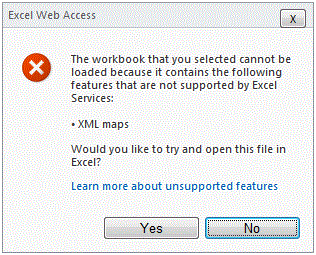

# Поддерживаемые и неподдерживаемые возможности

  
    
    

Microsoft Excel — многофункциональное приложение. С каждым выпуском разрыв между Excel и Службы Excel в функциональном наполнении постоянно сокращается, а число неподдерживаемых возможностей уменьшается. Однако Microsoft SharePoint Server 2010 не позволяет обеспечить поддержку всех возможностей Excel во второй версии Службы Excel. При выборе возможностей, которые требуется поддерживать, приоритет следует отдавать тем из них, которые необходимы в наиболее важных сценариях Службы Excel, добиваясь при этом, чтобы Службы Excel оставались службами серверного класса, отвечающими ожиданиям клиентов в отношении надежности, масштабируемости и безопасности.
  
> [!NOTE]
> [!Примечание] При изучении данного раздела необходимо знать, что поддерживается и что не поддерживается в Microsoft Office SharePoint Server 2007. Дополнительные сведения о возможностях, не поддерживаемых в Office SharePoint Server 2007, см. в разделе  [Unsupported Features in Excel Services (Возможно, на английском языке)](http://msdn.microsoft.com/en-us/library/ms496823.aspx) (Неподдерживаемые возможности в службах Excel). 
  
    
    

## Поддержка новых возможностей Excel

Большинство новых средств Microsoft Excel 2010 в том или ином объеме действуют и в Службы Excel. Некоторые из них просто отображаются, как и в Excel. Остальные не только отображаются, но и являются интерактивными.
  
    
    
 **Новые элементы, доступные для просмотра:**
  
    
    

- Спарклайны
    
  
-  [Усовершенствованные наборы значков (Возможно, на английском языке)](http://blogs.msdn.com/excel/archive/2009/08/05/icon-set-improvements-in-excel-2010.aspx) и [гистограммы (Возможно, на английском языке)](http://blogs.msdn.com/excel/archive/2009/08/07/data-bar-improvements-in-excel-2010.aspx)
    
  
-  [Именованные наборы сводных таблиц (Возможно, на английском языке)](http://blogs.msdn.com/excel/archive/2009/10/05/pivottable-named-sets-in-excel-2010.aspx)
    
  
-  [Усовершенствованные сводные таблицы (Возможно, на английском языке)](http://blogs.msdn.com/excel/archive/2009/10/15/a-few-more-pivottable-improvements-in-excel-2010.aspx)
    
  
 **Новые элементы, доступные как для просмотра, так и для интерактивного взаимодействия:**
  
    
    

- Срезы
    
  
- Файлы PowerPivot
    
  
Поддерживаются также новые функции Excel. Например, внедренные изображения, уже давно реализованные в Excel, теперь поддерживаются и могут просматриваться в Службы Excel. 
  
    
    

## Возможности, ранее препятствовавшие загрузке файлов Excel

В Office SharePoint Server 2007 книги Excel, содержащие неподдерживаемые элементы (макросы VBA, элементы управления форм и т. п.), не загружаются в Службы Excel.
  
    
    
В SharePoint Server 2010 для преодоления этого ограничения Службы Excel игнорирует некоторые неподдерживаемые возможности. Другими словами, вместо того, чтобы блокировать загрузку всего файла, Службы Excel загружает файл, но скрывает элементы, не поддерживаемые в Службы Excel.
  
    
    
Элементы, наличие которых препятствует загрузке файлов в Службы Excel:
  
    
    

- Примечания к ячейкам.
    
  
- Формулы со ссылками на внешние книги.
    
  
- Таблицы запросов (или диапазоны внешних данных).
    
  
- Microsoft Visual Basic для приложений (VBA).
    
  
- Любые технологии OfficeArt: фигуры, WordArt, SmartArt, организационные диаграммы, схемы, строки подписей, рукописные примечания и др.
    
  
Следует иметь в виду, что эти элементы по-прежнему остаются неподдерживаемыми. Это означает, что они не отображаются, не выполняются и не функционируют так, как это происходит в клиентской системе. Большинство элементов из этого списка не отображается в Службы Excel. Например, если при просмотре в клиенте рядом с ячейкой A1 отображается фигура, то при просмотре на сервере она не будет видна. В других элементах, таких как ссылки в формулах и таблицы запросов, отображаются значения, которые в последний раз обновлялись на стороне клиента. Иными словами, значения ячеек остаются на своих местах, но их нельзя обновлять. 
  
    
    
И наконец, на сервере не выполняется код VBA. В Office SharePoint Server 2007 загрузка файлов *.xlsm в Службы Excel не поддерживалась. В SharePoint Server 2010 макросы VBA игнорируются в Службы Excel. Поэтому файлы *.xlsm теперь можно загружать в Службы Excel.
  
    
    

## Просмотр файла с игнорируемыми возможностями

Если в Службы Excel могут загружаться файлы и не отображаться некоторые неподдерживаемые элементы, как определить, что в просматриваемом файле какие-то возможности отсутствуют? Об этом будет сигнализировать уведомление, показываемое в Службы Excel над листом. Ниже показан снимок экрана с таким уведомлением.
  
    
    

**Уведомление о неподдерживаемых возможностях вверху книги**

  
    
    
Это уведомление служит первым признаком того, что файл изображается иначе, чем в клиенте Excel.
  
    
    
На следующем рисунке показана ссылка **Подробнее о неподдерживаемых возможностях**; щелкнув ее, можно узнать, какие именно неподдерживаемые возможности использованы в файле.
  
    
    

**Сообщение о неподдерживаемых возможностях для VBA**

  
    
    

  
    
    

  
    
    
Не отображаются обрезанного изображения (которые отсутствующие компоненты). 
  
> [!NOTE]
> [!Примечание] Если книга с игнорируемыми или отсутствующими неподдерживаемыми элементами загружена в режиме просмотра с соответствующим уведомлением, попытка сохранить копию такой книги будет подразумевать удаление неподдерживаемых элементов. Откроется диалоговое окно, предупреждающее пользователя об этом. 
  
    
    

## Другие неподдерживаемые возможности

Другие неподдерживаемые возможности продолжают действовать так, как это делается в Office SharePoint Server 2007 для Службы Excel. То есть Службы Excel блокируется загрузка файла, если обнаруживает наличие одного или нескольких новых компонентов. Пользователи получат сообщение о том, что не может загрузить файл, как показано на следующем снимке экрана. 
  
> [!NOTE]
> [!Примечание] В разделе  [Неподдерживаемые функции в службах Excel](http://msdn.microsoft.com/en-us/library/ms496823.aspx) содержатся дополнительные сведения о новых компонентов.
  
> [!WARNING]
> [!Внимание!] Информационная панель со списком неподдерживаемых возможностей не отображается, если файл загружен из веб-части. 
  
    
    

**Сообщение о неподдерживаемых возможностях для карт XML**

  
    
    

  
    
    

  
    
    
В отличие от книги с внешним ссылки диаграмм с помощью внешних ссылок блокируется загрузка. 
  
    
    

## См. также

#### Основные понятия

  
    
    
 [Общие сведения о службах Excel](excel-services-overview.md)
  
    
    
 [Архитектура служб Excel](excel-services-architecture.md)
  
    
    
 [Блоги, форумы и ресурсы для служб Excel](excel-services-blogs-forums-and-resources.md)
#### Другие ресурсы

  
    
    
 [Пошаговое руководство. Разработка настраиваемого приложения с помощью веб-служб Excel](walkthrough-developing-a-custom-application-using-excel-web-services.md)
