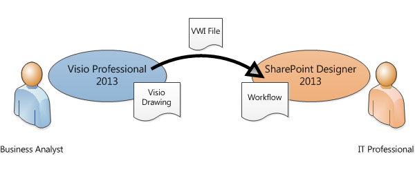

# Перемещение рабочего процесса SharePoint Designer 2013 и Visio Professional 2013 (платформа рабочих процессов SharePoint 2010)
Используйте SharePoint Designer для импорта рабочего процесса Visio или Экспорт рабочего процесса в Visio.
## Передача рабочего процесса между SharePoint Designer 2013 и Visio профессиональный 2013

Бизнес-аналитики и аналитики процесс, уже знакомых с Создание блок-схемы в Visio можно использовать Visio для разработки рабочего процесса SharePoint. Рабочий процесс в Visio представляет бизнес-логики. По завершении бизнес-логику рабочего процесса можно экспортировать в SharePoint Designer. После включения рабочего процесса в SharePoint Designer ИТ-специалистов можно привязать его к на сайте SharePoint.
  
    
    

  
    
    

  
    
    
В Microsoft SharePoint Designer 2013 можно импортировать рабочий поток, созданный в Microsoft Visio профессиональный 2013 или Экспорт рабочего процесса в Visio для просмотра. 
  
    
    
В этой статье описывается перенос рабочего процесса с помощью платформы рабочего процесса SharePoint 2010 в SharePoint Designer 2013.
  
    
    
Чтобы выбрать платформы рабочего процесса SharePoint 2010 для создания рабочего процесса:
  
    
    

  
    
    

1. В области **Навигация** щелкните **Рабочие процессы**.
    
  
2. На вкладке **рабочие процессы** в разделе **New** щелкните **Рабочий процесс списка**, **Рабочий процесс для повторного использования** или **Рабочего процесса сайта**.
    
  
3. В диалоговом окне **Создать рабочий процесс** в поле **Тип платформы** выберите **Рабочий процесс SharePoint 2010**.
    
  
Могут выполнять визуализацию рабочих процессов в SharePoint Designer двумя способами:
  
    
    

- Если установлены службы Visio на сервере, на котором работает SharePoint, можно создать визуализация рабочего процесса на странице состояния рабочего процесса, который отображается ход выполнения и назначений.
    
  
- Рабочий процесс можно экспортировать в Visio для создания документа рабочего процесса, который может использоваться для обратной связи и утверждения.
    
  

  
    
    

  
    
    

  
    
    

  
    
    

## Импорт рабочего процесса из Visio

Импорт рабочего процесса SharePoint, выполните следующие действия.
  
    
    

1. В SharePoint Designer 2013, в области **навигации** щелкните **рабочие процессы**.
    
  
2. На вкладке **рабочие процессы** в группе **Управление** выберите пункт **Импорт из Visio**.
    
  
  

  

  
3. В диалоговом окне **Импорт рабочего процесса из документа Visio** перейдите и выберите файл Visio рабочего процесса обмена (.vwi), который требуется использовать и нажмите кнопку **Далее**.
    
  
4. Введите имя для рабочего процесса и затем выберите тип рабочего процесса, он должен быть после завершения импорта. Возможны следующие значения.
    
  - **Рабочий процесс списка** Рабочий процесс, подключенный к определенному списку. Если выбран этот параметр, необходимо выбрать список, к которому будет присоединен рабочего процесса.
    
  
  - **Рабочий процесс для повторного использования** Рабочий процесс, подключенный к типу контента и поэтому portable. Его можно использовать в различных списках на сайте SharePoint. Если выбран этот параметр, необходимо выбрать тип контента, на котором будет запускаться рабочий процесс.
    
  
5. Нажмите кнопку **Готово**.
    
  
Импортированный рабочий процесс отображается в редакторе полноэкранный режим рабочего процесса SharePoint Designer. Весь текст в собственные фигуры Visio импортируется в SharePoint Designer как действие подписи (серый текст на рисунке ниже) для уточнения рабочего процесса:
  
    
    

  
    
    

  
    
    
После импорта рабочий процесс в конструкторе SharePoint можно редактировать и может быть изменено для добавления необходимых условий, действий, действия и параметры. 
  
    
    

## Экспорт рабочего процесса в Visio

После создания или изменения рабочего процесса в SharePoint Designer 2013 можно экспортировать рабочего процесса в приложении Visio, который можно открыть в Visio профессиональный 2013. Экспорт рабочего процесса в Visio после изменения в SharePoint Designer, также известной как «обратное преобразование» — обеспечивает более подробные совместную работу бизнес-пользователи и разработчики рабочих процессов. При итерации разработки рабочего процесса, таким образом, можно использовать Visio для определения бизнес-требований, а затем использовать обратное преобразование для координации усилий и Подтверждение изменений.
  
    
    

> **Примечание:** Visio профессиональный 2013 не поддерживает действия. Сведения о действие, которое было добавлено в SharePoint Designer может утеряны при просмотре рабочего процесса в Visio и повторно импортированы в SharePoint Designer. 
  
    
    

Экспорт рабочего процесса, выполните следующие действия.
  
    
    

1. В SharePoint Designer 2013 щелкните **рабочие процессы** в области **навигации**.
    
  
2. На вкладке **рабочего процесса** в группе **Управление** нажмите кнопку **Экспорт в Visio**.
    
  
3. В диалоговом окне **Экспорт рабочего процесса в документ Visio** имя файла, выберите расположение и нажмите кнопку **Сохранить**. Экспортированный файл сохраняется в виде VWI-файлом, который можно открывать непосредственно в Visio профессиональный 2013.
    
  

## Дополнительные ресурсы

-  [Что нового в рабочих процессах для SharePoint](what-s-new-in-workflows-for-sharepoint.md)
    
  
-  [Общие сведения о рабочих процессах в SharePoint](get-started-with-workflows-in-sharepoint.md)
    
  
-  [Разработка рабочих процессов в SharePoint Designer и Visio](workflow-development-in-sharepoint-designer-and-visio.md)
    
  

  
    
    

