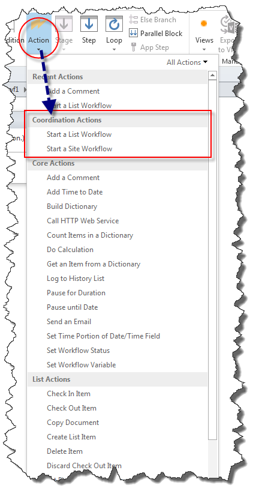
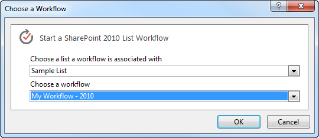

# Общие сведения о действия по координации в SharePoint Designer 2013
Действия по координации в SharePoint Designer 2013 позволяют запустить рабочий процесс, построенный на платформе рабочего процесса SharePoint 2010 в рабочий процесс, построенный на платформе рабочих процессов SharePoint.

   

## Действия по координации в SharePoint Designer 2013

Существует два действия по координации в SharePoint Designer 2013. В обоих случаях доступны только для платформы рабочих процессов SharePoint. Эти действия, являются:
  
    
    

- Запуск рабочего процесса списка: используется для запуска рабочего процесса, разработанных для конкретного списка.
    
  
- Запуск рабочего процесса сайта: используется для запуска рабочего процесса, разработанных для сайта.
    
  
Действия по координации отображаются в раскрывающемся меню **действий** при построении рабочего процесса на платформе рабочих процессов SharePoint, как показано на рисунке.
  
    
    

**Рисунок: Действия по координации в SharePoint Designer**

  
    
    

  
    
    

  
    
    
Оба действия позволяют запустить рабочий процесс, построенный на платформе рабочего процесса SharePoint 2010 из рабочего процесса, построенный на платформе рабочих процессов SharePoint.
  
    
    

    
> **Важные:** Действия по координации поддерживают только запуска рабочего процесса на основе платформы рабочего процесса SharePoint 2010 из рабочего процесса на основании платформы рабочих процессов SharePoint. Начало рабочий процесс, построенный на платформе рабочих процессов SharePoint в рабочий процесс, построенный на ту же платформу не поддерживается. 
  
    
    

## С помощью действия по согласованию

Существует несколько действий, которые были исключены из платформы рабочих процессов SharePoint. Для учета устаревших рабочих процессов можно использовать действия по согласованию. Действия по координации можно использовать для запуска рабочего процесса списка или рабочий процесс сайта, созданный с помощью платформы рабочего процесса SharePoint 2010.
  
    
    
Действия по координации включает в себя три редактируемые области, как показано на рисунке.
  
    
    

**Рисунок: Запуск действия по координации рабочего процесса списка**

  
    
    

  
    
    

  
    
    
Три редактируемые области являются: 
  
    
    

- **Рабочий процесс списка SharePoint 2010** Выберите запускать рабочий процесс 2010.
    
  
- **Параметры** Параметры для отправки в рабочий процесс 2010.
    
  
- **этот элемент** Элемент, который следует запускать рабочий процесс 2010 на.
    
  
Щелкните редактируемое ссылку для ввода сведений. Например выберите запускать рабочий процесс 2010, щелкните ссылку **рабочего процесса списка SharePoint 2010**. Появится диалоговое окно, которое можно использовать для выбора рабочего процесса, как показано на рисунке.
  
    
    

**Рисунок: Выбор рабочего процесса на основании платформы 2010**

  
    
    

  
    
    

  
    
    

  
    
    

  
    
    

  
    
    
Экземпляры рабочих процессов платформы рабочего процесса SharePoint 2010, которые являются согласованных из в рамках рабочего процесса SharePoint отображается на странице состояния рабочего процесса в разделе вспомогательные рабочие процессы, как показано на рисунке.
  
    
    

**Рисунок: Страница состояния рабочего процесса с подпроцессами**

  
    
    

  
    
    

  
    
    

  
    
    

  
    
    

## Дополнительные ресурсы

-  [Новые возможности рабочего процесса в SharePoint](http://msdn.microsoft.com/library/6ab8a28b-fa2f-4530-8b55-a7f663bf15ea.aspx)
    
  
-  [Приступая к работе с рабочего процесса SharePoint](http://msdn.microsoft.com/library/cc73be76-a329-449f-90ab-86822b1c2ee8.aspx)
    
  
-  [Общие сведения о действия словаря в SharePoint Designer 2013](understanding-dictionary-actions-in-sharepoint-designer.md)
    
  

  
    
    

