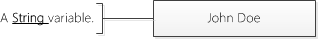
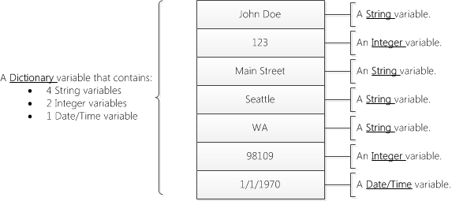
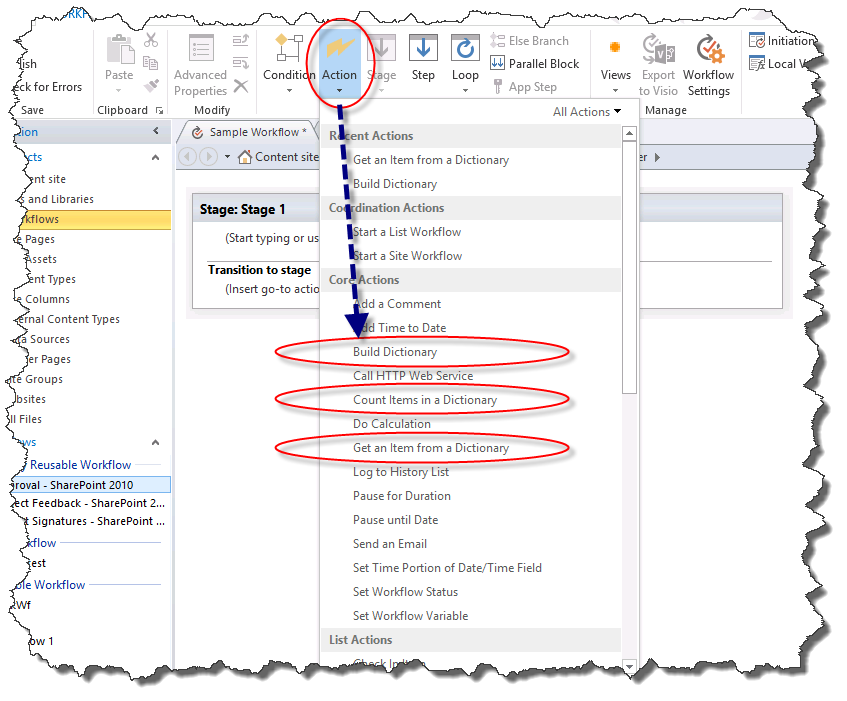
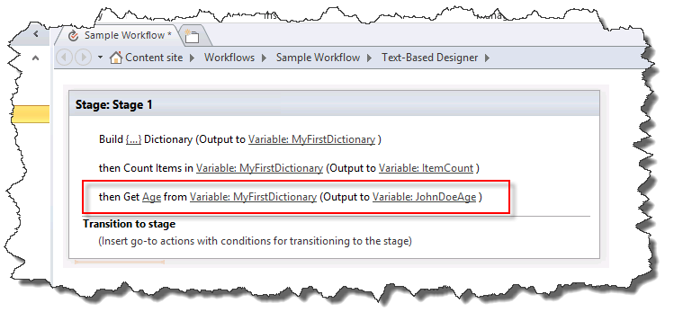

# Общие сведения о действия словаря в SharePoint Designer 2013
Тип переменной словаря — это новый тип переменной в платформы рабочих процессов SharePoint, которые можно использовать с помощью SharePoint Designer 2013. 

   

## Общие сведения о переменных тип словаря

Рабочий процесс — это последовательность действий, которые выполняют желаемый результат. При построении рабочего процесса, часто требуется сохранить значения в переменной (контейнер хранения) для использования в других частей рабочего процесса.
  
    
    
При создании переменной необходимо указать обработчик workflow типа данных будет содержится в переменной. Например может потребоваться сохранить имени сотрудника в переменной. Имя сотрудника — это строка символов, поэтому необходимо создать переменную типа **String**. Рабочий процесс может храниться имя сотрудника, например "Иван Петров", в переменной. 
  
    
    

**Рисунок: Строковой переменной**

  
    
    

  
    
    

  
    
    
SharePoint Designer 2013 имеет новый тип переменной с именем **словаря**. Тип переменной **словаря** является контейнером, предназначенный для хранения коллекцию других переменных. Например рабочего процесса может потребоваться больше, чем просто имя сотрудника. Он может потребоваться для хранения даты свой адрес и рождения. Если вы не используете переменная **словаря** необходимо создать несколько изолированный переменных. Это можно быстро стать неудобен для организации и их для работы в логику рабочего процесса. Переменная **словаря** позволяет сохранять несколько точек данных в одной переменной.
  
    
    
Эта концепция показана на следующем рисунке.
  
    
    

**Рисунок: Переменная словаря**

  
    
    

  
    
    

  
    
    

  
    
    

  
    
    

## Действия рабочего процесса, использующие типа переменной словаря

Рабочий процесс состоит из нескольких действий, выполняемых при обработке рабочего процесса. SharePoint Designer 2013 содержит множество различных действий. Например — это действие для отправки сообщения электронной почты, создание элемента списка и записывать сообщения в журнал рабочего процесса.
  
    
    
Ниже приведены три действия, специально предназначенный для типа переменной **словаря**.
  
    
    

- **Создание словаря**
    
  
- **Посчитать число элементов в словаре**
    
  
- **Получение элемента из словаря.**
    
  
Действия рабочего процесса дляОбласть задачТип переменной можно найти в раскрывающемся списке **Действие**, как показано на рисунке.
  
    
    

**На рисунке: Действия словаря**

  
    
    

  
    
    

  
    
    

### Создайте переменные с действием «Создание словаря»

Чтобы создать переменную типа **словаря** используйте действие **Построения словаря**. Введите содержимое словаря и укажите имя словаря, в списке переменных.
  
    
    
На рисунке показано диалоговое окно **Создание словаря**. Обратите внимание на то, что три переменные были добавлены в словарь: строка, целого числа и даты и времени.
  
    
    

**Рисунок: Поле диалоговое окно «Создание словаря»**

  
    
    

  
    
    

  
    
    
**Словарь** может содержать любого типа переменной, доступные в платформы рабочих процессов SharePoint. В следующем списке определяются типы переменных:
  
    
    

- **Логическое**: значение Да или нет
    
  
- **Даты и времени**: Дата и время
    
  
- **Словарь**: коллекцию переменных
    
  
- **Идентификатор GUID**: глобальный уникальный идентификатор (GUID)
    
  
- **Целое число**: целое число без десятичных знаков
    
  
- **Номера**: номер, который может содержать дробными разрядами
    
  
- **Строка**: строка символов
    
  

    
> **Важные:** Тип переменной **словаря** крайне важна, когда вы используете действие **Вызова веб-службы HTTP** .
  
    
    

    
> **Осторожность:** Использование в поле **имя** в качестве подстановки поддерживается только при указании значения в словаре. Использование в поле **имя** в качестве подстановки не поддерживается при построении словаря.
  
> [!NOTE] 
> [!Примечание] Переменная **словаря** может содержать переменную типа **словаря**. Возможность хранить переменные **словаря** **Dictionary** предоставляет ряд преимуществ. Например можно создать **словарь** для хранения сведений о сотрудниках. В рамках **словаря** можно создать еще одну запись **словаря** для каждого сотрудника. При построении рабочего процесса можно использовать переменную **словаря** вместо постоянно создания новой автономной переменные для каждого элемента данных о каждого сотрудника. Как показано в этом примере, **словарь** можно использовать для организации сложных данных в рамках рабочего процесса.
  
    
    

### Количество и хранения переменных с действием «Число элементов в словаре»

Используйте действие **Число элементов в словаре** для подсчета переменные, которые содержит **словарь**, а затем сохраните этот номер в переменной типа Integer. Затем можно использовать число элементов в цикле **словаря**.
  
    
    
На рисунке показаны действия рабочего процесса **Число элементов в словаре**.
  
    
    

**Рисунок: Число элементов в словаре**

  
    
    

  
    
    

  
    
    

  
    
    

  
    
    

### Получение переменных с действием «Получение элемента из словаря»

Действие **Получение элемента из словаря** используется для получения переменной, хранящейся в **словаре** и поместить его в переменную. Это полезно при необходимости значение в словаре, хранящиеся в переменной изолированный. Можно получить значение, указав имя переменной.
  
    
    
На рисунке показано **Получение элемента из словаря** действия рабочего процесса. Обратите внимание на то, что **Срок хранения** является имя переменной в **словаре** и который вывод в новую переменную **целое число**.
  
    
    

**Рисунок: Получение элемента из словаря**

  
    
    

  
    
    

  
    
    

  
    
    

  
    
    

## См. также

-  [Рабочий процесс в SharePoint](http://technet.microsoft.com/en-us/sharepoint/jj556245.aspx)
    
  
-  [Новые возможности рабочих процессов SharePoint](http://msdn.microsoft.com/library/6ab8a28b-fa2f-4530-8b55-a7f663bf15ea.aspx)
    
  
-  [Начало работы с рабочими процессами SharePoint](http://msdn.microsoft.com/library/cc73be76-a329-449f-90ab-86822b1c2ee8.aspx)
    
  

  
    
    

