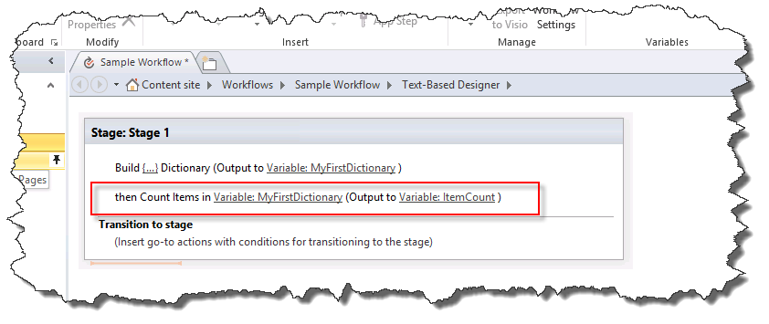

# Общие сведения о действия словаря в SharePoint Designer 2013Understanding Dictionary actions in SharePoint Designer 2013
Тип переменной словаря — это новый тип переменной в платформы рабочих процессов SharePoint, которые можно использовать с помощью SharePoint Designer 2013.The Dictionary variable type is a new variable type in the SharePoint Workflow platform that you can use with SharePoint Designer 2013. 

   

## Общие сведения о переменных тип словаряUnderstanding the Dictionary variable type

Рабочий процесс — это последовательность действий, которые выполняют желаемый результат. При построении рабочего процесса, часто требуется сохранить значения в переменной (контейнер хранения) для использования в других частей рабочего процесса.A workflow is a series of actions that perform a desired outcome. As you build a workflow you often need to save values in a variable (storage container) to use in other parts of the workflow.
  
    
    
При создании переменной необходимо указать обработчик workflow типа данных будет содержится в переменной. Например может потребоваться сохранить имени сотрудника в переменной. Имя сотрудника — это строка символов, поэтому необходимо создать переменную типа **String**. Рабочий процесс может храниться имя сотрудника, например "Иван Петров", в переменной.When you create a variable you need to tell the workflow engine what type of data will be contained in the variable. For example, you might want to save the name of an employee in a variable. The name of an employee is a string of characters so you would create a variable of type **String**. The workflow could then store the name of the employee, such as "John Doe," in the variable. 
  
    
    

**Рисунок: Строковой переменной****Figure: A String variable**

  
    
    

  
    
    

  
    
    
SharePoint Designer 2013 имеет новый тип переменной с именем **словаря**. Тип переменной **словаря** является контейнером, предназначенный для хранения коллекцию других переменных. Например рабочего процесса может потребоваться больше, чем просто имя сотрудника. Он может потребоваться для хранения даты свой адрес и рождения. Если вы не используете переменная **словаря** необходимо создать несколько изолированный переменных. Это можно быстро стать неудобен для организации и их для работы в логику рабочего процесса. Переменная **словаря** позволяет сохранять несколько точек данных в одной переменной.SharePoint Designer 2013 has a new variable type called **Dictionary**. The **Dictionary** variable type is a container designed to hold a collection of other variables. For example, your workflow might need to store more than just the name of the employee. It might also need to store his address and birth date. If you do not use the **Dictionary** variable you will have to create multiple stand-alone variables. This can quickly become difficult to organize and difficult to work with in the logic of the workflow. A **Dictionary** variable allows you to store multiple data points in a single variable.
  
    
    
Эта концепция показана на следующем рисунке.The figure illustrates the concept.
  
    
    

**Рисунок: Переменная словаря****Figure: A Dictionary variable**

  
    
    

  
    
    

  
    
    

  
    
    

  
    
    

## Действия рабочего процесса, использующие типа переменной словаряWorkflow actions that use the Dictionary variable type

Рабочий процесс состоит из нескольких действий, выполняемых при обработке рабочего процесса. SharePoint Designer 2013 содержит множество различных действий. Например — это действие для отправки сообщения электронной почты, создание элемента списка и записывать сообщения в журнал рабочего процесса.A workflow consists of multiple actions that are executed as the workflow is processed. SharePoint Designer 2013 contains many different actions. For example, there is an action to send an email message, create a list item, and log messages to workflow history.
  
    
    
Ниже приведены три действия, специально предназначенный для типа переменной **словаря**.The following are the three actions specifically designed for the **Dictionary** variable type.
  
    
    

- **Создание словаря****Build Dictionary**
    
  
- **Посчитать число элементов в словаре****Count Items in a Dictionary**
    
  
- **Получение элемента из словаря.****Get an Item from a Dictionary**
    
  
Действия рабочего процесса дляОбласть задачТип переменной можно найти в раскрывающемся списке **Действие**, как показано на рисунке.The workflow actions for the Dictionary variable type can be found on the **Action** drop-down list, as shown in the figure.
  
    
    

**На рисунке: Действия словаря****Figure: Dictionary actions**

  
    
    

  
    
    

  
    
    

### Создайте переменные с действием «Создание словаря»Create variables with the "Build Dictionary" action

Чтобы создать переменную типа **словаря** используйте действие **Построения словаря**. Введите содержимое словаря и укажите имя словаря, в списке переменных.You use the **Build Dictionary** action to create a variable of type **Dictionary**. You enter the contents of the dictionary and then specify the name of the dictionary in the variable list.
  
    
    
На рисунке показано диалоговое окно **Создание словаря**. Обратите внимание на то, что три переменные были добавлены в словарь: строка, целого числа и даты и времени.The figure shows the **Build a Dictionary** dialog box. Notice that three variables have been added to the dictionary: a string, an integer, and a date/time.
  
    
    

**Рисунок: Поле диалоговое окно «Создание словаря»****Figure: The "Build a Dictionary" dialog box**

  
    
    

  
    
    

  
    
    
**Словарь** может содержать любого типа переменной, доступные в платформы рабочих процессов SharePoint.A **Dictionary** can contain any type of variable available in the SharePoint Workflow platform. В следующем списке определяются типы переменных:The following list defines the variable types available:
  
    
    

- **Логическое**: значение Да или нет**Boolean**: A Yes or No value
    
  
- **Даты и времени**: Дата и время**Date/Time**: A date and time
    
  
- **Словарь**: коллекцию переменных**Dictionary**: A collection of variables
    
  
- **Идентификатор GUID**: глобальный уникальный идентификатор (GUID)**Guid**: A Globally Unique Identifier (GUID)
    
  
- **Целое число**: целое число без десятичных знаков**Integer**: A whole number without decimals
    
  
- **Номера**: номер, который может содержать дробными разрядами**Number**: A number that can contain decimals
    
  
- **Строка**: строка символов**String**: A string of characters
    
  

    
> **Важные:** Тип переменной **словаря** крайне важна, когда вы используете действие **Вызова веб-службы HTTP** .**Important:** The **Dictionary** variable type is critical when you are using the **Call HTTP Web Service** action.
  
    
    

    
> **Осторожность:** Использование в поле **имя** в качестве подстановки поддерживается только при указании значения в словаре.**Caution:** Using the **Name** field as a lookup is only supported when you are setting a value in a dictionary. Использование в поле **имя** в качестве подстановки не поддерживается при построении словаря.Using the **Name** field as a lookup is not supported when you are building a dictionary.
  
> [!NOTE] 
> [!Примечание] Переменная **словаря** может содержать переменную типа **словаря**. Возможность хранить переменные **словаря** **Dictionary** предоставляет ряд преимуществ. Например можно создать **словарь** для хранения сведений о сотрудниках. В рамках **словаря** можно создать еще одну запись **словаря** для каждого сотрудника. При построении рабочего процесса можно использовать переменную **словаря** вместо постоянно создания новой автономной переменные для каждого элемента данных о каждого сотрудника. Как показано в этом примере, **словарь** можно использовать для организации сложных данных в рамках рабочего процесса.A **Dictionary** variable can contain a variable of type **Dictionary**. The ability to store **Dictionary** variables within a **Dictionary** provides a number of benefits. For example, you might create a **Dictionary** to store information about employees. Within the **Dictionary** you might create another **Dictionary** entry for each employee. As you build the workflow you can use the **Dictionary** variable instead of constantly creating new stand-alone variables for each piece of information about each employee. As this example shows, a **Dictionary** can be used to organize complex information within the workflow.
  
    
    

### Количество и хранения переменных с действием «Число элементов в словаре»Count and store variables with the "Count Items in a Dictionary" action

Используйте действие **Число элементов в словаре** для подсчета переменные, которые содержит **словарь**, а затем сохраните этот номер в переменной типа Integer. Затем можно использовать число элементов в цикле **словаря**.You use the **Count Items in a Dictionary** action to count the variables that a **Dictionary** contains and then store that number in an Integer variable. You can then use the item count to loop through the **Dictionary**.
  
    
    
На рисунке показаны действия рабочего процесса **Число элементов в словаре**.The figure shows the **Count Items in a Dictionary** workflow action.
  
    
    

**Рисунок: Число элементов в словаре****Figure: Count items in a Dictionary**

  
    
    

  
    
    

  
    
    

  
    
    

  
    
    

### Получение переменных с действием «Получение элемента из словаря»Retrieve variables with the "Get an Item from a Dictionary" action

Действие **Получение элемента из словаря** используется для получения переменной, хранящейся в **словаре** и поместить его в переменную. Это полезно при необходимости значение в словаре, хранящиеся в переменной изолированный. Можно получить значение, указав имя переменной.You use the **Get an Item from a Dictionary** action to retrieve a variable stored in the **Dictionary** and place it in a variable. This is valuable when you need a value in the dictionary stored in a stand-alone variable. You can retrieve a value by entering the name of the variable.
  
    
    
На рисунке показано **Получение элемента из словаря** действия рабочего процесса. Обратите внимание на то, что **Срок хранения** является имя переменной в **словаре** и который вывод в новую переменную **целое число**.The figure shows the **Get an Item from a Dictionary** workflow action. Notice that **Age** is the name of the variable in the **Dictionary** and it is being output to a new **Integer** variable.
  
    
    

**Рисунок: Получение элемента из словаря****Figure: Get an item from a Dictionary**

  
    
    

  
    
    

  
    
    

  
    
    

  
    
    

## См. такжеSee also

-  [Рабочий процесс в SharePointWorkflow in SharePoint](http://technet.microsoft.com/en-us/sharepoint/jj556245.aspx)
    
  
-  [Новые возможности рабочих процессов SharePointWhat's new in workflow in SharePoint](http://msdn.microsoft.com/library/6ab8a28b-fa2f-4530-8b55-a7f663bf15ea.aspx)
    
  
-  [Начало работы с рабочими процессами SharePointGetting started with SharePoint workflow](http://msdn.microsoft.com/library/cc73be76-a329-449f-90ab-86822b1c2ee8.aspx)
    
  

  
    
    

