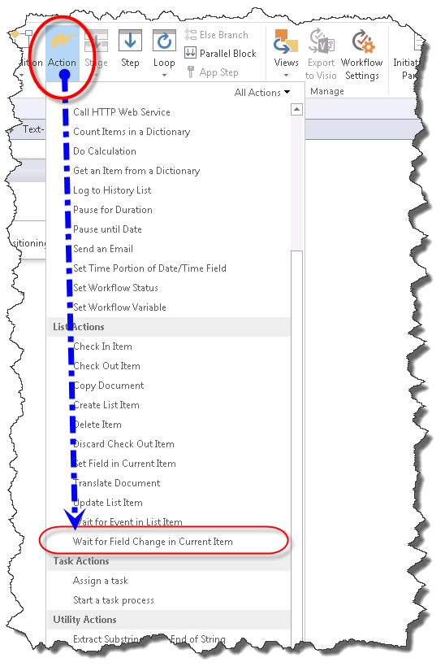

# Общие сведения о действия с событиями в SharePoint Designer 2013Understanding Eventing Actions in SharePoint Designer 2013
Изучите использование действия с событиями в SharePoint Designer 2013.Learn to use Eventing Actions in SharePoint Designer 2013.
## Общие сведения о действия с событиями в SharePoint Designer 2013Overview of Eventing Actions in SharePoint Designer 2013

Рабочий процесс SharePoint можно подписаться на уведомления, когда сообщение добавлены или изменены. Элемент добавлены или изменены, называется события. Рабочий процесс можно подождать эти события происходить перед тем как продолжить с рабочим процессом. Действия с событиями в SharePoint Designer 2013 являются:A SharePoint workflow can subscribe to be notified when an item is added or changed. When an item is added or changed, it is called an event. A workflow can wait for these events to happen before proceeding with the workflow. The Eventing actions in SharePoint Designer 2013 are: 
  
    
    

- **Ожидание события в элемент списка:** Используется для ожидания новый элемент, чтобы создать или изменить элемент.**Wait for Event in List Item:** Used to wait for a new item to be created or an item to be changed.
    
  
- **Ожидание события проекта:** Используется для ожидания для возврата, фиксации или отправки проекта.**Wait for Project Event:** Used to wait for a project to be checked in, committed, or submitted.
    
  
- **Ждать изменения поля в текущем элементе:** Используется для ожидания для поля должен быть изменен в текущем элементе.**Wait for Field Change in Current Item:** Used to wait for a field to be changed in the current item.
    
  
Действия событий осуществляется в ленте SharePoint Designer 2013, как показано на рисунках в меню **Действие**.The Eventing actions are accessed in the **Action** drop-down menu of the SharePoint Designer 2013 ribbon as shown in the figures.
  
> [!NOTE] 
> [!Примечание] **Project Web App действий** доступны только при работе с сайта Project Web App.The **Project Web App Actions** are only available when working with a Project Web App site.
  
    
    

**Действие события в SharePoint Designer 2013****Eventing Action in SharePoint Designer 2013**

  
    
    

  
    
    

  
    
    

**Действие события Project Web App в SharePoint Designer 2013****Project Web App Eventing Action in SharePoint Designer 2013**

  
    
    

  
    
    

  
    
    

**Ждать изменения поля в текущем элементе событий в SharePoint Designer 2013****Wait for Field Change in Current Item event in SharePoint Designer 2013**

  
    
    

  
    
    

  
    
    

  
    
    

  
    
    

## С помощью действия с событиями в SharePointUsing Eventing Actions in SharePoint

Рабочий процесс управляет бизнес-процессов. Бизнес-процесса важно часто вынуждены ждать освобождения элемента для добавления или обновления в списке SharePoint. С помощью действия событий можно подождать событие происходит и выполните действия рабочего процесса.A workflow orchestrates business processes. In a business process it is often important to wait for an item to be added or updated in a SharePoint list. Using the Eventing actions you can wait for an event to happen and then perform a workflow action.
  
    
    
Действия событий, находятся в раскрывающемся меню действия на ленте SharePoint Designer 2013. Можно добавить действие в рабочий процесс и его настройки для определенных обстоятельствах.The Eventing actions are located on the Actions drop-down menu in the SharePoint Designer 2013 ribbon. You can add the action to your workflow and then customize it for your particular circumstance.
  
    
    

### Подождать появления события в элементе спискаWait for Event in List Item

**Ожидание события в элемент списка** действие содержит две редактируемые области, как показано на рисунке.The **Wait for Event in List Item** action contains two editable regions, as shown in the figure.
  
    
    

**Подождать появления события в элементе списка****Wait for Event in List Item**

  
    
    

  
    
    

  
    
    

  
    
    

  
    
    
Две редактируемые области являются:The two editable regions are:
  
    
    

- **Это событие элемента:** Список и события, которое будут отслеживаться.**This item event:** The list and event that will be monitored.
    
  
- **Выходной переменной:** Переменная, в котором следует сохранить GUID элемента, из которого произошло событие. Элементы содержат идентификатор и поля GUID. Идентификатор является уникальным для списка и глобальный уникальный идентификатор GUID. Например идентификатор первый элемент в списке будет номер 1 и идентификатор второго элемента будет номер 2. Идентификатор GUID глобальный уникальный и в формате значение 128-бит, состоящее из 8 шестнадцатеричных цифр, следуют три группы 4 шестнадцатеричных цифр, а затем по одной группе 12 шестнадцатеричных цифр. Идентификатор GUID, например: 6B29FC40-CA47-1067-B31D-00DD010662DA. **Ожидание события в элемент списка** действие извлекает идентификатор GUID.**Output variable:** A variable in which to save the GUID of the item from which the event originated. Items have both an ID and a GUID field. The ID is unique to the list and a GUID is globally unique. For example, the ID of the first item in the list will be the number 1 and the ID of the second item will be the number 2. The GUID is globally unique and in the format of a 128-bit value consisting of 8 hexadecimal digits, followed by three groups of 4 hexadecimal digits each, followed by one group of 12 hexadecimal digits. An example of a GUID is: 6B29FC40-CA47-1067-B31D-00DD010662DA. The **Wait for Event in List Item** action retrieves the GUID.
    
  
Щелкнув ссылку **это событие элемента** открывает диалоговое окно **Выбор события элемента списка**, как показано на рисунке.Clicking the **this item event** link opens the **Choose List Item Event** dialog box, as shown in the figure.
  
    
    

**Выберите диалоговое окно события элемента списка****Choose List Item Event dialog box**

  
    
    

  
    
    

  
    
    

  
    
    

  
    
    
Тип события, соответствует раскрывающегося списка **событий**. Параметры, следует ожидать в элемент добавляется в список или дождитесь элемент, чтобы изменить в список. В раскрывающемся **списке** соответствует списка, за которым ведется наблюдение.The **Event** drop-down list corresponds to the type of event. The options are to wait for an item to be added to a list or to wait for an item to be changed in a list. The **List** drop-down corresponds to the list that is monitored.
  
    
    

### Подождите наступления события проектаWait for Project Event

Действие **Ожидание события проекта** содержит один редактируемой области, как показано на рисунке.The **Wait for Project Event** action contains one editable region, as shown in the figure.
  
    
    

**Подождите наступления события проекта****Wait for Project Event**

  
    
    

  
    
    

  
    
    

  
    
    

  
    
    
— Это редактируемой области:The editable region is:
  
    
    

- **Это событие проекта:** События project, которая должна ожидать рабочего процесса.**This project event:** The project event that the workflow should wait for.
    
  
В раскрывающемся списке **это событие project** включает в себя три события проекта, из которых можно выбрать. К ним относятся ожидание проект, чтобы вернуть, фиксации или отправки.The **This project event** drop-down includes three project events to choose from. These include waiting for the project to be checked in, committed, or submitted.
  
    
    
После обработки события рабочего процесса будет обрабатывать.Once an event has occurred the workflow will continue to process.
  
    
    

### Ждать изменения поля в текущем элементеWait for Field Change in Current Item

**Ждать изменения поля в текущем элементе** действие содержит две редактируемые области, как показано на рисунке.The **Wait for Field Change in Current Item** action contains two editable regions, as shown in the figure.
  
    
    

**Ждать изменения поля в текущем элементе****Wait for Field Change in Current Item**

  
    
    

  
    
    

  
    
    

  
    
    

  
    
    
Редактируемые области являются:The editable regions are:
  
    
    

- **Поля:** Поле в элементе, которое должны отслеживаться для изменения.**Field:** The field in the item that should be monitored for change.
    
  
- **Значение:** Значение, которое должно быть равно поля в порядке для рабочего процесса, чтобы продолжить работу.**Value:** The value that the field should equal in order for the workflow to proceed.
    
  
После изменения поля продолжается рабочий процесс.Once a field has changed the workflow continues.
  
    
    

## См. такжеSee also

-  [Рабочий процесс в SharePointWorkflow in SharePoint ](http://technet.microsoft.com/en-us/sharepoint/jj556245.aspx)
    
  
-  [Новые возможности рабочих процессов SharePointWhat's new in workflow in SharePoint](http://msdn.microsoft.com/library/6ab8a28b-fa2f-4530-8b55-a7f663bf15ea.aspx)
    
  
-  [Начало работы с рабочими процессами SharePointGetting started with SharePoint workflow](http://msdn.microsoft.com/library/cc73be76-a329-449f-90ab-86822b1c2ee8.aspx)
    
  
-  [Разработка рабочих процессов в SharePoint Designer и VisioWorkflow development in SharePoint Designer and Visio](workflow-development-in-sharepoint-designer-and-visio.md)
    
  
-  [Краткий справочник по действиям рабочего процесса (платформа рабочих процессов в SharePoint)Workflow actions quick reference (SharePoint Workflow platform)](workflow-actions-quick-reference-sharepoint-workflow-platform.md)
    
  

  
    
    

