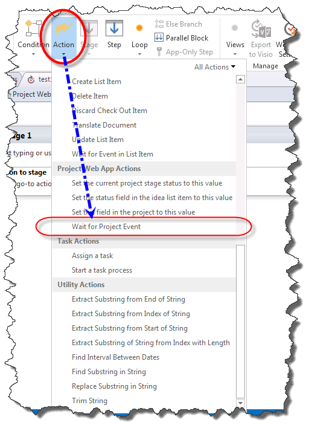
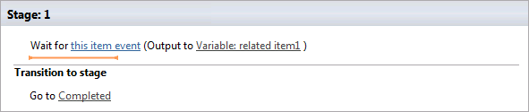
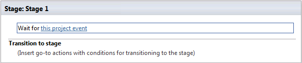
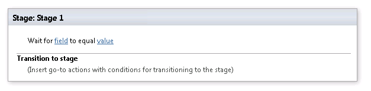

# Общие сведения о действия с событиями в SharePoint Designer 2013
Изучите использование действия с событиями в SharePoint Designer 2013.
## Общие сведения о действия с событиями в SharePoint Designer 2013

Рабочий процесс SharePoint можно подписаться на уведомления, когда сообщение добавлены или изменены. Элемент добавлены или изменены, называется события. Рабочий процесс можно подождать эти события происходить перед тем как продолжить с рабочим процессом. Действия с событиями в SharePoint Designer 2013 являются: 
  
    
    

- **Ожидание события в элемент списка:** Используется для ожидания новый элемент, чтобы создать или изменить элемент.
    
  
- **Ожидание события проекта:** Используется для ожидания для возврата, фиксации или отправки проекта.
    
  
- **Ждать изменения поля в текущем элементе:** Используется для ожидания для поля должен быть изменен в текущем элементе.
    
  
Действия событий осуществляется в ленте SharePoint Designer 2013, как показано на рисунках в меню **Действие**.
  
    
    

> **Примечание:** **Project Web App действий** доступны только при работе с сайта Project Web App.
  
    
    

**Действие события в SharePoint Designer 2013**

  
    
    

  
    
    

  
    
    

**Действие события Project Web App в SharePoint Designer 2013**

  
    
    

  
    
    

  
    
    

**Ждать изменения поля в текущем элементе событий в SharePoint Designer 2013**

  
    
    

  
    
    

  
    
    

  
    
    

  
    
    

## С помощью действия с событиями в SharePoint

Рабочий процесс управляет бизнес-процессов. Бизнес-процесса важно часто вынуждены ждать освобождения элемента для добавления или обновления в списке SharePoint. С помощью действия событий можно подождать событие происходит и выполните действия рабочего процесса.
  
    
    
Действия событий, находятся в раскрывающемся меню действия на ленте SharePoint Designer 2013. Можно добавить действие в рабочий процесс и его настройки для определенных обстоятельствах.
  
    
    

### Подождать появления события в элементе списка

**Ожидание события в элемент списка** действие содержит две редактируемые области, как показано на рисунке.
  
    
    

**Подождать появления события в элементе списка**

  
    
    

  
    
    

  
    
    

  
    
    

  
    
    
Две редактируемые области являются:
  
    
    

- **Это событие элемента:** Список и события, которое будут отслеживаться.
    
  
- **Выходной переменной:** Переменная, в котором следует сохранить GUID элемента, из которого произошло событие. Элементы содержат идентификатор и поля GUID. Идентификатор является уникальным для списка и глобальный уникальный идентификатор GUID. Например идентификатор первый элемент в списке будет номер 1 и идентификатор второго элемента будет номер 2. Идентификатор GUID глобальный уникальный и в формате значение 128-бит, состоящее из 8 шестнадцатеричных цифр, следуют три группы 4 шестнадцатеричных цифр, а затем по одной группе 12 шестнадцатеричных цифр. Идентификатор GUID, например: 6B29FC40-CA47-1067-B31D-00DD010662DA. **Ожидание события в элемент списка** действие извлекает идентификатор GUID.
    
  
Щелкнув ссылку **это событие элемента** открывает диалоговое окно **Выбор события элемента списка**, как показано на рисунке.
  
    
    

**Выберите диалоговое окно события элемента списка**

  
    
    

  
    
    

  
    
    

  
    
    

  
    
    
Тип события, соответствует раскрывающегося списка **событий**. Параметры, следует ожидать в элемент добавляется в список или дождитесь элемент, чтобы изменить в список. В раскрывающемся **списке** соответствует списка, за которым ведется наблюдение.
  
    
    

### Подождите наступления события проекта

Действие **Ожидание события проекта** содержит один редактируемой области, как показано на рисунке.
  
    
    

**Подождите наступления события проекта**

  
    
    

  
    
    

  
    
    

  
    
    

  
    
    
— Это редактируемой области:
  
    
    

- **Это событие проекта:** События project, которая должна ожидать рабочего процесса.
    
  
В раскрывающемся списке **это событие project** включает в себя три события проекта, из которых можно выбрать. К ним относятся ожидание проект, чтобы вернуть, фиксации или отправки.
  
    
    
После обработки события рабочего процесса будет обрабатывать.
  
    
    

### Ждать изменения поля в текущем элементе

**Ждать изменения поля в текущем элементе** действие содержит две редактируемые области, как показано на рисунке.
  
    
    

**Ждать изменения поля в текущем элементе**

  
    
    

  
    
    

  
    
    

  
    
    

  
    
    
Редактируемые области являются:
  
    
    

- **Поля:** Поле в элементе, которое должны отслеживаться для изменения.
    
  
- **Значение:** Значение, которое должно быть равно поля в порядке для рабочего процесса, чтобы продолжить работу.
    
  
После изменения поля продолжается рабочий процесс.
  
    
    

## Дополнительные ресурсы

-  [Рабочий процесс в SharePoint ](http://technet.microsoft.com/en-us/sharepoint/jj556245.aspx)
    
  
-  [Новые возможности рабочего процесса в SharePoint](http://msdn.microsoft.com/library/6ab8a28b-fa2f-4530-8b55-a7f663bf15ea.aspx)
    
  
-  [Приступая к работе с рабочего процесса SharePoint](http://msdn.microsoft.com/library/cc73be76-a329-449f-90ab-86822b1c2ee8.aspx)
    
  
-  [Разработка рабочих процессов в SharePoint Designer и Visio](workflow-development-in-sharepoint-designer-and-visio.md)
    
  
-  [Краткий справочник по действиям рабочего процесса (платформа рабочих процессов в SharePoint)](workflow-actions-quick-reference-sharepoint-workflow-platform.md)
    
  

  
    
    

