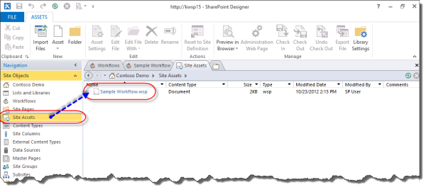
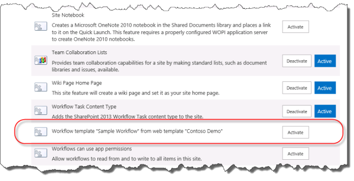

# Общие сведения об упаковке и развертывании рабочих процессов в SharePointUnderstanding how to package and deploy workflow in SharePoint
Узнайте, как для упаковки и развертывания рабочего процесса в SharePoint с помощью SharePoint Designer 2013.Learn how to package and deploy a workflow in SharePoint with SharePoint Designer 2013.
## Обзор возможностей Создание пакета, содержащего рабочего процесса из SharePoint Designer 2013Overview of the workflow packaging capabilities of SharePoint Designer 2013

SharePoint Designer 2013 предоставляет возможность сохранения рабочего процесса в качестве шаблона.SharePoint Designer 2013 provides the capability to save a workflow as a template. Сохранение как шаблона рабочего процесса также известные как упаковка рабочего процесса.Saving a workflow as a template is also known as packaging the workflow. После сохранения рабочего процесса в качестве шаблона его можно быть импортированы в других средах SharePoint и используется без необходимости чипа рабочего процесса.After the workflow is saved as a template, it can then be imported into other SharePoint environments and used without the need to redevelop the workflow. Не все типы рабочих процессов можно сохранить как шаблон.Not all workflow types can be saved as a template. Следующие матрицы показаны типы рабочих процессов, которые могут быть сохранены как шаблон.The following matrix shows the workflow types that can be saved as a template. 
  
    
    

**Поддержка по платформы для сохранения рабочего процесса в виде шаблона****Support, by platform, for saving a workflow as a template**

|**Тип рабочего процесса****Workflow type**|**Платформа рабочих процессов SharePoint 2010****SharePoint 2010 Workflow platform**|**Платформа рабочих процессов SharePoint****SharePoint Workflow platform**|
|:-----|:-----|:-----|
|Рабочий процесс спискаList Workflow    |НетNo    |ДаYes    |
|Рабочий процесс сайтаSite Workflow    |НетNo    |ДаYes    |
|Рабочий процесс для повторного использованияReusable Workflow    |ДаYes    |ДаYes    |
   

> [!NOTE] 
> Содержит две платформы различных рабочих процессов SharePoint: платформы рабочего процесса SharePoint 2010 и платформы рабочих процессов SharePoint.SharePoint contains two different workflow platforms: the SharePoint 2010 Workflow platform and the SharePoint Workflow platform. Обе платформы доступны в SharePoint.Both platforms are available in SharePoint. Дополнительные сведения о двух рабочего процесса можно [Приступая к работе с рабочего процесса SharePoint.](http://msdn.microsoft.com/library/cc73be76-a329-449f-90ab-86822b1c2ee8.aspx)For more information about the two workflow, see  [Getting started with SharePoint workflow.](http://msdn.microsoft.com/library/cc73be76-a329-449f-90ab-86822b1c2ee8.aspx)
  
    
    

## Упаковка рабочего процесса с помощью SharePoint Designer 2013Packaging a workflow by using SharePoint Designer 2013

Процесс создания пакетов рабочего процесса включает сохранение файла шаблона рабочего процесса с помощью SharePoint Designer 2013. Пакет рабочего процесса в виде файла Web пакета решения (WSP) и с расширением WSP-файл. Упаковка рабочего процесса выполните следующие действия.The process for packaging a workflow involves saving the workflow to a template file by using SharePoint Designer 2013. A workflow package is in the form of a Web Solution Package (WSP) file and has a .wsp extension. To package a workflow follow these steps. 
  
    
    

### Создание пакета рабочего процессаPackage a workflow

1. Откройте существующий рабочий процесс или разработать новый рабочий процесс, в SharePoint Designer 2013.Open an existing workflow, or develop a new workflow, in SharePoint Designer 2013.
    
  
2. На вкладке **Параметры рабочих процессов** на ленте нажмите кнопку **Сохранить в качестве шаблона** в разделе **Управление**, как показано на рисунке.On the **Workflow Settings** tab in the ribbon, click the **Save as Template** button in the **Manage** section as shown in the figure.
    
   **Рисунок: Сохранение в качестве шаблона рабочего процесса****Figure: Save workflow as template**

  

  
  

  

  
3. Откроется диалоговое окно информационные сообщите вы знаете, что шаблон сохранен в библиотеку **Активов сайта**.An informational dialog box appears to let you know the template has been saved to the **Site Assets** library.
    
  
4. Выберите библиотеку активов сайта для просмотра шаблона рабочего процесса, как показано на рисунке.Click the Site Assets library to view the workflow template as shown in the figure.
    
   **Рисунок: Шаблона рабочего процесса в ресурсах сайта****Figure: A workflow template in Site Assets**

  

  
  

  

  

  
    
    

> **Совет:** Шаблон рабочего процесса автоматически сохраняет библиотеки **Материалы сайта** семейства сайтов, в котором находится рабочий процесс.**Tip:** A workflow template automatically saves to the **Site Assets** library of the site collection in which the workflow resides.
  
    
    

## Развертывание пакета рабочего процесса в SharePointDeploying a workflow package to SharePoint

Можно развернуть пакет рабочих процессов для фермы SharePoint или сайта, отличный от фермы или сайта, в котором он был разработан. В порядке для рабочего процесса должны быть выполнены развертывания быть успешно двумя элементами:You can deploy a workflow package to a SharePoint farm or site that is different from the farm or site in which it was developed. In order for a workflow deployment to be successful two items must be fulfilled:
  
    
    

- Все зависимости рабочих процессов, таких как списки, библиотеки, столбцов и типов контента должны уже существовать на новый сайт.All workflow dependencies such as lists, libraries, columns, and content types must already exist on the new site.
    
  
- Каждой зависимости должен иметь точное имя зависимостей источника.Each dependency must have the exact name of the source dependency.
    
  
Если развертывание рабочего процесса и точное зависимостей не существуют результатом будет ошибка.If a workflow is deployed and the exact dependencies do not exist then the result will be an error.
  
    
    
Перед развертыванием рабочего процесса необходимо экспортировать шаблон рабочего процесса из исходной фермы SharePoint.Before you can deploy a workflow you must first export the workflow template from the source SharePoint farm. Экспорт шаблона рабочего процесса, выполните следующую процедуру.To export a workflow template, follow this procedure.
  
    
    

### Экспорт шаблона рабочего процессаExport a workflow template

1. Откройте SharePoint Designer 2013 и перейдите в библиотеку активов сайта, где находится шаблон.Open SharePoint Designer 2013 and navigate to the Site Assets library where the template is located.
    
  
2. Выберите шаблон рабочего процесса, который необходимо экспортировать, щелкнув его.Select the workflow template you want to export by clicking it.
    
  
3. Нажмите кнопку **Экспорт файла** для сохранения файла шаблона для локального компьютера или сетевой диск, как показано на рисунке.Click the **Export File** button to save the template file to your local computer or a network drive, as shown in the figure.
    
   **Рисунок: Экспорт шаблона рабочего процесса из SharePoint Designer 2013****Figure: Export workflow template from SharePoint Designer 2013**

  

  
  

  

  
Развертывание пакета процесса выполните следующую процедуру.To deploy a workflow package follow this procedure.
  
    
    

### Развертывание решения рабочего процессаDeploy a workflow solution

1. Откройте Internet Explorer и перейдите к семейству сайтов SharePoint, где вы хотите развернуть рабочий процесс.Open Internet Explorer and navigate to the SharePoint site collection where you want to deploy the workflow.
    
  
2. Щелкните **Действия сайта** и выберите **Параметры сайта**.Click **Site Actions** and select **Site Settings**.
    
  
3. В разделе **Веб-разработки галерей** выберите **решения**.In the **Web Design Galleries** section click **Solutions**.
    
    > [!NOTE] 
    > [!Примечание] На странице " **Параметры сайта** " для семейства веб-сайтов необходимо быть для просмотра в коллекцию **решений**. Если вы находитесь на странице **Параметры сайта** для дочерних сайтов выберите каталог **решений** не отображается.You must be on the **Site Settings** page for the site collection in order to see the **Solutions** gallery. If you are on the **Site Settings** page for a sub-site then the **Solutions** gallery is not visible.

4. Нажмите кнопку **Отправить решение**, чтобы загрузить решение, как показано на рисунке.Click the **Upload Solution** button to upload the solution as shown in the figure.
    
   **Рисунок: Кнопка отправки решения****Figure: Upload Solution button**

  

  
  

  

  
5. Активация решения, щелкнув кнопку " **активировать** ", как показано на рисунке.Activate the solution by clicking the **Activate** button as shown in the figure.
    
   **Рисунок: Активация решения диалогового окна и кнопка****Figure: Activate Solution dialog and button**

  

  
  

  

  
После активации решения рабочего процесса для семейства веб-сайтов может использоваться как компонент для всех дочерних сайтах. Чтобы активировать компонент рабочего процесса для дочерних сайтов, выполните следующую процедуру.After a workflow solution has been activated for a site collection, it is available as a feature for all sub-sites. To activate the workflow feature for a sub-site, follow this procedure.
  
    
    

### Активация компонента рабочего процессаActivate the workflow feature

1. Откройте **Параметры сайта** на сайт, которую вы хотите активировать компонент рабочего процесса.Open **Site Settings** on the site where you wish to activate the workflow feature.
    
  
2. В меню " **Действия сайта** " выберите **Управление возможностями сайта**.In the **Site Actions** group, click **Manage site features**.
    
  
3. Выберите **Включить** рядом с компонентом рабочего процесса, как показано на рисунке.Click **Activate** next to the workflow feature as shown in the figure.
    
  

**Рисунок: Активируйте компонент рабочего процесса для сайта****Figure: Activate workflow feature for site**

  
    
    

  
    
    

  
    
    

  
    
    

  
    
    

## См. такжеSee also

-  [Рабочий процесс в SharePointWorkflow in SharePoint ](http://technet.microsoft.com/en-us/sharepoint/jj556245.aspx)
    
  
-  [Новые возможности рабочих процессов SharePointWhat's new in workflow in SharePoint](http://msdn.microsoft.com/library/6ab8a28b-fa2f-4530-8b55-a7f663bf15ea.aspx)
    
  
-  [Начало работы с рабочими процессами SharePointGetting started with SharePoint workflow](http://msdn.microsoft.com/library/cc73be76-a329-449f-90ab-86822b1c2ee8.aspx)
    
  
-  [Разработка рабочих процессов в SharePoint Designer и VisioWorkflow development in SharePoint Designer and Visio](workflow-development-in-sharepoint-designer-and-visio.md)
    
  
-  [Краткий справочник по действиям рабочего процесса (платформа рабочих процессов в SharePoint)Workflow actions quick reference (SharePoint Workflow platform)](workflow-actions-quick-reference-sharepoint-workflow-platform.md)
    
  
-  [Статья блога группы разработчиков SharePoint Designer: рабочий процесс упаковки и развертывания сценарийBlog article from the SharePoint Designer team: Workflow package and deploy scenario](http://blogs.msdn.com/b/sharepointdesigner/archive/2012/08/30/packaging-list-site-and-reusable-workflow-and-how-to-deploy-the-package.aspx)
    
  

