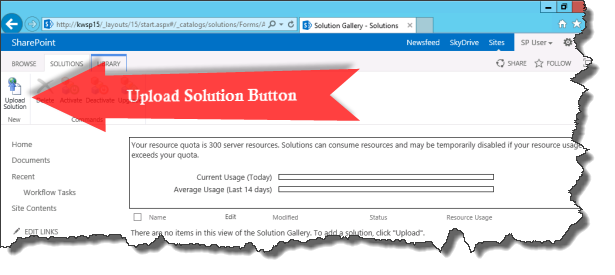
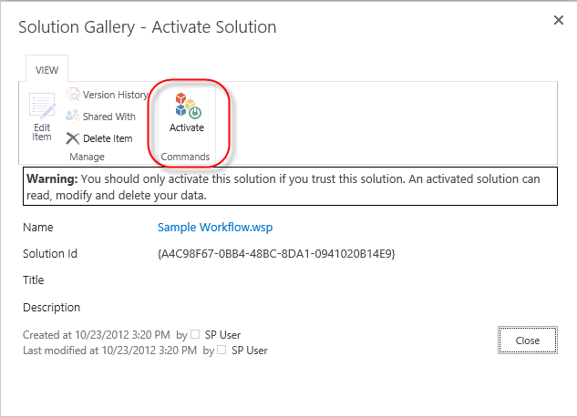

# Основные сведения для упаковки и развертывания рабочих процессов в SharePoint
Узнайте, как для упаковки и развертывания рабочего процесса в SharePoint с помощью SharePoint Designer 2013.
## Обзор возможностей Создание пакета, содержащего рабочего процесса из SharePoint Designer 2013

SharePoint Designer 2013 предоставляет возможность сохранения рабочего процесса в качестве шаблона. Сохранение как шаблона рабочего процесса также известные как упаковка рабочего процесса. После сохранения рабочего процесса в качестве шаблона его можно быть импортированы в других средах SharePoint и используется без необходимости чипа рабочего процесса. Не все типы рабочих процессов можно сохранить как шаблон. Следующие матрицы показаны типы рабочих процессов, которые могут быть сохранены как шаблон. 
  
    
    

**Поддержка по платформы для сохранения рабочего процесса в виде шаблона**

|**Тип рабочего процесса**|**Платформа рабочих процессов SharePoint 2010**|**Платформа рабочих процессов SharePoint**|
|:-----|:-----|:-----|
|Рабочий процесс списка    |Нет    |Да    |
|Рабочий процесс сайта    |Нет    |Да    |
|Рабочий процесс для повторного использования    |Да    |Да    |
   

  
    
    

  
    
    

> **Примечание:** Содержит две платформы различных рабочих процессов SharePoint: платформы рабочего процесса SharePoint 2010 и платформы рабочих процессов SharePoint. Обе платформы доступны в SharePoint. Дополнительные сведения о двух рабочего процесса можно [Приступая к работе с рабочего процесса SharePoint.](http://msdn.microsoft.com/library/cc73be76-a329-449f-90ab-86822b1c2ee8.aspx)
  
    
    

## Упаковка рабочего процесса с помощью SharePoint Designer 2013

Процесс создания пакетов рабочего процесса включает сохранение файла шаблона рабочего процесса с помощью SharePoint Designer 2013. Пакет рабочего процесса в виде файла Web пакета решения (WSP) и с расширением WSP-файл. Упаковка рабочего процесса выполните следующие действия. 
  
    
    

### Создание пакета рабочего процесса

1. Откройте существующий рабочий процесс или разработать новый рабочий процесс, в SharePoint Designer 2013.
    
  
2. На вкладке **Параметры рабочих процессов** на ленте нажмите кнопку **Сохранить в качестве шаблона** в разделе **Управление**, как показано на рисунке.
    
   **Рисунок: Сохранение в качестве шаблона рабочего процесса**

  

  
  

  

  
3. Откроется диалоговое окно информационные сообщите вы знаете, что шаблон сохранен в библиотеку **Активов сайта**.
    
  
4. Выберите библиотеку активов сайта для просмотра шаблона рабочего процесса, как показано на рисунке.
    
   **Рисунок: Шаблона рабочего процесса в ресурсах сайта**

  

  
  

  

  

  
    
    

> **Совет:** Шаблон рабочего процесса автоматически сохраняет библиотеки **Материалы сайта** семейства сайтов, в котором находится рабочий процесс.
  
    
    

## Развертывание пакета рабочего процесса в SharePoint

Можно развернуть пакет рабочих процессов для фермы SharePoint или сайта, отличный от фермы или сайта, в котором он был разработан. В порядке для рабочего процесса должны быть выполнены развертывания быть успешно двумя элементами:
  
    
    

- Все зависимости рабочих процессов, таких как списки, библиотеки, столбцов и типов контента должны уже существовать на новый сайт.
    
  
- Каждой зависимости должен иметь точное имя зависимостей источника.
    
  
Если развертывание рабочего процесса и точное зависимостей не существуют результатом будет ошибка.
  
    
    
Перед развертыванием рабочего процесса необходимо экспортировать шаблон рабочего процесса из исходной фермы SharePoint. Экспорт шаблона рабочего процесса, выполните следующую процедуру.
  
    
    

### Экспорт шаблона рабочего процесса

1. Откройте SharePoint Designer 2013 и перейдите в библиотеку активов сайта, где находится шаблон.
    
  
2. Выберите шаблон рабочего процесса, который необходимо экспортировать, щелкнув его.
    
  
3. Нажмите кнопку **Экспорт файла** для сохранения файла шаблона для локального компьютера или сетевой диск, как показано на рисунке.
    
   **Рисунок: Экспорт шаблона рабочего процесса из SharePoint Designer 2013**

  

  
  

  

  
Развертывание пакета процесса выполните следующую процедуру.
  
    
    

### Развертывание решения рабочего процесса

1. Откройте Internet Explorer и перейдите к семейству сайтов SharePoint, где вы хотите развернуть рабочий процесс.
    
  
2. Щелкните **Действия сайта** и выберите **Параметры сайта**.
    
  
3. В разделе **Веб-разработки галерей** выберите **решения**.
    
    > **Примечание:** На странице " **Параметры сайта** " для семейства веб-сайтов необходимо быть для просмотра в коллекцию **решений** . Если вы находитесь на странице **Параметры сайта** для дочерних сайтов выберите каталог **решений** не отображается.
4. Нажмите кнопку **Отправить решение**, чтобы загрузить решение, как показано на рисунке.
    
   **Рисунок: Кнопка отправки решения**

  

  
  

  

  
5. Активация решения, щелкнув кнопку " **активировать** ", как показано на рисунке.
    
   **Рисунок: Активация решения диалогового окна и кнопка**

  

  
  

  

  
После активации решения рабочего процесса для семейства веб-сайтов может использоваться как компонент для всех дочерних сайтах. Чтобы активировать компонент рабочего процесса для дочерних сайтов, выполните следующую процедуру.
  
    
    

### Активация компонента рабочего процесса

1. Откройте **Параметры сайта** на сайт, которую вы хотите активировать компонент рабочего процесса.
    
  
2. В меню " **Действия сайта** " выберите **Управление возможностями сайта**.
    
  
3. Выберите **Включить** рядом с компонентом рабочего процесса, как показано на рисунке.
    
  

**Рисунок: Активируйте компонент рабочего процесса для сайта**

  
    
    

  
    
    

  
    
    

  
    
    

  
    
    

## Дополнительные ресурсы

-  [Рабочий процесс в SharePoint ](http://technet.microsoft.com/en-us/sharepoint/jj556245.aspx)
    
  
-  [Новые возможности рабочего процесса в SharePoint](http://msdn.microsoft.com/library/6ab8a28b-fa2f-4530-8b55-a7f663bf15ea.aspx)
    
  
-  [Приступая к работе с рабочего процесса SharePoint](http://msdn.microsoft.com/library/cc73be76-a329-449f-90ab-86822b1c2ee8.aspx)
    
  
-  [Разработка рабочих процессов в SharePoint Designer и Visio](workflow-development-in-sharepoint-designer-and-visio.md)
    
  
-  [Краткий справочник по действиям рабочего процесса (платформа рабочих процессов в SharePoint)](workflow-actions-quick-reference-sharepoint-workflow-platform.md)
    
  
-  [Статья блога группы разработчиков SharePoint Designer: рабочий процесс упаковки и развертывания сценарий](http://blogs.msdn.com/b/sharepointdesigner/archive/2012/08/30/packaging-list-site-and-reusable-workflow-and-how-to-deploy-the-package.aspx)
    
  

