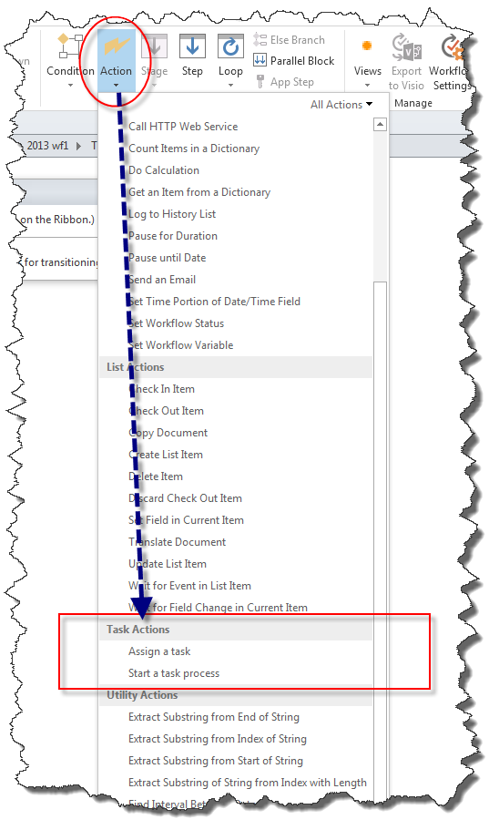

# Общие сведения о действия с задачами в SharePoint Designer 2013
Изучите использование действия задачи в SharePoint Designer 2013.
||
|:-----|
||
   

## Общие сведения о действия с задачами в SharePoint Designer 2013

Задачи в SharePoint используется для назначения работы для пользователя или группы и затем отслеживать ход выполнения, которые работают со временем. Существует два действия рабочих процессов в SharePoint Designer 2013 предназначена для работы с задачами.
  
    
    
Эти действия, являются:
  
    
    

- **Назначение задачи** используется для создания задачи SharePoint и назначить один из участников.
    
  
- **Запуск рабочего процесса** используется для назначения задачи для нескольких участников.
    
  
Действия задач доступны в раскрывающемся меню **действия** на ленте SharePoint Designer 2013, как показано на рисунке.
  
    
    

**Рисунок: Действия с задачами в SharePoint Designer 2013**

  
    
    

  
    
    

  
    
    

  
    
    

  
    
    

## С помощью действия с задачами в SharePoint

Бизнес-процесса часто состоит из задачи, которые должны быть выполнены пользователями. Рабочий процесс управляет шаги процесса. Рабочий процесс использует Действия с задачами для назначения задач людей. Например при на работу новых сотрудников необходимо выполнить ряд задач. Одна задача может быть адаптация нового сотрудника. Задачи может потребоваться выполнить членом отдела кадров.
  
    
    
Действий **Назначение задачи** и **запуска рабочего процесса**, находятся в меню **действия** раскрывающегося списка на ленте SharePoint Designer 2013. Можно добавить действия в рабочий процесс и настроить их для определенных обстоятельствах. Действие **Назначение задачи** используется для назначения задачи для одного участника. Действие при **запуске рабочего процесса** используется для назначения задачи для нескольких участников.
  
    
    

### Назначение задачи

На рисунке показана действие **Назначение задачи**.
  
    
    

**Рисунок: Назначить действие задачи в SharePoint Designer 2013**

  
    
    

  
    
    

  
    
    

  
    
    

  
    
    
**Назначение задачи** действие принимает три входных данных: пользователю назначать задачи, результат переменной и переменной идентификатор задачи.
  
    
    

- **этот пользователь**: открывает диалоговое окно **Назначение задачи**, как показано на рисунке. Используйте диалоговое окно для указания участника, названия задачи, описания, выполнения даты, параметров задач, настроек электронной почты и параметров результата.
    
  
- **Переменная: результат**: присваивает переменной, которая будет использоваться для хранения результат задачи.
    
  
- **Переменная: TaskID**: присваивает переменной, которая будет использоваться для хранения идентификатор задачи.
    
  

**Рисунок: Диалоговое окно задач назначения**

  
    
    

  
    
    

  
    
    

  
    
    

  
    
    

### Запуск процесса задачи

На рисунке показана действие при **запуске рабочего процесса**.
  
    
    

**Рисунок: «Запуск процесса задач» действия.**

  
    
    

  
    
    

  
    
    

  
    
    

  
    
    
Действие при **запуске рабочего процесса** используется два входных параметра: пользователи, которые будут принимать участие в задаче и переменной результата.
  
    
    

- **эти пользователи**: открывает диалоговое окно **Запуск процесса задачи**, как показано на рисунке. Используйте диалоговое окно Установка участника, названия задачи, описания, выполнения даты, параметров задач, настроек электронной почты и параметров результата.
    
  
- **Переменная: результат**: присваивает переменной, которая результата рабочего процесса.
    
  

**Рисунок: Диалоговое окно рабочего процесса Пуск**

  
    
    

  
    
    

  
    
    

  
    
    

  
    
    

## Дополнительные ресурсы

-  [Новые возможности рабочего процесса в SharePoint](http://msdn.microsoft.com/library/6ab8a28b-fa2f-4530-8b55-a7f663bf15ea.aspx)
    
  
-  [Приступая к работе с рабочего процесса SharePoint](http://msdn.microsoft.com/library/cc73be76-a329-449f-90ab-86822b1c2ee8.aspx)
    
  
-  [Разработка рабочих процессов в SharePoint Designer и Visio](workflow-development-in-sharepoint-designer-and-visio.md)
    
  
-  [Краткий справочник по действиям рабочего процесса (платформа рабочих процессов в SharePoint)](workflow-actions-quick-reference-sharepoint-workflow-platform.md)
    
  

  
    
    

