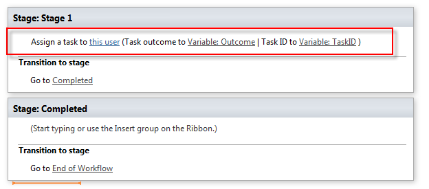
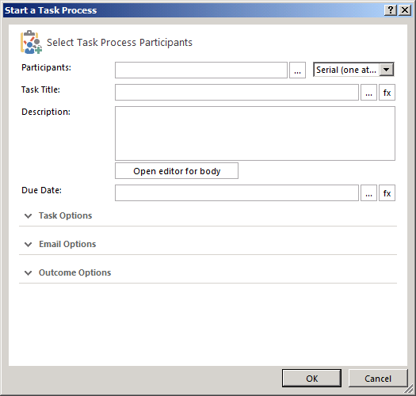

# Общие сведения о действия с задачами в SharePoint Designer 2013Understanding Task Actions in SharePoint Designer 2013
Изучите использование действия задачи в SharePoint Designer 2013.Learn to use Task Actions in SharePoint Designer 2013.
||
|:-----|
||
   

## Общие сведения о действия с задачами в SharePoint Designer 2013Overview of Task Actions in SharePoint Designer 2013

Задачи в SharePoint используется для назначения работы для пользователя или группы и затем отслеживать ход выполнения, которые работают со временем.A task in SharePoint is used to assign work to a person or group and then track the progress of that work over time. Существует два действия рабочих процессов в SharePoint Designer 2013 предназначена для работы с задачами.There are two workflow actions in SharePoint Designer 2013 designed for working with tasks.
  
    
    
Эти действия, являются:These actions are:
  
    
    

- **Назначение задачи** используется для создания задачи SharePoint и назначить один из участников.**Assign a task** is used to create a SharePoint task and assign it to a single participant.
    
  
- **Запуск рабочего процесса** используется для назначения задачи для нескольких участников.**Start a task process** is used to assign a task to multiple participants.
    
  
Действия задач доступны в раскрывающемся меню **действия** на ленте SharePoint Designer 2013, как показано на рисунке.The Task Actions are accessed in the **Action** drop-down menu of the SharePoint Designer 2013 ribbon, as shown in the figure.
  
    
    

**Рисунок: Действия с задачами в SharePoint Designer 2013****Figure: Task Actions in SharePoint Designer 2013**

  
    
    

  
    
    

  
    
    

  
    
    

  
    
    

## С помощью действия с задачами в SharePointUsing Task Actions in SharePoint

Бизнес-процесса часто состоит из задачи, которые должны быть выполнены пользователями. Рабочий процесс управляет шаги процесса. Рабочий процесс использует Действия с задачами для назначения задач людей. Например при на работу новых сотрудников необходимо выполнить ряд задач. Одна задача может быть адаптация нового сотрудника. Задачи может потребоваться выполнить членом отдела кадров.A business process often consists of tasks that must be performed by people. A workflow orchestrates the steps of a process. A workflow uses Task Actions to assign tasks to people. For example, when a new employee is hired a number of tasks need to be performed. One such task might be a new employee orientation. The task might need to be performed by a member of the Human Resources department.
  
    
    
Действий **Назначение задачи** и **запуска рабочего процесса**, находятся в меню **действия** раскрывающегося списка на ленте SharePoint Designer 2013. Можно добавить действия в рабочий процесс и настроить их для определенных обстоятельствах. Действие **Назначение задачи** используется для назначения задачи для одного участника. Действие при **запуске рабочего процесса** используется для назначения задачи для нескольких участников.The **Assign a task** and **Start a task process** actions are located on the **Actions** drop-down menu in the SharePoint Designer 2013 ribbon. You can add the actions to your workflow and then customize them for your particular circumstance. The **Assign a task** action is used to assign a task to a single participant. The **Start a task process** action is used to assign a task to multiple participants.
  
    
    

### Назначение задачиAssign a task

На рисунке показана действие **Назначение задачи**.The **Assign a task** action is shown in the figure.
  
    
    

**Рисунок: Назначить действие задачи в SharePoint Designer 2013****Figure: The Assign a task action in SharePoint Designer 2013**

  
    
    

  
    
    

  
    
    

  
    
    

  
    
    
**Назначение задачи** действие принимает три входных данных: пользователю назначать задачи, результат переменной и переменной идентификатор задачи.The **Assign a task** action takes three inputs: the user to assign a task, the outcome variable, and the task id variable.
  
    
    

- **этот пользователь**: открывает диалоговое окно **Назначение задачи**, как показано на рисунке. Используйте диалоговое окно для указания участника, названия задачи, описания, выполнения даты, параметров задач, настроек электронной почты и параметров результата.**this user**: Opens the **Assign a Task** dialog as shown in the figure. Use the dialog to set the participant, task title, description, due date, task options, email options, and outcome options.
    
  
- **Переменная: результат**: присваивает переменной, которая будет использоваться для хранения результат задачи.**Variable: Outcome**: Assigns the variable that will hold the outcome of the task.
    
  
- **Переменная: TaskID**: присваивает переменной, которая будет использоваться для хранения идентификатор задачи.**Variable: TaskID**: Assigns the variable that will hold the id of the task.
    
  

**Рисунок: Диалоговое окно задач назначения****Figure: The Assign a Task dialog box**

  
    
    

  
    
    

  
    
    

  
    
    

  
    
    

### Запуск процесса задачиStart a task process

На рисунке показана действие при **запуске рабочего процесса**.The **Start a task process** action is shown in the figure.
  
    
    

**Рисунок: «Запуск процесса задач» действия.****Figure: The "Start a task process" action.**

  
    
    

  
    
    

  
    
    

  
    
    

  
    
    
Действие при **запуске рабочего процесса** используется два входных параметра: пользователи, которые будут принимать участие в задаче и переменной результата.The **Start a task process** action takes two inputs: the users that will participate in the task and the outcome variable.
  
    
    

- **эти пользователи**: открывает диалоговое окно **Запуск процесса задачи**, как показано на рисунке. Используйте диалоговое окно Установка участника, названия задачи, описания, выполнения даты, параметров задач, настроек электронной почты и параметров результата.**these users**: Opens the **Start a Task Process** dialog box as shown in the figure. Use the dialog box to set the participants, task title, description, due date, task options, email options, and outcome options.
    
  
- **Переменная: результат**: присваивает переменной, которая результата рабочего процесса.**Variable: Outcome**: Assigns the variable that holds the outcome of the task process.
    
  

**Рисунок: Диалоговое окно рабочего процесса Пуск****Figure: The Start a Task Process dialog box**

  
    
    

  
    
    

  
    
    

  
    
    

  
    
    

## См. такжеSee also

-  [Новые возможности рабочих процессов SharePointWhat's new in workflow in SharePoint](http://msdn.microsoft.com/library/6ab8a28b-fa2f-4530-8b55-a7f663bf15ea.aspx)
    
  
-  [Начало работы с рабочими процессами SharePointGetting started with SharePoint workflow](http://msdn.microsoft.com/library/cc73be76-a329-449f-90ab-86822b1c2ee8.aspx)
    
  
-  [Разработка рабочих процессов в SharePoint Designer и VisioWorkflow development in SharePoint Designer and Visio](workflow-development-in-sharepoint-designer-and-visio.md)
    
  
-  [Краткий справочник по действиям рабочего процесса (платформа рабочих процессов в SharePoint)Workflow actions quick reference (SharePoint Workflow platform)](workflow-actions-quick-reference-sharepoint-workflow-platform.md)
    
  

  
    
    

