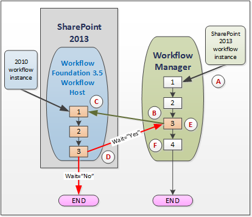

# Использование средств взаимодействия рабочих процессов для SharePointUse workflow interop for SharePoint
Предоставляет сведения об использовании средств взаимодействия рабочих процессов SharePoint в конструкторе рабочих процессов Visual Studio 2012.Provides a discussion of using SharePoint workflow Interop in the Visual Studio 2012 workflow designer. Рабочий процесс взаимодействия позволяет выполнять рабочего процесса SharePoint 2010 из рабочего процесса SharePoint.Workflow interop allows you to invoke a SharePoint 2010 workflow from within a SharePoint workflow. Это является важной функцией, которая позволяет повторно использовать существующие компоненты рабочих процессов и вызвать для действий рабочего процесса, не встроенные в SharePoint.This is an important feature that allows you to reuse existing workflow features, and to call on workflow activities that are not integrated into SharePoint.

  
    
    

> **Важные:** Чтобы узнать, как использовать функции взаимодействия SharePoint рабочего процесса в SharePoint Designer 2013, просмотрите [действия по координации общее представление о в SharePoint Designer 2013](understanding-coordination-actions-in-sharepoint-designer.md).**Important:** To learn about using SharePoint workflow interop functionality in SharePoint Designer 2013, see  [Understanding Coordination actions in SharePoint Designer 2013](understanding-coordination-actions-in-sharepoint-designer.md). 
  
    
    

## Взаимодействие рабочих процессов SharePointSharePoint workflow interop

Вот проблемы.Here's the problem. У вас есть устаревших рабочих процессов SharePoint 2010, которые необходимо повторно использовать платформы SharePoint.You have legacy SharePoint 2010 workflows that you wish to reuse on your SharePoint platform. Или, того, вы создаете новые рабочие процессы SharePoint и необходимые для вызова действия, которые доступны только в платформе SharePoint 2010.Or, worse, you are creating new SharePoint workflows and you need to invoke activities that are only available in the SharePoint 2010 platform. И вы не знаете, что делать.And you don't know what to do. На самом деле, простое решение: использование рабочего процесса SharePoint взаимодействия.Actually, the solution is simple: use SharePoint workflow Interop.
  
    
    
Для нормальной работы с модуля рабочего процесса SharePoint, который основан на Windows Workflow Foundation 4 взаимодействия рабочих процессов SharePoint позволяет рабочих процессов SharePoint 2010 (основан на Windows Workflow Foundation 3).SharePoint workflow interop enables SharePoint 2010 workflows (built on Windows Workflow Foundation 3) to work smoothly with the SharePoint workflow engine, which is based on Windows Workflow Foundation 4. Хотя новый модуль выполнения Windows Workflow Foundation 4 размещается в диспетчер рабочих процессов, который используется в качестве внешней службы SharePoint по-прежнему содержит прежних версий узла рабочего процесса SharePoint, который используется для обработки рабочих процессов SharePoint 2010.While the new Windows Workflow Foundation 4 execution engine is hosted in Workflow Manager, which runs as an external service, SharePoint still contains the legacy SharePoint workflow host which it uses to process SharePoint 2010 workflows. Взаимодействие рабочих процессов SharePoint согласует среды выполнения двух, как показано на рисунке 1.SharePoint workflow interop negotiates the two execution environments, as depicted in Figure 1.
  
    
    

**На рисунке 1. Взаимодействие рабочих процессов SharePoint в действии****Figure 1. SharePoint workflow interop in action**

  
    
    

  
    
    

  
    
    
Рассмотрим процесс показано на рисунке 1. Используйте буквы в поиске точек особое внимание на рисунке:Let's walk through the process depicted in Figure 1. Use the letters to reference points of emphasis in the illustration:
  
    
    

  
    
    
> Запускает ( **A** ) экземпляр рабочего процесса SharePoint для запуска диспетчера рабочих процессов нажмите на основе Windows Workflow Foundation 4.( **A** ) An instance of a SharePoint workflow starts to run in then Windows Workflow Foundation 4-based Workflow Manager. Обратите внимание на то, что диспетчер рабочих процессов не входит в SharePoint, но вместо этого используется в качестве внешней службы.Note that the Workflow Manager is not in SharePoint, but instead runs as an external service.
    
  

  
    
    
> ( **Б** ) достижении точки в рабочий процесс SharePoint — номер этапа 3 в диспетчер рабочих процессов - которой вы хотите вызвать рабочего процесса SharePoint 2010.( **B** ) You reach a point in the SharePoint workflow - step number 3 in the Workflow Manager - where you wish to invoke a SharePoint 2010 workflow. В конструкторе рабочих процессов Visual Studio 2012 это делается при помощи действия **WF 2010 Пуск** , как показано на рисунке 2.In the Visual Studio 2012 workflow designer, you do this by implementing the **Start 2010 WF** activity, as shown in Figure 2.
    
   **На рисунке 2. Плитка "Стадия" для запуска рабочего процесса SharePoint 2010.****Figure 2. Stage tile for starting a SharePoint 2010 workflow.**

  

  
  

    
    
    From the perspective of the SharePoint object model, this is accomplished using the  [StartWorkflow](https://msdn.microsoft.com/library/Microsoft.SharePoint.WorkflowServices.WorkflowInteropService.StartWorkflow.aspx) method on the [WorkflowInteropService](https://msdn.microsoft.com/library/Microsoft.SharePoint.WorkflowServices.WorkflowInteropService.aspx) class.
    
  

  
    
    
> ( **C** ) на этом этапе рабочего процесса SharePoint 2010 начинает выполнение в узле Windows Workflow Foundation 3,5 рабочего процесса в SharePoint. Однако включается особое внимание. В некоторых случаях вы можете 2013 рабочего процесса, чтобы ожидать в рабочий процесс 2010 для завершения работы (и может быть возвращены некоторые данные) перед тем как продолжить выполнение рабочего процесса 2013. В других сценариях это может быть не требуется и оба рабочие процессы могут выполняться независимо, параллельно.( **C** ) At this point, the SharePoint 2010 workflow begins executing in the Windows Workflow Foundation 3.5 workflow host inside of SharePoint. But an important consideration comes up. In some scenarios you may want the 2013 workflow to wait for the 2010 workflow to complete running (and perhaps return some data) before continuing to execute the 2013 workflow. In other scenarios, this may not be necessary and both workflows may run independently, in parallel.
    
    To control this behavior, the  [WorkflowInterop](https://msdn.microsoft.com/library/Microsoft.SharePoint.WorkflowServices.Activities.WorkflowInterop.aspx) class, which controls executing workflows in the Windows Workflow Foundation 3.5 workflow host, provides a [Wait](https://msdn.microsoft.com/library/Microsoft.SharePoint.WorkflowServices.Activities.WorkflowInterop.Wait.aspx) property. Setting this Boolean property to " **Yes**" (in the designer dialog box) or to **true** in the on the **Wait** property, causes the 2013 workflow to pause until the 2010 finished executing and returns a **completed** message.
    
    
    

   **На рисунке 3. Запустите диалоговое окно свойств рабочего процесса.****Figure 3. Start a Workflow properties dialog box.**

  

  
  

  

  

  
    
    
> Здесь приведен ( **D** ) приводит к практическим результатам по выбору **true** или **false** на **Wait** свойство (или **Да** или **Нет** в диалоговом окне Свойства). Если **Wait** **true**, затем рабочий процесс 2010 передает событие  [WorkflowCompleted](https://msdn.microsoft.com/library/Microsoft.SharePoint.WorkflowServices.WorkflowInteropEventReceiver.WorkflowCompleted.aspx) (и, при необходимости, возвращает данные в качестве свойства [DynamicValue](http://msdn.microsoft.com/library/2af7983b-8357-4e0f-9ba9-dfdeed05a8a7.aspx) ). Дополнительные сведения о динамических значения можно [Understanding Dynamic Value](http://msdn.microsoft.com/library/c5702628-9625-4d19-95c5-13923e91fea1.aspx).( **D** ) The practical effect of selecting **true** or **false** on the **Wait** property (or **Yes** or **No** in the properties dialog box) is depicted here. If **Wait** is **true**, then the 2010 workflow passes a  [WorkflowCompleted](https://msdn.microsoft.com/library/Microsoft.SharePoint.WorkflowServices.WorkflowInteropEventReceiver.WorkflowCompleted.aspx) event (and, optionally, returns data as a [DynamicValue](http://msdn.microsoft.com/library/2af7983b-8357-4e0f-9ba9-dfdeed05a8a7.aspx) property). For more information about dynamic values, see [Understanding Dynamic Value](http://msdn.microsoft.com/library/c5702628-9625-4d19-95c5-13923e91fea1.aspx).
    
    Of course, if **Wait** is set to **false**, then your 2010 workflow executes, then terminates normally.
    
  

  
    
    
> ( **E** ) этот шаг применяется только в том случае, если ваше вызова рабочего процесса 2010 указан **Wait=true**. В этом случае 2013 workflow получил событие **WorkflowCompleted** и перезапускает выполнение 2013 рабочего процесса на то, что оно было остановлено.( **E** ) This step is only relevant if your invocation of the 2010 workflow specified **Wait=true**. In that case, your 2013 workflow received the **WorkflowCompleted** event and restarts the workflow 2013 execution at the point it left off.
    
  

  
    
    
> Затем ( **F** ) 2013 workflow завершает выполнение и завершается. Если **Wait=false**, затем рабочий процесс 2013 выполняет и завершает независимо от рабочего процесса 2010.( **F** ) Your 2013 workflow then completes execution and terminates normally. If **Wait=false**, then your 2013 workflow executes and terminates independently of the 2010 workflow. 
    
  

## Взаимодействия разработки рабочего процессаWorkflow interop design

Взаимодействия рабочих процессов SharePoint — это платформа обмена сообщениями, которое поддерживает один к одному экземпляру сопоставление действий рабочих процессов WF 3 и WF 4. WF 3 и WF 4 взаимодействовать через обмена сообщениями, реализуемые пространством набора действий WF 4 на  [WorkflowInteropService](https://msdn.microsoft.com/library/Microsoft.SharePoint.WorkflowServices.WorkflowInteropService.aspx) .SharePoint workflow interop is a messaging framework that supports a one-to-one instance mapping between WF 3 and WF 4 workflow activities. WF 3 and WF 4 interoperate through message exchanges that are wrapped by a set of WF 4 activities on  [WorkflowInteropService](https://msdn.microsoft.com/library/Microsoft.SharePoint.WorkflowServices.WorkflowInteropService.aspx) .
  
    
    
Для поддержки взаимодействия рабочих процессов, конструирования рабочего процесса в SharePoint Designer предоставляет доступ к нового действия рабочих процессов **WF 2010 Пуск**, который является оболочкой для метода  [StartWorkflow](https://msdn.microsoft.com/library/Microsoft.SharePoint.WorkflowServices.WorkflowInteropService.StartWorkflow.aspx) . Это действие позволяет запустить рабочий процесс списка или рабочий процесс сайта.To support workflow interop, the workflow design surface in SharePoint Designer provides access to a new workflow activity, **Start 2010 WF**, which is a wrapper on the  [StartWorkflow](https://msdn.microsoft.com/library/Microsoft.SharePoint.WorkflowServices.WorkflowInteropService.StartWorkflow.aspx) method. This activity allows you to start either a list workflow or a site workflow.
  
    
    
Действия на самом деле — это последовательность сообщений, которые происходят между диспетчера рабочих процессов и узел рабочего процесса SharePoint 2010, на котором работает внутри SharePoint.The activity is in fact a sequence of messages that take place between the Workflow Manager and the SharePoint 2010 Workflow Host that is running inside SharePoint. Эти два являются посредством уровень обмена сообщениями, как показано на рисунке 4.These two are mediated by a messaging layer, as shown in Figure 4. Последовательность начинается в диспетчер рабочих процессов SharePoint с помощью вызова метода **StartWorkflow** .The sequence begins in the SharePoint workflow manager with an invocation of the **StartWorkflow** method. Сообщение «Пуск» переходит в службе рабочих процессов в SharePoint, где в свою очередь запускает рабочий процесс внутри узла рабочего процесса SharePoint 2010.The "start" message goes to the workflow service inside of SharePoint, where in turn it launches the workflow inside the SharePoint 2010 workflow host. По завершении выполнения рабочего процесса 2010 происходит событие, которое отправляет сообщение «завершенная» с помощью publisher события диспетчера рабочих процессов 2013.When execution of the 2010 workflow is complete, an event is fired that sends a "completed" message through the event publisher back to the 2013 workflow manager.
  
    
    

**На рисунке 4. Протокол взаимодействия обмена сообщениями рабочего процесса SharePoint****Figure 4. SharePoint workflow interop messaging protocol**

  
    
    

  
    
    

  
    
    

  
    
    

  
    
    

## Дополнительные ресурсыAdditional resources

-  [Общие сведения о рабочих процессах в SharePointGet started with workflows in SharePoint](get-started-with-workflows-in-sharepoint.md)
    
  
-  [Основные сведения о рабочих процессах в SharePointSharePoint workflow fundamentals](sharepoint-workflow-fundamentals.md)
    
  
-  [Общие сведения о действия по координации в SharePoint Designer 2013Understanding Coordination actions in SharePoint Designer 2013](understanding-coordination-actions-in-sharepoint-designer.md)
    
  
-  [WorkflowInteropServiceWorkflowInteropService](https://msdn.microsoft.com/library/Microsoft.SharePoint.WorkflowServices.WorkflowInteropService.aspx)
    
  
-  [WorkflowInteropEventReceiverWorkflowInteropEventReceiver](https://msdn.microsoft.com/library/Microsoft.SharePoint.WorkflowServices.WorkflowInteropEventReceiver.aspx)
    
  

  
    
    

