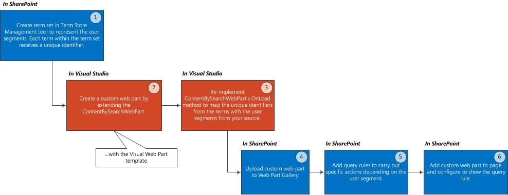

# <a name="user-segmentation-in-sharepoint"></a>Сегментация пользователей в SharePoint
Отображаемое содержимое варьировать для пользователя сегментов можно определять —, например зависимости от языкового стандарта, интересами, пол или ссылок ссылки — задает набор терминов, веб-части поиска контента, используя правила запроса в SharePoint.
SharePoint предоставляет стандартные блоки для настройки содержимого, которое Показать на сайте SharePoint, в зависимости от определенных атрибуты конечных пользователей, например их Пол место жительства, их интересами или ссылки ссылок. Эти группы атрибутов пользователя известны как сегменты пользователей. 
  
    
    

В SharePoint этой функциональности сегментирования пользователей может быть удобно использовать в различных сценариях, например:
- Отображение различных ленты на странице в зависимости от того, Пол конечного пользователя 
    
  
- Отображение различных скидку предлагает в зависимости от языкового стандарта конечного пользователя 
    
  
- Отображение различных статьи на страницы в зависимости от того, с которого производилось обращение ссылку конечного пользователя (приведенная конечного пользователя на страницу веб-сайта). 
    
  
Для реализации сегментации пользователей в SharePoint, будет выполнить следующие действия: Создание набора терминов для каждого сегмента пользователей, расширения контента веб-части поиска следует принять во внимание на сегменты пользователей и затем использовать правила запросов для выполнения определенных действий для каждого сегмента пользователей.
## <a name="prerequisites"></a>Необходимые условия
<a name="SP15_Prerequisites"> </a>

Перед началом работы, реализации сегментации пользователей в SharePoint, необходимо установить следующие компоненты в среде разработки:
  
    
    

- SharePoint
    
  
- Visual Studio 2012
    
  
В этой статье предполагается, что работы по разработке веб-частей в SharePoint. Дополнительные сведения о разработке веб-частей на ссылки  [стандартный блок: веб-части](http://msdn.microsoft.com/en-us/library/ee535520%28v=office.14%29.aspx)
  
    
    

## <a name="overview-on-adding-user-segmentation-functionality-to-your-sharepoint-site"></a>Общие сведения о добавлении функциональности сегментирования пользователей на сайт SharePoint
<a name="SP15_Overview_User_Segmentation"> </a>

На рисунке 1 показаны основные действия для добавления функции сегментации пользователей на сайт SharePoint.
  
    
    

**На рисунке 1. Действия по добавлению функциональности сегментирования пользователей на сайт SharePoint**

  
    
    

  
    
    

  
    
    

  
    
    

  
    
    

## <a name="create-a-term-set"></a>Создайте набор терминов
<a name="SP15_Create_a_term_set"> </a>

Условие — это слово или фразу, которые могут быть связаны с элементом в SharePoint. Набор Aterm — набор терминов, связанных с ними. Для получения дополнительных сведений см [управляемых метаданных в SharePoint](http://technet.microsoft.com/en-us/library/ee424402.aspx). Создание наборов терминов через средство управления банками терминов SharePoint, или программными средствами. 
  
> [!NOTE] 
> [!Примечание] В следующих разделах представлены подробные инструкции о том, как использовать средство управления банками терминов для создания набора терминов:>  [Настроить новый набор терминов](http://office.microsoft.com/en-us/sharepoint-help/set-up-a-new-term-set-HA102922634.aspx)>    [Создание терминов в наборе терминов и управление ими](http://office.microsoft.com/en-us/office365-sharepoint-online-enterprise-help/create-and-manage-terms-in-a-term-set-HA102771989.aspx)
  
    
    

Вы можете создать набор программным путем с помощью типов, представленные в  [Microsoft.SharePoint.Taxonomy](https://msdn.microsoft.com/library/Microsoft.SharePoint.Taxonomy.aspx) терминов. В следующем примере кода показано, как создать объект **TermSet** и получать **NavigationTermSet**. Создайте объекты **Term** в рамках вашей **TermSet**. И, наконец внести эти изменения **TermStore** и загружать **TermSet** для навигации.
  
    
    
Каждый термин, добавляемого к терминов set Получает уникальный идентификатор. Этот идентификатор является ключом к созданию  [ContentBySearchWebPart](https://msdn.microsoft.com/library/Microsoft.Office.Server.Search.WebControls.ContentBySearchWebPart.aspx) принять во внимание на сегменты пользователей.
  
    
    


```cs

static void CreateNavigationTermSet(string siteUrl)
{
    using (SPSite site = new SPSite(siteUrl))
    {
        using (SPWeb web = site.OpenWeb())
        {
            TaxonomySession taxonomySession = new TaxonomySession(site);
            taxonomySession.UpdateCache();
            TermStore termStore = taxonomySession.DefaultSiteCollectionTermStore;

            // Create a TermSet object in a default site collection term group.
            Group siteCollectionGroup = termStore.GetSiteCollectionGroup(site, createIfMissing: true);
            TermSet termSet = siteCollectionGroup.CreateTermSet("Navigation Demo", Guid.NewGuid(), lcid: 1033);

            // Obtain navigation term set.
            NavigationTermSet navigationTermSet = NavigationTermSet.GetAsResolvedByWeb(termSet, web, "GlobalNavigationTaxonomyProvider");

            // Create a term that points to a SharePoint page set at the term set level of hierarchy.
            NavigationTerm term1 = navigationTermSet.CreateTerm("Term 1", NavigationLinkType.FriendlyUrl, Guid.NewGuid());

            // Create a term that points to an already existing URL outside of SharePoint.
            NavigationTerm term2 = navigationTermSet.CreateTerm("Term 2", NavigationLinkType.SimpleLink, Guid.NewGuid());
            term2.SimpleLinkUrl = "http://www.bing.com/";

            // Create a term that points to an existing SharePoint page.
            NavigationTerm term3 = navigationTermSet.CreateTerm("Term 3", NavigationLinkType.FriendlyUrl, Guid.NewGuid());

            // Save all changes to the term store.
            termStore.CommitAll();
        }
    }
}
```


## <a name="create-a-custom-web-part-for-user-segmentation"></a>Создание настраиваемых веб-части для сегментации пользователей
<a name="SP15_Create_a_custom_web_part_user_segmentation"> </a>

В Visual Studio 2012 Создание настраиваемых веб-части с помощью шаблона визуальных веб-частей из категории SharePoint. Настраиваемые веб-части должен наследовать из объекта [ContentBySearchWebPart](https://msdn.microsoft.com/en-us/library/office/microsoft.office.server.search.webcontrols.contentbysearchwebpart.aspx) .
  
> [!NOTE] 
> [!Примечание] В этой статье предполагается, что работы по разработке веб-частей в SharePoint. Дополнительные сведения о разработке веб-частей на ссылки  [стандартный блок: веб-части](http://msdn.microsoft.com/en-us/library/ee535520%28v=office.14%29.aspx)
  
    
    


## <a name="configure-a-custom-web-part-with-user-segmentation-logic"></a>Настройка настраиваемого веб-части с логикой сегментации пользователей
<a name="SP15_Configure_custom_web_part_user_segmentation_logic"> </a>

В настраиваемых веб-части можно повторно реализовать  [OnLoad()](https://msdn.microsoft.com/library/Microsoft.Office.Server.Search.WebControls.ContentBySearchWebPart.OnLoad.aspx) метод или метод [OnInit()](https://msdn.microsoft.com/library/Microsoft.Office.Server.Search.WebControls.ContentBySearchWebPart.OnInit.aspx) для выполнения настраиваемой логики. Обе эти методы полезны настроить свойства объекта [ContentBySearchWebPart](https://msdn.microsoft.com/en-us/library/office/microsoft.office.server.search.webcontrols.contentbysearchwebpart.aspx) .
  
    
    

### <a name="example-1-add-male-and-female-user-segments-to-your-sharepoint-site"></a>В примере 1: Добавление м и женщина сегменты пользователей на сайт SharePoint

Чтобы добавить **Male** и **Female** сегменты пользователей, можно повторно реализуйте метод [OnLoad()](https://msdn.microsoft.com/library/Microsoft.Office.Server.Search.WebControls.ContentBySearchWebPart.OnLoad.aspx) , как показано в следующем коде.
  
    
    

```cs

protected override void OnLoad(EventArgs e)
{
    if (this.AppManager != null)
    {
        if (this.AppManager.QueryGroups.ContainsKey(this.QueryGroupName) &amp;&amp; this.AppManager.QueryGroups[this.QueryGroupName].DataProvider != null)
        {
            this.AppManager.QueryGroups[this.QueryGroupName].DataProvider.BeforeSerializeToClient += new
                BeforeSerializeToClientEventHandler(AddMycustomProperties);
        }
    }
    base.OnLoad(e);
}
```

Соответствующий метод **AddMycustomProperties** будут выглядеть следующим кодом.
  
    
    


```cs

private void AddMycustomProperties(object sender, BeforeSerializeToClientEventArgs e)
{
    DataProviderScriptWebPart dp = sender as DataProviderScriptWebPart;
    string gender = (string)Page.Session["DataProvider.Gender"];
    // Depends on what your DataProvider is: Facebook, LinkedIn, etc.

    if (dp != null &amp;&amp; gender != null)
    {   try
        {
            // Set property to male or female GUID.
            if (gender.CompareTo("female") == 0)
            {
                dp.Properties["TermSetName"] = new String[] { "TermUniqueIdentifier" };
                // E.g. 47ba9139-a4c5-4ff0-8f9a-2864be32da92
            }
            else if(gender.CompareTo("male") == 0)
            {
                dp.Properties["UserSegmentTerms"] = new String[] { "TermUniqueIdentifier" };
                // E.g. f5bf2195-2170-4b11-a018-a688a285e579
            }
        }
        catch (ArgumentException exp)
        {
             // Do something with the exception.
        }
   }
}
```


### <a name="example-2-create-user-segments-based-on-the-type-of-web-browser-your-end-user-is-using-when"></a>Пример 2: Создание сегменты пользователей на основе типа конечного пользователя используется веб-браузера

Для создания сегменты пользователей, в зависимости от типа используемой конечный пользователь, чтобы просмотреть свой сайт SharePoint, веб-браузер повторно реализуйте метод **OnLoad** , как показано в следующем коде.
  
    
    

```cs

protected override void OnLoad(EventArgs e)
{
    if (this.AppManager != null)
    {
        if (this.AppManager.QueryGroups.ContainsKey(this.QueryGroupName) &amp;&amp; this.AppManager.QueryGroups[this.QueryGroupName].DataProvider != null)
        {
             this.AppManager.QueryGroups[this.QueryGroupName].DataProvider.BeforeSerializeToClient += new 
                 BeforeSerializeToClientEventHandler(AddMycustomProperties);
        }
    }
    base.OnLoad(e);
}
```

Код для метода **AddMycustomProperties** будет выглядеть как в следующем примере.
  
    
    


```cs

private void AddMycustomProperties(object sender, BeforeSerializeToClientEventArgs e)
{
    DataProviderScriptWebPart dataProvider = sender as DataProviderScriptWebPart;
    SPSite site = SPContext.Current.Site;
  
    TaxonomySession session = new TaxonomySession(site);
    TermStore defaultSiteCollectionStore = session.DefaultSiteCollectionTermStore;
    List<string> userSegmentTerms = new List<string>();

    var userAgentparts = Page.Request.UserAgent.Split(new char[] { ';', '(', ')' });

    foreach (var part in userAgentparts)
    {
        var entry = part.Trim();
        var terms = termStore.GetTermsWithCustomProperty("UserAgent", entry, false);

            if (terms.Count > 0)
            {
                userSegmentTerms.Add(terms[0].Id.ToString());
            }
    }
    dataProvider.Properties["UserSegmentTerms"] = userSegmentTerms.ToArray();
}
```


## <a name="upload-the-custom-web-part-to-the-sharepoint-web-part-gallery"></a>Загрузите пользовательской веб-части в галерею веб-частей SharePoint
<a name="SP15_Upload_custom_web_part"> </a>

Чтобы использовать настраиваемые веб-части на странице, необходимо отправка в веб-части в **SharePoint Web Part Gallery**.
  
    
    
В **SharePoint Web Part Gallery**выберите **Параметры сайта** и выберите **веб-частей** в разделе **Коллекции веб-дизайнера**. На вкладке **файлы** нажмите кнопку **Отправить документ**.
  
    
    

## <a name="add-query-rules-to-carry-out-specific-actions-that-depend-on-the-user-segment"></a>Добавление правила запросов для выполнения определенных действий, которые зависят от пользовательский сегмент
<a name="SP15_Add_query_rules_to_carry_out_actions"> </a>

Правило запроса преобразований запросов для повышения релевантности результатов поиска путем рационально реагирует на то, что пользователь пытается найти. В правило запроса укажите условия и соответствующих действий. При запросе будут выполнены условия правила запроса, поисковая система выполняет действия, указанные в правиле для повышения релевантности результатов поиска, такие как их результаты или изменение порядка, в котором отображаются результаты.
  
    
    
При реализации сегментации пользователей, используемого правила запросов для определения условия и действия для сегменты определенных пользователей. Когда конечный пользователь является частью определенного пользовательский сегмент, будет активировать правило запроса и  [ContentBySearchWebPart](https://msdn.microsoft.com/library/Microsoft.Office.Server.Search.WebConrols.ContentBySearchWebPart.aspx) будет отображать контент, который предназначен для определенного пользователя сегмента.
  
    
    

### <a name="to-create-a-query-rule-that-will-activate-for-a-particular-user-segment"></a>Создание правила запроса, который будет активирован для конкретного пользователя сегмента


1. Публикации семейства веб-сайтов в **Настройках сайта** выберите **Администрирование семейства веб-сайтов** и нажмите кнопку **Правила запросов поиска**. 
    
  
2. Выберите источник результатов, а затем выберите **Создать правило запроса**.
    
  
3. В поле **Имя правила** введите имя правила. Щелкните и разверните **контекста**.
    
  
4. В разделе **запрос выполняется с эти сегменты пользователей** выберите **один из этих сегменты пользователей** и нажмите кнопку **Добавить сегмент пользователей**.
    
  
5. В поле **Название** введите имя для этого правила запроса сегмент пользователей. Нажмите кнопку **Добавить пользователя сегмент терминов**.
    
  
6. В диалоговом окне **Импорт из терминов хранилище** разверните узел **Службы управляемых метаданных**. В разделе **Семейства веб-сайтов** найдите набор терминов, в котором размещается условия сегментации пользователей, которые вы задали ранее в [Создайте набор терминов](#SP15_Create_a_term_set). Выберите пользовательский сегмент, для которого вы хотите применить это правило запроса. Нажмите кнопку **Сохранить**.
    
  
7. Имя вашего n сегмент пользователей диалоговое окно **Добавление пользовательского сегмента**.
    
    Теперь, которым сопоставлены правило запроса пользовательским сегментом, который в свою очередь сопоставлен термину сегмент пользователей.
    
  
8. В разделе **Условия запроса** выберите команду **Удалить условие**. 
    
    Указывает, что запрос, настроенные в  [ContentBySearchWebPart](https://msdn.microsoft.com/library/Microsoft.Office.Server.Search.WebConrols.ContentBySearchWebPart.aspx) будет действовать как условие запроса.
    
  
9. Задайте соответствующие действия, которые будут выполнять правила запроса. В разделе **действия** выберите соответствующее действие, которое требуется получить права из-за - правила запроса. Можно выбрать для **Добавления результатов повышенного уровня** или **Добавить блок результатов**.
    
  
10. Сохраните правило запроса.
    
  
11. Повторите шаги с 1 по 10 для других сегментов пользователя, в зависимости от действий, которые требуется выполнить.
    
  

## <a name="add-a-custom-web-part-to-the-sharepoint-page-and-configure-it-to-show-the-query-rule"></a>Добавление пользовательской веб-части на страницу SharePoint и настроить его для отображения правила запроса
<a name="SP15_Add_custom_web_part_to_SharePoint"> </a>

Необходимо добавить настраиваемые веб-части на страницу SharePoint.
  
    
    

### <a name="to-add-your-custom-web-part"></a>Добавление пользовательской веб-части


1. Перейдите на страницу категорий, выберите команду **Изменить страницу** и выберите команду **Изменить шаблон страницы**.
    
  
2. Выберите **Добавить веб-части** в верхней части страницы. Выберите настраиваемые веб-части в раскрывающемся меню в правом верхнем углу веб-части.
    
  
3. Нажмите кнопку **Изменить веб-части**.
    
  
4. Разверните раздел **Параметры** и выберите **SpecialTermResults** в поле **В таблице результатов**. 
    
  
5. Сохраните настройки.
    
  

## <a name="see-also"></a>См. также
<a name="bk_addresources"> </a>


-  [Создание сайтов для SharePoint](https://officedevcentersite-release.azurewebsites.net/sharepoint/docs/general-development/build-sites-for-sharepoint)
    
  
-  [Настройка сегментации пользователей на диске адаптивный каждый раз в каталог продуктов в SharePoint](http://blogs.msdn.com/b/adaptive_experiences_in_sharepoint_2013/archive/2012/11/14/set-up-user-segmentation-to-drive-adaptive-experiences-in-a-product-catalog-in-sharepoint.aspx)
    
  

  
    
    

