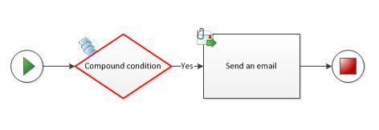
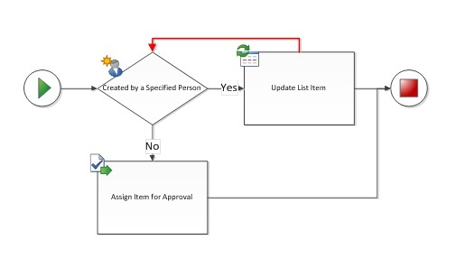
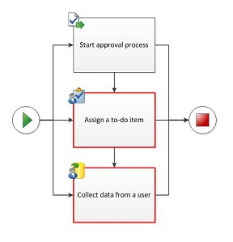
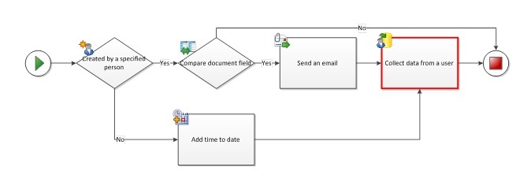
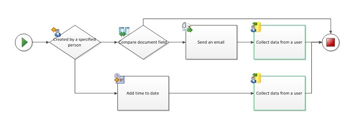
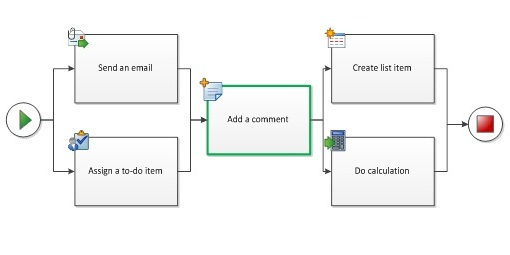
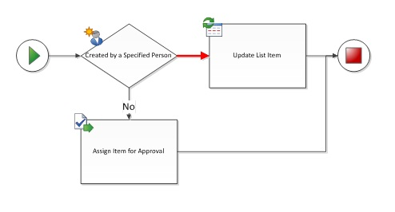
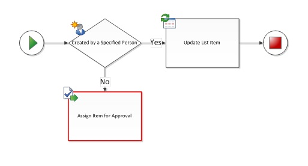

# Проблемы проверки в Visio (платформа рабочих процессов SharePoint 2010)Validation issues in Visio (SharePoint 2010 Workflow platform)
Используйте эту ссылку для устранения проблемы при проверке при экспорте рабочего процесса SharePoint в Visio Professional 2013 SharePoint Designer 2013. В этой статье описываются проблемы, которые могут возникнуть при использовании платформы рабочего процесса SharePoint 2010 в SharePoint Designer 2013 при проверке.Use this reference to help resolve validation issues when you export a SharePoint workflow from Visio Professional 2013 to SharePoint Designer 2013. This article describes validation issues that might arise when you use the SharePoint 2010 Workflow platform in SharePoint Designer 2013.
  
    
    

## ВведениеIntroduction

При экспорте рабочего процесса SharePoint из Microsoft Visio профессиональный 2013 Microsoft SharePoint Designer 2013, необходимо сначала проверить схему. Если схема рабочего процесса не является допустимым, откроется окно " **ошибки** ", которая содержит список проблем, которые необходимо исправить, прежде чем рабочий процесс может быть экспортирован...When you export a SharePoint workflow from Microsoft Visio Professional 2013 to Microsoft SharePoint Designer 2013, the diagram must first be validated. If the workflow diagram is not valid, an **Issues** window appears that includes a list of issues that must be repaired before the workflow can be exported..
  
    
    
Данная статья содержит описание, пример и рекомендуемые действия для каждого из проблемы проверки рабочих процессов, которые можно получить в Visio Professional 2013. Если во время проверки получают уведомление о проблеме, найдите имя проблемы в списке ниже, используйте пример, чтобы определить, где проблема в том и следуйте предложенные действия для ее решения.This article includes a description, example, and suggested action for each of the workflow validation issues that you can receive in Visio Professional 2013. If you receive notice of an issue during validation, find the issue name in the list below, use the example to help identify where the problem is, and then follow the suggested action to resolve it.
  
    
    

## Настраиваемое действие нельзя добавить на схему рабочего процессаA custom action cannot be added to a workflow diagram

СообщениеMessage:
  
    
    
Настраиваемое действие нельзя добавить на схему рабочего процесса. Настраиваемое действие возможно только при импорте рабочего процесса из SharePoint Designer.A Custom action cannot be added to a workflow diagram. The Custom action can only be generated when importing workflow from SharePoint Designer.
  
    
    
Пример:Example:
  
    
    

  
    
    

  
    
    
Предполагаемое действие:Suggested action:
  
    
    
Если требуется добавить действие в рабочий процесс и основной фигуры не существует для его в наборе элементов, не создавать свои собственные фигуры и импортировать сертификат из другой набор элементов. Вместо этого используйте существующей фигуры и затем использовать функцию **Добавьте комментарий** фигуры для указания режима целям.If you want to add an action to your workflow and a master shape does not exist for it in the stencil, do not create your own shape or import one from a different stencil. Instead, use an existing shape, and then use the **Add Comment** feature of the shape to specify the intended behavior.
  
    
    

## Настраиваемые условие нельзя добавить на схему рабочего процессаA Custom condition cannot be added to a workflow diagram

СообщениеMessage:
  
    
    
Настраиваемые условие нельзя добавить на схему рабочего процесса. Настраиваемое условие возможно только при импорте рабочего процесса из SharePoint Designer.A Custom condition cannot be added to a workflow diagram. The custom condition can only be generated when importing workflow from SharePoint Designer.
  
    
    
Пример:Example:
  
    
    

  
    
    

  
    
    
Предполагаемое действие:Suggested action:
  
    
    
Если требуется добавить условие в рабочий процесс и основной фигуры не существует для его в наборе элементов, не создавать свои собственные фигуры и импортировать сертификат из другой набор элементов. Вместо этого используйте существующей фигуры и затем использовать функцию **Добавьте комментарий** фигуры для указания режима целям.If you want to add a condition to your workflow and a master shape does not exist for it in the stencil, do not create your own shape or import one from a different stencil. Instead, use an existing shape, and then use the **Add Comment** feature of the shape to specify the intended behavior.
  
    
    

## Составное условие нельзя добавить на схему рабочего процесса вручнуюA Compound condition cannot be manually added to a workflow diagram

СообщениеMessage:
  
    
    
Составное условие нельзя добавить на схему рабочего процесса вручную. Составное условие возможно только при импорте рабочего процесса из SharePoint Designer.A Compound condition cannot be manually added to a workflow diagram. The compound condition can only be generated when importing workflow from SharePoint Designer.
  
    
    
Пример:Example:
  
    
    

  
    
    

  
    
    
Предполагаемое действие:Suggested action:
  
    
    
Если требуется добавить условие в рабочий процесс и основной фигуры не существует для его в наборе элементов, не создавать свои собственные фигуры и импортировать сертификат из другой набор элементов. Вместо этого используйте существующей фигуры и затем использовать функцию **Добавить комментарий** фигуры для указания режима целям.If you want to add a condition to your workflow and a master shape does not exist for it in the stencil, do not create your own shape or import one from a different stencil. Instead, use an existing shape, and then use the **Add a Comment** feature of the shape to specify the intended behavior.
  
    
    

## Существуют дубликаты соединений между фигурами рабочего процессаDuplicate connections exist between workflow shapes

СообщениеMessage:
  
    
    
Существуют дубликаты соединений между фигурами рабочего процесса.Duplicate connections exist between workflow shapes.
  
    
    
Пример:Example:
  
    
    

  
    
    

  
    
    
Предполагаемое действие:Suggested action:
  
    
    
Удаление избыточных соединителя, выбрав и его удаление.Remove the redundant connector by selecting and deleting it.
  
    
    

## Замыкание на родительскую фигуру запрещеноLoop back to parent shape is not allowed

СообщениеMessage:
  
    
    
Замыкание на родительскую фигуру запрещеноLoop back to parent shape is not allowed.
  
    
    
Пример:Example:
  
    
    

  
    
    

  
    
    
Предполагаемое действие:Suggested action:
  
    
    
Ни Visio Professional 2013, ни SharePoint Designer 2013 не поддерживают рабочих процессов с помощью циклов. Проверка рабочего процесса для циклов и удалить цикла подключения. Если вы хотите создать рабочий процесс SharePoint, который включает набор повтора действия, необходимо создать рабочий процесс в Visual Studio.Neither Visio Professional 2013 nor SharePoint Designer 2013 supports workflows with loops. Check your workflow for loops, and delete the looping connections. If you want to create a SharePoint workflow that includes a set of looping steps, you must create the workflow in Visual Studio.
  
    
    

## Параллельные действия, также являющиеся последовательными не разрешеныParallel activities that are also sequential are not allowed

СообщениеMessage:
  
    
    
Параллельные действия, также являющиеся последовательными не разрешены.Parallel activities that are also sequential are not allowed.
  
    
    
Пример:Example:
  
    
    

  
    
    

  
    
    
Предполагаемое действие:Suggested action:
  
    
    
Действия может быть либо параллельный, либо последовательные, но не оба одновременно. Параллельные действия удалите последовательного соединители. Для последовательного мероприятий удалите параллельный соединители. В некоторых случаях одновременно параллельных и последовательных действий может быть трудно определить. В приведенных ниже примерах Показать другие распространенные экземпляры параллельных и последовательных сообщений по беседам и предлагают альтернативные arrangements.Activities can be either parallel or sequential, but not both simultaneously. For parallel activities, remove the sequential connectors. For sequential activities, remove the parallel connectors. Sometimes, simultaneously parallel and sequential activities can be difficult to identify. The following examples show other common instances of parallel and sequential arrangement and offer alternative arrangements.
  
    
    
Пример:Example:
  
    
    

  
    
    

  
    
    
Предполагаемое действие:Suggested action:
  
    
    
Чтобы избежать необходимости соединители пункты же действие из нескольких путей, попробуйте дублирования для действия:To avoid having connectors point to the same activity from multiple paths, try duplicating the activity:
  
    
    

  
    
    

  
    
    
Пример:Example:
  
    
    

  
    
    

  
    
    
Предполагаемое действие:Suggested action:
  
    
    
При работе с параллельные блоки в последовательные этапы (обычно находится в рабочих процессах, созданный с помощью SharePoint Designer), попробуйте использовать фигуры «Добавьте комментарий» между двумя параллельные блоки, чтобы разделить действия.If dealing with parallel blocks in sequential steps (usually found in workflows constructed by using SharePoint Designer), try using the "Add a Comment" shape between the two parallel blocks so that the steps are separated cleanly.
  
    
    

  
    
    

  
    
    

  
    
    

  
    
    

## Фигура условия не имеет соединений с Да или нетThe condition shape does not have connections labeled with Yes or No

СообщениеMessage:
  
    
    
Фигура условия не имеет соединений с Да или нет.The condition shape does not have connections labeled with Yes or No.
  
    
    
Пример:Example:
  
    
    

  
    
    

  
    
    
Предполагаемое действие:Suggested action:
  
    
    
Щелкните правой кнопкой мыши соединитель для назначения значение «Да» или «Нет» метки.Right-click the connector to assign a "Yes" or "No" label.
  
    
    

## Фигура условия должна иметь по крайней мере одно исходящее соединение с меткой Да или нетThe condition shape must have at least one outgoing connection with label Yes or No

СообщениеMessage:
  
    
    
Фигура условия должна иметь по крайней мере одно исходящее соединение с меткой Да или нет.The condition shape must have at least one outgoing connection with label Yes or No.
  
    
    
Пример:Example:
  
    
    

  
    
    

  
    
    
Предполагаемое действие:Suggested action:
  
    
    
Убедитесь, что фигура условия по крайней мере одного исходящего соединителя, подключенного к другой фигурой рабочего процесса.Ensure that the condition shape has at least one outgoing connector attached to another workflow shape.
  
    
    

## Соединитель не является соединителем рабочего процесса SharePointThe connector is not a SharePoint Workflow connector

СообщениеMessage:
  
    
    
Соединитель не является соединителем рабочего процесса SharePoint. Убедитесь, что используется правильный соединитель с использованием соединительной или Автосоединение.The connector is not a SharePoint Workflow connector. Ensure the correct connector is used by using the connector tool or AutoConnect.
  
    
    
Пример:Example:
  
    
    

  
    
    

  
    
    
Предполагаемое действие:Suggested action:
  
    
    
Избегайте повторное использование соединителей из других схем, так как они не являются обязательно предназначен для использования с рабочими процессами SharePoint. Удаление выбранного соединителя и замените нового соединителя с помощью средства соединитель или Автосоединение.Avoid reusing connectors from other diagrams, because they are not necessarily designed to be used with SharePoint workflows. Delete the selected connector, and use the connector tool or AutoConnect to replace it with a new connector.
  
    
    

## Соединитель должна быть соединена с двумя фигурами рабочего процессаThe connector must be connected to two workflow shapes

СообщениеMessage:
  
    
    
Соединитель должен быть подключен к двум фигурам рабочего процесса.The connector must be connected to two workflow shapes.
  
    
    
Пример:Example:
  
    
    

  
    
    

  
    
    
Предполагаемое действие:Suggested action:
  
    
    
Удалите dead-end соединители или подключите их второй фигуры.Remove dead-end connectors or attach them to a second shape.
  
    
    

## Схема должна иметь только один рабочий процесс и одно фигуру началаThe diagram must only have one workflow and one Start shape

СообщениеMessage:
  
    
    
Схема должна иметь только один рабочий процесс и одно фигуру начала.The diagram must only have one workflow and one Start shape.
  
    
    
Пример:Example:
  
    
    

  
    
    

  
    
    
Предполагаемое действие:Suggested action:
  
    
    
Все пути должны берутся из **той же фигурой**. Удалить лишние **Начать** с фигурами и упорядочить соединители, чтобы путь начинается в одном месте.All paths must originate from the same **Start** shape. Remove extra **Start** shapes, and arrange the connectors so that the path starts in one place.
  
    
    

## Фигура не является фигурой рабочего процесса SharePoint. Только фигуры рабочего процесса SharePoint могут быть подключены в рабочем процессеThe shape is not a SharePoint workflow shape. Only SharePoint workflow shapes can be connected in a workflow

СообщениеMessage:
  
    
    
Фигура не является фигурой рабочего процесса SharePoint. Только фигуры рабочего процесса SharePoint могут быть подключены в рабочем процессе.The shape is not a SharePoint workflow shape. Only SharePoint workflow shapes can be connected in a workflow.
  
    
    
Пример:Example:
  
    
    

  
    
    

  
    
    
Предполагаемое действие:Suggested action:
  
    
    
Можно использовать только фигуры рабочего процесса из шаблонов рабочих процессов SharePoint в шаблоне рабочего процесса Microsoft SharePoint. Другие фигуры блок-схемы, не распознаются, и они запретить экспорт на SharePoint Designer 2013 рабочего процесса.Only workflow shapes from the SharePoint workflow stencils can be used in the Microsoft SharePoint Workflow template. Other flowchart shapes are not recognized, and they prevent the workflow from being exported to SharePoint Designer 2013.
  
    
    

## Фигура начала не должна иметь входящих соединенийThe Start shape must not have incoming connections

СообщениеMessage:
  
    
    
Фигура начала не должна иметь входящих соединенийThe Start shape must not have incoming connections.
  
    
    
Пример:Example:
  
    
    

  
    
    

  
    
    
Предполагаемое действие:Suggested action:
  
    
    
Удаление входящего соединителя для формы **запуска**.Remove the incoming connector to the **Start** shape.
  
    
    

## Фигура окончания не должна иметь исходящих соединенийThe Terminate shape must not have outgoing connections

СообщениеMessage:
  
    
    
Фигура окончания не должна иметь исходящих соединений.The Terminate shape must not have outgoing connections.
  
    
    
Пример:Example:
  
    
    

  
    
    

  
    
    
Предполагаемое действие:Suggested action:
  
    
    
Удаление исходящего соединителя из фигура **окончания**.Remove the outgoing connector from the **Terminate** shape.
  
    
    

## Рабочий процесс должен иметь фигуру началаThe workflow must have a Start shape

СообщениеMessage:
  
    
    
Рабочий процесс должен иметь фигуру началаThe workflow must have a Start shape.
  
    
    
Пример:Example:
  
    
    

  
    
    

  
    
    
Предполагаемое действие:Suggested action:
  
    
    
Добавьте **запустите** фигуры в начало рабочего процесса и подключиться к первого действия.Add a **Start** shape to the beginning of the workflow, and connect it to the first activity.
  
    
    

## Фигура рабочего процесса не соединена Фигура окончанияThe workflow shape is not connected to a Terminate shape

СообщениеMessage:
  
    
    
Фигура рабочего процесса не соединена Фигура окончания.The workflow shape is not connected to a Terminate shape.
  
    
    
Пример:Example:
  
    
    

  
    
    

  
    
    
Предполагаемое действие:Suggested action:
  
    
    
Если рабочий процесс не имеет фигура **окончания**, добавьте один и подключитесь к концу рабочего процесса. Если фигура рабочего процесса не находит соединения с другой фигурой рабочего процесса (см), можно удалить его или подключиться к другой фигурой рабочего процесса.If the workflow does not have a **Terminate** shape, add one and connect it to the end of the workflow. If a workflow shape is missing a connection to another workflow shape (see example), you can remove it or connect it to another workflow shape.
  
    
    

## Фигура рабочего процесса не соединена с рабочим процессомThe workflow shape is not connected to the workflow

СообщениеMessage:
  
    
    
Фигура рабочего процесса не соединена с рабочим процессом.The workflow shape is not connected to the workflow.
  
    
    
ПримерExample:
  
    
    

  
    
    

  
    
    
Предполагаемое действие:Suggested action:
  
    
    
При необходимости в форме рабочего процесса добавьте соединителей для присоединения к пути рабочего процесса. В противном случае удалите форму.If the workflow shape is necessary, add connectors to attach it to the workflow path. Otherwise, delete the shape.
  
    
    

## Число уровней вложения рабочего процесса не должен превышать не более 10Workflow nesting levels must not exceed a maximum of 10

СообщениеMessage:
  
    
    
Число уровней вложения рабочего процесса не должен превышать не более 10.Workflow nesting levels must not exceed a maximum of 10.
  
    
    
Предполагаемое действие:Suggested action:
  
    
    
Visio профессиональный 2013 может распознать не более 10 уровней вложенных действий. Изменение порядка рабочего процесса, чтобы сократить сложность, не тратя действия или разделения пути рабочего процесса на более одного филиала.Visio Professional 2013 can recognize a maximum of 10 levels of nested workflow activities. Rearrange the workflow to reduce complexity by eliminating activities or dividing the workflow path into more than one branch.
  
    
    

## См. такжеSee also

-  [Что нового в рабочих процессах для SharePointWhat's new in workflows for SharePoint](what-s-new-in-workflows-for-sharepoint.md)
    
  
-  [Общие сведения о рабочих процессах в SharePointGet started with workflows in SharePoint](get-started-with-workflows-in-sharepoint.md)
    
  
-  [Разработка рабочих процессов в SharePoint Designer и VisioWorkflow development in SharePoint Designer and Visio](workflow-development-in-sharepoint-designer-and-visio.md)
    
  

  
    
    

