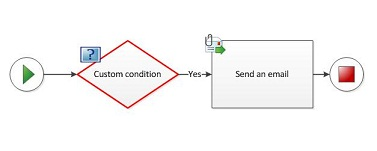
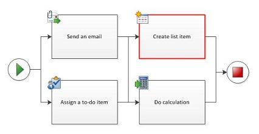
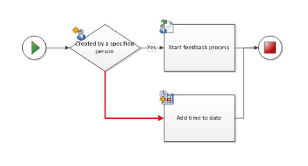
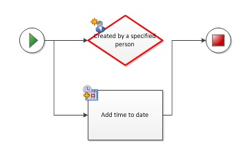
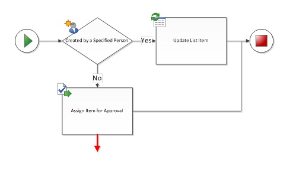
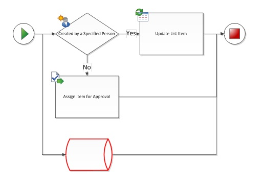
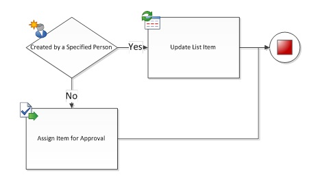
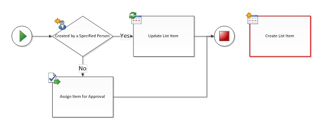

# Проблемы проверки в Visio (платформа рабочих процессов SharePoint 2010)
Используйте эту ссылку для устранения проблемы при проверке при экспорте рабочего процесса SharePoint в Visio Professional 2013 SharePoint Designer 2013. В этой статье описываются проблемы, которые могут возникнуть при использовании платформы рабочего процесса SharePoint 2010 в SharePoint Designer 2013 при проверке.
  
    
    

## Введение

При экспорте рабочего процесса SharePoint из Microsoft Visio профессиональный 2013 Microsoft SharePoint Designer 2013, необходимо сначала проверить схему. Если схема рабочего процесса не является допустимым, откроется окно " **ошибки** ", которая содержит список проблем, которые необходимо исправить, прежде чем рабочий процесс может быть экспортирован...
  
    
    
Данная статья содержит описание, пример и рекомендуемые действия для каждого из проблемы проверки рабочих процессов, которые можно получить в Visio Professional 2013. Если во время проверки получают уведомление о проблеме, найдите имя проблемы в списке ниже, используйте пример, чтобы определить, где проблема в том и следуйте предложенные действия для ее решения.
  
    
    

## Настраиваемое действие нельзя добавить на схему рабочего процесса

Сообщение
  
    
    
Настраиваемое действие нельзя добавить на схему рабочего процесса. Настраиваемое действие возможно только при импорте рабочего процесса из SharePoint Designer.
  
    
    
Пример:
  
    
    

  
    
    

  
    
    
Предполагаемое действие:
  
    
    
Если требуется добавить действие в рабочий процесс и основной фигуры не существует для его в наборе элементов, не создавать свои собственные фигуры и импортировать сертификат из другой набор элементов. Вместо этого используйте существующей фигуры и затем использовать функцию **Добавьте комментарий** фигуры для указания режима целям.
  
    
    

## Настраиваемые условие нельзя добавить на схему рабочего процесса

Сообщение
  
    
    
Настраиваемые условие нельзя добавить на схему рабочего процесса. Настраиваемое условие возможно только при импорте рабочего процесса из SharePoint Designer.
  
    
    
Пример:
  
    
    

  
    
    

  
    
    
Предполагаемое действие:
  
    
    
Если требуется добавить условие в рабочий процесс и основной фигуры не существует для его в наборе элементов, не создавать свои собственные фигуры и импортировать сертификат из другой набор элементов. Вместо этого используйте существующей фигуры и затем использовать функцию **Добавьте комментарий** фигуры для указания режима целям.
  
    
    

## Составное условие нельзя добавить на схему рабочего процесса вручную

Сообщение
  
    
    
Составное условие нельзя добавить на схему рабочего процесса вручную. Составное условие возможно только при импорте рабочего процесса из SharePoint Designer.
  
    
    
Пример:
  
    
    

  
    
    

  
    
    
Предполагаемое действие:
  
    
    
Если требуется добавить условие в рабочий процесс и основной фигуры не существует для его в наборе элементов, не создавать свои собственные фигуры и импортировать сертификат из другой набор элементов. Вместо этого используйте существующей фигуры и затем использовать функцию **Добавить комментарий** фигуры для указания режима целям.
  
    
    

## Существуют дубликаты соединений между фигурами рабочего процесса

Сообщение
  
    
    
Существуют дубликаты соединений между фигурами рабочего процесса.
  
    
    
Пример:
  
    
    

  
    
    

  
    
    
Предполагаемое действие:
  
    
    
Удаление избыточных соединителя, выбрав и его удаление.
  
    
    

## Замыкание на родительскую фигуру запрещено

Сообщение
  
    
    
Замыкание на родительскую фигуру запрещено
  
    
    
Пример:
  
    
    

  
    
    

  
    
    
Предполагаемое действие:
  
    
    
Ни Visio Professional 2013, ни SharePoint Designer 2013 не поддерживают рабочих процессов с помощью циклов. Проверка рабочего процесса для циклов и удалить цикла подключения. Если вы хотите создать рабочий процесс SharePoint, который включает набор повтора действия, необходимо создать рабочий процесс в Visual Studio.
  
    
    

## Параллельные действия, также являющиеся последовательными не разрешены

Сообщение
  
    
    
Параллельные действия, также являющиеся последовательными не разрешены.
  
    
    
Пример:
  
    
    

  
    
    

  
    
    
Предполагаемое действие:
  
    
    
Действия может быть либо параллельный, либо последовательные, но не оба одновременно. Параллельные действия удалите последовательного соединители. Для последовательного мероприятий удалите параллельный соединители. В некоторых случаях одновременно параллельных и последовательных действий может быть трудно определить. В приведенных ниже примерах Показать другие распространенные экземпляры параллельных и последовательных сообщений по беседам и предлагают альтернативные arrangements.
  
    
    
Пример:
  
    
    

  
    
    

  
    
    
Предполагаемое действие:
  
    
    
Чтобы избежать необходимости соединители пункты же действие из нескольких путей, попробуйте дублирования для действия:
  
    
    

  
    
    

  
    
    
Пример:
  
    
    

  
    
    

  
    
    
Предполагаемое действие:
  
    
    
При работе с параллельные блоки в последовательные этапы (обычно находится в рабочих процессах, созданный с помощью SharePoint Designer), попробуйте использовать фигуры «Добавьте комментарий» между двумя параллельные блоки, чтобы разделить действия.
  
    
    

  
    
    

  
    
    

  
    
    

  
    
    

## Фигура условия не имеет соединений с Да или нет

Сообщение
  
    
    
Фигура условия не имеет соединений с Да или нет.
  
    
    
Пример:
  
    
    

  
    
    

  
    
    
Предполагаемое действие:
  
    
    
Щелкните правой кнопкой мыши соединитель для назначения значение «Да» или «Нет» метки.
  
    
    

## Фигура условия должна иметь по крайней мере одно исходящее соединение с меткой Да или нет

Сообщение
  
    
    
Фигура условия должна иметь по крайней мере одно исходящее соединение с меткой Да или нет.
  
    
    
Пример:
  
    
    

  
    
    

  
    
    
Предполагаемое действие:
  
    
    
Убедитесь, что фигура условия по крайней мере одного исходящего соединителя, подключенного к другой фигурой рабочего процесса.
  
    
    

## Соединитель не является соединителем рабочего процесса SharePoint

Сообщение
  
    
    
Соединитель не является соединителем рабочего процесса SharePoint. Убедитесь, что используется правильный соединитель с использованием соединительной или Автосоединение.
  
    
    
Пример:
  
    
    

  
    
    

  
    
    
Предполагаемое действие:
  
    
    
Избегайте повторное использование соединителей из других схем, так как они не являются обязательно предназначен для использования с рабочими процессами SharePoint. Удаление выбранного соединителя и замените нового соединителя с помощью средства соединитель или Автосоединение.
  
    
    

## Соединитель должна быть соединена с двумя фигурами рабочего процесса

Сообщение
  
    
    
Соединитель должен быть подключен к двум фигурам рабочего процесса.
  
    
    
Пример:
  
    
    

  
    
    

  
    
    
Предполагаемое действие:
  
    
    
Удалите dead-end соединители или подключите их второй фигуры.
  
    
    

## Схема должна иметь только один рабочий процесс и одно фигуру начала

Сообщение
  
    
    
Схема должна иметь только один рабочий процесс и одно фигуру начала.
  
    
    
Пример:
  
    
    

  
    
    

  
    
    
Предполагаемое действие:
  
    
    
Все пути должны берутся из **той же фигурой**. Удалить лишние **Начать** с фигурами и упорядочить соединители, чтобы путь начинается в одном месте.
  
    
    

## Фигура не является фигурой рабочего процесса SharePoint. Только фигуры рабочего процесса SharePoint могут быть подключены в рабочем процессе

Сообщение
  
    
    
Фигура не является фигурой рабочего процесса SharePoint. Только фигуры рабочего процесса SharePoint могут быть подключены в рабочем процессе.
  
    
    
Пример:
  
    
    

  
    
    

  
    
    
Предполагаемое действие:
  
    
    
Можно использовать только фигуры рабочего процесса из шаблонов рабочих процессов SharePoint в шаблоне рабочего процесса Microsoft SharePoint. Другие фигуры блок-схемы, не распознаются, и они запретить экспорт на SharePoint Designer 2013 рабочего процесса.
  
    
    

## Фигура начала не должна иметь входящих соединений

Сообщение
  
    
    
Фигура начала не должна иметь входящих соединений
  
    
    
Пример:
  
    
    

  
    
    

  
    
    
Предполагаемое действие:
  
    
    
Удаление входящего соединителя для формы **запуска**.
  
    
    

## Фигура окончания не должна иметь исходящих соединений

Сообщение
  
    
    
Фигура окончания не должна иметь исходящих соединений.
  
    
    
Пример:
  
    
    

  
    
    

  
    
    
Предполагаемое действие:
  
    
    
Удаление исходящего соединителя из фигура **окончания**.
  
    
    

## Рабочий процесс должен иметь фигуру начала

Сообщение
  
    
    
Рабочий процесс должен иметь фигуру начала
  
    
    
Пример:
  
    
    

  
    
    

  
    
    
Предполагаемое действие:
  
    
    
Добавьте **запустите** фигуры в начало рабочего процесса и подключиться к первого действия.
  
    
    

## Фигура рабочего процесса не соединена Фигура окончания

Сообщение
  
    
    
Фигура рабочего процесса не соединена Фигура окончания.
  
    
    
Пример:
  
    
    

  
    
    

  
    
    
Предполагаемое действие:
  
    
    
Если рабочий процесс не имеет фигура **окончания**, добавьте один и подключитесь к концу рабочего процесса. Если фигура рабочего процесса не находит соединения с другой фигурой рабочего процесса (см), можно удалить его или подключиться к другой фигурой рабочего процесса.
  
    
    

## Фигура рабочего процесса не соединена с рабочим процессом

Сообщение
  
    
    
Фигура рабочего процесса не соединена с рабочим процессом.
  
    
    
Пример
  
    
    

  
    
    

  
    
    
Предполагаемое действие:
  
    
    
При необходимости в форме рабочего процесса добавьте соединителей для присоединения к пути рабочего процесса. В противном случае удалите форму.
  
    
    

## Число уровней вложения рабочего процесса не должен превышать не более 10

Сообщение
  
    
    
Число уровней вложения рабочего процесса не должен превышать не более 10.
  
    
    
Предполагаемое действие:
  
    
    
Visio профессиональный 2013 может распознать не более 10 уровней вложенных действий. Изменение порядка рабочего процесса, чтобы сократить сложность, не тратя действия или разделения пути рабочего процесса на более одного филиала.
  
    
    

## Дополнительные ресурсы

-  [Что нового в рабочих процессах для SharePoint](what-s-new-in-workflows-for-sharepoint.md)
    
  
-  [Общие сведения о рабочих процессах в SharePoint](get-started-with-workflows-in-sharepoint.md)
    
  
-  [Разработка рабочих процессов в SharePoint Designer и Visio](workflow-development-in-sharepoint-designer-and-visio.md)
    
  

  
    
    

