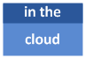

# Службы Visio в SharePoint
Службы Visio в Microsoft SharePoint позволяет загружать, отображать и программно взаимодействовать с Visio vsdx (en), .vsdm файлы и веб-документов Visio (.vdw) на Microsoft SharePoint и Microsoft SharePoint Online.
## Новые возможности служб Visio в SharePoint

Службы Visio в Microsoft SharePoint и в Microsoft SharePoint Online включает в себя ряд новых функций, включая поддержку нового формата файлов Microsoft Visio 2013, поддержки для источников данных служб Microsoft Business Connectivity Services (BCS) и программный доступ к комментариев.
  
    
    

### Новый формат файла

|||
|:-----|:-----|
|             |Visio 2013 представлен новый формат файла (vsdx (en), на основе Open Packaging Conventions (OPC) standard (ISO 29500, часть 2) и XML-элементы из предыдущих Visio формат XML-файла (.vdx). Это формат ZIP-файл на основе XML, аналогичную форматы файлов, используемые в других приложениях .  С помощью нового формата файлов можно сохранить Visio 2013 документа в библиотеке SharePoint Server или SharePoint Online без необходимости опубликуйте файл как Visio Web рисунка (.vdw). Тем не менее Службы Visio возможность чтения и отображение файлов веб-документа Visio.  Службы Visio сохраняет возможность отображения в формат веб-документа Visio (.vdw) в браузере. Он теперь также выводит нового Visio документа (vsdx (en) и Visio макросами рисунка (.vsdm) форматы.  Объектная модельECMAScript (JavaScript, JScript)Службы Visio содержит новые API для поддержки новый формат файла:  [Vwa.VwaControl.getDiagramFileType Method](http://msdn.microsoft.com/library/fd8ca95f-a3be-4000-bce8-3aaf1f48148c%28Office.15%29.aspx). Методы возвращает значение из  [Vwa.DiagramFileType Enumeration](http://msdn.microsoft.com/library/dd2f8a5d-a54b-44bd-a458-02efdcba0201%28Office.15%29.aspx) , которое указывает, является ли имя файла, отображаемое в веб-части Visio Web Access (vsdx (en) документа Visio или Visio Web рисунка (.vdw).   Дополнительные сведения о новом формате Visio 2013 [Introduction to the Visio file format (.vsdx)](http://msdn.microsoft.com/library/69736f40-8f67-46c2-abf6-82dffecb2274%28Office.15%29.aspx)см.    **Примечание**: новые файлы Visio (vsdx (en) и .vsdm) отображаются только в растровом формате в Visio Services. Веб-документов Visio (.vdw) по-прежнему отображаются с помощью Silverlight.           |
   

### Поддержка данных Business Connectivity Services (BCS)

|||
|:-----|:-----|
|             |Схемы Visio 2013 теперь могут быть подключены к внешним спискам, созданных с помощью Microsoft Business Connectivity Services (BCS) на серверах SharePoint и в SharePoint Online. Службы Visio поддерживают возможность обновления схемы Visio как обновления данных.    **Примечание**: службам Visio не поддерживает SQL, SQL Azure, OLEDC, ODBC и настраиваемые поставщики данных в качестве источников данных в SharePoint Online.           |
   

### Комментарии

|||
|:-----|:-----|
|             |Visio 2013 включает в себя новые комментирования framework. Комментарии, теперь могут быть связаны с конкретной формы или страницы. Службы Visio включает в себя интерфейсы API JavaScript для извлечения комментариев из схемы.  Дополнительные сведения о комментирования интерфейсы API в объектной моделиJavaScriptСлужбы Visio видеть темы  [VwaPage.getPageComments Method](http://msdn.microsoft.com/library/d1e7740c-e0fa-4823-b2b6-14551bb84c36%28Office.15%29.aspx) и [VwaShape.getComments Method](http://msdn.microsoft.com/library/fcdec9c2-a503-4315-b048-033cd5ac09dd%28Office.15%29.aspx).    |
   

### Пересчет в развернутой

|||
|:-----|:-----|
|             |Службы Visio теперь можно создать формулы в таблице свойств фигуры. Помимо обновления связанных с данными, Службы Visio можно обновить все фигуры с данными и визуальные элементы, которые зависят от данных. Большинство функций ShapeSheet поддерживаются для пересчета.    |
   

### Улучшенная обработка ошибок

|||
|:-----|:-----|
|             |При возникновении ошибки обновления данных в документе Visio, отображаемые в Службы Visio, отображение теперь будет использоваться Неподвижное изображение диаграммы. Службы Visio также предоставляет более содержательные сведения в сообщения об ошибках.    |
   

### Проверка подлинности службы Secure Store

|||
|:-----|:-----|
|             |Ранее параметры проверки подлинности для внешних источников данных (базы данных SQL, например) может быть только через служебной программы в Microsoft Excel. С Visio 2013 пользователи теперь могут настраивать их подключением данных схемы непосредственно из клиент Visio, который позволяет источников данных, необходимо обновить в Службы Visio.    |
   

## Модель объектов JavaScript служб Visio

|||
|:-----|:-----|
|             |[Vwa Пространства имен](http://msdn.microsoft.com/library/b67939fa-d3db-41ff-8864-eabd318ba7c4%28Office.15%29.aspx) в объектной моделиJavaScript в Службы Visio предоставляет программный доступ к схем Visio в веб-части Visio Web Access. С помощью объектной модели JavaScript, чтобы воспользоваться данные о схемы, страницы и фигуры. гиперссылки на фигуры; и фигуры, ограничивающих свойства поля. При этом access можно создавать гибридных веб-приложений, выделите фигуры, поместите перекрытий на диаграмме, реагировать на события схемы и мыши и изменения свойств панорамирования и масштабирования окна просмотра.  Сведения о добавлении веб-части Visio Web Access на страницу SharePoint, а также программирование этой страницы с помощью JavaScript API-интерфейсы в Visio 2013 содержатся в разделе  [Настройка веб-документов Visio в веб-части Visio Web Access](http://msdn.microsoft.com/en-us/library/ff394649.aspx).    |
   

## Библиотека классов служб Visio

|||
|:-----|:-----|
||Библиотека классов служб Visio, в пространство имен [Microsoft.Office.Visio.Server](https://msdn.microsoft.com/library/Microsoft.Office.Visio.Server.aspx) можно использовать для создания настраиваемых поставщиков данных служб Visio. Поставщики данных позволяют программным путем обновления данных, полученных от источников пользовательских данных в схемы Visio 2013, размещенного на сайте SharePoint.   Дополнительные сведения о создании настраиваемого поставщика данных и для работы через в единое решение начала до конца содержатся в разделе  [Создание настраиваемого поставщика данных с помощью служб Visio](http://msdn.microsoft.com/en-us/library/ff394595.aspx).    |
   

## См. также

-  [Microsoft.Office.Visio.Server](https://msdn.microsoft.com/library/Microsoft.Office.Visio.Server.aspx)
    
  
-  [Vwa Пространства имен](http://msdn.microsoft.com/library/b67939fa-d3db-41ff-8864-eabd318ba7c4%28Office.15%29.aspx)
    
  
-  [Создание настраиваемого поставщика данных с помощью служб Visio](http://msdn.microsoft.com/en-us/library/ff394595.aspx)
    
  
-  [Настройка веб-документов Visio в веб-части Visio Web Access](http://msdn.microsoft.com/en-us/library/ff394649.aspx)
    
  
-  [New in Visio for developers](http://msdn.microsoft.com/library/7e3fb858-0ab8-bd2e-217c-c85b10d79785%28Office.15%29.aspx)
    
  
- Список новых функций в vis15short для конечных пользователей в разделе  [новые возможности Visio](http://office.com/redir/HA102749364.aspx).
    
  
