# Фигур Visio в SharePoint Designer 2013: краткий справочник (платформа рабочих процессов SharePoint 2010)
Можно создать рабочий процесс в Microsoft Visio профессиональный 2013 и экспортировать его в Microsoft SharePoint Designer 2013. В этом руководстве идентифицирует фигур Visio, используемые для создания рабочего процесса.Используйте эту статью ссылку только в том случае, если пользователь работает в SharePoint Designer 2013, но продолжить использование платформы рабочих процессов SharePoint 2010.Фигуры для платформы рабочих процессов SharePoint 2010 поступают в трех наборы элементов: **действия - рабочего процесса SharePoint 2010**, **условия - рабочего процесса SharePoint 2010** и **конца - рабочего процесса SharePoint 2010**.
## Действия рабочего процесса

Действия рабочего процесса, определенных операций выполняет этого рабочего процесса. Каждый рабочий процесс должен содержать по крайней мере одно действие.
  
    
    
Действия в этом списке организованы в категории на основании их области приложения в рабочем процессе. Например действия, которые влияют на поведение элемента списка собраны в разделе **Действия со списком** и действия, связанные с наборы документов собраны в разделе **Настройка действия с документами**. Категории для действий являются:
  
    
    

-  [Основные действия](visio-shapes-in-sharepoint-designer-a-quick-reference-guide-sharepoint-2010.md#section1a) Это наиболее часто используемые действия в рабочий процесс.
    
  
-  [Действия с наборами документов](visio-shapes-in-sharepoint-designer-a-quick-reference-guide-sharepoint-2010.md#section1e) Как правило в рабочих процессов, связанных с библиотекой документов или типа контента документа используются следующие действия.
    
  
-  [Действия со списками](visio-shapes-in-sharepoint-designer-a-quick-reference-guide-sharepoint-2010.md#section1b) Операции для элементов списка выполнить следующие действия.
    
  
-  [Действия с отношениями](visio-shapes-in-sharepoint-designer-a-quick-reference-guide-sharepoint-2010.md#section1d) Одно действие в этой категории ищет руководителя пользователя и сохраняет их в переменной.
    
  
-  [Действия с задачами](visio-shapes-in-sharepoint-designer-a-quick-reference-guide-sharepoint-2010.md#section1c) Эти действия связаны с формы операций, свои отзывы и предложения и утверждения.
    
  

> **Важные:** Большая часть фигуры действия, которые можно вставить в рабочий процесс SharePoint в Visio требуется дополнительная настройка при импорте рабочего процесса в SharePoint Designer. В Visio не забудьте использовать функцию комментариев для каждой фигуры действие для указания параметров или конфигурации действия. 
  
    
    

### Основные действия

Эти действия наиболее часто используемые и могут использоваться в любой тип рабочего процесса или шаг.

|**Действие фигуры Visio**|**Соответствующее действие в SharePoint Designer**|**Описание**|
|:-----|:-----|:-----|
|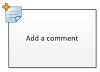|Это действие Visio — это то же, что действие **Добавить комментарий** в SharePoint Designer 2013 и отображается как:        **Примечание:** Комментарии остаются видимыми, когда рабочий процесс экспортируется в Visio.           |**Добавление комментария**   Используйте это действие для оставлять комментарии информативных данных в конструкторе рабочих процессов для справочных целей. Это особенно удобно в тех случаях, когда других пользователей, совместное редактирование рабочего процесса. Например если переменная в текущем рабочего процесса не имеет понятное имя, используйте это действие для добавления комментария, чтобы указать, что означает эта переменная в рабочем процессе.  |
|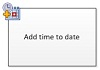|Это действие Visio же, как **Добавить время к дате** действие в SharePoint Designer 2013 и отображается как:   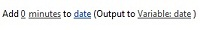|**Добавление времени к дате**   Используйте это действие для добавления определенное время в минутах, часов, дней, месяцев или лет к дате и сохранить значение выходные данные в качестве переменной. Дата может быть текущую дату, определенную дату или подстановки.  |
|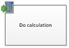|Это действие Visio — это то же, что действие **Выполните вычислений** в SharePoint Designer 2013 и отображается как:   |**Выполнение расчета**   Используйте это действие для выполнения вычислений, таких как добавление, вычитания, умножения и деления двух значений и выходных данных значение сохраняется в переменной.    |
||Это действие Visio — это то же, что действие **журнала в журнал** в SharePoint Designer 2013 и отображается как:   |**Запись в журнал**   Это действие используется для записи в журнал сообщение о рабочем процессе в свой список журнала. Сообщение может быть Сводка событий рабочего процесса или что-либо значительные о рабочем процессе. Списке журнала рабочего процесса могут быть полезны для устранения проблем с рабочим процессом.  |
||Это действие Visio совпадает с **паузу в течение** действие в SharePoint Designer 2013 и отображается как:   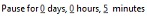|**Приостановка в течение определенного периода**   Используйте это действие для приостановки рабочего процесса в течение определенного периода времени в несколько дней, часов и минут.    **Примечание:** Задержка — это влияют интервал задания таймера, который имеет значение по умолчанию 5 минут.           |
|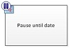|Это действие Visio — это то же, что действие **Паузу до даты** в SharePoint Designer 2013 и отображается как:   |**Приостановка до даты**   Используйте это действие для приостановить рабочий процесс до определенной даты. Можно добавить текущую дату, определенную дату или подстановки.  |
||Это действие Visio — это то же, что действие **Задать часть из времени поля даты и времени** в SharePoint Designer 2013 и отображается как:   |**Задать время для поля даты и времени**   Используйте это действие для создания временной метки и значение выходных данных хранилища в переменной. Можно задания времени в часы, минуты и добавить текущую дату, определенную дату или подстановки.  |
|| Это действие Visio — это то же, что действие **Задать состояние рабочего процесса** в SharePoint Designer 2013 и отображается как:   Невозможно переименование или удаление значение состояния после его создания. Тем не менее нет необходимости использовать его.    Пользовательское состояние применимо только к текущему рабочему процессу, и его невозможно использовать в другом рабочем процессе.    Рабочий процесс не может использовать пользовательские значения состояния, которые определены в действии, если действие используется в шаге олицетворения.   |**Установка состояния рабочего процесса**   Используйте это действие для задания состояния рабочего процесса. Значения по умолчанию — **отменено**, **Утверждено** и **Отклонено**.   Можно ввести новое значение состояние в раскрывающемся списке в действии. После ввода значение состояния запись автоматически добавляется в раскрывающемся списке.  Если действие **Задать состояние рабочего процесса** на последнем этапе рабочего процесса также применения пользовательское значение, видно ваше пользовательское значение в столбце **состояние** в списке при Приостановка рабочего процесса и уведомление.   |
|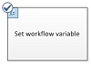|Это действие Visio — это то же, что действие **Задать переменную рабочего процесса** в SharePoint Designer 2013 и отображается как:   |**Установка переменной рабочего процесса**   Используйте это действие для присвоено значение переменной рабочего процесса. Используйте это действие рабочего процесса, чтобы присвоить переменной данных.  |
||Это действие Visio — это то же, что действие **остановка рабочего процесса** в SharePoint Designer 2013 и отображается как:   |**Остановка рабочего процесса**   Используйте это действие для остановки текущего экземпляра рабочего процесса и войдите сообщение в списке **Журнала рабочего процесса**. Сообщение, указанные в действие будет отображаться в столбце **Описание** в журнал рабочего процесса после завершения рабочего процесса.   |
   

### Действия со списками

Эти действия используются для элементов списка.
  
    
    

|**ДЕЙСТВИЕ ФИГУРЫ VISIO**|**СООТВЕТСТВУЮЩЕЕ ДЕЙСТВИЕ В SHAREPOINT DESIGNER**|**Описание**|
|:-----|:-----|:-----|
|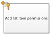|Это действие Visio — это то же, что действие **Добавить разрешения для элемента списка** в SharePoint Designer 2013 и отображается как:       **Примечание:** это действие доступно только в пределах шаг олицетворения.           |**Добавление разрешений для элемента списка**   Это действие предоставляет права отдельные уровни разрешений для элемента к определенным пользователям.    |
||Это действие Visio совпадает с действия **Проверки в элемента** в SharePoint Designer 2013 и отображается как:   |**Возвращение элемента**   Это действие проверяет в элементе, который выдается.    **Примечание:** Можно указать только в элементы из библиотеки документов.           |
|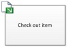|Это действие Visio совпадает с действия **Проверьте масштабирование элемента** в SharePoint Designer 2013 и отображается как:   |**Извлечение элемента**   Это действие используется для извлечения элемента. Рабочий процесс проверяет, если элемент в базу данных, перед его извлекает документ.  **Примечание:** Можно указать только элементов из библиотеки на вашем сайте.           |
|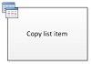|Это действие Visio — это то же, что действие **Копирование элемента списка** в SharePoint Designer 2013 и отображается как:   |**Копирование элемента списка**   Это действие используется для копирования элемента списка в другой список. Если в элементе списка документа, рабочий процесс также копирует документ в целевом списке.  **Важные:** Необходимо иметь хотя бы один столбец одинаковым в исходной и целевой списков.           |
||Это действие Visio — это то же, что действия **Создание элемента списка** в SharePoint Designer 2013 и отображается как:   |**Создание элемента списка**   Это действие используется для создания нового элемента списка в списке, который указан. Можно предоставить поля и значения в новый элемент.  Это действие можно использовать всякий раз, когда новый элемент должен быть создана на конкретные сведения.    **Примечание:** Выходной переменной — это идентификатор элемента, созданные в списке.           |
|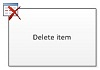|Это действие Visio — это то же, что действие **Удалить элемент** в SharePoint Designer 2013 и отображается как:   |**Удаление элемента**   Это действие используется для удаления элемента.    |
||Это действие Visio — это то же, что действия **Отменить проверьте масштабирование элемента** в SharePoint Designer 2013 и отображается как:   |**Отмена извлечения элемента**   Используйте это действие, если элемент извлечен, изменения были внесены в нее и отменить изменения и извлекать элемент обратно.    |
||Это действие Visio — это то же, что действие **Наследовать разрешения родительского элемента списка** в SharePoint Designer 2013 и отображается как:       **Примечание:** это действие доступно только в шаг олицетворения.           |**Наследование разрешений для элемента списка**   Если элемент имеет уникальные разрешения, это действие можно использовать для отображения элемента наследовать разрешения родительского из списка.    |
||Это действие Visio — это то же, что действие s **Удалить разрешения элемента списка** в SharePoint Designer 2013 и отображается как:        **Примечание:** это действие доступно только в шаг олицетворения.           |**Удаление разрешений для элемента списка**   Это действие удаляет разрешения из элемента для определенных пользователей.    |
||Это действие Visio — это то же, что действие **Заменить разрешения для элемента списка** в SharePoint Designer 2013 и отображается как:   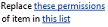    **Примечание:** это действие доступно только в шаг олицетворения.           |**Замена разрешений для элемента списка**   Разрешения для текущего элемента заменяет новые разрешения, заданные в действие.    |
||Это действие Visio — это то же, что действие **Задать состояние утверждения контента** в SharePoint Designer 2013 и отображается как:   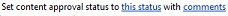    **Примечание:** утверждения контента должно быть включено в список для этого действия.|**Установка состояния утверждения контента**   При наличии утверждение контента включен в списке использовать это действие присвоено значение, например, Утверждено, то поле состояние утверждения контента отклонено, или ожидающие. Особое состояние можно ввести в действие.  **Примечание:** Действие **Задать состояние утверждения контента** работы на текущий элемент, который выполняется рабочий процесс, поэтому действие недоступен в рабочий процесс сайта.          |
||Это действие Visio — это то же, что действие **Задать поле в текущем элементе** в SharePoint Designer 2013 и отображается как:   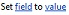|**Установка поля в текущем элементе**   Используйте действие, чтобы задать поле в текущем элементе значение.    **Примечание:** Если вы хотите приостановить рабочий процесс, пока не изменяется значение поля, используйте действие **ждать изменения поля в текущем элементе** .          Действие **Задать поле в текущем элементе** не должны использоваться в рабочий процесс сайта.   |
||Это действие Visio — это то же, что действие **Обновление элемента списка** в SharePoint Designer 2013 и отображается как:   |**Обновление элемента списка**   Используйте это действие для обновления элемента списка. В этих полях можно указать поля и новые значения.  |
||Это действие Visio — это то же, что действие **ждать изменения поля в текущем элементе** в SharePoint Designer 2013 и отображается как:   |**Ожидание изменения поля в текущем элементе**   Это действие приостанавливает рабочий процесс, пока поле в текущем элементе изменился на новое значение.    **Примечание:** Если вы хотите рабочего процесса, чтобы изменить значение поля, а не имеют ожидать в поле, чтобы изменить рабочий процесс, используйте действие **Задать поле в текущем элементе** .          |
   

### Действия с задачами

Действия в этой категории относятся к элементам задач. Эти действия применяются только к сайтам SharePoint под управлением SharePoint.
  
    
    

|**ДЕЙСТВИЕ ФИГУРЫ VISIO**|**СООТВЕТСТВУЮЩЕЕ ДЕЙСТВИЕ В SHAREPOINT DESIGNER**|**Описание**|
|:-----|:-----|:-----|
||Это действие Visio — это то же, что действие **назначить форму группе** в SharePoint Designer 2013 и отображается как:   |**Назначение формы группе**   Это действие используется для создания пользовательской формы задач с помощью настраиваемого поля.    Это действие можно использовать для назначения задачи одного или нескольких участников или группам, приглашений, для выполнения своих задач. Участники предоставляют их ответы ИТ поля настраиваемой задачи форм и завершении с задачей, нажмите кнопку **Завершить задачу** в форме.  |
||Это действие Visio — это то же, что действие **назначить задание** в SharePoint Designer 2013 и отображается как:   |**Назначение элемента списка дел**   Это действие используется для назначения задачи для каждого из участников, должен выполнять свои задачи, а затем, когда они выполняются, нажмите кнопку **Завершить задачу** на их формы задачи.   |
||Это действие Visio — это то же, что действие **Собирать данные от пользователя** в SharePoint Designer 2013 и отображается как:   |**Сбор данных от пользователя**   Это действие используется для назначения задачи участнику, должен предоставить необходимые сведения в форме пользовательских задач, а затем нажмите кнопку **Завершить задачу** в форме задачи.   Это действие имеет предложение output. Это означает, что рабочий процесс хранит сведения, возвращаемые действие в соответствующей переменной. Идентификатор элемента списка элемента выполненной задачи из действия хранится в переменной собирать.    |
|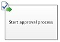|Это действие Visio — это то же, что действие **Запуск процесса утверждения** в SharePoint Designer 2013 и отображается как:   |**Установка процесса утверждения**   Используйте это действие для маршрутизации документов на утверждение. Утверждающие могут утвердить или отклонить документ, переназначение задачи утверждения или запрос изменения.  Можно назначать задачи для внутренних и внешних участников в действии. Внешний участник может быть сотрудник в вашей организации не будет пользователя в коллекции веб-сайтов или всем пользователям за пределами вашей организации.  |
|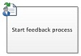|Это действие Visio же, как **Начать процесс сбора отзывов** действие в SharePoint Designer 2013 и отображается как:   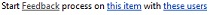|**Запуск процесса сбора отзывов**   С помощью этого действия можно назначать элементы задачи для обратной связи для пользователей в определенном порядке код последовательный или параллельный. Значение по умолчанию — параллельный. Пользователи или исполнители задачи можно также переназначить другим пользователям. После завершения пользователей они нажмите кнопку **Отправьте свои отзывы и предложения** , чтобы указать завершение задачи.   Можно назначать задачи для внутренних и внешних участников в действии. Внешний участник может быть сотрудник в вашей организации не будет пользователя в коллекции веб-сайтов или всем пользователям за пределами вашей организации.  |
|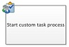|Это действие Visio — это то же, что действие **Начать настраиваемый рабочий процесс** в SharePoint Designer 2013 и отображается как:   |**Запуск настраиваемого процесса задач**   **Начать настраиваемый рабочий процесс** действие — это шаблон процесса утверждения, которые можно использовать другие действия утверждения не соответствуют требованиям.   |
   

### Действия с отношениями

Одно действие в этой категории ищет руководителя пользователя и сохраняет их в переменной. Это действие применяется только к сайтам SharePoint под управлением SharePoint.
  
    
    

|**ДЕЙСТВИЕ ФИГУРЫ VISIO**|**СООТВЕТСТВУЮЩЕЕ ДЕЙСТВИЕ В SHAREPOINT DESIGNER**|**Описание**|
|:-----|:-----|:-----|
||Это действие Visio — это то же, что действие **Найти руководителя для пользователя** в SharePoint Designer 2013 и отображается как:   |**Найти руководителя для пользователя**   Это действие используется для поиска руководителя пользователя. Значение вывода хранится в переменной.  **Примечание:** Для этого действия для правильной работы службы профилей пользователей должен работать под управлением в SharePoint.           |
   

### Действия с наборами документов

Некоторые действия рабочего процесса доступны только сопоставлен рабочий процесс для библиотеки документов, таких как Общие документы или типа контента документа.
  
    
    

|**ДЕЙСТВИЕ ФИГУРЫ VISIO**|**СООТВЕТСТВУЮЩЕЕ ДЕЙСТВИЕ В SHAREPOINT DESIGNER**|**Описание**|
|:-----|:-----|:-----|
||Это действие Visio — это то же, что действие **Начать процесс утверждения задать документа** в SharePoint Designer 2013 и отображается как:   |**Отправка утверждения для набора документов**   Используйте это действие, чтобы начать процесс утверждения для набора документов.    |
||Это действие Visio — это то же, что действие **Отправить набор документов в репозиторий** в SharePoint Designer 2013 и отображается как:   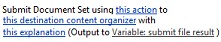|**Отправка набора документов в репозиторий**   Используйте это действие для перемещения или копирования набор документов в репозиторий документов. Репозиторий документов может быть библиотеки в сайт SharePoint или сайта на собственный как Центр документов, маршрутизации записей в определенное назначение на основе правил, которые можно определить.  |
||Это действие Visio — это то же, что действие **Отправить документ в репозиторий** в SharePoint Designer 2013 и отображается как:   |**Отправка документа в репозиторий**   Используйте это действие для перемещения или копирования документа в репозитории документов. Репозиторий документов может быть библиотеки в сайт SharePoint или сайта на собственный как Центр документов, маршрутизации записей в определенное назначение на основе правил, которые можно определить.  |
||Это действие Visio — это то же, что действие **Задать состояние утверждения контента для набора документов** в SharePoint Designer 2013 и отображается как:   |**Задать состояние утверждения контента для набора документов**   Используйте это действие для задания утверждения контента документа, **Утверждено**, **Отклонено** или **ожидающие**.    |
   

## Условия бизнес-процессов

Условие рабочего процесса — ветвления точка в рабочем процессе. Условие рабочего процесса сравнивает входные данные с заданным значением. Если они совпадают, рабочего процесса исходя из одного филиала; в противном случае следует других филиалов.
  
    
    

> **Важные:** Большая часть условие фигуры, которые можно вставить в рабочий процесс SharePoint в Visio требуется дополнительная настройка при импорте рабочего процесса в SharePoint Designer. В Visio не забудьте использовать функцию комментариев для каждой фигуры условие для указания критерии условия. 
  
    
    

### Общие условия

В этом разделе описываются условия, которые доступны в SharePoint Designer 2013 для списков и рабочих процессов для повторного использования списков, независимо от того, которые списком или типом контента рабочий процесс связан с.
  
    
    

|**ФИГУРА УСЛОВИЯ VISIO**|**СООТВЕТСТВУЮЩИЙ УСЛОВИЕ В SHAREPOINT DESIGNER**|**ОПИСАНИЕ УСЛОВИЯ**|
|:-----|:-----|:-----|
||Это условие Visio — это то же, что **Если любое значение равно указанному значению** условие в SharePoint Designer 2013 и отображается как:   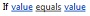|**Сравнение источника данных**   Это условие сравниваются два значения. Можно указать, следует ли значения равно или не равно.  |
||Это условие Visio — это то же, что **Если текущее поле элемента равно указанному значению** условие в SharePoint Designer 2013 и отображается как:   |**Сравнение поля документа**   Это условие проверяет поле со значением, который указан. Можно указать, следует ли значения равно или не равно.  |
||Это условие Visio — это то же, что **создано определенным человеком** условие в SharePoint Designer 2013 и отображается как:   |**Создано определенным человеком**   Это условие проверяет, если элемент был создан конкретным пользователем. Пользователь может указан как адрес электронной почты, например olivier@contoso.com, или выборе от пользователей SharePoint, Exchange и Active Directory.  **Примечание:** Адрес электронной почты и имя пользователя, с учетом регистра. Рекомендуется выбрать пользователя имя или адрес электронной почты для убедитесь, что используется правильный регистр. При вводе пользователем имя или адрес электронной почты, должен соответствовать регистру учетной записи. Например, если созданные contoso\\Алексей не будет оценивать значение true, если учетная запись пользователя является Contoso\\Алексей.           |
|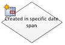|Это условие Visio совпадает с условие **охватывать создано в конкретный день** в SharePoint Designer 2013 и отображается как:   |**Создан в конкретном диапазоне дат**   Это условие проверяет, если был создан между заданными датами. Можно использовать текущую дату, определенную дату или подстановки.  |
||Это условие Visio — это то же, что условие **изменен конкретным пользователем** в SharePoint Designer 2013 и отображается как:   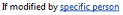|**Изменено определенным человеком**   Это условие используется для проверки, если изменения элемента, указанного пользователем. Пользователь может указан как адрес электронной почты, например olivier@contoso.com, или выборе от пользователей SharePoint, Exchange и Active Directory.  **Примечание:** Адрес электронной почты и имя пользователя, с учетом регистра. Рекомендуется выбрать пользователя имя или адрес электронной почты для убедитесь, что используется правильный регистр. При вводе пользователем имя или адрес электронной почты, должен соответствовать регистру учетной записи. Например, если изменено contoso\\Алексей не будет оценивать значение true, если учетная запись пользователя является Contoso\\Алексей.           |
||Это условие Visio совпадает с условие **охватывать изменено в конкретный день** в SharePoint Designer 2013 и отображается как:   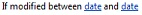|**Изменено в рамках определенного диапазона дат**   Это условие проверяет, если изменения элемента между заданными датами. Можно использовать текущую дату, определенную дату или подстановки.  |
|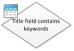|Это условие Visio — это то же, что условие **Название содержит ключевые слова** в SharePoint Designer 2013 и отображается как:   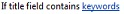|**Поле заголовка содержит ключевые слова**   Это условие проверяет, если поле **заголовка** элемента содержит конкретное слово. Ключевое слово можно указать в Построитель строк. Это может быть статическое значение или динамической строки или сочетание код или вставить подстановки для поля или переменной.   **Примечание:** Не удается найти более одного ключевого слова в условии **Название содержит ключевые слова** . Тем не менее, можно использовать логические операторы, такие как **||**(или) или **&amp;&amp;** (и.          |
   

### Условия набора документов

Некоторые условия бизнес-процессов доступны только сопоставлен рабочий процесс для библиотеки документов, таких как Общие документы или типа контента документа.
  
    
    

|**ФИГУРА УСЛОВИЯ VISIO**|**СООТВЕТСТВУЮЩИЙ УСЛОВИЕ В SHAREPOINT DESIGNER**|**ОПИСАНИЕ УСЛОВИЯ**|
|:-----|:-----|:-----|
||Это условие Visio — это то же, что **размер файла в конкретном диапазоне Кбайт** условие в SharePoint Designer 2013 и отображается как:   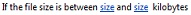|**Размер файла находится в определенном диапазоне**   Это условие проверяет, если размер файла документа находится в пределах указанного размера, в килобайтах. Условие не включает указанного размера в расчет. Можно ввести номер или использовать подстановки для первого или второго размера в условии.  |
|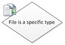|Это условие Visio — это то же, что **файл имеет конкретный тип** условия в SharePoint Designer 2013 и отображается как:   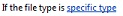|**Файл имеет определенный тип**   Это условие проверяет, является ли тип файла текущего элемента указанного типа, например, docx. Можно ввести тип файла в виде строки или использовать подстановки.  |
   

### Список условий

  
    
    

|**ФИГУРА УСЛОВИЯ VISIO**|**СООТВЕТСТВУЮЩИЙ УСЛОВИЕ В SHAREPOINT DESIGNER**|**ОПИСАНИЕ УСЛОВИЯ**|
|:-----|:-----|:-----|
||Это условие Visio — это то же, что условие **Проверить уровни разрешений для элемента списка** в SharePoint Designer 2013 и отображается как:   |**Проверка явных разрешений пользователя**   Это условие проверяет, что указанный пользователь обладает уровнем минимальные необходимые разрешения.    |
|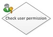|Это условие Visio — это то же, что условие **проверять разрешения для элемента списка** в SharePoint Designer 2013 и отображается как:   |**Проверка разрешений пользователя**   Это условие проверяет наличие минимальные разрешения, необходимые для указанного пользователя.    |
   

## Знаки завершения рабочего процесса

В Visio каждый рабочий процесс должен начинаться с конца Start () и заканчиваться с конца Stop (). Можно использовать только один из каждого типа терминатор для заданного рабочего процесса. Признаки конца необходимы для создания рабочих процессов SharePoint в Visio, чтобы рабочий процесс может пройти проверку и можно экспортировать. Знаки завершения рабочего процесса в SharePoint Designer не используются.
  
    
    

## Дополнительные ресурсы

-  [Что нового в рабочих процессах для SharePoint](what-s-new-in-workflows-for-sharepoint.md)
    
  
-  [Общие сведения о рабочих процессах в SharePoint](get-started-with-workflows-in-sharepoint.md)
    
  
-  [Разработка рабочих процессов в SharePoint Designer и Visio](workflow-development-in-sharepoint-designer-and-visio.md)
    
  

  
    
    
