# Фигур Visio в SharePoint Designer 2013: краткий справочник (платформа рабочих процессов SharePoint 2010)Visio shapes in SharePoint Designer 2013: A quick reference guide (SharePoint 2010 Workflow platform)
Можно создать рабочий процесс в Microsoft Visio профессиональный 2013 и экспортировать его в Microsoft SharePoint Designer 2013. В этом руководстве идентифицирует фигур Visio, используемые для создания рабочего процесса.Используйте эту статью ссылку только в том случае, если пользователь работает в SharePoint Designer 2013, но продолжить использование платформы рабочих процессов SharePoint 2010.Фигуры для платформы рабочих процессов SharePoint 2010 поступают в трех наборы элементов: **действия - рабочего процесса SharePoint 2010**, **условия - рабочего процесса SharePoint 2010** и **конца - рабочего процесса SharePoint 2010**.You can create a workflow in Microsoft Visio Professional 2013 and then export it to Microsoft SharePoint Designer 2013. This guide identifies the Visio shapes that you use to create your workflow.Use this reference article only if you are working in SharePoint Designer 2013 but want to continue to use the SharePoint 2010 Workflow Platform.The shapes for the SharePoint 2010 Workflow Platform come in three stencils: **Actions - SharePoint 2010 Workflow**, **Conditions - SharePoint 2010 Workflow**, and **Terminators - SharePoint 2010 Workflow**.
## Действия рабочего процессаWorkflow actions

Действия рабочего процесса, определенных операций выполняет этого рабочего процесса. Каждый рабочий процесс должен содержать по крайней мере одно действие.Workflow actions are specific operations that workflow performs. Every workflow must contain at least one action.
  
    
    
Действия в этом списке организованы в категории на основании их области приложения в рабочем процессе. Например действия, которые влияют на поведение элемента списка собраны в разделе **Действия со списком** и действия, связанные с наборы документов собраны в разделе **Настройка действия с документами**. Категории для действий являются:The actions in this list are organized in categories based on their area of application in a workflow. For example, actions that affect the behavior of a list item are grouped under **List Actions**, and actions related to document sets are grouped under **Document Set Actions**. The categories for actions are:
  
    
    

-  [Основные действия](visio-shapes-in-sharepoint-designer-a-quick-reference-guide-sharepoint-2010.md#section1a) Это наиболее часто используемые действия в рабочий процесс.[Core actions](visio-shapes-in-sharepoint-designer-a-quick-reference-guide-sharepoint-2010.md#section1a) These are the most commonly used actions in a workflow.
    
  
-  [Действия с наборами документов](visio-shapes-in-sharepoint-designer-a-quick-reference-guide-sharepoint-2010.md#section1e) Как правило в рабочих процессов, связанных с библиотекой документов или типа контента документа используются следующие действия.[Document set actions](visio-shapes-in-sharepoint-designer-a-quick-reference-guide-sharepoint-2010.md#section1e) Typically, these actions are used in workflows that are associated with a document library or the document content type.
    
  
-  [Действия со списками](visio-shapes-in-sharepoint-designer-a-quick-reference-guide-sharepoint-2010.md#section1b) Операции для элементов списка выполнить следующие действия.[List actions](visio-shapes-in-sharepoint-designer-a-quick-reference-guide-sharepoint-2010.md#section1b) These actions perform operations on list items.
    
  
-  [Действия с отношениями](visio-shapes-in-sharepoint-designer-a-quick-reference-guide-sharepoint-2010.md#section1d) Одно действие в этой категории ищет руководителя пользователя и сохраняет их в переменной.[Relational actions](visio-shapes-in-sharepoint-designer-a-quick-reference-guide-sharepoint-2010.md#section1d) The single action in this category looks up a user's manager and stores that information in a variable.
    
  
-  [Действия с задачами](visio-shapes-in-sharepoint-designer-a-quick-reference-guide-sharepoint-2010.md#section1c) Эти действия связаны с формы операций, свои отзывы и предложения и утверждения.[Task actions](visio-shapes-in-sharepoint-designer-a-quick-reference-guide-sharepoint-2010.md#section1c) These actions are associated with approval, feedback, and form operations.
    
  

> **Важные:** Большая часть фигуры действия, которые можно вставить в рабочий процесс SharePoint в Visio требуется дополнительная настройка при импорте рабочего процесса в SharePoint Designer.**Important:** Most of the action shapes that you can insert into a SharePoint workflow in Visio require additional configuration when the workflow is imported into SharePoint Designer. В Visio не забудьте использовать функцию комментариев для каждой фигуры действие для указания параметров или конфигурации действия.In Visio, remember to use the comments feature of each action shape to specify the settings or configuration of the action. 
  
    
    

### Основные действияCore actions

Эти действия наиболее часто используемые и могут использоваться в любой тип рабочего процесса или шаг.These are the most commonly-used actions and can be used in any type of workflow or step.

|**Действие фигуры Visio****Visio Action Shape**|**Соответствующее действие в SharePoint Designer****Corresponding action in SharePoint Designer**|**Описание****Action description**|
|:-----|:-----|:-----|
||Это действие Visio — это то же, что действие **Добавить комментарий** в SharePoint Designer 2013 и отображается как:This Visio action is the same as the **Add a Comment** action in SharePoint Designer 2013 and appears as:   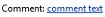     **Примечание:** Комментарии остаются видимыми, когда рабочий процесс экспортируется в Visio.**Note:** Comments remain visible when the workflow is exported to Visio.           |**Добавление комментария****Add a comment**   Используйте это действие для оставлять комментарии информативных данных в конструкторе рабочих процессов для справочных целей. Это особенно удобно в тех случаях, когда других пользователей, совместное редактирование рабочего процесса. Например если переменная в текущем рабочего процесса не имеет понятное имя, используйте это действие для добавления комментария, чтобы указать, что означает эта переменная в рабочем процессе.Use this action to leave informative comments in the workflow designer for reference purposes. This is especially helpful when there are other users co-authoring the workflow. For example, if a variable in the current workflow doesn't have a user-friendly name, you use this action to add a comment to indicate what the variable does in the workflow.    |
||Это действие Visio же, как **Добавить время к дате** действие в SharePoint Designer 2013 и отображается как:This Visio action is the same as the **Add Time to Date** action in SharePoint Designer 2013 and appears as:   |**Добавление времени к дате****Add time to date**   Используйте это действие для добавления определенное время в минутах, часов, дней, месяцев или лет к дате и сохранить значение выходные данные в качестве переменной. Дата может быть текущую дату, определенную дату или подстановки.Use this action to add a specific time in minutes, hours, days, months, or years to a date, and store the output value as a variable. The date can be a current date, specific date, or a lookup.    |
||Это действие Visio — это то же, что действие **Выполните вычислений** в SharePoint Designer 2013 и отображается как:This Visio action is the same as the **Do Calculation** action in SharePoint Designer 2013 and appears as:   |**Выполнение расчета****Do calculation**   Используйте это действие для выполнения вычислений, таких как добавление, вычитания, умножения и деления двух значений и выходных данных значение сохраняется в переменной.Use this action to perform a calculation, such as add, subtract, multiply, or divide two values, and stores the output value in a variable.    |
||Это действие Visio — это то же, что действие **журнала в журнал** в SharePoint Designer 2013 и отображается как:This Visio action is the same as the **Log to History List** action in SharePoint Designer 2013 and appears as:   |**Запись в журнал****Log to history list**   Это действие используется для записи в журнал сообщение о рабочем процессе в свой список журнала. Сообщение может быть Сводка событий рабочего процесса или что-либо значительные о рабочем процессе. Списке журнала рабочего процесса могут быть полезны для устранения проблем с рабочим процессом.Use this action to log a message about the workflow into its history list. A message can be a summary of a workflow event, or anything significant about the workflow. The workflow history list can be helpful in troubleshooting issues with the workflow.    |
|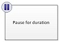|Это действие Visio совпадает с **паузу в течение** действие в SharePoint Designer 2013 и отображается как:This Visio action is the same as the **Pause for Duration** action in SharePoint Designer 2013 and appears as:   |**Приостановка в течение определенного периода****Pause for duration**   Используйте это действие для приостановки рабочего процесса в течение определенного периода времени в несколько дней, часов и минут.Use this action to pause the workflow for a specific duration in days, hours, or minutes.    **Примечание:** Задержка — это влияют интервал задания таймера, который имеет значение по умолчанию 5 минут.**Note:** The delay time is effected by the timer job interval, which has a default value of five minutes.           |
||Это действие Visio — это то же, что действие **Паузу до даты** в SharePoint Designer 2013 и отображается как:This Visio action is the same as the **Pause Until Date** action in SharePoint Designer 2013 and appears as:   |**Приостановка до даты****Pause until date**   Используйте это действие для приостановить рабочий процесс до определенной даты. Можно добавить текущую дату, определенную дату или подстановки.Use this action to pause the workflow until a particular date. You can add a current date, a specific date, or a lookup.    |
||Это действие Visio — это то же, что действие **Задать часть из времени поля даты и времени** в SharePoint Designer 2013 и отображается как:This Visio action is the same as the **Set Time Portion of Date/Time Field** action in SharePoint Designer 2013 and appears as:   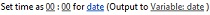|**Задать время для поля даты и времени****Set time portion of date/time field**   Используйте это действие для создания временной метки и значение выходных данных хранилища в переменной. Можно задания времени в часы, минуты и добавить текущую дату, определенную дату или подстановки.Use this action to create a timestamp, and stores the output value in a variable. You can set the time in hours and minutes and add a current date, specific date or a lookup.    |
|| Это действие Visio — это то же, что действие **Задать состояние рабочего процесса** в SharePoint Designer 2013 и отображается как:This Visio action is the same as the **Set Workflow Status** action in SharePoint Designer 2013 and appears as:   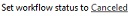Невозможно переименование или удаление значение состояния после его создания. Тем не менее нет необходимости использовать его.  You cannot rename or delete a status value once it has been created. However, you do not have to use it.    Пользовательское состояние применимо только к текущему рабочему процессу, и его невозможно использовать в другом рабочем процессе.A custom status is applicable to the current workflow only, and cannot be used in another workflow    Рабочий процесс не может использовать пользовательские значения состояния, которые определены в действии, если действие используется в шаге олицетворения.A workflow cannot use custom status values that you define in the action if the action is used inside an impersonation step.   |**Установка состояния рабочего процесса****Set workflow status**   Используйте это действие для задания состояния рабочего процесса. Значения по умолчанию — **отменено**, **Утверждено** и **Отклонено**. Use this action to set the status of the workflow. The default options are **Canceled**, **Approved**, and **Rejected**.    Можно ввести новое значение состояние в раскрывающемся списке в действии. После ввода значение состояния запись автоматически добавляется в раскрывающемся списке.You can enter a new status value in the dropdown in the action. Once you enter a status value, the entry is automatically added to the dropdown list.    Если действие **Задать состояние рабочего процесса** на последнем этапе рабочего процесса также применения пользовательское значение, видно ваше пользовательское значение в столбце **состояние** в списке при Приостановка рабочего процесса и уведомление.If the **Set Workflow Status** action is the last step in your workflow where you have also used a custom value, you can see your custom value in the **Status** column in the list upon workflow pausing or completion.   |
||Это действие Visio — это то же, что действие **Задать переменную рабочего процесса** в SharePoint Designer 2013 и отображается как:This Visio action is the same as the **Set Workflow Variable** action in SharePoint Designer 2013 and appears as:   |**Установка переменной рабочего процесса****Set workflow variable**   Используйте это действие для присвоено значение переменной рабочего процесса. Используйте это действие рабочего процесса, чтобы присвоить переменной данных.Use this action to set a workflow variable to a value. Use this action when you want the workflow to assign data to a variable.    |
|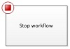|Это действие Visio — это то же, что действие **остановка рабочего процесса** в SharePoint Designer 2013 и отображается как:This Visio action is the same as the **Stop workflow** action in SharePoint Designer 2013 and appears as:   |**Остановка рабочего процесса****Stop workflow**   Используйте это действие для остановки текущего экземпляра рабочего процесса и войдите сообщение в списке **Журнала рабочего процесса**. Сообщение, указанные в действие будет отображаться в столбце **Описание** в журнал рабочего процесса после завершения рабочего процесса. Use this action to stop the current instance of the workflow and log a message to the **Workflow History** list. The message that you specify in the action will appear in the **Description** column in the Workflow History upon workflow completion.   |
   

### Действия со спискамиList actions

Эти действия используются для элементов списка.These actions are used on list items.
  
    
    

|**ДЕЙСТВИЕ ФИГУРЫ VISIO****VISIO ACTION SHAPE**|**СООТВЕТСТВУЮЩЕЕ ДЕЙСТВИЕ В SHAREPOINT DESIGNER****CORRESPONDING ACTION IN SHAREPOINT DESIGNER**|**Описание****ACTION DESCRIPTION**|
|:-----|:-----|:-----|
||Это действие Visio — это то же, что действие **Добавить разрешения для элемента списка** в SharePoint Designer 2013 и отображается как:This Visio action is the same as the **Add List Item Permissions** action in SharePoint Designer 2013 and appears as:   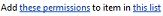    **Примечание:** это действие доступно только в пределах шаг олицетворения.    **Note:** This action is only available within an impersonation step.           |**Добавление разрешений для элемента списка****Add list item permissions**   Это действие предоставляет права отдельные уровни разрешений для элемента к определенным пользователям.This action grants specific permission levels for an item to specific users.    |
|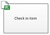|Это действие Visio совпадает с действия **Проверки в элемента** в SharePoint Designer 2013 и отображается как:This Visio action is the same as the **Check In Item** action in SharePoint Designer 2013 and appears as:   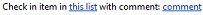|**Возвращение элемента****Check in item**   Это действие проверяет в элементе, который выдается.This action checks in an item that is checked out.    **Примечание:** Можно указать только в элементы из библиотеки документов.**Note:** You can only check in items from a document library.           |
||Это действие Visio совпадает с действия **Проверьте масштабирование элемента** в SharePoint Designer 2013 и отображается как:This Visio action is the same as the **Check Out Item** action in SharePoint Designer 2013 and appears as:   |**Извлечение элемента****Check out item**   Это действие используется для извлечения элемента. Рабочий процесс проверяет, если элемент в базу данных, перед его извлекает документ.Use this action to check out an item. The workflow verifies if the item is checked in, before it checks out a document.    **Примечание:** Можно указать только элементов из библиотеки на вашем сайте.**Note:** You can only check out items from a library in your site.           |
||Это действие Visio — это то же, что действие **Копирование элемента списка** в SharePoint Designer 2013 и отображается как:This Visio action is the same as the **Copy List Item** action in SharePoint Designer 2013 and appears as:   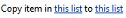|**Копирование элемента списка****Copy list item**   Это действие используется для копирования элемента списка в другой список. Если в элементе списка документа, рабочий процесс также копирует документ в целевом списке.Use this action to copy a list item to another list. If there is a document in the list item, the workflow also copies the document to the destination list.    **Важные:** Необходимо иметь хотя бы один столбец одинаковым в исходной и целевой списков.**Important:** You must have at least one column similar in both the source and destination lists.           |
||Это действие Visio — это то же, что действия **Создание элемента списка** в SharePoint Designer 2013 и отображается как:This Visio action is the same as the **Create List Item** action in SharePoint Designer 2013 and appears as:   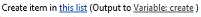|**Создание элемента списка****Create list item**   Это действие используется для создания нового элемента списка в списке, который указан. Можно предоставить поля и значения в новый элемент.Use this action to create a new list item in the list that you specify. You can supply the fields and values in the new item.    Это действие можно использовать всякий раз, когда новый элемент должен быть создана на конкретные сведения.You can use this action whenever you want a new item to be created with specific information.    **Примечание:** Выходной переменной — это идентификатор элемента, созданные в списке.**Note:** The output variable is the ID of the item created in the list.           |
||Это действие Visio — это то же, что действие **Удалить элемент** в SharePoint Designer 2013 и отображается как:This Visio action is the same as the **Delete Item** action in SharePoint Designer 2013 and appears as:   |**Удаление элемента****Delete item**   Это действие используется для удаления элемента.Use this action to delete an item.    |
|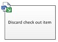|Это действие Visio — это то же, что действия **Отменить проверьте масштабирование элемента** в SharePoint Designer 2013 и отображается как:This Visio action is the same as the **Discard Check Out Item** action in SharePoint Designer 2013 and appears as:   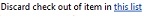|**Отмена извлечения элемента****Discard check out item**   Используйте это действие, если элемент извлечен, изменения были внесены в нее и отменить изменения и извлекать элемент обратно.Use this action if an item is checked out, changes have been made to it, and you want to discard the changes and check the item back in.    |
|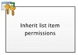|Это действие Visio — это то же, что действие **Наследовать разрешения родительского элемента списка** в SharePoint Designer 2013 и отображается как:This Visio action is the same as the **Inherit List Item Parent Permissions** action in SharePoint Designer 2013 and appears as:       **Примечание:** это действие доступно только в шаг олицетворения.    **Note:** This action is only available in an impersonation step.           |**Наследование разрешений для элемента списка****Inherit list item permissions**   Если элемент имеет уникальные разрешения, это действие можно использовать для отображения элемента наследовать разрешения родительского из списка.If your item has unique permissions, you can use this action to make the item inherit the parent permissions from the list.    |
||Это действие Visio — это то же, что действие s **Удалить разрешения элемента списка** в SharePoint Designer 2013 и отображается как:This Visio action is the same as the **Remove List Item Permission**s action in SharePoint Designer 2013 and appears as:        **Примечание:** это действие доступно только в шаг олицетворения.    **Note:** This action is only available in an impersonation step.           |**Удаление разрешений для элемента списка****Remove list item permissions**   Это действие удаляет разрешения из элемента для определенных пользователей.This action removes permissions from an item for specific users.    |
||Это действие Visio — это то же, что действие **Заменить разрешения для элемента списка** в SharePoint Designer 2013 и отображается как:This Visio action is the same as the **Replace List Item Permissions** action in SharePoint Designer 2013 and appears as:       **Примечание:** это действие доступно только в шаг олицетворения.    **Note:** This action is only available in an impersonation step.           |**Замена разрешений для элемента списка****Replace list item permissions**   Разрешения для текущего элемента заменяет новые разрешения, заданные в действие.It replaces an item's current permissions with the new permissions that you specify in the action.    |
||Это действие Visio — это то же, что действие **Задать состояние утверждения контента** в SharePoint Designer 2013 и отображается как:This Visio action is the same as the **Set Content Approval Status** action in SharePoint Designer 2013 and appears as:       **Примечание:** утверждения контента должно быть включено в список для этого действия.    **Note:** Content approval must be enabled in the list in order to use this action.|**Установка состояния утверждения контента****Set content approval status**   При наличии утверждение контента включен в списке использовать это действие присвоено значение, например, Утверждено, то поле состояние утверждения контента отклонено, или ожидающие. Особое состояние можно ввести в действие.If you have content approval enabled in your list, use this action to set the content approval status field to a value such as Approved, Rejected, or Pending. You can type a custom status in the action.    **Примечание:** Действие **Задать состояние утверждения контента** работы на текущий элемент, который выполняется рабочий процесс, поэтому действие недоступен в рабочий процесс сайта.**Note:** The **Set Content Approval Status** action works on the current item that the workflow is acting upon, therefore the action is not available in a site workflow.          |
||Это действие Visio — это то же, что действие **Задать поле в текущем элементе** в SharePoint Designer 2013 и отображается как:This Visio action is the same as the **Set Field in Current Item** action in SharePoint Designer 2013 and appears as:   |**Установка поля в текущем элементе****Set field in current item**   Используйте действие, чтобы задать поле в текущем элементе значение.Use the action to set a field in the current item to a value.    **Примечание:** Если вы хотите приостановить рабочий процесс, пока не изменяется значение поля, используйте действие **ждать изменения поля в текущем элементе** .**Note:** If you want to pause the workflow until it changes the value of the field, use the **Wait for Field Change in Current Item** action instead.          Действие **Задать поле в текущем элементе** не должны использоваться в рабочий процесс сайта.The **Set Field in Current Item** action should not be used in a site workflow.   |
|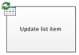|Это действие Visio — это то же, что действие **Обновление элемента списка** в SharePoint Designer 2013 и отображается как:This Visio action is the same as the **Update List Item** action in SharePoint Designer 2013 and appears as:   |**Обновление элемента списка****Update list item**   Используйте это действие для обновления элемента списка. В этих полях можно указать поля и новые значения.Use this action to update a list item. You can specify the fields and the new values in those fields.    |
||Это действие Visio — это то же, что действие **ждать изменения поля в текущем элементе** в SharePoint Designer 2013 и отображается как:This Visio action is the same as the **Wait for Field Change in Current Item** action in SharePoint Designer 2013 and appears as:   |**Ожидание изменения поля в текущем элементе****Wait for field change in current item**   Это действие приостанавливает рабочий процесс, пока поле в текущем элементе изменился на новое значение.This action pauses the workflow until the field in the current item has changed to a new value.    **Примечание:** Если вы хотите рабочего процесса, чтобы изменить значение поля, а не имеют ожидать в поле, чтобы изменить рабочий процесс, используйте действие **Задать поле в текущем элементе** .**Note:** If you want the workflow to change the value of the field, rather than have the workflow wait for the field to change, use the **Set Field in Current Item** action instead.          |
   

### Действия с задачамиTask actions

Действия в этой категории относятся к элементам задач.Actions in this category pertain to task items. Эти действия применяются только к сайтам SharePoint под управлением SharePoint.These actions apply only to SharePoint sites running SharePoint.
  
    
    

|**ДЕЙСТВИЕ ФИГУРЫ VISIO****VISIO ACTION SHAPE**|**СООТВЕТСТВУЮЩЕЕ ДЕЙСТВИЕ В SHAREPOINT DESIGNER****CORRESPONDING ACTION IN SHAREPOINT DESIGNER**|**Описание****ACTION DESCRIPTION**|
|:-----|:-----|:-----|
|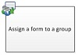|Это действие Visio — это то же, что действие **назначить форму группе** в SharePoint Designer 2013 и отображается как:This Visio action is the same as the **Assign a Form to a Group** action in SharePoint Designer 2013 and appears as:   |**Назначение формы группе****Assign a form to a group**   Это действие используется для создания пользовательской формы задач с помощью настраиваемого поля.Use this action to enable you to create a custom task form with customized fields.    Это действие можно использовать для назначения задачи одного или нескольких участников или группам, приглашений, для выполнения своих задач. Участники предоставляют их ответы ИТ поля настраиваемой задачи форм и завершении с задачей, нажмите кнопку **Завершить задачу** в форме.You can use this action to assign a task to one or more participants or groups prompting them to perform their tasks. Participants provide their responses it the fields of the custom task form and, when they are done with the task, click **Complete Task** on the form.   |
|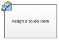|Это действие Visio — это то же, что действие **назначить задание** в SharePoint Designer 2013 и отображается как:This Visio action is the same as the **Assign a To-do Item** action in SharePoint Designer 2013 and appears as:   |**Назначение элемента списка дел****Assign a to-do item**   Это действие используется для назначения задачи для каждого из участников, должен выполнять свои задачи, а затем, когда они выполняются, нажмите кнопку **Завершить задачу** на их формы задачи.Use this action to assign a task to each of the participants, prompting them to perform their tasks and then, when they are done, to click the **Complete Task** button on their task form.   |
|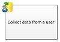|Это действие Visio — это то же, что действие **Собирать данные от пользователя** в SharePoint Designer 2013 и отображается как:This Visio action is the same as the **Collect Data from a User** action in SharePoint Designer 2013 and appears as:   |**Сбор данных от пользователя****Collect data from a user**   Это действие используется для назначения задачи участнику, должен предоставить необходимые сведения в форме пользовательских задач, а затем нажмите кнопку **Завершить задачу** в форме задачи.Use this action to assign a task to the participant, prompting them to provide the needed information in a custom task form, and then click the **Complete Task** button on the task form.   Это действие имеет предложение output.This action has an output clause??? Это означает, что рабочий процесс хранит сведения, возвращаемые действие в соответствующей переменной.meaning, the workflow stores the information returned by the action in a corresponding variable. Идентификатор элемента списка элемента выполненной задачи из действия хранится в переменной собирать.The list item ID of the completed task item from the action is stored in the collect variable.    |
||Это действие Visio — это то же, что действие **Запуск процесса утверждения** в SharePoint Designer 2013 и отображается как:This Visio action is the same as the **Start Approval Process** action in SharePoint Designer 2013 and appears as:   |**Установка процесса утверждения****Start approval process**   Используйте это действие для маршрутизации документов на утверждение. Утверждающие могут утвердить или отклонить документ, переназначение задачи утверждения или запрос изменения.Use this action to route a document for approval. Approvers can approve or reject the document, reassign the approval task, or request changes.    Можно назначать задачи для внутренних и внешних участников в действии. Внешний участник может быть сотрудник в вашей организации не будет пользователя в коллекции веб-сайтов или всем пользователям за пределами вашей организации.You can assign tasks to both internal and external participants in the action. An external participant can be an employee in your organization who isn't a user in the site collection, or anyone outside your organization.    |
||Это действие Visio же, как **Начать процесс сбора отзывов** действие в SharePoint Designer 2013 и отображается как:This Visio action is the same as the **Start Feedback Process** action in SharePoint Designer 2013 and appears as:   |**Запуск процесса сбора отзывов****Start feedback process**   С помощью этого действия можно назначать элементы задачи для обратной связи для пользователей в определенном порядке код последовательный или параллельный.Use this action to assign task items for feedback to users in a specific order???serial or parallel. Значение по умолчанию — параллельный.The default is parallel. Пользователи или исполнители задачи можно также переназначить другим пользователям.Users or task participants can also reassign a task to other users. После завершения пользователей они нажмите кнопку **Отправьте свои отзывы и предложения** , чтобы указать завершение задачи.When the users are done, they can click the **Submit Feedback** button to indicate task completion.   Можно назначать задачи для внутренних и внешних участников в действии. Внешний участник может быть сотрудник в вашей организации не будет пользователя в коллекции веб-сайтов или всем пользователям за пределами вашей организации.You can assign tasks to both internal and external participants in the action. An external participant can be an employee in your organization who isn't a user in the site collection, or anyone outside your organization.    |
||Это действие Visio — это то же, что действие **Начать настраиваемый рабочий процесс** в SharePoint Designer 2013 и отображается как:This Visio action is the same as the **Start Custom Task Process** action in SharePoint Designer 2013 and appears as:   |**Запуск настраиваемого процесса задач****Start custom task process**   **Начать настраиваемый рабочий процесс** действие — это шаблон процесса утверждения, которые можно использовать другие действия утверждения не соответствуют требованиям.The **Start Custom Task Process** action is an approval process template that you can use if other approval actions do not meet your needs.   |
   

### Действия с отношениямиRelational actions

Одно действие в этой категории ищет руководителя пользователя и сохраняет их в переменной.The single action in this category looks up a user's manager and stores that information in a variable. Это действие применяется только к сайтам SharePoint под управлением SharePoint.This action applies only to SharePoint sites running SharePoint.
  
    
    

|**ДЕЙСТВИЕ ФИГУРЫ VISIO****VISIO ACTION SHAPE**|**СООТВЕТСТВУЮЩЕЕ ДЕЙСТВИЕ В SHAREPOINT DESIGNER****CORRESPONDING ACTION IN SHAREPOINT DESIGNER**|**Описание****ACTION DESCRIPTION**|
|:-----|:-----|:-----|
||Это действие Visio — это то же, что действие **Найти руководителя для пользователя** в SharePoint Designer 2013 и отображается как:This Visio action is the same as the **Lookup Manager of a User** action in SharePoint Designer 2013 and appears as:   |**Найти руководителя для пользователя****Lookup manager of a user**   Это действие используется для поиска руководителя пользователя. Значение вывода хранится в переменной.Use this action to look up a user's manager. The output value is then stored in a variable.    **Примечание:** Для этого действия для правильной работы службы профилей пользователей должен работать под управлением в SharePoint.**Note:** For this action to work properly, the User Profile service must be running in SharePoint.           |
   

### Действия с наборами документовDocument set actions

Некоторые действия рабочего процесса доступны только сопоставлен рабочий процесс для библиотеки документов, таких как Общие документы или типа контента документа.Some workflow actions are only available when the workflow is associated to a document library, such as Shared Documents, or to the Document content type.
  
    
    

|**ДЕЙСТВИЕ ФИГУРЫ VISIO****VISIO ACTION SHAPE**|**СООТВЕТСТВУЮЩЕЕ ДЕЙСТВИЕ В SHAREPOINT DESIGNER****CORRESPONDING ACTION IN SHAREPOINT DESIGNER**|**Описание****ACTION DESCRIPTION**|
|:-----|:-----|:-----|
||Это действие Visio — это то же, что действие **Начать процесс утверждения задать документа** в SharePoint Designer 2013 и отображается как:This Visio action is the same as the **Start Document Set Approval Process** action in SharePoint Designer 2013 and appears as:   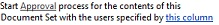|**Отправка утверждения для набора документов****Send approval for document set**   Используйте это действие, чтобы начать процесс утверждения для набора документов.Use this action to begin the approval process for a document set.    |
||Это действие Visio — это то же, что действие **Отправить набор документов в репозиторий** в SharePoint Designer 2013 и отображается как:This Visio action is the same as the **Send Document Set to Repository** action in SharePoint Designer 2013 and appears as:   |**Отправка набора документов в репозиторий****Send document set to repository**   Используйте это действие для перемещения или копирования набор документов в репозиторий документов. Репозиторий документов может быть библиотеки в сайт SharePoint или сайта на собственный как Центр документов, маршрутизации записей в определенное назначение на основе правил, которые можно определить.Use this action to allow you to move or copy the document set to a document repository. A document repository can be a library in your SharePoint site, or a site on its own like the Document Center, that routes records to a specific destination based on rules that you define.    |
||Это действие Visio — это то же, что действие **Отправить документ в репозиторий** в SharePoint Designer 2013 и отображается как:This Visio action is the same as the **Send Document to Repository** action in SharePoint Designer 2013 and appears as:   |**Отправка документа в репозиторий****Send document to repository**   Используйте это действие для перемещения или копирования документа в репозитории документов. Репозиторий документов может быть библиотеки в сайт SharePoint или сайта на собственный как Центр документов, маршрутизации записей в определенное назначение на основе правил, которые можно определить.Use this action to allow you to move or copy a document to a document repository. A document repository can be a library in your SharePoint site, or a site on its own like the Document Center, that routes records to a specific destination based on rules that you define.    |
||Это действие Visio — это то же, что действие **Задать состояние утверждения контента для набора документов** в SharePoint Designer 2013 и отображается как:This Visio action is the same as the **Set Content Approval Status for the Document Set** action in SharePoint Designer 2013 and appears as:   |**Задать состояние утверждения контента для набора документов****Set content approval status for the document set**   Используйте это действие для задания утверждения контента документа, **Утверждено**, **Отклонено** или **ожидающие**.Use this action to set content approval of a document set to **Approved**, **Rejected**, or **Pending**.    |
   

## Условия бизнес-процессовWorkflow conditions

Условие рабочего процесса — ветвления точка в рабочем процессе. Условие рабочего процесса сравнивает входные данные с заданным значением. Если они совпадают, рабочего процесса исходя из одного филиала; в противном случае следует других филиалов.A workflow condition is a branching point in the workflow. The workflow condition compares the input to a specified value. If they match, the workflow follows one branch; if not, it follows the other branch.
  
    
    

> **Важные:** Большая часть условие фигуры, которые можно вставить в рабочий процесс SharePoint в Visio требуется дополнительная настройка при импорте рабочего процесса в SharePoint Designer.**Important:** Most of the condition shapes that you can insert into a SharePoint workflow in Visio require additional configuration when the workflow is imported into SharePoint Designer. В Visio не забудьте использовать функцию комментариев для каждой фигуры условие для указания критерии условия.In Visio, remember to use the comments feature of each condition shape to specify the decision criteria of the condition. 
  
    
    

### Общие условияGeneral conditions

В этом разделе описываются условия, которые доступны в SharePoint Designer 2013 для списков и рабочих процессов для повторного использования списков, независимо от того, которые списком или типом контента рабочий процесс связан с.This section describes the conditions that are available in SharePoint Designer 2013for list and reusable list workflows, no matter which list or content type the workflow is associated with.
  
    
    

|**ФИГУРА УСЛОВИЯ VISIO****VISIO CONDITION SHAPE**|**СООТВЕТСТВУЮЩИЙ УСЛОВИЕ В SHAREPOINT DESIGNER****CORRESPONDING CONDITION IN SHAREPOINT DESIGNER**|**ОПИСАНИЕ УСЛОВИЯ****CONDITION DESCRIPTION**|
|:-----|:-----|:-----|
|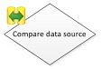|Это условие Visio — это то же, что **Если любое значение равно указанному значению** условие в SharePoint Designer 2013 и отображается как:This Visio condition is the same as the **If any value equals value** condition in SharePoint Designer 2013 and appears as:   |**Сравнение источника данных****Compare data source**   Это условие сравниваются два значения. Можно указать, следует ли значения равно или не равно.This condition compares two values. You can specify whether the values should be equal or not equal.    |
||Это условие Visio — это то же, что **Если текущее поле элемента равно указанному значению** условие в SharePoint Designer 2013 и отображается как:This Visio condition is the same as the **If current item field equals value** condition in SharePoint Designer 2013 and appears as:   |**Сравнение поля документа****Compare document field**   Это условие проверяет поле со значением, который указан. Можно указать, следует ли значения равно или не равно.This condition checks a field against a value that you specify. You can specify whether the values should be equal or not equal.    |
||Это условие Visio — это то же, что **создано определенным человеком** условие в SharePoint Designer 2013 и отображается как:This Visio condition is the same as the **Created by a specific person** condition in SharePoint Designer 2013 and appears as:   |**Создано определенным человеком****Created by a specified person**   Это условие проверяет, если элемент был создан конкретным пользователем. Пользователь может указан как адрес электронной почты, например olivier@contoso.com, или выборе от пользователей SharePoint, Exchange и Active Directory.This condition checks if an item was created by a specific user. The user can be specified as an e-mail address, such as olivier@contoso.com, or selected from SharePoint, Exchange, or Active Directory users.    **Примечание:** Адрес электронной почты и имя пользователя, с учетом регистра.**Note:** The user name and e-mail address are case sensitive. Рекомендуется выбрать пользователя имя или адрес электронной почты для убедитесь, что используется правильный регистр.It is recommended that you select a user name or e-mail address to help ensure that you use the correct case. При вводе пользователем имя или адрес электронной почты, должен соответствовать регистру учетной записи.If you type a user name or e-mail address, you must match the case of the account. Например, если созданные contoso\\Алексей не будет оценивать значение true, если учетная запись пользователя является Contoso\\Алексей.For example, If created by contoso\\molly will not evaluate as true if the user account is Contoso\\Molly.           |
||Это условие Visio совпадает с условие **охватывать создано в конкретный день** в SharePoint Designer 2013 и отображается как:This Visio condition is the same as the **Created in a specific date span** condition in SharePoint Designer 2013 and appears as:   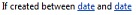|**Создан в конкретном диапазоне дат****Created in specific date span**   Это условие проверяет, если был создан между заданными датами. Можно использовать текущую дату, определенную дату или подстановки.This condition checks if the item was created between the specified dates. You can use the current date, a specific date, or a lookup.    |
||Это условие Visio — это то же, что условие **изменен конкретным пользователем** в SharePoint Designer 2013 и отображается как:This Visio condition is the same as the **Modified by a specific person** condition in SharePoint Designer 2013 and appears as:   |**Изменено определенным человеком****Modified by a specific person**   Это условие используется для проверки, если изменения элемента, указанного пользователем. Пользователь может указан как адрес электронной почты, например olivier@contoso.com, или выборе от пользователей SharePoint, Exchange и Active Directory.Use this condition to check if an item was modified by a specified user. The user can be specified as an e-mail address, such as olivier@contoso.com, or selected from SharePoint, Exchange, or Active Directory users.    **Примечание:** Адрес электронной почты и имя пользователя, с учетом регистра.**Note:** The user name and e-mail address are case sensitive. Рекомендуется выбрать пользователя имя или адрес электронной почты для убедитесь, что используется правильный регистр.It is recommended that you select a user name or e-mail address to help ensure that you use the correct case. При вводе пользователем имя или адрес электронной почты, должен соответствовать регистру учетной записи.If you type a user name or e-mail address, you must match the case of the account. Например, если изменено contoso\\Алексей не будет оценивать значение true, если учетная запись пользователя является Contoso\\Алексей.For example, If modified by contoso\\molly will not evaluate as true if the user account is Contoso\\Molly.           |
||Это условие Visio совпадает с условие **охватывать изменено в конкретный день** в SharePoint Designer 2013 и отображается как:This Visio condition is the same as the **Modified in a specific date span** condition in SharePoint Designer 2013 and appears as:   |**Изменено в рамках определенного диапазона дат****Modified in a specific date span**   Это условие проверяет, если изменения элемента между заданными датами. Можно использовать текущую дату, определенную дату или подстановки.This condition checks if an item was modified between the specified dates. You can use the current date, a specific date, or a lookup.    |
||Это условие Visio — это то же, что условие **Название содержит ключевые слова** в SharePoint Designer 2013 и отображается как:This Visio condition is the same as the **Title field contains keywords** condition in SharePoint Designer 2013 and appears as:   |**Поле заголовка содержит ключевые слова****Title field contains keywords**   Это условие проверяет, если поле **заголовка** элемента содержит конкретное слово.This condition checks if the **Title** field for an item contains a specific word. Ключевое слово можно указать в Построитель строк. Это может быть статическое значение или динамической строки или сочетание кодYou can either specify the keyword in the String Builder???which can be a static value or a dynamic string or a combination ??? или вставить подстановки для поля или переменной.or insert a lookup to a field or variable.   **Примечание:** Не удается найти более одного ключевого слова в условии **Название содержит ключевые слова** .**Note:** You cannot search for more than one keyword in the **Title field contains keywords** condition. Тем не менее, можно использовать логические операторы, такие как **However, you can use logical operators such as**||**(или) или **&amp;&amp;** (и.**( or) or **&amp;&amp;** (and.          |
   

### Условия набора документовDocument set conditions

Некоторые условия бизнес-процессов доступны только сопоставлен рабочий процесс для библиотеки документов, таких как Общие документы или типа контента документа.Some workflow conditions are only available when the workflow is associated to a document library, such as Shared Documents, or to the Document content type.
  
    
    

|**ФИГУРА УСЛОВИЯ VISIO****VISIO CONDITION SHAPE**|**СООТВЕТСТВУЮЩИЙ УСЛОВИЕ В SHAREPOINT DESIGNER****CORRESPONDING CONDITION IN SHAREPOINT DESIGNER**|**ОПИСАНИЕ УСЛОВИЯ****CONDITION DESCRIPTION**|
|:-----|:-----|:-----|
||Это условие Visio — это то же, что **размер файла в конкретном диапазоне Кбайт** условие в SharePoint Designer 2013 и отображается как:This Visio condition is the same as the **The file size in a specific range kilobytes** condition in SharePoint Designer 2013 and appears as:   |**Размер файла находится в определенном диапазоне****File size is in a specific range**   Это условие проверяет, если размер файла документа находится в пределах указанного размера, в килобайтах. Условие не включает указанного размера в расчет. Можно ввести номер или использовать подстановки для первого или второго размера в условии.This condition checks if the file size of a document is between the specified sizes, in kilobytes. The condition does not include the specified sizes in the evaluation. You can enter a number or use a lookup for the first or the second size in the condition.    |
||Это условие Visio — это то же, что **файл имеет конкретный тип** условия в SharePoint Designer 2013 и отображается как:This Visio condition is the same as the **The file type is a specific type** condition in SharePoint Designer 2013 and appears as:   |**Файл имеет определенный тип****File is a specific type**   Это условие проверяет, является ли тип файла текущего элемента указанного типа, например, docx. Можно ввести тип файла в виде строки или использовать подстановки.This condition checks if the file type of the current item is of the specified type, such as docx. You can enter the file type as a string or use a lookup.    |
   

### Список условийList conditions

  
    
    

|**ФИГУРА УСЛОВИЯ VISIO****VISIO CONDITION SHAPE**|**СООТВЕТСТВУЮЩИЙ УСЛОВИЕ В SHAREPOINT DESIGNER****CORRESPONDING CONDITION IN SHAREPOINT DESIGNER**|**ОПИСАНИЕ УСЛОВИЯ****CONDITION DESCRIPTION**|
|:-----|:-----|:-----|
||Это условие Visio — это то же, что условие **Проверить уровни разрешений для элемента списка** в SharePoint Designer 2013 и отображается как:This Visio condition is the same as the **Check list item permission levels** condition in SharePoint Designer 2013 and appears as:   |**Проверка явных разрешений пользователя****Check exact user permissions**   Это условие проверяет, что указанный пользователь обладает уровнем минимальные необходимые разрешения.This condition checks that the specified user has the minimum necessary permission level.    |
||Это условие Visio — это то же, что условие **проверять разрешения для элемента списка** в SharePoint Designer 2013 и отображается как:This Visio condition is the same as the **Check list item permissions** condition in SharePoint Designer 2013 and appears as:   |**Проверка разрешений пользователя****Check user permission**   Это условие проверяет наличие минимальные разрешения, необходимые для указанного пользователя.This condition checks if the specified user has the minimum necessary permissions.    |
   

## Знаки завершения рабочего процессаWorkflow terminators

В Visio каждый рабочий процесс должен начинаться с конца Start (In Visio, each workflow must begin with a Start terminator () и заканчиваться с конца Stop () and end with a Stop terminator (). Можно использовать только один из каждого типа терминатор для заданного рабочего процесса. Признаки конца необходимы для создания рабочих процессов SharePoint в Visio, чтобы рабочий процесс может пройти проверку и можно экспортировать. Знаки завершения рабочего процесса в SharePoint Designer не используются.). Only one of each type of terminator can be used in a given workflow. Terminators are necessary when you create a SharePoint workflow in Visio so that the workflow can pass validation and can be exported. Workflow terminators are not used in SharePoint Designer.
  
    
    

## Дополнительные ресурсыAdditional resources

-  [Что нового в рабочих процессах для SharePointWhat's new in workflows for SharePoint](what-s-new-in-workflows-for-sharepoint.md)
    
  
-  [Общие сведения о рабочих процессах в SharePointGet started with workflows in SharePoint](get-started-with-workflows-in-sharepoint.md)
    
  
-  [Разработка рабочих процессов в SharePoint Designer и VisioWorkflow development in SharePoint Designer and Visio](workflow-development-in-sharepoint-designer-and-visio.md)
    
  

  
    
    
