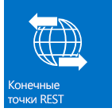
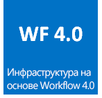
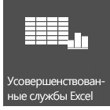

# Новые возможности для разработчиков в SharePointWhat's new for developers in SharePoint
В этой статье описываются новые возможности и функции SharePoint, в том числе новая модель облачных надстроек, средства разработки, улучшения платформы, мобильные надстройки и многое другое.Learn about new features and functionality in SharePoint, including the new Cloud Add-in Model, development tools, platform enhancements, mobile add-ins, and more.
## Модель облачных надстроекCloud Add-in Model

В SharePoint реализована модель облачных надстроек, которая позволяет создавать надстройки. Надстройки SharePoint — это автономные инструменты, расширяющие возможности веб-сайта SharePoint.SharePoint introduces a Cloud Add-in Model that enables you to create add-ins. SharePoint Add-ins are self-contained pieces of functionality that extend the capabilities of a SharePoint website. Надстройка может включать такие компоненты SharePoint, как списки, рабочие процессы и страницы сайтов, но она также может предоставлять доступ к удаленному веб-приложению и удаленным данным в SharePoint.An add-in may include SharePoint components such as lists, workflows, and site pages, but it can also surface a remote web application and remote data in SharePoint. Надстройка не зависит или почти не зависит от другого программного обеспечения на устройстве или платформе, где она установлена, кроме встроенного программного обеспечения платформы.An add-in has few or no dependencies on any other software on the device or platform where it is installed, other than what is built into the platform. Это обеспечивает простую установку и бесследное удаление.This characteristic enables add-ins to be installed simply and uninstalled cleanly. У надстроек нет пользовательского кода, выполняемого на серверах SharePoint.Add-ins have no custom code that runs on the SharePoint servers. Пользовательский код передается между облаком и клиентскими компьютерами.Instead, all custom logic moves "up" to the cloud or "down" to client computers. Кроме того, в SharePoint реализована инновационная модель доставки надстроек, которая включает Магазин Office и Каталог надстроек.Additionally, SharePoint introduces an innovative delivery model for SharePoint Add-ins that includes components like the Office Store and the Add-in Catalog.

&nbsp;&nbsp;&nbsp;&nbsp;

## Знакомая модель программирования с использованием веб-стандартовFamiliar programming model using web standards

С помощью SharePoint любые веб-разработчики, включая тех, что работают с платформами других компаний (не Майкрософт), могут легко создавать решения для SharePoint. Это стало возможным благодаря тому, что SharePoint основан на общепринятых веб-стандартах, таких как HTML, CSS и JavaScript. Кроме того, реализация зависит от распространенных протоколов, таких как OData и OAuth.SharePoint makes it easy for any web developer, including those who work on non-Microsoft platform stacks, to create SharePoint solutions. What makes this possible is that SharePoint is based on common web standards like HTML, CSS, and JavaScript. Furthermore, implementation relies on established protocols like the Open Data protocol (OData), and OAuth.
  

  &nbsp;&nbsp;&nbsp;&nbsp;&nbsp;&nbsp;

## Средства разработкиDevelopment tools

Текущий выпуск отражает огромные успехи в оптимизации существующих инструментов разработки, таких как Visual Studio и SharePoint Designer, а также предоставляет новое средство Средства разработки Napa для Office 365 для разработки надстроек. Новая унифицированная система проектов в Visual Studio позволяет создавать Надстройки SharePoint, Надстройки Office и Надстройки SharePoint, в том числе Надстройки Office и Надстройки Office, размещенные в SharePoint. Помимо шаблонов проекта SharePoint, которые были доступны в предыдущих версиях, Visual Studio 2012 теперь содержит новый шаблон проекта надстройки в папке "Надстройки", Надстройки для SharePoint. Несколько новых свойств добавлены в окно свойств и на страницу свойств для поддержки проектов Надстройка SharePoint. В числе других улучшений полная поддержка разработки на основе модели облачных надстроек, включая поддержку OData и OAuth, и полную поддержку разработки для платформы Workflow Manager Client 1.0.The current release reflects enormous strides in optimizing the existing development tools like Visual Studio and SharePoint Designer, in addition to providing the release of newly developed web-based tool Napa Office 365 Development Tools for developing add-ins. The new unified project system in Visual Studio lets you develop SharePoint Add-ins, Office Add-ins, SharePoint Add-ins that include Office Add-ins, or Office Add-ins that are hosted by SharePoint. In addition to the SharePoint project templates that were provided in earlier versions, Visual Studio 2012 now includes a new add-in project template in the Add-ins folder named Add-ins for SharePoint. Several new properties have been added to the Properties window and Properties pages to support SharePoint Add-in projects. Other improvements include full support for development against the Cloud Add-in Model, including OData and OAuth support, and full support for development against the Workflow Manager Client 1.0 platform.

&nbsp;&nbsp;&nbsp;&nbsp;

## Основные улучшения платформыCore platform enhancements

В более общем смысле продукт SharePoint был усовершенствован для поддержки новой облачной архитектуры и платформы разработки на основе приложений. Во всем, начиная API-интерфейсами SharePoint на самом низком уровне и заканчивая интеграцией с социальными сетями, SharePoint разработан для поддержки среды разработки расширенных приложений. Помимо использования конечных точек REST для веб-служб, существует новый интерфейс API для разработки клиентских и серверных решений. Теперь, в дополнение к обработке на стороне клиента, поддерживаются и удаленные приемники событий.On a broader scale, SharePoint has been improved and enhanced to support the new cloud-based architecture and app-driven development framework. From the SharePoint APIs at the lowest level to connectivity to social media integration, SharePoint is designed and executed to support a rich application development experience. In addition to the use of Representational State Transfer (REST) endpoints for web services, there is a broad new API for both server and client development. Remote event receivers and now supported in addition to client-side rendering. 
  
&nbsp;&nbsp;&nbsp;&nbsp;&nbsp;&nbsp;

    
    
    

## МобильностьMobility

С помощью SharePoint вы можете объединить приложения Windows Phone 7 с локальными или работающими в облаке удаленными службами и приложениями SharePoint (например, использующими SharePoint Online), для создания мощных и действительно портативных приложений, которые работают не только на традиционных настольных компьютерах и ноутбуках, но и на мобильных устройствах. Новые возможности для мобильных приложений в SharePoint основаны на существующих средствах и технологиях Майкрософт, такие как SharePoint, Windows Phone 7, Visual Studio и Microsoft Silverlight. Можно разрабатывать мобильные приложения на основе SharePoint для Windows Phone, используя новый шаблон мастера приложения SharePoint дл телефонов в Visual Studio. С его помощью можно создавать простые мобильные приложения на основе списков. Кроме того, вы можете интегрировать новые возможности, представленные в SharePoint, такие как тип поля географического расположения и push-уведомления от SharePoint Server, в своих мобильных приложениях.With SharePoint, you can combine Windows Phone 7 applications with on-premises SharePoint services and applications, or with remote SharePoint services and applications that run in the cloud (such as those that use SharePoint Online), to create powerful applications that extend functionality beyond the traditional desktop or laptop and into a truly portable and much more accessible environment. The new mobility features in SharePoint are built on existing Microsoft tools and technologies, such as SharePoint, Windows Phone 7, Visual Studio, and Microsoft Silverlight. You can create SharePoint-powered mobile applications for Windows Phone using the new SharePoint phone application wizard template in Visual Studio, which lets you create simple list-based mobile applications. You can integrate new features introduced in SharePoint, such as the Geolocation field type and "push" notifications from SharePoint Server, into your mobile applications.

&nbsp;&nbsp;&nbsp;&nbsp;

## Социальные сети и совместная работаSocial and collaboration

Новые и улучшенные возможности для взаимодействия с социальными сетями и совместной работы позволяют пользователям легко обмениваться данными и всегда оставаться в курсе событий. Улучшенные социальные веб-каналы Личный сайт помогают следить за интересующими людьми и контентом в социальных сетях. Новый сайт сообщества предоставляет расширенный интерфейс сообщества, позволяя пользователям легко находить информацию и обмениваться ей, а также находить людей с похожими интересами.New and improved social and collaboration features make it easy for users to communicate and to stay engaged and informed. The improved My Site social feed helps users keep up to date with the people and content that they care about. The new Community Site feature provides a rich community experience that lets users easily find and share information and find people who have similar interests.

&nbsp;&nbsp;&nbsp;&nbsp;&nbsp;&nbsp;

## ПоискSearch

Система поиска в SharePoint получила ряд усовершенствований, в том числе обработка пользовательского контента с помощью веб-службы повышения качества контента, а также новая платформа представления типов результатов поиска. Кроме того, были внесены значительные улучшения в язык KQL.Search functionality in SharePoint includes several enhancements, custom content processing with the Content Enrichment web service, and a new framework for presenting search result types. Additionally, there have been significant enhancements made to the keyword query language (KQL).

&nbsp;&nbsp;&nbsp;&nbsp;

## Рабочие процессыWorkflows

Workflow Manager Client 1.0  это переработанная инфраструктура рабочих процессов, созданная на основе Windows Workflow Foundation 4. Она предоставляет новые, мощные и гибкие возможности разработки рабочих процессов в SharePoint. Полностью декларативная среда разработки позволяет информационным сотрудникам использовать SharePoint Designer 2013 для создания функциональных рабочих процессов, а новый набор шаблонов проекта рабочего процесса Visual Studio 2012 предоставляет разработчикам доступ к расширенным функциям, таким как настраиваемые действия. Возможно, самое главное преимущество состоит в том, что Workflow Manager Client 1.0 полностью интегрирован с Модель для надстроек SharePoint. Кроме того, рабочие процессы выполняются в облаке, а не в SharePoint, что обеспечивает невероятную гибкость при проектировании Надстройки SharePoint на основе рабочих процессов.Workflow Manager Client 1.0 is a redesigned workflow infrastructure that is built on Windows Workflow Foundation 4 and brings new power and flexibility to workflow authoring in SharePoint. A fully declarative authoring environment enables information workers to use SharePoint Designer 2013 to author powerful workflows, and a new set of Visual Studio 2012 workflow project templates let developers access more sophisticated features like custom actions. Perhaps most importantly, Workflow Manager Client 1.0 is fully integrated with the model for SharePoint Add-ins. In addition, workflows execute in the cloud, not in SharePoint, which provides enormous flexibility in designing workflow-based SharePoint Add-ins.

&nbsp;&nbsp;&nbsp;&nbsp;&nbsp;&nbsp;

## Управление корпоративным информационным содержимымEnterprise Content Management

В SharePoint вы можете использовать API-интерфейсы клиента.NET, Silverlight, Windows Phone и JavaScript, а также недавно расширенный набор серверных управляемых интерфейсов API .NET, для настройки интерфейсов поведения корпоративного управления информационным содержимым (ECM).In SharePoint, you can now use .NET client, Silverlight, Windows Phone, and JavaScript APIs, in addition to the newly expanded set of .NET server managed APIs, to customize Enterprise Content Management (ECM) experiences and behavior.

&nbsp;&nbsp;&nbsp;&nbsp;&nbsp;&nbsp;

## Business Connectivity ServicesBusiness Connectivity Services

Службы Business Connectivity Services (BCS) предоставляет SharePoint доступ к данным из внешних систем, таких как SAP, ERP и CRM, в дополнение к другим приложениям на основе данных, которые доступны через службы WCF или конечные точки OData. Службы BCS в SharePoint были усовершенствованы и расширены. Среди улучшений подключения OData, внешние события, внешние данные в надстройках, фильтрация и сортировка, поддержка REST и другое.Business Connectivity Services (BCS) enables SharePoint to access data from external data systems such as SAP, ERP, and CRM, in addition to other data-driven applications that are exposed through WCF services or OData endpoints. BCS in SharePoint has been improved and enhanced in many ways, including OData connectivity, external events, external data in add-ins, filtering and sorting, support for REST, and others.

&nbsp;&nbsp;&nbsp;&nbsp;

## Службы-приложенияApplication services

SharePoint включает несколько служб для работы с данными на сайтах.SharePoint includes several services for working with data in your SharePoint sites. В SharePoint появилась служба машинного перевода, которая переводит сайты, документы и потоки.New for SharePoint is the Machine Translation Service, which translates sites, documents, and streams for multilingual support. SharePoint также включает службы Access и новую модель доступа к данным.SharePoint also includes Access Services and a new data access model. Для преобразования файлов и потоков в другие форматы в SharePoint есть службы Word Automation Services и PowerPoint Automation Services (новая возможность).For converting files and streams to other formats, SharePoint has Word Automation Services and PowerPoint Automation Services (a new feature for SharePoint). В SharePoint также предусмотрены инструменты для анализа данных, такие как PerformancePoint Services и службы Visio, и полезные новые функции в службах Excel.SharePoint also provides data analysis tools, like PerformancePoint Services and Visio Services, that enable business intelligence, and powerful new features in Excel Services.

&nbsp;&nbsp;&nbsp;&nbsp;&nbsp;&nbsp;

## Дополнительные ресурсыAdditional resources

-  [Обзор разработки решений с помощью SharePointSharePoint development overview](sharepoint-development-overview.md)
    
  
-  [Разработка надстроек для SharePointDevelop SharePoint Add-ins](../sp-add-ins/sharepoint-add-ins.md)
    
  
-  [Сравнение надстроек SharePoint с решениями SharePointSharePoint Add-ins compared with SharePoint solutions](sharepoint-add-ins-compared-with-sharepoint-solutions.md)
    
  
-  [Выбор правильного набора API в SharePointChoose the right API set in SharePoint](choose-the-right-api-set-in-sharepoint.md)
    
  
-  [Специальные возможности в SharePointAccessibility in SharePoint](accessibility-in-sharepoint.md)
    
  

