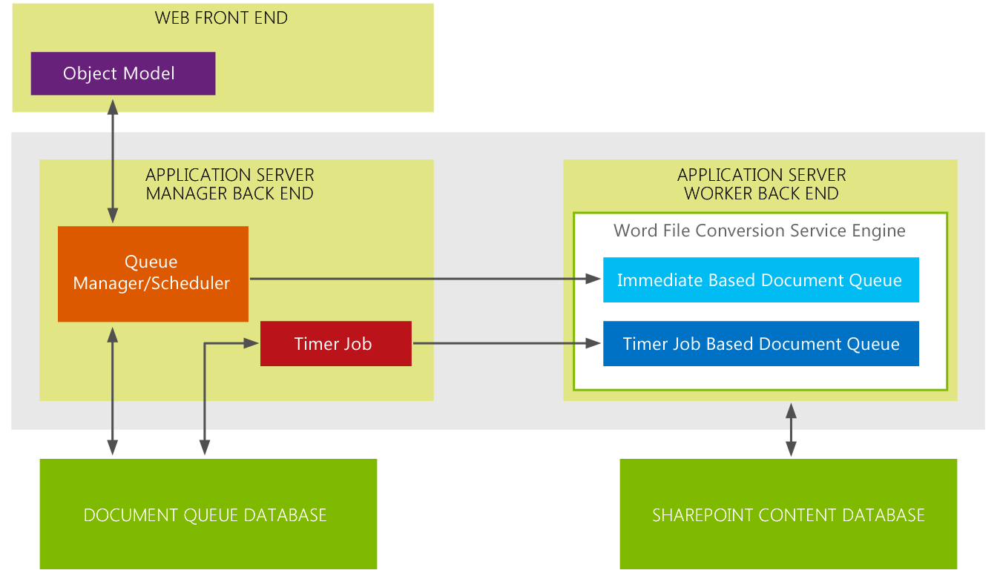

# Новые возможности Word Automation Services для разработчиков (en)What's new in Word Automation Services for developers
Этот раздел содержит общий обзор дополнений и усовершенствований в службы Word Automation Services для разработчиков.This topic provides a high-level overview of the additions and enhancements for developers in Word Automation Services. В Microsoft SharePoint основной дополнение к Word Automation Services — поддержка «по запросу» файл запросов на преобразование.In Microsoft SharePoint the primary addition to Word Automation Services is support for "on demand" file conversion requests. Наиболее значительное расширение возможностей Word Automation Services добавлена поддержка использование потоков в качестве входных данных и выходные данные задания преобразования.The most significant enhancement to Word Automation Services is added support for using streams as input to and output from conversion jobs.
## Создайте на преобразование файла запросамиCreate an on demand file conversion

В веб-службы Word Automation Services в Microsoft SharePoint, можно создавать по запросу преобразованием файлов запрашивает сразу же обработки результатов в файл conversionthat.In Word Automation Services in Microsoft SharePoint you can now create on demand file conversion requests that result in file conversionthat are processed immediately. В SharePoint 2010 вам нужно создать задание преобразования файлов в коде и затем запустить преобразование, с помощью метода ConversionJob.Start.In SharePoint 2010, you would create a file conversion job in your code and then start the conversion using the ConversionJob.Start method. Задание преобразования нажмите Начать на основе интервала, задайте в службы Word Automation Services, как часто следует запускать задания преобразования.The conversion job would then start based on the interval set in Word Automation Services for how often to start conversion jobs. Периодичностью задания таймера SharePoint будет запустить задание преобразования.At the interval, the SharePoint Timer Job would start the conversion job. С помощью метода задания таймера на основе soonest можно начать преобразование задания равен 1 минуте.Using the Timer Job based method, the soonest you can start a conversion job is 1 minute. 
  
    
    
Теперь в службы Word Automation Services в Microsoft SharePoint, вы можете добавлена для создания запроса на преобразование файла, который обрабатывается как только вы отправить и преобразования, запускается немедленно и не зависит от задания таймера SharePoint.Now, in Word Automation Services in Microsoft SharePoint, you have the added option to create a file conversion request that's processed as soon as you submit it and the conversion is started immediately and does not depend on the SharePoint Timer Job. 
  
    
    
Одним из способов, учитывайте следующее различие между в очередь запросов на преобразование файла запросами и SharePoint на основе временного задания преобразования заданий — понять, в очередь запросов на преобразование файла запросами обрабатываются синхронно, тогда как задания преобразования на основе задание таймера SharePoint происходят асинхронно. Архитектура Word Automation Services была переработана для поддержки нового типа для запроса на преобразование файла запросами и существующих преобразования файлов задания таймера на основе SharePoint.One way to think about the difference between on demand file conversion requests and the SharePoint Time Job-based conversion jobs is to understand that on demand file conversion requests are handled synchronously, whereas SharePoint Timer Job-based conversion jobs happen asynchronously. The Word Automation Services architecture was redesigned to support both the new kind of on demand file conversion request and the existing SharePoint Timer Job based file conversions.
  
    
    

**На рисунке 1. Архитектура Word Automation Services 2013****Figure 1. Word Automation Services 2013 architecture**

  
    
    

  
    
    

  
    
    
На рисунке 1, можно убедиться, что архитектура Word Automation Services поддерживается 2 отдельных очередей для преобразования: одна очередь для на запросами (Интерпретация) файла преобразования запросов и одной очереди для заданий преобразования на основе задания таймера SharePoint на запросы с запросами помещаются в интерпретации основе очереди документов, где преобразования обрабатываются немедленно.In figure 1, you can see that the Word Automation Services architecture maintains 2 separate queues for conversions: one queue for on demand (immediate) file conversion requests and one queue for SharePoint Timer Job-based conversion jobs on demand requests are placed in the immediate based document queue where the conversions are processed immediately.
  
    
    
С другой стороны задания преобразования на основе задания таймера SharePoint, помещаются в очередь документ на основе задания таймера. Задания преобразования для этих запросов на запуск периодичностью для службы Word Automation Services. Запросов на преобразование в очереди документ на основе интерпретации всегда имеют приоритет над задания преобразования в документ на основе задание таймера очереди.In contrast, the SharePoint Timer Job-based conversion jobs are placed in the Timer Job-based document queue. Conversion jobs for these requests start at the interval set for Word Automation Services. Conversion requests in the immediate-based document queue always have priority over conversion jobs in the Timer Job-based document queue.
  
    
    

### Ключевые моментыKey points

- По запросу преобразования файлов запросами-это дополнительный компонент и не замените существующее задание преобразования на основе задания таймера SharePoint.An on demand file conversion request is an additional feature and doesn't replace the existing SharePoint Timer Job-based conversion job. Это означает, что решения, которые компилируются и выполнили в SharePoint 2010 будет продолжать скомпилировать и запустить в SharePoint.That means that solutions that compiled and ran in SharePoint 2010 will continue to compile and run in SharePoint.
    
  
- Чтобы на запросов на преобразование файла запросами только для одного файла за разYou can make on demand file conversion requests for only one file at a time
    
  
- Word Automation Services всегда будет определять приоритеты для задания преобразования файлов запросами через задания преобразования на основании SharePoint задания таймера. Если Word Automation Services уже работает на задание преобразования файлов, который использует SharePoint задание таймера, Word Automation Services прерывать задания и переключения на работают на задание преобразования файлов запросами до его завершения. Оно будет переключитесь в работать на задание преобразования файлов на основе задание таймера SharePointWord Automation Services will always prioritize on demand file conversion jobs over conversion jobs based on the SharePoint Timer Job. If Word Automation Services is already working on a file conversion job that uses the SharePoint Timer Job, Word Automation Services will interrupt that job and switch over to work on the on demand file conversion job until it is completed. It will then switch back to work on the SharePoint Timer Job-based file conversion job
    
  

## Преобразования файлов потоковPerform file conversions on streams

Новая функция в Word Automation Services в Microsoft SharePoint — для поддержки преобразования потоков.The other new feature in Word Automation Services in Microsoft SharePoint is support for converting streams. В SharePoint 2010, можно было только преобразовать файлы, которые были сохранены в библиотеках SharePoint.In SharePoint 2010, you could only convert files that were stored in SharePoint libraries. Теперь можно преобразовать файлы, которые хранятся вне SharePoint с использованием потоков.Now you can also convert files that are stored outside SharePoint using streams.
  
    
    

### Ключевые моментыKey points

- Можно использовать только потоков как входные данные при создании на задание преобразования файлов запросамиYou can only use streams as input when you're creating an on demand file conversion job
    
  
- Из-за описанные выше точки можно преобразовать только один поток за разBecause of the foregoing point, you can only convert one stream at a time
    
  
С добавлением в очередь запросов на преобразование файла запросами и для поддержки преобразования потоков Word Automation Services значительно улучшено для включения с повышенной сценариев для преобразования документов.With the addition of on demand file conversion requests and support for converting streams, Word Automation Services has been significantly enhanced to enable a greater range of document conversion scenarios.
  
    
    

### Дополнительные ресурсыAdditional resources

-  [Службы Word Automation Services в SharePoint Server 2010Word Automation Services in SharePoint Server 2010](http://msdn.microsoft.com/ru-ru/library/ee558278)
    
  
-  [Службы Word Automation Services Class библиотекиWord Automation Services Class Library](http://msdn.microsoft.com/ru-ru/library/ee559408)
    
  

