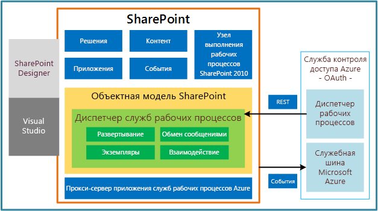

# Новые возможности рабочих процессов для SharePointWhat's new in workflows for SharePoint
Узнайте о новых возможностях и функциях рабочих процессов в SharePoint. В SharePoint существенно изменилась инфраструктура рабочих процессов. В разделах ниже кратко описаны наиболее важные обновления и улучшения в инфраструктуре рабочих процессов.Learn about the capabilities and features that are new to workflows in SharePoint. The workflow framework in SharePoint is significantly changed from previous versions. The following sections provide brief summaries of the most significant updates and enhancements to the workflow infrastructure.
  
    
    

## Полностью обновленная инфраструктура рабочих процессовCompletely redesigned workflow infrastructure

Рабочие процессы SharePoint основаны на платформе Windows Workflow Foundation 4 (WF), которая значительно отличается от предыдущих версий. Платформа Windows Workflow Foundation, в свою очередь, основана на функциональности обмена сообщениями  [Windows Communication Foundation (WCF)](http://msdn.microsoft.com/en-us/netframework/aa663324).SharePoint workflows are powered by Windows Workflow Foundation 4 (WF), which was substantially redesigned from previous versions. Windows Workflow Foundation, in turn, is built on the messaging functionality that is provided by  [Windows Communication Foundation (WCF)](http://msdn.microsoft.com/en-us/netframework/aa663324).
  
    
    
Пожалуй, наиболее характерной особенностью новой инфраструктуры рабочих процессов стало внедрение Microsoft Azure в качестве нового узла выполнения рабочих процессов. Рабочие процессы теперь выполняются за пределами сервера SharePoint — в Microsoft Azure. На рис. 1 представлена обобщенная высокоуровневая схема новой инфраструктуры рабочих процессов. Более подробное описание понятий, представленных на рис. 1, см. в статье  [Основные сведения о рабочих процессах в SharePoint](sharepoint-workflow-fundamentals.md).Perhaps the most prominent feature of the new workflow infrastructure is the introduction of Microsoft Azure as the new workflow execution host. The workflow execution engine now lives outside of SharePoint, in Microsoft Azure. Figure 1 provides a generalized, high-level view of the new workflow infrastructure. For a more thorough discussion of the concepts presented in Figure 1, see  [SharePoint workflow fundamentals](sharepoint-workflow-fundamentals.md).
  
    
    

**Рис. 1. Высокоуровневая архитектура инфраструктуры рабочих процессов****Figure 1. High-level architecture of the workflow infrastructure**

  
    
    

  
    
    

  
    
    

  
    
    

  
    
    

## Полностью декларативная среда разработки без программного кодаFully declarative, no-code authoring environment

Другое важное изменение состоит в том, что рабочие процессы на платформе WF 4 являются полностью декларативными. Рабочие процессы больше не компилируются в управляемые сборки и не развертываются в кэш сборок. Вместо этого рабочие процессы и ход их выполнения определяют XAML-файлы.Another of the prominent changes is that workflows on the WF 4 platform are fully declarative. That is, workflows are no longer compiled into managed assemblies and deployed to an assembly cache. Instead, XAML files define your workflows and frame their execution.
  
    
    

## Улучшены возможности разработки в SharePoint Designer 2013Enhanced SharePoint Designer 2013 authoring support

Мы попытались сделать SharePoint Designer 2013 наилучшей средой для разработки рабочих процессов SharePoint. В SharePoint Designer 2013 представлены рабочая область конструирования и текстовая среда разработки рабочих процессов. Вы можете создавать дополнительные действия рабочих процессов в Visual Studio 2012, а затем импортировать их в SharePoint Designer 2013, где они будут доступны из Конструктор рабочих процессов.SharePoint Designer 2013 has been updated with the goal of making it the authoring environment of choice for authoring SharePoint workflows. SharePoint Designer 2013 provides workflow authors with both a designer surface and a text-based workflow authoring environment. Additionally, you can develop workflow custom actions in Visual Studio 2012 and then import them into SharePoint Designer 2013, where they can then be accessed from the Workflow Designer.
  
    
    
Таким образом, в средах разработки рабочих процессов SharePoint учтены потребности как разработчика, так и информационного работника ("опытного пользователя").In short, the needs of both the information worker (the "power user") and the developer have been harnessed in SharePoint workflow authoring and development environments.
  
    
    

## Поддержка типов проектов рабочих процессов Visual Studio 2012Visual Studio 2012 workflow project type support

Чтобы упростить взаимодействие информационного работника и разработчика программного обеспечения, в Visual Studio 2012 представлены типы проектов рабочих процессов SharePoint и тип дополнительных действий рабочего процесса. Дополнительные сведения о разработке рабочих процессов с помощью Visual Studio 2012 и различиях между SharePoint Designer 2013 и Visual Studio 2012 см. в статье  [Разработка рабочих процессов в SharePoint с помощью Visual Studio](develop-sharepoint-workflows-using-visual-studio.md).To make collaboration easier between information worker and software developer, Visual Studio 2012 provides SharePoint workflow project types and a workflow custom action-item type. For more information about developing workflows by using Visual Studio 2012, and for information about differentiating between SharePoint Designer 2013 and Visual Studio 2012 in workflow development, see  [Develop SharePoint workflows using Visual Studio](develop-sharepoint-workflows-using-visual-studio.md).
  
    
    

## Поддержка создания дополнительных действийSupport for creating custom actions

В SharePoint Designer 2013 и Visual Studio 2012 представлены шаблоны, действия и операции, которые могут понадобиться авторам рабочих процессов. Однако невозможно предугадать, что может понадобиться каждому конкретному пользователю. Поэтому в Visual Studio 2012 доступен настраиваемый тип, который позволяет разработчикам создавать дополнительные действия. Чтобы узнать больше о дополнительных действиях рабочих процессов, см. статью  [Как: построение и развертывание настраиваемого действия рабочего процесса](how-to-build-and-deploy-workflow-custom-actions.md).A lot of effort has gone into anticipating the business requirements of workflow authors in the providing of workflow templates, actions, and activities in SharePoint Designer 2013 and in Visual Studio 2012. However, we also know that we cannot anticipate each person's specific needs. For this reason, Visual Studio 2012 provides a workflow custom action-item type that lets developers create custom actions. For more information about workflow custom actions, see  [How to: Build and deploy workflow custom actions](how-to-build-and-deploy-workflow-custom-actions.md).
  
    
    

## Поддержка средств для рабочих процессов SharePointTools support for SharePoint workflows

В Visual Studio 2012 представлены шаблоны и возможность создания рабочих процессов на базе инфраструктуры SharePoint. Рабочие процессы SharePoint похожи на рабочие процессы предыдущих версий за исключением того, что они выполняются в Microsoft Azure на основе платформы WF 4. Кроме того, они являются полностью декларативными (XAML) и предназначены для взаимодействия с облаком и работы с Надстройки SharePoint. Одно из их основных преимуществ состоит в том, что они позволяют удаленно размещать и выполнять рабочие процессы за пределами SharePoint Server.Visual Studio 2012 provides templates and support for creating workflows on the SharePoint workflow framework. SharePoint workflows are similar to previous versions of workflows except that they are powered by WF 4 and run in Microsoft Azure. They are also declarative-only (XAML) and designed to interact with the cloud and work with SharePoint Add-ins. One of their primary benefits is that they enable you to remotely host and run workflows outside SharePoint Server.
  
    
    

## Новые действия рабочих процессовNew workflow actions

Ниже перечислены новые действия рабочих процессов, доступные в SharePoint. Полное описание новых и устаревших действий см. в статье  [Справочник по действий рабочих процессов для SharePoint](workflow-actions-and-activities-reference-for-sharepoint.md). В SharePoint впервые внедрен набор действий рабочих процессов, которые обеспечивают интеграцию с Project 2013 и позволяют создавать рабочие процессы на основе проектов.Following are new workflow actions that are provided in SharePoint. For a full detailing of both new and deprecated actions, see  [Workflow actions and activities reference for SharePoint](workflow-actions-and-activities-reference-for-sharepoint.md). New to workflows in SharePoint are a set of workflow actions that allow you to integrate with Project 2013 and let you create Project-based workflows.
  
    
    

**Таблица 1. Новые действия рабочих процессов в SharePoint****Table 1. New workflow actions in SharePoint**

|**Действие****Action**|**Описание****Description**|
|:-----|:-----|
|Назначить задачуAssign a Task    |Назначает одну задачу рабочего процесса пользователю или группе.Assigns a single workflow task to a user or group.    |
|Начать рабочий процессStart a Task Process    |Инициирует выполнение процесса задачи.Initiates execution of a task process.    |
|Перейти к этой стадииGo to This Stage    |Определяет следующую стадию рабочего процесса, которой необходимо передать управление потоком.Specifies the next stage in a workflow to which flow control should be handed.    |
|Вызов веб-службы HTTPCall HTTP Web Service    |Используется для вызова конечной точки REST.Functions as a method call to a Representational State Transfer (REST) endpoint.    |
|Начать рабочий процесс спискаStart a List Workflow    |Запускает рабочий процесс списка.Starts a list-scoped workflow.    |
|Начать рабочий процесс сайтаStart a Site Workflow    |Запускает рабочий процесс сайта.Starts a site-scoped workflow.    |
|Построить DynamicValueBuild DynamicValue    |Создает новую переменную типа **DynamicValue**.Creates a new variable of type **DynamicValue**.    |
|Получить свойство из DynamicValueGet Property from DynamicValue    |Получает значение свойства из указанной переменной типа **DynamicValue**.Retrieves a property value from a specified variable of type **DynamicValue**.    |
|Количество элементов в DynamicValueCount Items in DynamicValue    |Возвращает количество строк в переменной типа **DynamicValue**.Returns the number of rows in a variable of type **DynamicValue**.    |
|Обрезать строкуTrim String    |Удаляет все начальные и конечные пробелы из текущей строки.Removes all leading and trailing white-space characters from the current string.    |
|Найти подстроку в строкеFind Substring in String    |Возвращает индекс (отсчет ведется от 1) первого вхождения одного либо нескольких символов или первого вхождения строки (в пределах строки).Returns 1-based index of the first occurrence of one or more characters, or the first occurrence of a string, within a string.    |
|Заменить подстроку в строкеReplace Substring in String    |Возвращает новую строку, в которой все экземпляры указанного символа или строки заменены на другой указанный символ или строку.Returns a new string in which all occurrences of a specified character or string are replaced with another specified character or string.    |
|Перевести документTranslate Document    |Используется в качестве оболочки действия HTTP, которое вызывает API синхронного перевода. Необходимо настроить приложение-службу машинного перевода для сайта SharePoint, на котором выполняется рабочий процесс.Functions as a wrapper around the HTTP activity that calls the synchronous translation API. You must configure a Machine Translation Service Application for the SharePoint site on which you run the workflow.    |
|Изменить состояние рабочего процессаSet Workflow Status    |Обновляет состояние рабочего процесса, как указано в строке сообщения.Updates workflow status as specified in message string.    |
|Создать проект из текущего элемента [Microsoft Project]Create a Project from Current Item [Microsoft Project]    |Создает проект Project Server на основе текущего элемента.Creates a Project Server project based on the current item.    |
|Задать это значение текущего состояния стадии проекта [Microsoft Project]Set the current project stage status to this value [Microsoft Project]    |Задает два поля состояния на текущей стадии проекта.Sets the two status fields within the current stage of the project.    |
|Изменить состояние объекта из списка идей на это значение [Microsoft Project]Set the status field in the idea list item to this value [Microsoft Project]    |Обновляет поле состояния исходного элемента списка SharePoint.Updates the status field of the original SharePoint list item.    |
|Дождаться события проекта [Microsoft Project]Wait for Project Event [Microsoft Project]    |Приостанавливает текущий экземпляр рабочего процесса до наступления указанного события проекта: возвращение, выделение, отправление.Pauses the current instance of the workflow to await a specified Project event: Project checked in, Project committed, Project submitted.    |
|Присвоить это значение этому полю в проекте [Microsoft Project]Set this field in the project to this value [Microsoft Project]    |Задает значение корпоративного настраиваемого поля для указанного проекта.Sets the value for the enterprise custom field for a specified project.    |
   

## Дополнительные ресурсыAdditional resources

-  [Общие сведения о рабочих процессах в SharePointGet started with workflows in SharePoint](get-started-with-workflows-in-sharepoint.md)
    
  
-  [Новые возможности для разработчиков в SharePointWhat's new for developers in SharePoint](what-s-new-for-developers-in-sharepoint.md)
    
  
-  [Справочник по действий рабочих процессов для SharePointWorkflow actions and activities reference for SharePoint](workflow-actions-and-activities-reference-for-sharepoint.md)
    
  
-  [Краткий справочник по действиям рабочего процесса (платформа рабочих процессов в SharePoint)Workflow actions quick reference (SharePoint Workflow platform)](workflow-actions-quick-reference-sharepoint-workflow-platform.md)
    
  

