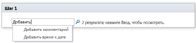

# Краткий справочник по действиям рабочего процесса (платформа рабочих процессов SharePoint 2010)
Сведения о действиях рабочих процессов, доступных на платформе рабочих процессов SharePoint 2010 в Microsoft SharePoint Designer 2013. Используйте эту статью, *только* если вы работаете в SharePoint Designer 2013, но хотите и далее использовать платформу рабочих процессов SharePoint 2010. Если вы хотите использовать платформу рабочих процессов SharePoint, см. статью [Краткий справочник по действиям рабочего процесса (платформа рабочих процессов SharePoint)](workflow-actions-quick-reference-sharepoint-workflow-platform.md), а также другие статьи о новых функциях этой платформы, указанные в разделе "Дополнительные ресурсы". Чтобы приступить к созданию рабочего процесса с помощью платформы рабочих процессов SharePoint 2010, выберите элемент **Рабочий процесс SharePoint 2010** в поле **Тип платформы** диалогового окна **Создание рабочего процесса**.
## Где найти действия рабочих процессов

Открыть меню доступных действий рабочих процессов можно двумя способами.
  
    
    
При редактировании в шаге рабочего процесса выполните одно из следующих действий:
  
    
    

- На вкладке **Рабочий процесс** нажмите в группе **Вставка** кнопку **Действия**.
    
  
- Дважды щелкните в области шага рабочего процесса. В появившемся поле поиска введите текст, который присутствует в нужном имени действия (например, "добавить") и нажмите клавишу ВВОД. Под текстовым полем появятся действия и условия, которые содержат введенный текст.
    
  
  

  

  
Действия, доступные при создании рабочего процесса, зависят от текущего контекста. Например, действия **Начать процесс утверждения** и **Начать процесс сбора отзывов** недоступны для сайтов, созданных в Microsoft SharePoint Foundation 2013. Некоторые действия со списками доступны только в шаге олицетворения, а другие  только если рабочий процесс связан с библиотекой документов или типом содержимого документов. Действия со списками, работающие с текущим элементом, например **Изменить состояние утверждения контента** и **Задать поле в текущем элементе**, недоступны в рабочем процессе сайта.
  
    
    
Действия делятся на категории в зависимости от области их применения в рабочем процессе. Например, действия, влияющие на поведение элемента, входят в категорию **Действия со списками**, действия, связанные с наборами документов,  в категорию **Действия с наборами документов**, а пользовательские действия рабочих процессов  в категорию **Настраиваемые действия**. Действия делятся на следующие категории:
  
    
    

- "Основные действия".
    
  
- "Действия с наборами документов" (отображается, только если рабочий процесс связан с библиотекой документов или типом содержимого документов).
    
  
- "Действия со списками".
    
  
-  "Действия с отношениями" (отображается, только если сайт работает под управлением SharePoint).
    
  
- "Действия с задачами" (отображается, только если сайт работает под управлением SharePoint).
    
  
- "Действия управления задачами" (отображается только при настройке задач во встроенных действиях рабочих процессов, например **Начать процесс утверждения** и **Начать процесс сбора отзывов**).
    
  
- "Вспомогательные действия".
    
  
- "Настраиваемые действия".
    
  

## "Общие действия".

"Общие действия" — это действия, которые отображаются в списке "Действия" во всех контекстах рабочих процессов.
  
    
    

|**Действие**|**Описание**|
|:-----|:-----|
|<u>**Основные действия**</u>   |Действия из этой категории чаще всего используются в рабочих процессах.    |
|Добавить комментарий    | Это действие изначально отображается в шаге рабочего процесса как **Примечание: текст примечания**. С помощью этого действия можно оставлять в конструкторе рабочих процессов информативные примечания для справки. Это особенно полезно, если над рабочим процессом совместно работает несколько пользователей. Например, если переменная в текущем рабочем процессе имеет непонятное имя, то с помощью этого действия вы можете добавить примечание, обозначающее роль переменной в рабочем процессе.   Ниже представлен пример того, как может выглядеть действие на этапе рабочего процесса.   – Примечание: эта переменная указывает отдел инициатора рабочих процессов.   **Примечание.** Любой пользователь, который редактирует рабочий процесс в Microsoft Visio 2013, также сможет просматривать примечания.          |
|Добавить время к дате    | Это действие изначально отображается в шаге рабочего процесса как **Добавить 0 минут к дате (вывод в переменную: дата)**. С помощью этого действия можно добавить указанное число минут, часов, дней, месяцев или лет к значению даты и сохранить возвращаемое значение в переменной. Значение даты, к которому добавляется время, может быть текущей датой или результатом поиска.   Ниже представлен пример того, как может выглядеть действие на этапе рабочего процесса.   – Добавить <u>7дней</u> к <u>Текущий элемент:Изменен</u> (с выводом в <u>Переменная: Неделя после изменения</u>)    |
|Вычислить    | Изначально это действие отображается в шаге рабочего процесса как **Вычислить значение плюс значение (вывод в переменную: выч)**. С помощью этого действия можно выполнить вычисление с использованием двух значение и сохранить результат в переменной. Доступные операции включают сложение, вычитание, умножение и деление.   Ниже представлены примеры того, как это действие может выглядеть на этапе рабочего процесса.   – Вычислить <u>36 разделить на 9</u> (с выводом в <u>Переменная:Количество мини-приложений<u>)    – Вычислить [fx :: Курсы*, Заполненные места] плюс 1 (с выводом в Переменная: Новые заполненные места)   |
|Записать в журнал    | Изначально это действие отображается в шаге рабочего процесса как **Записать это сообщение в журнал рабочего процесса**. С помощью этого действия можно записать в журнал рабочего процесса сообщение о его действиях или ходе выполнения. Сообщение может содержать сводку события рабочего процесса или другие необходимые сведения о текущем выполнении рабочего процесса. Такие сообщения могут быть полезны устранении неполадок рабочих процессов. Например, вы можете записать сообщение о таком событии, как **Скопировано в список A** или **Сообщение отправлено подписчикам**. После успешного завершения рабочего процесса вы можете перейти к списку **Журнал рабочего процесса** и просмотреть сообщения в столбце **Описание**.     Ниже представлен пример того, как может выглядеть действие на этапе рабочего процесса.   – Записать <u>набор переменных Неделя после изменения</u> в журнал рабочего процесса   **Примечание.** Если вам нужно остановить рабочий процесс, а затем записать сообщение в журнал, используйте действие **Остановить рабочий процесс**.          |
|Сделать паузу в течение интервала времени    |Изначально это действие отображается в шаге рабочего процесса как **Сделать паузу в течение 0 дней, 0 часов, 5 минут**. С помощью этого действия можно приостановить рабочий процесс на время, указанное в днях, часах и минутах.  **Примечание.** Отображаемое изначально время задержки отражает интервал задания таймера, который по умолчанию составляет пять минут.           |
|Сделать паузу до даты    | Изначально это действие отображается в шаге рабочего процесса как **Сделать паузу до этого времени**. С помощью этого действия можно приостановить рабочий процесс до определенной даты. Вы можете использовать текущую дату, указанную дату или результат поиска.   Ниже представлены примеры того, как это действие может выглядеть на этапе рабочего процесса.   – Сделать паузу до <u>1.1.2010 12:00:00</u>   – Сделать паузу до <u>Переменная: Неделя после изменения</u>   |
|Отправить сообщение электронной почты    | Изначально это действие отображается в шаге рабочего процесса как **Отправить сообщение электронной почты этим пользователям**. С помощью этого действия можно отправить сообщение электронной почты пользователю или группе. Оно часто используется для отправки сообщения с подтверждением участникам рабочего процесса. Получателем сообщения может быть пользователь или группа в семействе веб-сайтов либо любой пользователь в организации. Теперь вы можете указать в теме динамическое значение, например поиск строки.  **Важно!** Исходящую электронную почту необходимо настроить в Центре администрирования SharePoint.           Ниже представлен пример того, как может выглядеть действие на этапе рабочего процесса.   – Отправить сообщение электронной почты <u>Переменная: утверждающие</u>   |
|Задать время для поля даты и времени    | Изначально это действие отображается в шаге рабочего процесса как **Задать время 00:00 для даты (вывод в переменную: дата1)**. С помощью этого действия можно создать временную метку и сохранить значение вывода в переменную. Вы можете задать время в часах и минутах, а также прибавить текущую дату, указанную дату или результат поиска. Допустим, вам нужно добавлять временную метку к каждому новому заказу, добавленному в список. Вместо того чтобы использовать во временной метке текущее время получения заказа, нужно добавить определенное время, чтобы рабочий процесс мог выполнять любую операцию (например, отправлять заказы на склад) со всеми новыми элементами с такой же временной меткой. Другой пример: допустим, у вас запланирована презентация на 9 часов утра в определенный день, и вы хотите получить напоминание по электронной почте. С помощью этого действия вы можете прибавить время к дате, приостановить рабочий процесс до момента, когда до презентации останутся сутки, а затем отправить себе напоминание с его помощью.   Ниже представлен пример того, как может выглядеть действие на этапе рабочего процесса.   – Задать время <u>00</u>: <u>00</u> для <u>Текущий элемент:Изменен</u> (с выводом в <u>Переменная времени изменения, установленная на полночь</u>)    |
|Изменить состояние рабочего процесса    | Изначально это действие отображается в шаге рабочего процесса как **Задать состояние рабочего процесса Отменен**. С помощью этого действия можно задать состояние рабочего процесса. По умолчанию доступны варианты "Отменен", "Утвержден" и "Отклонен".     Если ввести новое значение состояния в раскрывающемся поле действия, это состояние будет автоматически добавлено в раскрывающийся список для использования в будущем. Например, вы можете добавить более понятное и информативное состояние, чем **Завершен** или **Отменен**, например **Финансовый отчет утвержден**.    **Примечания:**   – после создания пользовательского значения состояния его невозможно переименовать или удалить. Однако вам не обязательно его использовать;   – пользовательское состояние применимо только к текущему рабочему процессу, и его невозможно использовать в другом рабочем процессе;  – рабочий процесс не может использовать пользовательские значения состояния, которые определены в действии, если оно используется на этапе олицетворения.  Если действие **Задать состояние рабочего процесса** является последним шагом рабочего процесса, в котором также используется пользовательское значение, вы можете увидеть свое пользовательское значение в столбце **Состояние** в списке, когда рабочий процесс приостанавливается или завершается.    Ниже представлен пример того, как может выглядеть действие на этапе рабочего процесса.   – Задать состояние рабочего процесса <u>Состояние спецификации: Готова к оценке проекта</u>   |
|Задать переменную рабочего процесса    | Изначально это действие отображается в шаге рабочего процесса как **Задать для переменной рабочего процесса значение**. С помощью этого действия рабочий процесс может присвоить значение переменной.   Ниже представлен пример того, как может выглядеть действие на этапе рабочего процесса.   – Задать для <u>Переменная: Итог финансового отчета</u> значение <u>Текущий элемент:Итого</u>   |
|<u>**Действия со списками**</u>   |Действия из этой категории выполняют операции с элементами списков.    **Примечание.** Некоторые действия из этой категории отображаются в одних контекстах, но недоступны в других. Например, некоторые действия со списками отображаются только при нажатии этапа олицетворения в рабочем процессе, а некоторые доступны, только если рабочий процесс присоединен к библиотеке документов и или типу содержимого документа. Дополнительные сведения см. в разделах [Действия, доступные только на этапе олицетворения](workflow-actions-quick-reference-sharepoint-2010-workflow-platform.md#section7a) и [Действия, которые доступны, если рабочий процесс связан с типом содержимого документов](workflow-actions-quick-reference-sharepoint-2010-workflow-platform.md#section6) далее в этой статье.          |
|Вернуть элемент    | Изначально это действие отображается в шаге рабочего процесса как **Вернуть элемент этого списка в примечанием: примечание**. Это действие позволяет вернуть извлеченный элемент.   Ниже представлен пример того, как может выглядеть действие на этапе рабочего процесса.   – Вернуть элемент списка <u>Финансовые отчеты</u> с примечанием: <u>Финансовый отчет утвержден</u>   **Примечание.** Возвращать элементы можно только в библиотеках документов.          |
|Извлечь элемент    | Изначально это действие отображается в шаге рабочего процесса как **Извлечь элемент этого списка**. Это действие позволяет извлечь элемент, который еще не извлечен.   Ниже представлен пример того, как может выглядеть действие на этапе рабочего процесса.    – Извлечь элемент списка <u>Текущий элемент</u>   **Примечания:**   – извлекать элементы можно только из библиотеки на сайте;  – прежде чем извлекать элемент, рабочий процесс сначала проверяет, возвращен ли он.          |
|Скопировать элемент списка    | Изначально это действие отображается в шаге рабочего процесса как **Копировать элемент этого списка в этот список**. Это действие позволяет копировать элемент списка в другой список (если элемент списка содержит документ, то рабочий процесс также копирует этот документ в целевой список).   Ниже представлен пример того, как может выглядеть действие на этапе рабочего процесса.   – Скопировать элемент списка <u>Текущий элемент</u> в список <u>Запросы к архиву</u>   **Важно!** В исходном и целевом списках должен быть хотя бы один аналогичный столбец.          |
|Создать элемент в списке    | Изначально это действие отображается в шаге рабочего процесса как **Создать элемент в этом списке (вывод в переменную: create)**. Это действие используется для создания нового элемента в указанном списке. Вы можете указать поля и значения в новом элементе.   Вы можете использовать это действие, когда нужно создать новый элемент, содержащий указанные сведения. Например, вы можете создавать объявление каждый раз, когда утверждается важный документ, связанный с компанией (например, договор), или архивировать документы.   **Примечания:**   – возвращаемая переменная — это идентификатор нового элемента, созданного в списке.           Ниже представлен пример того, как может выглядеть действие на этапе рабочего процесса.   – Создать элемент в списке <u>Заказы</u> (с выводом в Переменная: ИД нового заказа)   |
|Удалить элемент    | Изначально это действие отображается в шаге рабочего процесса как **Удалить элемент этого списка**. Это действие используется для удаления элемента из списка.   Ниже представлен пример того, как может выглядеть действие на этапе рабочего процесса.   – Удалить элемент списка <u>Документы</u>   |
|Отменить извлечение элемента    | Изначально это действие отображается в шаге рабочего процесса как **Отменить извлечение элемента этого списка**. Это действие позволяет вернуть элемент, не сохраняя изменения, сделанные в нем с момента последнего извлечения.   Ниже представлен пример того, как может выглядеть действие на этапе рабочего процесса.   – Отменить извлечение элемента списка <u>Документы</u>   |
|Изменить состояние утверждения контента    | Изначально это действие отображается в шаге рабочего процесса как **Изменить состояние утверждения контента на это состояние с примечаниями**. Это действие позволяет задать для поля состояния утверждения контента значение **Утвержден**, **Отклонен** или **Ожидание** (вы также можете ввести пользовательское состояние).    Ниже представлен пример того, как может выглядеть действие на этапе рабочего процесса.   – Задать состояние утверждения контента <u>Утвержден</u> с <u>Годится</u>   **Примечание.** Для работы этого действия в списке должно быть включено утверждение контента.           Это действие работает с элементом, который обрабатывается рабочим процессом в данный момент, поэтому оно недоступно в рабочем процессе сайта.   |
|Задать поле в текущем элементе    | Изначально это действие отображается в шаге рабочего процесса как **Задать для поля значение**. С помощью этого действия можно задать значение поля в текущем элементе.   Ниже представлен пример того, как может выглядеть действие на этапе рабочего процесса.    – Задать для поля <u>ИД типа контента</u> значение <u>Спецификация</u>   **Примечания:**   – если требуется приостановить рабочий процесс, пока не изменится значение поля, используйте действие **Ждать изменения поля в текущем элементе**;  – действие **Задать поле в текущем элементе** недоступно в рабочем процессе сайта.          |
|Обновление элемента списка    | Изначально это действие отображается в шаге рабочего процесса как **Обновить элемент в этом списке**. Это действие позволяет обновить элемент списка. Вы можете указать поля и новые значения в этих полях.   Ниже представлен пример того, как может выглядеть действие на этапе рабочего процесса.   – Обновить элемент в списке <u>Документы</u>   |
|Ждать изменения поля в текущем элементе    | Изначально это действие отображается в шаге рабочего процесса как **Ждать изменения поля на значение**. Это действие позволяет приостановить рабочий процесс, пока указанное поле в текущем элементе не изменится на указанное значение.   Ниже представлен пример того, как может выглядеть действие на этапе рабочего процесса.   – Ждать изменения <u>Состояние утверждения на значение 1;#Отклонен</u>   **Примечание.** Если рабочий процесс должен изменить значение поля, а не ожидать его изменения, используйте действие **Задать поле в текущем элементе**.          |
|<u>**Действия с задачами**</u>   |Действия в этой категории относятся к элементам задач.    |
|Назначить форму группе    | Изначально это действие отображается в шаге рабочего процесса как **Назначить пользовательскую форму этим пользователям**. Это действие позволяет создать пользовательскую форму задачи и назначить эту форму одному или нескольким участникам либо группам. Участники указывают свои ответы в полях формы, а затем нажимают кнопку **Завершить задачу** в форме.    Ниже представлен пример того, как может выглядеть действие на этапе рабочего процесса.   – Назначить <u>Отчеты по активам</u> группе <u>Маркетинг</u>   **Примечание.** Возвращаемое значение, определяющее данные задачи, отсутствует.          |
|Назначить задание    | Изначально это действие отображается в шаге рабочего процесса как **Назначить элемент списка дел этим пользователям**. Это действие позволяет назначить задачу одному или нескольким участникам или группам, поручая им выполнить свои задачи, а затем нажать кнопку **Завершить задачу** на форме задачи.    Ниже представлен пример того, как может выглядеть действие на этапе рабочего процесса.   – Назначить <u>Отправить финансовый отчет</u> группе <u>Маркетинг</u>   |
|Получить данные от пользователя    | Изначально это действие отображается в шаге рабочего процесса как **Получить данные от этого пользователя (вывод в переменную: получить)**. Это действие позволяет назначить задачу участнику, поручая ему указать необходимые сведения в пользовательской форме задачи, а затем нажать кнопку **Завершить задачу** на форме.    У этого действия есть выходное предложение ???, то есть в рабочем процессе хранятся сведения, возвращаемые значением соответствующей переменной. Идентификатор элемента списка для завершенной задачи из действия хранится в переменной **collect**.    Ниже представлен пример того, как может выглядеть действие на этапе рабочего процесса.   – Получить <u>Финансовый отчет</u> от <u>Маркетинг</u> (с выводом в <u>Переменная: Финансовый отчет маркетингового отдела</u>)    |
|<u>**Вспомогательные действия**</u>   |Большинство действий в этой категории можно использовать для извлечения сведений из текстовых строк.    Вы можете разделить текстовую строку и использовать ее в нескольких различных сценариях в рабочем процессе. Допустим, вашей компании нужно штамповать все входящие документы с использованием определенного формата, например дата_отдел (пример: 07142009_продажи.docx), а вам нужно выполнять рабочие процессы, которые назначают задачи рецензенту согласно дате в штампе этого файла. Вы можете получить первые 8 символов имени документа (07142009) с помощью вспомогательного действия и преобразовать их в дату с помощью приведений поиска, чтобы можно было назначать задачи с этой датой завершения.    Дополнительные сведения о приведениях поиска см. в разделе "См. также".    |
|Извлечь подстроку с конца строки    | Изначально это действие отображается в шаге рабочего процесса как **Копировать 0 символов из конца строки (вывод в переменную: подстрока)**. С помощью этого действия можно копировать указанное количество символов из конца строки и сохранить возвращаемое значение в переменной. Вы указываете количество символов, которые рабочий процесс копирует из строки.   Ниже представлен пример того, как может выглядеть действие на этапе рабочего процесса.   – Копировать <u>15</u> знаков от конца <u>Текущий элемент:Имя</u> (с выводом в Переменная: <u>Copy15CharFromEndOfName</u>)    |
|Извлечь подстроку, начиная с определенного символа строки    | Изначально это действие отображается в шаге рабочего процесса как **Копировать из строки, начиная с 0 (вывод в переменную: подстрока**. Это действие позволяет копировать все символы, начиная с указанного символа, из строки и сохранить вывод в переменной.   Ниже представлен пример того, как может выглядеть действие на этапе рабочего процесса.   – Копировать из <u>Текущий элемент:Имя</u>, начиная с <u>4</u> (с выводом в Переменная: <u>CopyStringFromChar4</u>)    |
|Извлечь подстроку из начала строки    | Изначально это действие отображается в шаге рабочего процесса как **Копировать 0 символов из начала строки (вывод в переменную: подстрока)**. Это действие позволяет копировать указанное количество символов из начала строки и сохранить результат в переменной. Вы указываете количество символов, которые рабочий процесс копирует из строки.   Ниже представлен пример того, как может выглядеть действие на этапе рабочего процесса.   – Копировать <u>15</u> знаков от начала <u>Текущий элемент:Имя</u> (с выводом в Переменная: <u>Copy15CharFromStartOfName</u>)    |
|Извлечь подстроку указанной длины, начиная с определенного символа строки    | Изначально это действие отображается в шаге рабочего процесса как **Копировать из строки, начиная с 0, 0 символов (вывод в переменную: подстрока)**. Это действие позволяет копировать указанное количество символов, начиная с определенного символа, из строки и сохранить результат в переменной. Вы указываете количество символов, которые рабочий процесс копирует из строки.   Ниже представлен пример того, как может выглядеть действие на этапе рабочего процесса.    - Копировать из <u>Текущий элемент:Имя</u>, начиная с <u>4</u>, <u>15</u> знаков (с выводом в Переменная: <u>CopyfromChar4for15CharOfName</u>)    |
|Найти интервал между датами    | Изначально это действие отображается в шаге рабочего процесса как **Найти минуты между датой и датой (вывод в переменную: время)**. Это действие позволяет вычислить разницу во времени в минутах, часах или днях между двумя датами и сохранить результат в переменной.   Ниже представлен пример того, как может выглядеть действие на этапе рабочего процесса.   – Найти <u>минуты</u> между <u>ТекущийЭлемент:Изменен</u> и <u>Сегодня</u> (с выводом в <u>Переменная: Время последнего изменения в минутах</u>)    |
   

## Действия, которые доступны, если сайт работает под управлением SharePoint

Такие действия, как **Начать процесс утверждения**, **Объявить запись** и **Найти руководителя для пользователя**, доступны только в том случае, если сайт работает под управлением SharePoint.
  
    
    

|**Действие**|**Описание**|
|:-----|:-----|
|<u>**Действия с наборами документов**</u>   |Действия в этой категории относятся к наборам документов. Набор документов — это папка, в которой хранятся документы. В рабочем процессе набор документов рассматривается как один элемент.    **Примечание.** Чтобы иметь возможность использовать наборы документов в библиотеке, необходимо добавить тип контента "Набор документов" со страницы "Параметры библиотеки" на сайт SharePoint.           |
|Начать процесс утверждения набора документов    | Изначально это действие отображается в шаге рабочего процесса как **Начать процесс утверждения содержимого этого набора документов с пользователями, указанными в этом столбце**. Это действие позволяет запустить действие утверждения для набора документов и всех включенных в него документов.   При использовании этого действия изменяются состояния как самого набора, так и всех входящих в него документов (например, на состояние "Утвержден" или "Отклонен").    Если же вы используете действие **Начать процесс утверждения** на наборе документов, меняется только состояние самого набора, а состояния документов остаются прежними.    Ниже представлен пример того, как может выглядеть действие на этапе рабочего процесса.   – Запуск процесса <u>Утверждение списка материалов</u> для содержимого данного набора документов с пользователями, указанными в столбце <u>Переменная: Утверждающие список материалов</u>   |
|Запись версии набора документов    | Изначально это действие отображается в шаге рабочего процесса как **Записать версию этого набора документов, который включает версии типов содержимого с примечанием: примечание**. Это действие позволяет заблокировать версию набора документов, который содержит указанную в действии версию документов (основную или дополнительную).   Ниже представлен пример того, как может выглядеть действие на этапе рабочего процесса.   – Запись версии этого набора документов, который включает <u>последние основные</u> версии содержания, со следующим примечанием: <u>Последняя основная версия списка материалов</u>   |
|Отправить набор документов в репозиторий    | Изначально это действие отображается в шаге рабочего процесса как **Отправить набор документов с помощью этого действия в целевой организатор контента с этим объяснением (вывод в переменную: результат отправки файла)**. Это действие позволяет переместить или копировать набор документов в репозиторий документов. Репозиторием может быть библиотека на сайте SharePoint или весь сайт (например, центр документов), который направляет записи по определенному назначению с помощью заданных вами правил.   Ниже представлен пример того, как может выглядеть действие на этапе рабочего процесса.   – Отправить набор документов, используя <u>Копировать</u> в <u>Репозиторий документов:GUID</u> с <u>Копирование окончательного списка в репозиторий</u> (с выводом в <u>Переменная: Копирование набора документов в репозиторий</u>)    **Примечание.** Прежде чем определять правила и отправлять документы, необходимо включить функцию сайта **Организатор контента** на сайте SharePoint. Дополнительные сведения см. в разделе "См. также" статьи "Настройка организатора контента для маршрутизации записей".          |
|Задать состояние утверждения контента для набора документов    | Изначально это действие отображается в шаге рабочего процесса как **Задать состояние утверждения контента для содержимого этого набора документов с примечаниями**. Это действие позволяет задать для набора документов состояние утверждения контента **Утвержден**, **Отклонен** или **Ожидание**.     Ниже представлен пример того, как может выглядеть действие на этапе рабочего процесса.   – Задайте для состояния утверждения контента для содержания данного набора документов значение <u>Утвержден</u> с "Список материалов утвержден"   **Примечание.** Для использования этого действия в списке должно быть включено утверждение контента.          |
|<u>**Действия с задачами**</u>   |Действия из этой категории используются при утверждении. Эта категория включает два встроенных действия рабочих процессов: **Начать процесс утверждение** и **Начать процесс сбора отзывов**. Встроенные действия подобны дочерним рабочим процессам, то есть логика рабочий процессов уже определена в действиях. Вам достаточно указать подходящие сведения.    Эти действия используются в поддерживающих глобальное повторное использование рабочих процессах **Approval-SharePoint** и **Collect Feedback-SharePoint**, включенных в SharePoint. Сведения о том, в каких случаях следует использовать эти рабочие процессы и действия, см. в разделе [Когда следует использовать действия утверждения и обратной связи?](workflow-actions-quick-reference-sharepoint-2010-workflow-platform.md#section5) этой статьи.   Кроме того, доступно действие **Начать настраиваемый рабочий процесс**, которое также содержит встроенную логику, но (в отличие от предыдущих двух действий) не содержит встроенных инструкций для каждого этапа.     Категория действий под названием **Действия управления задачами** отображается в списке "Действия" только во время настройки поведением действия утверждения, например **Назначить элемент для утверждения** или **Назначить элемент для отзывов**. Дополнительные сведения о **действиях управления задачами** см. в разделе [Действия, доступные в действиях с задачами](workflow-actions-quick-reference-sharepoint-2010-workflow-platform.md#section4) этой статьи.   |
|Начать процесс утверждения    | Изначально это действие отображается в шаге рабочего процесса как **Начать процесс утверждения для текущего элемента с этими пользователями**. Это действие позволяет отправлять документы на утверждение. Ответственные лица могут утвердить или отклонить документ, перепоручить задачу утверждения или запросить изменение документа.   Действие **Начать процесс утверждения** работает как готовый рабочий процесс. Логика уже определена в действии. Это действие состоит из отдельных встроенных этапов, определяющих поведение задач и их процессов, запись в журнал, отправляемые по электронной почте уведомления и условия завершения. Действие уже содержит встроенную логику, но ему по-прежнему необходимы сведения от вас, например имена рецензентов, способ назначения задач утверждения — по одной ("последовательно", способ по умолчанию) или одновременно ("параллельно"), — а также даты выполнения или разрешенные продолжительности для задач.    Вы можете назначать задачи как внутренним, так и внешним участникам. Внешний участник может быть как сотрудником организации, который не является пользователем семейства веб-сайтов, или любым лицом за пределами организации.    Ниже представлен пример того, как может выглядеть действие на этапе рабочего процесса.    – Начать процесс <u>Утверждение спецификации</u> для <u>Текущий элемент</u> с набором пользователей <u>Переменная: Утверждающие</u>   |
|Начать процесс сбора отзывов    | Изначально это действие отображается в шаге рабочего процесса как **Начать процесс сбора отзывов для текущего элемента с этими пользователями**. Это действие позволяет отправить документ для сбора отзывов. Рецензенты могут отправлять отзывы или переназначать задачу их сбора.   Действие **Начать процесс сбора отзывов** работает как готовый рабочий процесс. Логика уже определена в действии. Это действие состоит из отдельных встроенных этапов, определяющих поведение задач и их процессов, запись в журнал, отправляемые по электронной почте уведомления и условия завершения. Действие утверждения уже содержит встроенную логику, но ему по-прежнему необходимы сведения с вашей стороны, например имена рецензентов, способ назначения задач утверждения — по одной ("последовательно", способ по умолчанию) или одновременно ("параллельно"), — а также даты выполнения или разрешенные продолжительности для задач.    Вы можете назначать задачи как внутренним, так и внешним участникам. Внешний участник может быть как сотрудником организации, который не является пользователем семейства веб-сайтов, или любым лицом за пределами организации.    Ниже представлен пример того, как может выглядеть действие на этапе рабочего процесса.   – Начать процесс <u>Сбор отзывов о спецификации</u> для <u>Текущий элемент</u> с набором пользователей <u>Переменная: Рецензенты</u>   |
|Начать настраиваемый рабочий процесс    | Изначально это действие отображается в шаге рабочего процесса как **Начать рабочий процесс для текущего элемента с этими пользователями**. Используйте действие **Начать настраиваемый рабочий процесс** (шаблон процесс утверждения), если ни одно из двух предыдущих действий утверждения не соответствует вашим потребностям. В действие **Начать настраиваемый рабочий процесс** также можно добавлять логику, но в отличие от остальных двух действий утверждения, в него не встроены все действия, необходимые на каждом из этапов. Вы можете указать собственные действия и условия в поведении задач или условиях завершения.    Ниже представлен пример того, как может выглядеть действие на этапе рабочего процесса.   – Начать процесс <u>Утверждение видеоурока</u> для <u>Текущий элемент</u> с набором пользователей <u>Переменная: Утверждающие</u>   |
|<u>**Действия со списками**</u>   |Действия из этой категории выполняют операции с элементами списков.    |
|Объявить запись    |Это действие отображается в шаге рабочего процесса как **Объявить этот элемент как запись**. Это действие позволяет определить документ как запись и применить параметры ограничения записей, которые могли быть заданы на странице **Параметры объявления записей** сайта SharePoint.   Для этого действия не требуется задавать переменные.    Вы можете задать параметры объявления записей на сайте верхнего уровня в семействе. Параметры объявления записей управляют обработкой записей, например возможностью их редактирования или удаления, применяемыми к ним метаданными и политикой хранения записей. Эти параметры задают ограничения, которые следует применять после объявления элемента записью, а также роли пользователей, которым разрешено объявлять записи, и то, доступно ли объявление записей всем пользователям сайта.    |
|Отменить объявление записи    |Это действие отображается в шаге рабочего процесса как **Отменить объявление элемента записью**. Это действие позволяет отменить примененные к записи параметры объявления.  Для этого действия не требуется задавать переменные.    Вы можете задать параметры объявления записей на сайте верхнего уровня в семействе. Параметры объявления записей управляют обработкой записей, например возможностью их редактирования или удаления, применяемыми к записи метаданными и политикой хранения записей. Эти параметры задают ограничения, которые должны применяться после объявления элемента записью, а также роли пользователей, которым разрешено объявлять записи, и то, доступно ли объявление записей всем пользователям сайта.  |
|<u>**Действия с отношениями**</u>   |С помощью действия из этой категории можно найти руководителя пользователя и сохранить возвращаемое значение в переменной.    |
|Найти руководителя для пользователя    | Изначально это действие отображается в шаге рабочего процесса как **Найти руководителя для этого пользователя (вывод в переменную: руководитель)**. Это действие позволяет найти руководителя для пользователя и сохранить результат в переменной.   Ниже представлен пример того, как может выглядеть действие на этапе рабочего процесса.   – Найти руководителя для <u>Контекст рабочего процесса:Инициатор</u> (с выводом в <u>Переменная: руководитель</u>)    |
   

## Действия, доступные в действиях с задачами

Такие действия, как **Начать процесс утверждения** и **Начать процесс сбора отзывов** можно использовать в рабочих процессах для отправки элементов списка на утверждение или сбор отзывов. Хотя эти действия являются встроенными (то есть большая часть логики рабочего процесса уже определена в действии), вы указываете дополнительные сведения, необходимые действию (например, утверждающих или рецензентов, которым назначаются задачи).
  
    
    

> **Примечание.** Если эти действия не полностью отвечают вашим потребностям, вы можете настраивать их в браузере, в SharePoint Designer 2013 и в средах разработки, совместимых с SharePoint, включая Visual Studio. С помощью этих средств вы также можете настраивать действие **Начать настраиваемый рабочий процесс**. Это действие представляет собой шаблон, с помощью которого можно определить новый процесс задачи для организации.
  
    
    

При настройке внутренних действий управления задачами, например **Начать процесс утверждения** и **Начать процесс сбора отзывов**, становится доступна новая категория действий, **Действия управления задачами**.
  
    
    

> **Примечание.** Доступные в этой категории действия зависят от выбранной части рабочего процесса. 
  
    
    

|**Действие**|**Описание**|
|:-----|:-----|
|Завершить рабочий процесс|Изначально это действие отображается в шаге рабочего процесса как **Завершить рабочий процесс**. Это действие завершает рабочий процесс. Затем основной рабочий процесс переходит к следующему действию.|
|Изменить состояние утверждения контента (как автор)|Изначально это действие отображается в шаге рабочего процесса как **Изменить состояние утверждения контента для элемента, на котором выполняется рабочий процесс, на это состояние (запустить от имени автора рабочего процесса)**. Оно позволяет задать для элемента списка состояние утверждения **Утвержден**, **Отклонен** или **Ожидание** с помощью разрешений автора рабочего процесса, а не пользователя, который его запустил. Это действие часто используется, когда у пользователя, запускающего процесс утверждения, могут отсутствовать разрешения, необходимые для утверждения документа. Элемент списка, указанный в действии,  это элемент, для которого в данный момент выполняется действие. Он может не совпадать с элементом, для которого выполняется рабочий процесс в целом.  **Примечание.** Для работы этого действия в списке должно быть включено утверждение контента.           |
|Ожидать изменения элемента рабочего процесса|Это действие отображается в шаге рабочего процесса как **Ожидать изменения элемента, для которого выполняется рабочий процесс**. Это действие позволяет приостановить рабочий процесс, пока не изменится элемент, для которого он выполняется.|
|Ожидать удаления элемента рабочего процесса|Это действие отображается в шаге рабочего процесса как **Ожидать удаления элемента, для которого выполняется рабочий процесс**. Это действие позволяет приостановить рабочий процесс, пока не будет удален элемент, для которого он выполняется.|
||Следующее действие отображается только в том случае, если при настройке действия **Начать процесс утверждения** выбрать команду **Изменение поведения одной задачи**, а затем щелкнуть в шаге **Перед назначением задачи**.|
|Задать поле задачи|Изначально это действие отображается в шаге рабочего процесса как **Задать для поля задачи значение**. Это действие позволяет задать значение определенного поля текущей задачи. Его можно применять к еще не созданным задачам.|
||Следующие действия отображаются только в том случае, если при настройке действия **Начать процесс утверждения** выбрать команду **Изменение поведения одной задачи**, а затем щелкнуть в шаге **При откладывании задачи или При истечении времени выполнения задачи**.|
|Отменить задачу|Это действие отображается в шаге рабочего процесса как **то Отменить эту задачу**. Это действие позволяет завершить задачу без результата.|
|Добавить задачу|Это действие отображается в шаге рабочего процесса как **затем добавить новую задачу и назначить этому пользователю**. Это действие позволяет назначить новую задачу указанному пользователю в конце текущего этапа действия утверждения. Если текущий этап  "Виктория;Мария;Андрей", то при добавлении действия Марии оно изменится на "Виктория;Мария;Андрей;Мария".|
|Делегировать задачу|Изначально это действие отображается в шаге рабочего процесса как **то Делегировать эту задачу этому пользователю**. Это действие позволяет отменить назначение задачи текущему пользователю и назначить ее другому. Если действие назначается группе, то задача будет назначена всей группе, а не каждому ее участнику. Чтобы назначить по одной задаче каждому участнику группы, используйте действие **Переадресовать задачу**.|
|Передать задачу руководителю|Изначально это действие отображается в шаге рабочего процесса как **то Передать эту задачу руководителю текущего пользователя**. Это действие позволяет назначить задачу руководителю пользователя, которому в данный момент назначено действие. Для этого действия не требуется задавать никаких переменных.|
|Переадресовать задачу|Изначально это действие отображается в шаге рабочего процесса как **то Переадресовать эту задачу этому пользователю**. Это действие позволяет отменить назначение задачи текущему пользователю и назначить ее другому. Если задача назначается группе, то каждому ее участнику будет назначено по одной задаче. Чтобы назначить одну задачу всей группе, используйте действие **Делегировать задачу**.|
|Вставить задачу|Изначально это действие отображается в шаге рабочего процесса как **то Вставить задачу, назначенную этому пользователю**. Это действие можно использовать в рабочем процессе, чтобы вставить после текущего этапа новый этап, единственным участником которого является текущий пользователь.|
|Переназначить задачу|Изначально это действие отображается в шаге рабочего процесса как **то Переназначить эту задачу этому пользователю**. Это действие позволяет переназначить задачу другому пользователю.|
|Запросить изменение|Изначально это действие отображается в шаге рабочего процесса как **то Запросить изменение этого пользователя**. Это действие позволяет запросить изменение от другого пользователя, а затем, после завершения запрошенного изменения, назначить текущему пользователю новую задачу.|
|Отправить сообщение электронной почты о задаче|Изначально это действие отображается в шаге рабочего процесса как **то Отправить сообщение электронной почты этим пользователям**. Это действие позволяет добавить кнопку **Изменить задачу** в уведомление о задаче, которое отправляется указанным пользователям.|
   

## Когда следует использовать действия утверждения и обратной связи?

В Microsoft Office SharePoint Designer 2007 для сценариев утверждения использовались действия с задачами. Узнав о наличии встроенных рабочих процессов SharePoint, поддерживающих повторное использование, например **Утверждение — SharePoint** и **Сбор отзывов — SharePoint**, вы могли задуматься, чем они отличаются от действий **Начать процесс утверждения** и **Начать процесс сборы отзывов**. Как действия задач, так и встроенные рабочие процессы можно использовать для сбора отзывов и утверждения, но встроенные рабочие процессы представляют собой более сложное и полноценное решение.
  
    
    
Если встроенные повторно используемые рабочие процессы не соответствуют вашим требованиям, их можно настроить с помощью SharePoint Designer 2013. Если настраивать встроенный процесс в соответствии с требованиями сложнее, чем создавать новый, то вы можете использовать действия **Начать процесс утверждения** и **Начать процесс сбора отзывов** в новом рабочем процессе. Если вам нужна структура, предоставляемая этими действиями, но не нужны все их встроенные функции, вы можете использовать действие **Начать настраиваемый рабочий процесс**.
  
    
    
Обратите внимание, что различные действия с задачами можно использовать в сценариях, которые не в полной мере являются процессами утверждения или сбора отзывов. Например, вы можете использовать действие с задачей, чтобы отправлять сообщения электронной почты, напоминающие сотрудникам о необходимости заполнить свои расписания.
  
    
    
В следующей таблице представлено сравнение трех действий с задачами и встроенных повторно используемых рабочих процессов:
  
    
    

|**Функция**|**Действия с задачами**|**Встроенные повторно используемые рабочие процессы**|
|:-----|:-----|:-----|
|Количество пользователей, участвующих в процессе    |Один пользователь или группа на действие с задачей.    |Во встроенных рабочих процессах можно указать несколько пользователей и групп на нескольких этапах задания. Каждый этап задания позволяет указать два параметра: серийное или параллельное назначение задач и пользователей, группы и других участников, которым назначаются задачи.    |
|Предварительно загруженная логика рабочих процессов    |Три действия с задачами не содержат встроенной логики. Для создания механизма утверждения или сбора отзывов необходимо использовать другие действия и условия.    |Встроенные рабочие процессы уже оснащены всей встроенной логикой, обеспечивающей утверждение или сбор отзывов от начала до конца. Вы можете использовать логику по умолчанию или настроить их в соответствии с вашими требованиями.    |
|Порядок назначения задач    |В трех действиях с задачами их можно назначать только параллельно, как для отдельных пользователей, так и для каждого участника группы. То есть все задачи назначаются действием одновременно на одном этапе распределения.    |Во встроенных рабочих процессах задачи можно назначать как на одном этапе распределения, так и на нескольких, а на каждом этапе можно назначать задачи как серийно, так и параллельно.    |
|Привязка данных к сведениям о задачах    |Три действия с задачами не включают готовый к использованию поиск.    **Получить данные от пользователя**  это действие с возвращаемым выражением: данные, созданные при выполнении рабочего процесса, сохраняются в переменной возвращаемого выражения. Чтобы самостоятельно создать сценарий утверждения или сбора отзывов, необходимо передать эту переменную в несколько разных действий в рабочем процессе.  |Встроенные рабочие процессе используют источники данных (включая текущий элемент, предопределенные переменные и параметры рабочего процесса, контекст текущего рабочего процесса и результаты задач), что упрощает настройку рабочего процесса в соответствии с вашими потребностями.    Например, чтобы отправить сообщение электронной почты пользователю, которому назначена текущая задача, можно использовать действие **Отправить сообщение электронной почты** и выбрать для отправки сообщения действие **Текущая задача: Кому назначено**.    |
|Специальные функции для участников задач    |Три действия с задачами не предоставляют специальные функции (например, переназначение задач и изменение параметров запросов) для участников задач.    |Во встроенных рабочих процессах действия утверждения могут позволять участнику переназначать задачу другому пользователю или запросить изменение у владельца рабочего процесса одним щелчком.    |
|Завершение задач    |В трех действия с задачами единственная доступная кнопка, обозначающая завершение задач, называется **Завершить задачу**.    |Во встроенных рабочих процессах можно добавлять более наглядные кнопки, например **Утвердить** и **Отклонить**, обозначающие исход задачи в форме ее завершения.   |
   

## Действия, которые доступны, если рабочий процесс связан с типом содержимого документов

Некоторые действия рабочих процессов (например, **Общие документы**), доступны только в том случае, если рабочий процесс связан с библиотекой документов или типом содержимого **Документ** либо его дочерним типом.
  
    
    

|**Действие**|**Описание**|
|:-----|:-----|
|<u>**Основные действия**</u>   ||
|Отправить документ в репозиторий    | Изначально это действие отображается в шаге рабочего процесса как **Отправить файл с помощью этого действия на этот целевой маршрутизатор с этим объяснением (вывод в переменную: результат отправки файла)**. Это действие позволяет переместить или копировать документ, связанный с элементом списка, в репозиторий документов. Репозиторием может быть библиотека на сайте SharePoint или весь сайт (например, центр документов), который направляет записи по определенному назначению с помощью заданных вами правил.   Ниже представлен пример того, как может выглядеть действие на этапе рабочего процесса.   – Отправить файл, используя <u>Переместить</u>, в <u>Архив:Значение DocumentID</u> с <u>Файл готов к архивированию</u> (с выводом в <u>Переменная: Отправка файла на архивирование</u>)    |
|<u>**Действия с наборами документов**</u>   |Действия в этой категории относятся к наборам документов. Набор документов — это папка, в которой хранятся документы. В рабочем процессе набор документов и все входящие в него документы рассматриваются как один элемент.    **Примечания:**  – чтобы иметь возможность использовать наборы документов в библиотеке, необходимо добавить тип контента "Набор документов" со страницы "Параметры библиотеки" на сайт SharePoint;  – наборы документов — это функция SharePoint.  Дополнительные сведения о действиях с наборами документов см. в разделе [Действия, которые доступны, если сайт работает под управлением SharePoint](workflow-actions-quick-reference-sharepoint-2010-workflow-platform.md#section3) этой статьи.   |
|<u>**Действия со списками**</u>   |Действия из этой категории выполняют операции с элементами списков.    |
|Удалить черновики    |Это действие отображается в шаге рабочего процесса как **Удалить все черновики (дополнительные версии) элемента**. Это действие позволяет удалить все имеющиеся черновики или дополнительные версии текущего элемента. Для этого действия не требуется задавать никаких переменных.  **Примечание.** Для работы этого действия в списке SharePoint должно быть включено управление дополнительными версиями.           |
|Удалить предыдущие версии    |Это действие отображается в шаге рабочего процесса как **Удалить все предыдущие версии элемента**. Это действие позволяет удалить все имеющиеся предыдущие версии текущего элемента. Для этого действия не требуется задавать никаких переменных.  **Примечание.** Для работы этого действия в списке SharePoint должно быть включено управление версиями.           |
   

## Действия, доступные только на этапе олицетворения

Некоторые действия со списками доступны только в шаге олицетворения. Шаги олицетворения заставляют рабочий процесс выполнять действия от имени его автора, а не инициатора. Шаги олицетворения полезны в таких сценариях, как утверждение публикация (например, в рабочем процессе, который автоматически назначает разрешения пользователям).
  
    
    

> **Примечание.** "Автор рабочего процессе" — это последний пользователь, который опубликовал рабочий процесс. Этап олицетворения невозможно вложить в другой этап какого-либо типа.
  
    
    

|**Действие**|**Описание**|
|:-----|:-----|
|Добавить разрешения для элемента списка    | Изначально это действие отображается в шаге рабочего процесса как **Добавить эти разрешения к элементу в списке**. Это действие позволяет предоставить указанным пользователям определенные уровни разрешений для указанного элемента.   Ниже представлен пример того, как может выглядеть действие на этапе рабочего процесса.   – Добавить <u>Участие, Чтение</u> к элементу в <u>Изображения</u>   |
|Наследование родительских разрешений для элемента списка    | Изначально это действие отображается в шаге рабочего процесса как **Наследовать родительские разрешения от элемента в этом списке**. Это действие позволяет элементу списка с уникальными разрешениями унаследовать родительские разрешения списка.   Ниже представлен пример того, как может выглядеть действие на этапе рабочего процесса.   – Наследовать родительские разрешения для элемента <u>Изображения</u>   |
|Удаление разрешений для элементов списка    | Изначально это действие отображается в шаге рабочего процесса как **Удалить эти разрешения для элемента в списке**. Это действие позволяет удалить указанные уровни разрешений для указанного элемента у указанных пользователей.   Ниже представлен пример того, как может выглядеть действие на этапе рабочего процесса.   – Удалить <u>Участие</u> из элемента <u>Изображения</u>   |
|Изменение разрешений для элементов списка    | Изначально это действие отображается в шаге рабочего процесса как **Заменить эти разрешения для элемента в списке**. Это действие позволяет заменить текущий уровень разрешений указанных пользователей для определенного элемента указанным уровнем разрешений.   Ниже представлен пример того, как может выглядеть действие на этапе рабочего процесса.   – Заменить <u>Чтение</u> элемента <u>Изображение</u>   |
   

## Действия в рабочем процессе сайта

Рабочий процесс выполняется на уровне сайта и не связан с каким-либо конкретным объектом (например, отдельным элементом или типом контента). При работе в рамках рабочего процесса недоступны действия с текущим элементом, например **Изменить состояние утверждения контента** и **Задать поле в текущем элементе**. Дополнительные сведения об этих действиях см. в разделе  ["Общие действия".](workflow-actions-quick-reference-sharepoint-2010-workflow-platform.md#section2) этой статьи.
  
    
    

## Дополнительные ресурсы

-  [Краткий справочник по действиям рабочего процесса (платформа рабочих процессов в SharePoint)](workflow-actions-quick-reference-sharepoint-workflow-platform.md)
    
  
-  [Что нового в рабочих процессах для SharePoint](what-s-new-in-workflows-for-sharepoint.md)
    
  
-  [Общие сведения о рабочих процессах в SharePoint](get-started-with-workflows-in-sharepoint.md)
    
  
-  [Разработка рабочих процессов в SharePoint Designer и Visio](workflow-development-in-sharepoint-designer-and-visio.md)
    
  

  
    
    
